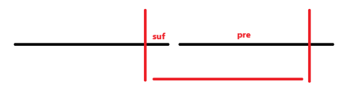

# Ad-hoc 题目的突破口

Ad Hoc类问题

前言：在程序设计竞赛的试题中，有这样一类试题，解题不能套用现成的算法，也没有模式化的求解方法，而是需要编程者自己设计算法来解答试题，这类试题被称作Ad Hoc类试题，也被称为杂题.

一方面，Ad Hoc类试题能够比较综合地反映编程者的智慧、知识基础和创造性思维的能力；

另一方面，求解Ad Hoc类试题的自创的算法只针对某个问题本身，探索该问题的独有性质，是一种专为解决某个特定的问题或完成某项特定的任务而设计的算法，因此Ad Hoc类试题的求解算法一般不具备普适意义和可推广性。

求解Ad Hoc类问题的方法多样，但按照数理分析和思维方式的角度，大致可分两大类：

机理分析法：采用顺向思维方式，从分析内部机理出发，顺推出求解算法

统计分析法：采用逆向思维方式，从分析部分解出发，倒推出求解算法

[ad-hoc 题目合集 - -Comρℓex- - 博客园](https://www.cnblogs.com/-Complex-/p/17555350.html)


## 例题 #1 Hack it!

小 X 最近遇到了下面的问题。

我们定义函数 $f(x)$ 为 $x$ 的各个数位之和。比如说，$f(1234)=1+2+3+4=10$。任务是，计算 $\sum_{i=l}^rf(i)\operatorname{mod} a$ 的值。

小 X 很快就解决了这个问题。于是小X锁定了这道题，然后开始 hack 别人。他看到了下面这段代码：

```C++
ans = solve(l, r) % a;
if (ans <= 0) ans += a;
```

显而易见地，这段代码会在 $\sum_{i=l}^rf(i)\equiv 0 \pmod a$ 时输出错误。小 X 会告诉你题目中的 $a$ 是多少，现在请你为小 X 构造一个 hack 数据。

输入格式

输入包括一行，即小 X 给定的 $a$ 的值（$1\le a\le 10^{18}$）

输出格式

输出两个整数：$L,R$，满足 $1\leq L\leq R\leq 10^{200}$，同时 $\sum_{i=l}^rf(i)\equiv 0 \pmod a$，即你构造的 hack 数据。

输入保证有解。

---

就是求一个l,r使得\sum_{i\in[l,r]}f(i) 是a的倍数。

我们发现无论如何我们都很难构造出一个合法的区间，因为f函数可以使用的性质实在是太少了。

于是我们需要找到突破口——从多个f的组合上来看。

我们要f的和为a的倍数，可以说单单的和是倍数，那么我们就需要考虑有没有什么关于a的倍数对称的f。

很明显没有，那么这个方法就应该告一段落（出题人肯定会让这个问题有解，并且是一个固定的方法——记忆化搜索除外）

那么还有就是区间内的f都是a的倍数——不太行。

那么还有一种情况——连续a个相同的f值。不太可能，对吧，但是我们可以发现对称性的f和值

即我们可以找到一个对称轴l，使得所有的f_{i+l+-1}+f_{l-i}相等。

我们发现这个对称轴就是10的任意次幂。

## 例题 #2 [POI2008] BBB-BBB

给定一个由 $+1$ 和 $-1$ 构成的长度为 $n$ 的序列，提供两种操作：

1. 将某一位取反，花销为 $x$；

2. 将最后一位移动到第一位，花销为 $y$。

要求最终 $p+S_n=q$，且 $p+S_i≥0\ (1≤i≤n)$，求最小花销。其中 $S_i=a_1+a_2+\cdots+a_i$。

---

一开始看没什么思路。发现操作2很像一个环，因此复制一份放在后面，枚举起点。

那么现在我们的序列就是原序列的一段后缀和其余前缀拼接得到的。我们2可以很轻松得到最终需要几个+几个-，问题在于我们需要满足任意前缀和≥0

也就是说我们要使得新序列的任意前缀和≥-p。

假设我们需要将k个-修改为+，那么我们大可以直接修改尽可能靠前的-。接下来我们就要考虑将一些+,-互换了。

我们考虑在我们将k个-翻转之间的新序列的前缀和的min。我们记为pmn。那么我们只需要经过一些翻转使得pmn中的最小值pmn_i≥-p就行了。证明如下：

- 首先因为pmn_i是最小的，不存在任何pmn_j<pmn_i

- 如果i之前存在pmn_j< -p，那么因为我们贪心地将靠前的-翻转为+，因此在处理pmn_i时也会处理pmn_j。但是这里有一个问题，就是是否存在一种情况，因为i,j之间的+，使得处理pmn_i时需要翻转的j前面的-比处理pmn_j时需要的更少。

    首先因为pmn_i≤pmn_j，所以i,j之间的-不会比+少。也就不存在“因为i,j之间的+，使得处理pmn_i时需要翻转的j前面的-比处理pmn_j时需要的更少”的可能了，只会更多。

- 如果i之后存在，那么我们既然处理了pmn_i，那么j处自然也就≥-p了。

因此我们要动态维护这个pmn_i。我们让区间从[n+1,2n]往前滑动，考虑我们处于一个中间状态下。



序列由一段后缀（suf）和一段前缀（pre）组成。

对于前缀部分，我们可以直接维护前缀min，注意加上后缀那段的偏移量，用suf记录偏移量。

对于后缀部分，怎么维护呢？其实就是一个前缀和的后缀最大值。加上我们已经求出smn_{i+1}，现在要求smn_i，那么要么就是a_i，要么就是smn_{i+1}+a_i。反正无论如何是从a_i开始的，a_i必选。

