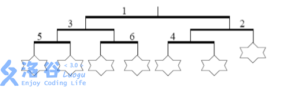
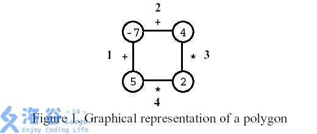
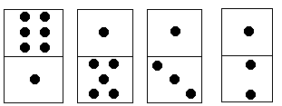

# DP及DP优化专题题单

## 目录

- 斜率优化DP

- 数位DP

- 树形依赖背包 DP

- 单调队列优化 DP

- 普通状压DP

- 普通树形DP

- 区间 DP

- 背包DP

- 线性DP

- 换根DP

## 其他内容（正在迁移到独立页面）

- AC自动机

- KMP板子的灵活运用

- 字符串哈希&字典树

- 数学

- 交互题

- 提交答案

- 二分图

- 数据结构

- 构造

- CDQ分治

---

按 ctrl+F 查找标题来快速跳到某个知识点。

# 斜率优化DP

P2365	任务安排	动态规划   cdq 分治    斜率优化           提高+/省选
P5017	[NOIP2018 普及组] 摆渡车	动态规划  枚举    深度优先搜索,DFS   斜率优化      提高+/省选
P5785	[SDOI2012] 任务安排	          动态规划  二分  单调队列   斜率优化             省选/NOI
P3628	[APIO2010] 特别行动队	动态规划  单调队列   斜率优化   前缀和     队列省选/NOI
P4360	[CEOI2004] 锯木厂选址	模拟  动态规划  单调队列  模拟退火, SA   斜率优化    省选/NOI

## [CEOI2004] 锯木厂选址

### 题目描述

从山顶上到山底下沿着一条直线种植了$n$棵老树。当地的政府决定把他们砍下来。为了不浪费任何一棵木材，树被砍倒后要运送到锯木厂。

木材只能朝山下运。山脚下有一个锯木厂。另外两个锯木厂将新修建在山路上。你必须决定在哪里修建这两个锯木厂，使得运输的费用总和最小。假定运输每公斤木材每米需要一分钱。

你的任务是编写一个程序，从输入文件中读入树的个数和他们的重量与位置，计算最小运输费用。

### 思路

暴力好好想，甚至看起来表示一道dp题目

强设dp，设f_{i,j}为考虑前i棵树，已经设了j个锯木厂的最小费用。

那么转移就是$f_{i,j}=\min(f_{i',j-1}+cost(i'+1,j)),cost(i'+1,j)$怎么写呢？

上面的转移错啦！

设f[i]表示当前第二个工厂修到第i棵树的位置时的最小花费，totsum表示所有树一开始全部运送的山脚下的花费，dis[i]表示距离的后缀和(因为我们是从上运到下面)，sum[i]表示树的重量的前缀和。我们枚举j，代表着在i,j处修了工厂，花费就变成了总花费totsum减去从j厂运到山脚的额外花费dis[j]∗sum[j]（这里可以认为原来需要把j厂的树全都运到山脚而现在不需要），再减去从i厂运到山脚下的额外花费dis[i]∗(sum[i]−sum[j])。

$f_i=\min（tot−dis_j·sum_j−dis_i·(sum_i−sum_j)),j<i$

拆开处理

$dis_j·sum_j=-dis_i·sum_j+tot-dis_i·sum_i-f_i$

于是我们的一次函数就是

- x:sum_j

- y:dis_j·sum_j

- k:-dis_i

- b:tot-dis_i·sum_i-f_i

- 我们要让f_i最小，就是要求b的最大值，所以维护上凸性即可。

---

```C++
/*
CB Ntsc111
*/

#include <bits/stdc++.h>
using namespace std;

#define ull unsigned int
#define pii pair<int, int>
#define pf to
#define ps second
#define int long long

#define err cerr << "Error"
#define rd read()

#define ot write
#define nl putchar('\n')
int read() {
  int xx = 0, ff = 1;
  char ch = getchar();
  while (ch < '0' || ch > '9') {
    if (ch == '-')
      ff = -1;
    ch = getchar();
  }
  while (ch >= '0' && ch <= '9')
    xx = xx * 10 + (ch - '0'), ch = getchar();
  return xx * ff;
}
void write(int out) {
  if (out < 0)
    putchar('-'), out = -out;
  if (out > 9)
    write(out / 10);
  putchar(out % 10 + '0');
}

const int mxxlog = 10;
int MOD = 1e18 + 7;
const int N = 1e6 + 9;

using namespace std;
int n;
int q[N], fi, la, ans = 2e9 + 1;
int sum, s[N], d[N], w[N];
double calc(int j, int k) {
  return 1.0 * (d[j] * s[j] - d[k] * s[k]) / (s[j] - s[k]);
}
int count(int i, int j) { return sum - d[j] * s[j] - d[i] * (s[i] - s[j]); }
signed main() {
  n = rd;
  for (int i = 1; i <= n; i++) {
    w[i] = rd, d[i] = rd;
  }
  for (int i = n; i >= 1; i--)
    d[i] += d[i + 1];
  for (int i = 1; i <= n; i++)
    s[i] = s[i - 1] + w[i], sum += d[i] * w[i];
  for (int i = 1; i <= n; i++) {
    while (fi < la && calc(q[fi], q[fi + 1]) > d[i])
      ++fi;
    ans = min(ans, count(i, q[fi]));
    while (fi < la && calc(q[la - 1], q[la]) < calc(q[la], i))
      --la;
    q[++la] = i;
  }
  cout << ans << endl;
  return 0;
}

```

### 输入格式

输入的第一行为一个正整数$n$——树的个数$(2≤n≤20000)$。树从山顶到山脚按照$1,2,...,n$标号。

接下来$n$行，每行有两个正整数（用空格分开）。

第$i+1$行含有：$w_i$——第$i$棵树的重量（公斤为单位）和 $d_i$——第$i$棵树和第$i+1$棵树之间的距离，$1≤w_i≤10000,0≤d_i≤10000$。

最后一颗树的$d_n$，表示第$n$棵树到山脚的锯木厂的距离。保证所有树运到山脚的锯木厂所需要的费用小于$2×10^9$分。

### 输出格式

输出最小的运输费用。

### 样例 #1

#### 样例输入 #1

```C++
9 
1 2 
2 1 
3 3 
1 1 
3 2 
1 6 
2 1 
1 2 
1 1
```

#### 样例输出 #1

```C++
26
```

### 提示

样例图示

黑点为锯木厂


本题共有$13$个测试点，每个测试点的数据范围如下

测试点$1-5:n≤200$；

测试点$6-7:n≤1000$；

测试点$7-13:n≤20000$；

## [APIO2010] 特别行动队

### 题目描述

你有一支由 $n$ 名预备役士兵组成的部队，士兵从 $1$ 到 $n$ 编号，你要将他们拆分成若干特别行动队调入战场。出于默契的考虑，同一支特别行动队中队员的编号**应该连续**，即为形如 $(i, i + 1, \cdots i + k)$的序列。所有的队员都应该属于且仅属于一支特别行动队。

编号为 $i$ 的士兵的初始战斗力为 $x_i$ ，一支特别行动队的初始战斗力 $X$ 为队内士兵初始战斗力之和，即 $X = x_i + x_{i+1} + \cdots + x_{i+k}$。

通过长期的观察，你总结出对于一支初始战斗力为 $X$ 的特别行动队，其修正战斗力 $X'= aX^2+bX+c$，其中 $a,~b,~c$ 是已知的系数（$a < 0$）。 作为部队统帅，现在你要为‘这支部队进行编队，使得所有特别行动队的修正战斗力之和最大。试求出这个最大和。

### 思路

首先考虑暴力dp

设f_{i}为将前i个士兵分组后的最大战斗力。那么转移我们只需要枚举一个j表示[j+1,i]属于同一个行动队即可。

$f_{i}=\max(f_j+cost(j+1,i)),cost(j+1,i)=X'$按给出的计算即可。

上面的是O(n^2)的，下面考虑优化。

先去掉\max，变成


随着i的转移，我们要舍去左边的一些点，此时我们就需要在单调队列中弹出这些点。

我们知道我们这里要维护上凸性，所以对于一个点j，其连线i→j+1的斜率若大于截线的斜率，那么j一定不会被优先截到，所以不断弹出这样的j。最后保留在优先队列头部的那个点就是当前i的最优j了。

---

std

```C++
/*
CB Ntsc111
*/

#include <bits/stdc++.h>
using namespace std;

#define ull unsigned int
#define pii pair<int, int>
#define pf to
#define ps second
#define int long long

#define err cerr << "Error"
#define rd read()

#define ot write
#define nl putchar('\n')
int read() {
  int xx = 0, ff = 1;
  char ch = getchar();
  while (ch < '0' || ch > '9') {
    if (ch == '-')
      ff = -1;
    ch = getchar();
  }
  while (ch >= '0' && ch <= '9')
    xx = xx * 10 + (ch - '0'), ch = getchar();
  return xx * ff;
}
void write(int out) {
  if (out < 0)
    putchar('-'), out = -out;
  if (out > 9)
    write(out / 10);
  putchar(out % 10 + '0');
}

const int M = 800;
const int mxxlog = 10;
int MOD = 1e18 + 7;
const int N = 1e6 + 9;

#define k(A) (2 * a * s[A])
#define x(A) s[A]
#define b(A) (d[A] - a * s[A] * s[A] - b * s[A] - c)
#define y(A) (d[A] + a * s[A] * s[A] - b * s[A])
int d[N], s[N];
int q[N], n, a, b, c;
double slope(int i, int j) { return 1.0 * (y(i) - y(j)) / (x(i) - x(j)); }
signed main() {
  n = rd, a = rd, b = rd, c = rd;
  s[0] = q[0] = d[0] = 0;
  for (int i = 1; i <= n; i++) {
    int x = rd;
    s[i] = s[i - 1] + x;
  }
  int head = 0, tail = 0;
  for (int i = 1; i <= n; i++) {
    while (head < tail && slope(q[head], q[head + 1]) > k(i))
      head++;
    d[i] = -(k(i) * x(q[head]) - y(q[head]) - a * s[i] * s[i] - b * s[i] - c);
    while (head < tail && slope(q[tail - 1], q[tail]) <= slope(q[tail], i))
      tail--;
    q[++tail] = i;
  }
  cout << d[n] << endl;
}

```

### 输入格式

输入的第一行是一个整数 $n$，代表士兵的人数。

输入的第二行有三个用空格隔开的整数，依次代表 $a,~b,~c$，即修正战斗力的系数。

输入的第三行有 $n$ 个用空格隔开的整数，第 $i$ 个整数代表编号为 $i$ 的士兵的初始战斗力 $x_i$。

### 输出格式

输出一行一个整数，代表最大的所有特别行动队战斗力之和。

### 样例 #1

#### 样例输入 #1

```C++
4 
-1 10 -20 
2 2 3 4
```

#### 样例输出 #1

```C++
9
```

### 提示

#### 样例输入输出 $1$ 解释

你有 $4$ 名士兵，$x_1 = 2,~x_2 = 2,~x_3 = 3,~x_4=4$。修正战斗力公式中的参数为  $a = -1,~b = 10,~c = -20$。

此时，最佳方案是将士兵组成 $3$ 个特别行动队：第一队包含士兵 $1$ 和士兵 $2$，第二队包含士兵 $3$，第三队包含士兵 $4$。特别行动队的初始战斗力分别为 $4,~3,~4$，修正后的战斗力分别为 $-4^2 + 10 \times 4 -20 = 4$，$-3^2 + 10 \times 3 - 20 = 1$，$-4^2 + 10 \times 4 -20 = 4$。修正后的战斗力和为 $4 + 1 + 4 = 9$，没有其它方案能使修正后的战斗力和更大。

#### 数据范围与约定

对于 $20\%$ 的数据，$n \leq 10^3$。

对于 $50\%$ 的数据，$n \leq 10^4$

对于 $100\%$ 的数据，$1 \leq n \leq 10^6$，$-5 \leq a \leq -1$，$-10^7 \leq b \leq 10^7$，$-10^7 \leq c \leq 10^7$，$1 \leq x_i \leq 100$。

## [SDOI2012] 任务安排

### 题目描述

机器上有 $n$ 个需要处理的任务，它们构成了一个序列。这些任务被标号为 $1$ 到 $n$，因此序列的排列为 $1 , 2 , 3 \cdots n$。这 $n$ 个任务被分成若干批，每批包含相邻的若干任务。从时刻 $0$ 开始，这些任务被分批加工，第 $i$ 个任务单独完成所需的时间是 $T_i$。在每批任务开始前，机器需要启动时间 $s$，而完成这批任务所需的时间是各个任务需要时间的总和。

**注意，同一批任务将在同一时刻完成**。每个任务的费用是它的完成时刻乘以一个费用系数 $C_i$。

请确定一个分组方案，使得总费用最小。

### 思路

这里真的需要斜率优化了。

设f_{i,j}为前i个任务，分成j组需要的时间。那么这个的转移也是很简单，但也是O(n^3)。但是这比较容易优化，我们可以从j入手

我们回顾上面的状态转移方程，可以发现j在其中的作用仅仅是计算要加多少个启动时间而已。所以我们要想办法不通过j而计算出启动时间。

很抱歉，做不到。但是很显然，每多一个任务分组，后续任务的结束时间必定会延迟s秒。这会造成后续的费用多出(sumf[n]−sumf[l−1])\times s,我们可以将其提前加在dp[i]里

所以，最终dp[i]表示（前i个任务分成若干组后的费用+分成若干组后多出的后续费用）的最小值

状态转移式为：

$f_i=\min(f_i,f_{l-1}+cost(i,l)),cost(i,l)=sumt_i(sumf_i−sumf_{l−1})+s(sumf_n−sumf_{l-1})$

那么怎么样继续优化呢？

我们把min去掉，化简一下得到：

$dp[j]=(s+sumt[i])×sumf[j]+dp[i]−sumt[i]×sumf[i]−s×sumf[n]$

这是个dp[j]关于sumf[j]一次函数，这个函数的参数如下

- x:sumf[j]

- y:dp[j]

- b=dp[i]−sumt[i]×sumf[i]−s×sumf[n]，即截距

- k:s+sumt[i]

我们最终的目的是找到f[i]的最小值，其实就是找截距b的最小值。并且因为x:sumf[j]且y:dp[j]，那么我们就可以把j点表示在xOy(x:sumf[j]且y:dp[j])上。
****我们在坐标系内画出f[j]与sumf[j]的散点图，用一条斜率为k的直线自下而上进行平移，第一次接触到一个点的时候就得到了最小截距。那么这个点对应的j就是可以得到$f_i=\min(f_i,f_{l-1}+cost(i,l)),cost(i,l)=sumt_i(sumf_i−sumf_{l−1})+s(sumf_n−sumf_{l-1})$的那个j。

所以我们只需要找到一个方法，快速求出这个j即可。

我们结合图像来看看。


在维护了斜率递增的下凸壳后我们发现，只有斜率大于红色直线的才有用（打勾的线段），结合斜率的单调性，我们发现这个可以使用单调队列来维护。


单调队列维护的方式类似下图


本题中我们不需要考虑j过时无效的问题，即使需要，也是单调队列的强项了。

那么现在我们就可以快速求出j的值了。单调队列记录每一个点的j值即可了。

---

std

注意有一个决策点为0

```C++
/*
CB Ntsc111
*/

#include <bits/stdc++.h>
using namespace std;

#define ull unsigned int
#define pii pair<int, int>
#define pf to
#define ps second
#define int long long

#define err cerr << "Error"
#define rd read()

#define ot write
#define nl putchar('\n')
int read() {
  int xx = 0, ff = 1;
  char ch = getchar();
  while (ch < '0' || ch > '9') {
    if (ch == '-')
      ff = -1;
    ch = getchar();
  }
  while (ch >= '0' && ch <= '9')
    xx = xx * 10 + (ch - '0'), ch = getchar();
  return xx * ff;
}
void write(int out) {
  if (out < 0)
    putchar('-'), out = -out;
  if (out > 9)
    write(out / 10);
  putchar(out % 10 + '0');
}

const int M = 800;
const int mxxlog = 10;
int MOD = 1e18 + 7;
const int N = 1e6 + 9;

int l = 1, r = 0;
int sc[N], st[N], f[N], n, s, q[N];
int Y(int p) { return f[p]; }
int X(int p) { return sc[p]; }
int K(int p) { return s + st[p]; }
int div(int L, int R, long long S) {
  int M = 0, Res = r;
  while (L <= R) {
    M = (L + R) >> 1;
    if (Y(q[M + 1]) - Y(q[M]) > S * (X(q[M + 1]) - X(q[M])))
      R = M - 1, Res = M;
    else
      L = M + 1;
  }
  return q[Res];
}
signed main() {
  n = rd, s = rd;
  for (int i = 1; i <= n; ++i) {
    (st[i] = rd) += st[i - 1];
    (sc[i] = rd) += sc[i - 1];
  }
  q[++r] = 0;
  for (int i = 1; i <= n; ++i) {
    int p = div(l, r, K(i));
    f[i] = f[p] + s * (sc[n] - sc[p]) + st[i] * (sc[i] - sc[p]);
    while (l < r && (Y(q[r]) - Y(q[r - 1])) * (X(i) - X(q[r])) >=
                        (Y(i) - Y(q[r])) * (X(q[r]) - X(q[r - 1])))
      --r;
    q[++r] = i;
  }
  printf("%lld\n", f[n]);
  return 0;
}

```

### 输入格式

第一行一个整数 $n$。
第二行一个整数 $s$。

接下来 $n$ 行，每行有一对整数，分别为 $T_i$ 和 $C_i$，表示第 $i$ 个任务单独完成所需的时间是 $T_i$ 及其费用系数 $C_i$。

### 输出格式

一行，一个整数，表示最小的总费用。

### 样例 #1

#### 样例输入 #1

```C++
5
1
1 3
3 2
4 3
2 3
1 4
```

#### 样例输出 #1

```C++
153
```

### 提示

对于 $100\%$ 数据，$1 \le n \le 3 \times 10^5$，$1 \le s \le 2^8$，$ \left| T_i \right| \le 2^8$，$0 \le C_i \le 2^8$。

## [NOIP2018 普及组] 摆渡车

### 题目背景

NOIP2018 普及组 T3

### 题目描述

有 $n$ 名同学要乘坐摆渡车从人大附中前往人民大学，第 $i$ 位同学在第 $t_i$ 分钟去 等车。只有一辆摆渡车在工作，但摆渡车容量可以视为无限大。摆渡车从人大附中出发、 把车上的同学送到人民大学、再回到人大附中（去接其他同学），这样往返一趟总共花费 $m$ 分钟（同学上下车时间忽略不计）。摆渡车要将所有同学都送到人民大学。

凯凯很好奇，如果他能任意安排摆渡车出发的时间，那么这些同学的等车时间之和最小为多少呢？

注意：摆渡车回到人大附中后可以即刻出发。

### 思路

设f_{i,j}为考虑到第i个人，车往返j次，等车时间的最小值。

那么我们看看转移，转移时我们枚举上一次车什么时候出发，在那之后的同学都要等待到最后一个同学到来，即

$f_{i,j}=\min(f_{i',j-1}+cost(i'+1,i)),cost(i'+1,i)=t_i\times (i-i')-\sum\limits_{j=i'+1}^i t_j+\max(0,m-t_i+t_i')\times (i-i')$

这样的时间复杂度是O(n^3)，其实也能过。

### 输入格式

第一行包含两个正整数 $n, m$，以一个空格分开，分别代表等车人数和摆渡车往返一趟的时间。
第二行包含 $n$ 个正整数，相邻两数之间以一个空格分隔，第 $i$ 个非负整数 $t_i$ 代表第 $i$ 个同学到达车站的时刻。

### 输出格式

输出一行，一个整数，表示所有同学等车时间之和的最小值（单位：分钟）。

### 样例 #1

#### 样例输入 #1

```Plain Text
5 1 
3 4 4 3 5
```

#### 样例输出 #1

```Plain Text
0
```

### 样例 #2

#### 样例输入 #2

```Plain Text
5 5 
11 13 1 5 5
```

#### 样例输出 #2

```Plain Text
4
```

### 提示

**样例 1 说明**

同学 $1$ 和同学 $4$ 在第 $3$ 分钟开始等车，等待 $0$ 分钟，在第 $3$ 分钟乘坐摆渡车出发。摆渡车在第 $4$ 分钟回到人大附中。
同学 $2$ 和同学 $3$ 在第 $4$ 分钟开始等车，等待 $0$ 分钟，在第 $4$ 分钟乘坐摆渡车 出发。摆渡车在第 $5$ 分钟回到人大附中。
同学 $5$ 在第 $5$ 分钟开始等车，等待 $0$ 分钟，在第 $5$ 分钟乘坐摆渡车出发。自此 所有同学都被送到人民大学。总等待时间为 $0$。

**样例 2 说明**

同学 $3$ 在第 $1$ 分钟开始等车，等待 $0$ 分钟，在第 $1$ 分钟乘坐摆渡车出发。摆渡 车在第 $6$ 分钟回到人大附中。
同学 $4$ 和同学 $5$ 在第 $5$ 分钟开始等车，等待 $1$ 分钟，在第 $6$ 分钟乘坐摆渡车 出发。摆渡车在第 $11$ 分钟回到人大附中。
同学 $1$ 在第 $11$ 分钟开始等车，等待 $2$ 分钟；同学 $2$ 在第 $13$ 分钟开始等车， 等待 $0$ 分钟。他/她们在第 $13$ 分钟乘坐摆渡车出发。自此所有同学都被送到人民大学。 总等待时间为 $4$。
可以证明，没有总等待时间小于 $4$ 的方案。

**数据规模与约定**

对于 $10\%$ 的数据，$n ≤ 10$，$m = 1$，$0 ≤ t_i ≤ 100$。
对于 $30\%$ 的数据，$n ≤ 20$，$m ≤ 2$，$0 ≤ t_i ≤ 100$。
对于 $50\%$ 的数据，$n ≤ 500$，$m ≤ 100$，$0 ≤ t_i ≤ 10^4$。
另有 $20\%$ 的数据，$n ≤ 500$，$m ≤ 10$，$0 ≤ t_i ≤ 4 \times  10^6$。
对于 $100\%$ 的数据，$n ≤ 500$，$m ≤ 100$，$0 ≤ t_i ≤ 4 \times 10^6$。

## 任务安排

### 题目描述

$n$ 个任务排成一个序列在一台机器上等待完成（顺序不得改变），这 $n$ 个任务被分成若干批，每批包含相邻的若干任务。

从零时刻开始，这些任务被分批加工，第 $i$ 个任务单独完成所需的时间为 $t_i$。在每批任务开始前，机器需要启动时间 $s$，而完成这批任务所需的时间是各个任务需要时间的总和（同一批任务将在同一时刻完成）。

每个任务的费用是它的完成时刻乘以一个费用系数 $f_i$。请确定一个分组方案，使得总费用最小。

### 思路

先看暴力。设f_{i,j}为考虑到第i个任务，第[j,i]个任务是同一批的。

那么转移就是

$f_{i,j}=\min(f_{j-1,k}+cost(i,j)+s),cost(i,j)=\sum f \times i$

可是这样是O(n^3)的，我们要考虑优化

换一个定义，我们设f_{i,j}为前i个任务，分成j组需要的时间。那么这个的转移也是很简单，但也是O(n^3)。但是这比较容易优化，我们可以从j入手

我们回顾上面的状态转移方程，可以发现j在其中的作用仅仅是计算要加多少个启动时间而已。所以我们要想办法不通过j而计算出启动时间。

很抱歉，做不到。但是很显然，每多一个任务分组，后续任务的结束时间必定会延迟s秒。这会造成后续的费用多出(sumf[n]−sumf[l−1])\times s,我们可以将其提前加在dp[i]里

所以，最终dp[i]表示（前i个任务分成若干组后的费用+分成若干组后多出的后续费用）的最小值

状态转移式为：

```C++
dp[i]=min(dp[i],dp[l−1]+sumt[i]∗(sumf[i]−sumf[l−1])+s∗(sumf[n]−sumf[l−1]))(1<=l<=i)
```

这就是**费用提前计算**的思想，时间复杂度来到了O(n^2)

---

```C++

```

### 输入格式

第一行一个正整数 $n$。
第二行是一个整数 $s$。

下面 $n$ 行每行有一对数，分别为 $t_i$ 和 $f_i$，表示第 $i$ 个任务单独完成所需的时间是 $t_i$ 及其费用系数 $f_i$。

### 输出格式

一个数，最小的总费用。

### 样例 #1

#### 样例输入 #1

```Plain Text
5
1
1 3
3 2
4 3
2 3
1 4
```

#### 样例输出 #1

```Plain Text
153
```

### 提示

【数据范围】
对于 $100\%$ 的数据，$1\le n \le 5000$，$0 \le s \le 50$，$1\le t_i,f_i \le 100$。

【样例解释】
如果分组方案是 $\{1,2\},\{3\},\{4,5\}$，则完成时间分别为 $\{5,5,10,14,14\}$，费用 $C=15+10+30+42+56$，总费用就是 $153$。

# 数位DP

`adove` 大佬给出的数位dp模板

```Plain Text
dfs(数的最后若干位,各种限制条件,当前第几位)
	if 最后一位
    	return 各种限制条件下的返回值
    局部变量 ct=当前位的数字
    局部变量 sum=0;
    for i=0 to ct-1
    	sum+=当前位取i时一定无无限制的合法状态数
        sum+=当前位取i时满足当前限制的合法状态数
    根据ct更新限制条件 不再满足则return sum
    return sum+dfs(当前位后的若干位,更新后的限制条件,下一位)

cal(当前数)
	if(只有一位) return 对应的贡献
    局部变量 ct;
    for ct=可能最高位 to 1
    	if 当前位有数字 break
    局部变量 nw=当前位数字
    局部变量 sum=0
    for i=1 to nw-1
    	sum+=当前位取i后合法情况任意取的贡献
    for i=1 to ct-1
    	for j=1 to 9
        	sum+=第i位取j后合法情况任意取的贡献
    sum+=dfs(去掉第一位后的若干位,限制条件,第二位)
    return sum

main
	预处理当前位取i的各种条件各种限制的贡献
    读入 L R
    输出 cal(R)-cal(L-1)
    return 0

```

P4999	烦人的数学作业	数位DP           普及+/提高
P2602	[ZJOI2010] 数字计数	   动态规划  递推   深度优先搜索,DFS   数位 dp       普及+/提高
P1836	数页码	       普及+/提高
P6218	[USACO06NOV] Round Numbers S	数位 dp           提高+/省选
P2657	[SCOI2009] windy 数	             动态规划    数位 dp               提高+/省选
P4317	花神的数论题	枚举    数位 dp   进制                         提高+/省选
P4124	[CQOI2016] 手机号码	               动态规划   数位 dp              提高+/省选

## [CQOI2016] 手机号码

### 题目描述

人们选择手机号码时都希望号码好记、吉利。比如号码中含有几位相邻的相同数字、不含谐音不吉利的数字等。手机运营商在发行新号码时也会考虑这些因素，从号段中选取含有某些特征的号码单独出售。为了便于前期规划，运营商希望开发一个工具来自动统计号段中满足特征的号码数量。

工具需要检测的号码特征有两个：号码中要出现至少 $3$ 个相邻的相同数字；号码中不能同时出现 $8$ 和 $4$。号码必须同时包含两个特征才满足条件。满足条件的号码例如：13000988721、23333333333、14444101000。而不满足条件的号码例如：1015400080、10010012022。

手机号码一定是 $11$ 位数，且不含前导的 $0$。工具接收两个数 $L$ 和 $R$，自动统计出 $[L,R]$ 区间内所有满足条件的号码数量。$L$ 和 $R$ 也是 $11$ 位的手机号码。

### 思路

不是特别简单，但又不是特别难。

还是考虑分叉

- 当前位不是限制位，那么[1,i-1]中可以随便填。这里要注意几个限制，即[N,i]中已经填了的那些数字。
首先先不考虑[N,i]中的数字，那么首先枚举相邻的相同数字个数的做法候选人会有重复，所以我们就用容斥原理（其实也不简单）

我们发现好像普通的dp模板没有用了，不是说这种分叉的模式不对，只是我们的转移变得复杂了（或者说要记录的信息要增加了）

看题解的意思是我们不直接在当前位不是限制位的时候直接计计算贡献，而是继续dp下去，可以理解为没有优化的数位dp。但显然还是需要一些剪枝的比如记忆化搜索。

dp状态定义如下

```Plain Text
a:p+1位是多少
b:p+2位是多少,若是前导0的话是-1
c:之前是否已经出现连续三个相同的数字
d:之前是否已经保证x<n
_4:是否出现过4
_8:是否出现过8
```

```C++
// Problem: P4124 [CQOI2016] 手机号码
// Contest: Luogu
// URL: https://www.luogu.com.cn/problem/P4124
// Memory Limit: 250 MB
// Time Limit: 1000 ms
// Challenger: Erica N
// ----
#include<bits/stdc++.h>

using namespace std;
#define rd read()
#define ull unsigned long long
#define int long long 
#define itn int
#define ps second 
#define pf first

int  read(){
	int x;
	cin>>x;
	return x;
}
#define zerol = 1
#ifdef zerol
#define cdbg(x...) do { cerr << #x << " -> "; err(x); } while (0)
void err() {
	cerr << endl;
}
template<template<typename...> class T, typename t, typename... A>
void err(T<t> a, A... x) {
	for (auto v: a) cerr << v << ' ';
	err(x...);
}
template<typename T, typename... A>
void err(T a, A... x) {
	cerr << a << ' ';
	err(x...);
}
#else
#define dbg(...)
#endif
const int N=3e6+5;
const ull P=137;
const int INF=1e9+7;
/*

策略


*/

int f[12][12][12][2][2][2][2];//考虑前i位，有无4，有无8，
int num[22];


#define cur f[x][n3][n2][hav][_4][_8][lim]

int dfs(int x,int n3,int n2,int hav,int _4,int _8,int lim){
	if(~cur)return cur;
	
	if(x==0){
		if(_4&&_8)return cur=0;
		if(!hav)return cur=0;
		return cur=1;
	}
	
	cur=0;//!
	
	int mx=lim?num[x]:9;
	for(int i=0;i<=mx;i++){
		cur+=dfs(x-1,n2,i,hav||(n3==n2&&n2==i),_4||i==4,_8||i==8,lim&&i==num[x]);
	}
	
	return cur;
}

int solve(int x){
	for(int i=1;i<=11;i++){
		num[i]=x%10;
		x/=10;
	}
	int ans=0;
	
	for(int i=1;i<num[11];i++){
		memset(f,-1,sizeof f);
		ans+=dfs(10,-1,i,0,i==4,i==8,0);
	}
	memset(f,-1,sizeof f);
	if(num[11]>0)ans+=dfs(10,-1,num[11],0,num[11]==4,num[11]==8,1);
	cdbg(ans);
	return ans;
}

signed main(){
	int l=rd,r=rd;
	cout<<solve(r)-solve(l-1)<<endl;
}


```

### 输入格式

输入文件内容只有一行，为空格分隔的 $2$ 个正整数 $L,R$。

### 输出格式

输出文件内容只有一行，为 $1$ 个整数，表示满足条件的手机号数量。

### 提示

样例解释：满足条件的号码： 12121285000、 12121285111、 12121285222、 12121285333、 12121285550。

数据范围：$10^{10}\leq L\leq R<10^{11}$。

## [USACO06NOV] Round Numbers S

### 题目描述

如果一个正整数的二进制表示中，$0$ 的数目不小于 $1$ 的数目，那么它就被称为「圆数」。

例如，$9$ 的二进制表示为 $1001$，其中有 $2$ 个 $0$ 与 $2$ 个 $1$。因此，$9$ 是一个「圆数」。

请你计算，区间 $[l,r]$ 中有多少个「圆数」。

### 思路

数位dp写多了，就觉得比较简单。

考虑分叉

- 当前位是非限制位，那么[1,i-1]位就可以随便填。那么考虑[i,N]中已经有的1的个数（设为k），并且找到位数最高的那个1（依赖确定这个数0和1的个数，设这个是的位数为t位），那么就可以计算出1的个数应该是[0,t/2]，那么在[1,i-1]中可用的1的个数就是L=t/2-k，那么在当前限制下这样的数字的个数就是\sum\limits_{j=0}^{L}C_{i-1}^{j}，可以暴力循环。

- 当前位是限制位，直接往下。

---

```C++
/*                                                                                
                      Keyblinds Guide
     				###################
      @Ntsc 2024

      - Ctrl+Alt+G then P : Enter luogu problem details
      - Ctrl+Alt+B : Run all cases in CPH
      - ctrl+D : choose this and dump to the next
      - ctrl+Shift+L : choose all like this
      - ctrl+K then ctrl+W: close all
      - Alt+la/ra : move mouse to pre/nxt pos'
	  
*/
#include <bits/stdc++.h>
#include <queue>
using namespace std;

#define rep(i, l, r) for (int i = l, END##i = r; i <= END##i; ++i)
#define per(i, r, l) for (int i = r, END##i = l; i >= END##i; --i)
#define pb push_back
#define mp make_pair
#define int long long
#define ull unsigned long long
#define pii pair<int, int>
#define ps second
#define pf first

// #define innt int
#define itn int
// #define inr intw
// #define mian main
// #define iont int

#define rd read()
int read(){
    int xx = 0, ff = 1;
    char ch = getchar();
    while (ch < '0' || ch > '9') {
		if (ch == '-')
			ff = -1;
		ch = getchar();
    }
    while (ch >= '0' && ch <= '9')
      xx = xx * 10 + (ch - '0'), ch = getchar();
    return xx * ff;
}
void write(int out) {
	if (out < 0)
		putchar('-'), out = -out;
	if (out > 9)
		write(out / 10);
	putchar(out % 10 + '0');
}

#define ell dbg('\n')
const char el='\n';
const bool enable_dbg = 1;
template <typename T,typename... Args>
void dbg(T s,Args... args) {
	if constexpr (enable_dbg){
    cerr << s;
    if(1)cerr<<' ';
		if constexpr (sizeof...(Args))
			dbg(args...);
	}
}

#define zerol = 1
#ifdef zerol
#define cdbg(x...) do { cerr << #x << "\ -> "; err(x); } while (0)
void err() { cerr << endl; }
template<template<typename...> class T, typename t, typename... A>
void err(T<t> a, A... x) { for (auto v: a) cerr << v << ' '; err(x...); }
template<typename T, typename... A>
void err(T a, A... x) { cerr << a << ' '; err(x...); }
#else
#define dbg(...)
#endif


const int N = 3e5 + 5;
const int INF = 1e18;
const int M = 33;
const int MOD = 1e9 + 7;


int a[N];
int vis[33][111];
int f[33][111];

int dfs(bool lim,bool up,int x,int diff){// 是否可以取最大数位，是否是前导0，x，差值+M
    if(!x)return diff-M>=0;
    if(!lim&&!up&&vis[x][diff])return f[x][diff];

    int res=0;
    int upp=lim?a[x]:1;
    for(int i=0;i<=upp;i++){
        res+=dfs(lim&(i==a[x]),up&(i==0),x-1,diff+(i==0?(up?0:1):-1));
    }
    if(!lim&&!up)vis[x][diff]=1,f[x][diff]=res;
    return res;
}

int solve(int x){
    int len=0;
    while(x){
        a[++len]=x&1;
        x>>=1;
    }
    return dfs(1,1,len,0+M);
}

void solve(){
    int l=rd,r=rd;
    cout<<solve(r)-solve(l-1)<<endl;
}

signed main() {
    // freopen(".in","r",stdin);
    // freopen(".in","w",stdout);

    int T=1;
    while(T--){
    	solve();
    }
    return 0;
}
```

### 输入格式

一行，两个整数 $l,r$。

### 输出格式

一行，一个整数，表示区间 $[l,r]$ 中「圆数」的个数。

### 提示

**【数据范围】**

对于 $100\%$ 的数据，$1\le l,r\le 2\times 10^9$。

---

**【样例说明】**

区间 $[2,12]$ 中共有 $6$ 个「圆数」，分别为 $2,4,8,9,10,12$。

## [ZJOI2010] 数字计数

### 题目描述

给定两个正整数 $a$ 和 $b$，求在 $[a,b]$ 中的所有整数中，每个数码(digit)各出现了多少次。

### 思路

典型的数位dp了。首先明确满足前缀和性质，然后看看分叉：

- 当前位不是限制位：那么[1,i-1]位都可以随便填。首先加上[i,N]的单独贡献，然后考虑[1,i-1]对每一个数都可以做出的贡献为\sum\limits_{j=1}^{i-1} j\times C_{i-1}^{j}，暴力枚举循环即可。和下面那道“烦人的数学作业”很像。

- 当前位是限制位，继续往下。

---

```C++
/*
CB Ntsc111
*/

#include <bits/stdc++.h>
using namespace std;

#define uint unsigned int
#define pii pair<int, int>
#define pf to
#define ps second
#define int long long

#define err cerr << "Error"
#define rd read()

#define ot write
#define nl putchar('\n')
int read() {
  int xx = 0, ff = 1;
  char ch = getchar();
  while (ch < '0' || ch > '9') {
    if (ch == '-')
      ff = -1;
    ch = getchar();
  }
  while (ch >= '0' && ch <= '9')
    xx = xx * 10 + (ch - '0'), ch = getchar();
  return xx * ff;
}
void write(int out) {
  if (out < 0)
    putchar('-'), out = -out;
  if (out > 9)
    write(out / 10);
  putchar(out % 10 + '0');
}

const int M = 800;
const int mxxlog = 10;
int MOD = 1e9 + 57;
const int N = 1000100;

int a, b, n;
int num[105];
int dp[30][1000][9];
int dfs(int pos, int sum, bool lim, bool h, int d) {
  if (pos == -1) {
    return sum;
  }
  if (!lim && !h && ~dp[pos][sum][d])
    return dp[pos][sum][d];
  int End, ans = 0;
  End = lim ? num[pos] : 9;
  for (int i = 0; i <= End; ++i)
    ans += dfs(pos - 1, sum + ((!h || i) && i == d), lim && i == num[pos],
               h && i == 0, d);
  if (!lim && !h)
    dp[pos][sum][d] = ans;
  return ans;
}
int cal(int x, int d) {
  memset(dp, -1, sizeof(dp));
  int pos = 0;
  while (x) {
    num[pos++] = x % 10;
    x /= 10;
  }
  return dfs(pos - 1, 0, 1, 1, d);
}
signed main() {
  a = rd, b = rd;
  for (int i = 0; i <= 9; ++i)
    printf("%lld ", cal(b, i) - cal(a - 1, i));
  return 0;
}

```

### 输入格式

仅包含一行两个整数 $a,b$，含义如上所述。

### 输出格式

包含一行十个整数，分别表示 $0\sim 9$ 在 $[a,b]$ 中出现了多少次。

### 提示

#### 数据规模与约定

- 对于 $30\%$ 的数据，保证 $a\le b\le10^6$；

- 对于 $100\%$ 的数据，保证 $1\le a\le b\le 10^{12}$。

## 花神的数论题

### 题目背景

众所周知，花神多年来凭借无边的神力狂虐各大 OJ、OI、CF、TC …… 当然也包括 CH 啦。

### 题目描述

话说花神这天又来讲课了。课后照例有超级难的神题啦…… 我等蒟蒻又遭殃了。 花神的题目是这样的：设  $\text{sum}(i)$  表示  $i$  的二进制表示中  $1$  的个数。给出一个正整数  $N$  ，花神要问你  $\prod_{i=1}^{N}\text{sum}(i)$ ，也就是  $\text{sum}(1)\sim\text{sum}(N)$  的乘积。

### 思路

如果是和那么就简单多了。可是这里是乘积。考虑乘积。按照数位dp的常规套路，分叉

- 当前位不是限制位，那么后面[1,i-1]位（这里是二进制位）都可以随便填。设[i,N]中有k个1，那么所有情况对答案的贡献（这里的答案的贡献是要乘上答案的）是$\prod(k+j)^{C_{i-1}^{j}}$这里暴力循环j即可，j最多不超过60的。

- 是限制位，往下。

---

这里给出一种代码更短的写法


---

std

```C++
/*
CB Ntsc111
*/

#include <bits/stdc++.h>
using namespace std;

#define ull unsigned int
#define pii pair<int, int>
#define pf to
#define ps second
#define int long long

#define err cerr << "Error"
#define rd read()

#define ot write
#define nl putchar('\n')
int read() {
  int xx = 0, ff = 1;
  char ch = getchar();
  while (ch < '0' || ch > '9') {
    if (ch == '-')
      ff = -1;
    ch = getchar();
  }
  while (ch >= '0' && ch <= '9')
    xx = xx * 10 + (ch - '0'), ch = getchar();
  return xx * ff;
}
void write(int out) {
  if (out < 0)
    putchar('-'), out = -out;
  if (out > 9)
    write(out / 10);
  putchar(out % 10 + '0');
}

const int M = 800;
const int mxxlog = 10;
int MOD = 1e9 + 57;
const int N = 1000100;

int x[55], cnt = 0;

int f[55][2][55][55], res[55], n, p = 1e7 + 7;
int ksm(int a, int b) {
  int ans = 1;
  while (b)
    ans = ans * (b & 1 ? a : 1) % p, a = a * a % p, b >>= 1;
  return ans;
}
int dp(int cur, int up, int tmp, int d) {
  if (!cur)
    return tmp == d;
  if (~f[cur][up][tmp][d])
    return f[cur][up][tmp][d];
  int lim = up ? x[cur] : 1;
  int ans = 0;
  for (int i = 0; i <= lim; i++)
    ans += dp(cur - 1, up && i == lim, tmp + (i == 1), d);
  return f[cur][up][tmp][d] = ans;
}

signed main() {
  n = rd;
  while (n)
    x[++cnt] = n & 1, n >>= 1;
  for (int i = 1; i <= 50; i++)
    memset(f, -1, sizeof(f)), res[i] = dp(cnt, 1, 0, i);
  int ans = 1;
  for (int i = 1; i <= 50; i++)
    ans = ans * ksm(i, res[i]) % p;
  cout << ans;
  return 0;
}

```

### 输入格式

一个正整数 $N$。

### 输出格式

一个数，答案模 $10000007$ 的值。

### 提示

对于 $100\%$ 的数据，$1\le N\le 10^{15}$。

## 烦人的数学作业

### 题目背景

NOIP2018初赛结束了，但H还是要上学的啊啊。。上学肯定要完成老师布置的作业，H十分头疼。在如山的作业中，Mr.G布置的数学作业最烦人，H总是完不成~~

### 题目描述

Mr.G最近在看一些关于数字题的书，他每天愁同学们太~~聪明~~了，所有的作业同学们都能~~做到全对~~（拿到答案）。Mr.G~~蒙在鼓里~~（心知肚明）。为了使同学们进步，Mr.G总是创造一些~~简单~~（毒瘤）题来作为作业。以下是数学作业的最后一题题干——

给出一个区间$L$~$R$，求$L$到$R$区间内**每个数的数字和**，如123这个数的数字和为1+2+3=6。

（$1 \leq L \leq R \leq 10^2$）

同学们纷纷做出来了，Mr.G一看这最后一题跟摆设没区别了呀，于是他迅速修改了题目，把范围定得非常非常大，且有$T$组数据，将最终的答案mod $10^9+7$。

（$1 \leq L \leq R \leq 10^{18}$）
（$1 \leq T \leq 20 $）

同学们纷纷被难住了。但H为了备战NOIP2018，没有时间完成Mr.G的数学作业~~（其实是不想做QwQ）~~，所以Ta找到了你，希望你帮助Ta和同学完成这烦人的数学作业！

### 思路

给出一个区间$L$~$R$，求$L$到$R$区间内**每个数的数字和**，如123这个数的数字和为1+2+3=6。

有$T$组数据，将最终的答案mod $10^9+7$。

（$1 \leq L \leq R \leq 10^{18}$）
（$1 \leq T \leq 20 $）

---

典型的数位dp咯，复习一下。

考虑1\sim n中的数字和之和。那么我们设计数位dp

分叉模式图


每一个数位的分叉如下：

- 左边：即当前位i不填限制位，故[1,i-1]位都可以随便填入，那么对于数字k，其数位总贡献为$k\sum\limits_{j=1}^{i-1} j\times C_{i-1}^{j}$，拆开\sum可以化简。[i,N]位（N是n的数位个数）的数字和已经提前计算好，乘以满足要求的数字个数（即$10^{N-i+1}$）即可。

- 右边：即当前为填限制位，继续往下即可。

---

std

```C++
/*
CB Ntsc111
*/

#include <bits/stdc++.h>
using namespace std;

#define ull unsigned int
#define pii pair<int, int>
#define pf to
#define ps second
#define int long long

#define err cerr << "Error"
#define rd read()

#define ot write
#define nl putchar('\n')
int read() {
  int xx = 0, ff = 1;
  char ch = getchar();
  while (ch < '0' || ch > '9') {
    if (ch == '-')
      ff = -1;
    ch = getchar();
  }
  while (ch >= '0' && ch <= '9')
    xx = xx * 10 + (ch - '0'), ch = getchar();
  return xx * ff;
}
void write(int out) {
  if (out < 0)
    putchar('-'), out = -out;
  if (out > 9)
    write(out / 10);
  putchar(out % 10 + '0');
}

const int M = 800;
const int mxxlog = 10;
int MOD = 1e9 + 7;
const int N = 1000100;
int t;
int l, r;
int a[N], num;
int f[200][200];

int dfs(int x, int sum, bool lim) {
  if (!x)
    return sum;
  if (!lim && f[x][sum] >= 0)
    return f[x][sum];
  int mx = lim ? a[x] : 9;
  int res = 0;
  for (int i = 0; i <= mx; i++)
    res = (res + dfs(x - 1, sum + i, lim && i == mx)) % MOD;
  if (!lim)
    f[x][sum] = res;
  return res;
}

int solve(int x) {
  int sum = 0;
  while (x) {
    a[++sum] = x % 10;
    x /= 10;
  }
  return dfs(sum, 0, 1) % MOD;
}

signed main() {
  t = rd;
  memset(f, -1, sizeof(f));
  while (t--) {
    l = rd, r = rd;
    cout << (solve(r) - solve(l - 1) + MOD) % MOD << '\n';
  }
  return 0;
}

```

### 输入格式

输入共$T+1$行，

第$1$行读入$T$。代表有$T$组数据；

第$2$~$T+1$行。读$L_i$和$R_i$

### 输出格式

输出共$T$行，

每行输出$L_i$和$R_i$的区间数字和mod $10^9+7$。

### 提示

对于 $50\%$ 的数据，$1 \leq L \leq R \leq 10^8$；

对于 $100\%$ 的数据，$1 \leq L \leq R \leq 10^{18} $，$1 \leq T \leq 20 $。

# 树形依赖背包 DP

用树形dp来解释分组背包就很简单了

P1273	有线电视网	动态规划  树形数据结构  递归  背包         普及+/提高
P2014	[CTSC1997] 选课	动态规划  搜索  树形 dp           普及+/提高
P2015	二叉苹果树	动态规划  树形数据结构  树形 dp          普及+/提高
P3174	[HAOI2009] 毛毛虫	动态规划  树形 dp                     提高+/省选
P3354	[IOI2005] Riv 河流	动态规划                        省选/NOI
P1270	“访问”美术馆	动态规划  搜索  树形数据结构   树形 dp       提高+/省选
4322	[JSOI2016] 最佳团体	二分  背包  分数规划            省选/NOI
P1272	重建道路	                 动态规划  树形数据结构          提高+/省选
P4037	[JSOI2008] 魔兽地图	枚举  背包              省选/NOI

## [JSOI2008] 魔兽地图

### 题目描述

DotR (Defense of the Robots) Allstars是一个风靡全球的魔兽地图，他的规则简单与同样流行的地图DotA (Defense of the Ancients) Allstars。

DotR里面的英雄只有一个属性——力量。他们需要购买装备来提升自己的力量值，每件装备都可以使佩戴它的英雄的力量值提高固定的点数，所以英雄的力量值等于它购买的所有装备的力量值之和。装备分为基本装备和高级装备两种。基本装备可以直接从商店里面用金币购买，而高级装备需要用基本装备或者较低级的高级装备来合成，合成不需要附加的金币。装备的合成路线可以用一棵树来表示。

比如，Sange and Yasha的合成需要Sange,Yasha和Sange and Yasha Recipe Scroll三样物品。其中Sange又要用Ogre Axe, Belt of Giant Strength和 Sange Recipe Scroll合成。每件基本装备都有数量限制，这限制了你不能无限制地合成某些性价比很高的装备。

现在，英雄Spectre有M个金币，他想用这些钱购买装备使自己的力量值尽量高。你能帮帮他吗？他会教你魔法Haunt（幽灵附体）作为回报的。

### 思路

首先感觉是树形依赖背包。

我们发现只有叶子节点的物品有费用和数量限制，每个节点都有自己的价值。看看数据范围，好像支持很高的复杂度，那么就按树形dp来暴力分析一下。

首先我们把“合成高级装备需要消耗低级装备“限制去掉，即把高级装备的价值变成其原始价值减去耗材的价值，即我们在树上从下往上做价值的差分。

现在就转化为了下面这样的树形dp：

- 每个子节点的个数都要大于等于其父亲节点

- 叶子节点的物品有费用和数量限制，每个节点都有自己的价值。

---

dp[i][j][k]表示第i个装备，其中用j个来合成父亲的装备，背包容量为k时所能获得最大收益。

std

```C++
/*
CB Ntsc111
*/

#include <bits/stdc++.h>
using namespace std;

#define ull unsigned int
#define pii pair<int, int>
#define pf to
#define ps second
#define int long long

#define err cerr << "Error"
#define rd read()

#define ot write
#define nl putchar('\n')
int read() {
  int xx = 0, ff = 1;
  char ch = getchar();
  while (ch < '0' || ch > '9') {
    if (ch == '-')
      ff = -1;
    ch = getchar();
  }
  while (ch >= '0' && ch <= '9')
    xx = xx * 10 + (ch - '0'), ch = getchar();
  return xx * ff;
}
void write(int out) {
  if (out < 0)
    putchar('-'), out = -out;
  if (out > 9)
    write(out / 10);
  putchar(out % 10 + '0');
}

const int SZ = 2e3+5;
int MOD = 1e9 + 57;
const int N = 55;
const int INF = 0x3f3f3f3f3f3f3f3f;
const double eps = 1e-10;


int n,m;
int P[N],M[N],L[N],tmp[SZ],h[SZ],f[N][105][SZ],g[SZ];
struct Edge
{
    int u,v,w,next;
}e[N*N];
int pos=1,head[N],in[N];
void addEdge(int u,int v,int w)
{
    e[++pos]={u,v,w,head[u]};
    head[u]=pos;++in[v];
}
void DP(int u)
{
    if(!head[u])
    {
        L[u]=min(L[u],m/M[u]);
        for(int i=0; i<=L[u]; i++)
            for(int j=i; j<=L[u]; j++)
                f[u][i][j*M[u]]=(j-i)*P[u];
        return;
    }
    L[u]=INF;
    for(int i=head[u]; i; i=e[i].next)
    {
        int v=e[i].v; DP(v);
        L[u]=min(L[u],L[v]/e[i].w); 
        M[u]+=e[i].w*M[v];
    }
    L[u]=min(L[u],m/M[u]); 
    for(int l=0; l<=L[u]; l++)
    {
        memset(g,0xc0,sizeof(g));
        g[0]=0;
        for(int i=head[u]; i; i=e[i].next)
        {
            int v=e[i].v,w=e[i].w;
            for(int j=0; j<=m; j++)
                tmp[j]=g[j],g[j]=-INF; 
            for(int j=0; j<=m; j++)
                for(int k=0; tmp[j]>=0&&j+k<=m; k++) 
                    g[j+k]=max(g[j+k],tmp[j]+f[v][l*w][k]);
        }
        for(int j=0; j<=l; j++)
            for(int k=0; k<=m; k++)
                f[u][j][k]=max(f[u][j][k],g[k]+(l-j)*P[u]);
    }
}
signed main()
{
    ios::sync_with_stdio(0);
    cin.tie(0);cout.tie(0);
    cin >> n >> m;
    memset(f,0xc0,sizeof(f));
    for(int i=1,l; i<=n; i++)
    {
        char ch;
        cin >> P[i] >> ch;
        if(ch=='A')
        {
            cin >> l;
            for(int j=1,v,w; j<=l; j++)
                cin >> v >> w,addEdge(i,v,w);
        }
        else cin >> M[i] >> L[i];
    }
    for(int u=1; u<=n; u++)
    {
        if(!in[u]) 
        {
            DP(u);
            for(int i=0; i<=m; i++)
                tmp[i]=h[i],h[i]=0;
            for(int i=0; i<=m; i++)
                for(int j=0; i+j<=m; j++)
                    h[i+j]=max(h[i+j],tmp[i]+f[u][0][j]); 
        }
    }
    int res=-INF;
    for(int i=0; i<=m; i++)
        res=max(res,h[i]);
    cout << res << '\n';
    return 0;
}

```

### 输入格式

第一行包含两个整数，N (1 <= n <= 51) 和 m (0 <= m <= 2,000)。分别表示装备的种类数和金币数。装备用1到N的整数编号。

接下来的N行，按照装备1到装备n的顺序，每行描述一种装备。

每一行的第一个非负整数表示这个装备贡献的力量值。

接下来的非空字符表示这种装备是基本装备还是高级装备，A表示高级装备，B表示基本装备。如果是基本装备，紧接着的两个正整数分别表示它的单价（单位为金币）和数量限制（不超过100）。如果是高级装备，后面紧跟着一个正整数C，表示这个高级装备需要C种低级装备。后面的2C个数，依次描述某个低级装备的种类和需要的个数。

### 输出格式

第一行包含一个整数S，表示最多可以提升多少点力量值。

## [JSOI2016] 最佳团体

### 题目描述

JSOI 信息学代表队一共有 $N$ 名候选人，这些候选人从 $1$ 到 $N$ 编号。方便起见，JYY 的编号是 $0$ 号。每个候选人都由一位编号比他小的候选人$R_i$ 推荐。如果 $R_i = 0$​，则说明这个候选人是 JYY 自己看上的。

为了保证团队的和谐，JYY 需要保证，如果招募了候选人 $i$，那么候选人 $R_i$ 也一定需要在团队中。当然了，JYY 自己总是在团队里的。每一个候选人都有一个战斗值 $P_i$ ，也有一个招募费用 $S_i$ 。JYY 希望招募 $K$ 个候选人（JYY 自己不算），组成一个性价比最高的团队。也就是，这 $K$ 个被 JYY 选择的候选人的总战斗值与总招募费用的比值最大。

### 思路

看上去就是依赖背包了。实际上我们建图之后会发现其实是一个DAG。我们可以先考虑把各个点拆开，变成一棵树，然后在树上进行dp

发现时间复杂度应该在O(n^2)。

首先知道公共点是一定存在的（除非R_i全为0），那么考虑选择了一个候选人，其公共点的状态也要更新。这显然是很难实现的。并且他们要求最大化总战斗值与总招募费用的比值，这也是在dp转移中不好解决的。

等等……比值？即$\frac{a_i}{b_i}$的形式，我们想起了一个尘封多年的知识点——分数规划。

结合分数规划，我们需要二分一个x，并且若$\frac{\sum w_i P_i}{\sum w_i S_i}\geq x \to \sum w_i(P_i-xS_i)>0$成立，则x往[x+1,r]区间二分。其中$w_i$代表着第i个物品选/不选。

那么现在我们就是要在依赖背包的基础上求出$\sum w_i(P_i-xS_i)$的最大值。

现在w_i（默认为1）就是物品的重量，价值就是$c_i=(P_i-xS_i)$，求规定物品数量R下求依赖背包。

很明显如果本题倒着连边（即编号大的向编号小的连边），那么是不会出现环的。于是就不需要进行拆点，直接树形（依赖背包）dp。

设$f_{i,j}$为子树$i$中选择了$j$个物品的最大价值。

对于$i$的每一个儿子$v$，有转移

$f_{i,j}=\max(f_{i,j-k-1}+f_{v,k})+c_i,k\in[0,j-1]$，保留了一个空间是为了留给$i$自己。

注意$j$应该倒序枚举。

~~我们发现转移是O(n^3)的！需要优化。~~好吧其实是可以通过的。本题时间复杂度分析？

### 代码

```C++
/*                                                                                
                      Keyblinds Guide
####################
      @Ntsc 2024

      - Ctrl+Alt+G then P : Enter luogu problem details
      - Ctrl+Alt+B : Run all cases in CPH
      - ctrl+D : choose this and dump to the next
      - ctrl+Shift+L : choose all like this
	  
*/
#include <bits/stdc++.h>
#include <queue>
using namespace std;

#define rep(i, l, r) for (int i = l, END##i = r; i <= END##i; ++i)
#define per(i, r, l) for (int i = r, END##i = l; i >= END##i; --i)
#define pb push_back
#define mp make_pair
#define int long long
#define pii pair<int, int>
#define ps second
#define pf first

#define innt int
#define inr int
#define mian main
#define iont int

#define rd read()
int read(){
    int xx = 0, ff = 1;
    char ch = getchar();
    while (ch < '0' || ch > '9') {
		if (ch == '-')
			ff = -1;
		ch = getchar();
    }
    while (ch >= '0' && ch <= '9')
      xx = xx * 10 + (ch - '0'), ch = getchar();
    return xx * ff;
}
void write(int out) {
	if (out < 0)
		putchar('-'), out = -out;
	if (out > 9)
		write(out / 10);
	putchar(out % 10 + '0');
}

const char el='\n';
const bool enable_dbg = 1;
template <typename T,typename... Args>
void dbg(T s,Args... args) {
	if constexpr (enable_dbg){
    cerr << s << ' ';
		if constexpr (sizeof...(Args))
			dbg(args...);
	}
}

const int N = 2500 + 5;
const int INF = 1e18;
const int M = 1e7;
const int MOD = 1e9 + 7;
const double eps=1e-6;

double f[N][N];
int  n,m,K,s[N],p[N],r[N];
int sz[N];
/*
设$f_{i,j}$为子树$i$中选择了$j$个物品的最大价值。

对于$i$的每一个儿子$v$，有转移

$f_{i,j}=\max(f_{i,j-k-1}+f_{v,k})+c_i,k\in[0,j-1]$，
保留了一个空间是为了留给$i$自己。
*/

vector<int> e[N];
void add(int a,int b ){
    e[a].push_back(b);
}

void  dfs(int x,double m,int fa){
    sz[x]=1;
    f[x][1]=1.00*p[x]-m*s[x];
    for(auto v:e[x]){
        if(v==fa)continue;
        dfs(v,m,x);
        sz[x]+=sz[v];
        for(int j=min(sz[x],K+1);j>=1;j--){//倒序!并且要取min，不能冗余更新。
            for(int k=0;min(sz[v],j-1)>=k;k++){
                f[x][j]=max(1.00*(f[x][j-k]+f[v][k]/*+p[x]-m*s[x]*/),f[x][j]);//这里不需要再加一次x的权值，观察一下便知
                //倒序是因为我们需要f[x][j-k]的原始数据而不是已经被修改了的
            }
        }
    }
}

bool check(double x){
    memset(f,-0x3f,sizeof f);
    // cerr<<f[2][1]<<endl;
    dfs(0,x,0);
    return 
    f[0][K+1]>=0;//K+1，因为还要加上主角自己
}

void solve(){
    K=rd,n=rd;
    rep(i,1,n){
        s[i]=rd,p[i]=rd,r[i]=rd;
        add(r[i],i);
    }
    double l=0,r=INF;
    while(r-l>eps*100){
        double mid=1.00*(l+r)/2;
        if(check(mid))l=mid+eps;
        else r=mid-eps;
    }
    printf("%.3lf\n",l);
}

signed main() {
    int T=1;
    while(T--){
    	solve();
    }
    return 0;
}
```

### 输入格式

输入一行包含两个正整数 $K$ 和 $N$ 。

接下来 $N$ 行，其中第 $i$ 行包含三个整数 $S_i$ , $P_i$ , $R_i$ ,
表示候选人 $i$ 的招募费用，战斗值和推荐人编号。

### 输出格式

输出一行一个实数，表示最佳比值。答案保留三位小数。

### 提示

对于100%的数据满足$1≤K≤N≤2500$,$0<S_i,P_i≤10^4$ ,
$0$ $≤$ $R_i$ $<$ $i$

## 重建道路

### 题目描述

一场可怕的地震后，人们用 $N$ 个牲口棚（编号 $1\sim N$）重建了农夫 John 的牧场。由于人们没有时间建设多余的道路，所以现在从一个牲口棚到另一个牲口棚的道路是惟一的。因此，牧场运输系统可以被构建成一棵树。

John 想要知道另一次地震会造成多严重的破坏。有些道路一旦被毁坏，就会使一棵含有 $P$ 个牲口棚的子树和剩余的牲口棚分离，John 想知道这些道路的最小数目。

### 输入格式

第一行两个整数，$N$ 和 $P$。

第二行到第 $n$ 行，每行两个整数 $I$ 和 $J$，表示节点 $I$ 是节点 $J$ 的父节点。牧场运输系统可以被构建成一棵以 1 号节点为根的树

### 思路

别看错题意。题意说：破坏一些边，会使得出现一个大小为P的联通块。求边数的最小值。

```C++
/*
CB Ntsc111
*/

#include <bits/stdc++.h>
using namespace std;

#define ull unsigned int
#define pii pair<int, int>
#define pf to
#define ps second
#define int long long

#define err cerr << "Error"
#define rd read()

#define ot write
#define nl putchar('\n')
int read() {
  int xx = 0, ff = 1;
  char ch = getchar();
  while (ch < '0' || ch > '9') {
    if (ch == '-')
      ff = -1;
    ch = getchar();
  }
  while (ch >= '0' && ch <= '9')
    xx = xx * 10 + (ch - '0'), ch = getchar();
  return xx * ff;
}
void write(int out) {
  if (out < 0)
    putchar('-'), out = -out;
  if (out > 9)
    write(out / 10);
  putchar(out % 10 + '0');
}

const int M = 800;
const int mxxlog = 10;
int MOD = 1e9 + 57;
const int N = 1 + 4e3 + 3;
const int INF = 1e9;
const double eps = 1e-10;

struct fs {
  int to, nxt;
  void init(int t, int n) {
    to = t;
    nxt = n;
  }
} E[N * 2];
int h[N], tot = 0;
void add(int x, int y) {
  E[++tot].init(y, h[x]);
  h[x] = tot;
}

int n, P, ans, sum[N], f[N][N];

void dfs(int u, int p) {
  sum[u] = 1;
  f[u][1] = 0;
  for (int k = h[u]; k; k = E[k].nxt) {
    int v = E[k].to;
    if (v == p)
      continue;
    dfs(v, u);
    sum[u] += sum[v];

    for (int s = sum[u]; s; s--) {
      f[u][s] += 1;
      for (int sv = 0; sv <= min(s - 1, sum[v]); sv++)
        f[u][s] = min(f[u][s], f[u][s - sv] + f[v][sv]);
    }
  }
}

signed main() {
  n = rd, P = rd;
  for (int i = 1; i < n; i++) {
    int x = rd, y = rd;
    add(x, y);
    add(y, x);
  }

  memset(f, 0x3f, sizeof(f));
  dfs(1, 0);
  ans = f[1][P];
  for (int i = 2; i <= n; i++)
    ans = min(ans, f[i][P] + 1);
  printf("%lld", ans);

  return 0;
}
```

### 输出格式

单独一行，包含一旦被破坏将分离出恰含 $P$ 个节点的子树的道路的最小数目。

### 提示

#### 样例解释

如果道路 $1-4$ 和 $1-5$ 被破坏，含有节点（$1,2,3,6,7,8$）的子树将被分离出来。

#### 限制与约定

$1\le N\le 150$，$1\le P\le N$，保证给出的是一棵树。

## 有线电视网

### 题目描述

某收费有线电视网计划转播一场重要的足球比赛。他们的转播网和用户终端构成一棵树状结构，这棵树的根结点位于足球比赛的现场，树叶为各个用户终端，其他中转站为该树的内部节点。

从转播站到转播站以及从转播站到所有用户终端的信号传输费用都是已知的，一场转播的总费用等于传输信号的费用总和。

现在每个用户都准备了一笔费用想观看这场精彩的足球比赛，有线电视网有权决定给哪些用户提供信号而不给哪些用户提供信号。

写一个程序找出一个方案使得有线电视网在不亏本的情况下使观看转播的用户尽可能多。

### 思路

用树形dp来解释分组背包就很简单了。设f_{i,j}为在子树i中选择j个用户满足，可以得到的最大利润。为了保证被满足的用户和i之间的路线全部打通，在转移中很显然可以保证。

$f_{i,j}=\max(f_{i,j-k}+f_{son(i),k}-cost(i,son(i)))$

最后从大到小找到第一个≥0的f_{1,i}即可。

---

```C++
/*
CB Ntsc111
*/

#include <bits/stdc++.h>
using namespace std;

#define ull unsigned int
#define pii pair<int, int>
#define pf to
#define ps second
#define int long long

#define err cerr << "Error"
#define rd read()

#define ot write
#define nl putchar('\n')
int read() {
  int xx = 0, ff = 1;
  char ch = getchar();
  while (ch < '0' || ch > '9') {
    if (ch == '-')
      ff = -1;
    ch = getchar();
  }
  while (ch >= '0' && ch <= '9')
    xx = xx * 10 + (ch - '0'), ch = getchar();
  return xx * ff;
}
void write(int out) {
  if (out < 0)
    putchar('-'), out = -out;
  if (out > 9)
    write(out / 10);
  putchar(out % 10 + '0');
}

const int M = 800;
const int mxxlog = 10;
int MOD = 1e9 + 57;
const int N = 1 + 4e3 + 3;
const int INF = 1e9;
const double eps = 1e-10;

int n, m, to[N], nxt[N], w[N], v[N], c[N];
int f[N][N];
int cnt = 0;
void add(int a, int b, int c) {
  v[++cnt] = b;
  w[cnt] = c;
  nxt[cnt] = to[a];
  to[a] = cnt;
}

int dfs(int u) {
  if (u > n - m) {
    f[u][1] = c[u];
    return 1;
  }
  int sum = 0;
  for (int i = to[u]; i != -1; i = nxt[i]) {
    int x = dfs(v[i]);
    sum += x;
    for (int j = sum; j; j--)
      for (int k = 1; k <= x; k++)
        f[u][j] = max(f[u][j], f[u][j - k] + f[v[i]][k] - w[i]);
  }
  return sum;
}

signed main() {
  n = rd, m = rd;
  for (int i = 1; i <= n; i++)
    to[i] = -1;
  for (int u = 1, son; u <= n - m; u++) {
    son = rd;
    for (int j = 1, v, w; j <= son; j++) {
      v = rd, w = rd;
      add(u, v, w);
    }
  }
  for (int u = n - m + 1; u <= n; u++)
    c[u] = rd;
  memset(f, -60, sizeof(f));
  for (int u = 1; u <= n; u++)
    f[u][0] = 0;
  dfs(1);

  for (int i = m; i; i--)
    if (f[1][i] >= 0) {
      printf("%lld", i);
      break;
    }

  return 0;
}


```

### 输入格式

输入文件的第一行包含两个用空格隔开的整数 $N$ 和 $M$，其中 $2 \le N \le 3000$，$1 \le M \le N-1$，$N$ 为整个有线电视网的结点总数，$M$ 为用户终端的数量。

第一个转播站即树的根结点编号为 $1$，其他的转播站编号为 $2$ 到 $N-M$，用户终端编号为 $N-M+1$ 到 $N$。

接下来的 $N-M$ 行每行表示—个转播站的数据，第 $i+1$ 行表示第 $i$ 个转播站的数据，其格式如下：

$K \ \ A_1 \ \ C_1 \ \ A_2 \ \ C_2 \ \ \ldots \ \ A_k \ \ C_k$

$K$ 表示该转播站下接 $K$ 个结点（转播站或用户），每个结点对应一对整数 $A$ 与 $C$ ，$A$ 表示结点编号，$C$ 表示从当前转播站传输信号到结点 $A$ 的费用。最后一行依次表示所有用户为观看比赛而准备支付的钱数。单次传输成本和用户愿意交的费用均不超过 10。

### 输出格式

输出文件仅一行，包含一个整数，表示上述问题所要求的最大用户数。

# 单调队列优化 DP

P2627	[USACO11OPEN] Mowing the Lawn G	  动态规划  单调队列        提高+/省选
P3572	[POI2014] PTA-Little Bird	动态规划  单调队列                   提高+/省选
P5665	[CSP-S2019] 划分	贪心  单调队列               省选/NOI
P6563	[SBCOI2020] 一直在你身旁	动态规划   单调队列              省选/NOI

## [SBCOI2020] 一直在你身旁

### 题目背景

转眼间，又到春天...
站在这里，我才发现，
原来，我的心，
已与那座被光玉守护的小镇相连。
......
“又到了一年春天啊...”
“看来，你已经准备留在这里了呢。”
“其实，我也没有什么远大的理想，只是努力地维持着现状...”
“不过，只要能实现自己的梦想，这又有什么关系啊...”
“但是现在，我真的是非常的开心。就像你说的那样，找到了很多快乐的事情...”
“我也和你一样，处在同一个世界。世界上没有一成不变的事物。
所以只要以其他方式找到自己的快乐就行了...”
“对啊，是时候开始新的生活了呢......”


“你对这个小镇真是执着呢...”
“因为，这里满是我不想忘记的回忆啊...”

### 题目描述

回到这座小镇后，她的新工作是维修电线。
现在，有一根电线坏了。已知电线长度可能为 $1,2,\cdots,n$ 中的一个数。现在，她需要知道电线的长度。
她可以花费 $a_i$ 块钱购买长度为 $i$ 的电线。购买这根电线后，她能知道所需要的电线长度是否 **大于** $i$。
保证 $a_1 \le a_2 \le \cdots \le a_n \le 10^9$。
问她至少要花多少钱才能保证知道需要电线的长度。

### 思路

单调队列好题啊。

首先设f_{i,j}为从区间[i,j]中确定长度的最小费用。转移

$f_{i,j}=\min( \max(f_{i,k}，f_{k+1,j}))+a_k$，这里说明一下，\min代表着我们要选择最优的k，\max代表着我们要做最坏的打算。

上面的复杂度不是O(n^2)而是O(n^3)，考虑优化。首先我们发现这是一个f(x)=\min(g(k))+a_k的形式，考虑到单调队列，不过首先要去掉中间的\max

于是我们想到先找到最大的k'满足f_{i,k}≤f_{k+1,j}，然后就可以分成[i,k'],[k'+1,j]来考虑了

- $f'_{i,j}=\min(f_{i,k})+a_k,k\in [ k'+1,j]$，我们发现\min(f_{i,k})是单调递增的，**注意题目中保证a_i也是单调不降的**，因此取f_{i,k'+1}即可。

- $f'_{i,j}=\min(f_{k+1,j})+a_k,k\in [i,k']$，因为f_{k+1,j}随k单调递减，a_k随k单调递增，所以不太好判断，因此调用单调队列。

注意看完题目！比如本题不要漏了“**题目中保证a_i也是单调不降的**”

对于k'，我们发现，对于f_{i,j}到f_{i,j+1}，k'的取值是不降的，这有利于我们快速求出新的k'

---

```C++
/*
CB Ntsc111
*/

#include <bits/stdc++.h>
using namespace std;

#define ull unsigned int
#define pii pair<int, int>
#define pf first
#define ps second
#define int long long

#define err cerr << "Error"
#define rd read()

#define ot write
#define nl putchar('\n')
int read() {
  int xx = 0, ff = 1;
  char ch = getchar();
  while (ch < '0' || ch > '9') {
    if (ch == '-')
      ff = -1;
    ch = getchar();
  }
  while (ch >= '0' && ch <= '9')
    xx = xx * 10 + (ch - '0'), ch = getchar();
  return xx * ff;
}
void write(int out) {
  if (out < 0)
    putchar('-'), out = -out;
  if (out > 9)
    write(out / 10);
  putchar(out % 10 + '0');
}

const int M = 800 + 10;
const int mxxlog = 10;
int MOD = 1e9 + 57;
const int N = 1 + 7e3 + 3;
const int INF = 1e9;
const double eps = 1e-10;

int n, t, a[N], q[10000];
int f[N][N];

signed main() {
  t = rd;
  while (t--) {
    n = rd;
    for (int i = 1; i <= n; i++)
      a[i] = rd;
    for (int i = 1; i <= n; i++)
      for (int j = 1; j <= n; j++)
        f[i][j] = 0;

    for (int r = 2, L, R, k; r <= n; r++) {
      L = R = 1;
      q[R] = k = r;
      for (int l = r - 1; l; l--) {
        if (r - l == 1) {
          f[l][r] = a[l];
          continue;
        }
        while (k > l && f[l][k - 1] > f[k][r])
          k--;
        f[l][r] = f[l][k] + a[k];
        while (L <= R && q[L] >= k)
          L++;
        if (L <= R)
          f[l][r] = min(f[l][r], f[q[L] + 1][r] + a[q[L]]);
        while (L <= R && f[q[R] + 1][r] + a[q[R]] >= f[l + 1][r] + a[l])
          R--;
        q[++R] = l;
      }
    }
    printf("%lld\n", f[1][n]);
  }
  return 0;
}

```

### 输入格式

**本题有多组数据**。

第一行为一个正整数 $T$ 表示数据组数。

接下来，每组数据，一行一个整数 $n$，接下来一行 $n$ 个整数 $a_1,a_2,\cdots,a_n$。

### 输出格式

$T$ 行，每行输出一个答案。

对于100%的数据点, $1 \le n,\sum n \leq 7100,T \leq 500$。$\sum n$ 表示所有数据中 $n$ 的和。

## [POI2014] PTA-Little Bird

### 题面翻译

有 $n$ 棵树排成一排，第 $i$ 棵树的高度是 $d_i$。

有 $q$ 只鸟要从第 $1$ 棵树到第 $n$ 棵树。

当第 $i$ 只鸟在第 $j$ 棵树时，它可以飞到第 $j+1, j+2, \cdots, j+k_i$ 棵树。

如果一只鸟飞到一颗高度大于等于当前树的树，那么它的劳累值会增加 $1$，否则不会。

由于这些鸟已经体力不支，所以它们想要最小化劳累值。

### 思路

---

std

```C++
/*
CB Ntsc111
*/

#include <bits/stdc++.h>
using namespace std;

#define ull unsigned int
#define pii pair<int, int>
#define pf first
#define ps second
#define int long long

#define err cerr << "Error"
#define rd read()

#define ot write
#define nl putchar('\n')
int read() {
  int xx = 0, ff = 1;
  char ch = getchar();
  while (ch < '0' || ch > '9') {
    if (ch == '-')
      ff = -1;
    ch = getchar();
  }
  while (ch >= '0' && ch <= '9')
    xx = xx * 10 + (ch - '0'), ch = getchar();
  return xx * ff;
}
void write(int out) {
  if (out < 0)
    putchar('-'), out = -out;
  if (out > 9)
    write(out / 10);
  putchar(out % 10 + '0');
}

const int M = 800 + 10;
const int mxxlog = 10;
int MOD = 1e9 + 57;
const int N = 1 + 1e6 + 3;
const int INF = 1e9;
const double eps = 1e-10;

int n,a[N],m,d,f[N];
int q[N],l,r;

signed main(){
    n=rd;
    for(int i=1;i<=n;i++)a[i]=rd;

    m=rd;
    while(m--){
        d=rd;
        l=r=0;
        f[1]=0,q[r++]=1;
        for(int i=2;i<=n;i++){
            while(r-l&&i-q[l]>d)l++;
            f[i]=f[q[l]]+(a[q[l]]<=a[i]);
            while(r-l&&(f[q[r-1]]>f[i]||(f[q[r-1]]==f[i]&&a[q[r-1]]<a[i])))
                r--;
            q[r++]=i;
        }
        cout<<f[n]<<endl;
    }
}
```

#### 输入格式

第一行输入 $n$。

第二行 $n$ 个数，第 $i$ 个数表示 $d_i$。

第三行输入 $q$。

接下来 $q$ 行，每一行一个整数，第 $i$ 行的整数为 $k_i$。

#### 输出格式

共 $q$ 行，每一行输出第 $i$ 只鸟的最小劳累值。

#### 数据范围

$1 \le n \le 10^6$，$1 \le d_i \le 10^9$，$1 \le q \le 25$，$1 \le k_i \le n - 1$。

## [USACO11OPEN] Mowing the Lawn G

### 题目描述

在一年前赢得了小镇的最佳草坪比赛后，Farmer John 变得很懒，再也没有修剪过草坪。现在，新一轮的最佳草坪比赛又开始了，Farmer John 希望能够再次夺冠。

然而，Farmer John 的草坪非常脏乱，因此，Farmer John 只能够让他的奶牛来完成这项工作。Farmer John 有 $N$（$1\le N\le 10^5$）只排成一排的奶牛，编号为 $1\ldots N$。每只奶牛的效率是不同的，奶牛 $i$ 的效率为 $E_i$（$0\le E_i\le 10^9$）。

靠近的奶牛们很熟悉，因此，如果 Farmer John安排超过 $K$ 只连续的奶牛，那么，这些奶牛就会罢工去开派对 :)。因此，现在 Farmer John 需要你的帮助，计算 FJ 可以得到的最大效率，并且该方案中没有连续的超过 $K$ 只奶牛。

### 思路

设f_{i,j}为考虑前i头牛且是否使用第i头牛可以得到的最大效率。那么首先我们要考虑“不可以安排超过 $K$ 只连续的奶牛”以及“最大效率”这两个限制。我们发现即使是是使用单调队列也不太好处理。

先考虑转移

$f_{i,0}=\max(f_{i-1,1},f_{i-1,0})$

$f_{i,1}=\max(\sum\limits_{j\geq i-K+1}^{i}E_{j}+f_{j,0})$

前缀和优化就是$f_{i,1}=\max(q_i-q_j+f_{j,0})=\max(-q_j+f_{j,0})+q_i$

这下好办了，我们就是要求最大的$-q_j+f_{j,0}$满足$j≥i-K+1$，现在就可以用单调队列优化了。

---

WA了？？？

```C++
/*
CB Ntsc111
*/

#include <bits/stdc++.h>
using namespace std;

#define ull unsigned int
#define pii pair<int, int>
#define pf first
#define ps second
#define int long long

#define err cerr << "Error"
#define rd read()

#define ot write
#define nl putchar('\n')
int read() {
  int xx = 0, ff = 1;
  char ch = getchar();
  while (ch < '0' || ch > '9') {
    if (ch == '-')
      ff = -1;
    ch = getchar();
  }
  while (ch >= '0' && ch <= '9')
    xx = xx * 10 + (ch - '0'), ch = getchar();
  return xx * ff;
}
void write(int out) {
  if (out < 0)
    putchar('-'), out = -out;
  if (out > 9)
    write(out / 10);
  putchar(out % 10 + '0');
}

const int M = 800 + 10;
const int mxxlog = 10;
int MOD = 1e9 + 57;
const int N = 1 + 1e5 + 3;
const int INF = 1e9;
const double eps = 1e-10;

struct node {
  int v, id;
};
queue<node> q;
int n, K;
int e[N], qz[N], f[N][2];
signed main() {
  n = rd, K = rd;
  for (int i = 1; i <= n; i++) {
    e[i] = rd;
    qz[i] = qz[i - 1] + e[i];
  }

  // for (int i = 1; i <= n; i++)
  //   cerr << qz[i] << ' ';
  // cerr << endl;
  q.push({0, 0});
  for (int i = 1; i <= n; i++) {
    f[i][0] = max(f[i - 1][1], f[i - 1][0]);
    while (q.size() && q.front().id < i - K)
      q.pop();
    f[i][1] = qz[i] + q.front().v;
    while (q.size() && q.front().v <= f[i][0] - qz[i])
      q.pop();
    q.push({f[i][0] - qz[i], i});
  }

  for (int i = 1; i <= n; i++)
    cerr << f[i][0] << ' ';
  cerr << endl;
  for (int i = 1; i <= n; i++)
    cerr << f[i][1] << ' ';

  cout << max(f[n][1], f[n][0]) << endl;
}
```

std

```C++
/*
CB Ntsc111
*/

#include <bits/stdc++.h>
using namespace std;

#define ull unsigned int
#define pii pair<int, int>
#define pf first
#define ps second
#define int long long

#define err cerr << "Error"
#define rd read()

#define ot write
#define nl putchar('\n')
int read() {
  int xx = 0, ff = 1;
  char ch = getchar();
  while (ch < '0' || ch > '9') {
    if (ch == '-')
      ff = -1;
    ch = getchar();
  }
  while (ch >= '0' && ch <= '9')
    xx = xx * 10 + (ch - '0'), ch = getchar();
  return xx * ff;
}
void write(int out) {
  if (out < 0)
    putchar('-'), out = -out;
  if (out > 9)
    write(out / 10);
  putchar(out % 10 + '0');
}

const int M = 800 + 10;
const int mxxlog = 10;
int MOD = 1e9 + 57;
const int N = 1 + 1e5 + 3;
const int INF = 1e9;
const double eps = 1e-10;

int n, m, a[N], sum[N], f[N];
int d[N];
int q[N], h = 0, t = 1;
int que(int i) {
  d[i] = f[i - 1] - sum[i];
  while (h <= t && d[q[t]] < d[i])
    t--;
  q[++t] = i;
  while (h <= t && q[h] < i - m)
    h++;
  return d[q[h]];
}
signed main() {
  n = rd, m = rd;
  for (int i = 1; i <= n; i++)
    a[i] = rd, sum[i] = sum[i - 1] + a[i];
  for (int i = 1; i <= n; i++)
    f[i] = que(i) + sum[i];
  cout << f[n] << endl;
}

```

### 输入格式

第一行：空格隔开的两个整数 $N$ 和 $K$。

第二到 $N+1$ 行：第 $i+1$ 行有一个整数 $E_i$。

### 输出格式

第一行：一个值，表示 Farmer John 可以得到的最大的效率值。

# 普通状压DP

P3052	[USACO12MAR] Cows in a Skyscraper G	   动态规划  贪心   状态压缩             普及+/提高
P2704	[NOI2001] 炮兵阵地	        动态规划  状态压缩   进制                   提高+/省选?
P1896	[SCOI2005] 互不侵犯          动态规划  数学  递推  深度优先搜索,DFS   状态压缩     提高+/省选?
P2396	yyy loves Maths VII          剪枝  状态压缩  栈                 提高+/省选?
P2831	[NOIP2016 提高组] 愤怒的小鸟	    搜索   状态压缩                               提高+/省选?
P2622	关灯问题II	                                     搜索     状态压缩    进制                提高+/省选?

## 关灯问题II

### 题目描述

现有 $n$ 盏灯，以及 $m$ 个按钮。每个按钮可以同时控制这 $n$ 盏灯——按下了第 $i$ 个按钮，对于所有的灯都有一个效果。按下 $i$ 按钮对于第 $j$ 盏灯，是下面 $3$ 中效果之一：如果 $a_{i,j}$ 为 $1$，那么当这盏灯开了的时候，把它关上，否则不管；如果为 $-1$ 的话，如果这盏灯是关的，那么把它打开，否则也不管；如果是 $0$，无论这灯是否开，都不管。

现在这些灯都是开的，给出所有开关对所有灯的控制效果，求问最少要按几下按钮才能全部关掉。

### 思路

首先设f_i 为首先状态i首先要的最小代价。

本题难在转移。我们设出f_i后发现第一个想到的算法是搜索！记忆化搜索！但是显然不太行。

我们发现，状态是有限的，为了剪枝，对于一个已经到达过的状态，我们不需要继续搜索下去。我们可以类比最短路，即对于一个之前已经到达过的点，我们不需要再次访问（这里规定步长一样，即路径长度均为1）。

于是我们就可以吧本题每一个状态看成一个点，跑类最短路即可。

---

```C++
/*
CB Ntsc111
*/

#include <bits/stdc++.h>
using namespace std;

#define ull unsigned int
#define pii pair<int, int>
#define pf first
#define ps second

#define err cerr << "Error"
#define rd read()

#define ot write
#define nl putchar('\n')
int read() {
  int xx = 0, ff = 1;
  char ch = getchar();
  while (ch < '0' || ch > '9') {
    if (ch == '-')
      ff = -1;
    ch = getchar();
  }
  while (ch >= '0' && ch <= '9')
    xx = xx * 10 + (ch - '0'), ch = getchar();
  return xx * ff;
}
void write(int out) {
  if (out < 0)
    putchar('-'), out = -out;
  if (out > 9)
    write(out / 10);
  putchar(out % 10 + '0');
}

const int M = 800 + 10;
const int mxxlog = 10;
int MOD = 1e9 + 7;
const int N = 24;
const double eps = 1e-10;

int n, m;
int a[110][1010];
struct node {
  int x, dis;
};
bool vis[1000010];

queue<node> q;
int spfa() {
  q.push((node){(1 << n) - 1, 0});
  vis[(1 << n) - 1] = true;
  int x = 0;

  while (!q.empty()) {
    node u = q.front();
    q.pop();
    if (u.x == 0) {
      return u.dis;
    }

    for (int i = 1; i <= m; i++) {
      x = u.x;
      for (int j = 1; j <= n; j++) {
        if (a[i][j] == 1 && (x & (1 << (j - 1))))
          x ^= (1 << (j - 1));
        else if (a[i][j] == -1 && !(x & (1 << (j - 1))))
          x |= (1 << (j - 1));
      }

      if (!vis[x]) {
        q.push((node){x, u.dis + 1});
        vis[x] = true;
      }
    }
  }
  return -1;
}

signed main() {
  n = rd, m = rd;
  for (int i = 1; i <= m; i++)
    for (int j = 1; j <= n; j++)
      a[i][j] = rd;

  cout << spfa();
  return 0;
}

```

### 输入格式

前两行两个数，$n, m$。

接下来 $m$ 行，每行 $n$ 个数 $,a_{i, j}$ 表示第 $i$ 个开关对第 $j$ 个灯的效果。

### 输出格式

一个整数，表示最少按按钮次数。如果没有任何办法使其全部关闭，输出 $-1$。

对于 $100\%$ 数据 $n \le 10,m \le 100$。

## yyy loves Maths VII

双倍经验

[https://www.luogu.com.cn/problem/CF327E](https://www.luogu.com.cn/problem/CF327E)

### 题目背景

yyy 对某些数字有着情有独钟的喜爱，他叫他们为“幸运数字”；然而他作死太多，所以把自己讨厌的数字成为“厄运数字”。

### 题目描述

一群同学在和 yyy 玩一个游戏。

每次,他们会给 yyy $n$ 张卡片，卡片上有数字，所有的数字都是“幸运数字”，我们认为第 $i$ 张卡片上数字是 $a_{i}$。

每次 yyy 可以选择向前走 $a_{i}$ 步并且丢掉第 $i$ 张卡片。当他手上没有卡片的时候他就赢了。

但是呢，大家对“厄运数字”的位置布置下了陷阱，如果 yyy 停在这个格子上，那么他就输了。注意：**即使到了终点，但是这个位置是厄运数字，那么也输了。**

现在，有些同学开始问：yyy 有多大的概率会赢呢？

大家觉得这是个好问题，有人立即让 yyy 写个程序：“电脑运行速度很快！$24$ 的阶乘也不过就 $620\,448\,401\,733\,239\,439\,360\,000$，yyy 你快写个程序来算一算。”

yyy 表示很无语，他表示他不想算概率，最多算算赢的方案数，而且是对 $10^9+7$ 取模后的值。

大家都不会写程序，只好妥协。

但是这时候 yyy 为难了，$24!$ 太大了，要跑好长时间。

他时间严重不够！需要你的帮助！

某个数字可能既属于幸运数字又属于厄运数字。

### 思路

确实，24对状态压缩来说还是太大了——或者说，我们只开一个维度？

$2^{24} \approx 3e7$

设f_i为使用了集合i内的幸运数字的方案数，g(i) 为使用了集合i中的数字到达的位置。

那么对于转移，就是从f_{i'}，满足i'是i的缺一项子集合，且g(i')不是厄运数字。

转移即可。

---

TLE的代码

```C++
/*
CB Ntsc111
*/

#include <bits/stdc++.h>
using namespace std;
#define int long long
#define ull unsigned int
#define pii pair<int, int>
#define pf first
#define ps second

#define err cerr << "Error"
#define rd read()
#define nl putc('\n')
#define ot write
#define nl putchar('\n')
int read() {
  int xx = 0, ff = 1;
  char ch = getchar();
  while (ch < '0' || ch > '9') {
    if (ch == '-')
      ff = -1;
    ch = getchar();
  }
  while (ch >= '0' && ch <= '9')
    xx = xx * 10 + (ch - '0'), ch = getchar();
  return xx * ff;
}
void write(int out) {
  if (out < 0)
    putchar('-'), out = -out;
  if (out > 9)
    write(out / 10);
  putchar(out % 10 + '0');
}

// const int INF = 1e12;
const int M = 800 + 10;
const int N = 4e7+5;
const int mxxlog = 10;
int MOD = 1e9 + 7;
const double eps = 1e-10;

int n, m, a[30], b[5], g[N],f[N];

inline int lowbit(int x) { return x & -x; }

signed main() {
  n = rd;
  for (int i = 1; i <= n; i++) {
    a[i] = rd;
  }
  m = rd;
  for (int i = 1; i <= m; i++) {
    b[i] = rd;
  }
  for (int i = 0; i <= n - 1; i++) {
    g[(1 << i)] = a[i + 1];
  }
  for (int i = 0; i < (1 << n); i++) {
    if (g[i])
      continue;
    int j = i - lowbit(i);
    int cnt = -1, t = i;

    while (t) {
      cnt++;
      t >>= 1;
    }
    g[i] = g[j] + a[1 + cnt];
  }
  f[0]=1;
  for (int i = 0; i < (1 << n); i++) {
    if (g[i] == b[1] || g[i] == b[2])
      continue;
    for (int j = 1; j < (1 << n); j <<= 1) {
      if (!(i & j))
        continue;
      f[i] += f[i ^ j];
      f[i] %= MOD;
    }
  }
  int ans=(1<<n)-1;
  cout<<f[ans]<<endl;
  // cerr<<g[5]<<endl;
  return 0;
}
```

std

```C++
/*
CB Ntsc111
*/

#include <bits/stdc++.h>
using namespace std;
#define int long long
#define ull unsigned int
#define pii pair<int, int>
#define pf first
#define ps second

#define err cerr << "Error"
#define rd read()
#define nl putc('\n')
#define ot write
#define nl putchar('\n')
int read() {
  int xx = 0, ff = 1;
  char ch = getchar();
  while (ch < '0' || ch > '9') {
    if (ch == '-')
      ff = -1;
    ch = getchar();
  }
  while (ch >= '0' && ch <= '9')
    xx = xx * 10 + (ch - '0'), ch = getchar();
  return xx * ff;
}
void write(int out) {
  if (out < 0)
    putchar('-'), out = -out;
  if (out > 9)
    write(out / 10);
  putchar(out % 10 + '0');
}

// const int INF = 1e12;
const int M = 800 + 10;
const int mxxlog = 10;
int MOD = 1e9 + 7;
const int N = 24;
const double eps = 1e-10;


int n, m, b1, b2, dis[1 << N], f[1 << N];

void add(int &x, int y) { (x += y) >= MOD && (x -= MOD); }
void solve(int x) {
  for (int i = x, j; i; i ^= j)
    j = i & -i, add(f[x], f[x ^ j]);
}
signed main() {
  n = rd;
  for (int i = 0; i < n; ++i)
    dis[1 << i] = rd;
  m = rd;
  if (m > 0)
    b1 = rd;
  if (m > 1)
    b2 = rd;
  f[0] = 1;
  int K = (1 << n) - 1;
  for (int i = 1; i <= K; ++i) {
    int j = i & -i;
    dis[i] = dis[i ^ j] + dis[j];
    if (dis[i] == b1 || dis[i] == b2)
      continue;
    solve(i);
  }
  cout << f[K];
  return 0;
}

```

### 输入格式

第一行一个整数 $n$。

下面一行 $n$ 个整数，第 $i$ 个整数代表第 $i$ 张卡片上的数字 $a_i$。

第三行 $m$ 表示 yyy 的厄运数字个数（最多 $2$ 个）。

若 $m>0$，第四行 $m$ 个数 $b_i$ 代表所有的厄运数字。

### 输出格式

输出胜利方案数对 $10^9+7$ 取模的结果。

- $100\%$ 的数据 $n \leq 24$，$0\le m\le 2$，$1\le a_i,b_i\le 10^9$。

## [SCOI2005] 互不侵犯

### 题目描述

在 $N \times N$ 的棋盘里面放 $K$ 个国王，使他们互不攻击，共有多少种摆放方案。国王能攻击到它上下左右，以及左上左下右上右下八个方向上附近的各一个格子，共 $8$ 个格子。

### 思路

设f_{i,j}为第i行，状态集合为j时的方案数量。考虑类似炮兵阵地，设计转移。

考虑对于一个f_{i,j}。可以从那些地方转移过来。

$f_{i,j}=f_{i,j}\times f_{i-1,j'}$，其中j'满足对于j中的任意一个1，令其下标为k，则对于j'中的k-1,k,k+1都不可以为1，这个扫一遍j'即可判定。

---

```C++
/*
CB Ntsc111
*/

#include <bits/stdc++.h>
using namespace std;
#define int long long
#define ull unsigned int
#define pii pair<int, int>
#define pf first
#define ps second

#define err cerr << "Error"
#define rd read()
// #define nl putc('\n')
#define ot write
#define nl putchar('\n')
int read() {
  int xx = 0, ff = 1;
  char ch = getchar();
  while (ch < '0' || ch > '9') {
    if (ch == '-')
      ff = -1;
    ch = getchar();
  }
  while (ch >= '0' && ch <= '9')
    xx = xx * 10 + (ch - '0'), ch = getchar();
  return xx * ff;
}
void write(int out) {
  if (out < 0)
    putchar('-'), out = -out;
  if (out > 9)
    write(out / 10);
  putchar(out % 10 + '0');
}

// const int INF = 1e12;
const int M = 800 + 10;
const int mxxlog = 10;
int MOD = 1e9 + 7;
const int N = 24;
const double eps = 1e-10;

const int a[300] = {
    1,           4,           0,           0,           0,
    9,           16,          8,           1,           0,
    0,           0,           0,           0,           16,
    78,          140,         79,          0,           0,
    0,           0,           0,           0,           0,
    0,           0,           0,           0,           0,
    25,          228,         964,         1987,        1974,
    978,         242,         27,          1,           0,
    0,           0,           0,           0,           0,
    0,           0,           0,           0,           0,
    0,           0,           0,           0,           0,
    36,          520,         3920,        16834,       42368,
    62266,       51504,       21792,       3600,        0,
    0,           0,           0,           0,           0,
    0,           0,           0,           0,           0,
    0,           0,           0,           0,           0,
    0,           0,           0,           0,           0,
    0,           0,           0,           0,           0,
    0,           49,          1020,        11860,       85275,
    397014,      1220298,     2484382,     3324193,     2882737,
    1601292,     569818,      129657,      18389,       1520,
    64,          1,           0,           0,           0,
    0,           0,           0,           0,           0,
    0,           0,           0,           0,           0,
    0,           0,           0,           0,           0,
    0,           0,           0,           0,           0,
    0,           0,           0,           0,           0,
    0,           0,           0,           0,           0,
    64,          1806,        29708,       317471,      2326320,
    12033330,    44601420,    119138166,   229095676,   314949564,
    305560392,   204883338,   91802548,    25952226,    4142000,
    281571,      0,           0,           0,           0,
    0,           0,           0,           0,           0,
    0,           0,           0,           0,           0,
    0,           0,           0,           0,           0,
    0,           0,           0,           0,           0,
    0,           0,           0,           0,           0,
    0,           0,           0,           0,           0,
    0,           0,           0,           0,           0,
    0,           0,           0,           0,           0,
    0,           0,           0,           0,           81,
    2968,        65240,       962089,      10087628,    77784658,
    450193818,   1979541332,  6655170642,  17143061738, 33787564116,
    50734210126, 57647295377, 49138545860, 31122500764, 14518795348,
    4959383037,  1237072414,  224463798,   29275410,    2673322,
    163088,      6150,        125,         1,           0,
    0,           0,           0,           0,           0,
    0,           0,           0,           0,           0,
    0,           0,           0,           0,           0,
    0,           0,           0,           0,           0,
    0,           0,           0,           0,           0,
    0,           0,           0,           0,           0,
    0,           0,           0,           0,           0,
    0,           0,           0,           0,           0,
    0,           0,           0,           0,           0,
    0,           0,           0,           0,           0,
    0,           0,           0,           0,           0,
};
signed main() {
  int b = rd, c = rd;
  cout << a[(b - 1) * b * (2 * b - 1) / 6 + c - 1];
}
```

非打表做法

```C++
// Problem: P1896 [SCOI2005] 互不侵犯
// Contest: Luogu
// URL: https://www.luogu.com.cn/problem/P1896
// Memory Limit: 125 MB
// Time Limit: 1000 ms
// Challenger: Erica N
// ----
#include<bits/stdc++.h>

using namespace std;
#define rd read()
#define ull unsigned long long
#define int long long 
#define itn int
#define ps second 
#define pf first

int  read(){
	int x;
	cin>>x;
	return x;
}
#define zerol = 1
#ifdef zerol
#define cdbg(x...) do { cerr << #x << " -> "; err(x); } while (0)
void err() {
	cerr << endl;
}
template<template<typename...> class T, typename t, typename... A>
void err(T<t> a, A... x) {
	for (auto v: a) cerr << v << ' ';
	err(x...);
}
template<typename T, typename... A>
void err(T a, A... x) {
	cerr << a << ' ';
	err(x...);
}
#else
#define dbg(...)
#endif
const int N=11;
const ull P=137;
const int INF=1e9+7;
/*

策略


*/


int f[N][1<<N][N*N];//第i行放置国王方案为j，且一共放了k个时的方案数
int n,K;

inline int popcnt(int x){
	int res=0;
	while(x){
		res+=x&1;
		x>>=1;
	}
	return res;
}

inline int getD(int a,int b){
	if(b<1||b>n)return 0;
	b--;
	return (a>>b)&1;
}
bool check(int x){
	for(int i=2;i<n;i++){
		if(getD(x,i)&&getD(x,i-1))return 0;
		if(getD(x,i)&&getD(x,i+1))return 0;
	}
	
	return 1;
}

bool able(int a,int b){
	for(int i=1;i<=n;i++){
		if(getD(a,i)==1){
			if(getD(b,i-1)||getD(b,i)||getD(b,i+1))return 0;
		}		
	}
	return 1;
}

signed main(){
	 n=rd,K=rd;
	 f[0][0][0]=1;
	for(int i=1;i<=n;i++){
		for(int j=0;j<(1<<n);j++){
	// cdbg(j);
			if(!check(j))continue;
			for(int k=0;k<(1<<n);k++){
				if(!check(k))continue;
				if(!able(k,j))continue;
				int cnt=popcnt(k);
				for(int l=cnt;l<=K;l++){
					f[i][k][l]+=f[i-1][j][l-cnt];
				}
			}
		}
	}
	
	
	int ans=0;
	for(int i=0;i<(1<<n);i++){
		ans+=f[n][i][K];
	}
	
	
	cout<<ans<<endl;
}


```

### 输入格式

只有一行，包含两个数 $N,K$。

### 输出格式

所得的方案数

### 提示

#### 数据范围及约定

对于全部数据，$1 \le N \le 9$，$0 \le K \le N\times N$。

---

$\text{upd 2018.4.25}$：数据有加强。

## [USACO12MAR] Cows in a Skyscraper G

### 题面翻译

给出 $n$ 个物品，体积为 $w _ 1, w _ 2, \cdots, w _ n$，现把其分成若干组，要求每组总体积小于等于 $W$，问最小分组数量。

$n\le 18,1\le w_i\le W\le 10^8$。

### 思路

看起来好像贪心，但是这里我们使用状态压缩dp来首先。

设f_{i,j}为当前状态为i，划分了j组的最大空余体积。

对于一个状态i转移为

$f_{i,j}=\max(g(k))$，其中k从集合i中枚举，对于g(k)，若f_{i',j}（i'为状态i剔除i后的状态）+w_k>W，则返回值为f_{i',j-1}，否则返回值为f_{i',j}

---

```C++
/*
CB Ntsc111
*/

#include <bits/stdc++.h>
using namespace std;

#define ull unsigned int
#define pii pair<int, int>
#define pf first
#define ps second

#define err cerr << "Error"
#define rd read()

#define ot write
#define nl putchar('\n')
int read() {
  int xx = 0, ff = 1;
  char ch = getchar();
  while (ch < '0' || ch > '9') {
    if (ch == '-')  ff = -1;
    ch = getchar();
  }
  while (ch >= '0' && ch <= '9')xx = xx * 10 + (ch - '0'), ch = getchar();
  return xx * ff;
}
void write(int out) {
  if (out < 0)putchar('-'), out = -out;
  if (out > 9)write(out / 10);
  putchar(out % 10 + '0');
}

const int M = 800 + 10;
const int mxxlog = 10;
int MOD = 1e9 + 57;
const int N = 1 + 1e6 + 3;
const int INF = 1e9;
const double eps = 1e-10;
int w[N], f[N], sz[N];
int n, W, i, j;
signed main() {
  n = rd, W = rd;
  for (i = 0; i < n; ++i)w[i] = rd;

  for (i = 0; i < (1 << n); ++i)f[i] = INF;

  f[0] = 1;
  sz[0] = W;
  for (i = 0; i < (1 << n); ++i) {
    for (j = 0; j < n; ++j) {
      if (i & (1 << j))continue;
      if (sz[i] >= w[j]) {
        if (f[i] <= f[i | (1 << j)]) {
          f[i | (1 << j)] = f[i];
          sz[i | (1 << j)] = max(sz[i | (1 << j)], sz[i] - w[j]);
        }
      } else {
        if (f[i] + 1 <= f[i | (1 << j)]) {
          f[i | (1 << j)] = f[i] + 1;
          sz[i | (1 << j)] = max(sz[i | (1 << j)], W - w[j]);
        }
      }
    }
  }
  cout << f[(1 << n) - 1];
  return 0;
}
```

### 输入格式

- Line 1: N and W separated by a space.

- Lines 2..1+N: Line i+1 contains the integer C_i, giving the weight of one of the cows.

### 输出格式

- A single integer, R, indicating the minimum number of elevator rides needed.

one of the R trips down the elevator.

# 普通树形DP

P1122	最大子树和	动态规划   树形数据结构  递归             普及/提高
P1352	没有上司的舞会	动态规划  搜索  树形数据结构  记忆化搜索          普及+/提高
P4084	[USACO17DEC] Barn Painting G	动态规划  树形 dp            普及+/提高
P2016	战略游戏	          动态规划  树形数据结构               普及+/提高
[SDOI2006] 保安站岗	                               提高+/省选
[APIO2007] 风铃	                             提高+/省选
P4099	[HEOI2013] SAO	动态规划  枚举   拓扑排序   前缀和                省选/NOI
P3174	[HAOI2009] 毛毛虫	动态规划  树形 dp               提高+/省选
P3237  [HNOI2014] 米特运输	数学  树形 dp  哈希, hash      省选/NOI

## [HNOI2014] 米特运输

### 题目描述

米特是 D 星球上一种非常神秘的物质，蕴含着巨大的能量。在以米特为主要能源的 D 星上，这种米特能源的运输和储存一直是一个大问题。

D 星上有 $N$ 个城市，我们将其顺序编号为 $1$ 到 $N$，$1$ 号城市为首都。这 $N$ 个城市由 $N-1$ 条单向高速通道连接起来，构成一棵以 $1$ 号城市（首部）为根的树，高速通道的方向由树中的儿子指向父亲。树按深度分层：根结点深度为 $0$，属于第 $1$ 层；根结点的子节点深度为 $1$，属于第 $2$ 层；依此类推，深度为 $i$ 的结点属于第 $i+1$ 层。

建好高速通道之后，D 星人开始考虑如何具体地储存和传输米特资源。由于发展程度不同，每个城市储存米特的能力不尽相同，其中第 $i$ 个城市建有一个容量为 $A_i$ 的米特储存器。这个米特储存器除了具有储存的功能，还具有自动收集米特的能力。

如果到了晚上六点，有某个储存器处于未满的状态，它就会自动收集大气中蕴含的米特能源，在早上六点之前就能收集满；但是，只有在储存器完全空的状态下启动自动收集程序才是安全的，未满而又非空时启动可能有安全隐患。

早上六点到七点间，根节点城市（$1$ 号城市）会将其储存器里的米特消耗殆尽。根节点不会自动搜集米特，它只接受子节点传输来的米特。

早上七点，城市之间启动米特传输过程，传输过程逐层递进：先是第 $2$ 层节点城市向第 $1$ 层（根节点城市，即 $1$ 号城市）传输，直到第 $1$ 层的储存器满或第 $2$ 层的储存器全为空；然后是第 $3$ 层向第 $2$ 层传输，直到对于第 $2$ 层的每个节点，其储存器满或其子节点（位于第 $3$ 层）的储存器全为空；依此类推，直到最后一层传输完成。传输过程一定会在晚上六点前完成。

由于技术原因，运输方案需要满足以下条件：

1. 不能让某个储存器到了晚上六点传输结束时还处于非空但又未满的状态，这个时候储存器仍然会启动自动收集米特的程序，而给已经储存有米特的储存器启动收集程序可能导致危险，也就是说要让储存器到了晚上六点时要么空要么满；

2. 关于首都——即 $1$ 号城市的特殊情况，  每天早上六点到七点间 $1$ 号城市中的米特储存器里的米特会自动被消耗殆尽，即运输方案不需要考虑首都的米特怎么运走；

3. 除了 $1$ 号城市，每个节点必须在其子节点城市向它运输米特之前将这座城市的米特储存器中原本存有的米特全部运出去给父节点，不允许储存器中残存的米特与外来的米特发生混合；

4. 运向某一个城市的若干个来源的米特数量必须完全相同，不然，这些来源不同的米特按不同比例混合之后可能发生危险。

现在 D 星人已经建立好高速通道，每个城市也有了一定储存容量的米特储存器。为了满足上面的限制条件，可能需要重建一些城市中的米特储存器。你可以，也只能，将某一座城市（包括首都）中原来存在的米特储存器摧毁，再新建一座任意容量的新的米特储存器，其容量可以是小数（在输入数据中，储存器原始容量是正整数，但重建后可以是小数），不能是负数或零，使得需要被重建的米特储存器的数目尽量少。

### 思路

阅读理解

最有用的就是

1. 除了 1 号城市，每个节点必须在其子节点城市向它运输米特之前将这座城市的米特储存器中原本存有的米特全部运出去给父节点，不允许储存器中残存的米特与外来的米特发生混合；

2. 运向某一个城市的若干个来源的米特数量必须完全相同，不然，这些来源不同的米特按不同比例混合之后可能发生危险。

即

- 子节点的米特应该被全部运给父节点。

- 要求对于任意的u，其儿子运给其的米特数量必须相同。

---

整理得，给一棵树，每个点有一个权值，要求修改一些点的权值，使得：

- 同一个父亲的儿子权值必须相同

- 父亲的取值必须是所有儿子权值之和

上面的条件很强了，可以发现对于树上任一个点，其权值一旦确定，整棵树的权值即可确定。

所以我们设 f_i为点i的权值不变时根节点的值。最终我们统计出f_i中出现次数最多的值v，其的个数cnt（即有cnt个i使得f_i相等）就代表着有cnt个点在当前情况下（即根节点权值为v时）不用修改自己的权值，用n-cnt就是答案。

至于求出f_i，使用一次dfs即可，不过要处理爆LL的问题。

借鉴人类智慧，使用转乘法为\log乘法，

$\log(ab)=\log(a)+ \log(b)$

---

```C++
// Problem: P3237 [HNOI2014] 米特运输
// Contest: Luogu
// URL: https://www.luogu.com.cn/problem/P3237
// Memory Limit: 125 MB
// Time Limit: 1000 ms
// Challenger: Erica N
// ----
#include<bits/stdc++.h>

using namespace std;
#define rd read()
#define ull unsigned long long
#define int long long 
#define itn int
#define ps second 
#define pf first

int  read(){
	int x;
	cin>>x;
	return x;
}
#define zerol = 1
#ifdef zerol
#define cdbg(x...) do { cerr << #x << " -> "; err(x); } while (0)
void err() {
	cerr << endl;
}
template<template<typename...> class T, typename t, typename... A>
void err(T<t> a, A... x) {
	for (auto v: a) cerr << v << ' ';
	err(x...);
}
template<typename T, typename... A>
void err(T a, A... x) {
	cerr << a << ' ';
	err(x...);
}
#else
#define dbg(...)
#endif
const int N=5e5+5;
const ull P=137;
const int INF=1e9+7;
const double eps=1e-8;
/*

策略
给定一个 n 个节点的树，每个点有权值 ai​。

称一个权值方案 w 是好的，当且仅当：

对于所有非叶子节点 u，u 的所有儿子 wv​ 都相等，且 ∑wv​=wu​。

请改动一些 ai​，使得方案是好的，请注意，你可以将 ai​ 改动为任意实数。

最小化改动的 ai​ 数。

*/


vector<int> e[N];
double f[N];//点i保持原数时，1号节点的值(log2)
// double lg[N];
int a[N];

void add(int a,int b){
	e[a].push_back(b);
	e[b].push_back(a);
}

void dfs(int x,int fa,double t){
	f[x]=log2(1.*a[x])+t;
	int sz=e[x].size()-(fa?1:0);
	for(auto v:e[x]){
		if(v==fa)continue;
		dfs(v,x,t+log2(sz));
	}
}


signed main(){
	
	// lg[0]=-1;
	// for(int i=1;i<N;i++){
		// lg[i]=lg[i/2]+1;
		// // if(i<20)cdbg(lg[i]);	
	// }
// 	不可以用lg[]！这个是下取整的！
	
	int n=rd;
	for(int i=1;i<=n;i++)a[i]=rd;
	for(int i=1;i<n;i++){
		add(rd,rd);
	}	
	
	dfs(1,0,0);
	
	int ans=0;
	// cdbg(log2(9));
	
	sort(f+1,f+n+1);
	
	int cnt=1;
	ans=1;
	for(int i=2;i<=n;i++){
		if(f[i]-f[i-1]<=eps)cnt++; //注意精度问题
		else cnt=1;
		ans=max(ans,cnt);
	}
	cout<<n-ans<<endl;
	
}


```

### 输入格式

第一行是一个正整数 $N$，表示城市的数目。
接下来 $N$ 行，每行一个正整数，其中的第 $i$ 行表示第 $i$ 个城市原来存在的米特储存器的容量。
再接下来是 $N-I$ 行，每行两个正整数 $a，b$ 表示城市 $b$ 到城市 $a$ 有一条高速通道 $(a≠b)$。

### 输出格式

输出文件仅包含一行，一个整数，表示最少的被重建（即修改储存器容量）的米特储存器的数目。

### 提示

【样例解释】

一个最优解是将 $A_1$ 改成 $8$，$A_3$ 改成 $4$，$A_5$ 改成 $2$。这样，$2$ 和 $3$ 运给 $1$ 的量相等，$4$ 和 $5$ 运给 $2$ 的量相等，且每天晚上六点的时候，$1$，$2$ 满，$3$，$4$，$5$ 空，满足所有限制条件。

对于 $100\%$ 的数据满足 $N<500000，A_j<10^8$

## [HAOI2009] 毛毛虫

### 题目背景

感谢由@ScanfN 提供的两组 hack 数据。

### 题目描述

对于一棵树，我们可以将某条链和与该链相连的边抽出来，看上去就象成一个毛毛虫，点数越多，毛毛虫就越大。例如下图左边的树（图 $1$）抽出一部分就变成了右边的一个毛毛虫了（图 $2$）。


### 输入格式

输入中第一行两个整数 $N, M$，分别表示树中结点个数和树的边数。

接下来 $M$ 行，每行两个整数 $a, b$ 表示点 $a$ 和点 $b$ 有边连接（$a, b \le N$）。你可以假定没有一对相同的 $(a, b)$ 会出现一次以上。

### 思路

设f_i为以i子树中毛毛虫的最多点数（包含自己的父节点）。

那么转移就是$f_i=\max(f_{son(i)}+n-f)$，其中对于根节点f=1否则f=0。若i有x个儿子，则n=x-1

同时在更新到每个节点时就要更新答案，用$\max(f_k+f_j+x-2),k,j\in son(i)$更新。

---

```C++
/*
CB Ntsc111
*/

#include <bits/stdc++.h>
using namespace std;
#define int long long
#define ull unsigned int
#define pii pair<int, int>
#define pf first
#define ps second

#define err cerr << "Error"
#define rd read()
#define nl putc('\n')
#define ot write
#define nl putchar('\n')
int read() {
  int xx = 0, ff = 1;
  char ch = getchar();
  while (ch < '0' || ch > '9') {
    if (ch == '-')
      ff = -1;
    ch = getchar();
  }
  while (ch >= '0' && ch <= '9')
    xx = xx * 10 + (ch - '0'), ch = getchar();
  return xx * ff;
}
void write(int out) {
  if (out < 0)
    putchar('-'), out = -out;
  if (out > 9)
    write(out / 10);
  putchar(out % 10 + '0');
}

const int INF = 1e12;
const int M = 800 + 10;
const int N = 300005;
const int mxxlog = 10;
int MOD = 1e9 + 7;
const double eps = 1e-10;
int n, m;
int f[N], ans;

vector<int> e[N];
void dfs(int u, int fa) {
  int mx0 = 0, mx1 = 0;
  for (int i = 0, v; i < e[u].size(); i++)
    if ((v = e[u][i]) != fa) {
      dfs(v, u);
      f[u] = max(f[u], f[v]);
      if (f[v] > mx0)
        mx1 = mx0, mx0 = f[v];
      else if (f[v] > mx1)
        mx1 = f[v];
    }
  int cnt = e[u].size() - (fa != -1);
  f[u] += (1 + max(0ll, cnt - 1));
  ans = max(ans, mx0 + mx1 + 1 + max(0ll, cnt - 1 - (fa == -1)));
}
signed main() {
  n = rd, m = rd;
  for (int i = 1, u, v; i <= m; i++) {
    u = rd, v = rd;
    e[u].push_back(v), e[v].push_back(u);
  }
  dfs(1, -1);
  cout << ans << endl;
  return 0;
}
```

### 输出格式

输出一行一个整数 , 表示最大的毛毛虫的大小。

### 样例 #1

#### 样例输入 #1

```C++
13 12 
1 2 
1 5 
1 6 
3 2 
4 2 
5 7 
5 8 
7 9 
7 10 
7 11 
8 12 
8 13
```

#### 样例输出 #1

```C++
11
```

### 提示

对于 $40\%$ 的数据，$1\leq N \le 50000$。

对于 $100\%$ 的数据，$1\leq N \le 300000$。

## [HEOI2013] SAO

### 题目描述

Welcome to SAO ( Strange and Abnormal Online)。这是一个 VR MMORPG， 含有 n 个关卡。但是，挑战不同关卡的顺序是一个很大的问题。

某款游戏有 $n-1$ 个对于挑战关卡的限制，诸如第 $i$ 个关卡必须在第 $j$ 个关卡前挑战，或者完成了第 $k$ 个关卡才能挑战第 $l$ 个关卡。并且，如果不考虑限制的方向性，那么在这 $n-1$ 个限制的情况下，任何两个关卡都存在某种程度的关联性。即，我们不能把所有关卡分成两个非空且不相交的子集，使得这两个子集之间没有任何限制。

### 思路

首先看上去是拓扑排序。本题说白了就是要求出给点有向树图的拓扑排序方案数。

那么首先建树，然后我们要把这道题转化为树上的dp，并且方便转移

---

我们对所有关卡建图,一对关系就是一条有向边.

题目中"任何两个关卡都存在某种程度的关联性"实际上就是保证所有节点都是连通的.(从现在暂时认为所有边都是无向的)再加上边数为 $N-1$ ,很容易发现题目给出的图是一棵树.

考虑树形DP.状态 $f[u][i]$ 表示节点 $u$ 子树中, $u$ 的拓扑序在第$i$位的答案.

对于 $u$ ,我们可以依次合并每一棵子树来转移.假设遇到 $u$ 的一个儿子 $v$, $sz[u]$ 表示合并过的子树大小之和 $+1$ (即 $u$ ).我们先把合并之前的状态 $f[u][i]$ 转移到 $g[u]$ 中,并清空原来的 $f[u][i]$ .

设合并后$u$的拓扑序为第 $i$ 个,合并前为第 $j$ 个,$v$ 在子树内拓扑序为 $k$ .

$f[u][i]+=g[j] \times f[v][k] \times K$

感性理解这个转移方程就是将两个序列合并,第一个序列中 $u$ 在第 $j$ 位,第二个序列中 $u$ 在第 $k$ 位,合并后 $u$ 在第 $i$ 位,那么合并方案有多少种,由于两个序列之间的顺序有多种排列方案,所以需要乘一个常数 $K$ . $u$ 之前还需要插入 $i-j$ 个第二个序列中的元素,方案数为 $\binom{i-1}{j-1}$ (或者是 $\binom{i-1}{i-j}$ ), $u$ 之后同理, 方案数为 $\binom{sz[u]+sz[v]-i}{sz[u]-j}$.因此,$K=\binom{i-1}{j-1}\times \binom{sz[u]+sz[v]-i}{sz[u]-j}$.

注意到到此为止我们都没有关注过边的方向.这会增加合并后序列的限制: $u$ 必须在 $v$ 之前/后.

这里讨论 $u$ 必须在 $v$ 之后的情况,另一种情况同理.

$i-j \ge k-1,\therefore k \le i-j+1$.

因此只要限制 $k$ 的取值就能解决这一问题.

我我们还发现$K$的值与$k$无关,也就是说,在枚举 $k$ 时, 转移方程 $f[u][i]+=g[j] \times f[v][k] \times K$ 中变化的只有 $k$,并且枚举到的 $k$ 还是连续的一段, 于是我们可以用前缀和处理. $f[u][i]+=g[j]\times K\times \sum_{k}f[v][k]$.

于是复杂度就变成了$O(N^2)$.(转移过程可以看成 枚举 $u$ 子树中任意两个点,加起来就是枚举树上任意两点,复杂度是 $O(N^2)$ 的)

```C++
// Problem: P4099 [HEOI2013] SAO
// Contest: Luogu
// URL: https://www.luogu.com.cn/problem/P4099
// Memory Limit: 125 MB
// Time Limit: 1000 ms
// Challenger: Erica N
// ----
#include<bits/stdc++.h>

using namespace std;
#define rd read()
#define ull unsigned long long
#define int long long 
#define itn int
#define pb push_back
#define ps second 
#define pf first

int  read(){
	int x;
	cin>>x;
	return x;
}
#define zerol = 1
#ifdef zerol
#define cdbg(x...) do { cerr << #x << " -> "; err(x); } while (0)
void err() {
	cerr << endl;
}
template<template<typename...> class T, typename t, typename... A>
void err(T<t> a, A... x) {
	for (auto v: a) cerr << v << ' ';
	err(x...);
}
template<typename T, typename... A>
void err(T a, A... x) {
	cerr << a << ' ';
	err(x...);
}
#else
#define dbg(...)
#endif
const int N=3e3+5;
const ull P=137;
const int INF=1e9+7;
const int MOD=1e9+7;
/*

策略


*/

int ind[N];
vector<int> e[N],o[N];


void add(int a,int b){
	e[b].pb(a);//a在b后完成
	// ind[a]++;
}


void addo(int a,int b){
	o[b].pb(a);//a在b后完成
	// ind[a]++;
}


int g[N];
int f[N][N];
int sz[N];

//表示在子树i中，i的拓扑序为j的方案数


int fac[N];
int inv[N];
inline int ksm(int a,int b){
	int res=1;
	while(b){
		if(b&1)res=res*a%MOD;
		b>>=1;
		a=a*a%MOD;
	}
	return res;
}

void init(){
	fac[0]=1;
	for(int i=1;i<N;i++){
		fac[i]=fac[i-1]*i%MOD;
	}
	inv[N-1]=ksm(fac[N-1],MOD-2);
	// cdbg(fac[N-1]);
	for(int i=N-1;i;i--){
		inv[i-1]=inv[i]*i%MOD;
	}
}

inline int C(int n,int m){
	if(n<m)return 0;
	return fac[n]*inv[m]%MOD*inv[n-m]%MOD;
}
void dfs(int x,int fa){
	memset(f[x],0,sizeof f[x]);
	
	
	// cdbg(x);
	sz[x]=1;
	f[x][1]=1;
	
	for(auto v:e[x]){
		if(v==fa)continue;
		dfs(v,x);
		for(int i=1;i<=sz[x];i++){
			g[i]=f[x][i];
		}
		memset(f[x],0,sizeof f[x]);
		for(int j=1;j<=sz[x];j++){
			for(itn i=j;i<=sz[v]+j-1;i++){

				// cdbg(i-1,j-1,C(i-1,j-1));
				int cost=C(i-1,j-1)*C(sz[x]+sz[v]-i,sz[x]-j)%MOD;
				f[x][i]+=g[j]*cost%MOD*((f[v][sz[v]]-f[v][i-j])%MOD+MOD)%MOD;
				f[x][i]%=MOD;
			}
		}
		sz[x]+=sz[v];
		
	}
	
	
	
	for(auto v:o[x]){
		if(v==fa)continue;
		dfs(v,x);
		for(int i=1;i<=sz[x];i++){
			g[i]=f[x][i];
		}
		memset(f[x],0,sizeof f[x]);
		for(int j=1;j<=sz[x];j++){
			for(itn i=j+1;i<=sz[v]+j;i++){
				// cdbg(i-1,j-1,C(i-1,j-1));
				int cost=C(i-1,j-1)*C(sz[x]+sz[v]-i,sz[x]-j)%MOD;
				f[x][i]+=g[j]*cost%MOD*((f[v][i-j])%MOD+MOD)%MOD;
				f[x][i]%=MOD;
			}
		}
		sz[x]+=sz[v];
		
		
	}
	for(int i=1;i<=sz[x];i++){
		(f[x][i]+=f[x][i-1])%=MOD;
	}
}

void solve(){
	int n=rd;
	
	
	memset(f,0,sizeof f);
	for(int i=1;i<n;i++){
		int a,b;
		char op;
		scanf("%lld %c %lld",&a,&op,&b);
		a++,b++;
		if(op=='>')a^=b^=a^=b;
		add(a,b);
		addo(b,a);
	}
	
	int ans=0;
	
	
// 	
	// for(int i=1;i<=n;i++){
		// if(!ind[i])q.push(i);
	// }
// 	
// 	
// 	
	// while(q.size()){
		// int x=q.front():
		// q.pop();
// 		
		// for(auto v:e[x]){
			// ind[v]--;
			// if(!ind[v])q.push(v);
		// }
	// }
	
	
	
	dfs(1,0);
	
	// for(int i=1;i<=n;i++){
		// (ans+=f[1][i])%=MOD;
	// }	
	
	
	
	ans=f[1][n];
	
	cout<<ans<<endl;
	
	
	for(int i=1;i<=n;i++){
		while(e[i].size())e[i].pop_back();
		while(o[i].size())o[i].pop_back();
	}
	
}
signed main(){
	int T=rd;
	init();
	while(T--){
		solve();
	}	
	return 0;
}
```

### 输入格式

第一行，一个整数 T，表示数据组数。

对于每组数据，第一行一个整数 n，表示关卡数。接下来 n – 1 行，每行为 “i sign j”，其中 0 ≤ i, j ≤ n – 1 且 i ≠ j，sign 为“<”或者“>”，表示第 i 个关卡 必须在第 j 个关卡前/后完成。

### 输出格式

对于每个数据，输出一行一个整数，为攻克关卡的顺序方案个数，mod 1,000,000,007 输出。

### 提示

对于 $20\%$ 的数据有 $n \le 10$。

对于 $40\%$ 的数据有 $n \le 100$。

对于另外 $20\%$ 的数据有，保证数据中 sign 只会是 <，并且 $i<j$。

对于 $100\%$ 的数据有 $T \le 5$，$1 \le n \le 1000$。

## [APIO2007] 风铃

### 题目描述

你准备给弟弟 Ike 买一件礼物，但是，Ike 挑选礼物的方式很特别：他只喜欢那些能被他排成有序形状的东西。

你准备给 Ike 买一个风铃。风铃是一种多层的装饰品，一般挂在天花板上。

每个风铃都包含一些由竖直线连起来的水平杆。每根杆的两头都有线连接，下面或者挂着另一根水平杆，或者挂着一个玩具。下面是一个风铃的例子：

为了满足弟弟，你需要选一个满足下面两个条件的风铃：

1. 所有的玩具都在同一层(也就是说，每个玩具到天花板之间的杆的个数是一样的)或至多相差一层。

2. 对于两个相差一层的玩具，左边的玩具比右边的玩具要更靠下一点。

风铃可以按照下面的规则重新排列：任选一根杆，将杆两头的线“交换”。也就是解开一根杆左右两头的线，然后将它们绑到杆的另一头。这个操作不会改变更下面的杆上线的排列顺序。

正在训练信息学奥林匹克的你，决定设计一个算法，判断能否通过重新排列，将一个给定的风铃变为 Ike 喜欢的样子。

考虑上面的例子，上图中的风铃满足条件 $1$，却不满足条件 $2$ ——最左边的那个玩具比它右边的要高。

但是，我们可以通过下面的步骤把这个风铃变成一个 Ike 喜欢的：

1. 第一步，将杆 $1$ 的左右两边交换，这使得杆 $2$ 和杆 $3$ 的位置互换，交换的结果如下图所示：


1. 第二步，也是最后一步，将杆 $2$ 的左右两边交换，这使得杆 $4$ 到了左边，原来在左边的玩具到了右边，交换的结果发下图所示：



现在的这个风铃就满足 Ike 的条件了。

你的任务是：给定一个风铃的描述，求出最少需要多少次交换才能使这风铃满足 Ike 的条件(如果可能)。

### 思路

这不是树形dp

若所有叶子节点中最深的深度和最浅的深度之差大于 1，那么无解，因为此时没有办法通过交换左右儿子将深度差减少。

如果所有叶子深度均相同，直接输出 0。

以上情况可以通过一遍 dfs 求深度解决。

对于一个节点，如果左子树**全部**为深度浅的节点，且右子树**存在**深度深的节点，此时需要进行一次交换。

对于一个节点，如果左子树**存在**深度深、浅的两种节点，且右子树**全部**为深度深的节点，此时需要进行一次交换。

对于一个节点，如果左、右子树**均存在**深度深、浅的两种情况，那么无解，因为无论怎么交换，总存在左子树的深度浅的节点比右子树的深度深的节点不符合题意。

以上情况在第二遍 dfs 时统计。

---

```C++
/*
CB Ntsc111
*/

#include <bits/stdc++.h>
using namespace std;
#define int long long
#define ull unsigned int
#define pii pair<int, int>
#define pf first
#define ps second

#define err cerr << "Error"
#define rd read()
#define nl putc('\n')
#define ot write
#define nl putchar('\n')
int read() {
  int xx = 0, ff = 1;
  char ch = getchar();
  while (ch < '0' || ch > '9') {
    if (ch == '-')
      ff = -1;
    ch = getchar();
  }
  while (ch >= '0' && ch <= '9')
    xx = xx * 10 + (ch - '0'), ch = getchar();
  return xx * ff;
}
void write(int out) {
  if (out < 0)
    putchar('-'), out = -out;
  if (out > 9)
    write(out / 10);
  putchar(out % 10 + '0');
}

const int INF = 1e12;
const int M = 800 + 10;
const int N = 200005;
const int mxxlog = 10;
int MOD = 1e9 + 7;
const double eps = 1e-10;

int n, son[N][2], mn = INF, mx, ans;
void dfs(int u, int k) {
  if (u == -1) {
    mn = min(mn, k), mx = max(mx, k);
    return;
  }
  dfs(son[u][0], k + 1);
  dfs(son[u][1], k + 1);
}

int dfs2(int u, int k) {
  if (u == -1)
    return (k != mn);
  int x = dfs2(son[u][0], k + 1);
  int y = dfs2(son[u][1], k + 1);
  ans += ((!x && y) || (x == 2 && y == 1));
  if (x == 2 && y == 2)
    exit((puts("-1"), 0));
  if (x == 2 || y == 2 || x + y == 1)
    return 2;
  if (!(x + y))
    return 0;
  return 1;
}

signed main() {
  n = rd;
  for (int i = 1; i <= n; i++)
    son[i][0] = rd, son[i][1] = rd;
  dfs(1, 0);
  if (mx - mn > 1) {
    cout << -1 << endl;
    return 0;
  }
  if (mx == mn) {
    cout << 0 << endl;
    return 0;
  }
  dfs2(1, 0);
  cout << ans << endl;
  return 0;
}

```

### 输入格式

输入的第一行包含一个整数 $n$，表示风铃中有多少根杆。

接下来的 $n$ 行描述杆的连接信息。这部分的第 $i$ 行包含两个由空格分隔的整数 $l_i$ 和 $r_i$，描述杆 $i$ 的左右两边悬挂的东西。如果挂的是一个玩具，则对应的值为`-1`，否则为挂在下面的杆的编号。

### 输出格式

输出仅包含一个整数。表示最少需要多少次交换能使风铃满足 Ike 的条件。如果不可能满足，输出`-1`。

### 提示

#### 数据规模与约定

- 对于 $100\%$ 的数据，满足 $1 \le n \le 10^5$，$-1 \leq l_i, r_i \leq n$，$l_i, r_i \neq 0$。

## [SDOI2006] 保安站岗

### 题目描述

五一来临，某地下超市为了便于疏通和指挥密集的人员和车辆，以免造成超市内的混乱和拥挤，准备临时从外单位调用部分保安来维持交通秩序。

已知整个地下超市的所有通道呈一棵树的形状；某些通道之间可以互相望见。总经理要求所有通道的每个端点（树的顶点）都要有人全天候看守，在不同的通道端点安排保安所需的费用不同。

一个保安一旦站在某个通道的其中一个端点，那么他除了能看守住他所站的那个端点，也能看到这个通道的另一个端点，所以一个保安可能同时能看守住多个端点（树的结点），因此没有必要在每个通道的端点都安排保安。

编程任务：

请你帮助超市经理策划安排，在能看守全部通道端点的前提下，使得花费的经费最少。

### 思路

每一条树边都是一条通道。

---

这种题以前好像做过。

设f_{i,k},k\in{0,1}为子树i已经被看守，且点i有无保安的最小费用。

转移

$f_{i,0}=\min(f_{son(i),1})$

$f_{i,1}=\min(f_{son(i),1},f_{son(i),0},f_{son(son(i)),0},f_{son(son(i)),1})$

（这样转移时间复杂度会超吗？）→不会，因为最多是O(n^2)的。

为了防止访问蛾子的儿子，同时也是节约枚举时间，我们可以设

- dp[i][0]为该点**由自己看管**所产生的最有解

- dp[i][1]为该点**由父亲看管**所产生的最优解

- dp[i][2]为该点**由儿子看管**所产生的最优解

转移还是差不多的。

---

```C++
/*
CB Ntsc111
*/

#include <bits/stdc++.h>
using namespace std;
#define int long long
#define ull unsigned int
#define pii pair<int, int>
#define pf first
#define ps second

#define err cerr << "Error"
#define rd read()
#define nl putc('\n')
#define ot write
#define nl putchar('\n')
int read() {
  int xx = 0, ff = 1;
  char ch = getchar();
  while (ch < '0' || ch > '9') {
    if (ch == '-')
      ff = -1;
    ch = getchar();
  }
  while (ch >= '0' && ch <= '9')
    xx = xx * 10 + (ch - '0'), ch = getchar();
  return xx * ff;
}
void write(int out) {
  if (out < 0)
    putchar('-'), out = -out;
  if (out > 9)
    write(out / 10);
  putchar(out % 10 + '0');
}

const int INF = 1e12;
const int M = 800 + 10;
const int N = 2005;
const int maxlog = 10;
int MOD = 19650827;
const double eps = 1e-10;

int n, f[N][4], w[N];
int son[N];
vector<int> e[N];
void dfs(int x) {
  int flg = 0;

  int mn = INF;
  f[x][0] = w[x];
  for (auto v : e[x]) {
    dfs(v);
    f[x][0] += min(min(f[v][0], f[v][1]), f[v][2]);
    f[x][1] += min(f[v][2], f[v][0]);

    if (f[v][0] < f[v][2]) {
      f[x][2] += f
          [v]
          [0]; // 必须都加上而不是像下面的只加一个。因为首先这里前提x由儿子关，故f[v][1]无效；其次，因为f[v][0]
               // < f[v][2]故v选f[v][0]，所以要加上
      flg = 1;
    } else {
      mn = min(mn, f[v][0] - f[v][2]); // 找一个费用最小的儿子管
      f[x][2] += f[v][2];
    }
  }
  if (!flg)
    f[x][2] += mn;
}
signed main() {
  n = rd;
  for (int i = 1; i <= n; i++) {
    int u = rd, m = rd, k = rd;
    w[u] = m;
    for (int i = 1; i <= k; i++) {
      int v = rd;
      son[v]++;
      e[u].push_back(v);
    }
  }
  for (int i = 1; i <= n; i++) {
    if (!son[i]) {
      dfs(i);
      cout << min(f[i][0], f[i][2]);
      return 0;
    }
  }
}

```

### 输入格式

第 $1$ 行 $n$，表示树中结点的数目。

第 $2$ 行至第 $n+1$ 行，每行描述每个通道端点的信息，依次为：该结点标号 $i$（$0<i \le n$），在该结点安置保安所需的经费 $k$（$ \le 10000$），该边的儿子数 $m$，接下来 $m$ 个数，分别是这个节点的 $m$ 个儿子的标号 $r_1,r_2,\cdots, r_m$。

对于一个 $n$（$0<n \le 1500$）个结点的树，结点标号在 $1$ 到 $n$ 之间，且标号不重复。

### 输出格式

输出一行一个整数，表示最少的经费。

### 提示

#### 样例解释


在结点 $2,3,4$ 安置 $3$ 个保安能看守所有的 $6$ 个结点，需要的经费最小：$25$。

## [USACO17DEC] Barn Painting G

### 题面翻译

题意：给定一颗 $N$ 个节点组成的树，你要给每个点涂上三种颜色之一，其中有 $K$ 个节点已染色，要求任意两相邻节点颜色不同，求合法染色方案数。答案对 $10^9+7$ 取模。

($1 \le N \le 10^5$)

The first line contains two integers $N$ and $K$ ($0 \le K \le N$), respectively the number of barns on the farm and the number of barns that have already been painted.

The next $N-1$ lines each contain two integers $x$ and $y$ ($1 \le x, y \le N, x \neq y$) describing a path directly connecting barns $x$ and $y$.

The next $K$ lines each contain two integers $b$ and $c$ ($1 \le b \le N$, $1 \le c \le 3$) indicating that barn $b$ is painted with color $c$.

### 思路

设f_{i,c},\in{1,2,3}为节点i的颜色为c且子树i合法的情况数。

转移就是

$f_{i,1}=\prod(f_{son(i),2}+f_{son(i),3})$，注意是乘法原理。

---

```C++
/*
CB Ntsc111
*/

#include <bits/stdc++.h>
using namespace std;
#define int long long
#define ull unsigned int
#define pii pair<int, int>
#define pf first
#define ps second

#define err cerr << "Error"
#define rd read()
#define nl putc('\n')
#define ot write
#define nl putchar('\n')
int read() {
  int xx = 0, ff = 1;
  char ch = getchar();
  while (ch < '0' || ch > '9') {
    if (ch == '-')
      ff = -1;
    ch = getchar();
  }
  while (ch >= '0' && ch <= '9')
    xx = xx * 10 + (ch - '0'), ch = getchar();
  return xx * ff;
}
void write(int out) {
  if (out < 0)
    putchar('-'), out = -out;
  if (out > 9)
    write(out / 10);
  putchar(out % 10 + '0');
}

const int INF = 1e12;
const int M = 800 + 10;
const int N = 200005;
const int maxlog = 10;
int MOD = 1e9 + 7;
const double eps = 1e-10;

int n, x, y, lnk[N], nxt[N], son[N], tot, m;
int f[N][3];

inline void add(int x, int y) {
  nxt[++tot] = lnk[x];
  lnk[x] = tot;
  son[tot] = y;
}
inline void dfs(int x, int fa) {
  for (int i = 0; i < 3; i++) {
    if (f[x][i]) {
      for (int j = 0; j < i; j++)
        f[x][j] = 0;
      break;
    }
    f[x][i] = 1;
  }
  for (int i = lnk[x]; i; i = nxt[i])
    if (son[i] != fa) {
      dfs(son[i], x);
      f[x][0] = f[x][0] * ((f[son[i]][1] + f[son[i]][2]) % MOD) % MOD;
      f[x][1] = f[x][1] * ((f[son[i]][0] + f[son[i]][2]) % MOD) % MOD;
      f[x][2] = f[x][2] * ((f[son[i]][1] + f[son[i]][0]) % MOD) % MOD;
    }
}
signed main() {
  n = rd, m = rd;
  for (int i = 1; i < n; i++) {
    x = rd, y = rd;
    add(x, y), add(y, x);
  }
  for (int i = 1; i <= m; i++) {
    x = rd, y = rd - 1;
    f[x][y] = 1;
  }
  dfs(1, 0);
  printf("%lld", (f[1][0] + f[1][1] + f[1][2]) % MOD);
  return 0;
}

```

### 输出格式

Compute the number of valid ways to paint the remaining barns, modulo $10^9 + 7$, such that no two barns which are directly connected are the same color.

### 样例 #1

#### 样例输入 #1

```C++
4 1
1 2
1 3
1 4
4 3
```

#### 样例输出 #1

```C++
8
```

## 最大子树和

### 题目描述

小明对数学饱有兴趣，并且是个勤奋好学的学生，总是在课后留在教室向老师请教一些问题。一天他早晨骑车去上课，路上见到一个老伯正在修剪花花草草，顿时想到了一个有关修剪花卉的问题。于是当日课后，小明就向老师提出了这个问题：

一株奇怪的花卉，上面共连有 $N$ 朵花，共有 $N-1$ 条枝干将花儿连在一起，并且未修剪时每朵花都不是孤立的。每朵花都有一个“美丽指数 $b_i$”，该数越大说明这朵花越漂亮，也有“美丽指数”为负数的，说明这朵花看着都让人恶心。所谓“修剪”，意为：去掉其中的一条枝条，这样一株花就成了两株，扔掉其中一株。经过一系列“修剪“之后，还剩下最后一株花（也可能是一朵）。老师的任务就是：通过一系列“修剪”（也可以什么“修剪”都不进行），使剩下的那株（那朵）花卉上所有花朵的“美丽指数”之和最大。

老师想了一会儿，给出了正解。小明见问题被轻易攻破，相当不爽，于是又拿来问你。

### 思路

简单树形dp

设f_{i}为子树i的最大价值和。那么转移就是$f_i=b_i+\sum f_{son(i)},f_{son(i)}>0$

---

```C++

```

### 输入格式

第一行一个整数 $n\ (1\le N\le 16000)$。表示原始的那株花卉上共 $n$ 朵花。

第二行有 $n$ 个整数，第 $i$ 个整数表示第 $i$ 朵花的美丽指数。

接下来 $n-1$ 行每行两个整数 $a,b$，表示存在一条连接第 $a$ 朵花和第 $b$ 朵花的枝条。

### 输出格式

一个数，表示一系列“修剪”之后所能得到的“美丽指数”之和的最大值。保证绝对值不超过 $2147483647$。

### 样例 #1

#### 样例输入 #1

```C++
7
-1 -1 -1 1 1 1 0
1 4
2 5
3 6
4 7
5 7
6 7
```

#### 样例输出 #1

```C++
3
```

### 提示

#### 数据范围及约定

- 对于 $60\%$ 的数据，有 $1\le N\le 1000$；

- 对于 $100\%$ 的数据，有 $1\le N\le 16000$。


# 区间 DP

常见本底套路

$f_{i,j}=\min(f_{i,k},f_{k+1,j})$

P1040	[NOIP2003 提高组] 加分二叉树	   动态规划  递归  枚举       普及+/提高
P2890	[USACO07OPEN] Cheapest Palindrome G	    字符串   动态规划  递推            提高+/省选
P4170	[CQOI2007] 涂色	字符串  枚举  区间 dp                  普及+
P3146	[USACO16OPEN] 248 G	动态规划  贪心  区间 dp         普及+/提高
P5851	[USACO19DEC] Greedy Pie Eaters P	动态规划  区间 dp          提高+/省选
P3205	[HNOI2010] 合唱队	   动态规划  区间 dp             普及+/提高
P4342	[IOI1998] Polygon	动态规划     区间 dp            提高+/省选
P4302	[SCOI2003] 字符串折叠	字符串 动态规划  搜索  枚举   区间 dp        提高+/省选

## [SCOI2003] 字符串折叠

### 题目描述

折叠的定义如下：

1. 一个字符串可以看成它自身的折叠。记作 `S = S`

2. `X(S)` 是 $X$ 个 `S` 连接在一起的串的折叠。记作 `X(S) = SSSS…S`。

3. 如果 `A = A’`, `B = B’`，则 `AB = A’B’` 。例如：因为 `3(A) = AAA`, `2(B) = BB`，所以 `3(A)C2(B) = AAACBB`，而 `2(3(A)C)2(B) = AAACAAACBB`

给一个字符串，求它的最短折叠。

例如 `AAAAAAAAAABABABCCD` 的最短折叠为：`9(A)3(AB)CCD`。

### 思路

设f_{i,j}为区间[i,j]的最短长度。

现在考虑转移

- 继承，$f_{i,j}=\min(f_{i,k}+f_{k+1,j})$

- 折叠，我们枚举字符串[i,j]的循环节然后更新。

然后就没有了。注意折叠后的括号内的数字也有长度。

---

```C++
/*
CB Ntsc111
*/

#include <bits/stdc++.h>
using namespace std;
#define int long long
#define ull unsigned int
#define pii pair<int, int>
#define pf first
#define ps second

#define err cerr << "Error"
#define rd read()
#define nl putc('\n')
#define ot write
#define nl putchar('\n')
int read() {
  int xx = 0, ff = 1;
  char ch = getchar();
  while (ch < '0' || ch > '9') {
    if (ch == '-')
      ff = -1;
    ch = getchar();
  }
  while (ch >= '0' && ch <= '9')
    xx = xx * 10 + (ch - '0'), ch = getchar();
  return xx * ff;
}
void write(int out) {
  if (out < 0)
    putchar('-'), out = -out;
  if (out > 9)
    write(out / 10);
  putchar(out % 10 + '0');
}

const int INF = 1e12;
const int M = 800 + 10;
const int N = 2005;
const int maxlog = 10;
int MOD = 19650827;
const double eps = 1e-10;

int ans;
int n;
string s;
int sz[N], f[N][N];
bool check(int l, int r, int len) {
  for (int i = l; i <= r; i++)
    if (s[i] != s[(i - l) % len + l])
      return 0;
  return 1;
}

void init() {
  for (int i = 1; i <= 9; i++)
    sz[i] = 1;
  for (int i = 10; i <= 99; i++)
    sz[i] = 2;
  sz[100] = 3;
}
signed main() {
  cin >> s;
  n = s.size();
  s = ' ' + s;

  init();

  memset(f, 0x3f, sizeof(f));
  for (int i = 1; i <= n; i++)
    f[i][i] = 1;
  for (int l = 2; l <= n; l++) {
    for (int i = 1, j = i + l - 1; j <= n; i++, j++) {
      for (int k = i; k < j; k++)
        f[i][j] = min(f[i][j], f[i][k] + f[k + 1][j]);
      for (int k = i; k < j; k++) { // 暴力压缩
        int len = k - i + 1;
        if (l % len != 0)
          continue;
        if (check(i, j, len))
          f[i][j] = min(f[i][j], f[i][k] + 2 + sz[l / len]);
      }
    }
  }
  printf("%lld", f[1][n]);
  return 0;
}

```

### 输入格式

仅一行，即字符串 `S`，长度保证不超过 $100$。

### 输出格式

仅一行，即最短的折叠长度。

## [IOI1998] Polygon

### 题面翻译

多边形是一个玩家在一个有n个顶点的多边形上的游戏，如图所示，其中n＝4。每个顶点用整数标记，每个边用符号+（加）或符号*（乘积）标记。



第一步，删除其中一条边。随后每一步：

选择一条边连接的两个顶点V1和V2，用边上的运算符计算V1和V2得到的结果来替换这两个顶点。

游戏结束时，只有一个顶点，没有多余的边。

如图所示，玩家先移除编号为3的边。之后，玩家选择计算编号为1的边，然后计算编号为4的边，最后，计算编号为2的边。结果是0。


（翻译者友情提示：这里每条边的运算符旁边的数字为边的编号，不拿来计算）

编写一个程序，给定一个多边形，计算最高可能的分数。

### 思路

这是一个类似环形的区间dp。

实现我们枚举删除的边，然后就是区间dp了

我们设f_{i,j}为区间[i,j]的数字可以得到的最高分数。转移就是

$f_{i,j}=\max(f_{i,k}~[op]~f_{k+1,j})$

其实叫做记忆化搜索更加贴切。

可是——最重要的就是[op]了。我们发现数字可能会有负数，还要考虑负负得正的情况。于是除了最大值，我们还需要记录一个最小值，并且交叉转移。就像2022 csps线段树那样。所以转移变成了4个，没了。

转移就不写了，看std

---

```C++
/*
CB Ntsc111
*/

#include <bits/stdc++.h>
using namespace std;
#define int long long
#define ull unsigned int
#define pii pair<int, int>
#define pf first
#define ps second

#define err cerr << "Error"
#define rd read()
#define nl putc('\n')
#define ot write
#define nl putchar('\n')
int read() {
  int xx = 0, ff = 1;
  char ch = getchar();
  while (ch < '0' || ch > '9') {
    if (ch == '-')
      ff = -1;
    ch = getchar();
  }
  while (ch >= '0' && ch <= '9')
    xx = xx * 10 + (ch - '0'), ch = getchar();
  return xx * ff;
}
void write(int out) {
  if (out < 0)
    putchar('-'), out = -out;
  if (out > 9)
    write(out / 10);
  putchar(out % 10 + '0');
}

const int INF = 1e12;
const int M = 800 + 10;
const int N = 2005;
const int maxlog = 10;
int MOD = 19650827;
const double eps = 1e-10;
char c[N];
int a[N], n;
  int ans = -INF, cnt = 0;
int f[N][N], g[N][N],x[N];
signed main() {
  n = rd;
  for (int i = 1; i <= n; i++) {
    cin >> c[i] >> a[i];
    c[i + n] = c[i];
    a[i + n] = a[i];
  }
  int m = n * 2 - 1;
  memset(f, -0x3f, sizeof(f));
  memset(g, 0x3f, sizeof(g));
  for (int i = 1; i <= m; i++) {
    f[i][i] = a[i];
    g[i][i] = a[i];
  }
  for (int len = 2; len <= n; len++) {
    for (int i = 1; i + len - 1 <= m; i++) {
      int j = i + len - 1;
      for (int k = i + 1; k <= j; k++) {
        if (c[k] == 'x') {
          f[i][j] =
              max(f[i][j],
                  max(f[i][k - 1] * f[k][j],
                      max(g[i][k - 1] * f[k][j],
                          max(f[i][k - 1] * g[k][j], g[i][k - 1] * g[k][j]))));
          g[i][j] =
              min(g[i][j],
                  min(f[i][k - 1] * f[k][j],
                      min(g[i][k - 1] * f[k][j],
                          min(f[i][k - 1] * g[k][j], g[i][k - 1] * g[k][j]))));
        } else {
          f[i][j] = max(f[i][j], f[i][k - 1] + f[k][j]);
          g[i][j] = min(g[i][j], g[i][k - 1] + g[k][j]);
        }
      }
    }
  }
  for (int i = 1; i <= n; i++)
    ans = max(ans, f[i][i + n - 1]);
  cout << ans << endl;
  for (int i = 1; i <= n; i++) {
    if (f[i][i + n - 1] == ans)
      cout << i << " ";
  }
  for (int i = 1; i <= cnt; i++)
    cout << x[i] << " ";
  return 0;
}

```

### 输入格式

输入描述一个有n个顶点的多边形，它包含两行。第一行是数字n，为总边数。

第二行描述这个多边形，一共有2n个读入，每两个读入中第一个是字符，第二个是数字。

第一个字符为第一条边的计算符号(t代表相加，x代表相乘)，第二个代表顶点上的数字。首尾相连。

3 < = n < = 50

对于任何一系列的操作，顶点数字都在[-32768,32767]的范围内。

### 输出格式

第一行，输出最高的分数。在第二行，它必须写出所有可能的被清除后的边仍能得到最高得分的列表，必须严格递增。

感谢@2016c01 提供的翻译

## [HNOI2010] 合唱队

### 题目描述

为了在即将到来的晚会上有更好的演出效果，作为 AAA 合唱队负责人的小 A 需要将合唱队的人根据他们的身高排出一个队形。假定合唱队一共 $n$ 个人，第 $i$ 个人的身高为 $h_i$ 米（$1000 \le h_i \le 2000$），并已知任何两个人的身高都不同。假定最终排出的队形是 $A$ 个人站成一排，为了简化问题，小 A 想出了如下排队的方式：他让所有的人先按任意顺序站成一个初始队形，然后从左到右按以下原则依次将每个人插入最终棑排出的队形中：

- 第一个人直接插入空的当前队形中。

- 对从第二个人开始的每个人，如果他比前面那个人高（$h$ 较大），那么将他插入当前队形的最右边。如果他比前面那个人矮（$h$ 较小），那么将他插入当前队形的最左边。

当 $n$ 个人全部插入当前队形后便获得最终排出的队形。

例如，有 $6$ 个人站成一个初始队形，身高依次为 $1850, 1900, 1700, 1650, 1800, 1750$，
那么小 A 会按以下步骤获得最终排出的队形：

- $1850$。

- $1850, 1900$，因为 $1900 > 1850$。

- $1700, 1850, 1900$，因为 $1700 < 1900$。

- $1650, 1700, 1850, 1900$，因为 $1650 < 1700$。

- $1650, 1700, 1850, 1900, 1800$，因为 $1800 > 1650$。

- $1750, 1650, 1700, 1850, 1900, 1800$，因为 $1750 < 1800$。

因此，最终排出的队形是 $1750, 1650, 1700, 1850, 1900, 1800$。

小 A 心中有一个理想队形，他想知道多少种初始队形可以获得理想的队形。

请求出答案对 $19650827$ 取模的值。

### 思路

注意，在构造时，只对比第一个和新加入的大小关系。

---

那么我们要怎么设计状态，我们想，每给人进入队伍里，只有 2 种可能：

1. 从左边加入;

2. 从右边进入。

所以我们的状态是有3个数：

f_{i,j,0​} 表示的是第 i 人从左边进来的方案数；

f_{i,j,1}​ 表示的是第 j 人从右边进来的方案数。

#### 推导状态转移方程

从左边进来肯定前 1 个人比他高，前 1 个人有 2 种情况，要么在 i+1 号位置，要么在 j 号位置。

```C++
if(a[i]<a[i+1])f[i][j][0]+=f[i+1][j][0];
if(a[i]<a[j])f[i][j][0]+=f[i+1][j][1];
```

同理，

从右边进来肯定前 1 个人比他矮，前 1 个人有 2 种情况，要么在 j−1 号位置，要么在 i 号位置。

那么状态转移方程就出来了：

```C++
if(a[j]>a[i])f[i][j][1]+=f[i][j-1][0];
if(a[j]>a[j-1])f[i][j][1]+=f[i][j-1][1];
```

---

```C++

```

### 输入格式

第一行一个整数 $n$。
第二行 $n$ 个整数，表示小 A 心中的理想队形。

### 输出格式

输出一行一个整数，表示答案 $\bmod 19650827$ 的值。

### 提示

对于 $30\%$ 的数据，$n \le 100$。
对于 $100\%$ 的数据，$n \le 1000$，$1000 \le h_i \le 2000$。

## [USACO19DEC] Greedy Pie Eaters P

### 题目描述

Farmer John 有 $M$ 头奶牛，为了方便，编号为 $1,\dots,M$。这些奶牛平时都吃青草，但是喜欢偶尔换换口味。Farmer John 一天烤了 $N$ 个派请奶牛吃，这 $N$ 个派编号为 $1,\dots,N$。第 $i$ 头奶牛喜欢吃编号在 $\left[ l_i,r_i \right]$ 中的派（包括两端），并且没有两头奶牛喜欢吃相同范围的派。第 $i$ 头奶牛有一个体重 $w_i$，这是一个在 $\left[ 1,10^6 \right]$ 中的正整数。

Farmer John 可以选择一个奶牛序列 $c_1,c_2,\dots,c_K$，并让这些奶牛按这个顺序轮流吃派。不幸的是，这些奶牛不知道分享！当奶牛  吃派时，她会把她喜欢吃的派都吃掉——也就是说，她会吃掉编号在 $[l_{c_i},r_{c_i}]$ 中所有剩余的派。Farmer John 想要避免当轮到一头奶牛吃派时，她所有喜欢的派在之前都被吃掉了这样尴尬的情况。因此，他想让你计算，要使奶牛按 $c_1,c_2,\dots,c_K$ 的顺序吃派，轮到这头奶牛时她喜欢的派至少剩余一个的情况下，这些奶牛的最大可能体重（$w_{c_1}+w_{c_2}+\ldots+w_{c_K}$）是多少。

### 思路

好像不是特别简单想到区间dp，那么我们就先从最简单的dp开始考虑吧

设f_i为考虑了前i头牛的最大体重。转移……貌似不简单。换一种方法，设f_i为让i头牛吃吃到派的体重和最大值。

貌似也不好记录状态。

这里提供一个思路：

记f_{i,j}为吃完区间[i,j]的派时可以满足的最大体重，那么转移就是

$f_{i,j}=\max(f_{i,k-1}+f_{k+1,j}+p(i,j,k))$，（本文中的\max均省略了本身）这里的p(i,j,k)表示对于所有的i满足i≤l_i≤r_i≤j的牛的w最大值。

这个转移很好理解。

初始化时$g(l_i,r_i,k),k\in[l_i,r_i]=w_i$。然后我们需要预处理出p(i,j,k)为

$p(i,j,k)=\max(p(i+1,j,k),p(i,j-1,k))$

---

```C++
/*
CB Ntsc111
*/

#include <bits/stdc++.h>
using namespace std;
#define int long long
#define ull unsigned int
#define pii pair<int, int>
#define pf first
#define ps second

#define err cerr << "Error"
#define rd read()
#define nl putc('\n')
#define ot write
#define nl putchar('\n')
int read() {
  int xx = 0, ff = 1;
  char ch = getchar();
  while (ch < '0' || ch > '9') {
    if (ch == '-')
      ff = -1;
    ch = getchar();
  }
  while (ch >= '0' && ch <= '9')
    xx = xx * 10 + (ch - '0'), ch = getchar();
  return xx * ff;
}
void write(int out) {
  if (out < 0)
    putchar('-'), out = -out;
  if (out > 9)
    write(out / 10);
  putchar(out % 10 + '0');
}

const int INF = 1e12;
const int M = 800 + 10;
const int N = 305;
const int maxlog = 10;
int MOD = 998244353;
const double eps = 1e-10;

int f[N][N];
int p[N][N][N];
int ans;
int n,m;


signed main(){
    n=rd,m=rd;
    for(int i=1;i<=m;i++){
        int w=rd,l=rd,r=rd;
        for(int k=l;k<=r;k++){
            p[l][r][k]=w;
        }
    }

    for(int k=0;k<=n;k++){
        for(int i=1;i+k<=n;i++){
            int j=i+k;
            for(int l=i;l<=j;l++){
                p[i][j][l]=max(p[i][j][l],max(p[i+1][j][l],p[i][j-1][l]));
            }
        }
    }

    for(int k=0;k<=n;k++){
        for(int i=1;i+k<=n;i++){
            int j=i+k;
            for(int l=i;l<=j;l++){
                f[i][j]=max(f[i][j],f[i][l-1]+f[l+1][j]+p[i][j][l]);
                ans=max(ans,f[i][j]);
            }
        }
    }

    cout<<ans<<endl;
    
}
```

### 输入格式

第一行包含两个正整数 $N,M$；

接下来 $M$ 行，每行三个正整数 $w_i,l_i,r_i$。

### 输出格式

输出对于一个合法的序列，最大可能的体重值。

### 样例 #1

#### 样例输入 #1

```Plain Text
2 2
100 1 2
100 1 1
```

#### 样例输出 #1

```Plain Text
200
```

### 提示

#### 样例解释

在这个样例中，如果奶牛 $1$ 先吃，那么奶牛 $2$ 就吃不到派了。然而，先让奶牛 $2$ 吃，然后奶牛 $1$ 只吃编号为 $2$ 的派，仍可以满足条件。

对于全部数据，$1 \le N \le 300,1 \le M \le \dfrac{N(N-1)}{2},1 \le l_i,r_i \le N,1 \le w_i \le 10^6$。

#### 数据范围

对于测试点 $2-5$，满足 $N \le 50,M \le 20$；

对于测试点 $6-9$，满足 $N \le 50$。

USACO 2019 December 铂金组T1

## [USACO16OPEN] 248 G

### 题面翻译

给定一个 $1\times n\,(2\le n\le248)$ 的地图，在里面玩 2048，每次可以合并两个相邻且相同的数（数值范围 $1\sim 40$），问序列中出现的最大数字的值最大是多少。注意合并后的数值并非加倍而是 $+1$，例如 $2$ 与 $2$ 合并后的数值为 $3$。

### 思路

设f_{i,j}为使用区间[i,j]的数字可以合并成的最大数字。如果不能用完[i,j]中的所有数字则为0

如果是f_{i,j}向更大的区间转移，那么为了方便转移，记l_i为f_{j,i},j≤i的最大值，记r_i为f_{i,j},j≥i的最大值。转移即可。发展的貌似可以做到O(n^2)。

如果是在[i,j]中枚举分界点k，那么久不需要了，复杂度O(n^3)，更好写。

### 样例 #1

#### 样例输入 #1

```Plain Text
4
1
1
1
2
```

#### 样例输出 #1

```Plain Text
3
```

### 提示

In this example shown here, Bessie first merges the second and third 1s to

obtain the sequence 1 2 2, and then she merges the 2s into a 3.  Note that it is

not optimal  to join the first two 1s.

## [CQOI2007] 涂色

### 题目描述

假设你有一条长度为 $5$ 的木板，初始时没有涂过任何颜色。你希望把它的 $5$ 个单位长度分别涂上红、绿、蓝、绿、红色，用一个长度为 $5$ 的字符串表示这个目标：$\texttt{RGBGR}$。

每次你可以把一段连续的木板涂成一个给定的颜色，后涂的颜色覆盖先涂的颜色。例如第一次把木板涂成 $\texttt{RRRRR}$，第二次涂成 $\texttt{RGGGR}$，第三次涂成 $\texttt{RGBGR}$，达到目标。

用尽量少的涂色次数达到目标。

### 思路

很经典的区间涂色问题。设`f[i][j]`为字符串的子串`s[i]~s[j]`的最少染色次数，

- `s[i]==s[j]`时，可以想到只需要在首次涂色时多涂一格即可，于是`f[i][j]=min(f[i][j-1],f[i+1][j])`

- `s[i]!=s[j]`时，我们需要考虑将子串断成两部分来涂色，于是需要枚举子串的断点，设断点为`k`，那么`f[i][j]=min(f[i][j],f[i][k]+f[k+1][j])`

```C++
/*
CB Ntsc111
*/

#include <bits/stdc++.h>
using namespace std;
#define int long long
#define ull unsigned int
#define pii pair<int, int>
#define pf first
#define ps second

#define err cerr << "Error"
#define rd read()
#define nl putc('\n')
#define ot write
#define nl putchar('\n')
int read() {
  int xx = 0, ff = 1;
  char ch = getchar();
  while (ch < '0' || ch > '9') {
    if (ch == '-')
      ff = -1;
    ch = getchar();
  }
  while (ch >= '0' && ch <= '9')
    xx = xx * 10 + (ch - '0'), ch = getchar();
  return xx * ff;
}
void write(int out) {
  if (out < 0)
    putchar('-'), out = -out;
  if (out > 9)
    write(out / 10);
  putchar(out % 10 + '0');
}

const int INF = 1e12;
const int M = 800 + 10;
const int N = 2200;
const int maxlog = 10;
int MOD = 998244353;
const double eps = 1e-10;

char s[N];
int f[N][N];

signed main() {
  scanf("%s", s + 1);
  int n = strlen(s + 1);
  memset(f, 0x7F, sizeof f);
  for (int i = 1; i <= n; ++i)
    f[i][i] = 1;
  for (int l = 1; l < n; ++l) {
    for (int i = 1, j = 1 + l; j <= n; ++i, ++j) {
      if (s[i] == s[j])
        f[i][j] = min(f[i + 1][j], f[i][j - 1]);
      else {
        for (int k = i; k < j; ++k) f[i][j] = min(f[i][j], f[i][k] + f[k + 1][j]);
      }
    }
  }
  printf("%lld", f[1][n]);
  return 0;
}

```

### 输入格式

输入仅一行，包含一个长度为 $n$ 的字符串，即涂色目标。字符串中的每个字符都是一个大写字母，不同的字母代表不同颜色，相同的字母代表相同颜色。

### 输出格式

仅一行，包含一个数，即最少的涂色次数。

### 提示

$40\%$ 的数据满足 $1\le n\le 10$。

$100\%$ 的数据满足 $1\le n\le 50$。

## [USACO07OPEN] Cheapest Palindrome G

### 题面翻译

#### 题目描述

给定一个由 $n$ 个不同的小写字母构成的长 $m$ 的字符串 $s$。可以通过**在 $\bm{s}$ 的任意位置**增减字母将 $s$ 改为回文串。增减字母的花费不同，求最小花费。

### 思路

首先考虑枚举对称点，后面的就是和编辑距离差不多的了。

详细地，就是给定两个字符串a,b，让你通过在a,b上的添加和删减字符以让两个字符串相同，求最小费用。

---

但是既然是区间dp那么就用区间dp的方法吧。

std

设f[i][j]为从i到j这段区间被修正为回文串的最小花费，c[ch][0]为添加字符ch的花费，c[ch][1]为删去字符ch的花费，s为题目给出的串。为可以用如下几个转移：

- 用[i+1,j]区间转移：这种转移相当于在[i+1,j]区间的左边加入一个字符，让[i,j]变为回文的方法为在左边删去该字符或在右边加上该字符，有转移方程：

$f[i][j]=min(f[i][j],f[i+1][j]+min(c[s[i]][0],c[s[i]][1]))$

- 用[i,j−1]区间转移：这种转移相当于在[i,j−1]区间的右边加入一个字符，方法同上：

$f[i][j]=min(f[i][j],f[i][j−1]+min(c[s[j]][0],c[s[j]][1]))$

- 当前区间[i,j]满足s[i]==s[j]，直接用[i+1,j−1]转移:

$f[i][j]=min(f[i][j],f[i+1][j−1])$

```C++
/*
CB Ntsc111
*/

#include <bits/stdc++.h>
using namespace std;
#define int long long
#define ull unsigned int
#define pii pair<int, int>
#define pf first
#define ps second

#define err cerr << "Error"
#define rd read()
#define nl putc('\n')
#define ot write
#define nl putchar('\n')
int read() {
  int xx = 0, ff = 1;
  char ch = getchar();
  while (ch < '0' || ch > '9') {
    if (ch == '-')
      ff = -1;
    ch = getchar();
  }
  while (ch >= '0' && ch <= '9')
    xx = xx * 10 + (ch - '0'), ch = getchar();
  return xx * ff;
}
void write(int out) {
  if (out < 0)
    putchar('-'), out = -out;
  if (out > 9)
    write(out / 10);
  putchar(out % 10 + '0');
}

const int INF = 1e12;
const int M = 800 + 10;
const int N = 2200;
const int maxlog = 10;
int MOD = 998244353;
const double eps = 1e-10;

int n, m;
char s[N];
int c[255][2];
int f[N][N];
signed main() {
  cin >> m >> n;
  scanf("%s", s + 1);
  for (int i = 1; i <= m; ++i) {
    char op;
    cin >> op;
    int a = rd, b = rd;
    c[op][0] = a;
    c[op][1] = b;
  }
  memset(f, 0x3f, sizeof f);

  for (int i = 1; i <= n; ++i)
    f[i][i] = 0;
  for (int i = 0; i <= n + 1; ++i) {
    for (int j = 0; j < i; ++j)
      f[i][j] = 0;
  }
  for (int k = 1; k <= n; ++k) {
    for (int i = 1; k + i <= n; ++i) {
      int j = k + i;
      f[i][j] = min(f[i + 1][j] + min(c[s[i]][0], c[s[i]][1]),
                    f[i][j - 1] + min(c[s[j]][0], c[s[j]][1]));
      if (s[i] == s[j]) {
        if (j - i == 1)
          f[i][j] = 0;
        else
          f[i][j] = min(f[i][j], f[i + 1][j - 1]);
      }
    }
  }
  cout << f[1][n] << endl;
}

```

#### 输入格式

第 $1$ 行是两个整数 $n,m$。

第 $2$ 行是字符串 $s$。

接下 $n$ 行，每行一个字符 $c$ 和两个整数 $x,y$，表示添加一个 $c$ 的花费为 $x$，删除一个 $c$ 的花费为 $y$。

#### 输出格式

只有 $1$ 行，表示最小花费。

#### 数据范围

对于 $100\%$ 的数据，$1\le m\le2\times10^3,1\le n\le 26,0\le x,y\le 10^4$。

$\mathrm{by\ @}\mathrm{Fish\_Know\_Forever}$

### 提示

If we insert an "a" on the end to get "abcba", the cost would be 1000. If we delete the "a" on the beginning to get "bcb", the cost would be 1100. If we insert "bcb" at the begining of the string, the cost would be 350 + 200 + 350 = 900, which is the minimum.

## [NOIP2003 提高组] 加分二叉树

### 题目描述

设一个 $n$ 个节点的二叉树 $\text{tree}$ 的中序遍历为$(1,2,3,\ldots,n)$，其中数字 $1,2,3,\ldots,n$ 为节点编号。每个节点都有一个分数（均为正整数），记第 $i$ 个节点的分数为 $d_i$，$\text{tree}$ 及它的每个子树都有一个加分，任一棵子树 $\text{subtree}$（也包含 $\text{tree}$ 本身）的加分计算方法如下：

$\text{subtree}$ 的左子树的加分 $\times$ $\text{subtree}$ 的右子树的加分 $+$ $\text{subtree}$ 的根的分数。

若某个子树为空，规定其加分为 $1$，叶子的加分就是叶节点本身的分数。不考虑它的空子树。

试求一棵符合中序遍历为 $(1,2,3,\ldots,n)$ 且加分最高的二叉树 $\text{tree}$。要求输出

1. $\text{tree}$ 的最高加分。

2. $\text{tree}$ 的前序遍历。

### 思路

本题一看好像是树形dp。欸不过这里就是要求使用区间dp来写。

那么区间dp怎么写本题呢？这里就要用到中序遍历的性质了。

因为给出的是中序遍历，我们就可以选择一个区间[i,j]，让[i,j]组成一棵子树。

那么我们就可以定义f_{i,j}为选择[i,j]之间的点，组成的树的最大分数。转移时因为是中序遍历，就是

$f_{i,j}=\max(f_{i,k-1}\times f_{k+1,j}+f_{k,k})$中序遍历看着不好理解，但是反过来我们看它的构造过程，就是不断的“父亲放中间，子树放两边”，就很明了了，也为本题的转移带来了遍历。

时间复杂度O(n^3)

---

至于输出前序遍历，

---

```C++
/*
CB Ntsc111
*/

#include <bits/stdc++.h>
using namespace std;
#define int long long
#define ull unsigned int
#define pii pair<int, int>
#define pf first
#define ps second

#define err cerr << "Error"
#define rd read()
#define nl putc('\n')
#define ot write
#define nl putchar('\n')
int read() {
  int xx = 0, ff = 1;
  char ch = getchar();
  while (ch < '0' || ch > '9') {
    if (ch == '-')
      ff = -1;
    ch = getchar();
  }
  while (ch >= '0' && ch <= '9')
    xx = xx * 10 + (ch - '0'), ch = getchar();
  return xx * ff;
}
void write(int out) {
  if (out < 0)
    putchar('-'), out = -out;
  if (out > 9)
    write(out / 10);
  putchar(out % 10 + '0');
}

const int INF = 1e12;
const int M = 800 + 10;
const int N = 55;
const int maxlog = 10;
int MOD = 998244353;
const double eps = 1e-10;

int n;
int f[N][N], rt[N][N];

void output(int l, int r) {
  if (l > r)
    return;
  cout<<rt[l][r]<<' ';
  if (l == r)
    return;
  output(l, rt[l][r] - 1);
  output(rt[l][r] + 1, r);
}

signed main() {
  n = rd;
  for (int i = 1; i <= n; i++)
    f[i][i] = rd, f[i][i - 1] = 1, rt[i][i] = i;
  for (int len = 1; len < n; ++len) {
    for (int i = 1; i + len <= n; ++i) {
      int j = i + len;
      f[i][j] = f[i + 1][j] + f[i][i];
      rt[i][j] = i;
      for (int k = i + 1; k < j; ++k) {
        if (f[i][j] < f[i][k - 1] * f[k + 1][j] + f[k][k]) {
          f[i][j] = f[i][k - 1] * f[k + 1][j] + f[k][k];
          rt[i][j] = k;
        }
      }
    }
  }
  cout << f[1][n] << endl;
  output(1, n);
  return 0;
}

```

### 输入格式

第 $1$ 行 $1$ 个整数 $n$，为节点个数。

第 $2$ 行 $n$ 个用空格隔开的整数，为每个节点的分数

### 输出格式

第 $1$ 行 $1$ 个整数，为最高加分（$ Ans \le 4,000,000,000$）。

第 $2$ 行 $n$ 个用空格隔开的整数，为该树的前序遍历。

### 提示

#### 数据规模与约定

对于全部的测试点，保证 $1 \leq n< 30$，节点的分数是小于 $100$ 的正整数，答案不超过 $4 \times 10^9$。

# 背包DP

01背包
完全背包
多重背包
二进制拆分
斜率优化
分组背包
树形背包

P4158	[SCOI2009] 粉刷匠	动态规划  递推  枚举  背包                 提高+/省选?
P1284	三角形牧场	动态规划  贪心  背包                          普及+/提高
P1156	垃圾陷阱	                 动态规划  排序  背包                          普及+/提高
P1941	[NOIP2014 提高组] 飞扬的小鸟	  动态规划  枚举  背包      普及+/提高
P1282	多米诺骨牌	动态规划  枚举  背包                         普及+/提高
P5322	[BJOI2019] 排兵布阵	动态规划  背包                                  普及+/提高
P2224	[HNOI2001] 产品加工	动态规划  背包                提高+/省选?
P3188	[HNOI2007] 梦幻岛宝珠	动态规划  背包  进制       省选/NOI?
P4141	消失之物	  动态规划 递推  枚举  分治  背包                       普及/提高?
P2340	[USACO03FALL] Cow Exhibition G	动态规划        普及/提高?
P4095	[HEOI2013] Eden 的新背包问题	    枚举  背包  进制          提高+/省选?
P2851	[USACO06DEC] The Fewest Coins G	动态规划  背包  进制          提高+/省选?

## 多米诺骨牌

### 题目描述

多米诺骨牌由上下 $2$ 个方块组成，每个方块中有 $1\sim6$ 个点。现有排成行的上方块中点数之和记为 $S_1$，下方块中点数之和记为 $S_2$，它们的差为 $\left|S_1-S_2\right|$。如图，$S1=6+1+1+1=9$，$S2=1+5+3+2=11$，$\left|S_1-S_2\right|=2$。每个多米诺骨牌可以旋转 $180°$，使得上下两个方块互换位置。请你计算最少旋转多少次才能使多米诺骨牌上下 $2$ 行点数之差达到最小。



对于图中的例子，只要将最后一个多米诺骨牌旋转 $180°$，即可使上下 $2$ 行点数之差为 $0$。

### 思路

（好熟悉的题目）

首先我们感觉这道题如果dp是有类似后效性的，所以可以考虑记忆化搜索。

f_{i,j}表示考虑到第i张骨牌，差为j（记得偏移）时的最小费用。

那么总的时间复杂度就是O(n^2)，空间复杂度就是O(1e7)，即$n\times(2(6-1)n)$

感觉是黄题。

---

```C++
/*
CB Ntsc111
*/

#include <bits/stdc++.h>
using namespace std;
#define int long long
#define ull unsigned int
#define pii pair<int, int>
#define pf first
#define ps second

#define err cerr << "Error"
#define rd read()
#define nl putc('\n')
#define ot write
#define nl putchar('\n')
int read() {
  int xx = 0, ff = 1;
  char ch = getchar();
  while (ch < '0' || ch > '9') {
    if (ch == '-')
      ff = -1;
    ch = getchar();
  }
  while (ch >= '0' && ch <= '9')
    xx = xx * 10 + (ch - '0'), ch = getchar();
  return xx * ff;
}
void write(int out) {
  if (out < 0)
    putchar('-'), out = -out;
  if (out > 9)
    write(out / 10);
  putchar(out % 10 + '0');
}

const int INF = 1e12;
const int M = 800 + 10;
const int N = 1e3+5;
const int maxlog = 10;
int MOD = 998244353;
const double eps = 1e-10;

int a[N], b[N], f[N][6 * N];
int n;

signed main() {
  n = rd;
  int s = 0;
  for (int i = 1; i <= n; i++) {
    a[i] = rd, b[i] = rd;
    s += a[i] + b[i];
  }
  for (int i = 1; i <= n; i++)
    for (int j = 0; j <= 6 * n; j++)
      f[i][j] = INF;
  f[1][a[1]] = 0;
  f[1][b[1]] = 1;
  for (int i = 2; i <= n; i++) 
    for (int j = 0; j <= 6 * n; j++) {
      if (j - a[i] >= 0)
        f[i][j] = min(f[i][j], f[i - 1][j - a[i]]);
      if (j - b[i] >= 0)
        f[i][j] = min(f[i][j], f[i - 1][j - b[i]] + 1);
    }
  int minD = INF, ans = INF; 
  for (int i = 0; i <= s; i++)
    if (f[n][i] != INF) {
      if (abs(i - (s - i)) < minD) {
        minD = abs(i - (s - i));
        ans = f[n][i];
      } else if (abs(i - (s - i)) == minD)
        ans = min(ans, f[n][i]);
    }
  printf("%lld", ans);
  return 0;
}

```

### 输入格式

输入文件的第一行是一个正整数 $n(1\leq n\leq 1000)$，表示多米诺骨牌数。接下来的 $n$ 行表示 $n$ 个多米诺骨牌的点数。每行有两个用空格隔开的正整数，表示多米诺骨牌上下方块中的点数 $a$ 和 $b$，且 $1\leq a,b\leq 6$。

### 输出格式

输出文件仅一行，包含一个整数。表示求得的最小旋转次数。

## [BJOI2019] 排兵布阵

### 题目描述

小 C 正在玩一款排兵布阵的游戏。在游戏中有 $n$ 座城堡，每局对战由两名玩家来争夺这些城堡。每名玩家有 $m$ 名士兵，可以向第 $i$ 座城堡派遣 $a_i$ 名士兵去争夺这个城堡，使得总士兵数不超过 $m$。

如果一名玩家向第 $i$ 座城堡派遣的士兵数**严格**大于对手派遣士兵数的两倍，那么这名玩家就占领了这座城堡，获得 $i$ 分。

现在小 C 即将和其他 $s$ 名玩家两两对战，这 $s$ 场对决的派遣士兵方案必须相同。小 C 通过某些途径得知了其他 $s$ 名玩家即将使用的策略，他想知道他应该使用什么策略来最大化自己的总分。

由于答案可能不唯一，你只需要输出小 C 总分的最大值。

### 思路

看起来是背包，不过是有分级的背包，即一个物品有多个等级，每个等级有不同的价值和费用，但是每个物品只能买一个。

设f_{i,j}为考虑到第i个城堡，花费为j的最大价值和。

转移貌似是挺简单的，考虑不同的等级来转移即可。

---

```C++
/*
CB Ntsc111
*/

#include <bits/stdc++.h>
using namespace std;
#define int long long
#define ull unsigned int
#define pii pair<int, int>
#define pf first
#define ps second

#define err cerr << "Error"
#define rd read()
#define nl putc('\n')
#define ot write
#define nl putchar('\n')
int read() {
  int xx = 0, ff = 1;
  char ch = getchar();
  while (ch < '0' || ch > '9') {
    if (ch == '-')
      ff = -1;
    ch = getchar();
  }
  while (ch >= '0' && ch <= '9')
    xx = xx * 10 + (ch - '0'), ch = getchar();
  return xx * ff;
}
void write(int out) {
  if (out < 0)
    putchar('-'), out = -out;
  if (out > 9)
    write(out / 10);
  putchar(out % 10 + '0');
}

const int INF = 1e17;
const int N = 50;
const int M = 800 + 10;
const int maxlog = 10;
int MOD = 998244353;
const double eps = 1e-10;

int s, n, m, dp[20002], a[110][110], ans;
signed main() {
  s = rd, n = rd, m = rd;
  for (int i = 1; i <= s; i++)
    for (int j = 1; j <= n; j++)
      a[j][i] = rd;
  for (int i = 1; i <= n; ++i)
    sort(a[i] + 1, a[i] + 1 + s);
  for (int i = 1; i <= n; i++)
    for (int j = m; j >= 0; j--)  兵
      for (int k = 1; k <= s; k++)
        if (j > a[i][k] * 2)
          dp[j] = max(dp[j - a[i][k] * 2 - 1] + k * i, dp[j]);
  for (int i = 0; i <= m; ++i)
    ans = max(ans, dp[i]);
  printf("%lld\n", ans);
  return 0;
}
```

### 输入格式

输入第一行包含三个正整数 $s,n,m$，分别表示除了小 C 以外的玩家人数、城堡数和每名玩家拥有的士兵数。
接下来 $s$ 行，每行 $n$ 个非负整数，表示一名玩家的策略，其中第 $i$ 个数 $a_i$ 表示这名玩家向第 $i$ 座城堡派遣的士兵数。

### 输出格式

输出一行一个非负整数，表示小 C 获得的最大得分。

### 提示

**样例1解释：**
小 C 的最佳策略为向第 $1$ 座城堡和第 $2$ 座城堡各派遣 $5$ 名士兵。

**样例2解释：**
小 C 的最佳策略之一为向第 $1$ 座城堡派遣 $2$ 名士兵，向第 $2$ 座城堡派遣 $5$ 名士兵，向第 $3$ 座城堡派遣 $1$ 名士兵。

**数据范围：**
对于 $10\%$ 的数据： $s=1,n \le 3,m \le 10
$对于 $20\%$ 的数据： $s=1,n \le 10,m \le 100
$对于 $40\%$ 的数据： $n\le 10,m\le 100
$对于另外 $20\%$ 的数据： $s=1
$对于 $100\%$ 的数据：
$1\le s \le 100

## 垃圾陷阱

### 题目描述

卡门――农夫约翰极其珍视的一条 `Holsteins` 奶牛――已经落了到 “垃圾井” 中。“垃圾井” 是农夫们扔垃圾的地方，它的深度为 $D$（$2 \le D \le 100$）英尺。

卡门想把垃圾堆起来，等到堆得与井同样高时，她就能逃出井外了。另外，卡门可以通过吃一些垃圾来维持自己的生命。

每个垃圾都可以用来吃或堆放，并且堆放垃圾不用花费卡门的时间。

假设卡门预先知道了每个垃圾扔下的时间 $t$（$1 \le t \le 1000$），以及每个垃圾堆放的高度 $h$（$1 \le h \le 25$）和吃进该垃圾能增加维持生命的时间 $f$（$1 \le f \le 30$），要求出卡门最早能逃出井外的时间，假设卡门当前体内有足够持续 $10$ 小时的能量，如果卡门 $10$ 小时内（不含 $10$ 小时，维持生命的时间同）没有进食，卡门就将饿死。特别地，若体力值为 $0$ 时吃下垃圾或逃出井外也不会饿死。

### 思路

定义f_{i,j}为使用前i-1个垃圾，当前能量为j小时时可以到达的最大高度

转移

$f_{i,j}=max(f_{i',j'}+h_{i'})$，其中$j'+\sum f_{k,k\in[i'+1,i-1]}=j$，并且应该保证从$i'\sim i$过程中能量均为正。

前面的好好处理，难点在于如何保证从$i'\sim i$过程中能量均为非负。可以发现是求$f_j-t_j,j\in[i',i]$的前缀和的最小值是否非负。这个可以预处理，st表。

---

一个更优的思路

记录f[h]=l为到达高度为h时的最大能量l，转移即可

下附此std

```C++
/*
CB Ntsc111
*/

#include <bits/stdc++.h>
using namespace std;
#define int long long
#define ull unsigned int
#define pii pair<int, int>
#define pf first
#define ps second

#define err cerr << "Error"
#define rd read()
#define nl putc('\n')
#define ot write
#define nl putchar('\n')
int read() {
  int xx = 0, ff = 1;
  char ch = getchar();
  while (ch < '0' || ch > '9') {
    if (ch == '-')
      ff = -1;
    ch = getchar();
  }
  while (ch >= '0' && ch <= '9')
    xx = xx * 10 + (ch - '0'), ch = getchar();
  return xx * ff;
}
void write(int out) {
  if (out < 0)
    putchar('-'), out = -out;
  if (out > 9)
    write(out / 10);
  putchar(out % 10 + '0');
}

const int INF = 1e17;
const int N = 50;
const int M = 800 + 10;
const int maxlog = 10;
int MOD = 998244353;
const double eps = 1e-10;

struct node {
  int t, h, l;
} c[101];
int d, g;
int t[101];
int f[101];
bool cmp(node a, node b) { return a.t < b.t; }
signed main() {
  d = rd, g = rd;
  for (int i = 1; i <= g; i++)
    c[i].t = rd, c[i].l = rd, c[i].h = rd;
  sort(c + 1, c + 1 + g, cmp);
  f[0] = 10;
  for (int i = 1; i <= g; i++)
    for (int j = d; j >= 0; j--)
      if (f[j] >= c[i].t) {
        if (j + c[i].h >= d) {
          cout << c[i].t;
          return 0;
        }
        f[j + c[i].h] = max(f[j + c[i].h], f[j]);
        f[j] += c[i].l;
      }
  cout << f[0] << endl;
  return 0;
}
```

### 输入格式

第一行为两个整数，$D$ 和 $G$（$1 \le G \le 100$），$G$ 为被投入井的垃圾的数量。

第二到第 $G+1$ 行每行包括三个整数：$T$（$1 \le T \le 1000$），表示垃圾被投进井中的时间；$F$（$1 \le F \le 30$），表示该垃圾能维持卡门生命的时间；和 $H$（$1 \le H \le 25$），该垃圾能垫高的高度。

### 输出格式

如果卡门可以爬出陷阱，输出一个整数，表示最早什么时候可以爬出；否则输出卡门最长可以存活多长时间。

### 提示

**【样例说明】**

卡门堆放她收到的第一个垃圾：$\mathrm{height}=9$；

卡门吃掉她收到的第 $2$ 个垃圾，使她的生命从 $10$ 小时延伸到 $13$ 小时；

卡门堆放第 $3$ 个垃圾，$\mathrm{height}=19$；

卡门堆放第 $4$ 个垃圾，$\mathrm{height}=20$。

## 三角形牧场

### 题目描述

和所有人一样，奶牛喜欢变化。它们正在设想新造型的牧场。奶牛建筑师 Hei 想建造围有漂亮白色栅栏的三角形牧场。她拥有 $n$ 块木板，每块的长度 $l_i$ 都是整数，她想用所有的木板围成一个三角形使得牧场面积最大。

请帮助 Hei 小姐构造这样的牧场，并计算出这个最大牧场的面积。

### 思路

已知三角形三边长求面积的公式：[海伦公式](https://baike.baidu.com/item/%E6%B5%B7%E4%BC%A6%E5%85%AC%E5%BC%8F/106956)。

观察题目可以发现，所有n个木板都是要用的，即三角形的周长不变，如果知道了a,b，那么第三边c也知道了。

因此，我们可以用f[k][i][j]表示用前k个木板能否围成两边长为i,j的三角形。

依次考虑每一条边，转移时分三种情况：

- 把第k个木板放在i这条边中：

    那就要用前k−1个木板围成i−a[k]和j的三角形，即f[k−1][i−a[k]][j]。

- 把第k个木板放在j这条边中：f[k−1][i][j−a[k]]。

- 把第k个木板放在第三条边中：f[k−1][i][j]。

得到转移方程：

```C++
f[k][i][j]=f[k-1][i-a[k]][j] || f[k-1][i][j-a[k]] || f[k-1][i][j];
```

第一维可以压掉。

在压维之后需要注意，i,j要倒过来循环。因为这里不是滚动数组而是直接覆盖，不是阶段！

f[0][0]初始化为1。

最后，枚举i和j，判断能否构成三角形，若可以，用海伦公式求面积，更新答案。

最后的最后，提醒一下求面积的函数里所有变量都要开double或float，否则只有45分。。。别问我怎么知道的。。。

```C++
/*
CB Ntsc111
*/

#include <bits/stdc++.h>
using namespace std;
#define int long long
#define ull unsigned int
#define pii pair<int, int>
#define pf first
#define ps second

#define err cerr << "Error"
#define rd read()
// #define nl putc('\n')
#define ot write
#define nl putchar('\n')
int read() {
  int xx = 0, ff = 1;
  char ch = getchar();
  while (ch < '0' || ch > '9') {
    if (ch == '-')
      ff = -1;
    ch = getchar();
  }
  while (ch >= '0' && ch <= '9')
    xx = xx * 10 + (ch - '0'), ch = getchar();
  return xx * ff;
}
void write(int out) {
  if (out < 0)
    putchar('-'), out = -out;
  if (out > 9)
    write(out / 10);
  putchar(out % 10 + '0');
}

const int INF = 1e17;
const int N = 50;
const int M = 800 + 10;
const int maxlog = 10;
int MOD = 998244353;
const double eps = 1e-10;

int n, a[N], sum;
double ans;
bool f[M][M];

bool check(int x, int y, int z) {
  if (x + y > z && x + z > y && y + z > x)
    return 1;
  return 0;
}

double cal(double x, double y, double z) {
  double p = (x + y + z) / 2;
  return sqrt(p * (p - x) * (p - y) * (p - z));
}

signed main() {
  n = rd;
  for (int i = 1; i <= n; i++) {
    cin >> a[i];
    sum += a[i];
  }
  f[0][0] = 1;
  for (int k = 1; k <= n; k++)
    for (int i = sum / 2; i >= 0; i--)
      // for (int i = 0; i <= sum / 2; i++)
      for (int j = sum / 2; j >= 0; j--) {
        // for (int j = 0; j <= sum / 2; j++) {
        if (i - a[k] >= 0 && f[i - a[k]][j])
          f[i][j] = 1;
        if (j - a[k] >= 0 && f[i][j - a[k]])
          f[i][j] = 1;
      }
  ans = -1;
  for (int i = sum / 2; i > 0; i--)
    for (int j = sum / 2; j > 0; j--) {
      if (!f[i][j])
        continue;
      if (!check(i, j, sum - i - j))
        continue;
      ans = max(ans, cal(i, j, sum - i - j));
    }
  if (ans != -1)
    cout << (int)(ans * 100) << endl;
  else
    cout << -1 << endl;
  return 0;
}
```

### 输入格式

第 $1$ 行：一个整数 $n$；

第 $2$ 到第 $(n + 1)$ 行，每行一个整数，第 $(i + 1)$ 行的整数 $l_i$ 表示第 $i$ 块木板的长度。

### 输出格式

仅一个整数：最大牧场面积乘以 $100$ 然后舍尾的结果。如果无法构建，输出 $-1$。

### 提示

##### 样例输入输出 1 解释

$692=\text{舍尾后的}(100\times\text{三角形面积})$，此三角形为等边三角形，边长为 $4$。

##### 数据规模与约定

对于 $100\%$ 的数据，保证 $3\le n\le40$，$1\le l_i\le40$。

## [SCOI2009] 粉刷匠

### 题目描述

windy 有 $N$ 条木板需要被粉刷。 每条木板被分为 $M$ 个格子。 每个格子要被刷成红色或蓝色。

windy 每次粉刷，只能选择一条木板上一段连续的格子，然后涂上一种颜色。 每个格子最多只能被粉刷一次。

如果 windy 只能粉刷 $T$ 次，他最多能正确粉刷多少格子？

一个格子如果未被粉刷或者被粉刷错颜色，就算错误粉刷。

### 思路

定义

f[i][j]表示前i条木板粉刷j次的情况下能正确粉刷的最大格子数

g[i][j][k]表示第i条木板上粉刷j次涂了前k个格子的情况下能正确粉刷的最大格子数

用sum数组来记录蓝色格子数 某个区间的格子数减去蓝色格子数就是粉色格子数（用前缀和来记录）

要是求最大的格子数 那么就要求一个m使得

```C++
  f[i][j]=max(f[i][j],f[i-1][j-k]+g[i][k][m])
```

用一个区间来想

接下来就是求g[i][j][k]态转移方程：

前q个格子中粉刷正确的格子数量加上下一步粉刷[q+1,k]中正确的粉色格子多还是蓝色格子多，取最大值，加起来就是[1,k]中用j次粉刷可以粉刷正确的格子数量。

```C++
g[i][j][k]=max(g[i][j][k],g[i][j-1][q]+max(sum[i][k]-sum[i][q],k-q-sum[i][k]+sum[i][q]));
```

其中sum[i][k]-sum[i][q]是该段（[q+1,k]）的蓝色格子（即应该被涂成蓝色的格子）数量

k-q-sum[i][k]+sum[i][q]是该段的粉色格子数量

最大的f[i][j]就是ans

---

```C++
/*
CB Ntsc111
*/

#include <bits/stdc++.h>
using namespace std;
#define int long long
#define ull unsigned int
#define pii pair<int, int>
#define pf first
#define ps second

#define err cerr << "Error"
#define rd read()
#define nl putc('\n')
#define ot write
#define nl putchar('\n')
int read() {
  int xx = 0, ff = 1;
  char ch = getchar();
  while (ch < '0' || ch > '9') {
    if (ch == '-')
      ff = -1;
    ch = getchar();
  }
  while (ch >= '0' && ch <= '9')
    xx = xx * 10 + (ch - '0'), ch = getchar();
  return xx * ff;
}
void write(int out) {
  if (out < 0)
    putchar('-'), out = -out;
  if (out > 9)
    write(out / 10);
  putchar(out % 10 + '0');
}

const int INF = 1e17;
const int N = 1e4 + 5;
const int maxlog = 10;
int MOD = 998244353;
const double eps = 1e-10;

int f[55][N], sum[55][N];
int g[55][N][55];
int n, m, t;
char s[150];

signed main() {
  n = rd, m = rd, t = rd;
  for (int i = 1; i <= n; i++) {
    sum[i][0] = 0;
    for (int j = 1; j <= m; j++) {
      char c;
      cin >> c;
      sum[i][j] = sum[i][j - 1] + c - '0';
    }
  }
  for (int i = 1; i <= n; i++)
    for (int j = 1; j <= m; j++)
      for (int k = 1; k <= m; k++)
        for (int q = j - 1; q < k; q++) {
          g[i][j][k] = max(g[i][j][k],
                           g[i][j - 1][q] + max(sum[i][k] - sum[i][q],
                                                k - q - sum[i][k] + sum[i][q]));
        }
  for (int i = 1; i <= n; i++)
    for (int j = 1; j <= t; j++)
      for (int k = 0; k <= min(j, m); k++) {
        f[i][j] = max(f[i][j], f[i - 1][j - k] + g[i][k][m]);
      }
  int ans = 0;
  for (int i = 1; i <= t; i++)
    ans = max(ans, f[n][i]);
  cout << ans;
}

```

### 输入格式

第一行包含三个整数，$N,M,T$。

接下来有 $N$ 行，每行一个长度为 $M$ 的字符串，`0` 表示红色，`1` 表示蓝色。

### 输出格式

包含一个整数，最多能正确粉刷的格子数。

### 提示

$30\%$ 的数据，满足 $1 \le N,M \le 10,0 \le T \le 100$ 。

$100\%$ 的数据，满足 $1 \le N,M \le 50,0 \le T \le 2500$

# 线性DP

P4310	绝世好题	     枚举  进制  位运算                   普及+/提高

P1944	最长括号匹配	字符串   动态规划       普及/提高

P1772	[ZJOI2006] 物流运输	    动态规划  图论  最短路     提高+/省选

## [ZJOI2006] 物流运输

### 题目描述

物流公司要把一批货物从码头 A 运到码头 B。由于货物量比较大，需要 $n$ 天才能运完。货物运输过程中一般要转停好几个码头。

物流公司通常会设计一条固定的运输路线，以便对整个运输过程实施严格的管理和跟踪。由于各种因素的存在，有的时候某个码头会无法装卸货物。这时候就必须修改运输路线，让货物能够按时到达目的地。

但是修改路线是—件十分麻烦的事情，会带来额外的成本。因此物流公司希望能够订一个 $n$ 天的运输计划，使得总成本尽可能地小。

### 思路

看到这么小的数据范围，我们就可以~~放飞自我~~想各种暴力了

实现一看本题最笨的办法就是每一条跑一遍最短路了。那么如果仅仅这样无法处理k。那么结合dp来看

f_i为前i天的最小费用，对于转移，我们可以设j+1\sim i天内走的都是同一条道路。那么转移就是

$f_i=min(f_j+cost(j+1,i)\times (i-j)+k)$，cost(j+1,i)表示j+1\sim i天内走的都是同一条道路的一次费用。

那么结合数据范围，我们可以跑n^2次最短路来求出。详细地，就是对于处理cost(j,i)先标记在j\sim i天内都未关闭的码头标记为可用，然后跑最短路即可。

预处理时间复杂度为$O(m^2(m+\log m))$毫无压力。

```C++
/*
CB Ntsc111
*/

#include <bits/stdc++.h>
using namespace std;
#define int long long
#define ull unsigned int
#define pii pair<int, int>
#define pf first
#define ps second

#define err cerr << "Error"
#define rd read()
// #define nl putc('\n')
#define ot write
#define nl putchar('\n')
int read() {
  int xx = 0, ff = 1;
  char ch = getchar();
  while (ch < '0' || ch > '9') {
    if (ch == '-')
      ff = -1;
    ch = getchar();
  }
  while (ch >= '0' && ch <= '9')
    xx = xx * 10 + (ch - '0'), ch = getchar();
  return xx * ff;
}
void write(int out) {
  if (out < 0)
    putchar('-'), out = -out;
  if (out > 9)
    write(out / 10);
  putchar(out % 10 + '0');
}

const int INF = 1e17;
const int N = 1e4 + 5;
const int M = 1e2 + 5;
const int maxlog = 10;
int MOD = 998244353;
const double eps = 1e-10;

int d, tot, h[25], dis[25], vis[25], ban[25];
int cost[M][M], dp[M];
int n, m, k, E, clos[25][M];
struct Edge {
  int v, nxt, s;
} e[10005];

void add(int x, int y, int z) {
  e[++tot].v = y;
  e[tot].s = z;
  e[tot].nxt = h[x];
  h[x] = tot;
}
void spfa() {
  for (int i = 1; i <= m; i++)
    dis[i] = INF, vis[i] = 0;
  queue<int> q;
  dis[1] = 0;
  q.push(1);
  while (!q.empty()) {
    int x = q.front();
    q.pop();
    vis[x] = 0;
    for (int i = h[x]; i; i = e[i].nxt) {
      int v = e[i].v;
      if (ban[v])
        continue;
      if (dis[v] > dis[x] + e[i].s) {
        dis[v] = dis[x] + e[i].s;
        if (!vis[v]) {
          vis[v] = 1;
          q.push(v);
        }
      }
    }
  }
}

signed main() {
  n = rd, m = rd, k = rd, E = rd;
  for (int i = 1; i <= E; i++) {
    int x = rd, y = rd, z = rd;
    add(x, y, z);
    add(y, x, z);
  }
  d = rd;
  for (int i = 1; i <= d; i++) {
    int t = rd, x = rd, y = rd;
    for (int j = x; j <= y; j++)
      clos[t][j] = 1;//暴力标记港口关闭
  }
  for (int i = 1; i <= n; i++)
    for (int j = 1; j <= n; j++) {
      memset(ban, 0, sizeof(ban));
      for (int r = i; r <= j; r++)
        for (int l = 1; l <= m; l++)
          if (clos[l][r])
            ban[l] = 1;
      spfa();
      cost[i][j] = dis[m];
    }

  for (int i = 0; i <= m; i++)
    dp[i] = INF;
  for (int i = 1; i <= n; i++) {
    dp[i] = cost[1][i] * i;
    for (int j = i - 1; j >= 0; j--)
      dp[i] = min(dp[i], dp[j] + cost[j + 1][i] * (i - j) + k);
  }
  printf("%lld", dp[n]);
  return 0;
}
```

### 输入格式

第一行是四个整数 $n,m,k,e$。$n$ 表示货物运输所需天数，$m$ 表示码头总数，$k$ 表示每次修改运输路线所需成本，$e$ 表示航线条数。

接下来 $e$ 行每行是一条航线描述，包括了三个整数，依次表示航线连接的两个码头编号以及航线长度。其中码头 A 编号为 $1$，码头 B 编号为 $m$。单位长度的运输费用为 $1$。航线是**双向**的。

再接下来一行是一个整数 $d$，后面的 $d$ 行每行是三个整数 $p,a,b$。表示编号为 $p$ 的码头在 $[a,b]$ 天之内无法装卸货物。同一个码头有可能在多个时间段内不可用。但任何时间都存在至少一条从码头 A 到码头 B 的运输路线。

### 输出格式

包括了一个整数表示最小的总成本。
总成本为 $n$ 天运输路线长度之和 $+ k \times$ 改变运输路线的次数。

### 提示

【数据范围】
对于 $100\%$ 的数据，$1 \le n \le 100$，$1\le m \le 20$, $1 \le k \le 500$, $1 \le e \le 200$。

【样例输入说明】


上图依次表示第 $1$ 至第 $5$ 天的情况，阴影表示不可用的码头。

【样例输出说明】

前三天走 $1 \to 4 \to 5$，后两天走 $1 \to 3 \to 5$，这样总成本为 $(2+2)\times 3+(3+2)\times 2+10=32$。

_NOI导刊2010提高（01）

## 绝世好题

### 题目描述

给定一个长度为 $n$ 的数列 $a_i$，求 $a_i$ 的子序列 $b_i$ 的最长长度 $k$，满足 $b_i \& b_{i-1} \ne 0 $，其中 $2\leq i\leq k$， $\&$ 表示位运算取与。

### 思路

设f_i为以i结尾的最长合法序列长度。考虑转移

f_i=f_j+1,满足a_i&a_j≠0。

如果是O(n^2)那么就是简单题了，现在考虑优化。a_j&a_i≠0意味着两个数字至少有一个二进制位为1，那么我们开一个桶t_k表示满足a_j,j\in[1,i-1]的第k位为1的下标j的f_j最大值。这样其每次转移就是O(64)的了，合起来不超过O(1e7)

---

```C++
/*
CB Ntsc111
*/

#include <bits/stdc++.h>
using namespace std;
#define int long long
#define ull unsigned int
#define pii pair<int, int>
#define pf first
#define ps second

#define err cerr << "Error"
#define rd read()
#define nl putc('\n')
#define ot write
#define nl putchar('\n')
int read() {
  int xx = 0, ff = 1;
  char ch = getchar();
  while (ch < '0' || ch > '9') {
    if (ch == '-')
      ff = -1;
    ch = getchar();
  }
  while (ch >= '0' && ch <= '9')
    xx = xx * 10 + (ch - '0'), ch = getchar();
  return xx * ff;
}
void write(int out) {
  if (out < 0)
    putchar('-'), out = -out;
  if (out > 9)
    write(out / 10);
  putchar(out % 10 + '0');
}

const int INF = 1e17;
const int N = 1e6 + 5;
const int maxlog = 10;
int MOD = 998244353;
const double eps = 1e-10;
int ans, a[N], g[N], f[N], n;

signed main() {
  n = rd;
  for (int i = 1; i <= n; i++) {
    a[i] = rd;
  }
  for (int i = 1; i <= n; i++) {
    int t = a[i];
    int j = 0;
    while (t) {
      if (t & 1)
        f[i] = max(f[i], g[j] + 1);
      j++;
      t >>= 1;
    }

    t = a[i];
    j = 0;
    while (t) {
      if (t & 1)
        g[j] = max(f[i], g[j]);
      j++;
      t >>= 1;
    }
  }
  for (int i = 1; i <= n; i++)
    ans = max(ans, f[i]);
  cout << ans << endl;
}
```

### 输入格式

输入文件共 2 行。
第一行包括一个整数 $n$。
第二行包括 $n$ 个整数，第 $i$ 个整数表示 $a_i$。

### 输出格式

输出文件共一行。
包括一个整数，表示子序列 $b_i$ 的最长长度。

### 提示

对于100%的数据，$1\leq n\leq 100000$，$a_i\leq 10^9$。

## 最长括号匹配

### 题目描述

对一个由(,),[,]括号组成的字符串，求出其中最长的括号匹配子串。具体来说，满足如下条件的字符串成为括号匹配的字符串：

1.(),[]是括号匹配的字符串。

2.若A是括号匹配的串，则(A),[A]是括号匹配的字符串。

3.若A,B是括号匹配的字符串，则AB也是括号匹配的字符串。

例如：(),[],([]),()()都是括号匹配的字符串，而][,[(])则不是。

字符串A的子串是指由A中连续若干个字符组成的字符串。

例如，A,B,C,ABC,CAB,ABCABCd都是ABCABC的子串。空串是任何字符串的子串。

### 思路

dp，可以参考[【LGR】[LMXOI Round 1]](https://flowus.cn/eb5fa54b-e72b-4e95-81b9-b1a4eefbbcd2)[LMXOI Round 1] Placer

std

```C++
/*
CB Ntsc111
*/

#include <bits/stdc++.h>
using namespace std;
#define int long long
#define ull unsigned int
#define pii pair<int, int>
#define pf first
#define ps second

#define err cerr << "Error"
#define rd read()
#define nl putc('\n')
#define ot write
#define nl putchar('\n')
int read() {
  int xx = 0, ff = 1;
  char ch = getchar();
  while (ch < '0' || ch > '9') {
    if (ch == '-')
      ff = -1;
    ch = getchar();
  }
  while (ch >= '0' && ch <= '9')
    xx = xx * 10 + (ch - '0'), ch = getchar();
  return xx * ff;
}
void write(int out) {
  if (out < 0)
    putchar('-'), out = -out;
  if (out > 9)
    write(out / 10);
  putchar(out % 10 + '0');
}

const int INF = 1e17;
const int N = 1e6 + 5;
const int maxlog = 10;
int MOD = 998244353;
const double eps = 1e-10;

char s[N];
int n, f[N], ans, id;

signed main() {
  scanf("%s", s + 1);          
  n = strlen(s + 1);           
  for (int i = 2; i <= n; ++i) 
    if (s[i] == '(' || s[i] == '[')
      continue; 
    else if ((s[i] == ')' && s[i - f[i - 1] - 1] == '(') ||
             (s[i] == ']' && s[i - f[i - 1] - 1] == '[')) {
      f[i] = f[i - 1] + 2 + f[i - f[i - 1] - 2];
      if (f[i] > ans)
        ans = f[i], id = i; 
    }
  for (int i = id - ans + 1; i <= id; ++i)
    putchar(s[i]);
  return 0;
}

```

### 输入格式

输入一行，为一个仅由()[]组成的非空字符串。

### 输出格式

输出也仅有一行，为最长的括号匹配子串。若有相同长度的子串，输出位置靠前的子串。

### 提示

【数据范围】

对20%的数据，字符串长度<=100.

对50%的数据，字符串长度<=10000.

对100%的数据，字符串长度<=1000000.

# 换根DP

P3478	[POI2008] STA-Station	动态规划  树形数据结构                      普及+/提高

P2986	[USACO10MAR] Great Cow Gathering G	      动态规划  树形 dp       普及+/提高

P3047	[USACO12FEB] Nearby Cows G	                    动态规划   树形 dp          普及+/提高

P3647	[APIO2014] 连珠线	           动态规划  枚举                                   省选/NOI'

## Tree Painting

### 题面翻译

给定一棵 $n$ 个点的树 初始全是白点

要求你做 $n$ 步操作，每一次选定一个与一个黑点相隔一条边的白点，将它染成黑点，然后获得该白点被染色前所在的白色联通块大小的权值。

第一次操作可以任意选点。

求可获得的最大权值。

### 换根dp

面对这种我们需要使用树形dp，但是看似我们需要枚举根节点时的情况，或者是需要求出最优的根节点选择的时候我，我们就可以使用换根dp。

所谓换根dp，流程如下：

- 定义g_i为以i为根时的最优答案，f_i为假设以1为根时间的正常dp数组。

- 先假设1为根，一次树形dp求出g_1

- 推导：假设目前x为根，v是x的一个子节点，现在要把根换成v，如何使用g_x求出g_v？


常规方法是：

因为树形dp的特性，使得我们可以根据f_{son(x)}的信息推出f_x，及我们可以写出f_x关于f_{son(x)}的递推式。

现在我们考虑把根从x换为v，那么我们就需要重新组合答案为$g_{v}=\sum f_{son(v)}+\sum f_{son(x) \  \text{except}\  v}$。这里的\sum G不是求和，而是根据G的信息求出G的父节点的信息的一个函数。

解释一下，$\sum f_{son(x)}$指的是：在v为根的情况下，利用$f_{son(x)}$的信息推导出在v为根的情况下的f_x。

这样的话我们就在v为根的情况下利用原来的数据计算出了在v为根意义下的f数组。

为什么可以这样做呢？因为我们发现，在换根的情况下，只有x的信息我们需要更新，v的其它儿子的信息我们都可以保留。并且x和x的子节点（除了v）的信息也是完好的。

还有一点，就是我们需要把$\sum f_{son(v)}$变换为f_v+D的形式（D是一个可以O(1)计算的式子），这样我们就可以把最终的式子转换为$g_{v}=\sum f_{son(v)}+\sum f_{son(x) \  \text{except}\  v}=\sum f_{son(x)}+D=g_x+D$，顺利完成了换根转移。

这里要注意\sum 应该要满足加法性质，即$\sum f_{son(v)}+\sum f_{son(x) \  \text{except}\  v}=\sum f_{son(x)}+D$要成立。

- 第二次dfs，根据g_1和其它信息求出g_i

- 在g_i 中取最优解。

### 思路

[www.luogu.com.cn](https://www.luogu.com.cn/article/06ii8yx7)

```C++
/*                                                                                
                      Keyblinds Guide
####################
      @Ntsc 2024

      - Ctrl+Alt+G then P : Enter luogu problem details
      - Ctrl+Alt+B : Run all cases in CPH
      - ctrl+D : choose this and dump to the next
      - ctrl+Shift+L : choose all like this
      - ctrl+K then ctrl+W: close all
      - Alt+la/ra : move mouse to pre/nxt pos'
	  
*/
#include <bits/stdc++.h>
#include <queue>
using namespace std;

#define rep(i, l, r) for (int i = l, END##i = r; i <= END##i; ++i)
#define per(i, r, l) for (int i = r, END##i = l; i >= END##i; --i)
#define pb push_back
#define mp make_pair
#define int long long
#define pii pair<int, int>
#define ps second
#define pf first

#define innt int
#define inr int
#define mian main
#define iont int

#define rd read()
int read(){
    int xx = 0, ff = 1;
    char ch = getchar();
    while (ch < '0' || ch > '9') {
		if (ch == '-')
			ff = -1;
		ch = getchar();
    }
    while (ch >= '0' && ch <= '9')
      xx = xx * 10 + (ch - '0'), ch = getchar();
    return xx * ff;
}
void write(int out) {
	if (out < 0)
		putchar('-'), out = -out;
	if (out > 9)
		write(out / 10);
	putchar(out % 10 + '0');
}

#define ell dbg('\n')
const char el='\n';
const bool enable_dbg = 1;
template <typename T,typename... Args>
void dbg(T s,Args... args) {
	if constexpr (enable_dbg){
    cerr << s;
    if(1)cerr<<' ';
		if constexpr (sizeof...(Args))
			dbg(args...);
	}
}

#define zerol = 1
##ifdef zerol
#define cdbg(x...) do { cerr << #x << " -> "; err(x); } while (0)
void err() { cerr << endl; }
template<template<typename...> class T, typename t, typename... A>
void err(T<t> a, A... x) { for (auto v: a) cerr << v << ' '; err(x...); }
template<typename T, typename... A>
void err(T a, A... x) { cerr << a << ' '; err(x...); }
##else
#define dbg(...)
##endif


const int N = 3e5 + 5;
const int INF = 1e18;
const int M = 1e7;
const int MOD = 1e9 + 7;


int g[N],f[N];

vector<int> e[N];

void add(int a,int b){
    e[a].push_back(b);
    e[b].push_back(a);
}

int sz[N];

void dfs(int x,int fa){
    sz[x]=1;
    f[x]=0;
    for(auto v:e[x]){
        if(v==fa)continue;
        dfs(v,x);
        sz[x]+=sz[v];
        f[x]+=f[v];
    }
    f[x]+=sz[x];
}

int n;

void dfs2(int x,int fa){
    if(x!=1) g[x]=g[fa]+n-2*sz[x];
    for(auto v:e[x]){
        if(v==fa)continue;
        dfs2(v,x); 
    }

}

int ans;

void solve(){
    n=rd;
    for(int i=1;i<n;i++){
        add(rd,rd);
    }

    dfs(1,0);
    for(auto v:e[1]){
        g[1]+=f[v];
    }
    g[1]+=n;
    
    dfs2(1,0);

    for(int i=1;i<=n;i++){
        ans=max(ans,g[i]);
    }

    // for(int i=1;i<=n;i++){
    //     dfs(i,0);
    //     int res=0;
    //     for(auto v:e[i]){
    //         res+=f[v];
    //     }
    //     res+=n;
    //     ans=max(ans,res);
    // }
    cout<<ans<<endl;
}

signed main() {
    // freopen(".in","r",stdin);
    // freopen(".in","w",stdout);

    int T=1;
    while(T--){
    	solve();
    }
    return 0;
}
```

## [APIO2014] 连珠线

### 题目描述

在达芬奇时代，有一个流行的儿童游戏称为连珠线。当然，这个游戏是关于珠子和线的。线是红色或蓝色的，珠子被编号为 $1$ 到 $n$。这个游戏从一个珠子开始，每次会用如下方式添加一个新的珠子：

`Append(w, v)`：一个新的珠子 $w$ 和一个已经添加的珠子 $v$ 用红线连接起来。

`Insert(w, u, v)`：一个新的珠子 $w$ 插入到用红线连起来的两个珠子 $u, v$ 之间。具体过程是删去 $u, v$ 之间红线，分别用蓝线连接 $u, w$ 和 $w, v$。

每条线都有一个长度。游戏结束后，你的最终得分为蓝线长度之和。

给你连珠线游戏结束后的游戏局面，只告诉了你珠子和链的连接方式以及每条线的长度，没有告诉你每条线分别是什么颜色。

你需要写一个程序来找出最大可能得分。即，在所有以给出的最终局面结束的连珠线游戏中找出那个得分最大的，然后输出最大可能得分。

### 输入格式

第一行一个正整数 $n$，表示珠子的数量。珠子从 $1$ 到 $n$ 编号。

接下来 $n - 1$ 行每行三个整数 $a_i, b_i, c_i$。保证 $1 \leq a_i < b_i \leq n$。$1 \leq c_i \leq 10000$。表示 $a_i$ 号珠子和 $b_i$ 号珠子间连了长度为 $c_i$ 的线。

### 输出格式

输出一个整数，表示最大可能得分。

### 样例 #1

#### 样例输入 #1

```C++
5
1 2 10
1 3 40
1 4 15
1 5 20
```

#### 样例输出 #1

```C++
60
```

### 样例 #2

#### 样例输入 #2

```C++
10
4 10 2
1 2 21
1 3 13
6 7 1
7 9 5
2 4 3
2 5 8
1 6 55
6 8 34
```

#### 样例输出 #2

```C++
140
```

### 提示

【样例描述1】

可以通过如下方式获得 $60$ 分：首先从 $3$ 号珠子开始。

把 $5$ 和 $3$ 连起来。（线长度任意）

在 $3$ 和 $5$ 之间插入 $1$。（线长分别为 $40$ 和 $20$）。

把 $2$ 和 $1$ 用长度为 $10$ 的线连起来。

把 $4$ 和 $1$ 用长度为 $15$ 的线连起来。

【限制与约定】

第一个子任务共 13 分，满足 $1 \leq n \leq 10$。

第二个子任务共 15 分，满足 $1 \leq n \leq 200$。

第三个子任务共 29 分，满足 $1 \leq n \leq 10000$。

第四个子任务共 43 分，满足 $1 \leq n \leq 200000$。

---

考虑一条蓝线只会连接3个点，于是我们考虑f_{x,i}为x是否向fa(x)连蓝线时子树x内蓝线的最大长度。

但是我们发现这样不行。

我们考虑因为有两种连边方式导致上面的dp不可取：父子孙，子父子。

那么我们有没有什么办法只取第一种边呢？我们发现如果对所有的节点都作为根来dp，那么总有一种方案符合最优解，。

因此我们设f_{x,i}为x节点是否是一条蓝边的中点时，子树x内蓝边的最大长度。

转移时：中点和中点不可转移，中点和非中点可转移且加上w，非中点和非中点可转移。

```C++
/*  Erica N  */
#include <bits/stdc++.h>
using namespace std;

#define pb push_back
#define mp make_pair
#define int long long
#define ull unsigned long long
#define pii pair<int, int>
#define ps second
#define pf first
#define itn int

#define rd read()
int read(){
    int xx = 0, ff = 1;char ch = getchar();
    while (ch < '0' || ch > '9') {if (ch == '-')ff = -1; ch = getchar();}
    while (ch >= '0' && ch <= '9')xx = xx * 10 + (ch - '0'), ch = getchar();
    return xx * ff;
}

#define cdbg(x...) do { cerr << #x << " -> "; err(x); } while (0)
void err() { cerr << endl; }
template<template<typename...> class T, typename t, typename... A>
void err(T<t> a, A... x) { for (auto v: a) cerr << v << ' '; err(x...); }
template<typename T, typename... A>
void err(T a, A... x) { cerr << a << ' '; err(x...); }


const int N = 3e5 + 5;
const int INF = 1e18;
const int M = 1e7;
const int MOD = 1e9 + 7;


/*
- 思考
- 模拟正确性
- code
- debug
*/


struct Node{
    int v,w;
};

int f[N][2];
int g[N];
int k[N][2];


vector<Node> e[N];

void add(int a,int b,int c){
    e[a].pb({b,c});
    e[b].pb({a,c});
}

pii mx1[N],mx2[N];
int val[N];


void dfs(int x,int fa){
	int sum=0;
	int mx=0;
	int mxv=0;
	
	mx1[x].pf=mx2[x].pf=-INF; //!!
	for(auto v:e[x]){
		if(v.v==fa)continue;
		dfs(v.v,x);
		
		
		val[v.v]=v.w;
		sum+=f[v.v][0];
		mxv=max(mxv,v.w);
		mx=max(mx,f[v.v][1]-f[v.v][0]+v.w);
		

        int mv=max(f[v.v][0],f[v.v][1]+v.w);//注意节点x可能作为端点（非中点）出现在若干条蓝线中
		f[x][0]+=mv;
		
		int w=f[v.v][0]+v.w-mv; //替换的代价
		if(mx1[x].pf<w){
            mx2[x]=mx1[x];
			mx1[x]=mp(w,v.v);
			
		}else if(mx2[x].pf<w){
			mx2[x]=mp(w,v.v);
		}
		
	}
	
//	f[x][0]=max(sum,sum+mx);
	f[x][1]=f[x][0]+mx1[x].pf;
}

void dfs2(int x,int fa){
	for(auto v:e[x]){
		if(v.v==fa)continue;
		
		
		bool rev=0;
		if(mx1[x].ps==v.v){
			swap(mx1[x],mx2[x]);
			// swap(mx1[x].ps,mx2[x].ps);
			rev=1;
		}
		
		k[x][0]=g[x]-max(f[v.v][0],f[v.v][1]+v.w);
		k[x][1]=k[x][0]+mx1[x].pf;
		
		if(fa){ 
			k[x][1]=max(k[x][1],k[x][0]+k[fa][0]+val[x]-max(k[fa][0],k[fa][1]+val[x]));
		}
		
		
		g[v.v]=f[v.v][0]+max(k[x][0],k[x][1]+v.w);
		if(rev){
			swap(mx1[x],mx2[x]);
		}
		
		
		dfs2(v.v,x);
		
	}
}


void solve(){
    int n=rd;
    for(int i=1;i<n;i++){
        int a=rd,b=rd,c=rd;
        add(a,b,c);
    }
    
    const int rt=1;
	dfs(rt,0);
	
	g[rt]=f[rt][0];
    
    dfs2(rt,0);
    
    int ans=0;
    
    for(int i=1;i<=n;i++){
    	ans=max(ans,g[i]);
//    	cdbg(g[i][0]);
	}
	cout<<ans<<endl;    
}

signed main() {
    // freopen(".in","r",stdin);
    // freopen(".out","w",stdout);

    int T=1;
    while(T--){
    	solve();
    }
    return 0;
}
```

## [USACO12FEB] Nearby Cows G

### 题目描述

给你一棵 $n$ 个点的树，点带权，对于每个节点求出距离它不超过 $k$ 的所有节点权值和 $m_i$。

### 思路

std

```C++
/*
CB Ntsc111
*/

#include <bits/stdc++.h>
using namespace std;
#define int long long
#define ull unsigned int
#define pii pair<int, int>
#define pf first
#define ps second

#define err cerr << "Error"
#define rd read()
#define nl putc('\n')
#define ot write
#define nl putchar('\n')
int read() {
  int xx = 0, ff = 1;
  char ch = getchar();
  while (ch < '0' || ch > '9') {
    if (ch == '-')
      ff = -1;
    ch = getchar();
  }
  while (ch >= '0' && ch <= '9')
    xx = xx * 10 + (ch - '0'), ch = getchar();
  return xx * ff;
}
void write(int out) {
  if (out < 0)
    putchar('-'), out = -out;
  if (out > 9)
    write(out / 10);
  putchar(out % 10 + '0');
}

const int INF = 1e17;
const int N = 1e5 + 5;
const int maxlog = 10;
int MOD = 998244353;
const double eps = 1e-10;

int f[N][25], d[N][25];
// f数组和d数组前面已经说了
int val[N];
int n, k, tot, h[N];

struct edge {
  int to, nxt;
  edge() {}
  edge(int x, int y) {
    to = x;
    nxt = y;
  }
} e[N * 2];

void add(int from, int to) {
  e[++tot] = edge(to, h[from]);
  h[from] = tot;
}

void dfs(int x, int fa) {
  for (int i = 0; i <= k; i++)
    f[x][i] = val[x];
  for (int i = h[x]; i; i = e[i].nxt) {
    int u = e[i].to;
    if (u != fa) {
      dfs(u, x);
      for (int i = 1; i <= k; i++)
        f[x][i] += f[u][i - 1];
    }
  }
}

void dfs2(int x, int fa) {
  for (int i = h[x]; i; i = e[i].nxt) {
    int u = e[i].to;
    if (u != fa) {
      d[u][1] += f[x][0];
      for (int i = 2; i <= k; i++)
        d[u][i] += d[x][i - 1] - f[u][i - 2];
      dfs2(u, x);
    }
  }
}

signed main() {
  n = rd, k = rd;
  for (int i = 1; i < n; i++) {
    int e = rd, b = rd;
    add(e, b);
    add(b, e);
  }
  for (int i = 1; i <= n; i++)
    val[i] = rd;

  dfs(1, 1);

  for (int i = 1; i <= n; i++)
    for (int j = 0; j <= k; j++)
      d[i][j] = f[i][j];

  dfs2(1, 1);

  for (int i = 1; i <= n; i++)
    cout << d[i][k] << endl;
  return 0;
}

```

### 输入格式

- Line 1: Two space-separated integers, N and K.

- Lines 2..N: Each line contains two space-separated integers, i and j (1 <= i,j <= N) indicating that fields i and j are directly connected by a trail.

- Lines N+1..2N: Line N+i contains the integer C(i). (0 <= C(i) <= 1000)

第一行两个正整数 $n,k$。
接下来 $n-1$ 行，每行两个正整数 $u,v$，表示 $u,v$ 之间有一条边。
最后 $n$ 行，每行一个非负整数 $c_i$，表示点权。

### 输出格式

- Lines 1..N: Line i should contain the value of M(i).

输出 $n$ 行，第 $i$ 行一个整数表示 $m_i$。

【数据范围】
对于 $100\%$ 的数据：$1 \le n \le 10^5$，$1 \le k \le 20$，$0 \le c_i \le 1000$

## [USACO10MAR] Great Cow Gathering G

### 题目描述

Bessie 正在计划一年一度的奶牛大集会，来自全国各地的奶牛将来参加这一次集会。当然，她会选择最方便的地点来举办这次集会。

每个奶牛居住在 $N$ 个农场中的一个，这些农场由 $N-1$ 条道路连接，并且从任意一个农场都能够到达另外一个农场。道路 $i$ 连接农场 $A_i$ 和 $B_i$，长度为 $L_i$。集会可以在 $N$ 个农场中的任意一个举行。另外，每个牛棚中居住着 $C_i$ 只奶牛。

在选择集会的地点的时候，Bessie 希望最大化方便的程度（也就是最小化不方便程度）。比如选择第 $X$ 个农场作为集会地点，它的不方便程度是其它牛棚中每只奶牛去参加集会所走的路程之和（比如，农场 $i$ 到达农场 $X$ 的距离是 $20$，那么总路程就是 $C_i\times 20$）。帮助 Bessie 找出最方便的地点来举行大集会。

### 思路

std

```C++
#include <bits/stdc++.h>
#include <queue>
#define rep(l, r, i) for (int i = l, END##i = r; i <= END##i; ++i)
#define per(r, l, i) for (int i = r, END##i = l; i >= END##i; --i)
using namespace std;
#define int long long
#define pii pair<int, int>

#define lc(x) (x << 1)
#define rc(x) (x << 1 | 1)

#define rd read()
inline int read() {
  int xx = 0, ff = 1;
  char tr = getchar();
  while (tr < '0' || tr > '9') {
    if (tr == '-')
      ff = -1;
    tr = getchar();
  }
  while (tr >= '0' && tr <= '9')
    xx = xx * 10 + (tr - '0'), tr = getchar();
  return xx * ff;
}
inline void write(int out) {
  if (out < 0)
    putchar('-'), out = -out;
  if (out > 9)
    write(out / 10);
  putchar(out % 10 + '0');
}

#define db double
#define rtn return

const int N = 1e5 + 5;
const int M = 3e7 + 5;
int MOD = 1e9 + 7;
const int INF = 1e12;
struct node {
  int t, ne, d;
} a[N << 1];
int n, e, fr[N], c[N], dis[N], mxdis[N], sum;
void add(int f, int t, int d) {
  a[++e].t = t;
  a[e].ne = fr[f];
  fr[f] = e;
  a[e].d = d;
}
void dp(int u, int fa) {
  dis[u] = c[u];
  for (int i = fr[u]; i; i = a[i].ne)
    if (a[i].t != fa) {
      dp(a[i].t, u);
      dis[u] += dis[a[i].t];
      mxdis[u] = max(mxdis[u], dis[a[i].t]);
    }
  mxdis[u] = max(mxdis[u], sum - dis[u]);
}
void dfs(int u, int fa) {
  for (int i = fr[u]; i; i = a[i].ne)
    if (fa != a[i].t) {
      dis[a[i].t] = dis[u] + a[i].d;
      dfs(a[i].t, u);
    }
}
signed main() {
  n = rd;
  for (int i = 1; i <= n; i++)
    c[i] = rd, sum += c[i];
  for (int i = 1, x, y, z; i < n; i++) {
    x = rd, y = rd, z = rd;
    add(x, y, z), add(y, x, z);
  }
  dp(1, 1);
  int rt = 1;
  for (int i = 2; i <= n; i++)
    if (mxdis[i] < mxdis[rt])
      rt = i;
  dis[rt] = 0;
  dfs(rt, rt);
  int ans = 0;
  for (int i = 1; i <= n; i++)
    ans += dis[i] * c[i];
  printf("%lld", ans);
}

```

### 输入格式

第一行一个整数 $N$ 。

第二到 $N+1$ 行：第 $i+1$ 行有一个整数 $C_i$。

第 $N+2$ 行到 $2N$ 行：第 $i+N+1$ 行为 $3$ 个整数：$A_i,B_i$ 和 $L_i$。

### 输出格式

一行一个整数，表示最小的不方便值。

$1\leq N\leq 10^5$，$1\leq A_i\leq B_i\leq N$，$0 \leq C_i,L_i \leq 10^3$。

## [POI2008] STA-Station

### 题目描述

给定一个 $n$ 个点的树，请求出一个结点，使得以这个结点为根时，所有结点的深度之和最大。

一个结点的深度之定义为该节点到根的简单路径上边的数量。

### 思路

std

```C++
/*
CB Ntsc111
*/

#include <bits/stdc++.h>
using namespace std;
#define int long long
#define ull unsigned int
#define pii pair<int, int>
#define pf first
#define ps second

#define err cerr << "Error"
#define rd read()
#define nl putc('\n')
#define ot write
#define nl putchar('\n')
int read() {
  int xx = 0, ff = 1;
  char ch = getchar();
  while (ch < '0' || ch > '9') {
    if (ch == '-')
      ff = -1;
    ch = getchar();
  }
  while (ch >= '0' && ch <= '9')
    xx = xx * 10 + (ch - '0'), ch = getchar();
  return xx * ff;
}
void write(int out) {
  if (out < 0)
    putchar('-'), out = -out;
  if (out > 9)
    write(out / 10);
  putchar(out % 10 + '0');
}

const int INF = 1e17;
const int N = 1e6 + 5;
const int maxlog = 10;
int MOD = 998244353;
const double eps = 1e-10;

struct edge {
  int to, nxt;
} e[N << 1];
int n, cnt, id;
int h[N];
int ans;
int f[N], dep[N], sz[N];
inline void add(int u, int v) {
  e[++cnt].nxt = h[u];
  h[u] = cnt;
  e[cnt].to = v;
}
void dfs1(int x, int fa) {
  sz[x] = 1;
  dep[x] = dep[fa] + 1;
  for (int i = h[x]; i; i = e[i].nxt) {
    int y = e[i].to;
    if (y == fa)
      continue;
    dfs1(y, x);
    sz[x] += sz[y];
  }
}
void dfs2(int x, int fa) {
  for (int i = h[x]; i; i = e[i].nxt) {
    int y = e[i].to;
    if (y == fa)
      continue;
    f[y] = f[x] + n - 2 * sz[y];
    dfs2(y, x);
  }
}
signed main() {
  n = rd;
  for (int i = 1; i < n; i++) {
    int u = rd, v = rd;
    add(u, v), add(v, u);
  }
  dfs1(1, 0);
  for (int i = 1; i <= n; i++)
    f[1] += dep[i];
  dfs2(1, 0);
  for (int i = 1; i <= n; i++)
    if (ans < f[i])
      ans = f[i], id = i;
  printf("%lld", id);
  return 0;
}

```

### 输入格式

第一行有一个整数，表示树的结点个数 $n$。
接下来 $(n - 1)$ 行，每行两个整数 $u, v$，表示存在一条连接 $u, v$ 的边。

### 输出格式

**本题存在 Special Judge**。

输出一行一个整数表示你选择的结点编号。如果有多个结点符合要求，输出任意一个即可。

##### 数据规模与约定

对于全部的测试点，保证 $1 \leq n \leq 10^6$，$1 \leq u, v \leq n$，给出的是一棵树。

# 字符串哈希&字典树

## [HAOI2017] 供给侧改革

### 题目描述

你调查了某个产业近来 $n$ 个时期的供求关系平衡情况，每个时期的情况都用 $0$ 或 $1$ 中的一个数字来表示。于是这就是—个长度为 $n$ 的 $\texttt{01}$ 字符串 $S$。为了更好的了解这一些数据，你需要解决一些询问，我们令 $\text{data}(L,R)$ 表示：在字符串 $S$ 中，起始位置在 $[L,R]$ 之间的这些后缀之中，具有最长公共前缀的两个后缀的最长公共前缀的长度。

对于每一个询问 $L,R$，求：

$ans = \sum_{L \leqslant i < R} \text{data}(i,R)$

数据范围保证，串 $S$ 中的每一位都是在 $0$ 和 $1$ 之间随机产生的。

### 思路

字典树维护就行了？复杂度不够。考虑离线算法，莫队转移……~~处理撤销，那么就要维护一个优先队列记录所有答案而不是只记录最优答案，然后一个……~~时间复杂度还是不行。

sol

性质：由于字符串是随机的，所以这个后缀树的树高是log的（即期望lcp长度不超过log），基于树高的算法是能过的

解法：？

std

```C++
#include <bits/stdc++.h>
#include <queue>
#define rep(l, r, i) for (int i = l, END##i = r; i <= END##i; ++i)
#define per(r, l, i) for (int i = r, END##i = l; i >= END##i; --i)
using namespace std;
#define int long long
#define pii pair<int, int>

#define lc(x) (x << 1)
#define rc(x) (x << 1 | 1)

#define rd read()
inline int read() {
  int xx = 0, ff = 1;
  char ch = getchar();
  while (ch < '0' || ch > '9') {
    if (ch == '-')
      ff = -1;
    ch = getchar();
  }
  while (ch >= '0' && ch <= '9')
    xx = xx * 10 + (ch - '0'), ch = getchar();
  return xx * ff;
}
inline void write(int out) {
  if (out < 0)
    putchar('-'), out = -out;
  if (out > 9)
    write(out / 10);
  putchar(out % 10 + '0');
}

#define db double
#define rtn return

const int N = 1e5 + 5;
const int M = 1e5;
const int MOD = 998244353;
const int INF = 1e5;

int n, Q;
int nxt[50 * N], cnt, tr[50 * N], son[50 * N][2], ans[N];
char ch[N];
struct node {
  int l, r, id;
} q[N];
bool operator<(node a, node b) {
  return a.r < b.r || (a.r == b.r && a.l < b.l);
}

inline void insert(int x) {
  int p = 0;
  for (int i = 0; x + i <= n && i + 1 <= 40; ++i) {
    int w = ch[x + i] - '0';
    if (!son[p][w]) {
      son[p][w] = ++cnt;
      nxt[cnt] = x;
    } else {
      tr[i + 1] = max(tr[i + 1], nxt[son[p][w]]);
      nxt[son[p][w]] = x;
    }
    p = son[p][w];
  }
}

signed main() {
  n = rd, Q = rd;
  scanf("%s", ch + 1);
  for (int i = 1; i <= Q; i++) {
    q[i].l = rd, q[i].r = rd, q[i].id = i;
  }
  sort(q + 1, q + Q + 1);
  int T = 1;
  for (int i = 1; i <= n; i++) {
    insert(i);
    while (T <= Q && q[T].r == i) {
      for (int i = 1; i <= 40; ++i) {
        if (tr[i] < q[T].l)
          break;
        ans[q[T].id] += 1ll * i * (tr[i] - max(q[T].l - 1, tr[i + 1]));
      }
      T++;
    }
  }
  for (int i = 1; i <= Q; i++)
    printf("%lld\n", ans[i]);
  return 0;
}
```

### 输入格式

第一行 $2$ 个整数 $n,Q$，表示字符串的长度，以及询问个数。

接下来一行长度为 $n$ 的一个 $\texttt{01}$ 串 $S$。

接下来 $Q$ 行，每行 $2$ 个整数 $L,R$，一个询问 $L,R$。

### 输出格式

共 $Q$ 行，每行一个整数，表示对应询问的答案。

### 样例 #1

#### 样例输入 #1

```C++
6 3
010110
2 5
1 6
1 2
```

#### 样例输出 #1

```C++
4
6
0
```

### 提示

【数据规模与约定】

|数据点|$n$ 的规模|$Q$ 的规模|
|-|-|-|
|$1,2$|$\leqslant 20$|$\leqslant 20$|
|$3,4$|$\leqslant 100$|$\leqslant 100$|
|$5,6$|$\leqslant 5 \times 10^3$|$\leqslant 5 \times 10^3$|
|$7,8,9,10$|$\leqslant 10^5$|$\leqslant 10^5$|

对于所有的数据保证：$n \leqslant 10^5$，$Q \leqslant 10^5$，$1 \leqslant L < R \leqslant n$，$\texttt{01}$ 串随机生成。

## [SCOI2016] 背单词

### 题目描述

Lweb 面对如山的英语单词，陷入了深深的沉思：我怎么样才能快点学完，然后去玩三国杀呢？这时候睿智的凤老师从远处飘来，他送给了 Lweb 一本计划册和一大缸泡椒，他的计划册是长这样的：

|序号|单词|
|-|-|
|$1$||
|$2$||
|$\dots$||
|$n-1$||
|$n$||

然后凤老师告诉 Lweb ，我知道你要学习的单词总共有 $n$ 个，现在我们从上往下完成计划表，对于一个序号为 $x$ 的单词（序号 $1,\dots ,x-1$ 都已经被填入）：

1. 如果存在一个单词是它的后缀，并且当前没有被填入表内，那他需要吃 $n \times n$ 颗泡椒才能学会；

2. 当它的所有后缀都被填入表内的情况下，如果在 $1,\dots,x-1$ 的位置上的单词都不是它的后缀，那么你吃 $x$ 颗泡椒就能记住它；

3. 当它的所有后缀都被填入表内的情况下，如果 $1,\dots,x-1$ 的位置上存在是它后缀的单词，所有是它后缀的单词中，序号最大为 $y$，那么你只要吃 $x-y$ 颗泡椒就能把它记住。

Lweb 是一个吃到辣辣的东西会暴走的奇怪小朋友，所以请你帮助 Lweb ，寻找一种最优的填写单词方案，使得他记住这 $n$ 个单词的情况下，吃最少的泡椒。

### 思路

std

```C++
#include <bits/stdc++.h>
#include <queue>
#define rep(l, r, i) for (int i = l, END##i = r; i <= END##i; ++i)
#define per(r, l, i) for (int i = r, END##i = l; i >= END##i; --i)
using namespace std;
#define int long long
#define pii pair<int, int>

#define lc(x) (x << 1)
#define rc(x) (x << 1 | 1)

#define rd read()
inline int read() {
  int xx = 0, ff = 1;
  char ch = getchar();
  while (ch < '0' || ch > '9') {
    if (ch == '-')
      ff = -1;
    ch = getchar();
  }
  while (ch >= '0' && ch <= '9')
    xx = xx * 10 + (ch - '0'), ch = getchar();
  return xx * ff;
}
inline void write(int out) {
  if (out < 0)
    putchar('-'), out = -out;
  if (out > 9)
    write(out / 10);
  putchar(out % 10 + '0');
}

#define db double
#define rtn return

const int N = 5e5 + 5;
const int M = 1e5;
const int MOD = 998244353;
const int INF = 1e5;

int n, tr[N][30], val[N], cnt, len[N], sz[N], tot, f[N], id[N], ans;
vector<int> t[N];
string s[N];
inline int find(int x) { return x == f[x] ? x : f[x] = find(f[x]); }
inline int idx(char c) { return c - 'a'; }
void insert(const string &s, int id) {
  int now = 0, l = len[id];
  for (int i = 0; i < l; i++) {
    int c = idx(s[i]);
    now = tr[now][c] ? tr[now][c] : tr[now][c] = ++cnt;
  }
  val[now] = id;
}
void build(int x) {
  for (int v, i = 0; i < 26; i++) {
    v = tr[x][i];
    if (!v)
      continue;

    if (!val[v])
      f[v] = find(x);
    else
      t[val[find(x)]].push_back(val[v]);
    build(v);
  }
}
bool cmp(const int &x, const int &y) { return sz[x] < sz[y]; }
void solve(int x) {
  sz[x] = 1;
  for (int i = 0; i < (int)t[x].size(); i++) {
    solve(t[x][i]);
    sz[x] += sz[t[x][i]];
  }
  sort(t[x].begin(), t[x].end(), cmp);
}
void dfs(int x) {
  id[x] = tot++;
  for (int i = 0; i < (int)t[x].size(); i++) {
    ans += tot - id[x];
    dfs(t[x][i]);
  }
}
signed main() {
  scanf("%lld", &n);
  for (int i = 1; i <= n; i++) {
    cin >> s[i];
    len[i] = s[i].length();
    for (int j = 0; j < len[i] / 2; j++)
      swap(s[i][j], s[i][len[i] - j - 1]);
    insert(s[i], i);
  }
  for (int i = 1; i <= cnt; i++)
    f[i] = i;
  build(0);
  solve(0);
  dfs(0);
  printf("%lld\n", ans);
  return 0;
}
```

### 输入格式

输入一个整数 $n$ ，表示 Lweb 要学习的单词数。

接下来 $n$ 行，每行有一个单词（由小写字母构成，且保证任意单词两两互不相同）。

### 输出格式

Lweb 吃的最少泡椒数

### 提示

$1\le n\le100000$，所有字符的长度总和 $1\le \sum|S| \le510000$。

## [JSOI2016] 独特的树叶

### 题目描述

JYY有两棵树 $A$ 和 $B$ ：树 $A$ 有 $N$ 个点，编号为 $1$ 到 $N$ ；树 $B$ 有$N+1$ 个节点，编号为 $1$ 到$N+1$

JYY 知道树 $B$ 恰好是由树 $A$ 加上一个叶节点，然后将节点的编号打乱后得到的。他想知道，这个多余的叶子到底是树 $B$ 中的哪一个叶节点呢？

### 思路

我们可以想到树哈希（**树的同构**）和枚举每一个节点考虑。这样会tle，于是我们发现枚举每一个节点和树形dp一样，那么我们就可以使用它的优化——**换根dp**了。

---

std

```C++
#include <bits/stdc++.h>

//
#define int long long
#define ull unsigned long long
#define db double
#define endl '\n'
#define err(fmt, ...)                                                          \
###__VA_ARGS__)
// /*
#define pr pair<double, int>
#define pf first
#define ps second
#define pb push_back
// */

using namespace std;
//
const int N = 1e6 + 5;
const int M = 2e6 + 5;
const int MOD = 1e9 + 7;
const int MMOD = 903250223;
const int INF = 1e9;
const db eps = 1e-9;

#define rd read()
inline int read() {
  int xx = 0, ff = 1;
  char ch = getchar();
  while (ch < '0' || ch > '9') {
    if (ch == '-')
      ff = -1;
    ch = getchar();
  }
  while (ch >= '0' && ch <= '9')
    xx = xx * 10 + (ch - '0'), ch = getchar();
  return xx * ff;
}
inline void write(int out) {
  if (out < 0)
    putchar('-'), out = -out;
  if (out > 9)
    write(out / 10);
  putchar(out % 10 + '0');
}

int n, fa[N], sz[N], ind[N];
int prime[M];
bool isprime[M];
ull f[N], g[N];
vector<int> e[N];
set<ull> st;
void shai(int x) {
  memset(isprime, true, sizeof isprime);
  prime[0] = 0;
  for (int i = 2; i <= x; i++) {
    if (isprime[i])
      prime[++prime[0]] = i;
    for (int j = 1; j <= prime[0] && i * prime[j] <= x; j++) {
      isprime[i * prime[j]] = 0;
      if (i % prime[j] == 0)
        break;
    }
  }
}
void dfs1(int u, int fa) {
  sz[u] = 1;
  f[u] = 1;
  for (int i = 0; i < e[u].size(); i++) {
    int v = e[u][i];
    if (v == fa)
      continue;
    dfs1(v, u);
    f[u] += f[v] * prime[sz[v]];
    sz[u] += sz[v];
  }
}
void dfs(int u, int fa, ull fv) {
  g[u] = f[u] + prime[n - sz[u]] * fv;
  for (int i = 0; i < e[u].size(); i++) {
    int v = e[u][i];
    if (v == fa)
      continue;
    ull tmp = g[u] - f[v] * prime[sz[v]];
    dfs(v, u, tmp);
  }
}
void init() {
  for (int i = 1; i <= n; i++) {
    st.insert(g[i]);
    e[i].clear();
  }
  memset(f, 0, sizeof(f));
  memset(g, 0, sizeof(g));
  memset(sz, 0, sizeof(sz));
}
int main() {
  shai(N * 1.33);
  n = rd;
  for (int i = 1, x, y; i < n; i++) {
    x = rd, y = rd;
    e[x].push_back(y);
    e[y].push_back(x);
  }
  dfs1(1, 0);
  dfs(1, 0, 0);
  init();
  n++;
  for (int i = 1, x, y; i < n; i++) {
    x = rd, y = rd;
    e[x].push_back(y);
    e[y].push_back(x);
    ind[x]++;
    ind[y]++;
  }
  dfs1(1, 0);
  dfs(1, 0, 0);
  for (int i = 1; i <= n; i++) {
    if (ind[i] == 1) {
      ull res = g[e[i][0]] - (ull)2;
      if (st.find(res) != st.end()) {
        cout << i << endl;
        return 0;
      }
    }
  }
}

```

### 输入格式

输入一行包含一个正整数 $N$。 接下来 $N-1$ 行，描述树$ A$，每行包含两个整数表示树 $A$ 中的一条边； 接下来 $N$ 行，描述树 $B$，每行包含两个整数表示树 $B$ 中的一条边。

### 输出格式

输出一行一个整数，表示树 $B$ 中相比树 $A$ 多余的那个叶子的编号。如果有多个符合要求的叶子，输出 $B$ 中编号最小的那一个的编号。

### 提示

对于所有数据，$1 \leq n \leq 10 ^ 5$

## 于是他错误的点名开始了

### 题目背景

XS中学化学竞赛组教练是一个酷爱炉石的人。

他会一边搓炉石一边点名以至于有一天他连续点到了某个同学两次，然后正好被路过的校长发现了然后就是一顿欧拉欧拉欧拉（详情请见已结束比赛 CON900）。

### 思路

---

std

```C++
/*////////ACACACACACACAC///////////
           kmp的灵活运用/实质理解
/*/
///////ACACACACACACAC///////////

//
#include <bits/stdc++.h>

//
#define int long long
#define ull unsigned long long
#define db double
#define endl '\n'
#define err(fmt, ...)                                                          \
###__VA_ARGS__)
// /*
#define pr pair<double, int>
#define pf first
#define ps second
#define pb push_back
// */

using namespace std;
//
const int N = 1e6 + 5;
const int M = 1e3;
const int MOD = 1e9 + 7;
const int MMOD = 903250223;
const int INF = 1e9;
const db eps = 1e-9;

#define rd read()
inline int read() {
  int xx = 0, ff = 1;
  char ch = getchar();
  while (ch < '0' || ch > '9') {
    if (ch == '-')
      ff = -1;
    ch = getchar();
  }
  while (ch >= '0' && ch <= '9')
    xx = xx * 10 + (ch - '0'), ch = getchar();
  return xx * ff;
}
inline void write(int out) {
  if (out < 0)
    putchar('-'), out = -out;
  if (out > 9)
    write(out / 10);
  putchar(out % 10 + '0');
}
//

int la, lb, res;
char a[N], b[N];
int p[N], f[N];
int stk[N], top;
signed main() {
  cin >> a + 1;
  cin >> b + 1;
  la = strlen(a + 1);
  lb = strlen(b + 1);

  // kmp
  for (int i = 2, j = 0; i <= lb; i++) {
    while (j && b[i] != b[j + 1])
      j = p[j];
    if (b[i] == b[j + 1])
      j++;
    p[i] = j;
  }
  for (int i = 1, j = 0; i <= la; i++) {
    while (j && a[i] != b[j + 1])
      j = p[j];
    if (a[i] == b[j + 1])
      j++;
    f[i] = j;
    stk[++top] = i;
    if (j == lb)
      top -= lb, j = f[stk[top]];
  }
  for (int i = 1; i <= top; i++)
    putchar(a[stk[i]]);
  return 0;
}

```

### 题目描述

这之后校长任命你为特派探员，每天记录他的点名。校长会提供化学竞赛学生的人数和名单，而你需要告诉校长他有没有点错名。（为什么不直接不让他玩炉石。）

### 输入格式

第一行一个整数 $n$，表示班上人数。

接下来 $n$ 行，每行一个字符串表示其名字（互不相同，且只含小写字母，长度不超过 $50$）。

第 $n+2$ 行一个整数 $m$，表示教练报的名字个数。

接下来 $m$ 行，每行一个字符串表示教练报的名字（只含小写字母，且长度不超过 $50$）。

### 输出格式

对于每个教练报的名字，输出一行。

如果该名字正确且是第一次出现，输出 `OK`，如果该名字错误，输出 `WRONG`，如果该名字正确但不是第一次出现，输出 `REPEAT`。

### 提示

- 对于 $40\%$ 的数据，$n\le 1000$，$m\le 2000$。

- 对于 $70\%$ 的数据，$n\le 10^4$，$m\le 2\times 10^4$。

- 对于 $100\%$ 的数据，$n\le 10^4$，$m≤10^5$。

---

$\text{upd 2022.7.30}$：新增加一组 Hack 数据。

## 最长异或路径

### 题目描述

给定一棵 $n$ 个点的带权树，结点下标从 $1$ 开始到 $n$。寻找树中找两个结点，求最长的异或路径。

异或路径指的是指两个结点之间唯一路径上的所有边权的异或。

### 思路

---

std

```C++
/*////////ACACACACACACAC///////////
	   . Coding by Ntsc .
	   . FancyKnowledge .
	   . Prove Yourself .
/*/
///////ACACACACACACAC///////////

//
#include <bits/stdc++.h>

//
#define int long long
#define ull unsigned long long
#define db double
#define endl '\n'
#define err(fmt, ...) fprintf(stderr, "[%d] : " fmt "\n", __LINE__, ##__VA_ARGS__)
///*
#define pr pair<double, int>
#define pf first
#define ps second
#define pb push_back
//*/

//
using namespace std;
//
const int N = 4e5 + 5;
const int M = 1e3;
const int MOD = 1e9 + 7;
const int MMOD = 903250223;
const int INF = 1e9;
const db eps = 1e-9;
//

int n;
int h[N], nxt[N << 1], v[N << 1], val[N << 1], tot = 0;
int ans = 0;
int dis[N];
int tr[N << 4][2], cnt = 1;
bool End[N << 4];

inline void add(int x, int y, int z)
{
	v[++tot] = y;
	nxt[tot] = h[x];
	h[x] = tot;
	val[tot] = z;
}

void dfs(int x, int fa)
{
	for (int i = h[x]; i; i = nxt[i])
	{
		int y = v[i], z = val[i];
		if (y == fa)
			continue;
		dis[y] = (z ^ dis[x]);
		dfs(y, x);
	}
	return;
}

inline void insert(int x)
{
	int p = 1;
	for (int i = 31; i >= 0; i--)
	{
		int num = ((x >> i) & 1);
		if (!tr[p][num])
			tr[p][num] = ++cnt;
		p = tr[p][num];
	}
	End[p] = 1;
}

inline int find(int num)
{
	int p = 1;
	int ans = 0;
	for (int i = 31; i >= 0; i--)
	{
		int x = ((num >> i) & 1);
		if (tr[p][x ^ 1])
			ans += (1 << i), p = tr[p][x ^ 1];
		else
			p = tr[p][x];
	}
	return ans;
}

int main()
{
	scanf("%d", &n);
	for (int i = 1; i <= n - 1; i++)
	{
		int x, y, z;
		scanf("%d%d%d", &x, &y, &z);
		add(x, y, z);
		add(y, x, z);
	}
	dis[1] = 0;
	dfs(1, 0);

	for (int i = 1; i <= n; i++)
		insert(dis[i]);

	for (int i = 1; i <= n; i++)
		ans = max(ans, find(dis[i]));
	printf("%d", ans);
	return 0;
}
```

### 输入格式

第一行一个整数 $n$，表示点数。

接下来 $n-1$ 行，给出 $u,v,w$ ，分别表示树上的 $u$ 点和 $v$ 点有连边，边的权值是 $w$。

### 输出格式

一行，一个整数表示答案。

#### 数据范围

$1\le n \le 100000;0 < u,v \le n;0 \le w < 2^{31}$。

## Compress Words

### 题面翻译

Amugae 有 $n$ 个单词，他想把这个 $n$ 个单词变成一个句子，具体来说就是从左到右依次把两个单词合并成一个单词。合并两个单词的时候，要找到最大的 $i(i\ge 0)$，满足第一个单词的长度为 $i$ 的后缀和第二个单词长度为 $i$ 的前缀相等，然后把第二个单词第 $i$ 位以后的部分接到第一个单词后面。输出最后那个单词。

注：题中的字符串存在大小写字母和数字。

### 思路

就是找到第i-1个单词和第i个单词的最长公共前缀，我们的kmp中的nxt数组就实现了这个功能（我们把n个单词连成一串即可）。

当然加一个做一次kmp也可以，记得在i-2与i-1个单词中间加奇怪字符，防止越界匹配。

---

std

好吧，看来ntsc还是挺常见的。

```C++
/*////////ACACACACACACAC///////////
           kmp的灵活运用/实质理解
/*/
///////ACACACACACACAC///////////

//
#include <bits/stdc++.h>

//
#define int long long
#define ull unsigned long long
#define db double
#define endl '\n'
#define err(fmt, ...)                                                          \
###__VA_ARGS__)
// /*
#define pr pair<double, int>
#define pf first
#define ps second
#define pb push_back
// */

using namespace std;
//
const int N = 1e6 + 5;
const int M = 1e3;
const int MOD = 1e9 + 7;
const int MMOD = 903250223;
const int INF = 1e9;
const db eps = 1e-9;

#define rd read()
inline int read() {
  int xx = 0, ff = 1;
  char ch = getchar();
  while (ch < '0' || ch > '9') {
    if (ch == '-')
      ff = -1;
    ch = getchar();
  }
  while (ch >= '0' && ch <= '9')
    xx = xx * 10 + (ch - '0'), ch = getchar();
  return xx * ff;
}
inline void write(int out) {
  if (out < 0)
    putchar('-'), out = -out;
  if (out > 9)
    write(out / 10);
  putchar(out % 10 + '0');
}

int n, len, ansl, top, mn, kmp[N];
char c[N], ans[N];
signed main() {
  n=rd;
  for (int i = 1; i <= n; i++) {
    scanf("%s", c + 1);
    len = strlen(c + 1);
    mn = min(ansl, len);
    top = len;
    //在i-2与i-1个单词中间加奇怪字符，防止越界匹配。
    c[++top] = 'N';
    c[++top] = 'T';
    c[++top] = 'S';
    c[++top] = 'C';
##';
    kmp[0] = 0;
    kmp[1] = 0;
    //当然加一个做一次kmp
    for (int j = 1; j <= mn; j++)
      c[++top] = ans[ansl - (mn - j)];
    for (int j = 1; j < top; j++) {
      int k = kmp[j];
      while (k && c[k + 1] != c[j + 1])
        k = kmp[k];
      if (c[k + 1] == c[j + 1])
        k++;
      kmp[j + 1] = k;
    }

    for (int j = kmp[top] + 1; j <= len; j++)
      ans[++ansl] = c[j];
  }
  for (int i = 1; i <= ansl; i++)
    cout << ans[i];
  return 0;
}

```

## [JSOI2008] Blue Mary的战役地图

### 题目描述

Blue Mary最近迷上了玩Starcraft(星际争霸) 的RPG游戏。她正在设法寻找更多的战役地图以进一步提高自己的水平。

由于Blue Mary的技术已经达到了一定的高度,因此，对于用同一种打法能够通过的战役地图，她只需要玩一张，她就能了解这一类战役的打法，然后她就没有兴趣再玩儿这一类地图了。而网上流传的地图有很多都是属于同一种打法，因此Blue Mary需要你写一个程序，来帮助她判断哪些地图是属于同一类的。

具体来说，Blue Mary已经将战役地图编码为n*n的矩阵，矩阵的每个格子里面是一个32位（有符号）正整数。对于两个矩阵，他们的相似程度定义为他们的最大公共正方形矩阵的边长。两个矩阵的相似程度越大，这两张战役地图就越有可能是属于同一类的。

### 思路

典型的最大相同子矩形的哈希匹配。到那时这里我们使用dp作为一种非正式的但是更加简单的方法。

---

```C++
//

#include <bits/stdc++.h>
#define rep(l, tagr, i) for (int i = l, END##i = tagr; i <= END##i; ++i)
#define per(tagr, l, i) for (int i = tagr, END##i = l; i >= END##i; --i)
using namespace std;
#define pb push_back
#define mpy make_pair
#define int long long
#define pii pair<int, int>
#define ps b
#define pf a

#define X(j) i[j]
#define Y(j) (dp[j] + (i[j] + L) * (i[j] + L))
#define lc tr[x][0]
#define rc tr[x][1]
#define rd read()
int read() {
  int xx = 0, ff = 1;
  char op = getchar();
  while (op < '0' || op > '9') {
    if (op == '-')
      ff = -1;
    op = getchar();
  }
  while (op >= '0' && op <= '9')
    xx = xx * 10 + (op - '0'), op = getchar();
  return xx * ff;
}
void write(int out) {
  if (out < 0)
    putchar('-'), out = -out;
  if (out > 9)
    write(out / 10);
  putchar(out % 10 + '0');
}

const int N = 44 + 10;
int ans;
int f[N][N][N][N];
int n, a[N][N], b[N][N];
signed main() {
  n = rd;
  for (int i = 1; i <= n; i++) {
    for (int j = 1; j <= n; j++) {
      a[i][j] = rd;
    }
  }
  for (int i = 1; i <= n; i++) {
    for (int j = 1; j <= n; j++) {
      b[i][j] = rd;
    }
  }
  for (int i = 1; i <= n; i++) {
    for (int j = 1; j <= n; j++) {
      for (int ii = 1; ii <= n; ii++) {
        for (int jj = 1; jj <= n; jj++) {
          if (a[i][j] != b[ii][jj])
            continue;
          f[i][j][ii][jj]=min(min(f[i-1][j][ii-1][jj],f[i][j-1][ii][jj-1]),f[i-1][j-1][ii-1][jj-1])+1;
          ans = max(ans, f[i][j][ii][jj]);
        }
      }
    }
  }
  cout << ans << endl;
  return 0;
}
```

### 输入格式

第一行包含一个正整数n。

以下n行，每行包含n个正整数，表示第一张战役地图的代表矩阵。

再以下n行，每行包含n个正整数，表示第二张战役地图的代表矩阵。

### 输出格式

仅包含一行。这一行仅有一个正整数，表示这两个矩阵的相似程度。

约定：

n<=50


# 数学

## [HAOI2012] 容易题

### 题目描述

有一个长度为 $m$ 的正整数数列 $A$，满足 $\forall i \in A, i \in [1, n]$。

现在给定一些限制（$A_x$ 不能为 $y$）。设数列 $A$ 的积为 $\prod A$，求所有可能数列的积相加起来的和。

换言之，令 $S$ 为所有可能的数列情况 $\{A, A', \ldots\}$，求

$\sum_{T \in S} \prod T$

答案对 $10 ^ 9 + 7$ 取模。

### 思路

先假设一个限制都没有，那么每个数都可以取$1\sim n$之间的任何一个整数，提一遍公因数就会发现总贡献为$(1+2+ \dots +n)^m$，用求和公式变为$(\frac{n(n+1)}{2})^m$。

那么现在我们加上限制条件，每加上一个限制就少一个选择，那么我们就把这个限制数从这个乘数里剔除即可，即原来是$1+2+ \dots +n$，现在变为$1+2+ \dots +n-limit1-limit2 \dots$，也就是$(\frac{n(n+1)}{2})^m-limit1-limit2 \dots$。而没有受到限制的数照乘不误，即若有$cnt$个有限制的数，那么这些没限制的数的总贡献就是$(\frac{n(n+1)}{2})^{m-cnt}$。最后结果把有限制的没限制的乘一起即可。

---

```C++
#include <bits/stdc++.h>
#define rep(l, r, i) for (int i = l, END##i = r; i <= END##i; ++i)
#define per(r, l, i) for (int i = r, END##i = l; i >= END##i; --i)
using namespace std;
#define pb push_back
#define mpy make_pair
#define int long long
#define pii pair<int, int>
#define ps b
#define pf a

#define lc(x) (x << 1)
#define rc(x) (x << 1 | 1)

#define X(j) S[j]
#define Y(j) (dp[j] + (S[j] + L) * (S[j] + L))

#define rd read()
int read() {
  int xx = 0, ff = 1;
  char ch = getchar();
  while (ch < '0' || ch > '9') {
    if (ch == '-')
      ff = -1;
    ch = getchar();
  }
  while (ch >= '0' && ch <= '9')
    xx = xx * 10 + (ch - '0'), ch = getchar();
  return xx * ff;
}
void write(int out) {
  if (out < 0)
    putchar('-'), out = -out;
  if (out > 9)
    write(out / 10);
  putchar(out % 10 + '0');
}

const int N = 1e5 + 15;
const int INF = 1e9 + 5;
const int MOD = 1e9 + 7;
int n, m, k, num[N], cnt;
map<pair<int, int>, bool> vis;
map<int, int> sum;
int ksm(int a, int b) {
  int res = 1;
  while (b) {
    if (b & 1)
      res = (res * a) % MOD;
    a = (a * a) % MOD;
    b >>= 1;
  }
  return res;
}

signed main() {
  n = rd;
  m = rd;
  k = rd;
  while (k--) {
    int x = rd, y = rd;
    if (!sum[x])
      num[++cnt] = x;
    if (vis[make_pair(x, y)])
      continue;
    vis[make_pair(x, y)] = 1;
    sum[x] += y;
  }
  int ans = 1, lim = (n + 1) * n / 2;
  for (int i = 1; i <= cnt; i++) {
    ans *= (lim - sum[num[i]]) % MOD;
    ans %= MOD;
  }
  printf("%lld", ans % MOD * ksm(lim%MOD, m - cnt) % MOD % MOD);
  return 0;
}
```

### 输入格式

第一行三个正整数 $n, m, k$。$n, m$ 如题目所示，$k$ 表示限制的条数。

接下来 $k$ 行，每行两个正整数 $x, y$ 表示限制 $A_x \neq y$。

### 输出格式

一行一个正整数表示答案。

如果没有任何合法数列，输出 $0$。

### 样例 #1

#### 样例输入 #1

```C++
3 4 5
1 1
1 1
2 2
2 3
4 3
```

#### 样例输出 #1

```C++
90
```

### 提示

#### 样例解释 #1

$A_1$ 不能取 $1$，$A_2$ 不能取 $2, 3$，$A_3$ 不能取 $3$，所以可能的数列有以下 $12$ 种：

|数列|积|
|-|-|
|$\{2,   1,   1,   1\}$|$2$|
|$\{2,   1,   1,   2\}$|$4$|
|$\{2,   1,   2,   1\}$|$4$|
|$\{2,   1,   2,   2\}$|$8$|
|$\{2,   1,   3,   1\}$|$6$|
|$\{2,   1,   3,   2\}$|$12$|
|$\{3,   1,   1,   1\}$|$3$|
|$\{3,   1,   1,   2\}$|$6$|
|$\{3,   1,   2,   1\}$|$6$|
|$\{3,   1,   2,   2\}$|$12$|
|$\{3,   1,   3,   1\}$|$9$|
|$\{3,   1,   3,   2\}$|$18$|

#### 数据范围

对于 $30\%$ 的数据，$n \leq 4$，$m \leq 10$，$k \leq 10$。

对于另外 $20\%$ 的数据，$k = 0$。

对于 $70\%$ 的数据，$n, m, k \leq 1000$。

对于 $100\%$ 的数据，$1\leq n, m \leq 10^9$，$0\leq k \leq 10^5$，$1 \leq x \leq m$，$1 \leq y \leq n$。

## 恋恋的数学题

### 题目背景

恋恋是个可爱的女孩子，最近她沉迷了做数学题。

### 题目描述

现在恋恋正在处理的题目十分简单：现在有$k \space (2\leq k\leq 4)$个数，恋恋不知道它们分别是几，只知道它们**两两**最大公约数及最小公倍数。

按照套路，恋恋非常想复原出那$k$个数，但是现在她需要假装不会做，于是她就把题目交给了你，如果你顺利解决了这个问题，恋恋就会在你背后疯狂打call……

### 思路

枚举组合，反正k不大。

毒瘤

---

std

```C++
#include <bits/stdc++.h>
#define rep(l, r, i) for (int i = l, END##i = r; i <= END##i; ++i)
#define per(r, l, i) for (int i = r, END##i = l; i >= END##i; --i)
using namespace std;
#define pb push_back
#define mpy make_pair
#define int long long
#define pii pair<int, int>
#define ps b
#define pf a

#define lc(x) (x << 1)
#define rc(x) (x << 1 | 1)

#define X(j) S[j]
#define Y(j) (dp[j] + (S[j] + L) * (S[j] + L))

#define rd read()
int read() {
  int xx = 0, ff = 1;
  char ch = getchar();
  while (ch < '0' || ch > '9') {
    if (ch == '-')
      ff = -1;
    ch = getchar();
  }
  while (ch >= '0' && ch <= '9')
    xx = xx * 10 + (ch - '0'), ch = getchar();
  return xx * ff;
}
void write(int out) {
  if (out < 0)
    putchar('-'), out = -out;
  if (out > 9)
    write(out / 10);
  putchar(out % 10 + '0');
}

const int N = 1e5 + 15;
const int INF = 1e9 + 5;
const int MOD = 1e9 + 7;

int id[5][5];
int a[10], b[10];

namespace INT128{

  inline __int128 get() {
    __int128 n = 0;
    char c;
    while (1) {
      c = getchar();
      if (c >= '0' && c <= '9')
        break;
      if (c == '-')
        goto s;
    }
    n = c - '0';
    while (1) {
      c = getchar();
      if (c >= '0' && c <= '9')
        n = n * 10 + c - '0';
      else
        return (n);
    }
  s:
    while (1) {
      c = getchar();
      if (c >= '0' && c <= '9')
        n = n * 10 - c + '0';
      else
        return (n);
    }
  }
  __int128 dgcd[10], dlcm[10];
  inline __int128 gcd(__int128 a, __int128 b) {
    while (b) {
      __int128 r = a % b;
      a = b;
      b = r;
    }
    return (a);
  }
  void print(__int128 num) {
    if (num >= 10)
      print(num / 10);
    putchar(num % 10 + '0');
  }
}

using namespace INT128;
int dx[10], dy[10];
__int128 rl[5];

void solve2() {
  __int128 a = get(), b = get();
  print(a);
  putchar(' ');
  print(b);
  putchar('\n');
}

signed main() {
  int t, n;
  cin >> t >> n;
  while (t) {
    t--;
    if (n == 2) {
      solve2();
      continue;
    }
    int d = (n * (n - 1)) / 2;
    for (int i = 1; i <= d; i++) {
      a[i] = b[i] = i;
      dgcd[i] = get();
    }
    for (int i = 1; i <= d; i++)
      dlcm[i] = get();
    int gn = 1;
    for (int i = 1; i <= n; i++) {
      for (int j = 1; j < i; j++)
        id[i][j] = id[j][i] = gn, dx[gn] = i, dy[gn] = j, gn++;
    }
    do {
      for (int i = 1; i <= d; i++)
        b[i] = i;
      do {
        memset(rl, 0, sizeof(rl));
        for (int i = 1; i <= d; i++) {
          for (int j = 1; j <= d; j++) {
            if (dx[i] == dx[j] && dy[i] == dy[j])
              continue;
            if (dx[i] == dx[j]) {
              __int128 tgcd = gcd(dgcd[a[i]] * dlcm[b[i]], dgcd[a[j]] * dlcm[b[j]]) /
                       dgcd[a[id[dy[i]][dy[j]]]];
              if (!rl[dx[i]]) {
                rl[dx[i]] = tgcd;
              } else {
                if (rl[dx[i]] != tgcd)
                  goto t;
              }
            }
            if (dy[i] == dy[j]) {
              __int128 tgcd = gcd(dgcd[a[i]] * dlcm[b[i]], dgcd[a[j]] * dlcm[b[j]]) /
                       dgcd[a[id[dx[i]][dx[j]]]];
              if (!rl[dy[i]]) {
                rl[dy[i]] = tgcd;
              } else {
                if (rl[dy[i]] != tgcd)
                  goto t;
              }
            }
            if (dy[i] == dx[j]) {
              __int128 tgcd = gcd(dgcd[a[i]] * dlcm[b[i]], dgcd[a[j]] * dlcm[b[j]]) /
                       dgcd[a[id[dx[i]][dy[j]]]];
              if (!rl[dy[i]]) {
                rl[dy[i]] = tgcd;
              } else {
                if (rl[dy[i]] != tgcd)
                  goto t;
              }
            }
            if (dx[i] == dy[j]) {
              __int128 tgcd = gcd(dgcd[a[i]] * dlcm[b[i]], dgcd[a[j]] * dlcm[b[j]]) /
                       dgcd[a[id[dy[i]][dx[j]]]];
              if (!rl[dx[i]]) {
                rl[dx[i]] = tgcd;
              } else {
                if (rl[dx[i]] != tgcd)
                  goto t;
              }
            }
          }
        }
        for (int i = 1; i <= n; i++) {
          if (!rl[i])
            goto t;
          for (int j = 1; j < i; j++) {
            if (gcd(rl[i], rl[j]) != dgcd[a[id[i][j]]])
              goto t;
            if ((rl[i] * rl[j]) / gcd(rl[i], rl[j]) != dlcm[b[id[i][j]]])
              goto t;
          }
        }
        for (int i = 1; i <= n; i++)
          print(rl[i]), putchar(' ');
        cout << endl;
        goto s;
      t:;
      } while (next_permutation(b + 1, b + 1 + d));
    } while (next_permutation(a + 1, a + 1 + d));
  s:;
  }
}

```

### 输入格式

第一行，两个整数$T$和$k$

接下来$2T$行包含$T$组数据，每组数据包含两行，

第一行，$\frac{k(k-1)}2$个整数，表示$k$个未知数的两两最大公约数，乱序

第二行，$\frac{k(k-1)}2$个整数，表示$k$个未知数的两两最小公倍数，乱序

### 输出格式

输出$T$行，每行$k$个用空格分隔的数，表示**任意一组**符合对应数据的答案。

### 样例 #1

#### 样例输入 #1

```C++
1 3
4 6 2
48 144 36
```

#### 样例输出 #1

```C++
16 12 18
```

### 样例 #2

#### 样例输入 #2

```C++
2 4
4 2 4 6 4 2
48 144 16 36 12 36
1 1 1 1 2 1 
56 63 70 72 40 90
```

#### 样例输出 #2

```C++
16 12 18 4
7 8 9 10
```

### 提示

**保证奇数测试点中，第一行（gcd行）数据均为$1$**

|测试点编号　　　|$k$　　　|输入整数不超过　　　|
|-|-|-|
|1,2|2|$100$|
|3,4|2|$1000$|
|5,6|2|$10^7$|
|7,8|3|$100$|
|9,10|3|$10^7$|
|11,12|3|$10^{14}$|
|13,14|4|$100$|
|15,16|4|$10^7$|
|17,18|4|$10^{14}$|
|19,20|4|$10^{18}$|

**保证数据有解**，$T\leq 5$

**SPJ按照每组中的正确比例给分，但如果TLE、RE等会导致无输出而爆零**

# 提交答案


P8224 P7449 P5570

