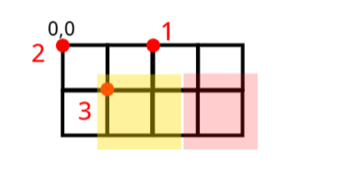
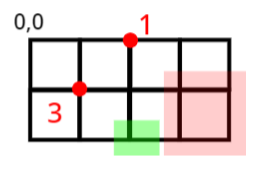
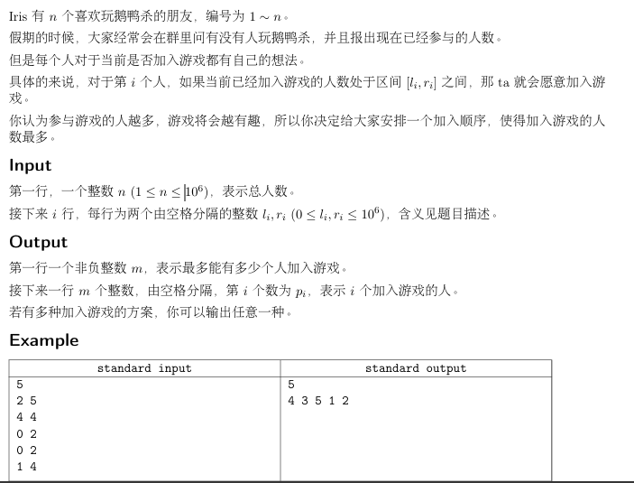
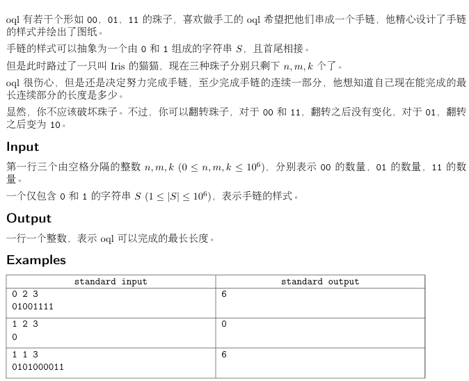
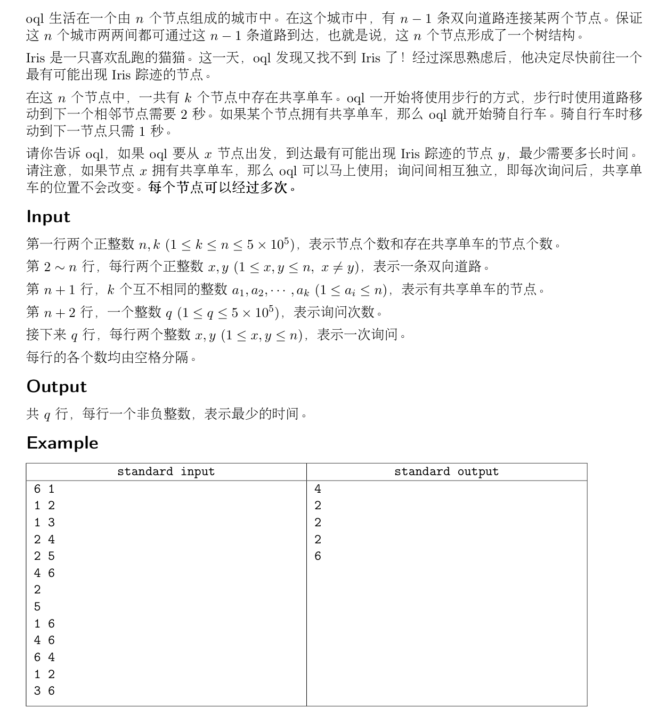
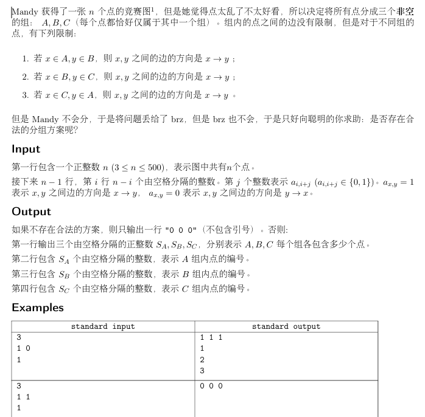

# icpc 思维练习

## 链接 

    https://codeforces.com/gym/105459/problem/J

https://codeforces.com/gym/105459/problem/K

https://codeforces.com/gym/105386/problem/E

https://codeforces.com/gym/105386/problem/J

https://codeforces.com/gym/105386/problem/L

https://codeforces.com/gym/105386/problem/F

https://codeforces.com/gym/105358/problem/C

https://codeforces.com/gym/105358/problem/E

https://codeforces.com/gym/105358/problem/L

https://codeforces.com/gym/105358/problem/G

https://codeforces.com/gym/105336/attachments (D)

https://codeforces.com/gym/105184/attachments (C、F、G、H)


追加：
https://codeforces.com/gym/105173/attachments  (H,I,L)

https://codeforces.com/gym/105170/problem/B
https://codeforces.com/gym/105170/problem/F

https://codeforces.com/gym/105163/problem/C
https://codeforces.com/gym/105163/problem/F
https://codeforces.com/gym/105163/problem/L

https://codeforces.com/gym/105158/attachments  (A,C,D,G)


## A

### 题目

一辆新能源车配备了n块电池，其中i号电池的容量为ai​单位。每单位电量可以让车辆行驶正好1公里。车辆只能向前行驶，不能倒退。你可以选择在每公里行驶时使用哪个电池。

最初，所有电池都是充满电的。在行驶过程中，车辆将经过m个充电站。第j个充电站位于起点xj​公里处，只能为tj​号电池充电。每个充电站提供无限量的电力。

你的任务是确定这辆新能源车能够行驶的最大距离。

### 输入

第一行包含一个整数T（1≤T≤104），表示测试用例的数量。

对于每个测试用例，第一行包含两个整数n,m（1≤n,m≤105），分别表示电池的数量和充电站的数量。

第二行包含n个整数a1​,a2​,…,an​（1≤ai​≤109），表示每块电池的容量。

接下来的m行每行包含两个整数xj​,tj​（1≤xj​≤109，1≤tj​≤n），表示每个充电站的位置和它可以充电的电池。

对于每个测试用例，保证1≤x1​<x2​<…<xm​≤109。所有测试用例中n的总和或m的总和不超过2⋅105。

### 输出

对于每个测试用例，输出一个整数，表示车辆可以行驶的最大距离。

---

我们考虑对于每一段路程d(x_i-x_{i-1})，应该如何使用电池。实现肯定是使用后面有充电站的电池。接下来考虑如何实现这个模拟的过程。

用一个堆pq维护所有没有用完的，且后面又充电桩的电池，并且越靠近下一个充电桩的单词越优先。这样我们就可以先用pq里的电池凑d。

如果不够，就在sum中取。sum记录了所有used电池的剩余容量，used指的是：后面没有充电桩的电池。

到达一个充电桩，就在used或者pq的top取出可以给当前电池充电的电池，充电，再根据后面看有没有这个电池的终点站来判断是加入pq还是sum。

pq，used是堆，sum是变量（记录总和）

## B

你已经放弃了编程，搬到了三江平原开始务农。在田间工作的过程中，你养成了规律的日常作息，现在你每天工作 正好 m 单位的时间。现在是收获季节，你需要收获和加工 n 种作物。对于作物类型 i，加工一单位时间将获得 wi​ 的利润。为了让你的日常工作不那么单调，对于每种作物 i，每天加工它所花费的时间可以在 [li​,ri​] 的范围内（包含边界）作为整数。

在某一天，天气预报说明天会有大雨，你无法工作，因此你需要调整你的日程，以便今天快速收集你的作物。具体来说，你可以选择最多一种作物，并取消其每日时间范围的限制，使得加工该作物所花费的时间可以在 [0,m] 的范围内的任何整数。其他作物的时间范围保持不变。你必须工作 正好 m 单位的时间。

你想要确定今天你能获得的最大利润。

### 输入

第一行包含两个整数 n 和 m （1≤n≤105，1≤m≤1011），分别表示作物类型的数量和工作日的长度（单位时间）。

接下来的 n 行每行包含三个整数 wi​、li​ 和 ri​ （1≤wi​≤106，1≤li​≤ri​≤106），表示作物的利润和时间限制。

保证 ∑i=1n​li​≤m≤∑i=1n​ri​。

### 输出

输出一个整数，表示今天你能获得的最大利润。

---

枚举哪一个解除限制。先把所有的l填满，然后假设解除i的限制，那么就把l_i的也空闲出来，优先堆到w大的上面。如果w>w_i的都已经堆满到r了，那么剩下的全都给i。模拟即可。二分+前缀和优化。

## C

### 题目

给定一个长度为 n 的整数序列 a1​,a2​,⋯,an​ 和一个非负整数 k，你最多可以执行以下操作一次：选择两个整数 l 和 r 使得 1≤l≤r≤n，然后对于每个 l≤i≤r，将 ai​ 改为 (ai​+k)。

最大化整个序列的最大公约数。

一个整数 g 被称为整个序列的公约数，如果对于所有 1≤i≤n，ai​ 能被 g 整除。

### 输入

输入包含多个测试用例。第一行包含一个整数 T，表示测试用例的数量。对于每个测试用例：

第一行包含两个整数 n 和 k （1≤n≤3×105，0≤k≤1018）。

第二行包含 n 个整数 a1​,a2​,⋯,an​ （1≤ai​≤1018），表示序列。

保证所有测试用例的 n 之和不超过 3×105。

### 输出

对于每个测试用例，输出一行包含一个整数，表示整个序列的最大最大公约数。

### 备注

对于第一个示例测试用例，选择 l=2 和 r=4。序列将变为 {5,5,15,10,10,555}。它的最大公约数是 5。

---

设再区间[l,r]加，那么gcd由4部分组成。

- $\gcd(a_1,\dots,a_{l-1})$

- $\gcd(a_{l+1}-a_{l},\dots,a_{r}-a_{r-1})$

- $a_r+k$

- $\gcd(a_{r+1}\dots,a_n)$

枚举r，发现l只有几种情况：

维护一个集合L，满足a\in L，当且仅当前缀gcd：g_{i}≠g_{i+1}。假设长度为[a-b,a]的前缀gcd都相同，那么肯定取最长的前缀gcd对整体不劣。因此L的大小很小。再L中枚举l。

接下来就是要用技巧维护$\gcd(a_{l+1}-a_{l},\dots,a_{r}-a_{r-1})$了。

```C++
// Problem: C - Relearn through Review
// Contest: Virtual Judge - 思维
// URL: https://vjudge.net/contest/670080#problem/C
// Memory Limit: 1024 MB
// Time Limit: 3000 ms
// Challenger: Erica N
// ----
// 
#include<bits/stdc++.h>

using namespace std;
#define rd read()
#define ull unsigned long long
#define int long long 
#define pb push_back
#define itn int
#define ps second 
#define pf first


#define rd read()
int read(){
  int xx = 0, ff = 1;char ch = getchar();
  while (ch < '0' || ch > '9'){
    if (ch == '-')ff = -1;
    ch = getchar();
  }
  while (ch >= '0' && ch <= '9')xx = xx * 10 + (ch - '0'), ch = getchar();
  return xx * ff;
}
#define zerol = 1
#ifdef zerol
#define cdbg(x...) do { cerr << #x << " -> "; err(x); } while (0)
void err() {cerr << endl;}
template<template<typename...> class T, typename t, typename... A>
void err(T<t> a, A... x) {
	for (auto v: a) cerr << v << ' ';err(x...);
}
template<typename T, typename... A>
void err(T a, A... x) {
	cerr << a << ' ';err(x...);
}
#else
#define dbg(...)
#endif
const int N=5e5+5;
const ull P=137;
const int INF=1e18+7;
/*

策略


*/	

int ans=0;
int a[N];
int g[N],rg[N];
int s[N],tot;
int db[N];
int vis[N];


void solve(){
	int n=rd,k=rd;
	tot=0;ans=0;
	for(int i=1;i<=n;i++){
		a[i]=rd;
		vis[i]=0;
		db[i]=0;
	}
	// g[0]=a[1];
	for(int i=1;i<=n;i++){
		g[i]=__gcd(g[i-1],a[i]);
		if(g[i]!=g[i-1])s[++tot]=i,vis[i]=1;
		// cdbg(g[i]);
	}
	// cdbg(tot);
	ans=g[n];
	rg[n+1]=0;
	for(int i=n;i;i--){
		rg[i]=__gcd(rg[i+1],a[i]);
	}
	
	int id=0;
	
	for(int r=1;r<=n;r++){
		id+=vis[r];
		
		// cdbg(r,id);
		int ip=id;
		int dg=0;
		for(int i=tot;i;i--){
			int l=s[i];
			if(l>r)continue;
			dg=__gcd(dg,db[ip]);
			// cdbg(l,r,db[ip],ip);
			int gc=__gcd(rg[r+1],g[l-1]);
			gc=__gcd(gc,a[r]+k);
			gc=__gcd(gc,dg);
			
			ans=max(ans,gc);
			ip--;
			
		}
		
		db[id]=__gcd(db[id],abs(a[r]-a[r+1]));
		// cdbg(id,db[id],r);
	}
	cout<<ans<<endl;
}


signed main(){
	int t=rd;
	while(t--){
		solve();
	}
}

```

## D

有一个王国，里面有 n 个城市和 m 条双向铁路连接这些城市。第 i 条铁路由第 ci​ 家铁路公司运营，铁路的长度为 li​。

你想从城市 1 开始在全国旅行。为了你的旅行，你购买了 k 张铁路票。第 i 张票可以用两个整数 ai​ 和 bi​ 表示，意味着如果你使用这张票，你可以一次性通过一些铁路，只要它们都是由公司 ai​ 运营，并且它们的总长度不超过 bi​。在使用票时，也可以选择留在当前城市。你只能一次使用一张票，并且每张票只能使用一次。

由于你觉得确定使用票的顺序很麻烦，你决定按照当前的顺序使用这些票。更正式地说，你将执行 k 次操作。在第 i 次操作中，你可以选择留在当前城市 u；或者选择一个不同的城市 v，使得从城市 u 到城市 v 存在一条路径，路径中的所有铁路都由公司 ai​ 运营，并且铁路的总长度不超过 bi​，最后移动到城市 v。

对于每个城市，确定在使用所有 k 张票后是否可以到达该城市。

### 输入

输入包含多个测试用例。第一行输入一个整数 T，表示测试用例的数量。对于每个测试用例：

第一行包含三个整数 n、m 和 k (2≤n≤5×105、1≤m≤5×105、1≤k≤5×105)，表示城市的数量、铁路的数量和票的数量。

接下来的 m 行中，第 i 行包含四个整数 ui​、vi​、ci​ 和 li​ (1≤ui​,vi​≤n、ui​=vi​、1≤ci​≤m、1≤li​≤109)，表示第 i 条铁路连接城市 ui​ 和 vi​。它由公司 ci​ 运营，长度为 li​。注意，可能有多条铁路连接同一对城市。

接下来的 k 行中，第 i 行包含两个整数 ai​ 和 bi​ (1≤ai​≤m、1≤bi​≤109)，表示如果你使用第 i 张票，你可以一次性通过一些铁路，只要它们都是由公司 ai​ 运营，并且它们的总长度不超过 bi​。

保证所有测试用例中 n 的总和、m 的总和和 k 的总和不会超过 5×105。

### 输出

对于每个测试用例，输出一行包含一个长度为 n 的字符串 s1​s2​⋯sn​，其中每个字符要么是 0，要么是 1。如果你可以使用这些 k 张票从城市 1 到达城市 i，则输出 si​=1；否则输出 si​=0。

### 注意

对于第一个样例测试用例：

- 要到达城市 4，你可以使用第 1 张票从城市 1 移动到城市 2，然后在使用第 2 张票时留在城市 2，接着使用第 3 张票从城市 2 移动到城市 4，最后在使用第 4 张票时留在城市 4。

- 要到达城市 5，你可以使用第 1 张票从城市 1 移动到城市 5，经过第 1 条和第 6 条铁路，然后在使用后续的票时留在城市 5。

- 由于你不能改变使用票的顺序，因此无法到达城市 3。

---

顺序对每一张票都进行dijstra。当然不是从头开始，而是接着上次没跑完（无法继续跑）的接着跑。

用二元组<第i张票，这张票的第j公里>且顺序优先级（即pair的默认优先级）作为一个点的距离的比较方法。

怎么样“接着上次没跑完（无法继续跑）的接着跑”呢？走到点x，枚举邻居v时发现需要的票和当前的不一样，或者当前的票的里程不够，那么就在向qa_{v.c(这条边的票类)}加入这条边。等到下一次枚举到这个类型的票T时，从qa中取出≤T.maxlen的边<x,v>，用T和d_x关系d_v，然后向pq加入v。pq是dijstra的那个优先队列。

```C++
// Problem: D - The Quest for El Dorado
// Contest: Virtual Judge - 思维
// URL: https://vjudge.net/contest/670080#problem/D
// Memory Limit: 1024 MB
// Time Limit: 4000 ms
// Challenger: Erica N
// ----

#include<bits/stdc++.h>

using namespace std;
#define rd read()
#define ull unsigned long long
#define int long long 
#define pb push_back
#define itn int
#define ps second 
#define pf first


#define rd read()
int read(){
  int xx = 0, ff = 1;char ch = getchar();
  while (ch < '0' || ch > '9'){
    if (ch == '-')ff = -1;
    ch = getchar();
  }
  while (ch >= '0' && ch <= '9')xx = xx * 10 + (ch - '0'), ch = getchar();
  return xx * ff;
}
#define zerol = 1
#ifdef zerol
#define cdbg(x...) do { cerr << #x << " -> "; err(x); } while (0)
void err() {cerr << endl;}
template<template<typename...> class T, typename t, typename... A>
void err(T<t> a, A... x) {
	for (auto v: a) cerr << v << ' ';err(x...);
}
template<typename T, typename... A>
void err(T a, A... x) {
	cerr << a << ' ';err(x...);
}
#else
#define dbg(...)
#endif
const int N=2e5+5;
const ull P=137;
const int INF=1e18+7;
/*

策略


*/	

struct ST{
	
	vector<int> e[22];
	int sz;
	void build(int id){
		for(int i=0;i<=20;i++)e[i].resize(t[id].size());
		sz=t[id].size();
		for(int i=0;i<sz;i++){
			e[0][i]=t[id][i];
		}
		for(int i=1;i<=20;i++){
			for(int j=0;j<sz;j++){
				e[i][j]=max(e[i][j-1],e[i+(1<<(i-1))][j-1]);
			}
		}
	}
	
	int query(int l,itn r){
		
	}
}st[N];

struct Node{
	int v,c,w;
};vector<Node > e[N];

void add(int l,int c,int b,int a){
	e[a].pb({b,c,l});
	e[b].pb({a,c,l});
}


struct Dist{
	pair<int,int> d;
	int id;
	
	bool operator <(const Dist b)const{
		return d>b.d;
	}
	
}	

int getnxt(int col,int L,int w){
	//在id[L,K]中间找最近的col色且len>=w的车票编号
	int loc=lower_bound(t[col].begin(),t[col].end(),L)-e[col].begin();
	int l=loc,r=t[col].size()-1;
	int res=0;
	while(l<=r){
		 int mid=l+r>>1;
		 if(st[col].query(loc,mid)>=w)res=mid,r=mid-1;
		 else l=mid+1;
	}
	
	return t[col][res];
	
}

void djstr(){
	for(int i=1;i<=n;i++){
		d[i]={INF,INF};
	}
	d[1]={0,0};
	qp.push({d[1],1});
	
	while(pq.size()){
		auto [p,x]=pq.top();
		q.pop();
		if(vis[x])continue;
		vis[x]=1;
		for(auto v:e[x]){
			if(vis[v.v])continue;
			if(col[p.pf]==v.c&&p.ps+v.w<=len[p.pf]){
				pair<int,int> pp=p;
				pp.ps+=v.w;
				if(d[v.v]>pp){
					d[v.v]==pp;
					pq.push({d[v.v],v.v});
				}
			}else{
				int nxt=getnxt(v.c,p.pf+1,v.w);
				pair<int,int> pp={nxt,v.w};
				if(d[v.v]>pp){
					d[v.v]==pp;
					pq.push({d[v.v],v.v});
				}
			}
		}
	}
}

void solve(){
	int n=rd,m=rd,K=rd;
	for(int i=1;i<=m;i++){
		add(rd,rd,rd,rd);
	}
	
	
	for(int i=1;i<=K;i++){
		int a=rd,b=rd;
		t[a].pb({b,i});
		len[i]=b;
		col[i]=a;
	}
	
	for(itn i=1;i<=m;i++){
		if(t[i].size())st[i]build(i);
	}
	
	
	djstr();
	
	
	for(itn i=1;i<=n;i++){
		if(d[i].pf<INF)cout<<1;
		else cout<<0;
	}
	
}

signed main(){	
	int T=rd;
	while(T--){
		solve();
	}
}


```

## E

宝宝正在无限二维平面上散步。对于平面上每个点 (x,y)，当 x 和 y 都是整数时，有一条双向小径连接点 (x,y) 和 (x+1,y)，还有另一条双向小径连接点 (x,y) 和 (x,y+1)。此外，还有 n 条额外的双向小径，其中第 i 条小径连接点 (xi​,yi​) 和 (xi​+1,yi​+1)。

宝宝只能沿着小径移动。设 f(x,y) 为宝宝从点 (0,0) 移动到点 (x,y) 所需经过的最小小径数量。给定两个整数 p 和 q，计算

x=0∑p​y=0∑q​f(x,y)

### 输入

有多个测试用例。输入的第一行包含一个整数 T，表示测试用例的数量。对于每个测试用例：

第一行包含三个整数 n、p 和 q (1≤n≤106、0≤p,q≤106)。它们的含义如上所述。

接下来的 n 行中，第 i 行包含两个整数 xi​ 和 yi​ (0≤xi​,yi​≤106)，表示第 i 条额外小径连接点 (xi​,yi​) 和 (xi​+1,yi​+1)。保证对于所有 i=j，xi​=xj​ 或 yi​=yj​。

保证所有测试用例的 n 之和不超过 106。注意，p 或 q 的总和没有限制。

### 输出

对于每个测试用例，输出一行包含一个整数，表示答案。

---

先不考虑所有捷径求出答案。接下来考虑样例



按捷径x升序，y降序排序，逐行考虑捷径

结合样例，先考虑1号点，可以对红色范围内的起点有-1的贡献（即可以缩短1的路程），因此ans减去红色范围内的点数。2号点，发现不是减去其右下角的点数，而是黄色范围内的。因为如果减去了，那么代表红色范围内的点可以既通过1又2，则不可能。

接下来考虑3号，发现又可以减去其右下角的点数了。我们把每个有i矩形覆盖的点都减去覆盖它的矩形个数的值，代表这个点最多可以走过多少条直径。因为3号右下角都是-1，所以可以都再-1，变成-2.



如果是上面这种情况，就不能再减去右下角的了，只能够减去绿色部分。一样的，如果减去了，那么代表重叠范围内的点可以既通过1又3，则不可能。

于是我们发现，减的范围再高上满足从x+1~p，再宽上满足从y+1~pre，其中pre列是最近的列，满足pre+1和pre列覆盖的矩形的个数不同（为什么是列？因为前面的矩形都是延申要最下面的，所以可以看成列）。

进一步简化，我们把一个矩形的左边界行打标记1，那么确定绿色矩形的右边界只需要知道y+1右侧最近的标记即可。注意同一行时要合并标记（如图1，只有第2列有标记，第4列标记的被黄色矩形合并了）。标记用set维护。

```C++
// Problem: E - Trails
// Contest: Virtual Judge - 思维
// URL: https://vjudge.net/contest/670080#problem/E
// Memory Limit: 1024 MB
// Time Limit: 3000 ms
// Challenger: Erica N
// ----
// 
#include<bits/stdc++.h>

using namespace std;
#define rd read()
#define ull unsigned long long
#define int long long 
#define pb push_back
#define itn int
#define ps second 
#define pf first


#define rd read()
int read(){
  int xx = 0, ff = 1;char ch = getchar();
  while (ch < '0' || ch > '9'){
    if (ch == '-')ff = -1;
    ch = getchar();
  }
  while (ch >= '0' && ch <= '9')xx = xx * 10 + (ch - '0'), ch = getchar();
  return xx * ff;
}
#define zerol = 1
#ifdef zerol
#define cdbg(x...) do { cerr << #x << " -> "; err(x); } while (0)
void err() {cerr << endl;}
template<template<typename...> class T, typename t, typename... A>
void err(T<t> a, A... x) {
	for (auto v: a) cerr << v << ' ';err(x...);
}
template<typename T, typename... A>
void err(T a, A... x) {
	cerr << a << ' ';err(x...);
}
#else
#define dbg(...)
#endif
const int N=2e6+5;
const ull P=137;
const int INF=1e18+7;
/*

策略


*/	


#define  pii pair<int,int> 
pii t[N];

bool cmp(pii a,pii b){
	if(a.pf==b.pf)return a.ps>b.ps;
	return a.pf<b.pf;
}

set<int> st;

void solve(){
	st.clear();
	int n=rd;
	int p=rd,q=rd;
	for(int i=1;i<=n;i++){
		t[i]={rd,rd};
	}
	
	int ans=(1+p)*p/2*(q+1);
	ans+=(1+q)*q/2*(p+1);
	// cdbg(ans);
	
	sort(t+1,t+n+1,cmp);
	
	t[0]={-1,-1};
	// int pre=q;
	for(int i=1;i<=n;i++){
		// cdbg(t[i].pf,t[i].ps);
		if(t[i].pf<p&&t[i].ps<q){
			auto loc=st.upper_bound(t[i].ps);
			int pre=loc==st.end()?q:((*loc)-1);
			ans-= (p-t[i].pf)*(pre-t[i].ps);
			if(loc!=st.end())st.erase(loc);
			st.insert(t[i].ps+1);
		}
	}
	
	cout<<ans<<endl;
}

signed main(){
	int n=rd;
	while(n--)solve();
}
```

## F

有 109 个单元格排列成一行，从左到右编号为 1 到 109。两个机器人在这些单元格中巡逻。每个机器人的最大速度为 v 个单元格每秒（v 是一个整数），这意味着如果一个机器人当前在单元格 p，它可以在下一秒移动到任何单元格 p′，只要满足 1≤p′≤109 和 ∣p′−p∣≤v。

在单元格中将会出现 n 个硬币。第 i 个硬币将在第 ti​ 秒出现在单元格 ci​。如果一个机器人在那个时间在同一个单元格，它可以捡起硬币。否则，硬币将立即消失。

更正式地说，在每一秒钟内，将按顺序发生以下步骤：

- 每个机器人可以移动到距离当前位置不超过 v 个单元格的位置（留在当前单元格也是可以的）。

- 硬币在单元格中出现。

- 如果至少有一个机器人与硬币在同一个单元格，该硬币被收集。

- 所有未收集的硬币消失。

你的任务是确定两个机器人的初始位置在第 1 秒之前，并明智地移动它们以收集所有硬币，且使得最大速度尽可能小。输出这个最优值 v。

### 输入

有多个测试用例。输入的第一行包含一个整数 T，表示测试用例的数量。对于每个测试用例：

第一行包含一个整数 n (1≤n≤106)，表示在单元格中出现的硬币数量。

接下来的 n 行中，第 i 行包含两个整数 ti​ 和 ci​ (1≤ti​,ci​≤109)，表示第 i 个硬币出现的时间和第 i 个硬币出现的位置。保证对于所有 1≤i<n，ti​≤ti+1​。同时保证对于所有 i≠j，ti≠tj​ 或 ci≠cj​。

保证所有测试用例的 n 之和不会超过 106。

### 输出

对于每个测试用例，输出一行包含一个整数，表示机器人可能的最小最大速度。如果无法收集所有硬币，则输出 -1。

---

首先要二分答案v。

考虑因为要取到每一个硬币，一次逐个考虑硬币。

设A取得第i-1个硬币，此时B可能位于区间[bl,br]内。我们考虑如何求出bl,br。

下令d= \delta t\times v。

- 如果A继续取到第i个硬币，意味着c_i\in c_{i-1}+-d。此时bl,br就可以从之前的扩展，为bl=bl-d,br=br+d

- 如果是B取到第i个硬币，意味着c_i\in[bl-d,br+d]。此时事实上A,B轮换了。bl=c_{i-1}-d,br=c_{i-1}+d。

逐个考虑i时判断会不会有A,B均无法取到的情况即可。

```C++
// Problem: F - Collect the Coins
// Contest: Virtual Judge - 思维
// URL: https://vjudge.net/contest/670080#problem/F
// Memory Limit: 1024 MB
// Time Limit: 3000 ms
// Challenger: Erica N
// ----
// 
#include<bits/stdc++.h>

using namespace std;
#define rd read()
#define ull unsigned long long
#define int long long 
#define pb push_back
#define itn int
#define ps second 
#define pf first


#define rd read()
int read(){
  int xx = 0, ff = 1;char ch = getchar();
  while (ch < '0' || ch > '9'){
    if (ch == '-')ff = -1;
    ch = getchar();
  }
  while (ch >= '0' && ch <= '9')xx = xx * 10 + (ch - '0'), ch = getchar();
  return xx * ff;
}
#define zerol = 1
#ifdef zerol
#define cdbg(x...) do { cerr << #x << " -> "; err(x); } while (0)
void err() {cerr << endl;}
template<template<typename...> class T, typename t, typename... A>
void err(T<t> a, A... x) {
	for (auto v: a) cerr << v << ' ';err(x...);
}
template<typename T, typename... A>
void err(T a, A... x) {
	cerr << a << ' ';err(x...);
}
#else
#define dbg(...)
#endif
const int N=2e6+5;
const ull P=137;
const int INF=1e9+7; // INF别大，会爆LL
/*

策略


*/	


int t[N],c[N];
int n;

bool check(int v){
	int bl=0,br=INF;
	
	for(int i=2;i<=n;i++){
		int u=v*(t[i]-t[i-1]);
		int al=c[i-1]-u;
		int ar=c[i-1]+u;
		int f=0;
		int pbl=bl-u,pbr=br+u;
		if(al<=c[i]&&ar>=c[i]){
			f=1;
			bl=bl-u;
			br=br+u;
		}else{
			bl=INF;
			br=-1;
		}
		
		if(pbl<=c[i]&&pbr>=c[i]){
			f=1;
			bl=min(bl,al);
			br=max(br,ar);
		}
		if(!f)return 0;
	}
	
	return 1;
}

void solve(){
	 n=rd;
	for(int i=1;i<=n;i++){
		t[i]=rd;
		c[i]=rd;
	}
	
	int l=0,r=INF;
	int res=-1;
	while(l<=r){
		int mid=l+r>>1;
		if(check(mid))res=mid,r=mid-1;
		else l=mid+1;
	}
	
	cout<<res<<endl;
	
	
}


signed main(){
	int T=rd;
	while(T--){
		solve();
	}
}


```

## G

## H

欢迎参加今年的互联网连接实践比赛（ICPC）！在比赛中，你和你的队友将与障碍制造系统（OMS）对抗，以成功连接到服务器！在每一次刷新操作中要小心，因为系统可能会给你分配未知的障碍。

为了简化问题，我们将比赛过程建模为以下形式：

每个队伍在比赛中都有一个计时器，目标是尽快将剩余时间减少到 0。在 0-秒开始时，OMS 将在 [1,T] 中均匀随机生成一个整数 t0​，并将你的计时器的剩余时间初始化为 t0​ 秒。接下来，在每秒结束时（从 0-秒开始），将按顺序发生以下事件：

- 计时器的剩余时间将减少 1。如果此时计时器的剩余时间为零，那么从比赛开始到此时的秒数就是你的惩罚。

- 否则，你可以在此之后什么都不做，或者在 OMS 上使用一次刷新操作。如果你选择刷新计时器，OMS 将在 [1,T] 中均匀随机生成一个新的整数 t′，并将你的计时器的剩余时间设置为 t′。

你的目标是最小化你的惩罚。请使用最佳策略计算预期惩罚。在比赛中，你始终知道计时器的剩余时间和 T 的值。

### 输入

第一行包含一个整数 n (1≤n≤106)，表示测试用例的数量。

接下来的 n 行，每行包含一个整数 Ti​ (1≤Ti​≤109)，表示生成随机数的区间为 [1,Ti​]，这是第 i 个测试用例。

### 输出

对于每个测试用例，输出一行包含两个正整数 xi​,yi​，其中 gcd(xi​,yi​)=1，表示使用最佳策略的预期惩罚为 xi​/yi​。可以证明答案总是可以表示为一个分数。

---

我们的策略必然是先刷新到一个数p，然后一直执行-1操作。

## I

Sneaker 在一个巨大的迷宫中醒来，现在他想要逃离这里。

通过在迷宫每个房间找到的地图，Sneaker 了解了迷宫的结构。迷宫由 n 个房间组成，Sneaker 从房间 1 开始，出口在房间 n。此外，迷宫中有 m 条双向通道，每条通道连接两个不同的房间，并且每条通道的两个方向是相互隔离的。

保证没有两条不同的通道连接同一对房间，并且没有通道连接一个房间到它自己。

此外，保证任何两个房间可以通过一系列通道相互到达。

Sneaker 还发现迷宫中有 k 个屠杀机器人。第 i 个屠杀机器人最初停留在房间 si​。显然，Sneaker 不想也不能遇到这些屠杀机器人。

如果 Sneaker 开始移动，每个屠杀机器人将同时移动。具体来说，Sneaker 将选择一个与他当前所在房间相连的通道，并移动到通道另一侧的房间。同时，每个屠杀机器人将随机选择一个与它所在房间相连的通道，并移动到通道另一侧的房间。每个屠杀机器人将与 Sneaker 同时进入和退出通道。

所有屠杀机器人将记录它们经过的通道。如果一个屠杀机器人经过的通道与最后记录的通道相同，它可以选择从其记录中删除这两次出现的通道。换句话说，屠杀机器人可以选择撤销一条记录。

例如，如果一个屠杀机器人当前记录的通道是 (1,2),(2,7),(7,3)，并且现在在房间 3，它可以选择通过一条新的通道，比如 (3,6)，它的记录将变为 (1,2),(2,7),(7,3),(3,6)，机器人最终到达房间 6。或者，它可以通过通道 (3,7) 返回到房间 7，它的记录将变为 (1,2),(2,7)。

此外，如果屠杀机器人随后选择通过一条通道返回到房间 2，它的记录将变为 (1,2)。但是，如果它直接从房间 3 移动到房间 2，它的记录不能变为 (1,2)；相反，它将变为 (1,2),(2,7),(7,3),(3,2)。

此外，所有屠杀机器人共享一个相同的自毁参数 d。如果一个屠杀机器人到达一个房间并发现它的通道记录超过 d，它将立即自毁。如果 Sneaker 进入一个房间并发现一个屠杀机器人正在自毁或已经自毁，则不算作与机器人的遭遇。

现在，Sneaker 想要规划一条通行的路线，确保通行的通道数量最少，并且确保他不会遇到任何屠杀机器人。你能帮助他吗？

注意：如果 Sneaker 从房间 x 通过一条通道移动到房间 y，而一个屠杀机器人正朝相反方向移动，从房间 y 通过同一条通道移动到房间 x，Sneaker 不会遇到屠杀机器人，因为通道的两个方向是相互隔离的。Sneaker 只知道每个屠杀机器人的初始位置，但不知道它们在每一时刻的位置。如果一个屠杀机器人和 Sneaker 同时到达房间 n，那么 Sneaker 被视为遇到了屠杀机器人，并且无法逃离迷宫。

### 输入

第一行包含一个整数 T (1≤T≤105)，表示测试用例的数量。

对于每个测试用例，第一行包含三个整数 n、m 和 d (2≤n≤2×105、n−1≤m≤min{5×105,2n(n−1)​}、1≤d<n)，分别表示迷宫中的房间数量、通道数量和自毁参数。

接下来的 m 行每行包含两个整数 xi​ 和 yi​ (1≤xi​<yi​≤n)，表示第 i 条通道连接房间 xi​ 和房间 yi​。

保证对于任何 i=j、xi​=xj​ 或 yi​=yj​。

保证任何两个房间可以通过一系列通道相互到达。

第 (m+2) 行包含几个整数。第一个整数 k (0≤k≤n−2) 表示屠杀机器人的数量，后面跟着 k 个整数 s1​,s2​,…,sk​ (2≤si​<n)，表示每个屠杀机器人的初始房间。

保证所有测试用例中 n 的总和不超过 5×105，所有测试用例中 m 的总和不超过 2×106。

### 输出

对于每个测试用例，如果存在有效路线，输出一个整数 p 在第一行，表示有效路线中的最小通道数量。

在第二行，输出 p+1 个整数 z0​=1,z1​,…,zp​=n，表示路线经过的房间序列。

如果不存在有效路线，输出一个整数 −1。

---

先考虑可以原地不动的情况，然后再考虑必须走动，那么就发现可以a-b-a走，于是用奇偶最短路求解。

注意两次最短路偶需要奇偶最短路。

```C++
// Problem: I - Escape
// Contest: Virtual Judge - 思维
// URL: https://vjudge.net/contest/670080#problem/I
// Memory Limit: 256 MB
// Time Limit: 2000 ms
// Challenger: Erica N
// ----
// 
#include<bits/stdc++.h>

using namespace std;
#define rd read()
#define ull unsigned long long
#define int long long 
#define pb push_back
#define itn int
#define ps second 
#define pf first


#define rd read()
int read(){
  int xx = 0, ff = 1;char ch = getchar();
  while (ch < '0' || ch > '9'){
    if (ch == '-')ff = -1;
    ch = getchar();
  }
  while (ch >= '0' && ch <= '9')xx = xx * 10 + (ch - '0'), ch = getchar();
  return xx * ff;
}
#define zerol = 1
#ifdef zerol
#define cdbg(x...) do { cerr << #x << " -> "; err(x); } while (0)
void err() {cerr << endl;}
template<template<typename...> class T, typename t, typename... A>
void err(T<t> a, A... x) {
	for (auto v: a) cerr << v << ' ';err(x...);
}
template<typename T, typename... A>
void err(T a, A... x) {
	cerr << a << ' ';err(x...);
}
#else
#define dbg(...)
#endif
const int N=5e5+5;
const ull P=137;
const int INF=1e18+7;
/*

策略


*/	

vector<int> e[N];
int st[N];

void add(int a,int b){
	e[a].pb(b);
	e[b].pb(a);
}
int vis[N];
int dis[N][2];
int n,m,D;


priority_queue<pair<int,int>> pq;
queue<int> q;
int d[N][2];

void init(){
	//处理出奇偶最短路 对于每个机器人和限制
	for(int i=0;i<=n;i++)d[i][0]=d[i][1]=INF;
	d[0][1]=-1;
	// d[0][1]=0;
	q.push(0);
	
	while(q.size()){
		int x=q.front();
		q.pop();
		// if(vis[x])continue;
		// vis[x]=1;
		for(auto v:e[x]){
			if(d[v][0]>d[x][1]+1){
				d[v][0]=d[x][1]+1;
				q.push(v);
			}
			
			if(d[v][1]>d[x][0]+1){
				d[v][1]=d[x][0]+1;
				q.push(v);
			}
			
		}
	}
}

int pre[N][2];

// void djstr(){
	// for(int i=0;i<=n;i++)dis[i]=INF;
	// dis[1]=0; 
	// pq.push({0,1});
// 	
	// while(pq.size()){
		// int x=pq.top().ps;
		// pq.pop();
		// if(vis[x])continue;
		// vis[x]=1;
		// for(auto v:e[x]){
			// if(v==0)continue;
			// if(!vis[v]&&dis[v]>dis[x]+1){
				// int t=dis[x]+1;
				// if(d[v][t&1]<=t&&d[v][t&1]<=D)continue;
				// dis[v]=t;
				// pre[v]=x;
				// pq.push({-dis[v],v});
			// }
		// }
	// }
// }


void djstr(){
	//处理出奇偶最短路 对于每个机器人和限制
	for(int i=0;i<=n;i++)dis[i][0]=dis[i][1]=INF;
	dis[1][0]=0;
	// dis[0][1]=0;
	q.push(1);
	
	while(q.size()){
		int x=q.front();
		q.pop();
		// if(vis[x])continue;
		// vis[x]=1;
		for(auto v:e[x]){
			if(v==0)continue;
			if(dis[v][0]>dis[x][1]+1){
				int t=dis[x][1]+1;
				if(d[v][t&1]>t||d[v][t&1]>D){
					dis[v][0]=dis[x][1]+1;
					pre[v][0]=x;
					q.push(v);
					
				}
			}
			
			if(dis[v][1]>dis[x][0]+1){
				int t=dis[x][0]+1;
				if(d[v][t&1]>t||d[v][t&1]>D){
					dis[v][1]=dis[x][0]+1;
					pre[v][1]=x;
					q.push(v);
					
				}
			}
			
		}
	}
}

void output(int x,int op){
	if(!x)return ;
	output(pre[x][op],op^1);
	cout<<x<<' ';
}
void solve(){
	 n=rd,m=rd,D=rd;
	 // if(D==1)assert(0);
	for(int i=1;i<=m;i++){
		add(rd,rd);
	}
	
	int K=rd;
	for(int i=1;i<=K;i++){
		st[i]=rd;
		add(0,st[i]);
	}
	
	init();
	
	for(int i=1;i<=n;i++){
		vis[i]=0;
		pre[i][0]=0;
		pre[i][1]=0;

		// cdbg(d[i][0],d[i][1]);
	}
	
	djstr();
	
	if(dis[n][0]>=INF&&dis[n][1]>=INF){
		for(int i=0;i<=n;i++){
			while(e[i].size())e[i].pop_back();
		}
		puts("-1");
		return ;
	}
	int op=dis[n][1]<dis[n][0]?1:0;
	cout<<dis[n][op]<<'\n';
	
	output(n,op);
	cout<<'\n';
	for(int i=0;i<=n;i++){
		while(e[i].size())e[i].pop_back();
	}
}


signed main(){
	int t=rd;
	while(t--){
		solve();
	}
}


```

## J

爱丽丝和鲍勃正在玩一个游戏。最开始，爱丽丝有 x 个筹码，鲍勃有 y 个筹码。

游戏进行若干轮。在每一轮中，爱丽丝获胜的概率为 p0​，鲍勃获胜的概率为 p1​，平局的概率为 1−p0​−p1​。

如果出现平局，游戏立即进入下一轮。否则，如果获胜者的筹码数量不小于失败者的筹码数量，获胜者将赢得整个游戏，游戏结束；否则，失败者将失去与获胜者当前筹码数量相等的筹码，游戏进入下一轮。

请注意，在每轮游戏结束后，任何人的筹码都不会增加。

你需要找出爱丽丝最终赢得整个游戏的概率。

### 输入

第一行包含一个整数 T (1≤T≤105)，表示测试用例的数量。

对于每个测试用例，第一行包含两个整数 x 和 y (1≤x,y≤109)，分别表示爱丽丝和鲍勃的初始筹码数量。

第二行包含三个非负整数 a0​、a1​ 和 b (1≤a0​+a1​≤b<998244353)，表示 p0​=ba0​​、p1​=ba1​​。

### 输出

对于每个测试用例，输出一行包含一个整数，表示爱丽丝赢得整个游戏的概率，取模 998244353。

---

首先可以用辗转相减来模拟。然后发现连续一段都是负才会对当前筹码多的玩家的胜负有影响，所以用辗转相除加速。

[GCD与LCM](https://flowus.cn/3a49cee9-1262-4890-b5d6-4c0c3b9d463b)

## K

## L



## M



---

将起点分为奇数和偶数分开计算，用双指针即可。

```C++
// Problem: M - Bracelet
// Contest: Virtual Judge - 思维
// URL: https://vjudge.net/contest/670080#problem/M
// Memory Limit: 1024 MB
// Time Limit: 1000 ms
// Challenger: Erica N
// ----
// 
#include<bits/stdc++.h>

using namespace std;
#define rd read()
#define ull unsigned long long
#define int long long 
#define pb push_back
#define itn int
#define ps second 
#define pf first


#define rd read()
int read(){
  int xx = 0, ff = 1;char ch = getchar();
  while (ch < '0' || ch > '9'){
    if (ch == '-')ff = -1;
    ch = getchar();
  }
  while (ch >= '0' && ch <= '9')xx = xx * 10 + (ch - '0'), ch = getchar();
  return xx * ff;
}
#define zerol = 1
#ifdef zerol
#define cdbg(x...) do { cerr << #x << " -> "; err(x); } while (0)
void err() {cerr << endl;}
template<template<typename...> class T, typename t, typename... A>
void err(T<t> a, A... x) {
	for (auto v: a) cerr << v << ' ';err(x...);
}
template<typename T, typename... A>
void err(T a, A... x) {
	cerr << a << ' ';err(x...);
}
#else
#define dbg(...)
#endif
const int N=2e5+5;
const ull P=137;
const int INF=1e18+7;
/*

策略


*/	


string s;

int a[5],bac[5];

int getid(char a,char b){
	if(a=='0'&&b=='0')return 0;
	else if(a=='1'&&b=='1')return 2;
	return 1;
}

signed main(){
	 bac[0]=a[0]=rd,bac[1]=a[1]=rd,bac[2]=a[2]=rd;
	 
	cin>>s;
	s=s+s;
	int n=s.size();
	
	int ans=0;
	s=" "+s;
	int l=2;
	for(int i=2;i<=n;i+=2){
		int id=getid(s[i-1],s[i]);
		a[id]--;
		while(a[0]<0||a[1]<0||a[2]<0||i-l+2>n/2){
			a[getid(s[l-1],s[l])]++;
			l+=2;
		}
		ans=max(ans,i-l+2);
	}
	
	a[0]=bac[0];
	a[1]=bac[1];
	a[2]=bac[2];
	l=3;
	for(int i=3;i<=n;i+=2){
		int id=getid(s[i-1],s[i]);
		a[id]--;
		while(a[0]<0||a[1]<0||a[2]<0||i-l+2>n/2){
			a[getid(s[l-1],s[l])]++;
			l+=2;
		}
		ans=max(ans,i-l+2);
	}
	
	cout<<ans<<endl;
}


```

## N



---

考虑如果不骑车，那么答案就是2dis(x,y)。如果在路径上的某一个点v处（下面默认v在x-anc路径上）找最近的车骑，那么答案就是

$2dis(x,v)+3d_v+dis(v,x)$

用dep来表示就是 $-2dep_{anc}+dep_{x}+dep_y-dep_v+dep_x+3d_v=-2dep_{anc}+2dep_{x}+dep_y+(-dep_v+3d_v)$

于是倍增时再维护一下括号内的内容即可。如果v在anc-y路径上，那么就是

$2dis(x,y)+3d_v-dis(v,y)$

$-4dep_{anc}+2dep_{x}+2dep_y-(dep_y-dep_v)+3d_v=-4dep_{anc}+2dep_{x}+dep_y+(dep_v+3d_v)$

如何处理d？以自行车为起点bfs即可。

注意倍增数组的设计和边界。

```C++
// Problem: N - Missing Iris
// Contest: Virtual Judge - 思维
// URL: https://vjudge.net/contest/670080#problem/N
// Memory Limit: 1024 MB
// Time Limit: 3000 ms
// 
// 
/*
Edit by Ntsc.
*/

#include<bits/stdc++.h>
using namespace std;
// #define int long long
#define itn int 
#define ull unsigned long long
#define pii pair<int, int>
#define pf first
#define ps second
#define rep(i, a, b) for(int i = a; i <= b; ++i)
#define per(i, a, b) for(int i = a; i >= b; --i)

#define rd read()

inline int read(){
    int xx = 0, ff = 1;char ch = getchar();
    while (ch < '0' || ch > '9') {if (ch == '-')ff = -1; ch = getchar();}
    while (ch >= '0' && ch <= '9')xx = xx * 10 + (ch - '0'), ch = getchar();
    return xx * ff;
}

#define ot write
#define nl putchar('\n')
inline void write(int out){
	if(out<0) putchar('-'),out=-out;
	if(out>16) write(out/10);
	putchar(out%10+'0');
}


#define cdbg(x...) do { cerr << #x << " -> "; err(x); } while (0)
void err() { cerr << endl; }
template<template<typename...> class T, typename t, typename... A>
void err(T<t> a, A... x) { for (auto v: a) cerr << v << ' '; err(x...); }
template<typename T, typename... A>
void err(T a, A... x) { cerr << a << ' '; err(x...); }


const int N=5e5+5;
const itn INF=1e9;


vector<int> e[N];
int n,K;
bitset<N> vis;


inline void add(int a,int b){
	e[a].push_back(b);
	e[b].push_back(a);
}
queue<int> q;
int d[N],dep[N];
int fa[N][22];
int g[2][N][22];
int mx[4];


void bfs(){
	while(q.size()){
		int x=q.front();
		q.pop();
		vis[x]=0;
		for(auto v:e[x]){
			if(d[v]>d[x]+1){
				d[v]=d[x]+1;
				if(!vis[v])q.push(v),vis[v]=1;
			}
		}
	}
}


namespace LCA{
	void dfs(itn x,int f){
		dep[x]=dep[f]+1;
		for(auto v:e[x]){
			if(v==f)continue;
			fa[v][0]=x;
			g[0][v][0]=min(-(dep[x]+1)+3*d[v],-(dep[x])+3*d[x]);
			g[1][v][0]=min((dep[x]+1)+3*d[v],(dep[x])+3*d[x]);
			for(int i=1;i<=20;i++){
				fa[v][i]=fa[fa[v][i-1]][i-1];
				g[0][v][i]=min(g[0][v][i-1],g[0][fa[v][i-1]][i-1]);
				g[1][v][i]=min(g[1][v][i-1],g[1][fa[v][i-1]][i-1]);
			}
			dfs(v,x);
		}
	}
	
	
	int lca(int a,int b){
		 mx[0]=mx[1]=INF;
		int op=0;
		if(dep[a]<dep[b]){
			swap(a,b);
			op=1;
		}
		
		for(int i=20;~i;i--){
			if(dep[fa[a][i]]>=dep[b]){
				mx[op]=min(mx[op],g[op][a][i]);
				a=fa[a][i];
			}
		}
		if(a==b)return a;
		for(int i=20;~i;i--){
			if(fa[a][i]!=fa[b][i]){
				mx[op]=min(mx[op],g[op][a][i]);
				mx[op^1]=min(mx[op^1],g[op^1][b][i]);
				a=fa[a][i];
				b=fa[b][i];
				
			}
		}
		mx[op]=min(mx[op],g[op][a][0]);
		mx[op^1]=min(mx[op^1],g[op^1][b][0]);
		return fa[a][0];
	}
}using namespace LCA;

signed main(){
	 n=rd,K=rd;
	for(int i=1;i<n;i++){
		add(rd,rd);
	}
	
	memset(g,0x3f3f,sizeof g);
	memset(d,0x3f3f,sizeof d);
	for(int i=1;i<=K;i++){
		int x=rd;
		d[x]=0;
		q.push(x);
		vis[x]=1;
	}
	
	bfs();
	
	dfs(1,0);
	
	
	// for(int i=1;i<=n;i++)cdbg(d[i]);
	
	
	
	int q=rd;
	while(q--){
		
		int x=rd,y=rd;
		int anc=lca(x,y);
		// cdbg(x,y,anc,mx[0],mx[1]);
		int ans=min(-2*dep[anc]+2*dep[x]+dep[y]+mx[0],-4*dep[anc]+2*dep[x]+dep[y]+mx[1]);
		ans=min(ans,2*(dep[x]+dep[y]-2*dep[anc]));
		cout<<ans<<'\n';
		
	}
}


```

## O



---

看题解吧。模拟。

```C++
// Problem: I - Escape
// Contest: Virtual Judge - 思维
// URL: https://vjudge.net/contest/670080#problem/I
// Memory Limit: 256 MB
// Time Limit: 2000 ms
// Challenger: Erica N
// ----
// 
#include<bits/stdc++.h>

using namespace std;
#define rd read()
#define ull unsigned long long
#define int long long 
#define pb push_back
#define itn int
#define ps second 
#define pf first


#define rd read()
int read(){
  int xx = 0, ff = 1;char ch = getchar();
  while (ch < '0' || ch > '9'){
    if (ch == '-')ff = -1;
    ch = getchar();
  }
  while (ch >= '0' && ch <= '9')xx = xx * 10 + (ch - '0'), ch = getchar();
  return xx * ff;
}
#define zerol = 1
#ifdef zerol
#define cdbg(x...) do { cerr << #x << " -> "; err(x); } while (0)
void err() {cerr << endl;}
template<template<typename...> class T, typename t, typename... A>
void err(T<t> a, A... x) {
	for (auto v: a) cerr << v << ' ';err(x...);
}
template<typename T, typename... A>
void err(T a, A... x) {
	cerr << a << ' ';err(x...);
}
#else
#define dbg(...)
#endif
const int N=1e6+5;
const ull P=137;
const int INF=1e12+7;
/*

策略


*/	

vector<int> e[N],st[4];

void add(itn a,int b){
	e[a].pb(b);
}


signed main(){
	int n=rd;
	for(int i=1;i<n;i++){
		for(int j=i+1;j<=n;j++){
			if(rd)add(i,j);
		}
	}
	
	
	st[0].pb(1);
	for(int i=2;i<=n;i++){
		
	}
}

```


