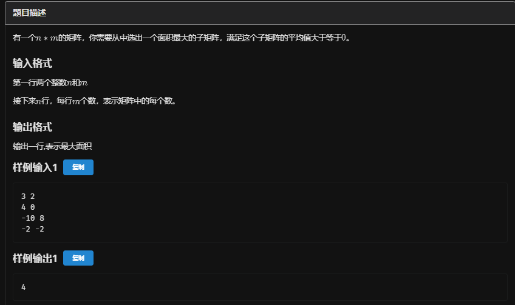
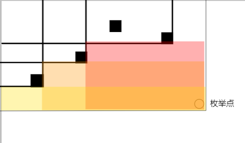

# 矩阵计数题

本文通过几个矩阵计数问题讲解这种类型的题目的时间复杂度优化的几种方法。

## $O(n^3)$扫描线

略。

## 悬线法 [POI2002] 最大的园地

在一个 $n\times n$ 的正方形内找到最大的由 `0` 组成的矩形，输出它的面积。

对于 $100\%$ 的数据，$1\le n\le 2000$。

## 最优化剪枝 优秀子矩阵



---

最优化剪枝

我们还是按照$O(n^2m)$的套路去扫描。

加入当前扫描到了r，此时答案左边界为l。那么当r+1时，我们就让预期答案l+1，然后通过前缀最大值判断l是否可以-1.知道越界或不在符合要求。

因为此时我们答案区间的长度是递增的，所以时间复杂度为O(m)。

合计复杂度为$O(n^2m)$

```C++
/*
                      Keyblinds Guide
                                ###################
      @Ntsc 2024

      - Ctrl+Alt+G then P : Enter luogu problem details
      - Ctrl+Alt+B : Run all cases in CPH
      - ctrl+D : choose this and dump to the next
      - ctrl+Shift+L : choose all like this
      - ctrl+K then ctrl+W: close all
      - Alt+la/ra : move mouse to pre/nxt pos'

*/
#include <bits/stdc++.h>
#include <queue>
using namespace std;

#define rep(i, l, r) for (int i = l, END##i = r; i <= END##i; ++i)
#define per(i, r, l) for (int i = r, END##i = l; i >= END##i; --i)
#define pb push_back
#define mp make_pair
#define int long long
#define pii pair<int, int>
#define ps second
#define pf first
#define ull unsigned long long

#define itn int
// #define inr int
// #define mian main
// #define iont int

#define rd read()
int read() {
    int xx = 0, ff = 1;
    char ch = getchar();
    while (ch < '0' || ch > '9') {
        if (ch == '-')
            ff = -1;
        ch = getchar();
    }
    while (ch >= '0' && ch <= '9') xx = xx * 10 + (ch - '0'), ch = getchar();
    return xx * ff;
}
void write(int out) {
    if (out < 0)
        putchar('-'), out = -out;
    if (out > 9)
        write(out / 10);
    putchar(out % 10 + '0');
}

#define ell dbg('\n')
const char el = '\n';
const bool enable_dbg = 1;
template <typename T, typename... Args>
void dbg(T s, Args... args) {
    if constexpr (enable_dbg) {
        cerr << s;
        if (1)
            cerr << ' ';
        if constexpr (sizeof...(Args))
            dbg(args...);
    }
}

const int N = 3e3 + 5;
const int INF = 1e18;
const int M = 1e5;
const int MOD = 1e9 + 7;

int ans;
int a[N][N];
int p[N][N];

itn pre[N];

void solve() {
    itn n = rd, m = rd;

    for (int i = 1; i <= n; i++) {
        for (itn j = 1; j <= m; j++) {
            a[i][j] = rd;
        }
    }

    for (int i = 1; i <= n; i++) {
        for (itn j = 1; j <= m; j++) {
            p[i][j] = p[i - 1][j] + p[i][j - 1] + a[i][j] - p[i - 1][j - 1];
        }
    }

    pre[0] = 0;
    for (int i = 1; i <= n; i++) {
        for (int j = i; j <= n; j++) {
            int l = 0;
            for (itn k = 1; k <= m; k++) {
                while (l >= 1 && pre[l - 1] <= p[j][k] - p[i - 1][k]) l--;

                if (pre[l] <= p[j][k] - p[i - 1][k])
                    ans = max(ans, (j - i + 1) * (k - l));

                pre[k] = min(pre[k - 1], p[j][k] - p[i - 1][k]);
                l++;
            }
        }
    }

    cout << ans << endl;

    //前缀最小值单调
}

signed main() {
    freopen("rec.in", "r", stdin);
    freopen("rec.out", "w", stdout);

    int T = 1;
    while (T--) {
        solve();
    }
    return 0;
}
```

## 边界单调栈优化 长方形

题目描述

小明今天突发奇想，想从一张用过的纸中剪出一个长方形。

为了简化问题，小明做出如下规定：

（1）这张纸的长宽分别为 $n,m$。小明将这张纸看成是由$n\times m$个格子组成，在剪的时候，只能沿着格子的边缘剪。

（2）这张纸有些地方小明以前在上面画过，剪出来的长方形不能含有以前画过的地方。

（3）剪出来的长方形的大小没有限制。

小明看着这张纸，想了好多种剪的方法，可是到底有几种呢？小明数不过来，你能帮帮他吗？

输入格式

第一行两个正整数 $n,m$，表示这张纸的长度和宽度。

接下来有 $n$ 行，每行 $m$ 个字符，每个字符为 `*` 或者 `.`。

字符 `*` 表示以前在这个格子上画过，字符 `.` 表示以前在这个格子上没画过。

输出格式

仅一个整数，表示方案数。

对 $100\%$ 的数据，满足 $1\leq n\leq 1000,1\leq m\leq 1000$

---

如果枚举上界下界，然后扫描线，那么是O(n^3)的。但是我们使用单调栈可以优化到O(n^2)。

我们的O(n^2)使用在枚举右下角的坐标上。画图示意：



```C++
// Problem: P1950 长方形
// Contest: Luogu
// URL: https://www.luogu.com.cn/problem/P1950
// Memory Limit: 125 MB
// Time Limit: 1000 ms
// Challenger: Erica N
// ----
// 
#include<bits/stdc++.h>


using namespace std;
#define rd read()
#define ull unsigned long long
#define int long long 
#define pb push_back
#define itn int
#define ps second 
#define pf first


#define rd read()
int read()
{
  int xx = 0, ff = 1;
  char ch = getchar();
  while (ch < '0' || ch > '9')
  {
    if (ch == '-')
      ff = -1;
    ch = getchar();
  }
  while (ch >= '0' && ch <= '9')
    xx = xx * 10 + (ch - '0'), ch = getchar();
  return xx * ff;
}
#define zerol = 1
#ifdef zerol
#define cdbg(x...) do { cerr << #x << " -> "; err(x); } while (0)
void err() {
	cerr << endl;
}
template<template<typename...> class T, typename t, typename... A>
void err(T<t> a, A... x) {
	for (auto v: a) cerr << v << ' ';
	err(x...);
}
template<typename T, typename... A>
void err(T a, A... x) {
	cerr << a << ' ';
	err(x...);
}
#else
#define dbg(...)
#endif
const int N=2e3+5;
const ull P=137;
const int INF=1e18+7;
/*

策略


*/	


string s[N];
int h[N][N];

int top;
pair<int,int> stk[N];


signed main(){
	int n=rd,m=rd;
	for(int i=1;i<=n;i++){
		cin>>s[i];
		s[i]=" "+s[i];
	}
	
	for(int i=1;i<=m;i++){
		int pre=0;
		for(int j=1;j<=n;j++){
			if(s[j][i]=='*')pre=j;
			else h[j][i]=j-pre;
		}
	}
	
	
	int ans=0;	
	for(int i=1;i<=n;i++){
		top=0;
		int res=0;
		for(int j=1;j<=m;j++){
			int wid=0;
			while(top&&stk[top].pf>=h[i][j]){
				wid+=stk[top].ps;
				res-=stk[top].pf*stk[top].ps;
				top--;
			}
			stk[++top]={h[i][j],wid+1};
			res+=h[i][j]*(wid+1);
			ans+=res;
		}
	}
	
	
	cout<<ans<<endl;
}


```

## 值单调队列优化 数字覆盖

当在 21 号楼下转悠的时候，你遇到了一面完全被数字覆盖的墙，这些数字被排成一个 n 行 m 列的表格。然后你发现了有一个可以框柱 r 行 s 列的框靠在墙边，并且在框的旁边你发现了一支铅笔和一张纸，纸上有一个空白的表格。

你因为纸上的表格是空的而感到难过，所以你决定使用这个框来填充这个表格。

你把框靠在墙上，使第 i 行第 j 列的数字位于左上角，相框的边框与墙的边缘平行。考虑到相框内的数字，而且你喜欢大数，你决定把其中最大的数写在纸上表格的第 i 行第 j 列。

你对框在墙壁上的每一个可能位置（使框完全位于墙壁上，且框内正好有 r×s 个数字）重复上述过程，并确保相框边缘与墙壁边缘平行。

在你结束之后，纸上的表格甚至比墙壁还漂亮。在纸上的表格是什么样的？

输入格式

第一行包含两个整数 n 和 m (1≤n,m≤4 000)，表示墙上表格的行数和列数。

接下来 n 行，每行 m 个整数 ai,j​ (∣ai,j​∣≤10 000)，其中 ai,j​ 表示墙上表格第 i 行第 j 列的数。

最后一行两个整数 r 和 s (1≤r≤n,1≤s≤m)，表示框的大小。

输出格式

输出纸上表格中的所有数字。

|子任务编号|附加限制|分值|
|-|-|-|
|1|n,m≤40,r=n,s=m|11|
|2|n,m≤40|15|
|3|n,m≤1 000|23|
|4|无附加限制|51|

---

先考虑一维的情况，就是滑动窗口。扩展到二维的情况，就是在对每一行做第一次单调队列后得到的数组b，再对b进行一次竖向的单调队列即可。

```C++
// Problem: P1807 最长路
// Contest: Luogu
// URL: https://www.luogu.com.cn/problem/P1807
// Memory Limit: 128 MB
// Time Limit: 1000 ms
// Challenger: Erica N
// ----
// 
#include<bits/stdc++.h>

using namespace std;
#define rd read()
#define ull unsigned long long
#define int long long 
#define pb push_back
#define itn int
#define ps second 
#define pf first


#define rd read()
int read()
{
  int xx = 0, ff = 1;
  char ch = getchar();
  while (ch < '0' || ch > '9')
  {
    if (ch == '-')
      ff = -1;
    ch = getchar();
  }
  while (ch >= '0' && ch <= '9')
    xx = xx * 10 + (ch - '0'), ch = getchar();
  return xx * ff;
}
#define zerol = 1
#ifdef zerol
#define cdbg(x...) do { cerr << #x << " -> "; err(x); } while (0)
void err() {
	cerr << endl;
}
template<template<typename...> class T, typename t, typename... A>
void err(T<t> a, A... x) {
	for (auto v: a) cerr << v << ' ';
	err(x...);
}
template<typename T, typename... A>
void err(T a, A... x) {
	cerr << a << ' ';
	err(x...);
}
#else
#define dbg(...)
#endif
const int N=4e3+5;
const ull P=137;
const int INF=1e18+7;
/*

策略

一维的情况我们可以使用单调队列，二维我们先竖向吧所有扩散后再一维
*/	


int a[N][N];
int b[N][N];
int anb[N][N];
list<int> q;

signed main(){
	int n=rd,m=rd;
	for(int i=1;i<=n;i++){
		for(int j=1;j<=m;j++){
			a[i][j]=rd;
		}
	}
	
	int r=rd,s=rd;
	
	
	for(int i=1;i<=m;i++){
		while(q.size())q.pop_back();
		for(int j=n;j;j--){
			while(q.size()&&a[q.back()][i]<a[j][i])q.pop_back();
			q.push_back(j);
			while(q.size()&&q.front()>=j+r)q.pop_front();
			b[j][i]=a[q.front()][i];
			
		}
	}
	
	// for(int i=1;i<=n;i++){
		// for(int j=1;j<=m;j++){
			// cerr<<b[i][j]<<' ';
		// }
// 		
		// cerr<<endl;
	// }
		
	
	
	for(int i=1;i<=n;i++){
		while(q.size())q.pop_back();
		for(int j=m;j;j--){
			while(q.size()&&b[i][q.back()]<b[i][j])q.pop_back();
			q.push_back(j);
			while(q.size()&&q.front()>=j+s)q.pop_front();
			anb[i][j]=b[i][q.front()];
		}
	}
	
	
	for(int i=1;i<=n-r+1;i++){
		for(int j=1;j<=m-s+1;j++){
			cout<<anb[i][j]<<' ';
		}
		
		cout<<endl;
	}
		 
		 
		// for(int i=1;i<=n;i++){
		// for(int j=1;j<=m;j++){
			// cerr<<anb[i][j]<<' ';
		// }
// 		
		// cerr<<endl;
	// }
	
	
}
```

