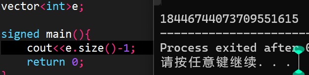

# 考前注意

考前碧月，考后羞花

```C++
- think
- simulate
- code
- debug
- test and check(INF,N,IO,div...)
```

[南外的极限卡常](https://flowus.cn/88e1475a-6357-4949-be1b-2bc288390d6c)

## 铭记

> 记录自己犯过的错！

- `#define int long long`是把`int`替换为`long long`,不要写反

- 请注意不要暴空间! $5000\times5000$ 最大了!!

- 多组数据一定要init！！检查STL和数组，变量是否清空！！eg.[https://www.luogu.com.cn/problem/B3614](https://www.luogu.com.cn/problem/B3614)

- 不能写`!a%3`！，取反优先级大于取余！（备注：`!a`当a=0或false时值为1，其余时值为0）

- `size()`返回unsigned，如果size为0那么$size-1=2\times INT_{MAX}$，访问越界所以RE



- 一定要把`cerr`注释掉！不会WA但是会TLE！

- 不要用`if(sqrt(j)*sqrt(j)==j)cout<<'!';`判定完全平方数

- 开栈！不然一下代码在跑的时候能过编，但直接死循环不让输入，原因是在进入out()函数时开的node a爆栈了。但是它不会让你跑到这个函数再re，而是一开始直接就re

```C++
string sa,sb;
struct node{
	int res[N];//define为ll ，压8位 
	int len;
};
node init(string s){
	//..
}
inline void out(node a){
	cerr<<a.len<<endl;
	printf("%lld",a.res[a.len]);
	for(int i=a.len-1;i;i--)printf("%08lld",a.res[i]);
}
signed main(){
	cin>>sa;
	node a=init(sa);
	out(a);
	return 0;
}
```

- deque请使用list替代

- 检查空间大小的代码

```C++
bool f1;
int ans,a[N<<2];
bool f2;

signed main(){
	printf("the size of your code is %lf MiB",1.00*((&f2)-(&f1))/1024/1024);
	return 0;
} 
```

- 洛谷评测机跑线段树类型题目可以跑$O(2e7)~700ms$

- 注意数组越界！尽量开大，但也不要爆空间

- 2^n可以用1<<n代替

- 交题不要交错！！

- 检查**inf（如求min时ans的初始值inf）是否够大**，需不需要1e18

- 注意自己是输出！不要最末尾又多输出了一个空的ans！！删代码要删干净！！

- 模块化写代码后注意不同区域的变量/数组会不会重名！！

- 吾日三省吾身：
你排序了吗？
你取模了吗？
你用%lld输出long long 了吗？
1LL<<x写对了吗？
判断=0用了abs()吗？
算组合数判了a<b吗？
线段树build()了吗？
.size()加了(signed)吗？
树链剖分的DFS序是在第二次更新的吗？

- 注意不要爆空间！略超空间不会导致MLE但会TLE（基本会让运行时间$\times 1.5$）

- 映射请使用`unordered_map`而不要使用`map`！！时间可能会$\times 10$

- 看清楚数据大小！别把3e5写成2e5

- 并查集要记得初始化

- 多测清空不要用memset，可以用栈记录修改的位置。

- 不要memset(a,-INF,sizeof a)，如果不确定请输出里面值看看！

- 看清楚MOD的值！！在复杂度允许下多取模（取模复杂度较大，但不卡常就不怕）

- floating point exception的问题原因：可能是除0或者%0

- 注意取模变成负数。如果怕取模出问题，那么就在输出时把(ans%MOD+MOD)%MOD（推荐）

- 注意不同的数组开的空间不一样！比如**存边的和存点的数组**大小就不一样。

- **考场上第一件事把编译器的O2打开！不然有一些时候RE检查不出来！**

- 注意for是先加再检查。看看下面的代码是什么问题？

```C++
for(int i=1;i<=40&&x[i]<=INF&&y[i]<=INF;i++){
        x[i]=2*x[i-1]+bx,y[i]=2*y[i-1]+by;cnt++;
    }

//答案：x[i],y[i]一直是0！！因为先加，再判断，再修改！
```

- 注意枚举模拟时还原初始状态！！！

- 如果发现看错了题目，那么一定要在改代码时不要漏掉没改

- 不要懒！有时间就测大样例！有多少测多少

- **编译防数组越界和整型越界：编译选项**[https://zhuanlan.zhihu.com/p/578225802](https://zhuanlan.zhihu.com/p/578225802)

- 注意结构体重载运算符

```C++
struct node{
	int w;
	bool operator < (const node &b) const{//如果是b[1]<b[2]，相当于调用了b[1]的<，把b[2]作为参数传入。那么括号内的就是b[2]，括号外的就是b[1]
		return w < b.w;
	}
}b[N];
 
main(){
	b[1].w=1;b[2].w=2;
	if(b[1]<b[2])cout<<"OK";
	else cout<<"NO";
}
//output: OK
```

- 判 UB: `-fsanitize=address,leak,undefined,signed-integer-overflow`！

- 别memset INF！！一定会WA！！除非用0x3f

- 写另外的题目时记得修改模数！别忘了！

- 注意即时访问map空节点也会产生新内存占用！因此即使map为空，从1到inf扫一边还是会MLE。

- 不能根据度数为1来确定叶子节点！！度数为1不代表叶子节点！！

- 注意对double数组memset不能为INF=0x3f！而应该是0x7f。万金油就是输出看看！！

- 注意double×double可能会冒出科学计数法！要整体强制转换为int才行，错误写法`(int)ceil(1.00*n/a)*ceil(1.00*m/a)`，正确写法`(int)(ceil(1.00*n/a)*ceil(1.00*m/a))`

- 多测记得清空，特别是vector存图时要清空vector，会MLE，WA

- **不要把快读和同步流cin一起用！会WA！**

- 注意不要对double使用快读！！

- 注意传参顺序。三个rd并排，第一个输入的数字作为第3个参数传入！

    `a[rd]=rd`也是反过来的。


- 注意节点开始的编号！

- 一种奇怪的MLE方法：dfs死循环导致爆栈MLE


- 再次提醒别除0！检查每一个除法是否有除0的可能。每一次写代码都要检查特别是打比赛！

- 在进行数组复用时，注意这个数组当前是否被占用了！（[练习 | 这人怎么天天刷题啊（old）](https://flowus.cn/e6cc57e3-3431-4413-8119-dd11aefcc3c0)城市环路）

- 注意，虽然会忽略行末空格和文件末尾换行，但是中间的换行不会忽略！别多输出了！会WA

- 当要潘判断两数大小，其中有一个数字可能超过LL时，可以将其转化为double

- 递归到一半停了？不知道为什么dfs超时了？（复杂度正确）——检查爆栈吧！（P2152）注意dfs时新建的栈占用！

- 离散化注意前面的要-a-1，二分时不需要-1.大多数情况都不-1没毛病，但总有挂的时候。（AT_joisc2014_c）

- 无论看上去有没有影响，不要让线段树越界！（南外 -600pts）

- `#define int long long` 对运行时间有较大影响（30%）

- 结构体内定义的数组初始值非0

- 不要忘记删注释

- 大文件最好使用freopen，因为有些时候剪贴板会裁剪后面的一部分并且强制停止输入，导致输入不全！

- 使用快读时我们会默认用cin输入char和string。注意这个时候要去掉快读，改用解除同步流。同步流要在freopen之前

- 因为数组越界会造成严重错误，并且本机无法查出，所以写完后必须检查每一个中括号。

- 实在不会高精度的情况下，可以使用double，double可以去到1.7*10^{308}，精度玄学

- **把题目每一个字都看过去！不要从样例推题目！**

- 离散化后注意那些是离散值，那些表示，不要把离散值和未离散值比较！

- 不要用并查集判重边！并查集是判联通用的！

- 注意在构建ST表时 j在外，i在内！


- 全局改__int128后记得把快读**快输**也改了。但是能不全局该就尽量不要。

- list为空时访问数据会返回(int)0，其他的会RE。注意力，list不会RE！

- 我知道你dfs时在往v走时会跳过fa，但是在别的地方枚举v时也记得要跳过fa！

- 注意vector存图和链表的区别：vector存图后访问v的顺序是建边顺序；链表访问v的顺序是建边顺序的**倒序**。有时算法要求从后往前访问，要注意vector要多一个reverse

- 在结构体内函数定义的数组的初始值不是0

- 以l为左端点，长度为cnt的区间的右端点为l+cnt-1。重点是如果你一开始写l+cnt，后面订正的时候不要少改了。

- vector常数会比set大一些（可能会tle掉10分），如果只是找前驱后继就别用vector了。

- 解除同步流写在freopen后面。不要用endl，不管有没有解都很慢。快读要写正规的，并且加上inline

- 一定要测大样例，每个乘号都问自己：会不会爆LL'

- 变量名别用混了，如：n不一定是字符串长度

- 如果手写了库里有的同名函数，且参数列表相同，那么会调用**库里的**！

- 每次初始化为INF时考虑INF够不够大

- bfs 在**入队时就标记**为visited，而不是等弹出了再标记！否则会重复进队且复杂度大几倍

- 二分逆序对数量时，INF要设置为$>N^2$。建议日常都使用1e18作为INF，除非对INF有运算。

- int和LL可以互相转换，但是vector<int>和vector<LL>是两个东西

- 树剖往上跳时不是比较$dep_a,dep_b$，而是比较top的dep。任意构造反例。

- 大压力本地RE请尝试开栈 `-Wl,--stack=SIZE`，注意中间用逗号隔开不是空格


- STL的时间复杂度很高（3倍常数，如list），因此可手写就手写。

- 枚举[-1000,1000]中间数字的组合，注意组数$2001\times 2001>4e6+5$

## 交题前必查

- 再次提醒别除0！检查每一个除法是否有除0的可能。每一次写代码都要检查特别是打比赛！

- INF范围，没有加法就开大

- 数组大小，不要小了或者大了。重点检查会不会小了！

- 检查返回值与函数类型的关系。


## 考前口诀

二分有等有加减。ans取mid在l更。

空间不大也别小，fre open别写错。

测试用建议编译命令：

```C++
g++ -Wall -O2 -std=c++14 -fsanitize=address,leak,undefined,signed-integer-overflow -o  "%e" "%f"
```

## 编译技巧

没有Dev-c++，仅有 Sublime怎么编译运行？

### 方法1：再找一遍Dev-c++

### 方法2：使用命令行进行编译

编辑一个  `run.bat` 内容如下

```Plain Text
g++ a.cpp -o out.exe
out.exe
```

其中`a.cpp`为源文件名称

然后就可以在命令行里输入啦

那么怎么样查看输出呢？

很简单，一种是在代码里加入暂停的代码（具体的自行百度）

```C++
system("pause");//仅限Windows
```

//或者在程序末尾添加一个输入。


还有一种是**输出到文件**
用`freopen`即可

## 考试常用工具代码

debug

```C++
#define c(x) cerr<<#x<<" : "<<x<<endl;;
#define ell cerr<<'\n'
```

空间

```C++
bool f1;
bool f2;
cerr<<1.*(&f2-&f1)/1024/1024<<" Mib\n";
```

时间

输出使用时间的代码

```C++
auto start = chrono::high_resolution_clock::now();
auto end = chrono::high_resolution_clock::now();
cerr << "time: " << chrono::duration<double, milli>(end - start).count() << "ms" << endl;
```

编译

```C++
g++ a.cpp -fsanitize=address -Wall -o a //需要-lm ？
```

## 一些小trick


- 连续的 3 个奇数一定互质，奇数和偶数一定互质

- 离线询问树上每个点的k级祖先，可以使用dfs栈来实现

- 遇到最优策略题，计数题，在思考策略时一定要优先考虑dp


- 二进制分组可以保证在log次分组中，每两个元素至少有一次被分在两个组中。 [GXOI/GZOI2019] 旅行者

- 如果有多个偏序约束关系，可以考虑通过排序（有顺序地加入）来消除一维。[POI2012] SZA-Cloakroom

- 如果n很小可以状态压缩，并且是计算方案，也要考虑一下容斥。（集合容斥）

- 如果在设计状态压缩时发现一个状态s和插入顺序无关了，那么可以把s拍扁为i，定义为插入前i个时的答案


