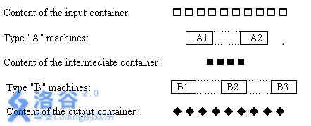
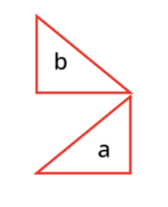
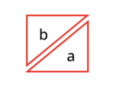
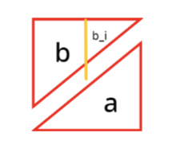

# 贪心十练

[www.luogu.com.cn](https://www.luogu.com.cn/training/145463#problems)


> 引用自 0htoAi

介绍一下我所知的贪心吧。

最基本的，贪心就是一直选择当前最优解从而得到全局最优解。贪心总是非常高效的算法，但并不适用于所有求最优解的问题。

一般来说像字典序最大这类问题都要用到贪心思想，因为字典序完美契合贪心的定义。01 字典树求解异或最大值问题也是同理。

而有时贪心就更难被发现了，这时就要用到数学归纳法、暴力推式子等方式验证贪心的正确性。有一种比较通用的证明贪心的方法叫邻项交换法，其实就是推式子然后比大小。

大多数难的贪心题的考察点都在贪心策略的选择上，因此大力猜结论和（感性）证明贪心的正确性就成为了一个人想要做出一道难的贪心题的关键所在。往往得到正确的贪心策略后代码就很好写了。

感性猜结论往往能够猜得八九不离十，但是一道好的贪心题不应该让结论非常容易猜到。比如 [CF1601D](https://codeforces.com/problemset/problem/1601/D) 这道题（[我写了题解](https://www.luogu.com.cn/problem/solution/CF1601D)），运用了数学归纳法，证明了一个与感性猜想相悖的很离谱的（也很美丽的）结论。

既然不能猜到结论，遇到这类问题应该怎么办呢？尝试着把暴力打出来，自己想几个贪心策略，然后 hack 自己，将 hack 数据用暴力跑然后看正解是怎么得到这个最优解的，找找规律就好。

除此之外，多做贪心题一定是有助于增长视野的。一个种类的贪心题只需要做一道，其它题也就迎刃而解了。

贪心整合包三件套包含了贪心入门题到贪心难题一共 70 多道题，包含了大多数常见的贪心策略和一些高妙策略。每道题我都有看过，绝大多数题我都做过，保证每道题的核心部分都是贪心，当然也有一些题要适当运用数据结构。

另外，个人认为模拟费用流就是贪心，虽然一些题就是线段树维护费用流。费用流的题是不属于贪心题的，但模拟费用流本质还是可以用贪心解释，且也符合贪心的定义，故模拟费用流的题属于贪心题。不过由于 Dijkstra 和 Kruskal 等算法虽然模板用了贪心思想，但一般题目的难点是建模，故不属于贪心题。

最后，若有做法非常高妙的贪心题欢迎私信给我说。

---

最近看到一个有趣的问题：

```C++
为什么克鲁斯卡尔算法也被算作是贪心算法？
贪心算法的定义：“贪心算法”是指在对问题求解时，总是做出在当前看来是最好的选择。也就是说，不从整体最优上加以考虑，算法得到的是在某种意义上的局部最优解。

我能理解kruskal找的边是“当前”最短的边，但这个当前最短的边不是全局的路径排序的来的吗？因为kruskal解决MST问题只需要考虑顶点、边、边的权重三个因素，而每每加入一条边，整个算法就向前推进一个进度（经过定点数V-1次算法结束），所以每条边除了权值差异就都是等价的。已经对全部路径的权值进行了排序难道不就是考虑了全局路径的情况，不就是从整体最优上考虑的吗？怎么还能被算作贪心算法呢？（相对的，prim算法、迪杰斯特拉算法算作是贪心算法我就觉得很合理）
```

[来源](https://www.zhihu.com/question/526333056/answer/2427783778)

这是一个很奇妙的想法，这种想法的谬误在于：把排序认为是 Kruskal 算法的一部分了。

事实上现在也有很多人认为`贪心题必须要排序`，但排序和贪心从来没有任何关系。重要的是，贪心只是一种思想，而排序只是为了降低时间复杂度。排序恰好契合了贪心一直选当前最优的思想，能够将每次重新找最优变为连续的从优到劣。堆经常被用来做贪心题亦是如此。如果一直想着“我应该按哪一维排序”或者“堆的排序关键字是什么”这种问题，而不想贪心究竟是为了什么，那就得不偿失了。

## #1 [USACO4.2] 工序安排 Job Processing


一家工厂的流水线正在生产一种产品，这需要两种操作：操作 $A$ 和操作 $B$。每个操作只有一些机器能够完成。



上图显示了按照下述方式工作的流水线的组织形式。$A$ 型机器从输入库接受工件，对其施加操作 $A$，得到的中间产品存放在缓冲库。$B$ 型机器从缓冲库接受中间产品，对其施加操作 $B$，得到的最终产品存放在输出库。所有的机器平行并且独立地工作，每个库的容量没有限制。每台机器的工作效率可能不同，一台机器完成一次操作需要一定的时间。

给出每台机器完成一次操作的时间，计算完成 $A$ 操作的时间总和的最小值，和完成 $B$ 操作的时间总和的最小值。

注：

1. 机器在一次操作中干掉一个工件；

2. 时间总和的意思是最晚时间点。

输入格式

第一行：三个用空格分开的整数：$N$，工件数量（$1\leq N\leq1000$）；$M_1$，$A$ 型机器的数量（$1\leq M_1\leq30$）；$M_2$，$B$ 型机器的数量 （$1\leq M_2\leq30$）。

第二行：$M_1$ 个整数，表示 $A$ 型机器完成一次操作的时间；接着是 $M_2$ 个整数，$B$ 型机器完成一次操作的时间。

输出格式

只有一行。输出两个整数：完成所有 $A$ 操作的时间总和的最小值，和完成所有 $B$ 操作的时间总和的最小值（$A$ 操作必须在 $B$ 操作之前完成）。

---

首先考虑第一问，那么我们就是按指针堆的方式（见[优先队列](https://flowus.cn/6ecea108-0fcd-4a68-abb7-08662a63f429)）维护当前t最小的机器A_i，将任务分配给它。其中t_i的含义是：若任务j给A_i，那么任务j的结束时间为t_i。

考虑第二问，我们同样按照第一问的方法，计算出如果跳过A加工，直接进行B加工，需要的最少时间。

对于上述两问的操作，我们可以得到2个数组a,b，表示只经过A/B加工时第i个任务的结束时间。那么我们最后只需要让a最小的和b最大的匹配，第二和倒数第二匹配……这样匹配后求max就是第二问的答案。


为什么呢？第一问很好理解，第二问为什么可以这样做？



如果我们用三角形的高代表a,b的元素的大小，同一竖下来的代表一个任务，那么我们上面的算法应该是上图，怎么可能是最优的呢？并且我们是不是没有计算中间的空白部分啊？

如果这样想就错啦！实际上应该是这样的：



我们求出b的三角只是为了方便倒过来拼接。这样做一定是可行的。



考虑橙条是一个长出来的任务，那么我们只需要将b向上平移就可以得到合法的方案。这个向上偏移的过程也就相当于是取max的过程了。

## #2 [USACO13FEB] Taxi G

长度为m的栅栏上，有n头牛需要坐车前往别的地方，起点和终点分别为$a_i$和$b_i$。现在一辆出租车从最左端0出发，要运送完所有牛，最后到达最右端m，求最小路程。出租车只能一次载一只牛。

---

首先n头牛的路程是一定要走的，那么我们先加上这些路程。

接下来我们考虑我们还会在那些地方浪费路程：从一个终点到一个起点。我们注意到每一个起点和每一个终点我们只会作为路径点经过一次，并且每次都是从一个终点到一个起点。于是我们可以将所有起点和终点分别排序，每次取出相邻的两个，走它们之间的路程，任何删掉这两个点。注意要将0加入终点，m加入起点。

那么为什么我们可以将起点和终点打乱呢？因为我们注意题目中一个可行的操作：**我们可以将一头牛运到半路，先放下，后面再回头重新再接上。**这样我们就可以认为起点和终点不再绑定了。

## #3 Happy Line


给定一个 $n$ 个元素的整数序列 $a$, 任意时刻对于任一对**相邻元素** $(a_{i-1},a_i)$，若 $a_{i-1} > a_{i}$ 则要依次执行如下两个操作：

`a[i-1]--,a[i]++`，然后交换 $a_{i-1}$ 和 $a_i$ 的位置。

经过若干次 1、2 操作后，若能使整个序列变成**非降的**，则输出最终的序列；否则输出 `:(` 。

$1 \leq n \leq 2\times 10^5, 0 \leq a[i] \leq 10^9$。

---

我们发现操作后的a_i+i的值是恒定的。因此我们将a_i重新赋值为a_i+i，排序。如果存在a_i=a_{i+1}，那么就说明无解，否则有解。

## #4 Difficult Mountain

$n$ 个人相约去爬山。
山的初始攀登难度为 $d$。
每位登山者有两个属性：技巧 $s$ 和整洁度 $a$。

技巧为 $s$ 的登山者能登上攀登难度为 $p$ 的山当且仅当 $p\leq s$。
在一位整洁度为 $a$ 的登山者登上攀登难度为 $p$ 的山后，山的攀登难度会变为 $\max(p,a)$。

请给这些登山者指定一个爬山的先后顺序，最大化登上山的人数。
如果轮到一位登山者时他能登上山，则他一定会选择登山。

输入格式

第一行两个整数 $n,d$（$1\leq n\leq5\times10^5$，$0\leq d\leq10^9$）。
接下来 $n$ 行每行两个整数 $s_i,a_i$，描述第 $i$ 个登山者的信息。

输出格式

一行一个整数，为登上山的人数的最大值。

## #5 Sequence

给定一个序列，每次操作可以把某个数加上 $1$ 或减去 $1$。要求把序列变成非降数列。最小化操作次数。

---

我们考虑模拟一下过程。就拿

7 

1 3 2 4 5 3 9

好了

```C++
1 ok
1 3 ok
1 3 2 -> 1 3 3 +1
1 3 3 4 ok
1 3 3 4 5 ok
1 3 3 4 5 3 -> 1 3 3 4 5 5 +2
1 3 3 4 5 5 9 ok
ans: 3
```

我们的策略是：如果第i个数对于当前局面来说不合法，那么就将当前的最大值调整为a_{i}。

为什么这样是合法的呢？我们考虑以下hack

1 2 6 7 4 5

因为我们每次进来一个数，就会将大于它的一个数字调整为和他相同。

1 2 5 4 4 5  

那么上面的不不就相当于这个吗？表示不合法吗？

这里有一个很关键的点，就是我们将7 4调整为4 4，也等效于调整为5 5,6 6,7 7。于是我们就可以认为7和4经过调整后变成了在[4,7]间的**可变数字**。每次加入数字a_i，我们就将前面的大于a_i的最大的数字a_j，和a_i一并变成可变数字。那么正确性呢？

我们发现一对可变数字(l,r)中间的数字一定是可以通过调整使得其均相等，且在两端的可变数字值域内。如果中间的数字偏小，那么一定会先于r和l配对，如果更大，那么会替代l与r配对。

这样就可以满足不降了。

类似题目

[www.luogu.com.cn](https://www.luogu.com.cn/problem/P2893)


## #6「SvR-2」1+2=3

你有一些木棒，每个木棒左边有一个数，右边有一个数，数只有 $0,1,2$，你要将所有木棒拼起来，使相邻的数和为 $3$ 的对数最大。

例如，$1\text{ - }2$ 和 $1\text{ - }0$ 两个木棒，如果按 $1\text{ - }0,1\text{ - }2$ 这样拼，相邻的数和为 $3$ 的对数是 $0$；而按 $1\text{ - }{\color{red}\textbf2},{\color{red}\textbf1}\text{ - }0$ 这样拼相邻的数和为 $3$ 的对数是 $1$，因为 $2+1=3$。

---

如果要贪心地让匹配尽可能多，那么我们一定是将起点为1的和终点为2的配对，起点为2的和终点为1的配对。这个是大体正确的了。但是有如下的特殊情况：

- 只有2-1或者1-2，那么我们就会连成一个环，导致答案多了1。

    具体来说，就是我们的1-0,1-1,1-2和0-2,1-2,2-2可以匹配，但是我们发现其中的1-2是重复的。这里不需要除2，因为可以用1-2自己首尾相连，但是要注意，如果**上述5种里面**只存在1-2，那么计算出的答案就是1-2首尾相连的环了，需要-1。另外5种匹配类似。

- 匹配后的链的两端分别是1和2，导致这对也被计算了进去。这种情况当且仅当配对数=\sum a时，代表所有木棍都参与了进去，相乘了一个环。哪怕有一个木棍没有参与，那么都可以从那里断开，因此不会成环。

- 上述两种情况特判，-1即可。

## #7 序列

有一个整数序列，它的每个数各不相同，我们不知道它的长度是多少（即整数个数），但我们知道在某些区间中间至少有多少个整数，用区间（$L_i,R_i,C_i$）来描述，表示这个整数序列中至少有 $C_i$ 个数来自区间 $[L_i,R_i]$，给出若干个这样的区间，问这个整数序列的长度最少能为多少？

输入格式

第一行一个整数 $N$，表示区间个数；

接下来 $N$ 行，每行三个整数 $L_i,R_i,C_i$，描述一个区间。

输出格式

仅一个数，表示该整数序列的最小长度。

对于全部数据，$1\le N \le 1000$，$0 \le L_i \le R_i \le 1000$，$1 \le C_i \le R_i-L_i+1$。

---

很经典的题目。我们发现所有的整数应该放在区间的末尾。于是我们按照r排序，然后用前缀和维护区间内已有的数字数量即可。补齐时补在区间末尾。

注意每一个空位只能放一个数字。


类似的填数贪心

[www.luogu.com.cn](https://www.luogu.com.cn/problem/P6155)


## #8 Olympiad in Programming and Sports

有 $n$ 个学生每人有两种技能，分别是 $a,b$ 表示编程能力和运动能力。你需要将他们分为两个团队分别参加编程比赛和体育比赛，编程团队有 $p$ 人，体育团队有 $s$ 人，一个学生只能参加其中一项。每个团队的力量是其成员在对应领域能力总和，请问如何分配能使得两个团队的实力和最大？

**输入**

共三行，第一行包含三个正整数 $n,p,s$。

第二行有 $n$ 个整数 $a_1,a_2\cdots a_n$，第三行，有 $n$ 个整数$b_1,b_2\cdots b_n$。

**输出**

第一行输出整个团队最大的实力，然后给出一种构造方案即可。

**数据范围**

- $2<\le n\le 3\times 10^3$ 且 $p+s\le n$。

- $1\le a_i,b_i\le 3000$。

## #9 [ABC137D] Summer Vacation

一共有 $N$ 个任务和 $M$ 天，一天只能做一个任务，任务只能做一次，任务当天做完。做完任务后可以在做完后的第 $A_i$ 天拿到 $B_i$ 的工资，问 $M$ 天内最多可以拿到多少工资？

---

在t之前选择可以使得贡献+a

那么末尾考虑倒序枚举时间，每次选可以选的里面的max

## #10 [ABC123D] Cake 123

AT 小卖部从下学期开始售卖带有数字形状的蛋糕，$X$，$Y$ 和 $Z$ 种蛋糕分别带有 $1$ 形，$2$ 形和 $3$ 形蜡烛，而且每个蛋糕都有美味值，如下所示：

- 带有 $1$ 形蜡烛的美味值有： $A_1,A_2,\cdots,A_X$

- 带有 $2$ 形蜡烛的美味值有： $B_1,B_2,\cdots,B_Y$

- 带有 $3$ 形蜡烛的美味值有： $C_1,C_2,\cdots,C_Z$

你决定购买三个蜡烛不同的蛋糕，请你将每种方案的美味值由大到小排序，依次打印前 $K$ 种方案的美味值。

- $1\ \leq\ X\ \leq\ 1\ 000$，$1\ \leq\ Y\ \leq\ 1\ 000$，$1\ \leq\ Z\ \leq\ 1\ 000$

- $1\ \leq\ K\ \leq\ \min(3\ 000,\ X\ \times\ Y\ \times\ Z)$

- $1\ \leq\ A_i\ \leq\ 10\ 000\ 000\ 000$，$1\ \leq\ B_i\ \leq\ 10\ 000\ 000\ 000$，$1\ \leq\ C_i\ \leq\ 10\ 000\ 000\ 000$

---

首先考虑如果只有两者蛋糕，那么我们可以用堆维护指针：堆里面记录的struct为{和，a指针，b指针}。每次取出最大值{sum,a,b}，弹出，将{newSum,a,b+1}推入。初始化时将所有{sum,i,1}推入。

那么对于本题，我们将b,c组合一下，变成一个大小为$y\times z$的蛋糕即可。


当然，鉴于本题的x,y,z,k很小，可以先a,b组合，取出前k大的再和c组合。

