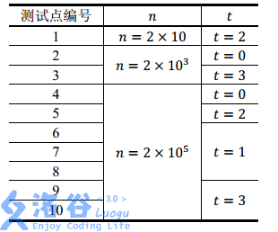

DP | DP优化

# 倍增优化

除了多重背包的二进制拆分优化，还有什么？

## [USACO16OPEN] 262144 P

Bessie likes downloading games to play on her cell phone, even though she  doesfind the small touch screen rather cumbersome to use with her large hooves.

She is particularly intrigued by the current game she is playing.The game starts with a sequence of $N$ positive integers ($2 \leq N\leq 262,144$), each in the range $1 \ldots 40$.  In one move, Bessiecan take two adjacent numbers with equal values and replace them asingle number of value one greater (e.g., she might replace twoadjacent 7s with an 8). The goal is to maximize the value of thelargest number present in the sequence at the end of the game.  Pleasehelp Bessie score as highly as possible!

Bessie喜欢在手机上下游戏玩（……），然而她蹄子太大，很难在小小的手机屏幕上面操作。

她被她最近玩的一款游戏迷住了，游戏一开始有n个正整数，(2<=n<=262144)，范围在1-40。在一步中，贝西可以选相邻的两个相同的数，然后合并成一个比原来的大一的数（例如两个7合并成一个8)，目标是使得最大的数最大，请帮助Bessie来求最大值。

The first line of input contains $N$, and the next $N$ lines give the sequence

of $N$ numbers at the start of the game.

### 思路

乍一看我们觉得应该是一道区间dp的题目，但是当我看到数据范围时，就否定了传统的区间dp思想。那除了使用区间dp，还能怎么做呢？

我们考虑倍增。定义f_{i,j}为以i为左端点合成数字j的区间右端点。那么我们有转移式

$f_{i,j}=f_{f_{i,j-1}+1,j-1}$

为什么我们会想到使用倍增呢？因为我们发现，两个数字合成一个数，像极了两个2^i相加合成2^{i+1}，并且恰好就是其指数的关系，所以我们会考虑使用倍增俩记录区间长度。

这里我们还可以i计算出我们最大可以合成的数字为58，所以j的上界就是58.注意我们在转移时要用到j-1的信息，所以也该把j放在最外面。

---

注意不要从不存在方案的地方转移过来。

```C++
/*                                                                                
                      Keyblinds Guide
     				###################
      @Ntsc 2024

      - Ctrl+Alt+G then P : Enter luogu problem details
      - Ctrl+Alt+B : Run all cases in CPH
      - ctrl+D : choose this and dump to the next
      - ctrl+Shift+L : choose all like this
      - ctrl+K then ctrl+W: close all
	  
*/
#include <bits/stdc++.h>
#include <queue>
using namespace std;

#define rep(i, l, r) for (int i = l, END##i = r; i <= END##i; ++i)
#define per(i, r, l) for (int i = r, END##i = l; i >= END##i; --i)
#define pb push_back
#define mp make_pair
// #define int long long
#define pii pair<int, int>
#define ps second
#define pf first

// #define innt int
// #define inr int
// #define mian main
// #define iont int

#define rd read()
int read(){
    int xx = 0, ff = 1;
    char ch = getchar();
    while (ch < '0' || ch > '9') {
		if (ch == '-')
			ff = -1;
		ch = getchar();
    }
    while (ch >= '0' && ch <= '9')
      xx = xx * 10 + (ch - '0'), ch = getchar();
    return xx * ff;
}
void write(int out) {
	if (out < 0)
		putchar('-'), out = -out;
	if (out > 9)
		write(out / 10);
	putchar(out % 10 + '0');
}

#define nl dbg('\n')
const char el='\n';
const bool enable_dbg = 0;
template <typename T,typename... Args>
void dbg(T s,Args... args) {
	if constexpr (enable_dbg){
    cerr << s << ' ';
		if constexpr (sizeof...(Args))
			dbg(args...);
	}
}

const int N = 1e6 + 5;
const int INF = 1e18;
const int M = 1e7;
const int MOD = 1e9 + 7;

int a[N],ans,f[N][66];

void solve(){
    int n=rd;
    rep(i,1,n){
        a[i]=rd;
        f[i][a[i]]=i;
    }
    rep(j,1,58){
        rep(i,1,n){
            if(f[i][j-1])f[i][j]=max(f[i][j],f[f[i][j-1]+1][j-1]);
            dbg(f[i][j]);
            if(f[i][j]<=n+1&&f[i][j]>0)ans=j;
        }
    nl;
    }
    cout<<ans<<endl;
}

signed main() {
    int T=1;
    while(T--){
    	solve();
    }
    return 0;
}
```

```C++
/*                                                                                
                      Keyblinds Guide
     				###################
      @Ntsc 2024

      - Ctrl+Alt+G then P : Enter luogu problem details
      - Ctrl+Alt+B : Run all cases in CPH
      - ctrl+D : choose this and dump to the next
      - ctrl+Shift+L : choose all like this
      - ctrl+K then ctrl+W: close all
	  
*/
#include <bits/stdc++.h>
#include <queue>
using namespace std;

#define rep(i, l, r) for (int i = l, END##i = r; i <= END##i; ++i)
#define per(i, r, l) for (int i = r, END##i = l; i >= END##i; --i)
#define pb push_back
#define mp make_pair
// #define int long long
#define pii pair<int, int>
#define ps second
#define pf first

// #define innt int
// #define inr int
// #define mian main
// #define iont int

#define rd read()
int read(){
    int xx = 0, ff = 1;
    char ch = getchar();
    while (ch < '0' || ch > '9') {
		if (ch == '-')
			ff = -1;
		ch = getchar();
    }
    while (ch >= '0' && ch <= '9')
      xx = xx * 10 + (ch - '0'), ch = getchar();
    return xx * ff;
}
void write(int out) {
	if (out < 0)
		putchar('-'), out = -out;
	if (out > 9)
		write(out / 10);
	putchar(out % 10 + '0');
}

#define nl dbg('\n')
const char el='\n';
const bool enable_dbg = 1;
template <typename T,typename... Args>
void dbg(T s,Args... args) {
	if constexpr (enable_dbg){
    cerr << s << ' ';
		if constexpr (sizeof...(Args))
			dbg(args...);
	}
}

const int N = 1e6 + 5;
const int INF = 1e18;
const int M = 1e7;
const int MOD = 1e9 + 7;

int a[N],ans,f[N][66];

void solve(){
    int n=rd;
    rep(i,1,n){
        a[i]=rd;
        f[i][a[i]]=i+1;
    }
    rep(j,1,58){
        rep(i,1,n){
            f[i][j]=max(f[i][j],f[f[i][j-1]][j-1]);
            if(f[i][j]<=n+1&&f[i][j]>0)ans=j;
        }

    }
    cout<<ans<<endl;
}

signed main() {
    int T=1;
    while(T--){
    	solve();
    }
    return 0;
}
```

## 跑路

题目描述

小 A 的工作不仅繁琐，更有苛刻的规定，要求小 A 每天早上在 $6:00$ 之前到达公司，否则这个月工资清零。可是小 A 偏偏又有赖床的坏毛病。于是为了保住自己的工资，小 A 买了一个空间跑路器，每秒钟可以跑 $2^k$ 千米（$k$ 是任意自然数）。当然，这个机器是用 `longint` 存的，所以总跑路长度不能超过 `maxlongint` 千米。小 A 的家到公司的路可以看做一个有向图，小 A 家为点 $1$，公司为点 $n$，每条边长度均为一千米。小 A 想每天能醒地尽量晚，所以让你帮他算算，他最少需要几秒才能到公司。数据保证 $1$ 到 $n$ 至少有一条路径。

输入格式

第一行两个整数 $n,m$，表示点的个数和边的个数。

接下来 $m$ 行每行两个数字 $u,v$，表示一条 $u$ 到 $v$ 的边。

输出格式

一行一个数字，表示到公司的最少秒数。

提示

**【样例解释】**

$1 \to 1 \to 2 \to 3 \to 4$，总路径长度为 $4$ 千米，直接使用一次跑路器即可。

**【数据范围】**

$50\%$ 的数据满足最优解路径长度 $\leq 1000$；

$100\%$ 的数据满足 $2\leq n \leq 50$，$m \leq 10 ^ 4$，最优解路径长度 $\leq$ `maxlongint`。

### 思路

这道题目求的是从1号点到n号点最少要几秒到达。我们可以看到这个跑路器，每秒跑2^k条边（每条边1km），所以呢，这道题目明显就和“倍增”扯上了关系。回忆倍增，我们总是用一个参数k表示2^k，这道题目也一样，我们需要用一个bool类型G数组，G[i][j][k]代表从i到j是否存在一条长度为2^k的路径。再用dis数组来记录两点之间需要用多久到达。这样我们可以用G来保存所有的边，并且进行预处理，把所有一秒能到的两个点之间都连上边，并把距离相应调整为1。那么我们就把所有一秒能到的点之间都铺上了边，接下来我们就要求出两点之间的最短路啦，那么，大家都明白了，对于50的数据，Floyd绝对是最简单可行的办法了。

为了处理G数组，我们跑一次类似flyd的算法。枚举三个点 i,j,t，如果i到t存在一条2^k-1长度的路径，并且t到j存在一条2^k-1长度的路径，就说明i到t，t到j都可以一秒到达， 路程*2刚好是2的幂，也可以一秒到达

---

```C++
#include <bits/stdc++.h>
#define rep(l, r, i) for (int i = l, END##i = r; i <= END##i; ++i)
#define per(r, l, i) for (int i = r, END##i = l; i >= END##i; --i)
using namespace std;
#define int long long
#define pii pair<int, int>

#define lc(x) (x << 1)
#define rc(x) (x << 1 | 1)

#define rd read()
int read() {
  int xx = 0, ff = 1;
  char ch = getchar();
  while (ch < '0' || ch > '9') {
    if (ch == '-')
      ff = -1;
    ch = getchar();
  }
  while (ch >= '0' && ch <= '9')
    xx = xx * 10 + (ch - '0'), ch = getchar();
  return xx * ff;
}
void write(int out) {
  if (out < 0)
    putchar('-'), out = -out;
  if (out > 9)
    write(out / 10);
  putchar(out % 10 + '0');
}

const int N = 2e5 + 15;
const int INF = 1e9 + 5;
const int MOD = 998244353;

int dis[60][60], n, m;
bool G[60][60][65];

void init() {
  memset(G, false, sizeof(G));
  memset(dis, 10, sizeof(dis));
  scanf("%lld%lld", &n, &m);
  for (int i = 1; i <= m; i++) {
    int x, y;
    scanf("%lld%lld", &x, &y);
    dis[x][y] = 1;
    G[x][y][0] = true;
  }
}
void work() {
  for (int k = 1; k <= 64; k++)
    for (int i = 1; i <= n; i++)
      for (int t = 1; t <= n; t++)
        for (int j = 1; j <= n; j++)
          if (G[i][t][k - 1] && G[t][j][k - 1]) {
            G[i][j][k] = true;
            dis[i][j] = 1;
          }
}
void floyd() {
  for (int k = 1; k <= n; k++)
    for (int i = 1; i <= n; i++)
      for (int j = 1; j <= n; j++)
        dis[i][j] = min(dis[i][j], dis[i][k] + dis[k][j]);
}

signed main() {
  init();
  work();
  floyd();
  printf("%lld", dis[1][n]);
  return 0;
}

```

## ??|[NOIP2012 提高组] 开车旅行

题目描述

小 $\text{A}$ 和小 $\text{B}$ 决定利用假期外出旅行，他们将想去的城市从 $1 $ 到 $n$ 编号，且编号较小的城市在编号较大的城市的西边，已知各个城市的海拔高度互不相同，记城市 $i$ 的海拔高度为$h_i$，城市 $i$ 和城市 $j$ 之间的距离 $d_{i,j}$ 恰好是这两个城市海拔高度之差的绝对值，即 $d_{i,j}=|h_i-h_j|$。

旅行过程中，小 $\text{A}$ 和小 $\text{B}$ 轮流开车，第一天小 $\text{A}$ 开车，之后每天轮换一次。他们计划选择一个城市 $s$ 作为起点，一直向东行驶，并且最多行驶 $x$ 公里就结束旅行。

小 $\text{A}$ 和小 $\text{B}$ 的驾驶风格不同，小 $\text{B}$ 总是沿着前进方向选择一个最近的城市作为目的地，而小 $\text{A}$ 总是沿着前进方向选择第二近的城市作为目的地（注意：本题中如果当前城市到两个城市的距离相同，则认为离海拔低的那个城市更近）。如果其中任何一人无法按照自己的原则选择目的城市，或者到达目的地会使行驶的总距离超出 $x$ 公里，他们就会结束旅行。

在启程之前，小 $\text{A}$ 想知道两个问题：

1、 对于一个给定的 $x=x_0$，从哪一个城市出发，小 $\text{A}$ 开车行驶的路程总数与小 $\text{B}$ 行驶的路程总数的比值最小（如果小 $\text{B}$ 的行驶路程为 $0$，此时的比值可视为无穷大，且两个无穷大视为相等）。如果从多个城市出发，小 $\text{A}$ 开车行驶的路程总数与小 $\text{B}$ 行驶的路程总数的比值都最小，则输出海拔最高的那个城市。

2、对任意给定的 $x=x_i$ 和出发城市 $s_i$，小 $\text{A}$ 开车行驶的路程总数以及小 $\text B$ 行驶的路程总数。

输入格式

第一行包含一个整数 $n$，表示城市的数目。

第二行有 $n$ 个整数，每两个整数之间用一个空格隔开，依次表示城市 $1$ 到城市 $n$ 的海拔高度，即 $h_1,h_2 ... h_n$，且每个 $h_i$ 都是互不相同的。

第三行包含一个整数 $x_0$。

第四行为一个整数 $m$，表示给定 $m$ 组 $s_i$ 和 $x_i$。

接下来的 $m$ 行，每行包含 $2$ 个整数 $s_i$ 和 $x_i$，表示从城市$s_i$ 出发，最多行驶 $x_i$ 公里。

输出格式

输出共 $m+1$ 行。

第一行包含一个整数 $s_0$，表示对于给定的 $x_0$，从编号为 $s_0$ 的城市出发，小 $\text A$ 开车行驶的路程总数与小 $\text B$ 行驶的路程总数的比值最小。

接下来的 $m$ 行，每行包含 $2$ 个整数，之间用一个空格隔开，依次表示在给定的 $s_i$ 和 $x_i$ 下小 $\text A$ 行驶的里程总数和小 $\text B$ 行驶的里程总数。

提示

【样例1说明】


各个城市的海拔高度以及两个城市间的距离如上图所示。

如果从城市 $1$ 出发，可以到达的城市为 $2,3,4$，这几个城市与城市 $1$ 的距离分别为 $1,1,2$，但是由于城市 $3$ 的海拔高度低于城市 $2$，所以我们认为城市 $3$ 离城市 $1$ 最近，城市 $2$ 离城市 $1$ 第二近，所以小A会走到城市 $2$。到达城市 $2$ 后，前面可以到达的城市为 $3,4$，这两个城市与城市 $2$  的距离分别为 $2,1$，所以城市 $4$ 离城市 $2$ 最近，因此小B会走到城市$4$。到达城市 $4$ 后，前面已没有可到达的城市，所以旅行结束。

如果从城市 $2$ 出发，可以到达的城市为 $3,4$，这两个城市与城市 $2$ 的距离分别为 $2,1$，由于城市 $3$ 离城市 $2$ 第二近，所以小 $\text A$ 会走到城市 $3$。到达城市 $3$ 后，前面尚未旅行的城市为 $4$，所以城市 $4$ 离城市 $3$ 最近，但是如果要到达城市 $4$，则总路程为 $2+3=5>3$，所以小 $\text B$ 会直接在城市 $3$ 结束旅行。

如果从城市 $3$ 出发，可以到达的城市为 $4$，由于没有离城市 $3$ 第二近的城市，因此旅行还未开始就结束了。

如果从城市 $4$ 出发，没有可以到达的城市，因此旅行还未开始就结束了。

【样例2说明】

当 $x=7$ 时，如果从城市 $1$ 出发，则路线为 $1 \to 2 \to 3 \to 8 \to 9$，小 $\text A$ 走的距离为 $1+2=3$，小 $\text B$ 走的距离为 $1+1=2$。（在城市 $1$ 时，距离小 $\text A$ 最近的城市是 $2$ 和 $6$，但是城市 $2$ 的海拔更高，视为与城市 $1$ 第二近的城市，所以小 $\text A$ 最终选择城市 $2$；走到$9$ 后，小 $\text A$ 只有城市 $10$ 可以走，没有第二选择可以选，所以没法做出选择，结束旅行）

如果从城市 $2$ 出发，则路线为 $2 \to 6 \to 7$，小 $\text A$ 和小 $\text B$ 走的距离分别为 $2,4$。

如果从城市 $3$ 出发，则路线为 $3 \to 8 \to 9$，小 $\text A$ 和小 $\text B$ 走的距离分别为$2,1$。

如果从城市 $4$ 出发，则路线为 $4 \to 6 \to 7$，小 $\text A$ 和小 $\text B$ 走的距离分别为 $2,4$。

如果从城市 $5$ 出发，则路线为 $5 \to 7 \to 8$，小 $\text A$ 和小 $\text B$ 走的距离分别为 $5,1$。

如果从城市 $6$ 出发，则路线为 $6 \to 8 \to 9$，小 $\text A$ 和小 $\text B$ 走的距离分别为$5,1$。

如果从城市 $7$ 出发，则路线为 $7 \to 9 \to 10$，小 $\text A$ 和小 $\text B$ 走的距离分别为$2,1$。

如果从城市 $8$ 出发，则路线为 $8 \to 10$，小 $\text A$ 和小 $\text B$ 走的距离分别为$2,0$。

如果从城市 $9$ 出发，则路线为 $9$，小 $\text A$ 和小 $\text B$ 走的距离分别为 $0,0$（旅行一开始就结束了）。

如果从城市 $10$ 出发，则路线为 $10$，小 $\text A$ 和小 $\text B$ 走的距离分别为$0,0$。

从城市 $2$ 或者城市 $4$ 出发小 $\text A$ 行驶的路程总数与小 $\text B$ 行驶的路程总数的比值都最小，但是城市 $2$ 的海拔更高，所以输出第一行为 $2$。

【数据范围与约定】

对于 $30\%$ 的数据，有$1\le n \le 20,1\le m\le 20$；
对于$40\%$ 的数据，有$1\le n \le 100,1\le m\le 100$；
对于 $50\%$ 的数据，有$1\le n \le 100,1\le m\le 1000$；
对于 $70\%$ 的数据，有$1\le n \le 1000,1\le m\le 10^4$；
对于 $100\%$ 的数据：$1\le n,m \le 10^5$，$-10^9 \le h_i≤10^9$，$1 \le s_i \le n$，$0 \le x_i \le 10^9
$数据保证 $h_i$ 互不相同。

### 思路

首先这里每个点所对应的第一和第二近的城市都是确定的，因此我们需要预处理出来。接下来我们考虑问题1

问题1

如果我们要枚举起点，那么我们只能用O(\log n)的复杂度完成每一次模拟开车了。那么这样的话其实我们如果可以用O(\log n)时间完成每一个问题2，那么问题1也就迎刃而解了。所以下面我们能来讨论问题2

问题2

我们要在O(\log n)复杂度内完成一次模拟开车，那么我们想到的是倍增。可是怎么样倍增呢？

---

std

INF开大

```C++
#include <bits/stdc++.h>
#define rep(l, r, i) for (int i = l, END##i = r; i <= END##i; ++i)
#define per(r, l, i) for (int i = r, END##i = l; i >= END##i; --i)
using namespace std;
// #define int long long
#define pii pair<int, int>
#define LL __int128

#define lc(x) (x << 1)
#define rc(x) (x << 1 | 1)

#define rd read()
int read() {
  int xx = 0, ff = 1;
  char ch = getchar();
  while (ch < '0' || ch > '9') {
    if (ch == '-')
      ff = -1;
    ch = getchar();
  }
  while (ch >= '0' && ch <= '9')
    xx = xx * 10 + (ch - '0'), ch = getchar();
  return xx * ff;
}
void write(LL out) {
  if (out < 0)
    putchar('-'), out = -out;
  if (out > 9)
    write(out / 10);
  putchar(out % 10 + '0');
}

const int N = 1e5 + 15;
const int INF = 1e18 + 5;
// const int MOD = 1 << 30;

struct node {
  long long h;
  int id;
} h[N], ga[N], gb[N];
struct point {
  long long la, lb;
};
bool operator<(node as, node bs) {
  if (as.h != bs.h)
    return as.h < bs.h;
  else
    return as.id < bs.id;
}
set<node> q;
double ans = INF;
int n, f[20][N][3];
long long da[20][N][3], db[20][N][3];
bool cmp(node as, node bs) { 
    return as.h < bs.h; 
}
point Calc(int p, int x) {
  long long la = 0, lb = 0;
  for (int i = 18; i >= 0; i--) {
    if (f[i][p][0] && la + lb + da[i][p][0] + db[i][p][0] <= x) {
      la += da[i][p][0];
      lb += db[i][p][0];
      p = f[i][p][0];
    }
  }
  return {la, lb};
}
signed main() {
  n = rd;
  q.insert({INF, 0});
  q.insert({INF - 1, 0});
  q.insert({-INF, 0});
  q.insert({-INF + 1, 0});
  for (int i = 1; i <= n; i++) {
    h[i].h = rd;
    h[i].id = i;
  }

  for (int i = n; i >= 1; i--) {
    q.insert(h[i]);
    node t[5];
    t[1] = *--q.lower_bound(h[i]);
    t[2] = *--q.lower_bound(t[1]);
    t[3] = *q.upper_bound(h[i]);
    t[4] = *q.upper_bound(t[3]);
    for (int j = 1; j <= 4; j++)
      t[j].h = abs(t[j].h - h[i].h);
    sort(t + 1, t + 5, cmp);
    ga[i] = t[2];
    gb[i] = t[1];
  }
  for (int i = 1; i < n; i++) {
    f[0][i][0] = ga[i].id;
    f[0][i][1] = gb[i].id;
  }
  for (int i = 1; i <= 18; i++)
    for (int j = 1; j <= n; j++)
      if (j + (1 << i) <= n)
        for (int k = 0; k <= 1; k++) {
          if (i == 1)
            f[1][j][k] = f[0][f[0][j][k]][1 - k];
          else
            f[i][j][k] = f[i - 1][f[i - 1][j][k]][k];
        }
  memset(da, 127 / 3, sizeof(da));
  memset(db, 127 / 3, sizeof(db));
  for (int i = 1; i <= n; i++) {
    da[0][i][0] = ga[i].h;
    da[0][i][1] = 0;
  }
  for (int i = 1; i <= 18; i++)
    for (int j = 1; j <= n; j++)
      if (j + (1 << i) <= n)
        for (int k = 0; k <= 1; k++) {
          if (i == 1) {
            da[1][j][k] = da[0][j][k] + da[0][f[0][j][k]][1 - k];
          } else
            da[i][j][k] = da[i - 1][j][k] + da[i - 1][f[i - 1][j][k]][k];
        }
  for (int i = 1; i <= n; i++) {
    db[0][i][0] = 0;
    db[0][i][1] = gb[i].h;
  }
  for (int i = 1; i <= 18; i++)
    for (int j = 1; j <= n; j++)
      if (j + (1 << i) <= n)
        for (int k = 0; k <= 1; k++) {
          if (i == 1) {
            db[1][j][k] = db[0][j][k] + db[0][f[0][j][k]][k ^ 1];
          } else
            db[i][j][k] = db[i - 1][j][k] + db[i - 1][f[i - 1][j][k]][k];
        }
  int x0 = rd, m;
  int t = 0;
  for (int i = 1; i <= n; i++) {
    point tmp = Calc(i, x0);
    if (tmp.lb == 0)
      continue;
    double ccf = (long double)tmp.la / (long double)tmp.lb;
    if (ccf < ans)
      ans = ccf, t = i;
  }
  printf("%lld\n", t);

  m = rd;
  for (int i = 1; i <= m; i++) {
    int si = rd, xi = rd;
    point tmp = Calc(si, xi);
    printf("%lld %lld\n", tmp.la, tmp.lb);
  }
}
```

# 决策单调性之 优先队列优化

## 基础最优化练习题

YSGH 有一个数 $x$，初值为 $0$。接下来 $n$ 分钟，每分钟 YSGH 可以给 $x$ 加上整数 $y$，其中 $y \in [-k, k]$，同时 YSGH 需要保证第 $i$ 分钟结束时 $x \le a_i$。

设 $b_i$ 为第 $i$ 分钟结束时 $x$ 的值，现在 YSGH 给你一个 $n$ 个数的序列 $w$，你需要最大化 $\displaystyle \sum_{i = 1}^{n} b_i w_i$。

你只需要输出最大值即可。

输入格式

第一行两个正整数 $n, k$，意义同题面描述。

第二行共 $n$ 个整数，第 $i$ 个表示 $a_i$，意义同题面描述。

第三行共 $n$ 个整数，第 $i$ 个表示 $w_i$，意义同题面描述。

保证输入数据使得至少存在一个序列 $b$ 满足条件。

对于 $10\%$ 的数据，$n \le 10$，$k \le 1$。
对于 $20\%$ 的数据，$n \le 100$。
对于 $30\%$ 的数据，$n \le {10}^3$。
对于 $50\%$ 的数据，$n \le {10}^4$。
另有 $10\%$ 的数据，$w_i \ge 0$。
对于 $100\%$ 的数据，$1 \le n \le {10}^6$，$-{10}^6 \le w_i \le {10}^6$，$0 \le a_i \le {10}^8$，$1 \le k \le 100$。

---

### 思路

### 代码

```C++
/*                                                                                
                      Keyblinds Guide
     				###################
      @Ntsc 2024

      - Ctrl+Alt+G then P : Enter luogu problem details
      - Ctrl+Alt+B : Run all cases in CPH
      - ctrl+D : choose this and dump to the next
      - ctrl+Shift+L : choose all like this
      - ctrl+K then ctrl+W: close all
	  
*/
#include <bits/stdc++.h>
#include <queue>
using namespace std;

#define rep(i, l, r) for (int i = l, END##i = r; i <= END##i; ++i)
#define per(i, r, l) for (int i = r, END##i = l; i >= END##i; --i)
#define pb push_back
#define mp make_pair
#define int long long
#define pii pair<int, int>
#define ps second
#define pf first

// #define innt int
// #define inr int
// #define mian main
// #define iont int

#define rd read()
int read(){
    int xx = 0, ff = 1;
    char ch = getchar();
    while (ch < '0' || ch > '9') {
		if (ch == '-')
			ff = -1;
		ch = getchar();
    }
    while (ch >= '0' && ch <= '9')
      xx = xx * 10 + (ch - '0'), ch = getchar();
    return xx * ff;
}
void write(int out) {
	if (out < 0)
		putchar('-'), out = -out;
	if (out > 9)
		write(out / 10);
	putchar(out % 10 + '0');
}

#define nl dbg('\n')
const char el='\n';
const bool enable_dbg = 1;
template <typename T,typename... Args>
void dbg(T s,Args... args) {
	if constexpr (enable_dbg){
    cerr << s << ' ';
		if constexpr (sizeof...(Args))
			dbg(args...);
	}
}

const int N = 3e5 + 5;
const int INF = 1e18;
const int M = 1e7;
const int MOD = 1e9 + 7;

struct node{
    int w,k;
    node(){}
    node (int w,int k):w(w),k(k){};
    friend bool operator < (node a, node b) { return a.w > b.w; }//rev
	friend bool operator > (node a, node b) { return a.w < b.w; }
};

priority_queue<node> pq;
int n,K,a[N],w[N];

void solve(){
    n=rd;K=rd;
    rep(i,1,n)a[i]=rd;
    rep(i,1,n)w[i]=rd;
    per(i,n,1)w[i]+=w[i+1];
    int x=0,res=0;
    rep(i,1,n){
        if(w[i]>0)
        {
            res += K * w[i];
            pq.push(node(w[i],K<<1));
            x+=K;
        }else{
            res-=K*w[i];
            x-=K;
        }
        int c=x-a[i];
        x=min(x,a[i]);
        while(pq.size()&&c>0){
            node x=pq.top();pq.pop();
            int t=min(c,x.k);
            res-=t*x.w;
            c-=t;
            x.k-=t;
            if(x.k)pq.push(x);
        }
        
    }
    cout<<res<<endl;
}

signed main() {
    int T=1;
    while(T--){
    	solve();
    }
    return 0;
}
```

# 决策单调性之 单调队列优化

## [USACO10NOV] Buying Feed G

题目描述

约翰开车来到镇上，他要带$K$吨饲料回家。运送饲料是需要花钱的，如果他的车上有$X$吨饲料，每公里就要花费$X^2$元，开车D公里就需要$D\times  X^2$元。约翰可以从$N$家商店购买饲料，所有商店都在一个坐标轴上，第$i$家店的位置是$X_i$，饲料的售价为每吨$C_i$元，库存为$F_i$。

约翰从坐标$X=0$开始沿坐标轴正方向前进，他家在坐标$X=E$上。为了带$K$吨饲料回家，约翰最少的花费是多少呢？假设所有商店的库存之和不会少于$K$。

举个例子，假设有三家商店，情况如下所示：

|坐标|$X=1$|$X=3$|$X=4$|$E=5$|
|-|-|-|-|-|
|库存|$1$|$1$|$1$||
|售价|$1$|$2$|$2$||

如果$K=2$，约翰的最优选择是在离家较近的两家商店购买饲料，则花在路上的钱是$1+4=5$，花在商店的钱是$2+2=4$，共需要$9$元。

输入格式

第$1$行:三个整数$K,E,N$ 第$2..N+1$行:第$i+1$行的三个整数代表,$X_i,F_i,C_i$.

输出格式

一个整数,代表最小花费

$1 \leq K \leq 10000 , 1 \leq E \leq 500 , 1 \leq N \leq 500$

$0 < Xi < E, 1 \leq Fi \leq 10000, 1 \leq C_i \leq 10^7$

---

### 思路

理解不难。

[Luogu P4544 [USACO10NOV]Buying Feed G - 燃烧的冰块_husky 的博客 - 洛谷博客](https://rsdbk-husky.blog.luogu.org/luogu-p4544-usaco10novbuying-feed-g)


std

```C++
/*
CB Ntsc
*/

#include <algorithm>
#include<bits/stdc++.h>
using namespace std;
#define int long long
#define ull unsigned long long
#define pii pair<int, int>
#define pf first
#define ps second

#define err cerr<<"Error"
#define rd read()
// #define nl putc('\n')
#define ot write
#define nl putchar('\n')
inline int rd
{
	int xx=0,ff=1;
	char ch=getchar();
	while(ch<'0'||ch>'9') {if(ch=='-') ff=-1;ch=getchar();}
	while(ch>='0'&&ch<='9') xx=xx*10+(ch-'0'),ch=getchar();
	return xx*ff;
}
inline void write(int out)
{
	if(out<0) putchar('-'),out=-out;
	if(out>9) write(out/10);
	putchar(out%10+'0');
}

const int INF = 1e13;

const int S=1e6+5;
const int maxlog = 10;

const int N = 510;
const int M = 10010;

template <class T>
inline T min(T a, T b) {
    return a < b ? a : b;
}

struct node {
    int x;
    int w;
    int v;

    node(): x(0), w(0), v(0){}
    node(int x_, int w_, int v_): x(x_), w(w_), v(v_) {}
    inline bool operator < (node &a) {
        return this->x < a.x;
    }
};

node s[N];
int W, n, d[N][M];
int  que[M];

inline int calc(int i, int k) {
    return d[i - 1][k] + (s[i].x - s[i - 1].x) * k * k - s[i].v * k;
}

signed main() {
    int E;
    W=rd,E=rd,n=rd;
    s[0] = node(0, 0, 0);   
    for (int i = 1, x, w, v; i <= n; ++i) {
        x=rd,w=rd,v=rd;
        s[i] = node(x, w, v);
    }
    s[n + 1] = node(E, 0, 0);  
    sort(s, s + n + 2);
    memset(d, 0x3f, sizeof(d));
    d[0][0] = 0;
    for (int i = 1; i <= n + 1; ++i) {   
        int l = 1, r = 0;
        for (int j = 0; j <= W; ++j) {   
            while (calc(i, que[r]) > calc(i, j) && l <= r)
                --r;
            if (j - que[l] > s[i].w && l <= r)
                ++l;
            que[++r] = j;
            d[i][j] = calc(i, que[l]) + s[i].v * j;           
        }
    }
    printf("%lld", d[n + 1][W]);
}

/*
2 5
0 1 1 1 1
0 1 1 2 4
0 2 1 2 1
0 2 1 1 4
*/
```

## [CSP-S2019] 划分

题目描述

2048 年，第三十届 CSP 认证的考场上，作为选手的小明打开了第一题。这个题的样例有 $n$ 组数据，数据从 $1 \sim n$ 编号，$i$ 号数据的规模为 $a_i$。

小明对该题设计出了一个暴力程序，对于一组规模为 $u$ 的数据，该程序的**运行时间**为 $u^2$。然而这个程序运行完一组规模为 $u$ 的数据之后，它将在任何一组规模**小于** $u$ 的数据上运行错误。样例中的 $a_i$ 不一定递增，但小明又想在不修改程序的情况下正确运行样例，于是小明决定使用一种非常原始的解决方案：将所有数据划分成若干个数据段，段内数据编号**连续**，接着将同一段内的数据合并成新数据，其规模等于段内原数据的**规模之和**，小明将让新数据的规模能够递增。

也就是说，小明需要找到一些分界点 $1 \leq k_1 \lt k_2 \lt \cdots \lt k_p \lt n$，使得

$\sum_{i=1}^{k_1} a_i \leq \sum_{i=k_1+1}^{k_2} a_i \leq \cdots \leq \sum_{i=k_p+1}^{n} a_i$

注意 $p$ 可以为 $0$ 且此时 $k_0 = 0$，也就是小明可以将所有数据合并在一起运行。

小明希望他的程序在正确运行样例情况下，运行时间也能尽量小，也就是**最小化**

$(\sum_{i=1}^{k_1} a_i)^2 + (\sum_{i=k_1+1}^{k_2} a_i)^2 + \cdots + (\sum_{i=k_p+1}^{n} a_i)^2$

小明觉得这个问题非常有趣，并向你请教：给定 $n$ 和 $a_i$，请你求出最优划分方案下，小明的程序的最小运行时间。

输入格式

**由于本题的数据范围较大，部分测试点的 $a_i$ 将在程序内生成。**

第一行两个整数 $n, type$。$n$ 的意义见题目描述，$type$ 表示输入方式。

1. 若 $type = 0$，则该测试点的 $a_i$ **直接给出**。输入文件接下来：第二行 $n$ 个以空格分隔的整数 $a_i$，表示每组数据的规模。

2. 若 $type = 1$，则该测试点的 $a_i$ 将**特殊生成**，生成方式见后文。输入文件接下来：第二行六个以空格分隔的整数 $x, y, z, b_1, b_2, m$。接下来 $m$ 行中，第 $i (1 \leq i \leq m)$ 行包含三个以空格分隔的正整数 $p_i, l_i, r_i$。

对于 $type = 1$ 的 23~25 号测试点，$a_i$ 的生成方式如下：

给定整数 $x, y, z, b_1, b_2, m$，以及 $m$ 个三元组 $(p_i, l_i, r_i)$。

保证 $n \geq 2$。若 $n \gt 2$，则 $\forall 3 \leq i \leq n, b_i = (x \times b_{i−1} + y \times b_{i−2} + z) \mod 2^{30}$。

保证 $1 \leq p_i \leq n, p_m = n$。令 $p_0 = 0$，则 $p_i$ 还满足 $\forall 0 \leq i \lt m$ 有 $p_i \lt p_{i+1}$。

对于所有 $1 \leq j \leq m$，若下标值 $i (1 \leq i \leq n)$满足 $p_{j−1} \lt i \leq p_j$，则有

$a_i = \left(b_i \mod \left( r_j − l_j + 1 \right) \right) + l_j$

**上述数据生成方式仅是为了减少输入量大小，标准算法不依赖于该生成方式。**

输出格式

输出一行一个整数，表示答案。

【数据范围】

|测试点编号|$n \leq$|$a_i \leq$|$type =$|
|-|-|-|-|
|$1 \sim 3$|$10$|$10$|0|
|$4 \sim 6$|$50$|$10^3$|0|
|$7 \sim 9$|$400$|$10^4$|0|
|$10 \sim 16$|$5000$|$10^5$|0|
|$17 \sim 22$|$5 \times 10^5$|$10^6$|0|
|$23 \sim 25$|$4 \times 10^7$|$10^9$|1|

对于$type=0$的所有测试点,保证最后输出的答案$\leq 4 \times 10^{18}$

所有测试点满足：$type \in \{0,1\}$，$2 \leq n \leq 4 \times 10^7$，$1 \leq a_i \leq 10^9$，$1 \leq m \leq 10^5$，$1 \leq l_i \leq r_i \leq 10^9$，$0 \leq x,y,z,b_1,b_2 \lt 2^{30}$。

### 思路

[csps19~22](https://flowus.cn/c0c07e2e-266f-47bc-814b-1417a1954cac)

# 数据结构优化

## [NOI2020] 命运

题目描述

**提示**：我们在题目描述的最后一段提供了一份简要的、形式化描述的题面。

在遥远的未来，物理学家终于发现了时间和因果的自然规律。即使在一个人出生前，我们也可以通过理论分析知晓他或她人生的一些信息，换言之，物理学允许我们从一定程度上“预言”一个人的“命运”。

简单来说，一个人的命运是一棵由时间点构成的有根树 $T$：树的根结点代表着出生，而叶结点代表着死亡。每个非叶结点 $u$ 都有一个或多个孩子 $v_1, v_2,\dots , v_{c_u}$，表示这个人在 $u$ 所代表的时间点做出的 $c_u$ 个不同的选择可以导向的不同的可能性。形式化的，一个选择就是树上的一条边 $(u, v_i)$，其中 $u$ 是 $v_i$ 的父结点。

一个人的一生是从出生（即根结点）到死亡（即某一个叶子结点）的一条不经过重复结点的路径，这条路径上任何一个包含至少一条边的子路径都是这个人的一段**人生经历**，而他或她以所有可能的方式度过一生，从而拥有的所有人生经历，都被称为**潜在的人生经历**。换言之，所有潜在的人生经历就是所有 $u$ 到 $v$ 的路径，满足 $u, v \in T$，$u \neq v$，并且 $u$ 是 $v$ 的祖先。在数学上，这样一个潜在的人生经历被记作有序对 $(u, v)$，树 $T$ 所有潜在的人生经历的集合记作 $\mathcal P_T$。

物理理论不仅允许我们观测代表命运的树，还能让我们分析一些潜在的人生经历是否是“重要”的。一个人所作出的每一个选择——即树上的每一条边——都可能是**重要**或**不重要**的。一段潜在的人生经历被称为重要的，当且仅当其对应的路径上存在一条边是重要的。我们可以观测到一些潜在的人生经历是重要的：换言之，我们可以观测得到一个集合 $\mathcal Q \subseteq \mathcal P_T$，满足其中的所有潜在的人生经历 $(u, v) \in \mathcal Q$ 都是重要的。

树 $T$ 的形态早已被计算确定，集合 $\mathcal Q$ 也早已被观测得到，一个人命运的不确定性已经大大降低了。但不确定性仍然是巨大的——来计算一下吧，对于给定的树 $T$ 和集合 $\mathcal Q$，存在多少种不同的方案确定每条边是否是重要的，使之满足所观测到的 $\mathcal Q$ 所对应的限制：即对于任意 $(u, v) \in \mathcal Q$，都存在一条 $u$ 到 $v$ 路径上的边被确定为重要的。

**形式化的**：给定一棵树 $T = (V, E)$ 和点对集合 $\mathcal Q \subseteq V \times V$ ，满足对于所有 $(u, v) \in \mathcal Q$，都有 $u \neq v$，并且 $u$ 是 $v$ 在树 $T$ 上的祖先。其中 $V$ 和 $E$ 分别代表树 $T$ 的结点集和边集。求有多少个不同的函数 $f$ : $E \to \{0, 1\}$（将每条边 $e \in E$ 的 $f(e)$ 值置为 $0$ 或 $1$），满足对于任何 $(u, v) \in \mathcal Q$，都存在 $u$ 到 $v$ 路径上的一条边 $e$ 使得 $f(e) = 1$。由于答案可能非常大，你只需要输出结果对 $998,244,353$（一个素数）取模的结果。

输入格式

从文件 destiny.in 中读入数据。

第一行包含一个正整数 $n$，表示树 $T$ 的大小，树上结点从 $1$ 到 $n$ 编号，$1$ 号结点为根结点；

接下来 $n - 1$ 行每行包含空格隔开的两个数 $x_i, y_i$，满足 $1 \leq x_i, y_i \leq n$，表示树上的结点 $x_i$ 和 $y_i$ 之间存在一条边，但并不保证这条边的方向；

接下来一行包含一个非负整数 $m$，表示所观测得到信息的条数。

接下来 $m$ 行每行包含空格隔开的两个数 $u_i, v_i$，表示 $(u_i, v_i) \in \mathcal Q$。**请注意**：输入数据可能包含重复的信息，换言之可能存在 $i \neq j$，满足 $u_i = u_j$ 且 $v_i = v_j$。

输入数据规模和限制参见本题末尾的表格。

输出格式

输出到文件 destiny.out 中。

输出仅一行一个整数，表示方案数对 $998, 244, 353$ 取模的结果。

#### 样例 1 解释

共有 $16$ 种方案，其中不满足题意的方案有以下 $6$ 种：

- $(1, 2),(2, 3),(3, 5)$ 确定为不重要，$(3, 4)$ 确定为重要：集合 $\mathcal Q$ 中没有限制被满足。

- $(1, 2),(2, 3),(3, 4),(3, 5)$ 确定为不重要：集合 $\mathcal Q$ 中没有限制被满足。

- $(1, 2),(2, 3)$ 确定为不重要，$(3, 4),(3, 5)$ 确定为重要：集合 $\mathcal Q$ 中 $(1, 3)$ 没被满足。

- $(1, 2),(2, 3),(3, 4)$ 确定为不重要，$(3, 5)$ 确定为重要：集合 $\mathcal Q$ 中 $(1, 3)$ 没被满足。

- $(2, 3),(3, 5)$ 确定为不重要，$(1, 2),(3, 4)$ 确定为重要：集合 $\mathcal Q$ 中 $(2, 5)$ 没被满足。

- $(2, 3),(3, 4),(3, 5)$ 确定为不重要，$(1, 2)$ 确定为重要：集合 $\mathcal Q$ 中 $(2, 5)$ 没被满足。

- 其他方案下，集合 $\mathcal Q$ 中的限制都被满足了。

#### 样例 3

见选手目录下的 destiny/destiny3.in 与 destiny/destiny3.ans。

#### 样例 4

见选手目录下的 destiny/destiny4.in 与 destiny/destiny4.ans。

|测试点编号|$n$|$m$|$T$ 为完全二叉树|
|-|-|-|-|
|$1\sim 4$|$\le 10$|$\le 10$|否|
|$5$|$\le 500$|$\le 15$|否|
|$6$|$\le 10^4$|$\le 10$|否|
|$7$|$\le 10^5$|$\le 16$|否|
|$8$|$\le 5\times 10^5$|$\le 16$|否|
|$9$|$\le 10^5$|$\le 22$|否|
|$10$|$\le 5\times 10^5$|$\le 22$|否|
|$11$|$\le 600$|$\le 600$|否|
|$12$|$\le 10^3$|$\le 10^3$|否|
|$13\sim 14$|$\le 2\times 10^3$|$\le 5\times 10^5$|否|
|$15\sim 16$|$\le 5\times 10^5$|$\le 2\times 10^3$|否|
|$17\sim 18$|$\le 10^5$|$\le 10^5$|是|
|$19$|$\le 5\times 10^4$|$\le 10^5$|否|
|$20$|$\le 8\times 10^4$|$\le 10^5$|否|
|$21\sim 22$|$\le 10^5$|$\le 5\times 10^5$|否|
|$23\sim 25$|$\le 5\times 10^5$|$\le 5\times 10^5$|否|

---

### 测试点约束

**全部数据满足**：$n \leq 5 \times 10^5$，$m \leq 5 \times 10^5$。输入构成一棵树，并且对于 $1 \leq i \leq m$，$u_i$ 始终为 $v_i$ 的祖先结点。

**完全二叉树**：在本题中，每个非叶结点都有左右子结点，且所有叶子结点深度相同的树称为满二叉树；将满二叉树中的结点按照从上到下、从左向右的顺序编号，编号最小的若干个结点形成的树称为完全二叉树。

## ??|[NOI1998] 免费的馅饼

题目描述

SERKOI 最新推出了一种叫做“免费馅饼”的游戏：游戏在一个舞台上进行。舞台的宽度为 $w$ 格（从左到右依次用 $1$ 到 $w$ 编号），游戏者占一格。开始时游戏者可以站在舞台的任意位置，手里拿着一个托盘。下图为天幕的高度为 $4$ 格时某一个时刻游戏者接馅饼的情景。


游戏开始后，从舞台天幕顶端的格子中不断出现馅饼并垂直下落。游戏者左右移动去接馅饼。游戏者每秒可以向左或向右移动一格或两格，也可以站在原地不动。

当馅饼在某一时刻恰好到达游戏者所在的格子中，游戏者就收集到了这块馅饼。当馅饼落在一个游戏者不在的格子里时该馅饼就消失。

写一个程序，帮助我们的游戏者收集馅饼，使得所收集馅饼的分数之和最大。

输入格式

第一行是用空格隔开的两个正整数，分别给出了舞台的宽度 $w$ 和馅饼的个数 $n$。

接下来 $n$ 行，每一行给出了一块馅饼的信息。

由三个正整数组成，分别表示了每个馅饼落到舞台上的时刻 $t_i$，掉到舞台上的格子的编号 $p_i$，以及分值 $v_i$。

游戏开始时刻为 $0$。

输入文件中同一行相邻两项之间用一个空格隔开。

输入数据中可能存在两个馅饼的 $t_i$ 和 $p_i$ 都一样。

输出格式

一个数，表示游戏者获得的最大总得分。

对于 $100\%$ 的数据，$1 \leq w \leq 10^8$，$1 \leq n \leq 10^5$，$1\leq t_i \leq 10^8$，$1\leq p_i \leq w$，$1\leq v_i \leq 1000$。

### 思路

好经典的玩法

咳咳，我们来看题目。简化题意，你有一个指针，每一秒可以向左向右移动一个单位。给定n个条件，当在t_i时刻指针处于p_i，就可以得1分。求最高得分。

那么我们设定f_i为表示拿到了第i个得分条件时最大得分。

那么考虑转移。很显然，我们可以从特点的某些f_j处转移。形式化地，有$f_i=\max(f_i,v_i+f_j),|p_i-p_j|≤2t_i-2t_j$

那么我们就需要一个可以维护最小值的数据结构来维护符合条件的最小值。我们可以想到的是线段树，但是显然我们需要对条件进行一些变形。很显然我们需要把上面的不等式按下标移项，那么我们就需要讨论那烦人的绝对值了。

- 若p_i>p_j，则变形为p_i-p_j≤2t_i-2t_j，即$2t_j-p_j≤2t_i-p_i$

- 若p_i<p_j，则变形为-p_i+p_j≤2t_i-2t_j，即$p_j+2t_j≤2t_i+p_i$

那这咋办呢？二维线段树是不可敲的。

我们需要查询p_j满足$p_i-t_i+t_j≤p_j≤p_i+t_i-t_j$。我们发现，当t_i-t_j>0大前提成立时，若p_i-p_j≤2t_i-2t_j成立，则必有p_i>p_j。另外一个同理。因此，我们只需要满足下面即可

$2t_j-p_j≤2t_i-p_i$且$p_j+2t_j≤2t_i+p_i$。因此是一个二维偏序问题。

为什么是“且”？

---

```C++
#include<bits/stdc++.h>
#define rep(l,r,i) for(int i=l,END##i=r;i<=END##i;++i)
#define per(r,l,i) for(int i=r,END##i=l;i>=END##i;--i)
using namespace std;
#define int long long
#define pii pair<int,int>

#define lc(x) (x<<1)
#define rc(x) (x<<1|1)

#define rd read()
int read(){
	int xx=0,ff=1;
	char ch=getchar();
	while(ch<'0'||ch>'9') {if(ch=='-') ff=-1;ch=getchar();}
	while(ch>='0'&&ch<='9') xx=xx*10+(ch-'0'),ch=getchar();
	return xx*ff;
}
void write(int out){
	if(out<0) putchar('-'),out=-out;
	if(out>9) write(out/10);
	putchar(out%10+'0');
}

const int N=2e5+15;
const int INF=1e9+5;
const int MOD=998244353;


int b[N],w,n,k,c[N];

struct node{
	int t,p,v,l,r;
}a[N];
bool cmpl(node x,node y){
	return x.l>y.l;
}
bool cmpr(node x,node y){
	return x.r<y.r;
}

void update(int x,int val){
	while(x<=k){
		c[x]=max(c[x],val);
		x+=x&-x;
	}
}

int query(int x){
	int res=0;
	while(x){
		res=max(res,c[x]);
		x-=x&-x;
	}
	return res;
}

signed main(){
	w=rd,n=rd;
	for(int i=1;i<=n;i++){
		a[i].t=rd,a[i].p=rd,a[i].v=rd;
		a[i].l=a[i].p-2*a[i].t;
		a[i].r=b[i]=a[i].p+2*a[i].t;
	}
                                  
	sort(a+1,a+n+1,cmpr);
	sort(b+1,b+n+1);
	k=unique(b+1,b+n+1)-b;
	for(int i=1;i<=n;i++)
		a[i].r=lower_bound(b+1,b+n+1,a[i].r)-b;
  
	sort(a+1,a+n+1,cmpl);
	for(int i=1;i<=n;i++){
		int tmp=query(a[i].r);
		update(a[i].r,tmp+a[i].v);//对于刚转移得到的dp值tmp，加入到树状数组里
	}
	cout<<query(k);
	return 0;
}


```


# 决策单调性之 斜率优化

斜率优化需要整理的目标式子
- x是与j相关的定量
- y是仅包含以与j相关的量，且包含f_j
- k是和i相关的定值
- b是仅包含以与i相关的量，且包含f_i


[www.luogu.com.cn](https://www.luogu.com.cn/blog/ChenXingLing/post-xue-xi-bi-ji-dong-tai-gui-hua-xie-shuai-you-hua-dp-chao-yang-x)


## [NOI2014] 购票

题目描述

今年夏天，NOI 在 SZ 市迎来了她三十周岁的生日。来自全国 $n$ 个城市的 OIer 们都会从各地出发，到 SZ 市参加这次盛会。

全国的城市构成了一棵以 SZ 市为根的有根树，每个城市与它的父亲用道路连接。为了方便起见，我们将全国的 $n$ 个城市用 $1\sim n$ 的整数编号。其中 SZ 市的编号为 $1$。对于除 SZ 市之外的任意一个城市 $v$，我们给出了它在这棵树上的父亲城市 $f_v$  以及到父亲城市道路的长度 $s_v$。

从城市 $v$ 前往 SZ 市的方法为：选择城市 $v$ 的一个祖先 $a$，支付购票的费用，乘坐交通工具到达 $a$。再选择城市 $a$ 的一个祖先 $b$，支付费用并到达 $b$。以此类推，直至到达 SZ 市。

对于任意一个城市 $v$，我们会给出一个交通工具的距离限制 $l_v$。对于城市 $v$ 的祖先 A，只有当它们之间所有道路的总长度不超过 $l_v$  时，从城市 $v$ 才可以通过一次购票到达城市 A，否则不能通过一次购票到达。

对于每个城市 $v$，我们还会给出两个非负整数 $p_v,q_v$  作为票价参数。若城市 $v$ 到城市 A 所有道路的总长度为 $d$，那么从城市 $v$ 到城市 A 购买的票价为 $dp_v+q_v$。

每个城市的 OIer 都希望自己到达 SZ 市时，用于购票的总资金最少。你的任务就是，告诉每个城市的 OIer 他们所花的最少资金是多少。

输入格式

第一行包含两个非负整数 $n,t$，分别表示城市的个数和数据类型（其意义将在「提示与说明」中提到）。

接下来 $2 \sim n$ 行，每行描述一个除 SZ 之外的城市。其中第 $v$ 行包含五个非负整数 $f_v,s_v,p_v,q_v,l_v$，分别表示城市 $v$ 的父亲城市，它到父亲城市道路的长度，票价的两个参数和距离限制。

请注意：输入不包含编号为 1 的 SZ 市，第 $2\sim n$ 行分别描述的是城市 $2$ 到城市 $n$。

输出格式

输出包含 $n-1$ 行，每行包含一个整数。

其中第 $v$ 行表示从城市 $v+1$ 出发，到达 SZ 市最少的购票费用。

同样请注意：输出不包含编号为 1 的 SZ 市。



对于所有数据，$n\leq 2 \times 10^5, 0 \leq p_v \leq 10^6,\ 0 \leq q_v \leq 10^{12},\ 1\leq f_v<v,\ 0<s_v\leq lv \leq 2 \times 10^{11}$，且任意城市到 SZ 市的总路程长度不超过 $2 \times 10^{11}$。

输入的 $t$ 表示数据类型，$0\leq t<4$，其中：

- 当 $t=0$ 或 $2$ 时，对输入的所有城市 $v$，都有 $f_v=v-1$，即所有城市构成一个以 SZ 市为终点的链；

- 当 $t=0$ 或 $1$ 时，对输入的所有城市 $v$，都有 $l_v=2 \times 10^{11}$，即没有移动的距离限制，每个城市都能到达它的所有祖先；

- 当 $t=3$ 时，数据没有特殊性质。

## [NOI2007] 货币兑换

题目描述

小 Y 最近在一家金券交易所工作。该金券交易所只发行交易两种金券：A 纪念券（以下简称 A 券）和 B 纪念券（以下简称 B 券）。每个持有金券的顾客都有一个自己的帐户。金券的数目可以是一个实数。

每天随着市场的起伏波动，两种金券都有自己当时的价值，即每一单位金券当天可以兑换的人民币数目。我们记录第 $K$ 天中 A 券和 B 券的价值分别为 $A_K$ 和 $B_K$（元/单位金券）。

为了方便顾客，金券交易所提供了一种非常方便的交易方式：比例交易法。

比例交易法分为两个方面：

a)  卖出金券：顾客提供一个 $[0, 100]$ 内的实数 $OP$ 作为卖出比例，其意义为：将 $OP\%$ 的 A 券和 $OP\%$ 的 B 券以当时的价值兑换为人民币；

b)  买入金券：顾客支付 $IP$ 元人民币，交易所将会兑换给用户总价值为 $IP$ 的金券，并且，满足提供给顾客的 A 券和 B 券的比例在第 $K$ 天恰好为 $\mathrm{Rate}_ K$；

例如，假定接下来 $3$ 天内的 $A_K,B_K,\mathrm{Rate}_ K$ 的变化分别为：

|时间|$A_K$|$B_K$|$\mathrm{Rate}_ K$|
|-|-|-|-|
|第一天|$1$|$1$|$1$|
|第二天|$1$|$2$|$2$|
|第三天|$2$|$2$|$3$|

假定在第一天时，用户手中有 $100$ 元人民币但是没有任何金券。

用户可以执行以下的操作：

|时间|用户操作|人民币(元)|A 券的数量|B 券的数量|
|-|-|-|-|-|
|开户|无|$100$|$0$|$0$|
|第一天|买入 $100$ 元|$0$|$50$|$50$|
|第二天|卖出 $50\%$|$75$|$25$|$25$|
|第二天|买入 $60$ 元|$15$|$55$|$40$|
|第三天|卖出 $100\%$|$205$|$0$|$0$|

注意到，同一天内可以进行多次操作。

小 Y 是一个很有经济头脑的员工，通过较长时间的运作和行情测算，他已经知道了未来 $N$ 天内的 A 券和 B 券的价值以及 $\mathrm{Rate}$。他还希望能够计算出来，如果开始时拥有 $S$ 元钱，那么 $N$ 天后最多能够获得多少元钱。

输入格式

第一行两个正整数 $N,S$，分别表示小 Y 能预知的天数以及初始时拥有的钱数。

接下来 $N$ 行，第 $K$ 行三个实数 $A_K,B_K,\mathrm{Rate} _ K$ ，意义如题目中所述。

输出格式

只有一个实数 $\mathrm{MaxProfit}$，表示第 $N$ 天的操作结束时能够获得的最大的金钱数目。答案保留 $3$ 位小数。

对于 $100\%$ 的测试数据，满足：

$0 < A_K \leq 10$，$0 < B_K\le 10$，$0 < \mathrm{Rate}_K \le 100$，$\mathrm{MaxProfit}  \leq 10^9$。

输入文件可能很大，请采用快速的读入方式。

必然存在一种最优的买卖方案满足：

每次买进操作使用完所有的人民币，每次卖出操作卖出所有的金券。

---

### 思路

最重要的往往在最后头理！

**必然存在一种最优的买卖方案满足：**

**每次买进操作使用完所有的人民币，每次卖出操作卖出所有的金券。**

那么这就有利于我们设计本题的dp了，并且本题就和股票买卖（[https://www.acwing.com/problem/content/1057/](https://www.acwing.com/problem/content/1057/)）差不多了。设f_i表示第i天最多的人民币数，那么有两种转移

- 买入金券，那么到这里我们会不会想到怎么样记录当前状态还剩下多少金券呢？其实是不用的，我们只需要记录对于每个f_i可以买多少金券即可。并且买入金券对f是负贡献，我们没必要转移

- 卖出金券，那么我们要枚举当前的金券是在那一天j买入的，那么转移$f_{i}=\max(f_i,A_ix_j+B_iy_j)$，x_j,y_j表示使用f_j全额购买金券可得A,B券数量。其中x_j=\frac{}{}。变形得$f_{i}=\max(f_i,A_i(x_j+\frac{B_i}{A_i}y_j))=\max(f_i,A_i(b+kx))$，其中b=x_j,k=y_i,x是恒定值frac{B_i}{A_i}。那么我们就可以使用李超树优化。

- 不做事，f_i=\max(f_i,f_{i-1})

## [CEOI2017] Building Bridges

题目描述

有 $n$ 根柱子依次排列，每根柱子都有一个高度。第 $i$ 根柱子的高度为 $h_i$。

现在想要建造若干座桥，如果一座桥架在第 $i$ 根柱子和第 $j$ 根柱子之间，那么需要 $(h_i-h_j)^2$​​ 的代价。

在造桥前，所有用不到的柱子都会被拆除，因为他们会干扰造桥进程。第 $i$ 根柱子被拆除的代价为 $w_i$，注意 $w_i$ 不一定非负，因为可能政府希望拆除某些柱子。

现在政府想要知道，通过桥梁把第 $1$ 根柱子和第 $n$ 根柱子连接的最小代价。注意桥梁不能在端点以外的任何地方相交。

输入格式

第一行一个正整数 $n$。

第二行 $n$ 个空格隔开的整数，依次表示 $h_1,h_2,\cdots,h_n$​​。

第三行 $n$ 个空格隔开的整数，依次表示 $w_1,w_2,\cdots,w_n$​​。

输出格式

输出一行一个整数表示最小代价，注意最小代价不一定是正数。

对于 $100\%$ 的数据，有 $2\le n\le 10^5;0\le h_i,\vert w_i\vert\le 10^6$。

---

### 思路

首先， $O(n^2)$ 的 dp 转移方程极其显然：

$f_i=\min\{f_j+h_i^2-2h_ih_j+h_j^2+s_{i-1}-s_j\}$

其中， $s$ 是拆除代价 $w$ 的前缀和。

将式子化简，得到：

$f_i=h_i^2+s_{i-1}+\min\{f_j-2h_ih_j+h_j^2-s_j\}$

令 $a_j=-2h_j$ ， $b_j=f_j+h_j^2-s_j$ ，则：

$f_i=h_i^2+s_{i-1}+\min\{a_jh_i+b_j\}$

问题转化为，插入直线 $y_j=a_jx+b_j$ ，求 $x=h_i$ 时 $y_j$ 的最小值。

很明显，可以用李超线段树优化，时间复杂度 $O(n\log n)$ 。

---

```C++
/*
CB Ntsc
*/

#include<bits/stdc++.h>
using namespace std;
#define int long long
#define ull unsigned long long
#define pii pair<int, int>
#define pf first
#define ps second

#define err cerr<<"Error"
#define rd read()
// #define nl putc('\n')
#define ot write
#define nl putchar('\n')
inline int rd
{
	int xx=0,ff=1;
	char ch=getchar();
	while(ch<'0'||ch>'9') {if(ch=='-') ff=-1;ch=getchar();}
	while(ch>='0'&&ch<='9') xx=xx*10+(ch-'0'),ch=getchar();
	return xx*ff;
}
inline void write(int out)
{
	if(out<0) putchar('-'),out=-out;
	if(out>9) write(out/10);
	putchar(out%10+'0');
}

const int INF = 1e13;
const int N = 2e5+5;
const int M = 1e6+5;
const int S=1e6+5;
const int maxlog = 10;

int a[N],b[N],h[N],w[N],f[N];
int s[M<<2],u;
inline int g(int x,int k){
	return b[k]+a[k]*x;}


void change(int k,int l,int r,int t){
	if(l==r){
		if(g(l,t)<g(l,s[k]))s[k]=t;
		return;
	}
	int m=l+r>>1;
	if(g(m,t)<g(m,s[k]))swap(t,s[k]);
	if(g(l,t)<g(l,s[k]))change(k<<1,l,m,t);
	else if(g(r,t)<g(r,s[k]))change(k<<1|1,m+1,r,t);
}

int query(int k,int l,int r){
	if(l==r)return g(u,s[k]);
	int m=l+r>>1;
	return min(g(u,s[k]),u<=m?query(k<<1,l,m):query(k<<1|1,m+1,r));
}
signed main(){
	int n=rd;
	b[0]=INF;
	for(int i=1;i<=n;++i)scanf("%lld",h+i);
	for(int i=1;i<=n;++i)scanf("%lld",w+i),w[i]+=w[i-1];
	a[1]=-2*h[1],b[1]=h[1]*h[1]-w[1],change(1,0,M,1);
	for(int i=2;i<=n;++i){
		u=h[i],f[i]=h[i]*h[i]+w[i-1]+query(1,0,M);
		a[i]=-2*h[i],b[i]=f[i]+h[i]*h[i]-w[i],change(1,0,M,i);
	}
	printf("%lld",f[n]);
	return 0;
}


/*
2 5
0 1 1 1 1
0 1 1 2 4
0 2 1 2 1
0 2 1 1 4
*/
```

## [APIO2014] 序列分割

你正在玩一个关于长度为 $n$ 的非负整数序列的游戏。这个游戏中你需要把序列分成 $k + 1$ 个非空的块。为了得到 $k + 1$ 块，你需要重复下面的操作 $k$ 次：

选择一个有超过一个元素的块（初始时你只有一块，即整个序列）

选择两个相邻元素把这个块从中间分开，得到两个非空的块。

每次操作后你将获得那两个新产生的块的元素和的乘积的分数。你想要最大化最后的总得分。

输入格式

第一行包含两个整数 $n$ 和 $k$。保证 $k + 1 \leq n$。

第二行包含 $n$ 个非负整数 $a_1, a_2, \cdots, a_n$ $(0 \leq a_i \leq 10^4)$，表示前文所述的序列。

输出格式

第一行输出你能获得的最大总得分。

第二行输出 $k$ 个介于 $1$ 到 $n - 1$ 之间的整数，表示为了使得总得分最大，你每次操作中分开两个块的位置。第 $i$ 个整数 $s_i$ 表示第 $i$ 次操作将在 $s_i$ 和 $s_{i + 1}$ 之间把块分开。

如果有多种方案使得总得分最大，输出任意一种方案即可。

提示

你可以通过下面这些操作获得 $108$ 分：

初始时你有一块 $(4, 1, 3, 4, 0, 2, 3)$。在第 $1$ 个元素后面分开，获得 $4 \times (1 + 3 + 4 + 0 + 2 + 3) = 52$ 分。

你现在有两块 $(4), (1, 3, 4, 0, 2, 3)$。在第 $3$ 个元素后面分开，获得 $(1 + 3) \times (4 + 0 + 2 + 3) = 36$ 分。

你现在有三块 $(4), (1, 3), (4, 0, 2, 3)$。在第 $5$ 个元素后面分开，获得 $(4 + 0) \times (2 + 3) = 20$ 分。

所以，经过这些操作后你可以获得四块 $(4), (1, 3), (4, 0), (2, 3)$ 并获得 $52 + 36 + 20 = 108$ 分。

限制与约定

第一个子任务共 11 分，满足 $1 \leq k < n \leq 10$。

第二个子任务共 11 分，满足 $1 \leq k < n \leq 50$。

第三个子任务共 11 分，满足 $1 \leq k < n \leq 200$。

第四个子任务共 17 分，满足 $2 \leq n \leq 1000, 1 \leq k \leq \min\{n - 1, 200\}$。

第五个子任务共 21 分，满足 $2 \leq n \leq 10000, 1 \leq k \leq \min\{n - 1, 200\}$。

第六个子任务共 29 分，满足 $2 \leq n \leq 100000, 1 \leq k \leq \min\{n - 1, 200\}$。

感谢@larryzhong  提供的加强数据

### 思路​

首先，这题**答案与切的顺序无关**

我们考虑先写出转移式

定义f i,j为前i个数划分出j个区间，且倒数第二个区间的有端点为i的最大价值。此时我们默认最后一个区间还没有被划分，即存在在一个区间为[j,n]

那么有$f_{i,j}=\max(f_{k,j-1}+(s_n-s_{i})(s_{i}-s_{k}))$。

整理一下——我们需要提取的因变量和自变量分别为和k有关的变量、和i有关的变量。暂时先省略j维度。

$f_i=f_k+(s_n-s_{i})(s_{i}-s_{k})$

其中s_n,s_i为常量，那么整理为y=kx+b得到

斜率优化需要整理的目标式子
- x是与j相关的定量
- y是仅包含以与j相关的量，且包含f_j
- k是和i相关的定值
- b是仅包含以与i相关的量，且包含f_i


- $f_i=f_k+s_i(s_n-s_i)-s_k(s_n-s_i)=f_k+s_i(s_n-s_i)-s_ks_n+s_ks_i$

- $f_k-s_ks_n=-s_ks_i+f_i-s_i(s_n-s_i)$

我们发现我们需要f_i尽可能大，即截距要尽可能大。我们把所有可转移点以$(-s_k,f_k-s_ks_n)$的形式在坐标系中标出，并且我们使用斜率k=s_i的直线去从上往下截所有点，第一个点就是最佳决策点。

分析得我们应该维护一个上凸函数。类比分析如下：


## 代码

```C++

```

# 决策单调性之 四边形不等式优化（决策单调性优化 dp）

通常是用来证明dp的一些特殊性质，会和其它dp优化方法结合，如斜率优化。

四边形不等式优化和斜率优化本质上都是利用了**单调性**，所以有一些时候可以通用。

关于决策单调性优化 dp，下面的博客讲的很清楚

[www.luogu.com.cn](https://www.luogu.com.cn/blog/1000suns/solution-p1912)


下面是一些摘录

---

**什么是决策单调性优化 dp？**

形如 $dp_i=\min/\max(dp_j+f(j,i))$ 这类的式子，令 $t_i$ 为使得 $dp_i$ 取到 $\min/\max$ 的 $j$，（其实 $t_i$ 就叫最优决策）若 $t_i$ 具有单调性，则这个 dp 式子就满足决策单调性。

**具体如何判断？**

令 $f_j(i)$ 为用 $j$ 转移时 $dp_i$ 的值（即 $dp_j+f(j,i)$）。

若对于任意 $j_1<j_2$，$f_{j_1}(i)$ 和 $f_{j_2}(i)$ 的函数图像至多有一个交点，在这个交点之前是 $f_{j_1}(i)$ 更小，在这个交点后是 $f_{j_2}(i)$ 更小，那么这个问题就满足决策单调性。

因为交点之前的 $i$ 的决策都是 $j_1$，交点后的决策都是 $j_2$。正好满足决策单调性。

（其实如果反之，在交点前都是 $j_2$ 更优而交点后都是 $j_1$ 更优，是一种不同的决策单调性问题，因与本题无关此处略去。）

决策单调性的优化方法大致有决策栈，决策队列和分治。下面说明决策队列优化。

**决策队列具体是这样做的：**

队列维护决策三元组 $(p,l,r)$ 表示目前看来 $t_l,t_{l+1}\dots t_r$ 都是 $p$。一般来说一开始队列里只有三元组 $(0,1,n)$。

每次计算 $dp_i$ 时，就先把队列中无用的三元组弹出（$r<i$），并把新的队首的 $l$ 设为 $i$。此时 $i$ 在队首，所以 $i$ 的决策就是队首的 $p$。用 $dp_p$ 更新 $dp_i$。

接下来从队尾开始扫，如果用 $i$ 来更新队尾的 $l$ 比队尾的 $p$ 更新队尾的 $l$ 更优，说明队尾的决策应该比 $p$ 更大（因为我们从小到大枚举 $i$），那么根据决策单调性，整个三元组中的决策都比 $p$ 大。于是便可以弹出队尾。

到最后用 $i$ 来更新队尾的 $l$ 没有队尾的 $p$ 更新队尾的 $l$ 优。那么我们就要找出决策变为 $i$ 的分界点。由于决策具有单调性，我们可以二分。二分边界就是队尾三元组的 $l$ 和 $n$（为什么不是 $r$？因为可能这整个三元组都满足原来的决策，此时二分却会把最后一个元素拆走）。

二分出分界点 $x$ 后，队尾三元组的 $r$ 应改为 $x-1$（之后的决策都要变）。队尾再新加入一个三元组 $(i,x,n)$，表示 $x$ 到 $n$ 的决策都可以改为更优的 $i$。

至此算法结束。

因为每一个 $i$ 都会至多添加一个三元组，对一个三元组进行二分，又因为一个三元组至多被删除一次，所以复杂度为 $O(n\log n)$。

## [NOI2009] 诗人小G

题目描述

小 G 是一个出色的诗人，经常作诗自娱自乐。但是，他一直被一件事情所困扰，那就是诗的排版问题。

一首诗包含了若干个句子，对于一些连续的短句，可以将它们用空格隔开并放在一行中，注意一行中可以放的句子数目是没有限制的。小 G 给每首诗定义了一个行标准长度（行的长度为一行中符号的总个数），他希望排版后每行的长度都和行标准长度相差不远。显然排版时，不应改变原有的句子顺序，并且小 G 不允许把一个句子分在两行或者更多的行内。在满足上面两个条件的情况下，小 G 对于排版中的每行定义了一个不协调度, 为这行的实际长度与行标准长度差值绝对值的 $P$ 次方，而一个排版的不协调度为所有行不协调度的总和。

小 G 最近又作了几首诗，现在请你对这首诗进行排版，使得排版后的诗尽量协调（即不协调度尽量小），并把排版的结果告诉他。

输入格式

输入文件中的第一行为一个整数 $T$，表示诗的数量。

接下来为 $T$ 首诗，这里一首诗即为一组测试数据。每组测试数据中的第一行为三个由空格分隔的正整数 $N,L,P$，其中：$N$ 表示这首诗句子的数目，$L$ 表示这首诗的行标准长度，$P$ 的含义见问题描述。

从第二行开始，每行为一个句子，句子由英文字母、数字、标点符号等符号组成（ASCII 码 $33 \sim 127$，但不包含 `-`）。

输出格式

于每组测试数据，若最小的不协调度不超过 $10^{18}$，则第一行为一个数，表示不协调度。接下来若干行，表示你排版之后的诗。注意：在同一行的相邻两个句子之间需要用一个空格分开。

如果有多个可行解，它们的不协调度都是最小值，则输出任意一个解均可。若最小的不协调度超过 $10^{18}$，则输出 `Too hard to arrange`。每组测试数据结束后输出 `--------------------`，共 20 个 `-`，`-` 的 ASCII 码为 45，请勿输出多余的空行或者空格。

前两组输入数据中每行的实际长度均为 $6$，后两组输入数据每行的实际长度均为 $4$。一个排版方案中每行相邻两个句子之间的空格也算在这行的长度中（可参见样例中第二组数据）。每行末尾没有空格。

### 思路

很显然的 dp 方程：

$f_i=\min(f_j+|\text{sum}_i-\text{sum}_j+i-j-1-L|^P)$

其中$\text{sum}_x=\sum_{i=1}^xa_i$，即这里使用前缀和优化。a_i为第i个句子的长度。那么怎么优化呢？因为有一个P次方，数据结构优化是没办法了。

我们可以发现|\text{sum}_i-\text{sum}_j+i-j-1-L|^P是存在决策单调性的。下面考虑证明：

对于(i,j)(k,m)，设i<j,k<m，且i<k。那么我们之前做出的决策是用i的信息更新j，后面我们做出的决策是用k的信息更新m。若有k>i，则满足决策单调性。

证明如下

[www.luogu.com.cn](https://www.luogu.com.cn/blog/wohaocaia/solution-p1912)


以下是节选

我们只需证明函数$G_j(i)=|\text{sum}_i+i-(\text{sum}_j+j)-(1+L)|^P$满足四边形不等式。

$\Leftrightarrow\ G_j(i+1)+G_{j+1}(i)\geq G_{j}(i)+G_{j+1}(i+1)$

---

```C++
#include <bits/stdc++.h>
#define rep(l, r, i) for (int i = l, END##i = r; i <= END##i; ++i)
#define per(r, l, i) for (int i = r, END##i = l; i >= END##i; --i)
using namespace std;
#define int long long
#define pii pair<int, int>

#define lc(x) (x << 1)
#define rc(x) (x << 1 | 1)
#define ld long double

#define rd read()
int read() {
  int xx = 0, ff = 1;
  char ch = getchar();
  while (ch < '0' || ch > '9') {
    if (ch == '-')
      ff = -1;
    ch = getchar();
  }
  while (ch >= '0' && ch <= '9')
    xx = xx * 10 + (ch - '0'), ch = getchar();
  return xx * ff;
}
void write(int out) {
  if (out < 0)
    putchar('-'), out = -out;
  if (out > 9)
    write(out / 10);
  putchar(out % 10 + '0');
}

const int N = 2e5 + 15;
const int INF = 1e9 + 5;
const int MOD = 998244353;

int n,L,P,s[N],q[N],k[N],pr[N];
ld f[N];
char str[N][33];

ld ksm(ld b){
    ld a=1;
    for(int k=P;k;k>>=1,b*=b)
        if(k&1)a*=b;
    return a;
}
ld Calc(int i,int j){return f[j]+ksm(abs(s[i]-s[j]-L));}
int bound(int x,int y){
    int l=x,r=n+1,m;
    while(l<r){
        m=(l+r)>>1;
        Calc(m,x)>=Calc(m,y)?r=m:l=m+1;
    }
    return l;
}
signed main(){
    int T=rd,i,h,t;
    while(T--){
        n=rd;L=rd+1;P=rd;
        for(i=1;i<=n;++i){
            if(scanf("%s",str[i]));
            s[i]=s[i-1]+strlen(str[i])+1;
        }
        for(q[i=h=t=1]=0;i<=n;++i){
            while(h<t&&k[h]<=i)++h;
            f[i]=Calc(i,q[h]);pr[i]=q[h];
            while(h<t&&k[t-1]>=bound(q[t],i))--t;
            k[t]=bound(q[t],i);q[++t]=i;
        }
        if(f[n]>1e18)puts("Too hard to arrange");
        else{
            printf("%.0Lf\n",f[n]);
            for(q[t=0]=i=n;i;q[++t]=i=pr[i]);
            for(;t;--t){
                for(i=q[t]+1;i<q[t-1];++i)
                    printf("%s ",str[i]);
                puts(str[i]);
            }
        }
        puts("--------------------");
    }
    return 0;
}

```

---

数据规模与约定

|测试点|$T$|$N$|$L$|$P$|
|-|-|-|-|-|
|$1$|$\le 10$|$\le18$|$\le 100$|$\le5$|
|$2$|$\le 10$|$\le 2\times 10^3$|$\le 6\times 10^4$|$\le10$|
|$3$|$\le 10$|$\le 2\times 10^3$|$\le 6\times 10^4$|$\le10$|
|$4$|$\le 5$|$\le 10^5$|$\le 200$|$\le10$|
|$5$|$\le 5$|$\le 10^5$|$\le 200$|$\le10$|
|$6$|$\le 5$|$\le 10^5$|$\le 3\times 10^6$|$2$|
|$7$|$\le 5$|$\le 10^5$|$\le 3\times 10^6$|$2$|
|$8$|$\le 5$|$\le 10^5$|$\le 3\times 10^6$|$\le10$|
|$9$|$\le 5$|$\le 10^5$|$\le 3\times 10^6$|$\le10$|
|$10$|$\le 5$|$\le 10^5$|$\le 3\times 10^6$|$\le10$|

所有句子的长度不超过 $30$ 。

## [HNOI2008] 玩具装箱

题目描述

P 教授要去看奥运，但是他舍不下他的玩具，于是他决定把所有的玩具运到北京。他使用自己的压缩器进行压缩，其可以将任意物品变成一堆，再放到一种特殊的一维容器中。

P 教授有编号为 $1 \cdots n$ 的 $n$ 件玩具，第 $i$ 件玩具经过压缩后的一维长度为 $C_i$。

为了方便整理，P教授要求：

- 在一个一维容器中的玩具编号是连续的。

- 同时如果一个一维容器中有多个玩具，那么两件玩具之间要加入一个单位长度的填充物。形式地说，如果将第 $i$ 件玩具到第 $j$ 个玩具放到一个容器中，那么容器的长度将为 $x=j-i+\sum\limits_{k=i}^{j}C_k$。

制作容器的费用与容器的长度有关，根据教授研究，如果容器长度为 $x$，其制作费用为 $(x-L)^2$。其中 $L$ 是一个常量。P 教授不关心容器的数目，他可以制作出任意长度的容器，甚至超过 $L$。但他希望所有容器的总费用最小。

输入格式

第一行有两个整数，用一个空格隔开，分别代表 $n$ 和 $L$。

第 $2$ 到 第 $(n + 1)$ 行，每行一个整数，第 $(i + 1)$ 行的整数代表第 $i$ 件玩具的长度 $C_i$。

输出格式

输出一行一个整数，代表所有容器的总费用最小是多少。

对于全部的测试点，$1 \leq n \leq 5 \times 10^4$，$1 \leq L \leq 10^7$，$1 \leq C_i \leq 10^7$。

---

std

```C++
#include <bits/stdc++.h>
#define rep(l, r, i) for (int i = l, END##i = r; i <= END##i; ++i)
#define per(r, l, i) for (int i = r, END##i = l; i >= END##i; --i)
using namespace std;
#define int long long
#define pii pair<int, int>

#define lc(x) (x << 1)
#define rc(x) (x << 1 | 1)

#define X(j) S[j]
#define Y(j) (dp[j]+(S[j]+L)*(S[j]+L))

#define rd read()
int read() {
  int xx = 0, ff = 1;
  char ch = getchar();
  while (ch < '0' || ch > '9') {
    if (ch == '-')
      ff = -1;
    ch = getchar();
  }
  while (ch >= '0' && ch <= '9')
    xx = xx * 10 + (ch - '0'), ch = getchar();
  return xx * ff;
}
void write(int out) {
  if (out < 0)
    putchar('-'), out = -out;
  if (out > 9)
    write(out / 10);
  putchar(out % 10 + '0');
}

const int N = 2e5 + 15;
const int INF = 1e9 + 5;
const int MOD = 1 << 30;

int i,j,n,L,h=1,t=0,Q[N],S[N],dp[N];

inline int min(int a,int b){return a<b?a:b;}
inline long double slope(int i,int j){return (long double)(Y(j)-Y(i))/(X(j)-X(i));}
signed main(){
    scanf("%lld%lld",&n,&L);++L; 
    for(i=1;i<=n;S[i]+=S[i-1]+1,++i)scanf("%lld",&S[i]);
    Q[++t]=0;
    for(i=1;i<=n;++i){
        while(h<t&&slope(Q[h],Q[h+1])<=2*S[i])++h;
        dp[i]=dp[j=Q[h]]+(S[i]-S[j]-L)*(S[i]-S[j]-L);
        while(h<t&&slope(Q[t-1],Q[t])>=slope(Q[t-1],i))--t;
        Q[++t]=i;
    }
    printf("%lld",dp[n]);
}
```

## [IOI2000] 邮局

题目描述

高速公路旁边有一些村庄。高速公路表示为整数轴，每个村庄的位置用单个整数坐标标识。没有两个在同样地方的村庄。两个位置之间的距离是其整数坐标差的绝对值。

邮局将建在一些，但不一定是所有的村庄中。为了建立邮局，应选择他们建造的位置，使每个村庄与其最近的邮局之间的距离总和最小。

你要编写一个程序，已知村庄的位置和邮局的数量，计算每个村庄和最近的邮局之间所有距离的最小可能的总和。

输入格式

第一行包含两个整数：第一个是村庄 $V$ 的数量，第二个是邮局的数量 $P$。

第二行包含 $V$ 个整数。这些整数是村庄的位置。

输出格式

第一行包含一个整数$S$，它是每个村庄与其最近的邮局之间的所有距离的总和。

对于 $40\%$ 的数据，$V \leq 300$。

对于 $100\%$ 的数据，$1 \leq P \leq 300$，$P \leq V  \leq 3000$，$1 \leq $ 村庄位置 $\leq 10000$。

### 思路

提前预处理出w，w是可以O(V2)递推出来的，根据放置一个邮局，邮局位置总是在中位数处，便可推得。

然后因为dp满足四边形不等式，所以对于dp[i][j]的最优决策d[i][j]，d[i][j−1]≤d[i][j]≤d[i+1][j]

于是状态转移dp[i][j]时，从[d[i][j−1],d[i+1][j]]中找最优决策。

---

```C++
/*
CB Ntsc111
*/

#include<bits/stdc++.h>
using namespace std;
// #define int long long
#define ull unsigned long long
#define pii pair<int, int>
#define pf first
#define ps second

#define err cerr<<"Error"
#define rd read()
// #define nl putc('\n')
#define ot write
#define nl putchar('\n')
inline int rd
{
	int xx=0,ff=1;
	char ch=getchar();
	while(ch<'0'||ch>'9') {if(ch=='-') ff=-1;ch=getchar();}
	while(ch>='0'&&ch<='9') xx=xx*10+(ch-'0'),ch=getchar();
	return xx*ff;
}
inline void write(int out)
{
	if(out<0) putchar('-'),out=-out;
	if(out>9) write(out/10);
	putchar(out%10+'0');
}

const int INF = 1e9;
const int N = 3e3+5;
const int M = 1e6+5;
const int S=1e6+5;
const int maxlog = 10;

int v,p,pos[N],dp[N][N],w[N][N],d[N][N];

void init() {
	for(int l=1;l<=v;l++) {
		w[l][l]=0;
		for(int r=l+1;r<=v;r++) {
			w[l][r]=w[l][r-1]+pos[r]-pos[l+r>>1];
		}
	}
}

int main() {
  v=rd,p=rd;
	for(int i=1;i<=v;i++) pos[i]=rd;
	
	init();
	sort(pos+1,pos+v+1);
	memset(dp,0x3f,sizeof(dp));
	dp[0][0]=0;
	for(int j=1;j<=p;j++) {
		d[v+1][j]=v;
		for(int i=v;i>=1;i--) {
			int minn=INF,minid;
			for(int k=d[i][j-1];k<=d[i+1][j];k++) {
				if(dp[k][j-1]+w[k+1][i]<minn) {
					minn=dp[k][j-1]+w[k+1][i];
					minid=k;
				}
			}
			dp[i][j]=minn;
			d[i][j]=minid;
		}
	}

	cout<<dp[v][p]<<endl;
	
	return 0;
}

/*
4
()()
1 -1 5 11

4
()()
1 6 5 11
*/
```

