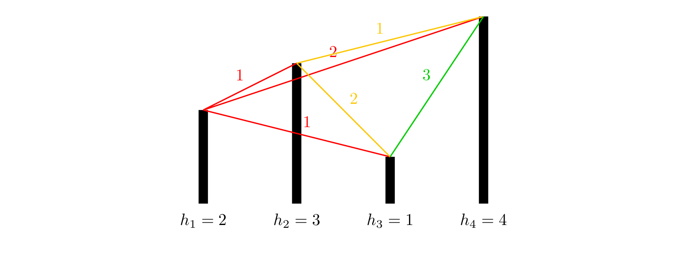

# 倍增优化

除了多重背包的二进制拆分优化，还有什么？

## 例题 #1 [USACO16OPEN] 262144 P

Bessie likes downloading games to play on her cell phone, even though she  doesfind the small touch screen rather cumbersome to use with her large hooves.

She is particularly intrigued by the current game she is playing.The game starts with a sequence of $N$ positive integers ($2 \leq N\leq 262,144$), each in the range $1 \ldots 40$.  In one move, Bessiecan take two adjacent numbers with equal values and replace them asingle number of value one greater (e.g., she might replace twoadjacent 7s with an 8). The goal is to maximize the value of thelargest number present in the sequence at the end of the game.  Pleasehelp Bessie score as highly as possible!

Bessie喜欢在手机上下游戏玩（……），然而她蹄子太大，很难在小小的手机屏幕上面操作。

她被她最近玩的一款游戏迷住了，游戏一开始有n个正整数，(2<=n<=262144)，范围在1-40。在一步中，贝西可以选相邻的两个相同的数，然后合并成一个比原来的大一的数（例如两个7合并成一个8)，目标是使得最大的数最大，请帮助Bessie来求最大值。

The first line of input contains $N$, and the next $N$ lines give the sequence

of $N$ numbers at the start of the game.

### 思路

乍一看我们觉得应该是一道区间dp的题目，但是当我看到数据范围时，就否定了传统的区间dp思想。那除了使用区间dp，还能怎么做呢？

我们考虑倍增。定义f_{i,j}为以i为左端点合成数字j的区间右端点。那么我们有转移式

$f_{i,j}=f_{f_{i,j-1}+1,j-1}$

为什么我们会想到使用倍增呢？因为我们发现，两个数字合成一个数，像极了两个2^i相加合成2^{i+1}，并且恰好就是其指数的关系，所以我们会考虑使用倍增俩记录区间长度。

这里我们还可以i计算出我们最大可以合成的数字为58，所以j的上界就是58.注意我们在转移时要用到j-1的信息，所以也该把j放在最外面。

---

注意不要从不存在方案的地方转移过来。

```C++
/*                                                                                
                      Keyblinds Guide
     				###################
      @Ntsc 2024

      - Ctrl+Alt+G then P : Enter luogu problem details
      - Ctrl+Alt+B : Run all cases in CPH
      - ctrl+D : choose this and dump to the next
      - ctrl+Shift+L : choose all like this
      - ctrl+K then ctrl+W: close all
	  
*/
#include <bits/stdc++.h>
#include <queue>
using namespace std;

#define rep(i, l, r) for (int i = l, END##i = r; i <= END##i; ++i)
#define per(i, r, l) for (int i = r, END##i = l; i >= END##i; --i)
#define pb push_back
#define mp make_pair
// #define int long long
#define pii pair<int, int>
#define ps second
#define pf first

// #define innt int
// #define inr int
// #define mian main
// #define iont int

#define rd read()
int read(){
    int xx = 0, ff = 1;
    char ch = getchar();
    while (ch < '0' || ch > '9') {
		if (ch == '-')
			ff = -1;
		ch = getchar();
    }
    while (ch >= '0' && ch <= '9')
      xx = xx * 10 + (ch - '0'), ch = getchar();
    return xx * ff;
}
void write(int out) {
	if (out < 0)
		putchar('-'), out = -out;
	if (out > 9)
		write(out / 10);
	putchar(out % 10 + '0');
}

#define nl dbg('\n')
const char el='\n';
const bool enable_dbg = 0;
template <typename T,typename... Args>
void dbg(T s,Args... args) {
	if constexpr (enable_dbg){
    cerr << s << ' ';
		if constexpr (sizeof...(Args))
			dbg(args...);
	}
}

const int N = 1e6 + 5;
const int INF = 1e18;
const int M = 1e7;
const int MOD = 1e9 + 7;

int a[N],ans,f[N][66];

void solve(){
    int n=rd;
    rep(i,1,n){
        a[i]=rd;
        f[i][a[i]]=i;
    }
    rep(j,1,58){
        rep(i,1,n){
            if(f[i][j-1])f[i][j]=max(f[i][j],f[f[i][j-1]+1][j-1]);
            dbg(f[i][j]);
            if(f[i][j]<=n+1&&f[i][j]>0)ans=j;
        }
    nl;
    }
    cout<<ans<<endl;
}

signed main() {
    int T=1;
    while(T--){
    	solve();
    }
    return 0;
}
```

```C++
/*                                                                                
                      Keyblinds Guide
     				###################
      @Ntsc 2024

      - Ctrl+Alt+G then P : Enter luogu problem details
      - Ctrl+Alt+B : Run all cases in CPH
      - ctrl+D : choose this and dump to the next
      - ctrl+Shift+L : choose all like this
      - ctrl+K then ctrl+W: close all
	  
*/
#include <bits/stdc++.h>
#include <queue>
using namespace std;

#define rep(i, l, r) for (int i = l, END##i = r; i <= END##i; ++i)
#define per(i, r, l) for (int i = r, END##i = l; i >= END##i; --i)
#define pb push_back
#define mp make_pair
// #define int long long
#define pii pair<int, int>
#define ps second
#define pf first

// #define innt int
// #define inr int
// #define mian main
// #define iont int

#define rd read()
int read(){
    int xx = 0, ff = 1;
    char ch = getchar();
    while (ch < '0' || ch > '9') {
		if (ch == '-')
			ff = -1;
		ch = getchar();
    }
    while (ch >= '0' && ch <= '9')
      xx = xx * 10 + (ch - '0'), ch = getchar();
    return xx * ff;
}
void write(int out) {
	if (out < 0)
		putchar('-'), out = -out;
	if (out > 9)
		write(out / 10);
	putchar(out % 10 + '0');
}

#define nl dbg('\n')
const char el='\n';
const bool enable_dbg = 1;
template <typename T,typename... Args>
void dbg(T s,Args... args) {
	if constexpr (enable_dbg){
    cerr << s << ' ';
		if constexpr (sizeof...(Args))
			dbg(args...);
	}
}

const int N = 1e6 + 5;
const int INF = 1e18;
const int M = 1e7;
const int MOD = 1e9 + 7;

int a[N],ans,f[N][66];

void solve(){
    int n=rd;
    rep(i,1,n){
        a[i]=rd;
        f[i][a[i]]=i+1;
    }
    rep(j,1,58){
        rep(i,1,n){
            f[i][j]=max(f[i][j],f[f[i][j-1]][j-1]);
            if(f[i][j]<=n+1&&f[i][j]>0)ans=j;
        }

    }
    cout<<ans<<endl;
}

signed main() {
    int T=1;
    while(T--){
    	solve();
    }
    return 0;
}
```

## 例题 #2 跑路

题目描述

小 A 的工作不仅繁琐，更有苛刻的规定，要求小 A 每天早上在 $6:00$ 之前到达公司，否则这个月工资清零。可是小 A 偏偏又有赖床的坏毛病。于是为了保住自己的工资，小 A 买了一个空间跑路器，每秒钟可以跑 $2^k$ 千米（$k$ 是任意自然数）。当然，这个机器是用 `longint` 存的，所以总跑路长度不能超过 `maxlongint` 千米。小 A 的家到公司的路可以看做一个有向图，小 A 家为点 $1$，公司为点 $n$，每条边长度均为一千米。小 A 想每天能醒地尽量晚，所以让你帮他算算，他最少需要几秒才能到公司。数据保证 $1$ 到 $n$ 至少有一条路径。

输入格式

第一行两个整数 $n,m$，表示点的个数和边的个数。

接下来 $m$ 行每行两个数字 $u,v$，表示一条 $u$ 到 $v$ 的边。

输出格式

一行一个数字，表示到公司的最少秒数。

提示

**【样例解释】**

$1 \to 1 \to 2 \to 3 \to 4$，总路径长度为 $4$ 千米，直接使用一次跑路器即可。

**【数据范围】**

$50\%$ 的数据满足最优解路径长度 $\leq 1000$；

$100\%$ 的数据满足 $2\leq n \leq 50$，$m \leq 10 ^ 4$，最优解路径长度 $\leq$ `maxlongint`。

### 思路

这道题目求的是从1号点到n号点最少要几秒到达。我们可以看到这个跑路器，每秒跑2^k条边（每条边1km），所以呢，这道题目明显就和“倍增”扯上了关系。回忆倍增，我们总是用一个参数k表示2^k，这道题目也一样，我们需要用一个bool类型G数组，G[i][j][k]代表从i到j是否存在一条长度为2^k的路径。再用dis数组来记录两点之间需要用多久到达。这样我们可以用G来保存所有的边，并且进行预处理，把所有一秒能到的两个点之间都连上边，并把距离相应调整为1。那么我们就把所有一秒能到的点之间都铺上了边，接下来我们就要求出两点之间的最短路啦，那么，大家都明白了，对于50的数据，Floyd绝对是最简单可行的办法了。

为了处理G数组，我们跑一次类似flyd的算法。枚举三个点 i,j,t，如果i到t存在一条2^k-1长度的路径，并且t到j存在一条2^k-1长度的路径，就说明i到t，t到j都可以一秒到达， 路程*2刚好是2的幂，也可以一秒到达

---

```C++
#include <bits/stdc++.h>
#define rep(l, r, i) for (int i = l, END##i = r; i <= END##i; ++i)
#define per(r, l, i) for (int i = r, END##i = l; i >= END##i; --i)
using namespace std;
#define int long long
#define pii pair<int, int>

#define lc(x) (x << 1)
#define rc(x) (x << 1 | 1)

#define rd read()
int read() {
  int xx = 0, ff = 1;
  char ch = getchar();
  while (ch < '0' || ch > '9') {
    if (ch == '-')
      ff = -1;
    ch = getchar();
  }
  while (ch >= '0' && ch <= '9')
    xx = xx * 10 + (ch - '0'), ch = getchar();
  return xx * ff;
}
void write(int out) {
  if (out < 0)
    putchar('-'), out = -out;
  if (out > 9)
    write(out / 10);
  putchar(out % 10 + '0');
}

const int N = 2e5 + 15;
const int INF = 1e9 + 5;
const int MOD = 998244353;

int dis[60][60], n, m;
bool G[60][60][65];

void init() {
  memset(G, false, sizeof(G));
  memset(dis, 10, sizeof(dis));
  scanf("%lld%lld", &n, &m);
  for (int i = 1; i <= m; i++) {
    int x, y;
    scanf("%lld%lld", &x, &y);
    dis[x][y] = 1;
    G[x][y][0] = true;
  }
}
void work() {
  for (int k = 1; k <= 64; k++)
    for (int i = 1; i <= n; i++)
      for (int t = 1; t <= n; t++)
        for (int j = 1; j <= n; j++)
          if (G[i][t][k - 1] && G[t][j][k - 1]) {
            G[i][j][k] = true;
            dis[i][j] = 1;
          }
}
void floyd() {
  for (int k = 1; k <= n; k++)
    for (int i = 1; i <= n; i++)
      for (int j = 1; j <= n; j++)
        dis[i][j] = min(dis[i][j], dis[i][k] + dis[k][j]);
}

signed main() {
  init();
  work();
  floyd();
  printf("%lld", dis[1][n]);
  return 0;
}

```

## 例题 #3 [NOIP2012 提高组] 开车旅行

题目描述

小 $\text{A}$ 和小 $\text{B}$ 决定利用假期外出旅行，他们将想去的城市从 $1 $ 到 $n$ 编号，且编号较小的城市在编号较大的城市的西边，已知各个城市的海拔高度互不相同，记城市 $i$ 的海拔高度为$h_i$，城市 $i$ 和城市 $j$ 之间的距离 $d_{i,j}$ 恰好是这两个城市海拔高度之差的绝对值，即 $d_{i,j}=|h_i-h_j|$。

旅行过程中，小 $\text{A}$ 和小 $\text{B}$ 轮流开车，第一天小 $\text{A}$ 开车，之后每天轮换一次。他们计划选择一个城市 $s$ 作为起点，一直向东行驶，并且最多行驶 $x$ 公里就结束旅行。

小 $\text{A}$ 和小 $\text{B}$ 的驾驶风格不同，小 $\text{B}$ 总是沿着前进方向选择一个最近的城市作为目的地，而小 $\text{A}$ 总是沿着前进方向选择第二近的城市作为目的地（注意：本题中如果当前城市到两个城市的距离相同，则认为离海拔低的那个城市更近）。如果其中任何一人无法按照自己的原则选择目的城市，或者到达目的地会使行驶的总距离超出 $x$ 公里，他们就会结束旅行。

在启程之前，小 $\text{A}$ 想知道两个问题：

1、 对于一个给定的 $x=x_0$，从哪一个城市出发，小 $\text{A}$ 开车行驶的路程总数与小 $\text{B}$ 行驶的路程总数的比值最小（如果小 $\text{B}$ 的行驶路程为 $0$，此时的比值可视为无穷大，且两个无穷大视为相等）。如果从多个城市出发，小 $\text{A}$ 开车行驶的路程总数与小 $\text{B}$ 行驶的路程总数的比值都最小，则输出海拔最高的那个城市。

2、对任意给定的 $x=x_i$ 和出发城市 $s_i$，小 $\text{A}$ 开车行驶的路程总数以及小 $\text B$ 行驶的路程总数。

输入格式

第一行包含一个整数 $n$，表示城市的数目。

第二行有 $n$ 个整数，每两个整数之间用一个空格隔开，依次表示城市 $1$ 到城市 $n$ 的海拔高度，即 $h_1,h_2 ... h_n$，且每个 $h_i$ 都是互不相同的。

第三行包含一个整数 $x_0$。

第四行为一个整数 $m$，表示给定 $m$ 组 $s_i$ 和 $x_i$。

接下来的 $m$ 行，每行包含 $2$ 个整数 $s_i$ 和 $x_i$，表示从城市$s_i$ 出发，最多行驶 $x_i$ 公里。

输出格式

输出共 $m+1$ 行。

第一行包含一个整数 $s_0$，表示对于给定的 $x_0$，从编号为 $s_0$ 的城市出发，小 $\text A$ 开车行驶的路程总数与小 $\text B$ 行驶的路程总数的比值最小。

接下来的 $m$ 行，每行包含 $2$ 个整数，之间用一个空格隔开，依次表示在给定的 $s_i$ 和 $x_i$ 下小 $\text A$ 行驶的里程总数和小 $\text B$ 行驶的里程总数。

提示

【样例1说明】



各个城市的海拔高度以及两个城市间的距离如上图所示。

如果从城市 $1$ 出发，可以到达的城市为 $2,3,4$，这几个城市与城市 $1$ 的距离分别为 $1,1,2$，但是由于城市 $3$ 的海拔高度低于城市 $2$，所以我们认为城市 $3$ 离城市 $1$ 最近，城市 $2$ 离城市 $1$ 第二近，所以小A会走到城市 $2$。到达城市 $2$ 后，前面可以到达的城市为 $3,4$，这两个城市与城市 $2$  的距离分别为 $2,1$，所以城市 $4$ 离城市 $2$ 最近，因此小B会走到城市$4$。到达城市 $4$ 后，前面已没有可到达的城市，所以旅行结束。

如果从城市 $2$ 出发，可以到达的城市为 $3,4$，这两个城市与城市 $2$ 的距离分别为 $2,1$，由于城市 $3$ 离城市 $2$ 第二近，所以小 $\text A$ 会走到城市 $3$。到达城市 $3$ 后，前面尚未旅行的城市为 $4$，所以城市 $4$ 离城市 $3$ 最近，但是如果要到达城市 $4$，则总路程为 $2+3=5>3$，所以小 $\text B$ 会直接在城市 $3$ 结束旅行。

如果从城市 $3$ 出发，可以到达的城市为 $4$，由于没有离城市 $3$ 第二近的城市，因此旅行还未开始就结束了。

如果从城市 $4$ 出发，没有可以到达的城市，因此旅行还未开始就结束了。

【样例2说明】

当 $x=7$ 时，如果从城市 $1$ 出发，则路线为 $1 \to 2 \to 3 \to 8 \to 9$，小 $\text A$ 走的距离为 $1+2=3$，小 $\text B$ 走的距离为 $1+1=2$。（在城市 $1$ 时，距离小 $\text A$ 最近的城市是 $2$ 和 $6$，但是城市 $2$ 的海拔更高，视为与城市 $1$ 第二近的城市，所以小 $\text A$ 最终选择城市 $2$；走到$9$ 后，小 $\text A$ 只有城市 $10$ 可以走，没有第二选择可以选，所以没法做出选择，结束旅行）

如果从城市 $2$ 出发，则路线为 $2 \to 6 \to 7$，小 $\text A$ 和小 $\text B$ 走的距离分别为 $2,4$。

如果从城市 $3$ 出发，则路线为 $3 \to 8 \to 9$，小 $\text A$ 和小 $\text B$ 走的距离分别为$2,1$。

如果从城市 $4$ 出发，则路线为 $4 \to 6 \to 7$，小 $\text A$ 和小 $\text B$ 走的距离分别为 $2,4$。

如果从城市 $5$ 出发，则路线为 $5 \to 7 \to 8$，小 $\text A$ 和小 $\text B$ 走的距离分别为 $5,1$。

如果从城市 $6$ 出发，则路线为 $6 \to 8 \to 9$，小 $\text A$ 和小 $\text B$ 走的距离分别为$5,1$。

如果从城市 $7$ 出发，则路线为 $7 \to 9 \to 10$，小 $\text A$ 和小 $\text B$ 走的距离分别为$2,1$。

如果从城市 $8$ 出发，则路线为 $8 \to 10$，小 $\text A$ 和小 $\text B$ 走的距离分别为$2,0$。

如果从城市 $9$ 出发，则路线为 $9$，小 $\text A$ 和小 $\text B$ 走的距离分别为 $0,0$（旅行一开始就结束了）。

如果从城市 $10$ 出发，则路线为 $10$，小 $\text A$ 和小 $\text B$ 走的距离分别为$0,0$。

从城市 $2$ 或者城市 $4$ 出发小 $\text A$ 行驶的路程总数与小 $\text B$ 行驶的路程总数的比值都最小，但是城市 $2$ 的海拔更高，所以输出第一行为 $2$。

【数据范围与约定】

对于 $30\%$ 的数据，有$1\le n \le 20,1\le m\le 20$；
对于$40\%$ 的数据，有$1\le n \le 100,1\le m\le 100$；
对于 $50\%$ 的数据，有$1\le n \le 100,1\le m\le 1000$；
对于 $70\%$ 的数据，有$1\le n \le 1000,1\le m\le 10^4$；
对于 $100\%$ 的数据：$1\le n,m \le 10^5$，$-10^9 \le h_i≤10^9$，$1 \le s_i \le n$，$0 \le x_i \le 10^9
$数据保证 $h_i$ 互不相同。

### 思路

首先这里每个点所对应的第一和第二近的城市都是确定的，因此我们需要预处理出来。接下来我们考虑问题1

问题1

如果我们要枚举起点，那么我们只能用O(\log n)的复杂度完成每一次模拟开车了。那么这样的话其实我们如果可以用O(\log n)时间完成每一个问题2，那么问题1也就迎刃而解了。所以下面我们能来讨论问题2

问题2

我们要在O(\log n)复杂度内完成一次模拟开车，那么我们想到的是倍增。可是怎么样倍增呢？

---

std

INF开大

```C++
#include <bits/stdc++.h>
#define rep(l, r, i) for (int i = l, END##i = r; i <= END##i; ++i)
#define per(r, l, i) for (int i = r, END##i = l; i >= END##i; --i)
using namespace std;
// #define int long long
#define pii pair<int, int>
#define LL __int128

#define lc(x) (x << 1)
#define rc(x) (x << 1 | 1)

#define rd read()
int read() {
  int xx = 0, ff = 1;
  char ch = getchar();
  while (ch < '0' || ch > '9') {
    if (ch == '-')
      ff = -1;
    ch = getchar();
  }
  while (ch >= '0' && ch <= '9')
    xx = xx * 10 + (ch - '0'), ch = getchar();
  return xx * ff;
}
void write(LL out) {
  if (out < 0)
    putchar('-'), out = -out;
  if (out > 9)
    write(out / 10);
  putchar(out % 10 + '0');
}

const int N = 1e5 + 15;
const int INF = 1e18 + 5;
// const int MOD = 1 << 30;

struct node {
  long long h;
  int id;
} h[N], ga[N], gb[N];
struct point {
  long long la, lb;
};
bool operator<(node as, node bs) {
  if (as.h != bs.h)
    return as.h < bs.h;
  else
    return as.id < bs.id;
}
set<node> q;
double ans = INF;
int n, f[20][N][3];
long long da[20][N][3], db[20][N][3];
bool cmp(node as, node bs) { 
    return as.h < bs.h; 
}
point Calc(int p, int x) {
  long long la = 0, lb = 0;
  for (int i = 18; i >= 0; i--) {
    if (f[i][p][0] && la + lb + da[i][p][0] + db[i][p][0] <= x) {
      la += da[i][p][0];
      lb += db[i][p][0];
      p = f[i][p][0];
    }
  }
  return {la, lb};
}
signed main() {
  n = rd;
  q.insert({INF, 0});
  q.insert({INF - 1, 0});
  q.insert({-INF, 0});
  q.insert({-INF + 1, 0});
  for (int i = 1; i <= n; i++) {
    h[i].h = rd;
    h[i].id = i;
  }

  for (int i = n; i >= 1; i--) {
    q.insert(h[i]);
    node t[5];
    t[1] = *--q.lower_bound(h[i]);
    t[2] = *--q.lower_bound(t[1]);
    t[3] = *q.upper_bound(h[i]);
    t[4] = *q.upper_bound(t[3]);
    for (int j = 1; j <= 4; j++)
      t[j].h = abs(t[j].h - h[i].h);
    sort(t + 1, t + 5, cmp);
    ga[i] = t[2];
    gb[i] = t[1];
  }
  for (int i = 1; i < n; i++) {
    f[0][i][0] = ga[i].id;
    f[0][i][1] = gb[i].id;
  }
  for (int i = 1; i <= 18; i++)
    for (int j = 1; j <= n; j++)
      if (j + (1 << i) <= n)
        for (int k = 0; k <= 1; k++) {
          if (i == 1)
            f[1][j][k] = f[0][f[0][j][k]][1 - k];
          else
            f[i][j][k] = f[i - 1][f[i - 1][j][k]][k];
        }
  memset(da, 127 / 3, sizeof(da));
  memset(db, 127 / 3, sizeof(db));
  for (int i = 1; i <= n; i++) {
    da[0][i][0] = ga[i].h;
    da[0][i][1] = 0;
  }
  for (int i = 1; i <= 18; i++)
    for (int j = 1; j <= n; j++)
      if (j + (1 << i) <= n)
        for (int k = 0; k <= 1; k++) {
          if (i == 1) {
            da[1][j][k] = da[0][j][k] + da[0][f[0][j][k]][1 - k];
          } else
            da[i][j][k] = da[i - 1][j][k] + da[i - 1][f[i - 1][j][k]][k];
        }
  for (int i = 1; i <= n; i++) {
    db[0][i][0] = 0;
    db[0][i][1] = gb[i].h;
  }
  for (int i = 1; i <= 18; i++)
    for (int j = 1; j <= n; j++)
      if (j + (1 << i) <= n)
        for (int k = 0; k <= 1; k++) {
          if (i == 1) {
            db[1][j][k] = db[0][j][k] + db[0][f[0][j][k]][k ^ 1];
          } else
            db[i][j][k] = db[i - 1][j][k] + db[i - 1][f[i - 1][j][k]][k];
        }
  int x0 = rd, m;
  int t = 0;
  for (int i = 1; i <= n; i++) {
    point tmp = Calc(i, x0);
    if (tmp.lb == 0)
      continue;
    double ccf = (long double)tmp.la / (long double)tmp.lb;
    if (ccf < ans)
      ans = ccf, t = i;
  }
  printf("%lld\n", t);

  m = rd;
  for (int i = 1; i <= m; i++) {
    int si = rd, xi = rd;
    point tmp = Calc(si, xi);
    printf("%lld %lld\n", tmp.la, tmp.lb);
  }
}
```

