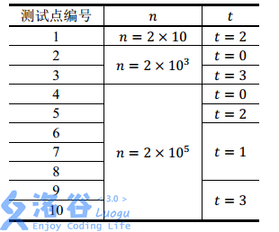

# 决策单调性之 斜率优化

斜率优化需要整理的目标式子
- x是与j相关的定量
- y是仅包含以与j相关的量，且包含$f_j$
- k是和i相关的定值
- b是仅包含以与i相关的量，且包含$f_i$

[www.luogu.com.cn](https://www.luogu.com.cn/blog/ChenXingLing/post-xue-xi-bi-ji-dong-tai-gui-hua-xie-shuai-you-hua-dp-chao-yang-x)


## [NOI2014] 购票

题目描述

今年夏天，NOI 在 SZ 市迎来了她三十周岁的生日。来自全国 $n$ 个城市的 OIer 们都会从各地出发，到 SZ 市参加这次盛会。

全国的城市构成了一棵以 SZ 市为根的有根树，每个城市与它的父亲用道路连接。为了方便起见，我们将全国的 $n$ 个城市用 $1\sim n$ 的整数编号。其中 SZ 市的编号为 $1$。对于除 SZ 市之外的任意一个城市 $v$，我们给出了它在这棵树上的父亲城市 $f_v$  以及到父亲城市道路的长度 $s_v$。

从城市 $v$ 前往 SZ 市的方法为：选择城市 $v$ 的一个祖先 $a$，支付购票的费用，乘坐交通工具到达 $a$。再选择城市 $a$ 的一个祖先 $b$，支付费用并到达 $b$。以此类推，直至到达 SZ 市。

对于任意一个城市 $v$，我们会给出一个交通工具的距离限制 $l_v$。对于城市 $v$ 的祖先 A，只有当它们之间所有道路的总长度不超过 $l_v$  时，从城市 $v$ 才可以通过一次购票到达城市 A，否则不能通过一次购票到达。

对于每个城市 $v$，我们还会给出两个非负整数 $p_v,q_v$  作为票价参数。若城市 $v$ 到城市 A 所有道路的总长度为 $d$，那么从城市 $v$ 到城市 A 购买的票价为 $dp_v+q_v$。

每个城市的 OIer 都希望自己到达 SZ 市时，用于购票的总资金最少。你的任务就是，告诉每个城市的 OIer 他们所花的最少资金是多少。

输入格式

第一行包含两个非负整数 $n,t$，分别表示城市的个数和数据类型（其意义将在「提示与说明」中提到）。

接下来 $2 \sim n$ 行，每行描述一个除 SZ 之外的城市。其中第 $v$ 行包含五个非负整数 $f_v,s_v,p_v,q_v,l_v$，分别表示城市 $v$ 的父亲城市，它到父亲城市道路的长度，票价的两个参数和距离限制。

请注意：输入不包含编号为 1 的 SZ 市，第 $2\sim n$ 行分别描述的是城市 $2$ 到城市 $n$。

输出格式

输出包含 $n-1$ 行，每行包含一个整数。

其中第 $v$ 行表示从城市 $v+1$ 出发，到达 SZ 市最少的购票费用。

同样请注意：输出不包含编号为 1 的 SZ 市。



对于所有数据，$n\leq 2 \times 10^5, 0 \leq p_v \leq 10^6,\ 0 \leq q_v \leq 10^{12},\ 1\leq f_v<v,\ 0<s_v\leq lv \leq 2 \times 10^{11}$，且任意城市到 SZ 市的总路程长度不超过 $2 \times 10^{11}$。

输入的 $t$ 表示数据类型，$0\leq t<4$，其中：

- 当 $t=0$ 或 $2$ 时，对输入的所有城市 $v$，都有 $f_v=v-1$，即所有城市构成一个以 SZ 市为终点的链；

- 当 $t=0$ 或 $1$ 时，对输入的所有城市 $v$，都有 $l_v=2 \times 10^{11}$，即没有移动的距离限制，每个城市都能到达它的所有祖先；

- 当 $t=3$ 时，数据没有特殊性质。

## [NOI2007] 货币兑换

题目描述

小 Y 最近在一家金券交易所工作。该金券交易所只发行交易两种金券：A 纪念券（以下简称 A 券）和 B 纪念券（以下简称 B 券）。每个持有金券的顾客都有一个自己的帐户。金券的数目可以是一个实数。

每天随着市场的起伏波动，两种金券都有自己当时的价值，即每一单位金券当天可以兑换的人民币数目。我们记录第 $K$ 天中 A 券和 B 券的价值分别为 $A_K$ 和 $B_K$（元/单位金券）。

为了方便顾客，金券交易所提供了一种非常方便的交易方式：比例交易法。

比例交易法分为两个方面：

a)  卖出金券：顾客提供一个 $[0, 100]$ 内的实数 $OP$ 作为卖出比例，其意义为：将 $OP\%$ 的 A 券和 $OP\%$ 的 B 券以当时的价值兑换为人民币；

b)  买入金券：顾客支付 $IP$ 元人民币，交易所将会兑换给用户总价值为 $IP$ 的金券，并且，满足提供给顾客的 A 券和 B 券的比例在第 $K$ 天恰好为 $\mathrm{Rate}_ K$；

例如，假定接下来 $3$ 天内的 $A_K,B_K,\mathrm{Rate}_ K$ 的变化分别为：

|时间|$A_K$|$B_K$|$\mathrm{Rate}_ K$|
|-|-|-|-|
|第一天|$1$|$1$|$1$|
|第二天|$1$|$2$|$2$|
|第三天|$2$|$2$|$3$|

假定在第一天时，用户手中有 $100$ 元人民币但是没有任何金券。

用户可以执行以下的操作：

|时间|用户操作|人民币(元)|A 券的数量|B 券的数量|
|-|-|-|-|-|
|开户|无|$100$|$0$|$0$|
|第一天|买入 $100$ 元|$0$|$50$|$50$|
|第二天|卖出 $50\%$|$75$|$25$|$25$|
|第二天|买入 $60$ 元|$15$|$55$|$40$|
|第三天|卖出 $100\%$|$205$|$0$|$0$|

注意到，同一天内可以进行多次操作。

小 Y 是一个很有经济头脑的员工，通过较长时间的运作和行情测算，他已经知道了未来 $N$ 天内的 A 券和 B 券的价值以及 $\mathrm{Rate}$。他还希望能够计算出来，如果开始时拥有 $S$ 元钱，那么 $N$ 天后最多能够获得多少元钱。

输入格式

第一行两个正整数 $N,S$，分别表示小 Y 能预知的天数以及初始时拥有的钱数。

接下来 $N$ 行，第 $K$ 行三个实数 $A_K,B_K,\mathrm{Rate} _ K$ ，意义如题目中所述。

输出格式

只有一个实数 $\mathrm{MaxProfit}$，表示第 $N$ 天的操作结束时能够获得的最大的金钱数目。答案保留 $3$ 位小数。

对于 $100\%$ 的测试数据，满足：

$0 < A_K \leq 10$，$0 < B_K\le 10$，$0 < \mathrm{Rate}_K \le 100$，$\mathrm{MaxProfit}  \leq 10^9$。

输入文件可能很大，请采用快速的读入方式。

必然存在一种最优的买卖方案满足：

每次买进操作使用完所有的人民币，每次卖出操作卖出所有的金券。

---

### 思路

最重要的往往在最后头理！

**必然存在一种最优的买卖方案满足：**

**每次买进操作使用完所有的人民币，每次卖出操作卖出所有的金券。**

那么这就有利于我们设计本题的dp了，并且本题就和股票买卖（[https://www.acwing.com/problem/content/1057/](https://www.acwing.com/problem/content/1057/)）差不多了。设f_i表示第i天最多的人民币数，那么有两种转移

- 买入金券，那么到这里我们会不会想到怎么样记录当前状态还剩下多少金券呢？其实是不用的，我们只需要记录对于每个f_i可以买多少金券即可。并且买入金券对f是负贡献，我们没必要转移

- 卖出金券，那么我们要枚举当前的金券是在那一天j买入的，那么转移$f_{i}=\max(f_i,A_ix_j+B_iy_j)$，x_j,y_j表示使用f_j全额购买金券可得A,B券数量。其中x_j=\frac{}{}。变形得$f_{i}=\max(f_i,A_i(x_j+\frac{B_i}{A_i}y_j))=\max(f_i,A_i(b+kx))$，其中b=x_j,k=y_i,x是恒定值frac{B_i}{A_i}。那么我们就可以使用李超树优化。

- 不做事，f_i=\max(f_i,f_{i-1})

## [CEOI2017] Building Bridges

题目描述

有 $n$ 根柱子依次排列，每根柱子都有一个高度。第 $i$ 根柱子的高度为 $h_i$。

现在想要建造若干座桥，如果一座桥架在第 $i$ 根柱子和第 $j$ 根柱子之间，那么需要 $(h_i-h_j)^2$​​ 的代价。

在造桥前，所有用不到的柱子都会被拆除，因为他们会干扰造桥进程。第 $i$ 根柱子被拆除的代价为 $w_i$，注意 $w_i$ 不一定非负，因为可能政府希望拆除某些柱子。

现在政府想要知道，通过桥梁把第 $1$ 根柱子和第 $n$ 根柱子连接的最小代价。注意桥梁不能在端点以外的任何地方相交。

输入格式

第一行一个正整数 $n$。

第二行 $n$ 个空格隔开的整数，依次表示 $h_1,h_2,\cdots,h_n$​​。

第三行 $n$ 个空格隔开的整数，依次表示 $w_1,w_2,\cdots,w_n$​​。

输出格式

输出一行一个整数表示最小代价，注意最小代价不一定是正数。

对于 $100\%$ 的数据，有 $2\le n\le 10^5;0\le h_i,\vert w_i\vert\le 10^6$。

---

### 思路

首先， $O(n^2)$ 的 dp 转移方程极其显然：

$f_i=\min\{f_j+h_i^2-2h_ih_j+h_j^2+s_{i-1}-s_j\}$

其中， $s$ 是拆除代价 $w$ 的前缀和。

将式子化简，得到：

$f_i=h_i^2+s_{i-1}+\min\{f_j-2h_ih_j+h_j^2-s_j\}$

令 $a_j=-2h_j$ ， $b_j=f_j+h_j^2-s_j$ ，则：

$f_i=h_i^2+s_{i-1}+\min\{a_jh_i+b_j\}$

问题转化为，插入直线 $y_j=a_jx+b_j$ ，求 $x=h_i$ 时 $y_j$ 的最小值。

很明显，可以用李超线段树优化，时间复杂度 $O(n\log n)$ 。

---

```C++
/*
CB Ntsc
*/

#include<bits/stdc++.h>
using namespace std;
#define int long long
#define ull unsigned long long
#define pii pair<int, int>
#define pf first
#define ps second

#define err cerr<<"Error"
#define rd read()
// #define nl putc('\n')
#define ot write
#define nl putchar('\n')
inline int rd
{
	int xx=0,ff=1;
	char ch=getchar();
	while(ch<'0'||ch>'9') {if(ch=='-') ff=-1;ch=getchar();}
	while(ch>='0'&&ch<='9') xx=xx*10+(ch-'0'),ch=getchar();
	return xx*ff;
}
inline void write(int out)
{
	if(out<0) putchar('-'),out=-out;
	if(out>9) write(out/10);
	putchar(out%10+'0');
}

const int INF = 1e13;
const int N = 2e5+5;
const int M = 1e6+5;
const int S=1e6+5;
const int maxlog = 10;

int a[N],b[N],h[N],w[N],f[N];
int s[M<<2],u;
inline int g(int x,int k){
	return b[k]+a[k]*x;}


void change(int k,int l,int r,int t){
	if(l==r){
		if(g(l,t)<g(l,s[k]))s[k]=t;
		return;
	}
	int m=l+r>>1;
	if(g(m,t)<g(m,s[k]))swap(t,s[k]);
	if(g(l,t)<g(l,s[k]))change(k<<1,l,m,t);
	else if(g(r,t)<g(r,s[k]))change(k<<1|1,m+1,r,t);
}

int query(int k,int l,int r){
	if(l==r)return g(u,s[k]);
	int m=l+r>>1;
	return min(g(u,s[k]),u<=m?query(k<<1,l,m):query(k<<1|1,m+1,r));
}
signed main(){
	int n=rd;
	b[0]=INF;
	for(int i=1;i<=n;++i)scanf("%lld",h+i);
	for(int i=1;i<=n;++i)scanf("%lld",w+i),w[i]+=w[i-1];
	a[1]=-2*h[1],b[1]=h[1]*h[1]-w[1],change(1,0,M,1);
	for(int i=2;i<=n;++i){
		u=h[i],f[i]=h[i]*h[i]+w[i-1]+query(1,0,M);
		a[i]=-2*h[i],b[i]=f[i]+h[i]*h[i]-w[i],change(1,0,M,i);
	}
	printf("%lld",f[n]);
	return 0;
}


/*
2 5
0 1 1 1 1
0 1 1 2 4
0 2 1 2 1
0 2 1 1 4
*/
```

## [APIO2014] 序列分割

你正在玩一个关于长度为 $n$ 的非负整数序列的游戏。这个游戏中你需要把序列分成 $k + 1$ 个非空的块。为了得到 $k + 1$ 块，你需要重复下面的操作 $k$ 次：

选择一个有超过一个元素的块（初始时你只有一块，即整个序列）

选择两个相邻元素把这个块从中间分开，得到两个非空的块。

每次操作后你将获得那两个新产生的块的元素和的乘积的分数。你想要最大化最后的总得分。

输入格式

第一行包含两个整数 $n$ 和 $k$。保证 $k + 1 \leq n$。

第二行包含 $n$ 个非负整数 $a_1, a_2, \cdots, a_n$ $(0 \leq a_i \leq 10^4)$，表示前文所述的序列。

输出格式

第一行输出你能获得的最大总得分。

第二行输出 $k$ 个介于 $1$ 到 $n - 1$ 之间的整数，表示为了使得总得分最大，你每次操作中分开两个块的位置。第 $i$ 个整数 $s_i$ 表示第 $i$ 次操作将在 $s_i$ 和 $s_{i + 1}$ 之间把块分开。

如果有多种方案使得总得分最大，输出任意一种方案即可。

提示

你可以通过下面这些操作获得 $108$ 分：

初始时你有一块 $(4, 1, 3, 4, 0, 2, 3)$。在第 $1$ 个元素后面分开，获得 $4 \times (1 + 3 + 4 + 0 + 2 + 3) = 52$ 分。

你现在有两块 $(4), (1, 3, 4, 0, 2, 3)$。在第 $3$ 个元素后面分开，获得 $(1 + 3) \times (4 + 0 + 2 + 3) = 36$ 分。

你现在有三块 $(4), (1, 3), (4, 0, 2, 3)$。在第 $5$ 个元素后面分开，获得 $(4 + 0) \times (2 + 3) = 20$ 分。

所以，经过这些操作后你可以获得四块 $(4), (1, 3), (4, 0), (2, 3)$ 并获得 $52 + 36 + 20 = 108$ 分。

限制与约定

第一个子任务共 11 分，满足 $1 \leq k < n \leq 10$。

第二个子任务共 11 分，满足 $1 \leq k < n \leq 50$。

第三个子任务共 11 分，满足 $1 \leq k < n \leq 200$。

第四个子任务共 17 分，满足 $2 \leq n \leq 1000, 1 \leq k \leq \min\{n - 1, 200\}$。

第五个子任务共 21 分，满足 $2 \leq n \leq 10000, 1 \leq k \leq \min\{n - 1, 200\}$。

第六个子任务共 29 分，满足 $2 \leq n \leq 100000, 1 \leq k \leq \min\{n - 1, 200\}$。

感谢@larryzhong  提供的加强数据

### 思路​

首先，这题**答案与切的顺序无关**

我们考虑先写出转移式

定义f i,j为前i个数划分出j个区间，且倒数第二个区间的有端点为i的最大价值。此时我们默认最后一个区间还没有被划分，即存在在一个区间为[j,n]

那么有$f_{i,j}=\max(f_{k,j-1}+(s_n-s_{i})(s_{i}-s_{k}))$。

整理一下——我们需要提取的因变量和自变量分别为和k有关的变量、和i有关的变量。暂时先省略j维度。

$f_i=f_k+(s_n-s_{i})(s_{i}-s_{k})$

其中s_n,s_i为常量，那么整理为y=kx+b得到


- $f_i=f_k+s_i(s_n-s_i)-s_k(s_n-s_i)=f_k+s_i(s_n-s_i)-s_ks_n+s_ks_i$

- $f_k-s_ks_n=-s_ks_i+f_i-s_i(s_n-s_i)$

我们发现我们需要f_i尽可能大，即截距要尽可能大。我们把所有可转移点以$(-s_k,f_k-s_ks_n)$的形式在坐标系中标出，并且我们使用斜率$k=s_i$的直线去从上往下截所有点，第一个点就是最佳决策点。

分析得我们应该维护一个上凸函数。类比分析如下：


