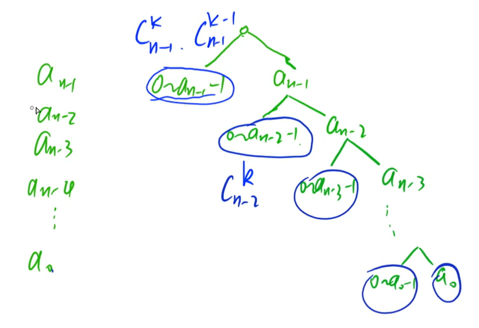
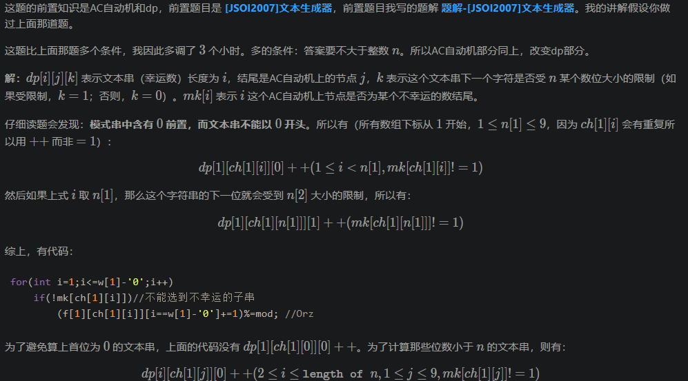
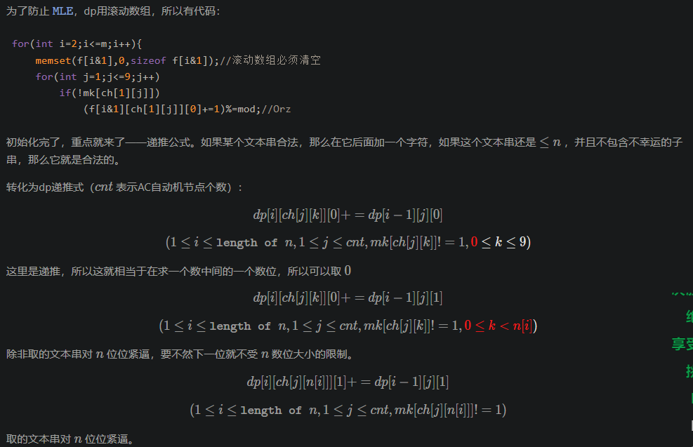
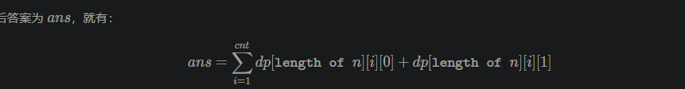

# 数位DP

摘抄[学习笔记 | 数位DP](https://flowus.cn/3b672d07-ba95-4030-aa38-d846d36bead1)

---

## 例题 #1 1081. 度的数量

求给定区间 [X,Y] 中满足下列条件的整数个数：这个数恰好等于 K 个互不相等的 B 的整数次幂之和。

例如，设 X=15,Y=20,K=2,B=2，则有且仅有下列三个数满足题意：

17=24+20
18=24+21
20=24+22

### 思路

即对于一个B进制数，求区间$[X_{(10)},Y_{(10)}]$中在B进制下只有两位为1的数的个数。


数位dp可使用于计算区间内含有某种特殊性质的数字的个数。

首先我们吧计算[l,r]转化为计算[1,r]-[1,l-1]，类似前缀和。

在考虑数位dp时，按照前若干位是否达到上界且当前位是否填上界（因为这取决于后面的剩余位能否任意填），可以按照数字的每一位转化为树形结构来考虑。





**理解**

如果上界为$r=\overline{a_{n-1},\dots,a_{0}}$，那么为了保证我们枚举的数不超过r，我们就要按左边的树形结构考虑。

以$a_{n-2}$为例，如果选择左分叉，那么即填$0\sim a_{n-2}-1$，这个数字的最高位就没有占满，所以$n-3\sim 0$为可以随便填了。结合题目性质，我们可以直接计算答案。如果选择右分叉，即填该位可以填的最大值并且前面的所有位都填了最大值，那么即$n-2$及之前的所有位都已经占满了，那么我们就需要递归下去考虑。

---

```C++
/*
Edit by Ntsc.
*/

#include<bits/stdc++.h>
using namespace std;
#define int long long
#define ull unsigned long long
#define pii pair<int, int>
#define pf first
#define ps second

#define rd read()
#define ot write
#define nl putchar('\n')
inline int rd{
	int xx=0,ff=1;
	char ch=getchar();
	while(ch<'0'||ch>'9') {if(ch=='-') ff=-1;ch=getchar();}
	while(ch>='0'&&ch<='9') xx=xx*10+(ch-'0'),ch=getchar();
	return xx*ff;
}
inline void write(int out){
	if(out<0) putchar('-'),out=-out;
	if(out>9) write(out/10);
	putchar(out%10+'0');
}

const int N=4e2+5;
const int M=5e4+5;
const int INF=2e18+5;
const int MOD=1e9+7;
const int BASE=17737;
bool f1;
int n,f[N][N],a[N],ans=INF,K,B,l,r,dis[N][20];

bool f2;


void init(){
	// for(int i=0;i<=9;i++)f[1][i]=1;
	for(int i=0;i<N;i++){
		for(int j=0;j<=i;j++){
			if(!j)f[i][j]=1;
			else f[i][j]=f[i-1][j]+f[i-1][j-1];//从i位中挑选j位为1的方案数
		}
	}
}

int dp(int n){//求从0~n里可以满足要求的数字的个数
	if(!n)return 0;//边界
	vector<int> e;//记录n的每一位
	while(n)e.push_back(n%B),n/=B;
	int res=0,lst=0;//lst为右分支的继承信息，该题中是记录前面已经填了的数字中有多少个1
	for(int i=((int)e.size()-1);~i;i--){//高位到地位枚举
		int x=e[i];
		
		if(x){
			//求左边分支，即不占满
			res+=f[i][K-lst];//当前位为0
			if(x>1){//只能填0/1，但是因为x>1故无法占满，没有else分支
				if(K>lst)res+=f[i][K-lst-1];break;
			}else{
				lst++;//x=1占满,lst记录前面已经填了多少个1
				if(lst>K)break;//剪枝
			}
		}
		if(!i){
			//已经到了最后一位
			res+=(lst==K);
		}
	}
	return res;
}
signed main(){
    // freopen("P5431_1.in", "r", stdin);
    // freopen("chfran.out", "w", stdout);
//    ios::sync_with_stdio(false);
//    cin.tie(0);cout.tie(0);
	init();
    l=rd,r=rd,K=rd,B=rd;
	cout<<dp(r)-dp(l-1)<<endl;
	
    return 0;
}
/*


*/
```

## 例题 #2 | [SCOI2009] windy 数

题目描述

不含前导零且相邻两个数字之差至少为 $2$ 的正整数被称为 windy 数。windy 想知道，在 $a$ 和 $b$ 之间，包括 $a$ 和 $b$ ，总共有多少个 windy 数？

### 思路

---

```C++
/*
Edit by Ntsc.
*/

#include<bits/stdc++.h>
using namespace std;
#define int long long
#define ull unsigned long long
#define pii pair<int, int>
#define pf first
#define ps second

#define rd read()
#define ot write
#define nl putchar('\n')
inline int rd{
	int xx=0,ff=1;
	char ch=getchar();
	while(ch<'0'||ch>'9') {if(ch=='-') ff=-1;ch=getchar();}
	while(ch>='0'&&ch<='9') xx=xx*10+(ch-'0'),ch=getchar();
	return xx*ff;
}
inline void write(int out){
	if(out<0) putchar('-'),out=-out;
	if(out>9) write(out/10);
	putchar(out%10+'0');
}

const int N=4e5+5;
const int M=5e4+5;
const int INF=2e18+5;
const int MOD=1e9+7;
const int BASE=17737;
bool f1;
int n,f[N][20],a[N],ans=INF,dis[N][20];

bool f2;


void init(){
	for(int i=0;i<=9;i++)f[1][i]=1;
	for(int i=2;i<N;i++){
		for(int j=0;j<=9;j++){
			for(int k=0;k<=9;k++){
				if(abs(j-k)>=2)f[i][j]+=f[i-1][k];
			}
		}
	}
}

int dp(int n){
	if(!n)return 0;
	vector<int> e;
	while(n)e.push_back(n%10),n/=10;
	int res=0,lst=-2;
	for(int i=((int)e.size()-1);~i;i--){
		int x=e[i];
		for(int j=(i==e.size()-1)-0;j<x;j++){
			if(abs(j-lst)>=2)res+=f[i+1][j];
		}
		if(abs(x-lst)>=2)lst=x;
		else break;

		if(!i)res++;
	}

	for(int i=1;i<e.size();i++){
		for(int j=1;j<=9;j++){
			res+=f[i][j];//特殊处理位数没有占满的情况，防止前导0被计算
		}
	}
	return res;
}
signed main(){
    // freopen("P5431_1.in", "r", stdin);
    // freopen("chfran.out", "w", stdout);
  
	init();
    int l=rd,r=rd;
	cout<<dp(r)-dp(l-1)<<endl;
	
    return 0;
}
/*


*/
```

对于全部的测试点，保证 $1 \leq a \leq b \leq 2 \times 10^9$。

## 例题 #3 | [ZJOI2010] 排列计数

题目描述

称一个 $1 \sim n$ 的排列 $p_1,p_2, \dots ,p_n$ 是 Magic 的，当且仅当
$\forall i \in [2,n],p_i > p_{\lfloor i/2 \rfloor}$
计算 $1 \sim n$ 的排列中有多少是 Magic 的，答案可能很大，只能输出模 $m$ 以后的值。

### 思路

题意：求 1 至n的所有排列中，满足小根堆性质的排列的个数。

很明显$\forall i \in [2,n],p_i > p_{\lfloor i/2 \rfloor}$就是小根堆的性质。至于为什么是完全二叉树，因为$i→2i,2i+1$就是完全二叉树的记录法啊！

这里建立dp模型：$f_i$表示个不同的数的所有排列中满足小根堆性质的排列的个数。

对于转移，首先在转移时计算出i个节点的完全二叉树中，根节点的左了树包含的节点数 $l$ ，右子树包含的节点数 $r $。

根节点的值必须为最小值。再考虑剩下的 $i - 1$ 个节点。很容易想到，可以在这$i- 1$ 个节点中选出 $l$个节点作为左子树，剩下的 $r$ 个节点作为右子树。

转移 $f_i=C_{i-1}^l\times f_l\times f_r$

---

注意坑点：n可以大于p，所以求组合数要用到Lucas定理。

```C++
/*
CB Ntsc
*/

#include<bits/stdc++.h>
using namespace std;
#define int long long
#define ull unsigned long long
#define pii pair<int, int>
#define pf first
#define ps second

#define rd read()
// #define nl putc('\n')
#define ot write
#define nl putchar('\n')
inline int rd
{
	int xx=0,ff=1;
	char ch=getchar();
	while(ch<'0'||ch>'9') {if(ch=='-') ff=-1;ch=getchar();}
	while(ch>='0'&&ch<='9') xx=xx*10+(ch-'0'),ch=getchar();
	return xx*ff;
}
inline void write(int out)
{
	if(out<0) putchar('-'),out=-out;
	if(out>9) write(out/10);
	putchar(out%10+'0');
}

bool f1;
const int INF = 1e9;
const int N = 1e6+1005;
const int M = 10;
int MOD = 10;

int n,m;
int f[N],fac[N], inv[N],lg[N];
int ans = INF;

int ksm(int c,int k) {
	int p=MOD;
	int res=1;
	while(k){
		if(k&1)res=(res*c)%p;
		c=(c*c)%p;k>>=1;
	}
	return res;
}

void comb_init(){

    lg[0] = -1;
	fac[0]=1;
	for (int i=1;i<=n;++i) fac[i]=fac[i-1]*i%MOD;
	inv[min(MOD-1,n)]=ksm(fac[min(MOD-1,n)],MOD-2);
    for(int i=min(MOD-1,n);i>=1;i--)inv[i-1]=inv[i]*i%MOD;//i!的inv 
    for (int i = 1; i <= n; i++) lg[i] = lg[i >> 1] + 1;
}

// int C(int n,int m){
//     if(n<0||m<0)return 0;
//     if(n<m)return 0;
//     return fac[n]*inv[m]%MOD*inv[n-m]%MOD;
// }

int C(int x, int y) {
    if (!y) return 1;
    int u = C(x / MOD, y / MOD), v = x % MOD, w = y % MOD, z;
    if (v < w) z = 0;
    else z = (fac[v] * inv[w] % MOD) * inv[v - w] % MOD;
    return u * z % MOD;
}

// int cal(int x){
//     int i=1,j=1;
//     while(i<=x){
//         i<<=1;i|=1;
//         j<<=1;
//     }
//     int emt=x-i;
//     int res=(i-j-1)/2+min(j/2,j-emt);
//     // cerr<<x<<' '<<res<<endl;
//     return res;
// }

signed main (){
    n=rd,MOD=rd;

    comb_init();
    // f[1]=f[0]=1;
    // for(int i=2;i<=n;i++){
    //     cerr<<"OK ";
    //     int l=cal(i),r=i-l-1;
    //     cerr<<C(i-1,l)<<endl;
    //     f[i]=C(i-1,l)*f[l]%MOD*f[r]%MOD;
    // }
    f[1] = f[2] = 1; f[3] = 2;
    int l=1,r=1;
    for (int i = 4; i <= n; i++) {
        if (i - (1 << lg[i]) + 1 <= (1 << lg[i] - 1)) l++;
        else r++;
        f[i] = (C(i - 1, l) * f[l] % MOD) * f[r] % MOD;
    }
    cout<<f[n]<<endl;
    return 0;
}


/*
2 5
0 1 1 1 1
0 1 1 2 4
0 2 1 2 1
0 2 1 1 4
*/
```

【数据范围】
对于 $100\%$ 的数据，$1\le n \le 10^6$, $1\le m \le 10^9$，$m$ 是一个质数。


## 例题 #4 [SDOI2014] 数数

题目描述

我们称一个正整数 $x$ 是幸运数，当且仅当它的十进制表示中不包含数字串集合 $s$ 中任意一个元素作为其子串。例如当 $s = \{22, 333, 0233\}$ 时，$233$ 是幸运数，$2333$、$20233$、$3223$ 不是幸运数。给定 $n$ 和 $s$，计算不大于 $n$ 的幸运数个数。

答案对 $10^9 + 7$ 取模。

### 思路

参考题解







```C++
/*
*/

#include<bits/stdc++.h>
using namespace std;
#define int long long
#define ull unsigned long long
#define pii pair<int, int>
#define pf first
#define rep(i, a, b) for(int i = a; i <= b; ++i)
#define per(i, a, b) for(int i = a; i >= b; --i)

#define rd read()
#define ot write
#define nl putchar('\n')
int rd{
	int xx=0,ff=1;
	char ch=getchar();
	while(ch<'0'||ch>'9') {if(ch=='-') ff=-1;ch=getchar();}
	while(ch>='0'&&ch<='9') xx=xx*10+(ch-'0'),ch=getchar();
	return xx*ff;
}
void write(int out){
	if(out<0) putchar('-'),out=-out;
	if(out>9) write(out/10);
	putchar(out%10+'0');
}

const int N = 2e3+5;
const int MOD = 1e9 + 7;
int tr[N][10], fail[N], in[N], idx;
char s[N], s2[N];
int f[N][N],a[N],n;
queue<int> q;

void add(){
    int now = 0;
    for (int i = 1; s[i]; i++){
        int c = s[i] - '0';
        if (!tr[now][c]) tr[now][c] = ++idx;
        now = tr[now][c];
    }
    in[now] = 1;
}

void getFail(){
    for (int i = 0; i < 10; i++)if (tr[0][i])q.push(tr[0][i]);
    while (q.size()){
        int now = q.front();
        q.pop();
        for (int i = 0; i < 10; i++){
            int c = tr[now][i];
            if (!c){ 
                tr[now][i] = tr[fail[now]][i];
                continue;
            }
            fail[c] = tr[fail[now]][i];
            in[c] |= in[fail[c]];
            q.push(c);
        
        }
    }
}

int dfs(int p, int now, bool flg, bool lim){
    if (in[now]) return 0;
    if (!p) return !flg;
    if (!lim && !flg && ~f[p][now]) return f[p][now];
    int up = lim ? a[p] : 9;
    int res = 0;
    for (int i = 0; i <= up; i++)
        res = (res + dfs(p - 1, (flg && !i) ? 0 : tr[now][i], flg && !i, lim && i == up)) % MOD;
    if (!lim && !flg) f[p][now] = res;
    return res;
}

signed main(){
    scanf("%s", s2 + 1);
    n=rd;
    for (int i = 1; i <= n; i++){
        scanf("%s", s + 1);
        add();
    }
    getFail();

    memset(f, -1, sizeof f);
    int len = strlen(s2 + 1);
    for (int i = 1; i <= len; i++) a[len - i + 1] = s2[i] - '0';
    cout<<dfs(len, 0, 1, 1);
    return 0;
}
```

对于全部的测试点，保证：

$1 \leq n < 10^{1201}$，$1 \leq m \leq 100$，$1 \leq \sum_{i = 1}^m |s_i| \leq 1500$，$\min_{i = 1}^m |s_i| \geq 1$，其中 $|s_i|$ 表示字符串 $s_i$ 的长度。$n$ 没有前导 $0$，但是 $s_i$ 可能有前导 $0$。

