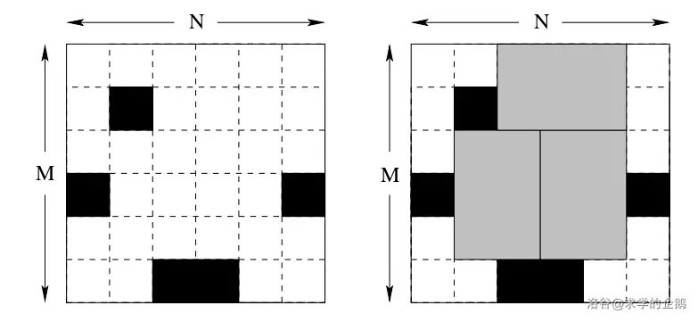
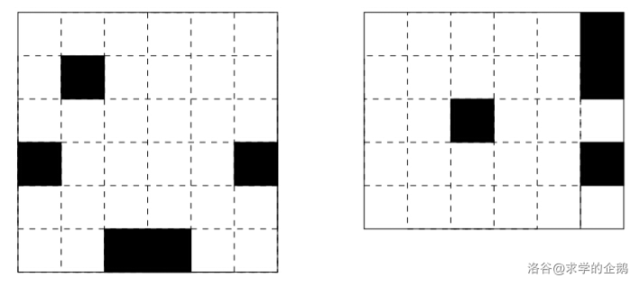

# 状态压缩

在记忆化搜索中，如果我们要枚举一个排列的所有可能性，那么我们就需要使用一个cnt数组在dfs中记录那些数字已经被使用了。但是在dp中，不同的情况之间的计算是并行的，我们不能像dfs中那样记录cnt数组了。怎么办呢？

通常情况下，如果dp中需要计入类似cnt的东西，那么需要记录的项目通常不超过30。这时我们就可以使用一个数字来记录使用情况了——记录数字n为状态，作为dp的一个维度。n在二进制下的表达就可以看成一个bool类型的数组了！

这就是状态压缩。

## 例题 #1 [USACO06NOV]Corn Fields G

题目描述

农场主 $\rm John$ 新买了一块长方形的新牧场，这块牧场被划分成 $M$ 行 $N$ 列 $(1 \le M \le 12; 1 \le  N \le 12)$，每一格都是一块正方形的土地。 $\rm John$ 打算在牧场上的某几格里种上美味的草，供他的奶牛们享用。

遗憾的是，有些土地相当贫瘠，不能用来种草。并且，奶牛们喜欢独占一块草地的感觉，于是 $\rm John$ 不会选择两块相邻的土地，也就是说，没有哪两块草地有公共边。

$\rm John$ 想知道，如果不考虑草地的总块数，那么，一共有多少种种植方案可供他选择？（当然，把新牧场完全荒废也是一种方案）

输入格式

第一行：两个整数 $M$ 和 $N$，用空格隔开。

第 $2$ 到第 $M+1$ 行：每行包含 $N$ 个用空格隔开的整数，描述了每块土地的状态。第 $i+1$ 行描述了第 $i$ 行的土地，所有整数均为 $0$ 或 $1$ ，是 $1$ 的话，表示这块土地足够肥沃，$0$ 则表示这块土地不适合种草。

输出格式

一个整数，即牧场分配总方案数除以 $100,000,000$ 的余数。

---

```C++
/*                                                                                
                      Keyblinds Guide
     				###################
      @Ntsc 2024

      - Ctrl+Alt+G then P : Enter luogu problem details
      - Ctrl+Alt+B : Run all cases in CPH
      - ctrl+D : choose this and dump to the next
      - ctrl+Shift+L : choose all like this
      - ctrl+K then ctrl+W: close all
      - Alt+la/ra : move mouse to pre/nxt pos'
	  
*/
#include <bits/stdc++.h>
#include <queue>
using namespace std;

#define rep(i, l, r) for (int i = l, END##i = r; i <= END##i; ++i)
#define per(i, r, l) for (int i = r, END##i = l; i >= END##i; --i)
#define preb push_back
#define mp make_pair
#define int long long
#define pii pair<int, int>
#define ps second
#define pf first

// #define innt int
// #define inr int
// #define mian main
// #define iont int

#define rd read()
int read(){
    int xx = 0, ff = 1;
    char ch = getchar();
    while (ch < '0' || ch > '9') {
		if (ch == '-')
			ff = -1;
		ch = getchar();
    }
    while (ch >= '0' && ch <= '9')
      xx = xx * 10 + (ch - '0'), ch = getchar();
    return xx * ff;
}
void write(int out) {
	if (out < 0)
		putchar('-'), out = -out;
	if (out > 9)
		write(out / 10);
	putchar(out % 10 + '0');
}

#define ell dbg('\n')
const char el='\n';
const bool enable_dbg = 1;
template <typename T,typename... Args>
void dbg(T s,Args... args) {
	if constexpr (enable_dbg){
    cerr << s << ' ';
		if constexpr (sizeof...(Args))
			dbg(args...);
	}
}

const int N = 3e5 + 5;
const int INF = 1e18;
const int M = 1e7;
const int MOD = 1e8;

int f[13][1<<12];
int g[1<<12],h[1<<12];
int a[13][13];
int F[13];

void solve()
{
    int n=rd,m=rd;
	for(int i=1;i<=n;i++)
		for(int j=1;j<=m;j++)
			a[i][j]=rd;
	for(int i=1;i<=n;i++)
		for(int j=1;j<=m;j++)
			F[i]=(F[i]<<1)+a[i][j];
	for(int i=0;i<(1<<m);i++){
		if(!(i&(i>>1))&&!(i&(i<<1))){
			g[i]=1;
			if((i&F[1])==i) f[1][i]=1;
		}
	}
	for(int x=2;x<=n;x++)
		for(int j=0;j<(1<<m);j++)
			if(((j&F[x-1])==j)&&g[j])
				for(int k=0;k<(1<<m);k++)
					if(((k&F[x])==k)&&!(j&k)&&g[k]){
						f[x][k]=(f[x][k]+f[x-1][j])%MOD;
					}
	int ans=0;
	for(int i=0;i<(1<<m);i++)
		ans=(ans+f[n][i])%MOD;
	printf("%d\n",ans);
}

signed main() {
    int T=1;
    while(T--){
    	solve();
    }
    return 0;
}
```

## 例题 #2 DAG定向计数 [CEOI2019] Amusement Park

题目描述

有一个含 $n$ 个点，$m$ 条边的有向图，图无重边，无自环，两点之间不成环。

现在我们想改变一些边的方向，使得该有向图无环。

您需要求出，每一种改变方向后使得该有向图无环的方案的需改变边的数量之和 $\bmod\ 998244353$ 之后的答案。

输入格式

第一行为两个整数 $n,m$。

接下来 $m$ 行，一行两个整数 $a_i,b_i$，表示有一条起点为 $a_i$，终点为 $b_i$ 的有向边。

输出格式

仅一行一个整数，表示每一种改变方向后使得该有向图无环的方案的需改变边的数量之和 $\bmod\ 998244353$ 之后的答案。

|子任务编号|限制|分值|
|-|-|-|
|1|$n\le 3$|$7$|
|2|$n\le 6$|$12$|
|3|$n\le 10$|$23$|
|4|$n\le 15$|$21$|
|5|无特殊限制|$37$|

#### 说明

本题译自 [Central-European Olympiad in Informatics 2019](https://ceoi.sk/) [Day 2](https://ceoi.sk/tasks/) [T1 Amusement Park](https://ceoi.sk/static/statements/amusementpark-ENG.pdf)。

---

预备结论：

对于一种 DAG 方案，将所有边翻转后还是一个合法的 DAG。二因为所有边都被翻转了，所以两种方法对于原图要翻转的边数为 $m$。

设翻转某些边使得成为有向无环图（DAG）的方案数为 $ans$，则我们要求 $ans×m\div 2$。

所以本题和原图的边的方向无关。

于是原题在转化为：给你一个无向图，要求给边定向，求最后得到的 DAG 的数量。


这里我们考虑状态压缩。

$f_i$ 表示将 $i$ 集合内的点和边变成一个 DAG 的方案数量。

那么我们怎么样才可以转移呢？首先我们要知道初始状态：对于每一个左右一个点的集合，其方案数为 $1$。

于是现在我们就需要从一个或者几个小的 DAG 转移到一个大的 DAG 上。可以考虑**拓扑排序**的流程，是逐个从 DAG 中剔除入度为 $0$ 的点。这种方法可以把一个大的 DAG 转移成一个更小的子 DAG。那么我们反向这个过程。

我们采用填表法，用 $i$ 的子集来更新 $i$。

那么这个子集是随便选的吗？不是！我们每次都需要选择一些入度为 $0$ 的点的集合 $j$，也就是说我们要选择的子集上一个**独立集**。具体来说，就是没有任何边链接了这个子集 $j$ 内的两个点。这样可以保证向 $i-j$ 这个集合内加入 $j$ 这些点后不会产生环。


于是我们就有 $f_i =\sum_{j⫅i} f(j)dp_{i-j}$。但是很显然会算重，因为我们枚举的一些 $j$ 可能又是另外一些 $j$ 的子集（下称更大的为 $j'$），而 $j'$ 又是从 $j$ 转移来的，这样就多转移了。

那么我们就上容斥呗，咋容斥？我们按子集大小来看：

大小为 $2$ 的子集包含大小为 $1,2$ 的子集，大小为 $3$ 的子集包含大小为 $1,2,3$ 的子集……那么我们把大小为 $i$ 的子集看作 $\{1,2,\dots,i\},\dots,\{n-i+1,n-i+2,\dots,n\}$，现在我们要容斥得一个集合 $\{1,2\dots,n\}$，就是加上所有大小为奇数的集合，减去所有大小为偶数的集合！

所以容斥就出来了。

```C++
/*                                                                                
                      Keyblinds Guide
     				###################
      @Ntsc 2024

      - Ctrl+Alt+G then P : Enter luogu problem details
      - Ctrl+Alt+B : Run all cases in CPH
      - ctrl+D : choose this and dump to the next
      - ctrl+Shift+L : choose all like this
      - ctrl+K then ctrl+W: close all
      - Alt+la/ra : move mouse to pre/nxt pos'
	  
*/
#include <bits/stdc++.h>
#include <queue>
using namespace std;

#define rep(i, l, r) for (int i = l, END##i = r; i <= END##i; ++i)
#define per(i, r, l) for (int i = r, END##i = l; i >= END##i; --i)
#define pb push_back
#define mp make_pair
#define int long long
#define ull unsigned long long
#define pii pair<int, int>
#define ps second
#define pf first

// #define innt int
#define itn int
// #define inr intw
// #define mian main
// #define iont int

#define rd read()
int read(){
    int xx = 0, ff = 1;
    char ch = getchar();
    while (ch < '0' || ch > '9') {
		if (ch == '-')
			ff = -1;
		ch = getchar();
    }
    while (ch >= '0' && ch <= '9')
      xx = xx * 10 + (ch - '0'), ch = getchar();
    return xx * ff;
}
void write(int out) {
	if (out < 0)
		putchar('-'), out = -out;
	if (out > 9)
		write(out / 10);
	putchar(out % 10 + '0');
}

#define ell dbg('\n')
const char el='\n';
const bool enable_dbg = 1;
template <typename T,typename... Args>
void dbg(T s,Args... args) {
	if constexpr (enable_dbg){
    cerr << s;
    if(1)cerr<<' ';
		if constexpr (sizeof...(Args))
			dbg(args...);
	}
}

#define zerol = 1
#ifdef zerol
#define cdbg(x...) do { cerr << #x << " -> "; err(x); } while (0)
void err() { cerr << endl; }
template<template<typename...> class T, typename t, typename... A>
void err(T<t> a, A... x) { for (auto v: a) cerr << v << ' '; err(x...); }
template<typename T, typename... A>
void err(T a, A... x) { cerr << a << ' '; err(x...); }
#else
#define dbg(...)
#endif


const int N = 20;
const int INF = 1e18;
const int M = 1e7;
const int MOD = 998244353;


int op[1<<N],f[1<<N];
int n,m;

struct node{
    itn a,b;
}t[400];

int ban[1<<N];

void init(){
    op[0]=MOD-1;
    for(int i=1;i<(1<<n);i++){
        op[i]=MOD-op[i&(i-1)];
    }
}

inline int ksm(int a,int b){
    int res=1;
    while(b){
        if(b&1)res=res*a%MOD;
        b>>=1;
        a=a*a%MOD;
    }
    return res;
}


void solve(){
     n=rd,m=rd;
    //  if (n!=10)assert(0);

    init();


    for(int i=1;i<=m;i++){
        t[i].a=rd-1;
        t[i].b=rd-1;
    }

    for(int i=1;i<(1<<n);i++){
        for(int j=1;j<=m;j++){
            if((i&(1<<t[j].a))&&(i&(1<<t[j].b))){
                ban[i]=1;
                break;
            }
        }
    }

    f[0]=1;
    for(int i=1;i<(1<<n);i++){
        for(int j=i;j;j=((j-1)&i)){
            //枚举i的子集，参考了https://oi-wiki.org/math/binary-set/#遍历所有掩码的子掩码
            if(ban[j])continue;
            // ban[j]=0表示j集合内的点完全独立
            f[i]+=f[i^j]*op[j]%MOD;
            f[i]%=MOD;
        }
    }

    int ans=f[(1<<n)-1];
    ans=ans*m%MOD*ksm(2,MOD-2)%MOD;
    
// 在所有方案中，总能找到一种方案的反方案，两者总共翻转了 
// m 条边，设翻转某些边使得成为有向无环图（DAG）的方案数为 
// ans，则我们要求 ans×m/2

    cout<<ans<<endl;
}


signed main() {
    // freopen(".in","r",stdin);
    // freopen(".in","w",stdout);

    int T=1;
    while(T--){
    	solve();
    }
    return 0;
}
```

## 例题 #3 三进制状态压缩 [CEOI2002] Bugs Integrated,Inc.

题目描述

Bugs Integrated,Inc. 是高级存储芯片的主要制造商。他们正在开始生产新的 6 TB Q-RAM 芯片。每个芯片由以 2×3 的矩形排列的六个方形硅片块组成。Q-RAM 芯片的制造方式是将一块长方形的大硅片分成 N×M 个方形硅片块。然后仔细测试所有方形硅片块，坏的用黑色标记。



最后，将硅片切割成存储芯片。每个芯片由 2×3（或 3×2）单位方形硅片块组成。当然，任何芯片都不能包含任何坏的（标记的）方形硅片块。它可能不能将硅片切割成每一个好的方形硅片块都成为某些存储芯片的一部分。该公司希望尽可能少地浪费好方形硅片块。因此他们想知道如何切割硅片以尽可能多地切出芯片。
现您将获得几个硅片的尺寸和其每个硅片所有坏方形硅片块的列表。你的任务是编写一个程序，计算每个硅片最多可以从其切下的芯片数量。

输入格式

第一行由一个整数 $D$ 组成，表示硅片的数量。接下来 $D$ 个部分，每个部分描述一个硅片。每个部分的第一行包含三个整数 $N$，$M$，$K$，其间由单个空格分隔。$N$ 是硅片的长度，$M$ 是它的高度，$K$ 是硅片中坏方硅片块的数量。以下 $K$ 行包含一个坏方硅片块列表。每行包含两个整数 $x$ 和 $y$，表示一个坏方硅片块的坐标（左上角的坐标为（$1,1$），左下角是 （$N,M$））。

输出格式

每行输出每个硅片最多可以从其切下的芯片数量。

#### 数据规模与约定

对于 $100 \%$ 的数据，$1 \leq D \leq 5$，$1 \leq N \leq 150$，$1 \leq M \leq 10$，$0 \leq K \leq M×N$，$1 \leq x \leq N$，$1 \leq y \leq M$。

#### 样例说明



#### 题目说明

来源于 CENTRAL-EUROPEAN OLYMPIAD IN INFORMATICS 2002 的 [Bugs Integrated,Inc.](https://web.ics.upjs.sk/ceoi/documents/tasks/bugs-tsk.pdf)。
由 @[求学的企鹅](/user/271784) 翻译整理。

---

这道题一看就是状态压缩，但是我们很明显要处理连续3行的状态。结合数据范围，我们发现我们不太能分别枚举前两行的状态，因此我们考虑使用别的方法。

如果芯片只能横着放，那么状态压缩还是很好解决的。如果是竖着放呢？那么我们就需要标记一下当前是这个芯片的第几行了。比如说我们以2作为芯片的第一行，0作为最后一行，那么转移时1下面只能放0，0下面可以随便放。

于是我们把**三进制数**作为状态。

于是我们记录$f_{i,j}$为第i行放置芯片的状态为j时的已经填好的芯片的数量的最优值。

于是我们在转移时枚举一下上一行的方案，然后刷表法转移。用dfs求出在上一行的限制下，这一行的所有方案即可。

```C++
/*                                                                                
                      Keyblinds Guide
     				###################
      @Ntsc 2024

      - Ctrl+Alt+G then P : Enter luogu problem details
      - Ctrl+Alt+B : Run all cases in CPH
      - ctrl+D : choose this and dump to the next
      - ctrl+Shift+L : choose all like this
      - ctrl+K then ctrl+W: close all
      - Alt+la/ra : move mouse to pre/nxt pos'
	  
*/
#include <bits/stdc++.h>
#include <queue>
using namespace std;

#define rep(i, l, r) for (int i = l, END##i = r; i <= END##i; ++i)
#define per(i, r, l) for (int i = r, END##i = l; i >= END##i; --i)
#define pb push_back
#define mp make_pair
// #define int long long
#define ull unsigned long long
#define pii pair<int, int>
#define ps second
#define pf first

// #define innt int
#define itn int
// #define inr intw
// #define mian main
// #define iont int

#define rd read()
int read(){
    int xx = 0, ff = 1;
    char ch = getchar();
    while (ch < '0' || ch > '9') {
		if (ch == '-')
			ff = -1;
		ch = getchar();
    }
    while (ch >= '0' && ch <= '9')
      xx = xx * 10 + (ch - '0'), ch = getchar();
    return xx * ff;
}
void write(int out) {
	if (out < 0)
		putchar('-'), out = -out;
	if (out > 9)
		write(out / 10);
	putchar(out % 10 + '0');
}

#define ell dbg('\n')
const char el='\n';
const bool enable_dbg = 1;
template <typename T,typename... Args>
void dbg(T s,Args... args) {
	if constexpr (enable_dbg){
    cerr << s;
    if(1)cerr<<' ';
		if constexpr (sizeof...(Args))
			dbg(args...);
	}
}

#define zerol = 1
#ifdef zerol
#define cdbg(x...) do { cerr << #x << " -> "; err(x); } while (0)
void err() { cerr << endl; }
template<template<typename...> class T, typename t, typename... A>
void err(T<t> a, A... x) { for (auto v: a) cerr << v << ' '; err(x...); }
template<typename T, typename... A>
void err(T a, A... x) { cerr << a << ' '; err(x...); }
#else
#define dbg(...)
#endif


const int N = 155 + 5;
const int INF = 1e9;
const int M = 1e5;
const int MOD = 1e9 + 7;

int pw[N];
bool ban[N][N];
int f[2][M];
int p[N][N];

namespace morebit{
    //三进制工具包
    int base=3;
    
    void init(){
        pw[0]=1;
        for(int i=1;i<=15;i++){
            pw[i]=pw[i-1]*base;
        }
    }

    bool vis[M][12];
    itn g[M][12];
    inline int getw(int x,itn loc){
        if(vis[x][loc])return g[x][loc];
        vis[x][loc]=1;
        // int xx=x,ll=loc;
        // while(loc){
        //     x/=3;
        //     loc--;
        // }
        // // cdbg("gw",x%3);
        return g[x][loc]=(x/pw[loc])%3;
    }
    
}using namespace morebit;


inline bool safe(int a,int b,int x,int y){
    b++,y++;
    // if(p[x][y]-p[x][b-1]-p[a-1][y]+p[a-1][b-1])cdbg(a,b,x,y);
    return p[x][y]-p[x][b-1]-p[a-1][y]+p[a-1][b-1]==0;
}

int n,m,K;


void dfs(int x,int pre,int y,int sum,int now){
    // y\in[0,m-1]
    // if(sum)cdbg(sum);
    if(y==-1){
        // if(x==2&&sum>1)cdbg(sum);
        f[x&1][now]=max(f[x&1][now],sum+f[(x-1)&1][pre]);
        return ;
    }
    int cur=getw(pre,y);
    if(cur&&ban[x][y+1])return ;
    if(cur==2){
        dfs(x,pre,y-1,sum,now*3+1);
    }
    if(cur==1){
        // cdbg(x,y,"cur=0");
        dfs(x,pre,y-1,sum,now*3);
        // if(y>=1&&x>2)if(getw(pre,y)==1&&getw(pre,y-1)==1)if(safe(x-2,y-1,x,y))dfs(x,pre,y-2,sum+1,now*3*3);    //竖chip最后一行
        // if(y>=2&&x>1){
        //     // if(pre==728)cdbg(x,getw(pre,y),getw(pre,y-1),getw(pre,y-2),y);
        //     if(getw(pre,y)==1&&getw(pre,y-1)==1&&getw(pre,y-2)==1){
        //         // cdbg("OK");
        //         if(safe(x-1,y-2,x,y))dfs(x,pre,y-3,sum+1,now*3*3*3);    //横chip最后一行
        //     }
            
        // }

    }if(cur==0){
        dfs(x,pre,y-1,sum,now*3);
        if(y>=2&&x<=n-1)if(!ban[x][y+1]&&!ban[x][y]&&!ban[x][y-1])if(getw(pre,y-1)==0&&getw(pre,y-2)==0)dfs(x,pre,y-3,sum+1,((now*3+1)*3+1)*3+1);
        if(y>=1&&x<=n-2)if(!ban[x][y+1]&&!ban[x][y])if(getw(pre,y-1)==0)dfs(x,pre,y-2,sum+1,(now*3+2)*3+2);
    }
}

void solve(){
     n=rd,m=rd,K=rd;
    for(int i=1;i<=n;i++){
        for(int j=1;j<=m;j++)ban[i][j]=0;
    }

    for(int i=1;i<=K;i++){
        int x=rd,y=rd;
        ban[x][y]=1;
    }    

    


    // for(int i=1;i<=n;i++){
    //     for(int j=1;j<=m;j++){
    //         p[i][j]=p[i-1][j]+p[i][j-1]-p[i-1][j-1]+ban[i][j];
    //     }
    // }
    memset(f,-0x3f3f,sizeof f);
    // for(int i=1;i<pw[m];i++)f[0][i]=-INF;
    f[0][0]=0;
    for(int i=1;i<=n;i++){
        for(int j=0;j<pw[m];j++)f[i&1][j]=-INF;

        for(int j=0;j<pw[m];j++){
            // cdbg(j);
            if (f[(i-1)&1][j]<0) continue;
            dfs(i,j,m-1,0,0);
        }
    }
    // cdbg(f[3][0]);
    write(f[n&1][0]);
    puts("");
    // cout<<f[n&1][0]<<endl;
}

signed main() {
    // freopen(".in","r",stdin);
    // freopen(".in","w",stdout);

    init();

    int T=rd;
    while(T--){
    	solve();
    }
    return 0;
}gai
```

当然这种题目也有记录前两行状态方案的方法，但是时空复杂度不优秀。可以参考练习 #2

同样可以使用本题的刷表法的还有练习 #5

## 练习

[状态压缩练习题单](%E7%8A%B6%E5%8E%8BDP/%E7%8A%B6%E6%80%81%E5%8E%8B%E7%BC%A9%E7%BB%83%E4%B9%A0%E9%A2%98%E5%8D%95%204e08e2aa-98ef-4c66-b409-254027bf4b24.md)

## 子集dp（sos dp）

通常用来解决丢每个i求$f_i=\sum_ {j\in i}a_j$的计数问题，可以在$O(n \log m)$内解决。

### 例题 #1 [COCI2011-2012#6] KOŠARE

题目描述

在一个废弃的阁楼里放置有 $n$ 个箱子，这些箱子里存放着 $m$ 种玩具。对于第 $i$ 个箱子，它里面有 $k_i$ 个玩具（不同的箱子里可能有相同的玩具）。

现在你需要选出一部分箱子，使得它们中共有 $m$ 种玩具（即所有种类的玩具都包含）。求选择的方案总数（$\bmod\ 10^9+7$）。

输入格式

输入第一行包含两个整数 $n,m$。

接下来的 $n$ 行，每行首先输入一个整数 $k_i$；接下来 $k_i$ 个数表示第 $i$ 个箱子里所含的玩具情况。

输出格式

输入一行一个整数，为方案总数（$\bmod\ 10^9+7$）。

- 对于 $100\%$ 的数据，保证 $1\le n\le 1\times 10^6$，$1\le m\le 20$，$0\le k_i\le m$。

---

首先我们对题目进行若干转换，将所有箱子的集合取反。问题变为又多少种选择方法，使得选择的集合的交集为空。

先定义f_i为以i为子集的箱子个数，g_i为有多少种箱子的组合，使得i是它们的并的子集。

那么可以得到g_i=2^{f_i}-1，即我们在f_i这些箱子里面任意选≥1个即可满足要求。

那么怎么样求f_i呢？我们定义a_i为集合为i的箱子个数，现在我们要求

$f_i=\sum_ {i\in j}a_j$。

这里我们应该使用一个叫做**子集dp**的东西。

我们定义$h_{i,j}$为只有前j位 （这里的第j位指的是$2^{j-1}$处）和i可能不同，并且i属于箱子的集合 这样的箱子的个数。那么初始化有$h_{i,0}=a_i$。

怎么样递推呢？若i的第j位为1，那么因为要求的i是箱子的子集，所以这里的箱子的第i为只能为1，即$h_{i,j}=h_{i,j-1}$。

若i的第j位为0，那么箱子的这一位可以是1也可以是0.如果箱子的这一位是0，那么就是$h_{i,j-1}$；如果是1，那么就是$h_{i~\text{xor}~2^{j-1},j-1}$。

那么最后得到$f_i=h_{i,m}$，这里的m是题目中的位数上限


求出h,f,g后，我们就可以得到答案了。因为$g_i$为有多少种箱子的组合，使得i是它们的并的子集，而我们要求的是有多少种箱子的组合，使得i是它们的并，我们就按集合容斥，最后的答案：集合中没有0的方案=集合中至少0个1的方案-至少一个1的方案+...

```C++
/*                                                                                
                      Keyblinds Guide
     				###################
      @Ntsc 2024

      - Ctrl+Alt+G then P : Enter luogu problem details
      - Ctrl+Alt+B : Run all cases in CPH
      - ctrl+D : choose this && dump to the next
      - ctrl+Shift+L : choose all like this
      - ctrl+K then ctrl+W: close all
      - Alt+la/ra : move mouse to pre/nxt pos'
	  
*/
#include <bits/stdc++.h>
#include <queue>
using namespace std;

#define rep(i, l, r) for (int i = l, END##i = r; i <= END##i; ++i)
#define per(i, r, l) for (int i = r, END##i = l; i >= END##i; --i)
#define pb push_back
#define mp make_pair
#define int long long
#define ull unsigned long long
#define pii pair<int, int>
#define ps second
#define pf first


// #define innt int
#define itn int
// #define inr intw
// #define mian main
// #define iont int

#define rd read()
int read(){
    int xx = 0, ff = 1;
    char ch = getchar();
    while (ch < '0' || ch > '9') {
		if (ch == '-')
			ff = -1;
		ch = getchar();
    }
    while (ch >= '0' && ch <= '9')
      xx = xx * 10 + (ch - '0'), ch = getchar();
    return xx * ff;
}
void write(int out) {
	if (out < 0)
		putchar('-'), out = -out;
	if (out > 9)
		write(out / 10);
	putchar(out % 10 + '0');
}

#define ell dbg('\n')
const char el='\n';
const bool enable_dbg = 1;
template <typename T,typename... Args>
void dbg(T s,Args... args) {
	if constexpr (enable_dbg){
    cerr << s;
    if(1)cerr<<' ';
		if constexpr (sizeof...(Args))
			dbg(args...);
	}
}

#define zerol = 1
#ifdef zerol
#define cdbg(x...) do { cerr << #x << " -> "; err(x); } while (0)
void err() { cerr << endl; }
template<template<typename...> class T, typename c, typename... A>
void err(T<c> a, A... x) { for (auto v: a) cerr << v << ' '; err(x...); }
template<typename T, typename... A>
void err(T a, A... x) { cerr << a << ' '; err(x...); }
#else
#define dbg(...)
#endif


const int N = 2e6+5;
const int INF = 1e18;
const int M = 1e7;
const int MOD = 1e9+7;


int f[N];//表示状态 i 是多少个箱子状态的子集
itn g[N];//表示状态 i 是多少种 箱子状态交集的子集
int cnt[N];
int ans;
int s[N];

int h[N][2];

inline int ksm(int a,int b){
	int res=1;
	while(b){
		if(b&1)res=res*a%MOD;
		b>>=1;
		a=a*a%MOD;
	}
	return res;
}


inline int popcnt(int x){
	int res=0;
	while(x){
		res+=x&1;
		x>>=1;
	}
	return res;
}


void solve(){
	int n=rd,m=rd;
	for(int i=1;i<=n;i++){
		int k=rd;
		for(int j=1;j<=k;j++){
			int l=rd-1;
			s[i]|=(1<<l);
		}
	}

	for(int i=1;i<=n;i++){
		s[i]^=((1<<m)-1);
		cnt[s[i]]++;
	}

	for(int i=0;i<(1<<m);i++){
		h[i][0]=cnt[i];
	}

	for(int i=1;i<=m;i++){
		for(int j=0;j<(1<<m);j++){
			if(j&(1<<(i-1))){
				h[j][i&1]=h[j][(i-1)&1];
			}else{
				h[j][i&1]=(h[j][(i-1)&1]+h[j^(1<<(i-1))][(i-1)&1])%MOD;

			}
		}
	}

	for(int i=0;i<(1<<m);i++){
		f[i]=h[i][m&1];
		g[i]=(ksm(2,f[i])+MOD-1)%MOD;
	}


	for(int i=0;i<(1<<m);i++){
		int op=0;
		if(popcnt(i)&1)op=-1;
		else op=1;
		ans+=op*g[i];
		ans=(ans%MOD+MOD)%MOD;
	}

	cout<<ans<<endl;

}


signed main() {
    // freopen(".in","r",stdin);
    // freopen(".in","w",stdout);

    int T=1;
    while(T--){
    	solve();
    }
    return 0;
}
```

