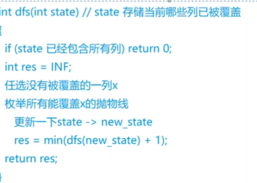
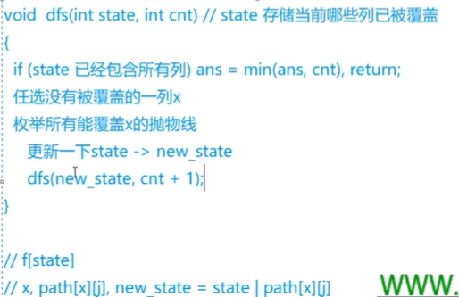
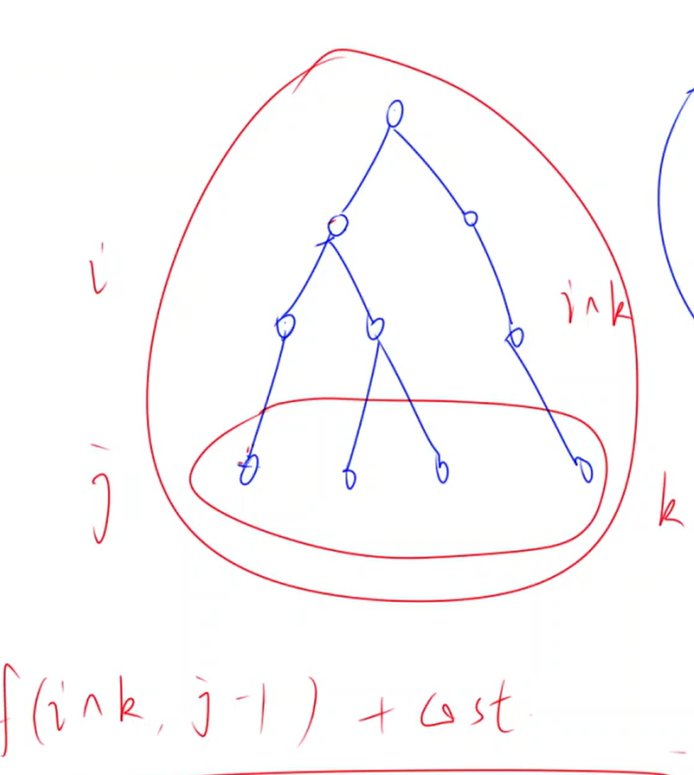

> 部分摘抄[学习笔记 | 状态压缩](https://flowus.cn/669740a8-0bb3-46a3-a3c6-a875ff11ba81)

不保证难度顺序。

## [NOIP2016 提高组] 愤怒的小鸟

题目背景

NOIP2016 提高组 D2T3

题目描述

Kiana 最近沉迷于一款神奇的游戏无法自拔。

简单来说，这款游戏是在一个平面上进行的。

有一架弹弓位于 $(0,0)$ 处，每次 Kiana 可以用它向第一象限发射一只红色的小鸟，小鸟们的飞行轨迹均为形如 $y=ax^2+bx$ 的曲线，其中 $a,b$ 是 Kiana 指定的参数，且必须满足 $a < 0$，$a,b$ 都是实数。

当小鸟落回地面（即 $x$ 轴）时，它就会瞬间消失。

在游戏的某个关卡里，平面的第一象限中有 $n$ 只绿色的小猪，其中第 $i$ 只小猪所在的坐标为 $\left(x_i,y_i \right)$。

如果某只小鸟的飞行轨迹经过了 $\left( x_i, y_i \right)$，那么第 $i$ 只小猪就会被消灭掉，同时小鸟将会沿着原先的轨迹继续飞行；

如果一只小鸟的飞行轨迹没有经过 $\left( x_i, y_i \right)$，那么这只小鸟飞行的全过程就不会对第 $i$ 只小猪产生任何影响。

例如，若两只小猪分别位于 $(1,3)$ 和 $(3,3)$，Kiana 可以选择发射一只飞行轨迹为 $y=-x^2+4x$ 的小鸟，这样两只小猪就会被这只小鸟一起消灭。

而这个游戏的目的，就是通过发射小鸟消灭所有的小猪。

这款神奇游戏的每个关卡对 Kiana 来说都很难，所以 Kiana 还输入了一些神秘的指令，使得自己能更轻松地完成这个游戏。这些指令将在【输入格式】中详述。

假设这款游戏一共有 $T$ 个关卡，现在 Kiana 想知道，对于每一个关卡，至少需要发射多少只小鸟才能消灭所有的小猪。由于她不会算，所以希望由你告诉她。

输入格式

第一行包含一个正整数 $T$，表示游戏的关卡总数。

下面依次输入这 $T$ 个关卡的信息。每个关卡第一行包含两个非负整数 $n,m$，分别表示该关卡中的小猪数量和 Kiana 输入的神秘指令类型。接下来的 $n$ 行中，第 $i$ 行包含两个正实数 $x_i,y_i$，表示第 $i$ 只小猪坐标为 $(x_i,y_i)$。数据保证同一个关卡中不存在两只坐标完全相同的小猪。

如果 $m=0$，表示 Kiana 输入了一个没有任何作用的指令。

如果 $m=1$，则这个关卡将会满足：至多用 $\lceil n/3 + 1 \rceil$ 只小鸟即可消灭所有小猪。

如果 $m=2$，则这个关卡将会满足：一定存在一种最优解，其中有一只小鸟消灭了至少 $\lfloor n/3 \rfloor$ 只小猪。

保证 $1\leq n \leq 18$，$0\leq m \leq 2$，$0 < x_i,y_i < 10$，输入中的实数均保留到小数点后两位。

上文中，符号 $\lceil c \rceil$ 和 $\lfloor c \rfloor$ 分别表示对 $c$ 向上取整和向下取整，例如：$\lceil 2.1 \rceil = \lceil 2.9 \rceil = \lceil 3.0 \rceil = \lfloor 3.0 \rfloor = \lfloor 3.1 \rfloor = \lfloor 3.9 \rfloor = 3$。

思路

我们要求出使用最少的抛物线覆盖所有点。首先明确两个点（除(0,0)）可以确定一条抛物线，两个点x不相同。那么一共就只有$n^2$条抛物线。我们要用数学方法求出每条抛物线经过了那些点

是典型的重复覆盖问题。用dancing links是最优解。

暴力的话就是




左图中每一条紫色块就是一个点，白线就是抛物线。块覆盖的白线表示该条抛物线可以覆盖该点。我们解决问题就是要找最少的白线使得每一块上都有白线经过。

本题的dp就是记忆化搜索。记$f_s$来保存状态为s时的res防止重复搜索。



注意验证二次函数合法性：$a<0,x1≠x2$

---

```C++
/*
Edit by Ntsc.
*/

#include<bits/stdc++.h>
using namespace std;
#define int long long
#define pb push_back
#define ull unsigned long long
#define pii pair<int, int>
#define pf first
#define ps second

#define rd read()
#define ot write
#define nl putchar('\n')
inline int rd{
	int xx=0,ff=1;
	char ch=getchar();
	while(ch<'0'||ch>'9') {if(ch=='-') ff=-1;ch=getchar();}
	while(ch>='0'&&ch<='9') xx=xx*10+(ch-'0'),ch=getchar();
	return xx*ff;
}
inline void write(int out){
	if(out<0) putchar('-'),out=-out;
	if(out>9) write(out/10);
	putchar(out%10+'0');
}

const int N=1e3+5;
const int M=5e6+5;
const int INF=2e9+5;
const int MOD=1e9+7;
const int BASE=17737;
bool f1;
int f[M],n,m;

vector<int> s;//状态
int pa[N][N];
struct node{
	double x,y;
}q[N];

bool cmp(double a,double b){
	if(fabs(a-b)<0.000001)return 1;
	return 0;
}

signed main(){
    // freopen("P5431_1.in", "r", stdin);
    // freopen("chfran.out", "w", stdout);
    // ios::sync_with_stdio(false);
    // cin.tie(0);cout.tie(0);
	int T=rd;
	while(T--){
		n=rd,m=rd;
		for(int i=0;i<n;i++)cin>>q[i].x>>q[i].y;
		memset(pa,0,sizeof pa);
		for(int i=0;i<n;i++){
			pa[i][i]=1<<i;
			for(int j=0;j<n;j++){
				double x1=q[i].x,y1=q[i].y;
				double x2=q[j].x,y2=q[j].y;
				if(cmp(x1,x2))continue;//注意eps不能用==
				double a=(y1/x1-y2/x2)/(x1-x2);
				// cerr<<"a="<<a<<endl;
				if(a>=0)continue;
				double b=(y1/x1)-a*x1;
				int cnt=0;
				for(int k=0;k<n;k++){
					double x=q[k].x,y=q[k].y;
					if(cmp(a*x*x+b*x,y))cnt+=1<<k;//标记经过
				}
				pa[i][j]=cnt;

			}
		}

		memset(f,0x3f,sizeof(f));
		f[0]=0;
		for(int i=0;i+1<1<<n;i++){
			int x=0;
			for(int j=0;j<n;j++){
				if(!(i>>j&1)){x=j;break;}
			}
			for(int j=0;j<n;j++)f[i|pa[x][j]]=min(f[i]+1,f[i|pa[x][j]]);
		}

		cout<<f[(1<<n)-1]<<endl;
	}
    return 0;
}
/*
5 4
PHPP
PPHH
PPPP
PHPP
PHHP

*/
```

【数据范围】

|测试点编号|$n\leqslant$|$m=$|$T\leqslant$|
|-|-|-|-|
|$1$|$2$|$0$|$10$|
|$2$|$2$|$0$|$30$|
|$3$|$3$|$0$|$10$|
|$4$|$3$|$0$|$30$|
|$5$|$4$|$0$|$10$|
|$6$|$4$|$0$|$30$|
|$7$|$5$|$0$|$10$|
|$8$|$6$|$0$|$10$|
|$9$|$7$|$0$|$10$|
|$10$|$8$|$0$|$10$|
|$11$|$9$|$0$|$30$|
|$12$|$10$|$0$|$30$|
|$13$|$12$|$1$|$30$|
|$14$|$12$|$2$|$30$|
|$15$|$15$|$0$|$15$|
|$16$|$15$|$1$|$15$|
|$17$|$15$|$2$|$15$|
|$18$|$18$|$0$|$5$|
|$19$|$18$|$1$|$5$|
|$20$|$18$|$2$|$5$|

## [NOI2001] 炮兵阵地

题目描述

司令部的将军们打算在 $N\times M$ 的网格地图上部署他们的炮兵部队。

一个 $N\times M$ 的地图由 $N$ 行 $M$ 列组成，地图的每一格可能是山地（用 $\texttt{H}$ 表示），也可能是平原（用 $\texttt{P}$ 表示），如下图。

在每一格平原地形上最多可以布置一支炮兵部队（山地上不能够部署炮兵部队）；一支炮兵部队在地图上的攻击范围如图中黑色区域所示：


如果在地图中的灰色所标识的平原上部署一支炮兵部队，则图中的黑色的网格表示它能够攻击到的区域：沿横向左右各两格，沿纵向上下各两格。

图上其它白色网格均攻击不到。从图上可见炮兵的攻击范围不受地形的影响。

现在，将军们规划如何部署炮兵部队，在防止误伤的前提下（保证任何两支炮兵部队之间不能互相攻击，即任何一支炮兵部队都不在其他支炮兵部队的攻击范围内），在整个地图区域内最多能够摆放多少我军的炮兵部队。

思路

假如我们只考虑竖直方向，那么我们在考虑第i行时要知道i-1,i-2行的状态。如果在第j列，i-1或者i-2行有炮兵，那么第i行就不能摆炮兵。同时炮兵不能在山地上

记录$f_{i,j,k}$为考虑第i行，第i-1,i行的状态分别为j,k的合法状态的最大状态数。为了知道i-1,i-2行的状态，我们从$f_{i-1}$转移来即可。

---

```C++
/*
Edit by Ntsc.
*/

#include<bits/stdc++.h>
using namespace std;
#define int long long
#define pb push_back
#define ull unsigned long long
#define pii pair<int, int>
#define pf first
#define ps second

#define rd read()
#define ot write
#define nl putchar('\n')
inline int rd{
	int xx=0,ff=1;
	char ch=getchar();
	while(ch<'0'||ch>'9') {if(ch=='-') ff=-1;ch=getchar();}
	while(ch>='0'&&ch<='9') xx=xx*10+(ch-'0'),ch=getchar();
	return xx*ff;
}
inline void write(int out){
	if(out<0) putchar('-'),out=-out;
	if(out>9) write(out/10);
	putchar(out%10+'0');
}

const int N=1e3+5;
const int M=2e3+5;
const int INF=2e9+5;
const int MOD=1e9+7;
const int BASE=17737;
bool f1;
int f[2][M][M],cnt[M],n,m;
int g[N];//每一行的山地状态

vector<int> s;//状态

bool check(int s){
	for(int i=0;i<m;i++){
		if((s>>i&1)&&((s>>i+1&1)||(s>>i+2&1)))return 0;//只有当前这一位是1才需要判定与第i-1,i-2行是否合法
	}
	return 1;
}
int count(int x){//计算x的二进制下有几个1
	int res=0;
	while(x){
		res+=x&1;
		x>>=1;
	}
	return res;
}

signed main(){
    // freopen("P5431_1.in", "r", stdin);
    // freopen("chfran.out", "w", stdout);
    // ios::sync_with_stdio(false);
    // cin.tie(0);cout.tie(0);
    
    n=rd,m=rd;
	for(int i=0;i<n;i++){
		for(int j=0;j<m;j++){
			char c;
			cin>>c;
			if(c=='H')g[i]+=1<<j;
		}
	}
	for(int i=0;i<1<<m;i++){
		if(check(i)){
			s.pb(i);
			cnt[i]=count(i);
		}
	}
	// cerr<<s.size()<<endl;
	// cerr<<"OK";

	for(int i=0;i<n+2;i++){
		for(int j=0;j<s.size();j++){
			for(int k=0;k<s.size();k++){
				for(int u=0;u<s.size();u++){
					int a=s[u],b=s[j],c=s[k];
					// cerr<<"U";
					if((a&b)||(a&c)||(b&c))continue;
					if(g[i]&c)continue;
					// cerr<<"K";
					f[i&1][j][k]=max(f[i&1][j][k],f[i-1&1][u][j]+cnt[c]);
				}
			}
		}
	}
	cout<<f[n+1&1][0][0];

    return 0;
}
/*


*/
```

对于 $100\%$ 的数据，$1 \leq N\le 100$，$1 \leq M\le 10$，保证字符仅包含 `P` 与 `H`。

## [NOIP2017 提高组] 宝藏

题目背景

NOIP2017 D2T2

题目描述

参与考古挖掘的小明得到了一份藏宝图，藏宝图上标出了 $n$ 个深埋在地下的宝藏屋， 也给出了这 $n$ 个宝藏屋之间可供开发的 $m$ 条道路和它们的长度。

小明决心亲自前往挖掘所有宝藏屋中的宝藏。但是，每个宝藏屋距离地面都很远，也就是说，从地面打通一条到某个宝藏屋的道路是很困难的，而开发宝藏屋之间的道路则相对容易很多。

小明的决心感动了考古挖掘的赞助商，赞助商决定免费赞助他打通一条从地面到某个宝藏屋的通道，通往哪个宝藏屋则由小明来决定。

在此基础上，小明还需要考虑如何开凿宝藏屋之间的道路。已经开凿出的道路可以 任意通行不消耗代价。每开凿出一条新道路，小明就会与考古队一起挖掘出由该条道路所能到达的宝藏屋的宝藏。另外，小明不想开发无用道路，即两个已经被挖掘过的宝藏屋之间的道路无需再开发。

新开发一条道路的代价是 $\mathrm{L} \times \mathrm{K}$。其中 $L$ 代表这条道路的长度，$K$ 代表从赞助商帮你打通的宝藏屋到这条道路起点的宝藏屋所经过的宝藏屋的数量（包括赞助商帮你打通的宝藏屋和这条道路起点的宝藏屋） 。

请你编写程序为小明选定由赞助商打通的宝藏屋和之后开凿的道路，使得工程总代价最小，并输出这个最小值。

思路

可以抽象为一颗树，答案即类似最小生成树。但是这里的路径等价是不固定的，对于起点的长度\times 路径长度。

定义状态f_{i,j}为树的前j层的点集为i时的最小值。~~然后我们枚举第j+1层的点集s，计算出i，根据f_{i,j}计算出f_{i|s,j+1}~~然后我们从i中枚举子集s作为第j层的点集，计算出前j-1层的点集为i\^s，然后根据f_{i\^s,j-1}计算出f_{i,j}。；

为了加快转移过程，我们可以预处理g(i,j)为从点i到点集j的最小距离




一个枚举子集的小技巧，复杂度O(2^{n+1})

```C++
for(int i=1;i<1<<n;i++){
    for(int j=i-1&i;j;j=j-1&i){
        //枚举i的子集
    }
}
```

图示


---

```C++
/*
Edit by Ntsc.
*/

#include<bits/stdc++.h>
using namespace std;
#define int long long
#define pb push_back
#define ull unsigned long long
#define pii pair<int, int>
#define pf first
#define ps second

#define rd read()
#define ot write
#define nl putchar('\n')
inline int rd{
	int xx=0,ff=1;
	char ch=getchar();
	while(ch<'0'||ch>'9') {if(ch=='-') ff=-1;ch=getchar();}
	while(ch>='0'&&ch<='9') xx=xx*10+(ch-'0'),ch=getchar();
	return xx*ff;
}
inline void write(int out){
	if(out<0) putchar('-'),out=-out;
	if(out>9) write(out/10);
	putchar(out%10+'0');
}

const int N=1e2+5;
const int M=5e3+5;
const int INF=2e9+5;
const int MOD=1e9+7;
const int BASE=17737;
bool f1;
int f[M][N],dis[N][N],n,m;
int g[N][M];//每一行的山地状态

vector<int> s;//状态

bool check(int s){
	for(int i=0;i<m;i++){
		if((s>>i&1)&&((s>>i+1&1)||(s>>i+2&1)))return 0;//只有当前这一位是1才需要判定与第i-1,i-2行是否合法
	}
	return 1;
}
int count(int x){//计算x的二进制下有几个1
	int res=0;
	while(x){
		res+=x&1;
		x>>=1;
	}
	return res;
}

signed main(){
    // freopen("P5431_1.in", "r", stdin);
    // freopen("chfran.out", "w", stdout);
    // ios::sync_with_stdio(false);
    // cin.tie(0);cout.tie(0);

	n=rd,m=rd;
	memset(dis,0x3f,sizeof dis);
	for(int i=0;i<n;i++)dis[i][i]=0;
	for(int i=1;i<=m;i++){
		int a=rd-1,b=rd-1,c=rd;//偏移
		dis[a][b]=dis[b][a]=min(c,dis[a][b]);
	}
	memset(g,0x3f,sizeof g);
	for(int i=0;i<n;i++){
		for(int j=0;j<1<<n;j++){
			for(int k=0;k<n;k++){
				if(j>>k&1)g[i][j]=min(g[i][j],dis[i][k]);
			}
		}
	}

	memset(f,0x3f,sizeof f);
	for(int i=0;i<n;i++){
		f[1<<i][0]=0;
	}
	
	for(int i=1;i<1<<n;i++){
		for(int j=i-1&i;j;j=j-1&i){
			//枚举i的子集
			int r=i^j,res=0;
			for(int k=0;k<n;k++){
				if(j>>k&1){
					res+=g[k][r];
					if(res>=INF)break;
				}
			}
			if(res>=INF)continue;
			for(int k=1;k<n;k++)f[i][k]=min(f[i][k],f[r][k-1]+res*k);//k为层数
			
		}
	}

	int ans=INF;
	for(int i=0;i<n;i++)ans=min(ans,f[(1<<n)-1][i]);
    cout<<ans<<endl;
    return 0;
}
/*
5 4
PHPP
PPHH
PPPP
PHPP
PHHP

*/
```

对于 $ 100\%$ 的数据： $1 \le n \le 12$，$0 \le m \le 10^3$，$v \le  5\times 10^5$。


## Mondriaan's Dream

题目描述

荷兰著名画家皮特·蒙德里安对正方形和矩形非常着迷。有一天晚上，在创作完他的“厕所系列”画作后（他不得不用厕纸画画，因为他所有的画纸都用完了），他梦见用宽度为 $2$、高度为 $1$ 的小矩形以不同的方式填充一个大矩形。


作为这方面的专家，他一眼就看出需要使用计算机来计算填充这个大矩形的不同方式。请帮助他，以免他的梦想变成噩梦！

输入格式

输入包含多个测试用例。每个测试用例由两个整数构成：大矩形的高度 $h$ 和宽度 $w$。当 $h = w = 0$ 时输入结束。否则，$1 \leq h, w \leq 11$。

输出格式

对于每个测试用例，输出使用大小为 $2\times 1$ 的小矩形填充给定大矩形的不同方式的数量。假设给定的大矩形是定向的，即对称的铺砌方式应多次计算。

---

我来写一发 dfs+刷表法。

首先我们还是按照状态压缩的流程，有 $f_{i,j}$ 表示：目前填到第 $i$ 行，且该行的状态为 $j$。

那么我们怎么样定义状态呢？我们定义每个矩形的最后一行为 $0$，其余为 $1$。具体来说，两种矩形我们分别表示为 $\begin{bmatrix} 0 ~0\end{bmatrix}$ 和 $\begin{bmatrix}1 \\0 \end{bmatrix}$。

那么当枚举到当前行 $i$，我们要枚举一下上一行的状态 $j$，然后看在 $j$ 的状态下，第 $i$ 行可能的状态有那些。这里我们用 dfs 搜索出第i行可能的状态，然后从 $f_{i-1,j}$ 转移即可。

具体来说，搜索时传入一下参数：

- 当前行，上一行的状态，当前列，当前行考虑到当前列时的状态。

在填状态的时候，考虑上一行的当前列的状态：

- 如果是 $1$，那么这里只能填 $0$。

- 如果是 $0$，这里可以填 $1$，也可以填 $0$（此时我们要考虑下一个位置是否可填 $0$，如果不行，那么这里也不可以填；如果可以，填了之后直接跳到下下列）。

对于最后一行的边界，我们直接取 $f_{n,0}$ 为答案即可。不用顾及有矩形长出来的情况。

```C++

itn f[14][10004];

int getw(int x,int k){
    return x&(1<<k)?1:0;
}

void dfs(itn x,int pre,int y,itn now){
    if(y==-1){
        f[x][now]+=f[x-1][pre];
        return ;
    }

    int cur=pre&(1<<y)?1:0;
    if(cur){
        dfs(x,pre,y-1,now<<1);
    }else{
        dfs(x,pre,y-1,now<<1|1);
        if(y>0&&getw(pre,y-1)==0)dfs(x,pre,y-2,now<<2);
    }
}


void solve(){
    itn n=rd,m=rd;
    if(n+m==0)exit(0);

    memset(f,0,sizeof f);

    f[0][0]=1;
    for(int i=1;i<=n;i++){
        for(int j=0;j<(1<<m);j++){
            dfs(i,j,m-1,0);
        }
    }
    cout<<f[n][0]<<endl;
}

```

做了本题可以取看 [CEOI2002] Bugs Integrated,Inc. 也是一样的做法。（致审核~：那个小数点不是句号，是题目名带的）

本文同步发于：[oi-beats/状态压缩](https://ntsc-yrx.github.io/oi-beats/site/%E5%8A%A8%E6%80%81%E8%A7%84%E5%88%92/%E7%8A%B6%E5%8E%8BDP/)，[个人博客/状态压缩](https://flowus.cn/ntsc/share/60456607-3106-48b4-93ac-cec48858ae26?code=3L02QC
【FlowUs 息流】状压DP)

## Haywire

题目描述

Farmer John有 $N$ 只奶牛（$4 \leq N \leq 12$，$N$ 是偶数）。

他们建立了一套原生的系统，使得奶牛与他的朋友可以通过由干草保护的线路来进行对话交流。

每一头奶牛在这个牧场中正好有 $3$ 个朋友，并且他们必须把自己安排在一排干草堆中。

一条长 $L$ 的线路要占用刚好 $L$ 堆干草来保护线路。

比如说，如果有两头奶牛分别在草堆 $4$ 与草堆 $7$ 中，并且他们是朋友关系，那么我们就需要用 $3$ 堆干草来建造线路，使他们之间能够联系。

假设每一对作为朋友的奶牛都必须用一条单独的线路来连接，并且我们可以随便地改变奶牛的位置，请计算出我们建造线路所需要的最少的干草堆。

输入格式

第 $1$ 行：一个整数 $N$。为了方便，我们给奶牛用 $1\sim N$ 的数字进行编号。

第 $2, 3, \cdots, N + 1$ 行：每一行都有三个在 $1\sim N$ 中的整数。第 $i+1$ 行的数字代表着第 $i$ 头奶牛的三个朋友的编号。显然，如果奶牛 $i$ 是奶牛 $j$ 的三个朋友之一，那么奶牛 $j$ 也是奶牛 $i$ 的三个朋友之一。

输出格式

一个整数，代表着建造线路需要的干草堆数量的最小值。

---

$f_s$ 表示将 $s$ 中所有牛的连接都建立需要的最小花费。

然后怎么转移呢？

我们枚举到一个状态 $s$，统计 $s$ 中有多少条未完成的连接：即这个连接只有一个端点在 $s$ 中。记数量为 $cnt$。

随后考虑枚举 $i\in s$，从 $f_{s-i}$ 转移来。那么就相当于向 $s-i$ 中插入 $i$，需要新增的最小花费是多少呢？统计出 $s$ 中和 $i$ 有关的未完成连接的数量 $r$，那么花费就是 $cnt-(3-r)+r$。为啥？

这意味着我们其余的那些未完成连接都要跨过 $i$ 这样会增加 $cnt-(3-r)$ 的代价（下面有解释）。减去 $3-r$ 是因为有 $3-r$ 条在加入i时补全了，后面不会再有新代价。加上r是因为新增了 $r$ 条未完成连接（这些连接当前只有一个端点，就是 $i$）。

也就是说加入点 $i$ 的代价就是加入 $i$ 后当前局面的**未完成连接的数量。**

为什么呢？

这里不存在什么贪心，我们枚举每个点的位置的流程就体现在插入到集合的顺序。所以我们默认当前插入的点就放在之前在集合内的点的后面。因此对未完成连接的代价就是 $1$ 了。


```C++
// Problem: P2210 Haywire
// Contest: Luogu
// URL: https://www.luogu.com.cn/problem/P2210
// Memory Limit: 125 MB
// Time Limit: 1000 ms
// Challenger: Erica N
// ----
#include<bits/stdc++.h>

using namespace std;
#define rd read()
#define ull unsigned long long
#define int long long 
#define itn int
#define ps second 
#define pf first

inline int read(){
	int x;
	cin>>x;
	return x;
}
#define zerol = 1
#ifdef zerol
#define cdbg(x...) do { cerr << #x << " -> "; err(x); } while (0)
void err() {
	cerr << endl;
}
template<template<typename...> class T, typename t, typename... A>
void err(T<t> a, A... x) {
	for (auto v: a) cerr << v << ' ';
	err(x...);
}
template<typename T, typename... A>
void err(T a, A... x) {
	cerr << a << ' ';
	err(x...);
}
#else
#define dbg(...)
#endif
const int N=10+5;
const ull P=137;
const int INF=1e9+7;
/*

策略


*/

int f[1<<N];
int to[N][4];

signed main(){
	int n=rd;
	for(int i=0;i<n;i++){
		for(int j=0;j<=2;j++)to[i][j]=rd-1;
	}	
	
	
	for(int s=1;s<(1<<n);s++){
		int cnt=0;
		for(int i=0;i<n;i++){
			
			if((s>>i)&1){
				for(int j=0;j<3;j++){
					cnt++;
					cnt-=(s>>to[i][j])&1;
				}
			}
		}
		f[s]=INF;
		for(int i=0;i<n;i++){
			if((s>>i)&1){
				int r=0;
				for(int j=0;j<3;j++){
					r++;
					r-=(s>>to[i][j])&1;
				}
				int cost=cnt-3+2*r;
				f[s]=min(f[s],cost+f[s^(1<<i)]);
			}
		}
	}
	
	cout<<f[(1<<n)-1]<<endl
}


```

## Matching

给定二分图，两个集合都有 $N$ 个点，$a_{i,j}=1$ 表示第一个集合第 $i$ 个点与第二个集合第 $j$ 个点连边。

求二分图完备匹配数，答案对 $10^9+7$ 取模。

- $1\ \leq\ N\ \leq\ 21$

---

考虑到一个状态为：左边选了哪些点，右边选了那些点。但是我们发现左边选点的顺序对本题无用，所以我们可以直接记录$f_{i,s}$为选了左边前i个点，右边选择了s这些点时的方案数。

```C++
// Problem: Matching
//      匹配
// Contest: Luogu
// URL: https://www.luogu.com.cn/problem/AT_dp_o
// Memory Limit: 1 MB
// Time Limit: 2000 ms
// Challenger: Erica N
// ----
// 
#include<bits/stdc++.h>

using namespace std;
#define rd read()
#define ull unsigned long long
#define int long long 
#define pb push_back
#define itn int
#define ps second 
#define pf first


#define rd read()
int read()
{
  int xx = 0, ff = 1;
  char ch = getchar();
  while (ch < '0' || ch > '9')
  {
    if (ch == '-')
      ff = -1;
    ch = getchar();
  }
  while (ch >= '0' && ch <= '9')
    xx = xx * 10 + (ch - '0'), ch = getchar();
  return xx * ff;
}
#define zerol = 1
#ifdef zerol
#define cdbg(x...) do { cerr << #x << " -> "; err(x); } while (0)
void err() {
	cerr << endl;
}
template<template<typename...> class T, typename t, typename... A>
void err(T<t> a, A... x) {
	for (auto v: a) cerr << v << ' ';
	err(x...);
}
template<typename T, typename... A>
void err(T a, A... x) {
	cerr << a << ' ';
	err(x...);
}
#else
#define dbg(...)
#endif
const int N=22;
const ull P=137;
const int INF=1e18+7;

const int MOD=1e9+7;
/*

策略


*/	

int f[N][1<<N];//左部前i给点匹配了右部j中的点的方案数
bool a[N][N];

inline int popcnt(int x){
	int res=0;
	while(x){
		res+=x&1;
		x>>=1;
	}
	return res;
}
signed main(){
	int n=rd;
	
	for(int i=0;i<n;i++){
		for(int j=0;j<n;j++){
			a[i][j]=rd;
		}
	}
	
	f[0][0]=1;
	for(int s=0;s<(1<<n);s++){
		int c=popcnt(s);
		for(int j=0;j<n;j++){
			if(s>>j&1)continue;
			if(!a[c][j])continue;
			(f[c+1][s|(1<<j)]+=f[c][s])%=MOD;
		}
	}
	
	
	cout<<f[n][(1<<n)-1]<<endl;
	

}
```

# Binary Table

有一个 $n$ 行 $m$ 列的表格，每个元素都是 $0/1$ ，每次操作可以选择一行或一列，把 $0/1$ 翻转，即把 $0$ 换为 $1$ ，把 $1$ 换为 $0$ 。请问经过若干次操作后，表格中最少有多少个 $1$ 。

第一行是两个整数 $n$ 和 $m$ （ $1\leqslant n\leqslant 20,1\leqslant m\leqslant 10^5$ ）之后 $n$ 行，每行 $m$ 个数字 $0/1$ ，注意数字间无空格。

---

考虑问题可以变成：进行最少几次单点翻转，结合行翻转，可以使得每行都相同。

那么设f_{i,s}为使用i次单点翻转时，可以使最多多少行到达状态s。


```C++
// Problem: Binary Table
// Contest: Luogu
// URL: https://www.luogu.com.cn/problem/CF662C
// Memory Limit: 250 MB
// Time Limit: 6000 ms
// Challenger: Erica N
// ----

#include<bits/stdc++.h>

using namespace std;
#define rd read()
#define ull unsigned long long
// #define int long long 
#define pb push_back
#define itn int
#define ps second 
#define pf first


#define rd read()
int read()
{
  int xx = 0, ff = 1;
  char ch = getchar();
  while (ch < '0' || ch > '9')
  {
    if (ch == '-')
      ff = -1;
    ch = getchar();
  }
  while (ch >= '0' && ch <= '9')
    xx = xx * 10 + (ch - '0'), ch = getchar();
  return xx * ff;
}
#define zerol = 1
#ifdef zerol
#define cdbg(x...) do { cerr << #x << " -> "; err(x); } while (0)
void err() {
	cerr << endl;
}
template<template<typename...> class T, typename t, typename... A>
void err(T<t> a, A... x) {
	for (auto v: a) cerr << v << ' ';
	err(x...);
}
template<typename T, typename... A>
void err(T a, A... x) {
	cerr << a << ' ';
	err(x...);
}
#else
#define dbg(...)
#endif
const int N=21;
const int M=1e5+5;
const ull P=137;
const int INF=1e18+7;
/*

策略


*/	


int a[M];
int f[N][1<<N];//使用i次单点修改可以使最多几行到达状态j

signed main(){
	int n=rd;int m=rd;
	
	for(int i=1;i<=n;i++){
		string s;
		cin>>s;
		for(int j=s.size()-1;~j;j--){
			a[j+1]<<=1;
			a[j+1]|=s[j]-'0';
		}
	}
	
	swap(n,m);
	
	
	for(int i=1;i<=n;i++){
		f[0][a[i]]++;
	}
	
	for(int j=0;j<m;j++){
		for(int i=m;i;i--){
			for(int s=0;s<(1<<m);s++){
				f[i][s]+=f[i-1][s^(1<<j)];
			}
		}
	}
	
	int ans=INF;
	for(int s=0;s<(1<<m);s++){
		int res=0;
		for(int i=0;i<=m;i++){
			res+=f[i][s]*min(m-i,i);
		}
		ans=min(ans,res);
	}
	
	cout<<ans<<endl;
}

```

## [NOI2015] 寿司晚宴

题目描述

为了庆祝 NOI 的成功开幕，主办方为大家准备了一场寿司晚宴。小 G 和小 W 作为参加 NOI 的选手，也被邀请参加了寿司晚宴。

在晚宴上，主办方为大家提供了 $n−1$ 种不同的寿司，编号 $1,2,3,\ldots,n-1$，其中第 $i$ 种寿司的美味度为 $i+1$。（即寿司的美味度为从 $2$ 到 $n$）

现在小 G 和小 W 希望每人选一些寿司种类来品尝，他们规定一种品尝方案为不和谐的当且仅当：小 G 品尝的寿司种类中存在一种美味度为 $x$ 的寿司，小 W 品尝的寿司中存在一种美味度为 $y$ 的寿司，而 $x$ 与 $y$ 不互质。

现在小 G 和小 W 希望统计一共有多少种和谐的品尝寿司的方案（对给定的正整数 $p$ 取模）。注意一个人可以不吃任何寿司。

输入格式

输入文件的第 $1$ 行包含 $2$ 个正整数 $n, p$ 中间用单个空格隔开，表示共有 $n$ 种寿司，最终和谐的方案数要对 $p$ 取模。

输出格式

输出一行包含 $1$ 个整数，表示所求的方案模 $p$ 的结果。


**勘误：$0 < p \le 10^9 $**

---

题意：

求方案数，使得两个人选择的数字（[2,n]的子集）两两互质。

---

要让两个人选的数字全部互质，那么有一个显然的充要条件：甲选的数字的质因数集合和乙选的数字的质因数集合没有交集

如果是n<30，那么范围内的质数很少，我们可以状态压缩

记f_{i,S_1,S_2}为考虑i个数字时，甲集合的质因数集合为S_1，乙集合的质因数集合为 S_2时的方案数。压去第一维。

如果是n≤500，发现每一个数，其$>\sqrt{500}$的质数只有一个，所以我们单独记录这个质数。

然后，我们把2-n这些数按照大质因子大小排序，这样令大质因子相同的数排在一起（也就是不能甲乙同时选的）

我们记录三个相同数组：dp[S1​][S2​],f1[][],f2[][]，因为小质因数只有8个，所以0≤S1​,S2​≤255

对于每一段大质因子相同的数，我们在这一段开始的时候把dp的值赋给f1和f2，然后在这一段内部用刷表法推f1和f2，其中f1表示的就是这个大质因子让第一个人选，f2就是这个大质因子让第二个人选。

这一段数推完以后，再把f1f2合并到dp里面，dp[S1​][S2​]=f1[S1​][S2​]+f2[S1​][S2​]−dp[S1​][S2​]

这里减掉一个dp是因为两种情况会重复统计两个人都不选的情况（也就是原来的dp[S_1][S_2]的值），减掉即可。

---

```C++
/*                                                                                
                      Keyblinds Guide
     				###################
      @Ntsc 2024

      - Ctrl+Alt+G then P : Enter luogu problem details
      - Ctrl+Alt+B : Run all cases in CPH
      - ctrl+D : choose this and dump to the next
      - ctrl+Shift+L : choose all like this
      - ctrl+K then ctrl+W: close all
      - Alt+la/ra : move mouse to pre/nxt pos'
	  
*/
#include <bits/stdc++.h>
#include <queue>
using namespace std;

#define rep(i, l, r) for (int i = l, END##i = r; i <= END##i; ++i)
#define per(i, r, l) for (int i = r, END##i = l; i >= END##i; --i)
#define pb push_back
#define mp make_pair
#define int long long
#define pii pair<int, int>
#define ps second
#define pf first

// #define innt int
#define itn int
// #define inr intw
// #define mian main
// #define iont int

#define rd read()
int read(){
    int xx = 0, ff = 1;
    char ch = getchar();
    while (ch < '0' || ch > '9') {
		if (ch == '-')
			ff = -1;
		ch = getchar();
    }
    while (ch >= '0' && ch <= '9')
      xx = xx * 10 + (ch - '0'), ch = getchar();
    return xx * ff;
}
void write(int out) {
	if (out < 0)
		putchar('-'), out = -out;
	if (out > 9)
		write(out / 10);
	putchar(out % 10 + '0');
}

#define ell dbg('\n')
const char el='\n';
const bool enable_dbg = 1;
template <typename T,typename... Args>
void dbg(T s,Args... args) {
	if constexpr (enable_dbg){
    cerr << s;
    if(1)cerr<<' ';
		if constexpr (sizeof...(Args))
			dbg(args...);
	}
}

#define zerol = 1
#ifdef zerol
#define cdbg(x...) do { cerr << #x << " -> "; err(x); } while (0)
void err() { cerr << endl; }
template<template<typename...> class T, typename t, typename... A>
void err(T<t> a, A... x) { for (auto v: a) cerr << v << ' '; err(x...); }
template<typename T, typename... A>
void err(T a, A... x) { cerr << a << ' '; err(x...); }
#else
#define dbg(...)
#endif


const int N = 5e2+ 5;
const int INF = 1e18;
const int M = 1e7;
 int MOD = 1e9 + 7;


int n;


int p[11]={0,2,3,5,7,11,13,17,19,23};

struct node{
    int big,s;
    int v;

    void init(){
        int t=v;
        
        big=-1;//唯一一个大质数单独处理
        for(int i=1;i<=8;i++){
            if(t%p[i]) continue;
            s|=(1<<i-1);
            while(t%p[i]==0) t/=p[i];
        }
        if(t!=1) big=t; 
    }
}a[N];


bool cmp(node a,node b){
    return a.big<b.big;
}


int f[N][N],f1[N][N],f2[N][N];

void solve(){
    n=rd,MOD=rd;
    for(int i=1;i<n;i++){
        a[i].v=i+1;
        a[i].init();
    }

    sort(a+1,a+n,cmp);

    f[0][0]=1;

    for(int i=1;i<n;i++){
        if(i==1||a[i].big!=a[i-1].big||a[i].big==-1){
            memcpy(f1,f,sizeof f1);
            memcpy(f2,f,sizeof f2);
        }

        for(int j=255;~j;j--){
            for(int k=255;~k;k--){
                if(j&k)continue;
                if((a[i].s&j)==0) f2[j][k|a[i].s]=(f2[j][k|a[i].s]+f2[j][k]+MOD)%MOD;
                if((a[i].s&k)==0) f1[j|a[i].s][k]=(f1[j|a[i].s][k]+f1[j][k]+MOD)%MOD;
            }
        }

        if(i==n-1||a[i].big!=a[i+1].big||a[i].big==-1){
            for(int j=255;~j;j--){
                for(int k=255;~k;k--){
                    if(j&k)continue;
                    f[j][k]=(f1[j][k]+f2[j][k]+MOD-f[j][k]+MOD)%MOD;
                }
            }
        }
    }
    int ans=0;
    for(int j=255;~j;j--){
        for(int k=255;~k;k--){
            if(j&k)continue;
            if(f[j][k])ans=(ans+f[j][k])%MOD;
        }
    }

    cout<<ans<<endl;
}

signed main() {
    // freopen(".in","r",stdin);
    // freopen(".in","w",stdout);

    int T=1;
    while(T--){
    	solve();
    }
    return 0;
}
```

