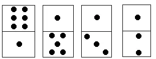

# 01背包

## 简介

01背包是在M件物品取出若干件放在空间为W的背包里，每件物品的体积为W1，W2至Wn，与之相对应的价值为P1,P2至Pn。01背包是背包问题中最简单的问题。01背包的约束条件是给定几种物品，每种物品有且只有一个，并且有权值和体积两个属性。在01背包问题中，因为每种物品只有一个，对于每个物品只需要考虑选与不选两种情况。如果不选择将其放入背包中，则不需要处理。如果选择将其放入背包中，由于不清楚之前放入的物品占据了多大的空间，需要枚举将这个物品放入背包后可能占据背包空间的所有情况。

## 思想

**DP思想**

记一个数组`f[i][j]`，表示当前选完第i件物品，背包已占用空间为j时能取到的最大价值

**决策**

`f[i][j] = max(f[i - 1][j], f[i - 1][j - w[i]] + c[i])`

`f[i][j]`取以下情况中的最大值

- 不取第i件物品。`f[i - 1][j]`

- 取第i件物品`f[i - 1][j - w[i]] + c[i])`

`w[i]`表示i的占用空间
`c[i]`表示i的价值
请思考。

**循环**

i++{j++}


## 知识点

01背包是一种**动态规划**问题。动态规划的核心就是**状态转移方程**。

**问题描述**
01背包问题可描述为如下问题：
有一个容量为V的背包，还有n个物体。现在忽略物体实际几何形状，我们认为只要背包的剩余容量大于等于物体体积，那就可以装进背包里。每个物体都有两个属性，即体积w和价值v。
问：如何向背包装物体才能使背包中物体的总价值最大？

**01背包的状态转移方程**为
f[i][j] = max(f[i - 1][j], f[i - 1][j - w[i]] + v[j])

i代表对i件物体做决策，有两种方式—放入背包和不放入背包。
j表示当前背包剩余的容量。

**转移方程的解释**：
创建一个状态矩阵f，横坐标 i 是物体编号，纵坐标 j 为背包容量。
首先将 f 第0行和第0列初始化为0 （代码里面将整个f初始化为0了，其实只初始化第0行和第0列就够了）。这个表示不放物体时最大价值为0 。（物体编号从1开始）
接下来依次遍历f的每一行。

> 原文链接：[https://blog.csdn.net/Iseno_V/article/details/100001133](https://blog.csdn.net/Iseno_V/article/details/100001133)

---

## 例题 #1

一个旅行者有一个最多能装 M公斤的背包，现在有 n件物品，它们的重量分别是W1，W2，...,Wn,它们的价值分别为C1,C2,...,Cn，求旅行者能获得最大总价值。


贪心反例：

w=90 c=90

w=50 c=49

w=50 c=49

M=100

代码

```C++
#include <bits/stdc++.h>
using namespace std;
int m, n, w[205], c[205], f[205][205];

int main() {
	cin >> m >> n;
	for (int i = 1; i <= n; i++)
		cin >> w[i] >> c[i];
	for (int i = 1; i <= n; i++) {
		for (int j = m; j > 0; j--) {
			if (w[i] <= j)
				f[i][j] = max(f[i - 1][j], f[i - 1][j - w[i]] + c[i]);
			else
				f[i][j] = f[i - 1][j];
		}
	}

	cout << f[n][m];
	return 0;
}
```

## 例题 #2 高维度的01背包

### [USACO03FALL] Cow Exhibition G

奶牛想证明它们是聪明而风趣的。为此，贝西筹备了一个奶牛博览会，她已经对 $N$ 头奶牛进行了面试，确定了每头奶牛的智商和情商。

贝西有权选择让哪些奶牛参加展览。由于负的智商或情商会造成负面效果，所以贝西不希望出展奶牛的智商之和小于零，或情商之和小于零。满足这两个条件下，她希望出展奶牛的智商与情商之和越大越好，请帮助贝西求出这个最大值。

输入格式

第一行：单个整数 $N$，$1 \le N \le 400$。

第二行到第 $N+1$ 行：第 $i+1$ 行有两个整数：$S_i$ 和 $F_i$，表示第 $i$ 头奶牛的智商和情商，− $1000 \le S_i;F_i \le 1000$。

---

我们把两个维度，一个作为背包容量，一个转化为求该维度的最大值即可。

## 例题 #3 二维01背包 榨取kkksc03

洛谷的运营组决定，如果一名 OIer 向他的教练推荐洛谷，并能够成功的使用（成功使用的定义是：该团队有 $20$ 个或以上的成员，上传 $10$ 道以上的私有题目，布置过一次作业并成功举办过一次公开比赛），那么他可以浪费掉 kkksc03 的一些时间的同时消耗掉 kkksc03 的一些金钱以满足自己的一个愿望。

kkksc03 的时间和金钱是有限的，所以他很难满足所有同学的愿望。所以他想知道在自己的能力范围内，最多可以完成多少同学的愿望？

输入格式

第一行三个整数 $n,M,T$，表示一共有 $n$（$1 \le n \le 100$）个愿望， kkksc03 的手上还剩 $M$（$0 \le M \le 200$）元，他的暑假有 $T$（$0 \le T \le 200$）分钟时间。

第 $2$~$n+1$ 行 $m_{i}$ , $t_{i}$ 表示第 $i$ 个愿望所需要的金钱和时间。

输出格式

一行，一个数，表示 kkksc03 最多可以实现愿望的个数。

---


`f[][]`存的是还剩下i金钱，j时间时最多能实现的愿望数
慢慢来。
第一次循环时。`f`数组全为0；
在取`f[j][k]=max(f[j][k],f[j-m[i]][k-t[i]]+1);`时，因为`f`全为0，会更新当`f[j][k]`为1，我们不需要记录它实现了哪几个愿望，只需要知道此时可以实现几个愿望。
**分析循环**

- 最外层循环：分别讨论存取第i个愿望时要不要把这个愿望放进去（针对每一个`f[>=M-m[i]][>=T-t[i]]`,即可以把这个愿望放进去的情况，如果这个愿望本来就放不进去，就不需要讨论了>即就是原来的`f[][]`)

- 里面2层循环：可以调换，只是为了把表填满好为后续服务。在`f[>=M-m[i]][>=T-t[i]]`的条件下，不同剩余金钱好剩余时间可以实现的愿望数。

**分析递推式**

```Plain Text
f[j][k]=max(f[j][k],f[j-m[i]][k-t[i]]+1);
```

- 第`i`个梦想

- 金钱为`j`

- 时间为`m`
f[j][k]=max  **(** 如果不取这个愿望时原来可以实现的梦想 **，** 如果要取这个愿望(1+当去掉这个愿望使用的金钱和时间后能实现的愿望的最大值，就是f[j-m[i]][k-t[i]]) **)**

```C++
#include <bits/stdc++.h>
using namespace std;
const int N = 105;
int n,M,T, m[N],t[N], f[2*N][2*N];

int main() {
	cin >> n>>M>>T;

	for (int i = 1; i <= n; i++) {
		cin >> m[i]>>t[i];
	}

	for(int i=1;i<=n;i++)
		for(int j=M;j>=m[i];j--)
			for(int k=T;k>=t[i];k--){
				f[j][k]=max(f[j][k],f[j-m[i]][k-t[i]]+1);
			}
	cout<<f[M][T];
	return 0;
}
```


## 例题 #4 01背包前 i 优解 多人背包

求01背包前k优解的价值和

DD 和好朋友们要去爬山啦！

他们一共有 K 个人，每个人都会背一个包。这些包 的容量是相同的，都是 V。可以装进背包里的一共有 N 种物品，每种物品都有 给定的体积和价值。

在 DD 看来，合理的背包安排方案是这样的： 每个人背包里装的物品的总体积恰等于包的容量。 每个包里的每种物品最多只有一件，但两个不同的包中可以存在相同的物品。

任意两个人，他们包里的物品清单不能完全相同。 在满足以上要求的前提下，所有包里的所有物品的总价值最大是多少呢？

输入格式

第一行三个数K、V、N

接下来每行两个数，表示体积和价值

输出格式

前k优解的价值和

对于100%的数据,$K\le 50,V\le 5000,N\le 200$

---

看到K的范围，就应该找到时空复杂度是依赖于K的。我们可以参考次短路（？）的做法，逐层更新。


```C++
#include<bits/stdc++.h>
using namespace std;
#define int long long
#define itn int
#define mp make_pair
#define pb push_back
#define pii pair<int,int>
#define pf first 
#define ps second
#define cdbg(x) cerr<<#x<<" = "<<x<<' ';
#define rd read()
inline int read(){
	int x;
	cin>>x;
	return x;
}

const int N=4e5+5;
const int INF=1e18;
const int MOD=998244353;


/*

策略

01背包K优解
01背包时顺便记录方案思路即可

记f_i为由价值i时的最少代价
g_i为价值i的合法方案数

*/

int w[N],c[N];
int g[N];

int f[N][60],ans=0;
int k,v,n,t[60];

void solve(){
	
    k=rd,v=rd,n=rd;
    for(int i=1;i<=n;i++) w[i]=rd,c[i]=rd;
	
    memset(f,-0x3f3f,sizeof(f));
    f[0][1]=0;
    for(int i=1;i<=n;i++){
        for(int j=v;j>=w[i];j--){
            int t1=1,t2=1,t[60],len=0;
            while (t1+t2<=k+1){
        if (f[j][t1]>f[j-w[i]][t2]+c[i]) 
            t[++len]=f[j][t1++];
                else t[++len]=f[j-w[i]][t2++]+c[i];
            }
            for(int K=1;K<=k;K++) f[j][K]=t[K];
        }
	}

    for(int i=1;i<=k;i++) ans+=f[v][i];
    
	cout<<ans<<endl;
}
	
	
signed  main(){
	int T=1;
	while(T--){

		solve();
		// if(T)puts("");
	}
	return 0;
}
```

## 练习 #1 消失之物

描述

ftiasch 有 $n$ 个物品, 体积分别是 $w_1,w_2,\dots,w_n$。由于她的疏忽，第 $i$ 个物品丢失了。

“要使用剩下的 $n-1$ 物品装满容积为 $x$ 的背包，有几种方法呢？”——这是经典的问题了。

她把答案记为 $\text{cnt}(i,x)$ ，想要得到所有$i \in [1,n]$, $x \in [1,m]$ 的 $\text{cnt}(i,x)$ 表格。


输入格式

第一行两个整数 $n,m$，表示物品的数量和最大的容积。
第二行 $n$ 个整数 $w_1,w_2,\dots,w_n$，表示每个物品的体积。

输出格式

输出一个 $n \times m$ 的矩阵，表示 $\text{cnt}(i,x)$ 的**末位数字**。

【数据范围】
对于 $100\%$ 的数据，$1\le n,m \le 2000$，且 $1\le v_i\le m$。

【样例解释】
如果物品 3 丢失的话，只有一种方法装满容量是 2 的背包，即选择物品 1 和物品 2。

---

$\text{upd 2023.8.11}$：新增加五组 Hack 数据。

```C++
/*                                                                                
                      Keyblinds Guide
     				###################
      @Ntsc 2024

      - Ctrl+Alt+G then P : Enter luogu problem details
      - Ctrl+Alt+B : Run all cases in CPH
      - ctrl+D : choose this and dump to the next
      - ctrl+Shift+L : choose all like this
	  
*/
#include <bits/stdc++.h>
#include <queue>
using namespace std;

#define rep(i, l, r) for (int i = l, END##i = r; i <= END##i; ++i)
#define per(i, r, l) for (int i = r, END##i = l; i >= END##i; --i)
#define pb push_back
#define mp make_pair
#define int long long
#define pii pair<int, int>
#define ps second
#define pf first

// #define innt int
// #define inr int
// #define mian main
// #define iont int

#define rd read()
int read(){
    int xx = 0, ff = 1;
    char ch = getchar();
    while (ch < '0' || ch > '9') {
		if (ch == '-')
			ff = -1;
		ch = getchar();
    }
    while (ch >= '0' && ch <= '9')
      xx = xx * 10 + (ch - '0'), ch = getchar();
    return xx * ff;
}
void write(int out) {
	if (out < 0)
		putchar('-'), out = -out;
	if (out > 9)
		write(out / 10);
	putchar(out % 10 + '0');
}

const char el='\n';
const bool enable_dbg = 1;
template <typename T,typename... Args>
void dbg(T s,Args... args) {
	if constexpr (enable_dbg){
    cerr << s << ' ';
		if constexpr (sizeof...(Args))
			dbg(args...);
	}
}

const int N = 3e5 + 5;
const int INF = 1e18;
const int M = 1e7;
const int MOD = 1e9 + 7;

int f[N][2];
int w[N],n,m;

void solve(){
    n=rd,m=rd;
    for(int i=1;i<=n;i++){
        w[i]=rd;
    }
    f[0][0]=f[0][1]=1;
    
    for(int i=1;i<=n;i++){
        for(int j=m;j;j--){
            
            if(j-w[i]<0)break;
            (f[j][0]+=f[j-w[i]][0])%=10;
        }
    }
    for(int i=1;i<=n;i++){
        for(int j=1;j<=m;j++){
            if(j-w[i]>=0)f[j][1]=(f[j][0]-f[j-w[i]][1]+10)%10;
            else f[j][1]=(f[j][0]+10)%10;
            cout<<f[j][1]%10;
        }
        cout<<endl;
    }
}

signed main() {
    int T=1;
    while(T--){
    	solve();
    }
    return 0;
}
```

## 练习 #2 Checkout Assistant

Bob 来到一家现购自运商店，将 $n$ 件商品放入了他的手推车，然后到收银台付款。每件商品由它的价格 $c_i$ 和收银员扫描它的时间 $t_i$ 秒定义。

当收银员正在扫描某件商品时，Bob 可以从他的手推车中偷走某些其它商品。Bob 需要恰好 $1$ 秒来偷走一件商品。Bob 需要付给收银员的最少钱数是多少？请记住，收银员扫描商品的顺序由 Bob 决定。

输入格式

输入第一行包含数 $n$（$1 \le n \le 2000$）。接下来 $n$ 行每行每件商品由一对数 $t_i$，$c_i$（$0 \le t_i \le 2000$，$1 \le c_i \le 10^9$）描述。如果 $t_i$ 是 $0$，那么当收银员扫描商品 $i$ 时，Bob 不能偷任何东西。

输出格式

输出一个数字—— Bob 需要支付的最小金额是多少。

---

找到01背包的物品对应的属性是很重要的技能。


我们考虑扫描一件ti的物品可以得到$t_i+1$个物品，且代价为 $c_i$。因此求取得≥n件物品的最小代价即可

```C++
#include<bits/stdc++.h>
using namespace std;
#define int long long
#define itn int
#define mp make_pair
#define pii pair<int,int>
#define pf first 
#define ps second
#define cdbg(x) cerr<<#x<<" = "<<x<<' ';
#define rd read()
inline int read(){
	int x;
	cin>>x;
	return x;
}

const int N=4e3+5;
const int INF=1e18;
const int MOD=998244353;
/*

策略

如果我们仅仅是贪心地偷最贵的，那么可能偷不了几件。因此我们还是考虑dp
那么怎么样取dp呢？

*/


int f[N];
int t[N];
int c[N];

void solve(){
	itn n=rd;
	
	for(int i=1;i<=n;i++){
		t[i]=rd+1;
		c[i]=rd;
	}

	memset(f,0x3f3f,sizeof f);
	f[0]=0;

	for(int i=1;i<=n;i++){
		for(int j=N-1;j;j--){// 一个物品只能选一次，所以应该倒序，否则就是完全背包
			if(j-t[i]>=0)f[j]=min(f[j],f[j-t[i]]+c[i]);
		}
	}

	int ans=INF;

	for(int i=n;i<N;i++){
		ans=min(ans,f[i]);
	}
	cout<<ans<<endl;
	
}
signed  main(){
	int T=1;
	while(T--){

		solve();
		// if(T)puts("");
	}
	return 0;
}
```

## 01背包拔河问题

01背包拔河问题是这样的一类问题：

给你一些物品，要求你将这些物品分成A,B两个集合，使得这两个集合的物品的价值和之差最小。


那么这种题目有一个套路，就是我们首先将所有的物品都给A，然后考虑选择一些物品给B，此时的差就相当于A减去两倍这些物品的价值。最后使得差尽可能小即可。

### 例题 #1 数列的整除性

对于任意一个整数数列，我们可以在每两个整数中间任意放一个符号 `+` 或 `-`，这样就可以构成一个表达式，也就可以计算出表达式的值。对于一个整数数列来说，我们能通过如上的方法构造出不同的表达式，从而得到不同的数值，如果其中某一个数值能够被 $k$ 整除的话，我们就称该数列能被 $k$ 整除。现在你的任务是判断某个数列是否能被某数整除。

输入格式

**本题有多组数据**。

第一行一个整数 $M$，表示数据组数。

对于每组数据：

第一行两个整数 $n$ 和 $k$，$n$ 表示数列中整数的个数。

第二行  $n$ 个整数，表示输入数列 $\{a_n\}$。

输出格式

输出应有 $M$ 行，依次对应输入文件中的 $M$ 个子任务，若数列能被 $k$ 整除则输出 `Divisible`，否则输出 `Not divisible` ，行首行末应没有空格。

---

记$f_i$为选择一些物品是否可以使得和$\bmod K=i$。

```C++
/*                                                                                
                      Keyblinds Guide
     				###################
      @Ntsc 2024

      - Ctrl+Alt+G then P : Enter luogu problem details
      - Ctrl+Alt+B : Run all cases in CPH
      - ctrl+D : choose this and dump to the next
      - ctrl+Shift+L : choose all like this
      - ctrl+K then ctrl+W: close all
      - Alt+la/ra : move mouse to pre/nxt pos'
	  
*/
#include <bits/stdc++.h>
#include <queue>
using namespace std;

#define rep(i, l, r) for (int i = l, END##i = r; i <= END##i; ++i)
#define per(i, r, l) for (int i = r, END##i = l; i >= END##i; --i)
#define pb push_back
#define mp make_pair
#define int long long
#define ull unsigned long long
#define pii pair<int, int>
#define ps second
#define pf first

// #define innt int
#define itn int
// #define inr intw
// #define mian main
// #define iont int

#define rd read()
int read(){
    int xx = 0, ff = 1;
    char ch = getchar();
    while (ch < '0' || ch > '9') {
		if (ch == '-')
			ff = -1;
		ch = getchar();
    }
    while (ch >= '0' && ch <= '9')
      xx = xx * 10 + (ch - '0'), ch = getchar();
    return xx * ff;
}
void write(int out) {
	if (out < 0)
		putchar('-'), out = -out;
	if (out > 9)
		write(out / 10);
	putchar(out % 10 + '0');
}

#define ell dbg('\n')
const char el='\n';
const bool enable_dbg = 1;
template <typename T,typename... Args>
void dbg(T s,Args... args) {
	if constexpr (enable_dbg){
    cerr << s;
    if(1)cerr<<' ';
		if constexpr (sizeof...(Args))
			dbg(args...);
	}
}

#define zerol = 1
#ifdef zerol
#define cdbg(x...) do { cerr << #x << " -> "; err(x); } while (0)
void err() { cerr << endl; }
template<template<typename...> class T, typename t, typename... A>
void err(T<t> a, A... x) { for (auto v: a) cerr << v << ' '; err(x...); }
template<typename T, typename... A>
void err(T a, A... x) { cerr << a << ' '; err(x...); }
#else
#define dbg(...)
#endif


const int N = 3e5 + 5;
const int INF = 1e18;
const int M = 1e7;
const int MOD = 1e9 + 7;


/*


策略：
a1 a2 a3 ...
=a1+a2+a3..-2ai-2aj-...

*/


int f[2][205];
int a[N];

void solve(){
    int n=rd,K=rd;
    int sum=0;
    for(int i=0;i<n;i++){
        a[i]=rd;
        sum+=a[i];
        a[i]=-a[i]*2;
    }
    n--;

    memset(f,0x3f3f,sizeof f);
    f[0][(sum%K+K)%K]=0;
    for(int i=1;i<=n;i++){
        memset(f[i&1],0x3f3f,sizeof f[i&1]);
        for(int j=0;j<K;j++){
            f[i&1][j]=f[(i&1)^1][j];
            f[i&1][j]=min(f[i&1][j],f[(i&1)^1][((j-a[i])%K+K)%K]+1);
        }
    }

    if(f[n&1][0]<INF){
        puts("Divisible");
    }else{
        puts("Not divisible");
    }


}

signed main() {
    // freopen(".in","r",stdin);
    // freopen(".in","w",stdout);

    int T=rd;
    while(T--){
    	solve();
    }
    return 0;
}
```

### 例题 #2 多米诺骨牌

多米诺骨牌由上下 $2$ 个方块组成，每个方块中有 $1\sim6$ 个点。现有排成行的上方块中点数之和记为 $S_1$，下方块中点数之和记为 $S_2$，它们的差为 $\left|S_1-S_2\right|$。如图，$S1=6+1+1+1=9$，$S2=1+5+3+2=11$，$\left|S_1-S_2\right|=2$。每个多米诺骨牌可以旋转 $180°$，使得上下两个方块互换位置。请你计算最少旋转多少次才能使多米诺骨牌上下 $2$ 行点数之差达到最小。



对于图中的例子，只要将最后一个多米诺骨牌旋转 $180°$，即可使上下 $2$ 行点数之差为 $0$。

输入格式

输入文件的第一行是一个正整数 $n(1\leq n\leq 1000)$，表示多米诺骨牌数。接下来的 $n$ 行表示 $n$ 个多米诺骨牌的点数。每行有两个用空格隔开的正整数，表示多米诺骨牌上下方块中的点数 $a$ 和 $b$，且 $1\leq a,b\leq 6$。

输出格式

输出文件仅一行，包含一个整数。表示求得的最小旋转次数。

---

```C++
/*                                                                                
                      Keyblinds Guide
     				###################
      @Ntsc 2024

      - Ctrl+Alt+G then P : Enter luogu problem details
      - Ctrl+Alt+B : Run all cases in CPH
      - ctrl+D : choose this and dump to the next
      - ctrl+Shift+L : choose all like this
      - ctrl+K then ctrl+W: close all
      - Alt+la/ra : move mouse to pre/nxt pos'
	  
*/
#include <bits/stdc++.h>
#include <queue>
using namespace std;

#define rep(i, l, r) for (int i = l, END##i = r; i <= END##i; ++i)
#define per(i, r, l) for (int i = r, END##i = l; i >= END##i; --i)
#define pb push_back
#define mp make_pair
#define int long long
#define ull unsigned long long
#define pii pair<int, int>
#define ps second
#define pf first

// #define innt int
#define itn int
// #define inr intw
// #define mian main
// #define iont int

#define rd read()
int read(){
    int xx = 0, ff = 1;
    char ch = getchar();
    while (ch < '0' || ch > '9') {
		if (ch == '-')
			ff = -1;
		ch = getchar();
    }
    while (ch >= '0' && ch <= '9')
      xx = xx * 10 + (ch - '0'), ch = getchar();
    return xx * ff;
}
void write(int out) {
	if (out < 0)
		putchar('-'), out = -out;
	if (out > 9)
		write(out / 10);
	putchar(out % 10 + '0');
}

#define ell dbg('\n')
const char el='\n';
const bool enable_dbg = 1;
template <typename T,typename... Args>
void dbg(T s,Args... args) {
	if constexpr (enable_dbg){
    cerr << s;
    if(1)cerr<<' ';
		if constexpr (sizeof...(Args))
			dbg(args...);
	}
}

#define zerol = 1
#ifdef zerol
#define cdbg(x...) do { cerr << #x << " -> "; err(x); } while (0)
void err() { cerr << endl; }
template<template<typename...> class T, typename t, typename... A>
void err(T<t> a, A... x) { for (auto v: a) cerr << v << ' '; err(x...); }
template<typename T, typename... A>
void err(T a, A... x) { cerr << a << ' '; err(x...); }
#else
#define dbg(...)
#endif


const int N = 3e5 + 5;
const int INF = 1e18;
const int M = 1e4;
const int MOD = 1e9 + 7;


int c[N];
int f[2][N];


void solve(){
    int n=rd;
    int sum=0;
    for(int i=1;i<=n;i++){
        itn a=rd,b=rd;
        sum+=a-b;
        c[i]=(b-a)-(a-b);
    }
    memset(f,0x3f3f,sizeof f);
    f[0][sum+M]=0;
    for(int i=1;i<=n;i++){
        for(int j=-6000;j<=6000;j++){
            f[i&1][j+M]=min(f[(i&1)^1][j+M],f[(i&1)^1][j-c[i]+M]+1);
        }
    }
    
    for(int i=0;i<=6000;i++){
        if(f[n&1][i+M]<INF){
            cout<<f[n&1][i+M]<<endl;
            return ;
        }
        if(f[n&1][-i+M]<INF){
            cout<<f[n&1][-i+M]<<endl;
            return ;
        }
    }
}

signed main() {
    // freopen(".in","r",stdin);
    // freopen(".in","w",stdout);

    int T=1;
    while(T--){
    	solve();
    }
    return 0;
}
```

### 练习 #1 Jury Compromise

在一个遥远的国家，一名嫌疑犯是否有罪需要由陪审团来决定。陪审团是由法官从公民中挑选的。

法官先随机挑选 $N$ 个人（编号 $1,2…,N$）作为陪审团的候选人，然后再从这 $N$ 个人中按照下列方法选出 $M$ 人组成陪审团。

首先，参与诉讼的控方和辩方会给所有候选人打分，分值在 $0$ 到 $20$ 之间，第 $i$ 个人的得分分别记为 $p_i$ 和 $d_i$。

为了公平起见，法官选出的 $M$ 个人必须满足：辩方总分 $D$ 和控方总分 $P$ 的差的绝对值 $|D-P|$ 最小。

如果选择方法不唯一，那么再从中选择辨控双方总分之和 $D+P$ 最大的方案。

求最终的陪审团获得的辩方总分 $D$、控方总分 $P$，以及陪审团人选的编号。

**注意：若陪审团的人选方案不唯一，则任意输出一组合法方案即可。**

感谢 @fleetingtime @君临征天下 提供的翻译

---

考虑到还是拔河问题，但是本题多出来几个条件。

- 要求人数为M

- 差值最小

- 和最大

那么显然我们就需要一个三维的dp了（常规方法压维后是2维）

f_{i,j,k}表示从前i人中选择j人，且D-P为k 时D+P的最大值。

于是转移还是很好写的。

但是因为要输出方案，我们应当存前驱。或者我们也可以从dp数组的末状态开始往前，每次判断假定没去，那么上一个值符不符合设想即可。


如果输出方案要求字典序最小，那么我们只能通过记录方案来比较。n较小时可以用string来记录。

```C++
/*                                                                                
                      Keyblinds Guide
     				###################
      @Ntsc 2024

      - Ctrl+Alt+G then P : Enter luogu problem details
      - Ctrl+Alt+B : Run all cases in CPH
      - ctrl+D : choose this and dump to the next
      - ctrl+Shift+L : choose all like this
      - ctrl+K then ctrl+W: close all
      - Alt+la/ra : move mouse to pre/nxt pos'
	  
*/
#include <bits/stdc++.h>
#include <queue>
using namespace std;

#define rep(i, l, r) for (int i = l, END##i = r; i <= END##i; ++i)
#define per(i, r, l) for (int i = r, END##i = l; i >= END##i; --i)
#define pb push_back
#define mp make_pair
#define int long long
#define ull unsigned long long
#define pii pair<int, int>
#define ps second
#define pf first

// #define innt int
#define itn int
// #define inr intw
// #define mian main
// #define iont int

#define rd read()
int read(){
    int xx = 0, ff = 1;
    char ch = getchar();
    while (ch < '0' || ch > '9') {
		if (ch == '-')
			ff = -1;
		ch = getchar();
    }
    while (ch >= '0' && ch <= '9')
      xx = xx * 10 + (ch - '0'), ch = getchar();
    return xx * ff;
}
void write(int out) {
	if (out < 0)
		putchar('-'), out = -out;
	if (out > 9)
		write(out / 10);
	putchar(out % 10 + '0');
}

#define ell dbg('\n')
const char el='\n';
const bool enable_dbg = 1;
template <typename T,typename... Args>
void dbg(T s,Args... args) {
	if constexpr (enable_dbg){
    cerr << s;
    if(1)cerr<<' ';
		if constexpr (sizeof...(Args))
			dbg(args...);
	}
}

#define zerol = 1
#ifdef zerol
#define cdbg(x...) do { cerr << #x << " -> "; err(x); } while (0)
void err() { cerr << endl; }
template<template<typename...> class T, typename t, typename... A>
void err(T<t> a, A... x) { for (auto v: a) cerr << v << ' '; err(x...); }
template<typename T, typename... A>
void err(T a, A... x) { cerr << a << ' '; err(x...); }
#else
#define dbg(...)
#endif


const int N = 3e2 + 5;
const int INF = 1e18;
const int M = 400;
const int MOD = 1e9 + 7;


itn f[202][22][1000];
// itn pre[202][22][500];

bitset<202> used;

int p[N];
int d[N];


void solve(int n,int m){
    for(int i=1;i<=n;i++){
        d[i]=rd;//[0,20]
        p[i]=rd;
    }

    memset(f,-0x3f3f,sizeof f);
    for(int i=0;i<=n;i++)f[i][0][0+M]=0;

    for(int i=1;i<=n;i++){
        for(int j=1;j<=min(m,i);j++){
            for(int k=-400;k<=400;k++){
                f[i][j][k+M]=max(f[i-1][j][k+M],f[i-1][j-1][k-d[i]+p[i]+M]+p[i]+d[i]);                
                // f[i][j][k+M]=max(f[i-1][j][k+M],f[i-1][j-1][k+p[i]+M]+1);                
            }
        }
    }

    int ans=-INF,sum=0;

    for(int i=0;i<=400;i++){
        if(f[n][m][i+M]>=0){
            ans=i;
            // cdbg(n,m,i,f[n][m][i+M]);
            sum=f[n][m][i+M];

            //不能在这里直接break
            /*
            8 5   
            3  5
            17 16
            6  0
            17 10
            6 14
            3 19
            4 13
            0 17 

            ans:50 53
            out:47 44
            */
        }
        if(f[n][m][-i+M]>=0){
            if(f[n][m][-i+M]>sum){
                ans=-i;
                // cdbg(n,m,i);
                sum=f[n][m][-i+M];
            }
        }
        if(ans!=-INF)break;
    }

    printf("Best jury has value %lld for prosecution and value %lld for defence:\n",(sum+ans)/2,sum-(sum+ans)/2);


    //回溯dp路径

    used.reset();

    int rn=n;
    while(n&&m){

        // cdbg(n,m,f[n][m][ans+M],f[n-1][m][ans+M]);
        if(f[n][m][ans+M]==f[n-1][m][ans+M]&&p[n]!=d[n])n--;
        else{ //注意pi=di情况！
            ans+=p[n]-d[n];
            used[n]=1;
            m--;
            n--;
        }
    }

    for(int i=1;i<=rn;i++){
        if(used[i])cout<<' '<<i;
    }
    cout<<endl;


    
}

signed main() {
    // freopen(".in","r",stdin);
    // freopen(".in","w",stdout);

    int n,m;
    int T=0;
    while(cin>>n>>m){
        if(!n)exit(0);
        if(T)cout<<endl;
        cout<<"Jury #"<<++T<<endl;
    	solve(n,m);
    }

    return 0;
}
```

