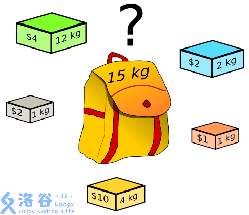

# 01背包

## 简介

01背包是在M件物品取出若干件放在空间为W的背包里，每件物品的体积为W1，W2至Wn，与之相对应的价值为P1,P2至Pn。01背包是背包问题中最简单的问题。01背包的约束条件是给定几种物品，每种物品有且只有一个，并且有权值和体积两个属性。在01背包问题中，因为每种物品只有一个，对于每个物品只需要考虑选与不选两种情况。如果不选择将其放入背包中，则不需要处理。如果选择将其放入背包中，由于不清楚之前放入的物品占据了多大的空间，需要枚举将这个物品放入背包后可能占据背包空间的所有情况。

## 思想

**DP思想**

记一个数组`f[i][j]`，表示当前选完第i件物品，背包已占用空间为j时能取到的最大价值

**决策**

`f[i][j] = max(f[i - 1][j], f[i - 1][j - w[i]] + c[i])`

`f[i][j]`取以下情况中的最大值

- 不取第i件物品。`f[i - 1][j]`

- 取第i件物品`f[i - 1][j - w[i]] + c[i])`

`w[i]`表示i的占用空间
`c[i]`表示i的价值
请思考。

**循环**

i++{j++}


## 知识点

01背包是一种**动态规划**问题。动态规划的核心就是**状态转移方程**。

**问题描述**
01背包问题可描述为如下问题：
有一个容量为V的背包，还有n个物体。现在忽略物体实际几何形状，我们认为只要背包的剩余容量大于等于物体体积，那就可以装进背包里。每个物体都有两个属性，即体积w和价值v。
问：如何向背包装物体才能使背包中物体的总价值最大？

**01背包的状态转移方程**为
f[i][j] = max(f[i - 1][j], f[i - 1][j - w[i]] + v[j])

i代表对i件物体做决策，有两种方式—放入背包和不放入背包。
j表示当前背包剩余的容量。

**转移方程的解释**：
创建一个状态矩阵f，横坐标 i 是物体编号，纵坐标 j 为背包容量。
首先将 f 第0行和第0列初始化为0 （代码里面将整个f初始化为0了，其实只初始化第0行和第0列就够了）。这个表示不放物体时最大价值为0 。（物体编号从1开始）
接下来依次遍历f的每一行。

> 原文链接：[https://blog.csdn.net/Iseno_V/article/details/100001133](https://blog.csdn.net/Iseno_V/article/details/100001133)

---

## 例题 #1

一个旅行者有一个最多能装 M公斤的背包，现在有 n件物品，它们的重量分别是W1，W2，...,Wn,它们的价值分别为C1,C2,...,Cn，求旅行者能获得最大总价值。


贪心反例：

w=90 c=90

w=50 c=49

w=50 c=49

M=100

代码

```C++
#include <bits/stdc++.h>
using namespace std;
int m, n, w[205], c[205], f[205][205];

int main() {
	cin >> m >> n;
	for (int i = 1; i <= n; i++)
		cin >> w[i] >> c[i];
	for (int i = 1; i <= n; i++) {
		for (int j = m; j > 0; j--) {
			if (w[i] <= j)
				f[i][j] = max(f[i - 1][j], f[i - 1][j - w[i]] + c[i]);
			else
				f[i][j] = f[i - 1][j];
		}
	}

	cout << f[n][m];
	return 0;
}
```

## 例题 #2 高维度的01背包

### [USACO03FALL] Cow Exhibition G

奶牛想证明它们是聪明而风趣的。为此，贝西筹备了一个奶牛博览会，她已经对 $N$ 头奶牛进行了面试，确定了每头奶牛的智商和情商。

贝西有权选择让哪些奶牛参加展览。由于负的智商或情商会造成负面效果，所以贝西不希望出展奶牛的智商之和小于零，或情商之和小于零。满足这两个条件下，她希望出展奶牛的智商与情商之和越大越好，请帮助贝西求出这个最大值。

输入格式

第一行：单个整数 $N$，$1 \le N \le 400$。

第二行到第 $N+1$ 行：第 $i+1$ 行有两个整数：$S_i$ 和 $F_i$，表示第 $i$ 头奶牛的智商和情商，− $1000 \le S_i;F_i \le 1000$。

---

我们把两个维度，一个作为背包容量，一个转化为求该维度的最大值即可。

## 例题 #3

> [https://www.luogu.com.cn/problem/P1855](https://www.luogu.com.cn/problem/P1855)
本题在01背包基础上增加了1维度

```C++
#include <bits/stdc++.h>
using namespace std;
const int N = 105;
int n,M,T, m[N],t[N], f[2*N][2*N];

int main() {
	cin >> n>>M>>T;

	for (int i = 1; i <= n; i++) {
		cin >> m[i]>>t[i];
	}

	for(int i=1;i<=n;i++)
		for(int j=M;j>=m[i];j--)
			for(int k=T;k>=t[i];k--){
				f[j][k]=max(f[j][k],f[j-m[i]][k-t[i]]+1);
			}
	cout<<f[M][T];
	return 0;
}
```

`f[][]`存的是还剩下i金钱，j时间时最多能实现的愿望数
慢慢来。
第一次循环时。`f`数组全为0；
在取`f[j][k]=max(f[j][k],f[j-m[i]][k-t[i]]+1);`时，因为`f`全为0，会更新当`f[j][k]`为1，我们不需要记录它实现了哪几个愿望，只需要知道此时可以实现几个愿望。
**分析循环**

- 最外层循环：分别讨论存取第i个愿望时要不要把这个愿望放进去（针对每一个`f[>=M-m[i]][>=T-t[i]]`,即可以把这个愿望放进去的情况，如果这个愿望本来就放不进去，就不需要讨论了>即就是原来的`f[][]`)

- 里面2层循环：可以调换，只是为了把表填满好为后续服务。在`f[>=M-m[i]][>=T-t[i]]`的条件下，不同剩余金钱好剩余时间可以实现的愿望数。

**分析递推式**

```Plain Text
f[j][k]=max(f[j][k],f[j-m[i]][k-t[i]]+1);
```

- 第`i`个梦想

- 金钱为`j`

- 时间为`m`
f[j][k]=max  **(** 如果不取这个愿望时原来可以实现的梦想 **，** 如果要取这个愿望(1+当去掉这个愿望使用的金钱和时间后能实现的愿望的最大值，就是f[j-m[i]][k-t[i]]) **)**

## 练习 #1 消失之物

描述

ftiasch 有 $n$ 个物品, 体积分别是 $w_1,w_2,\dots,w_n$。由于她的疏忽，第 $i$ 个物品丢失了。

“要使用剩下的 $n-1$ 物品装满容积为 $x$ 的背包，有几种方法呢？”——这是经典的问题了。

她把答案记为 $\text{cnt}(i,x)$ ，想要得到所有$i \in [1,n]$, $x \in [1,m]$ 的 $\text{cnt}(i,x)$ 表格。



输入格式

第一行两个整数 $n,m$，表示物品的数量和最大的容积。
第二行 $n$ 个整数 $w_1,w_2,\dots,w_n$，表示每个物品的体积。

输出格式

输出一个 $n \times m$ 的矩阵，表示 $\text{cnt}(i,x)$ 的**末位数字**。

【数据范围】
对于 $100\%$ 的数据，$1\le n,m \le 2000$，且 $1\le v_i\le m$。

【样例解释】
如果物品 3 丢失的话，只有一种方法装满容量是 2 的背包，即选择物品 1 和物品 2。

---

$\text{upd 2023.8.11}$：新增加五组 Hack 数据。

## 01背包拔河问题

[www.luogu.com.cn](https://www.luogu.com.cn/problem/UVA323)


