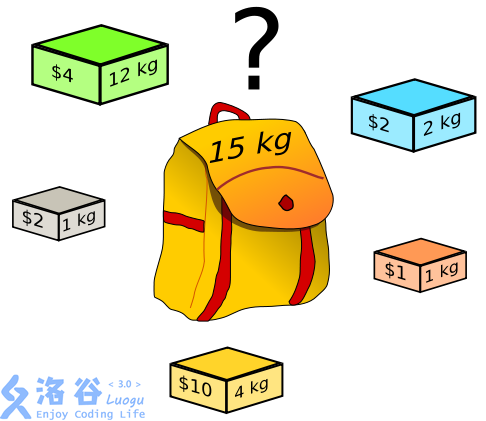

DP | 背包问题

# 目录

- 01背包    1267 【例9.11】01背包问题

- 完全背包    1268 【例9.12】完全背包问题

- 多重  1269 【例9.13】庆功会

- 混合  1270 【例9.14】混合背包

- 二维  1271 【例9.15】潜水员

- 分组  1272 【例9.16】分组背包

- 计数  1273 【例9.17】货币系统

# 补充资料

[https://www.cnblogs.com/ailanxier/p/13370753.html](https://www.cnblogs.com/ailanxier/p/13370753.html)

# 01背包

### 简介

01背包是在M件物品取出若干件放在空间为W的背包里，每件物品的体积为W1，W2至Wn，与之相对应的价值为P1,P2至Pn。01背包是背包问题中最简单的问题。01背包的约束条件是给定几种物品，每种物品有且只有一个，并且有权值和体积两个属性。在01背包问题中，因为每种物品只有一个，对于每个物品只需要考虑选与不选两种情况。如果不选择将其放入背包中，则不需要处理。如果选择将其放入背包中，由于不清楚之前放入的物品占据了多大的空间，需要枚举将这个物品放入背包后可能占据背包空间的所有情况。

### 思想

**DP思想**

记一个数组`f[i][j]`，表示当前选完第i件物品，背包已占用空间为j时能取到的最大价值

**决策**

`f[i][j] = max(f[i - 1][j], f[i - 1][j - w[i]] + c[i])`

`f[i][j]`取以下情况中的最大值

- 不取第i件物品。`f[i - 1][j]`

- 取第i件物品`f[i - 1][j - w[i]] + c[i])`

`w[i]`表示i的占用空间
`c[i]`表示i的价值
请思考。

**循环**

i++{j++}

### 例题

一个旅行者有一个最多能装 M公斤的背包，现在有 n件物品，它们的重量分别是W1，W2，...,Wn,它们的价值分别为C1,C2,...,Cn，求旅行者能获得最大总价值。


贪心反例：

w=90 c=90

w=50 c=49

w=50 c=49

M=100

### 代码

```C++
#include <bits/stdc++.h>
using namespace std;
int m, n, w[205], c[205], f[205][205];

int main() {
	cin >> m >> n;
	for (int i = 1; i <= n; i++)
		cin >> w[i] >> c[i];
	for (int i = 1; i <= n; i++) {
		for (int j = m; j > 0; j--) {
			if (w[i] <= j)
				f[i][j] = max(f[i - 1][j], f[i - 1][j - w[i]] + c[i]);
			else
				f[i][j] = f[i - 1][j];
		}
	}

	cout << f[n][m];
	return 0;
}
```

## 高维度的01背包

### [USACO03FALL] Cow Exhibition G

奶牛想证明它们是聪明而风趣的。为此，贝西筹备了一个奶牛博览会，她已经对 $N$ 头奶牛进行了面试，确定了每头奶牛的智商和情商。

贝西有权选择让哪些奶牛参加展览。由于负的智商或情商会造成负面效果，所以贝西不希望出展奶牛的智商之和小于零，或情商之和小于零。满足这两个条件下，她希望出展奶牛的智商与情商之和越大越好，请帮助贝西求出这个最大值。

输入格式

第一行：单个整数 $N$，$1 \le N \le 400$。

第二行到第 $N+1$ 行：第 $i+1$ 行有两个整数：$S_i$ 和 $F_i$，表示第 $i$ 头奶牛的智商和情商，− $1000 \le S_i;F_i \le 1000$。

---

我们把两个维度，一个作为背包容量，一个转化为求该维度的最大值即可。

# 消失之物

## 题目描述

ftiasch 有 $n$ 个物品, 体积分别是 $w_1,w_2,\dots,w_n$。由于她的疏忽，第 $i$ 个物品丢失了。

“要使用剩下的 $n-1$ 物品装满容积为 $x$ 的背包，有几种方法呢？”——这是经典的问题了。

她把答案记为 $\text{cnt}(i,x)$ ，想要得到所有$i \in [1,n]$, $x \in [1,m]$ 的 $\text{cnt}(i,x)$ 表格。



## 输入格式

第一行两个整数 $n,m$，表示物品的数量和最大的容积。
第二行 $n$ 个整数 $w_1,w_2,\dots,w_n$，表示每个物品的体积。

## 输出格式

输出一个 $n \times m$ 的矩阵，表示 $\text{cnt}(i,x)$ 的**末位数字**。

## 样例 #1

### 样例输入 #1

```C++
3 2
1 1 2
```

### 样例输出 #1

```C++
11
11
21
```

## 提示

【数据范围】
对于 $100\%$ 的数据，$1\le n,m \le 2000$，且 $1\le v_i\le m$。

【样例解释】
如果物品 3 丢失的话，只有一种方法装满容量是 2 的背包，即选择物品 1 和物品 2。

---

$\text{upd 2023.8.11}$：新增加五组 Hack 数据。

# 完全背包

### 简介

**题目**
有N种物品和一个容量为V的背包，每种物品都有无限件可用。
第i种物品的体积是c，价值是w。求解将哪些物品装入背包可使这些物品的体积总和不超过背包容量，且价值总和最大。

**基本思路**

这个问题非常类似于01背包问题，所不同的是每种物品有无限件，也就是从每种物品的角度考虑，与它相关的策略已并非取或不取两种，而是有取0件、取1件、取2件……取[V/c]件等很多种。如果仍然按照解01背包时的思路，令f[v]表示前i种物品恰放入一个容量为v的背包的最大权值。仍然可以按照每种物品不同的策略写出状态转移方程，像这样：

```Plain Text
f[j]=max{f[j],f[j-k*c]+k*w}（0<=k*c<=v）
```

这跟01背包问题一样有$O(N*V)$个状态需要求解，但求解每个状态f[v]的时间是$O(V/c)$，总的复杂度是超过$O(VN)$的。
将01背包问题的基本思路加以改进，得到了这样一个清晰的方法。这说明01背包问题的状态转移方程可以推及其它类型的背包问题。但是由于复杂度太高，我们还是试图改进这个复杂度。

**简单有效优化**

完全背包问题有一个很简单有效的优化，是这样的：若两件物品i、j满足`c[i]<=c[j]`且`w[i]>=w[j]`，则将物品j去掉，不用考虑。这个优化的正确性显然：任何情况下都可将价值小费用高得j换成物美价廉的i，得到至少不会更差的方案。对于随机生成的数据，这个方法往往会大大减少物品的件数，从而加快速度。然而这个并不能改善最坏情况的复杂度，因为有可能特别设计的数据可以一件物品也去不掉。这个优化可以简单的$O(N^2)$地实现，一般都可以承受。
另外，针对背包问题而言，比较不错的一种方法是：首先将费用大于V的物品去掉，然后使用类似计数排序的做法，计算出费用相同的物品中价值最高的是哪个，可以$O(V+N)$地完成这个优化。这个不太重要的过程就不给出伪代码了，希望你能独立思考写出伪代码或程序。
既然01背包问题是最基本的背包问题，那么我们可以考虑把完全背包问题转化为01背包问题来解。最简单的想法是，考虑到第i种物品最多选V/c件，于是可以把第i种物品转化为V/c件费用为c[I]及价值w[I]的物品，然后求解这个01背包问题。这样完全没有改进基本思路的时间复杂度，但这毕竟给了我们将完全背包问题转化为01背包问题的思路：将一种物品拆成多件物品。
更高效的转化方法是：把第i种物品拆成费用为$c*2^k$、价值为$w*2^k$的若干件物品，其中k满足$0<=k<=\log_2(V/c)+1$。这是二进制的思想，因为不管最优策略选几件第i种物品，总可以表示成若干个$2^k$件物品的和。这样把每种物品拆成$O(log_2(V/c))$件物品，是一个很大的改进。

**最优解法**

```C++
for i=1..N
    for j=c..V
        f[j]=max{f[j],f[j-c]+w}
```

你会发现，这个伪代码与01背包的伪代码只有v的循环次序不同而已。为什么这样一改就可行呢？
首先想想为什么**01背包中要按照v=V..0的逆序来循环。这是因为要保证第i次循环中的状态f[v]是由状态f[v-c]递推而来。换句话说，这正是为了保证每件物品只选一次，保证在考虑“选入第i件物品”这件策略时，依据的是一个没有已经选入第i件物品的子结果f[v-c]**。
而当前**完全背包的特点恰是每种物品可选无限件，所以在考虑“加选一件第i种物品”这种策略时，却正需要一个可能已选入第i种物品的子结果f[v-c]，所以就可以并且必须采用v=0..V的顺序循环**。这就是这个简单的程序为何成立的道理。
这个算法也可以以另外的思路得出。例如，基本思路中的状态转移方程可以等价地变形成这种形式：

```Plain Text
f[j]=max{f[j],f[j-c]+w}
```

将这个方程用一维数组实现，便得到了上面的伪代码。
最后抽象出处理一件完全背包类物品的过程伪代码，以后会用到：

```Plain Text
procedure CompletePack(c,w)
    for j=c..V
        f[j]=max{f[j],f[j-c]+w}
```

### 思想

类似01背包，只不过多一层循环，枚举第i件物品取k份`(k=1,k++,j-k*w[i]>=0)`

### 注意

观察`f[i][j]`中保存的信息，我们可以把k循环去掉，请思考！

### 例题

设有n
种物品，每种物品有一个重量及一个价值。但每种物品的数量是无限的，同时有一个背包，最大载重量为M
，今从n
种物品中选取若干件(同一种物品可以多次选取)，使其重量的和小于等于M
，而价值的和为最大。

### 解决

```C++
#include <bits/stdc++.h>
using namespace std;
int m, n, w[205], c[205], f[205][205];

int main() {
	cin >> m >> n;
	for (int i = 1; i <= n; i++)
		cin >> w[i] >> c[i];
	for (int i = 1; i <= n; i++) {
		for (int j = 1; j <= m; j++) {
			if (j < w[i])
				f[i][j] = f[i - 1][j];

			else if (f[i - 1][j] > f[i][j - w[i]] + c[i])
				f[i][j] = f[i - 1][j];
			else
				f[i][j] = f[i][j - w[i]] + c[i];
		}
	}

	cout << "max=" << f[n][m];
	return 0;
}
```

# 多重背包

### 思想

类似完全背包，只不过k循环，枚举第i件物品取k份的条件改变了

### 注意

观察`f[i][j]`中保存的信息和题目，我们**不可以**把k循环去掉，请思考！

### 例题

第一行二个数n(n≤500)，m(m≤6000)，其中n代表希望购买的奖品的种数，m表示拨款金额。

接下来n行，每行3个数，v、w、s，分别表示第I种奖品的价格、价值（价格与价值是不同的概念）和能购买的最大数量（买0件到s件均可），其中v≤100，w≤1000，s≤10。
求此次购买能获得的最大的价值（注意！不是价格）。

### 解决

```C++
#include <bits/stdc++.h>
using namespace std;
int m, n, w[10005], c[10005], f[10005], s[10005];

int main() {
	cin >> n >> m ;
	for (int i = 1; i <= n; i++)
		cin >> c[i] >> w[i] >> s[i];
	for (int i = 1; i <= n; i++) {
		for (int j = m; j >= 0; j--)
			for (int k = 0; k <= s[i]; k++) {
				if (j - k * c[i] < 0)
					break;
				f[j] = max(f[j], f[j - k * c[i]] + k * w[i]);
			}
	}

	cout << f[m];
	return 0;
}
```

# [BalticOI 2022 Day1] Uplifting Excursion

## 题目描述

有 $2m+1$ 种物品，重量分别为 $-m,-m+1,\ldots, m-1,m$。重量为 $i$ 的物品有 $a_i$ 个。

你需要拿走若干物品，使得这些物品重量之和恰好为 $l$。在此基础上，你需要拿尽可能多的物品。

问在物品重量之和恰好为 $l$ 的基础上，你最多能拿多少物品。

## 思路

我们考虑这道题，应该就是一道背包的题目.但是同时我们发现，有一些物品的重量是可以抵消的，所以我们应该先选中这些物品。

好了，现在我们还有一些物品，以及一个需要被填满的，容量为l的且当前为空的背包。这里我们关注到一点，就是我们刚才的贪心枚举其实不一定正确——为了这里我们恰好填满容量为l的背包，我们可能不得不从用来抵消背包容量的物品（即重量为负的物品）中剔除一部分，以便于我们可以达到l的总重量。

我们发现，l实在是太大了，所以我们还可以继续地多拿一些物品。事实上，因为我们的l太大了，我们应该考虑如何减小这个值域。

为了避免分类讨论，我们可以在一开始就把所有物品取下，设所有物品的重量和为s，若s>l，那么我们每次选中最大的数删除，直到s≤l。这里我们注意到每个物品的价值都是1，所以这样的贪心是正确的。

若s<l，那么我们就从最小的开始删除即可，直到再删可能导致s>l为止。

操作完后我们发现，现在背包还剩余的空间是<m的！现在我们看似就可以进行背包了。我们要考虑反悔操作。

我们给已经选择的物品赋负重量和负价值，没有选择的物品直接加入，然后跑多重背包即可。

## 代码

这里我们狠狠地指出，要弄明白偏移量和边界。（调了2小时）

```C++
/*                                                                                
                      Keyblinds Guide
     				###################
      @Ntsc 2024

      - Ctrl+Alt+G then P : Enter luogu problem details
      - Ctrl+Alt+B : Run all cases in CPH
      - ctrl+D : choose this and dump to the next
      - ctrl+Shift+L : choose all like this
	  
*/
#include <bits/stdc++.h>
#include <queue>
using namespace std;

#define rep(i, l, r) for (int i = l, END##i = r; i <= END##i; ++i)
#define per(i, r, l) for (int i = r, END##i = l; i >= END##i; --i)
#define pb push_back
#define mp make_pair
#define int long long
#define pii pair<int, int>
#define ps second
#define pf first

// #define innt int
// #define inr int
// #define mian main
// #define iont int

#define rd read()
int read(){
    int xx = 0, ff = 1;
    char ch = getchar();
    while (ch < '0' || ch > '9') {
		if (ch == '-')
			ff = -1;
		ch = getchar();
    }
    while (ch >= '0' && ch <= '9')
      xx = xx * 10 + (ch - '0'), ch = getchar();
    return xx * ff;
}
void write(int out) {
	if (out < 0)
		putchar('-'), out = -out;
	if (out > 9)
		write(out / 10);
	putchar(out % 10 + '0');
}

const char el='\n';
const bool enable_dbg = 0;
template <typename T,typename... Args>
void dbg(T s,Args... args) {
	if constexpr (enable_dbg){
    cerr << s << ' ';
		if constexpr (sizeof...(Args))
			dbg(args...);
	}
}

const int N = 3e5 + 5;
const int INF = 1e18;
const int M = 1e5;
const int MOD = 1e9 + 7;


int used[N];
struct node{
    int w,v;
}o[N];
int ans,f[2][N],cnt;
int n,m,l,a[N];
int sum;

void ins(int x){
    int b=1;
    int cur=a[x]-used[x],w=x-m;
    dbg(x,cur);
    while(cur){
        if(b>cur)b=cur;//注意，只需要一次2^k，剩下的直接原数加入，不需要再二进制分解
        o[++cnt]={w*b,b};
        cur-=b;
        b<<=1;
    }
    cur=used[x];
    b=1;
    while(cur){
        if(b>cur)b=cur;
        o[++cnt]={-w*b,-b};
        cur-=b;
        b<<=1;
    }
}

void solve(){
    m=rd,l=rd;
    for(int i=0;i<=m*2;i++){
        a[i]=rd;
        if(i>m)continue;
        sum+=a[i]*(i-m);
        used[i]=a[i];
        ans+=a[i];
    }
    for(int i=m+1;i<=2*m;i++){//优先加入小的
        int num=min((l-sum)/(i-m),a[i]);
        used[i]=num;
        ans+=num;
        sum+=num*(i-m);
    }
    for(int i=0;i<m;i++){//优先删小的,0不需要考虑
        int num=min((l-sum)/(m-i),a[i]);
        used[i]-=num;
        ans-=num;
        sum-=num*(i-m);
    }
    if(l-sum>m){
        puts("impossible");
        return ;
    }

    dbg("ok");

    for(int i=0;i<=2*m;i++){
        if(i==m)continue;
        ins(i);
    }
    // dbg("ok");

    //WA below

    // memset(f,-0x3f,sizeof f);
    // f[0][M]=0;
    // for(int i=1;i<=cnt;i++){
    //     for(int j=M+m;j>=M-m;j--){
    //         f[i&1][j]=f[i&1^1][j];
    //         if(j>=o[i].w && j - o[i].w < N)
    //             f[i&1][j]=max(f[i&1][j],f[i&1^1][j-o[i].w]+o[i].v);
    //     }
    // }

	memset(f, -0x3f, sizeof f);
	f[0][M] = 0;
	for (int i=1;i<=cnt;i++){
		for (int j=M+m*m;j>=0;j--)//注意边界（调了2hrs TT）
		{
			f[i&1][j]=f[(i-1)&1][j];
			if(j>=o[i].w&&j-o[i].w<=M+m*m)f[i&1][j]=max(f[i&1][j],f[(i-1)&1][j-o[i].w]+o[i].v);
		}
    }
		
    if(f[cnt&1][l-sum+M]+ans<0)puts("impossible");
    else cout<<f[cnt&1][l-sum+M]+ans<<endl;


}   

signed main() {
    int T=1;
    while(T--){
    	solve();
    }
    return 0;
}
```

## 输入格式

第一行两个数 $m,l$。

第二行 $2m+1$ 个数，分别为 $a_{-m},a_{-m+1},\ldots, a_{m-1},a_m$。

## 输出格式

一行一个数表示答案。若不存在方案，输出 `impossible`

## 样例 #1

### 样例输入 #1

```C++
2 5
2 3 1 1 4
```

### 样例输出 #1

```C++
9
```

## 样例 #2

### 样例输入 #2

```C++
3 5
3 1 0 2 0 0 2
```

### 样例输出 #2

```C++
impossible
```

## 提示

子任务 $1$ ($5$ 分)：$m , a_i≤50$

子任务 $2$ ($15$ 分)：$m , a_i≤100$。

子任务 $3$ ($20$ 分)：$m≤30$。

子任务 $4$ ($20$ 分)：$m ≤50$。

子任务 $5$ ($20$ 分)：$m ≤ 100$。

子任务 $6$ ($20$ 分)：没有特殊限制。

对于子任务 $3$ 到子任务 $6$，如果通过 $\forall i<0,a_i=0$ 的测试点，可以获得一半的得分。

对于所有数据，满足 $1\leq m \leq 300$，$-10^{18}\le l \le 10^{18}$，$0\le a_i\le 10^{12}$。

# 利用特殊性质实现背包的多次求解

> 「雅礼集训 2017 Day5」珠宝 /「NAIPC2016」Jewel Thief

给点01背包模型，当要求背包容量在1\sim k时的最大价值。

n≤1e6,k≤5e4,v_i≤300

## 思路

这里我们转移到物品的体积有很多是相同的。那么对于相同体积的物品，我们肯定是优先选择价值大的。现在的问题貌似就变成了一个不完全的多重背包了。

所以我们可以就按照多重背包来写，定义f_{i,j} 为在已经考虑了前i种物品，且背包占用体积为j时的最大价值

我们有转移

f_{i,j}=\max(f_{i-1,j-v_ik}+w(i,k))，其中w(i,k)为第i类物品（同一类物品即体积相等的物品）拿k个的最大价值，即贪心选择其中价值前k大的物品的价值和。

压维可以写成f_{j}=\max(f_{v-v_ik}+w(i,k))

那么应用决策单调性，首先我们得找到满足四边形不等式。那么我们只能从价值函数中看看了

首先我们的w(i,k)，我们对于每一个i都写成一个数组w_{i,k}，省略i维，那么其实就是一个一维的数组w_k。但是这样我们就不满足四边形不等式了。回顾[DP | 区间dp](https://flowus.cn/c4d1774a-cad8-4f38-bf80-bd441a35312c)中四边形不等式的条件。

那么我们怎么办？考虑**把一维的函数变为二维。**我们变换函数w_k为w'_{j-k,j}，映射关系为f:w'_{i,j}→w_{j-i}。好了，接下来验证四边形不等式条件：交叉优于包含。

因为我们验证交叉优于包含的两种情况中的两个区间的长度和是一样的，也是转化回w数组，就变成了

- 交叉：w_i+w_j

- 包含：w_l+w_r，其中i+j=l+r,l<i,r>j。

那么很显然，w_i+w_j>w_l+w_r。

回到转移式，我们的决策点即k，那么现在j-k是单调的，转移也就单调了。

## 代码


