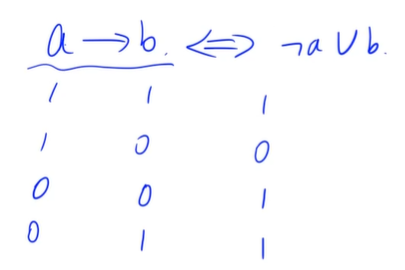
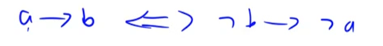
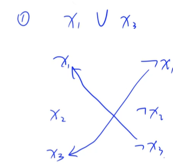
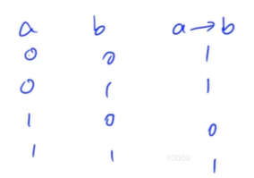

摘抄[学习笔记 | 2-SAT](https://flowus.cn/602583fc-c202-4748-92b3-b54631b6f5bb)

---

# 2-SAT

## 例题 #1

题目描述

有 $n$ 个布尔变量 $x_1\sim x_n$，另有 $m$ 个需要满足的条件，每个条件的形式都是 「$x_i$ 为 `true` / `false` 或 $x_j$ 为 `true` / `false`」。比如 「$x_1$ 为真或 $x_3$ 为假」、「$x_7$ 为假或 $x_2$ 为假」。

2-SAT 问题的目标是给每个变量赋值使得所有条件得到满足。

输入格式

第一行两个整数 $n$ 和 $m$，意义如题面所述。

接下来 $m$ 行每行 $4$ 个整数 $i$, $a$, $j$, $b$，表示 「$x_i$ 为 $a$ 或 $x_j$ 为 $b$」($a, b\in \{0,1\}$)

输出格式

如无解，输出 `IMPOSSIBLE`；否则输出 `POSSIBLE`。

下一行 $n$ 个整数 $x_1\sim x_n$（$x_i\in\{0,1\}$），表示构造出的解。

$1\leq n, m\leq 10^6$ , 前 $3$ 个点卡小错误，后面 $5$ 个点卡效率。

由于数据随机生成，可能会含有（ 10 0 10 0）之类的坑，但按照最常规写法的写的标程没有出错，各个数据点卡什么的提示在标程里。

## 2-SAT

SAT问题，即给出若干个与x_n有关的命题，命题内部只有或，总命题为这些命题相与。求出一组x_n使得总命题为true。是NPC问题。

2-SAT问题，即每个命题内部只有两个变量x_i,x_j。我们要判断并给出解。不是NPC问题。



注意a=0时的特殊情况



把2-SAT转化为图如图（一个命题→两条有向边）

-x_1→x_3表示如果x_1=0，那么x_3一定为1，即表示一种推导关系。

那么我们把问题中所有的命题都转化为同一幅图中的有向边后，就会发现几组推导关系。那么此时我们只需要判断是否存在某个x_i从x_i可以推导到-x_i**并且**-x_i可以推导到x_i。如果存在，则不成立。

这其实是强连通分量的关系。可以类比noip2023T2三值逻辑。

给出解的方法：

确保有解后，我们执行缩点，然后进行topo排序。对于x_i，如果x_i的topo序更靠后，那么x_i=1，反之x_i=0

实现中，我们可以用缩点后每个点的scc编号来代替topo序。

为什么这样不会有冲突呢？

首先如果存在块包含a,-b,c，那么一定存在块包含-a,b,-c。即每个块都存在与之相反的完全相同的块。



题型可以会给出3种关系

- x_i\^x_j（^为逻辑与），这种就是我们上面讨论的，可以转化为-x_i→x_j,-x_j→x_i

- x_i→x_j，那么就是-x_i\^x_j

- x_i=1，那么就是x_i\^x_i

- x_i=0，就是-x_i\^-x_i

注意！文章中的`→`是一个二元关系符号，而不是日常中的“推出”。可以理解为“能推出”，它表示两个值之间的关系。真值表如下


    

---

acwing:TLE

luogu:AC

```C++
/*
Edit by Ntsc.
*/

#include<bits/stdc++.h>
using namespace std;
#define int long long
#define ull unsigned long long
#define pii pair<int, int>
#define pf first
#define ps second

#define rd read()
#define ot write
#define nl putchar('\n')
inline int rd{
	int xx=0,ff=1;
	char ch=getchar();
	while(ch<'0'||ch>'9') {if(ch=='-') ff=-1;ch=getchar();}
	while(ch>='0'&&ch<='9') xx=xx*10+(ch-'0'),ch=getchar();
	return xx*ff;
}
inline void write(int out){
	if(out<0) putchar('-'),out=-out;
	if(out>9) write(out/10);
	putchar(out%10+'0');
}

const int N=4e6+5;
const int M=5e4+5;
const int INF=2e18+5;
const int MOD=1e9+7;
const int BASE=17737;
bool f1;
int dfn[N],low[N],stk[N],tot,top,cnt,scc[N],siz[N],sccw[N],w[N],dis[N],vis[N];
int n,m,way[N][2],instk[N],s,np,p[N],ans;
vector <int> e[N];
vector<int>e2[N];
int f[N];

bool f2;


void add(int a,int b){
	e[a].push_back(b);
}
void add2(int a,int b){
	e2[a].push_back(b);
}

void tarjan(int x){//强连通分量缩点
	//入x时,时间戳追溯值更新,入栈
	dfn[x]=low[x]=++tot;
	stk[++top]=x;instk[x]=1; 
	
	for(int i=0;i<e[x].size();i++){//枚举x的邻点y 
		int y=e[x][i];
		if(!dfn[y]){//如果y还没有访问过 
			tarjan(y);//向下走 
			low[x]=min(low[x],low[y]);//返回时更新 
		}else if(dfn[y]&&instk[y]){//说明 y被访问过 ->要么y是祖先(在x出通过返祖边访问到了),要么是左子树的点(在x通过横插边访问到了) 
			low[x]=min(low[x],dfn[y]); 
		}
	}
	if(dfn[x]==low[x]){//说明x是这个强连通分量的根 
		int flag=0;
		int y;++cnt;
		do{
			flag++;
			y=stk[top--];instk[y]=0;
			scc[y]=cnt;
			++siz[cnt];
			sccw[cnt]+=w[y];//记录缩点后强连通分量点的点权
		} while(y!=x); 
	}
}


signed main(){

	// ios::sync_with_stdio(0);
	// cin.tie(0);cout.tie(0);
	n=rd,m=rd;
	for(int ii=1;ii<=m;ii++){
		int i=rd,a=rd,j=rd,b=rd;
		i--,j--;
		add(i*2+!a,j*2+b);
		add(j*2+!b,i*2+a);
	}

	for(int i=0;i<n*2;i++)if(!dfn[i])tarjan(i);
	for(int i=0;i<n;i++){
		if(scc[i*2]==scc[i*2+1]){
			printf("IMPOSSIBLE\n");
			return 0;
		}
	}

	printf("POSSIBLE\n");

	for(int i=0;i<n;i++){
		if(scc[i*2]<scc[i*2+1])printf("0 ");
		else printf("1 ");
	}

}
```

## 例题 #2 [NOI2017] 游戏

题目背景

狂野飙车是小 L 最喜欢的游戏。与其他业余玩家不同的是，小 L 在玩游戏之余，还精于研究游戏的设计，因此他有着与众不同的游戏策略。

题目描述

小 L 计划进行 $n$ 场游戏，每场游戏使用一张地图，小 L 会选择一辆车在该地图上完成游戏。

小 L 的赛车有三辆，分别用大写字母 $A$、$B$、$C$ 表示。地图一共有四种，分别用小写字母 $x$、$a$、$b$、$c$ 表示。

其中，赛车 $A$ 不适合在地图 $a$ 上使用，赛车 $B$ 不适合在地图 $b$ 上使用，赛车 $C$ 不适合在地图 $c$ 上使用，而地图 $x$ 则适合所有赛车参加。

适合所有赛车参加的地图并不多见，最多只会有 $d$ 张。

$n$ 场游戏的地图可以用一个小写字母组成的字符串描述。例如：$S=\texttt{xaabxcbc}$ 表示小L计划进行 $8$ 场游戏，其中第 $1$ 场和第 $5$ 场的地图类型是 $x$，适合所有赛车，第 $2$ 场和第 $3$ 场的地图是 $a$，不适合赛车 $A$，第 $4$ 场和第 $7$ 场的地图是 $b$，不适合赛车 $B$，第 $6$ 场和第 $8$ 场的地图是 $c$，不适合赛车 $C$。

小 L 对游戏有一些特殊的要求，这些要求可以用四元组 $(i, h_i, j, h_j)$ 来描述，表示若在第 $i$ 场使用型号为 $h_i$ 的车子，则第 $j$ 场游戏要使用型号为 $h_j$ 的车子。

你能帮小 L 选择每场游戏使用的赛车吗？如果有多种方案，输出任意一种方案。

如果无解，输出 `-1`。

### 思路

如果没有地图x，那么就是2-SAT模板。那么我们就需要把x也转化为类似a,b,c的形式。

那么如果对于某个x，我们选择A，我们可以说它“不选B”（我们不需要明确地说出我们选了什么，只要在可选范围内包含了选的那个值即可，因为x事实上可以选任意，我们只不过把它拆成几种情况）

如果选择B，我们可以说“不选A”，如果选择C，我们可以说“不选A”与“不选B”

即考虑x地图，考虑到只有8张x地图，如果假设它也只适合两种赛车，那么暴力枚举每个x地图不适合赛车A或不适合赛车B（因为不适合赛车A就是适合赛车BC，不适合赛车B就是适合赛车AC，这样就包含了ABC三种赛车），这样每种地图就都只适合两种赛车了。判断时，如果已经枚举遍了所有的2d种状态都是无解，则原问题无解，否则输出任意一种方案。

那么此时我们暴力枚举一下某个x是“不选A”还是“不选B”即可。

---

```C++
/*
Edit by Ntsc.
*/

#include<bits/stdc++.h>
using namespace std;
#define int long long
#define ull unsigned long long
#define pii pair<int, int>
#define pf first
#define ps second
#define rep(i, a, b) for(int i = a; i <= b; ++i)
#define per(i, a, b) for(int i = a; i >= b; --i)

#define rd read()
#define ot write
#define nl putchar('\n')
inline int rd{
	int xx=0,ff=1;
	char ch=getchar();
	while(ch<'0'||ch>'9') {if(ch=='-') ff=-1;ch=getchar();}
	while(ch>='0'&&ch<='9') xx=xx*10+(ch-'0'),ch=getchar();
	return xx*ff;
}
inline void write(int out){
	if(out<0) putchar('-'),out=-out;
	if(out>9) write(out/10);
	putchar(out%10+'0');
}

const int N = 2e5 + 5;
const int INF=2e18+5;
const int MOD=1e9+7;
const int BASE=17737;

int n, d, y[N], x[N], m, cntx, dfn[N], low[N], ins[N], stk[N], top, cnt, idx;
int to[N << 1], nxt[N << 1], head[N], tot, scc[N], pos[N];
char c[N], a[N], b[N], res[N];
inline void add(int x, int y) { 
	to[++tot] = y; nxt[tot] = head[x]; 
	head[x] = tot; 
}
void init() {
    memset(head, 0,sizeof head); 
	memset(dfn, 0,sizeof dfn); 
    memset(low, 0,sizeof low); 
	memset(ins, 0,sizeof ins); 
	memset(stk, 0,sizeof stk);
	while(top)stk[top--]=0;
	memset(scc, 0,sizeof scc); 
	memset(nxt, 0,sizeof nxt);
	tot = idx = cnt = top = 0;
}
void tarjan(int x) {
    dfn[x] = low[x] = ++idx;
    ins[x] = 1;
    stk[++top] = x;
    for(int i = head[x]; i; i = nxt[i]) {
        int y = to[i];
        if(!dfn[y]) {
            tarjan(y);
            low[x] = min(low[x], low[y]);
        } else if(ins[y]) 
            low[x] = min(low[x], dfn[y]);
    }
    if(low[x] == dfn[x]) {
        ++cnt;
		int y;
        while(top) {
			y=stk[top];
            scc[y] = cnt;
            ins[y] = 0;
			stk[top--]=0;
            if(y == x) break;
        }
    }
}


bool check() {
    rep(i, 1, (n << 1)) 
        if(!dfn[i]) tarjan(i);
    rep(i, 1, n) {
        if(scc[i] == scc[i + n]) return false;
        if(scc[i] < scc[n + i]) res[i] = (c[i] == 'A') ? 'B' : 'A';
        else res[i] = (c[i] == 'C') ? 'B' : 'C';
    }
    rep(i, 1, n) printf("%c", res[i]); 
    return true;
}
void solve() {
    rep(i, 0, (1 << d) - 1) { 
        init();
        rep(j, 1, d) c[pos[j]] = (i & (1 << (j - 1))) ? 'A' : 'B';  
        rep(j, 1, m) {
            if(a[j] == c[x[j]]) continue;
            if(b[j] == c[y[j]]) {
                if(a[j] == 'C' || (a[j] == 'B' && c[x[j]] == 'C')) 
                    add(x[j] + n, x[j]);
                else add(x[j], x[j] + n);
                continue;
            }
            int add1 , add2;
            if(a[j] == 'C' || (a[j] == 'B' && c[x[j]] == 'C')) add1 = n;
            else add1 = 0;
            if(b[j] == 'C' || (b[j] == 'B' && c[y[j]] == 'C')) add2 = n;
            else add2 = 0;
            add(x[j] + add1, y[j] + add2);  
            add(y[j] - add2 + n, x[j] - add1 + n); 
        }
        if(check()) exit(0);
    }
    printf("-1");
    return;
}
signed main() {
    n = rd, d = rd;
    scanf("%s", (c + 1)); m = rd;
    rep(i, 1, m) {
		scanf("%d %c %d %c", &x[i], &a[i], &y[i], &b[i]);
	}
    rep(i, 1, n) {
		if((c[i] -= 32) && c[i] == 'X'){
			pos[++cntx] = i;
		}
	} 
	
    solve();
    return 0;
}
```

### 数据范围

|测试点编号|$n$|$d$|$m$|其他性质|
|-|-|-|-|-|
|$1$|$\le 2$|$0$|$\le 4$|无|
|$2$|$\le 2$|$\le n$|$\le 4$|无|
|$3$|$\le 5$|$0$|$\le 10$|无|
|$4$|$\le 5$|$\le n$|$\le 10$|无|
|$5$|$\le 10$|$0$|$\le 20$|无|
|$6$|$\le 10$|$\le 8$|$\le 20$|无|
|$7$|$\le 20$|$0$|$\le 40$|$S$ 中只包含 $c$|
|$8$|$\le 20$|$0$|$\le 40$|无|
|$9$|$\le 20$|$\le 8$|$\le 40$|$S$ 中只包含 $x$ 或 $c$|
|$10$|$\le 20$|$\le 8$|$\le 40$|无|
|$11$|$\le 100$|$0$|$\le 200$|$S$ 中只包含 $c$|
|$12$|$\le 100$|$0$|$\le 200$|无|
|$13$|$\le 100$|$\le 8$|$\le 200$|$S$ 中只包含 $x$ 或 $c$|
|$14$|$\le 100$|$\le 8$|$\le 200$|无|
|$15$|$\le 5\times 10^3$|$0$|$\le 10^4$|无|
|$16$|$\le 5\times 10^3$|$\le 8$|$\le 10^4$|$S$ 中只包含 $x$ 或 $c$|
|$17$|$\le 5\times 10^3$|$\le 8$|$\le 10^4$|无|
|$18$|$\le 5\times 10^4$|$0$|$\le 10^5$|无|
|$19$|$\le 5\times 10^4$|$\le 8$|$\le 10^5$|$S$ 中只包含 $x$ 或 $c$|
|$20$|$\le 5\times 10^4$|$\le 8$|$\le 10^5$|无|

