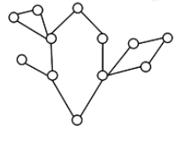

# 圆方树&仙人掌

[www.luogu.com.cn](https://www.luogu.com.cn/training/8174)

## 例题 #1

小L将取下一段永恒之树的树枝。

这里，我们将一段树枝抽象成一张N个点，M条边的无向图，满足每条边都只在**至多一个简单环**中出现。

小L 将对取下的树枝使用分解魔法，此后，树枝的每一个节点都会在一个时辰内随机的一个时刻，连同其连出去的边一起被分解。

在被分解的瞬间，每个节点会释放出等同于当时还与其连通的节点数量的能量，将这些能量求和就是X国的气运。

现在，小L想要知道，X国的气运期望会是多少。请求出X国气运的期望对998244353取模的结果。

## 仙人掌

**定义**

一张N个点，M条边的无向图，满足每条边都只在**至多一个简单环**中出现。



一定要保证环之间没有公共边

## 例题 #2

给你一个有 $n$ 个点和 $m$ 条边的仙人掌图，和 $q$ 组询问
每次询问两个点 $u,v$，求两点之间的最短路。

**数据范围：**
$1\le n,q \le 10000
$$1\le m \le 20000
$$1\le w \le 10^5$

请注意时限为 $300\text{ms}$

**注意：**

本题n很大，不能用普通最短路做法！

由于仙人掌既有树的性质，但由于基环树有区别。如果是基环树的话，我们可以考虑断边，然后通过求出每个点的深度和lca(u,v)来快速求出u,v之间的距离。

但是仙人掌上有不止一个环，所以我们用不了这种方法。所以我们考虑将图用某种方法变成一棵树（我们可以好好利用环与环之间互相独立这个性质！）

## 圆方树

**定义**


割点：图中的点5,3,8是割点。


我们来仔细考虑怎么将环变成菊花图


红色点作为割点，其它边我们省略，只留下一个环。那么其作为圆方树就应该是右边这样。方点到其他点的距离代表着红色割点在环上到其他点的最短距离。如果一个环有不止一个割点，那么我们只选择第一个，即从1号点开始访问时访问到这个环的第一个割点。

注意，仙人掌是无向带环图，转化为圆方树后变成了一幅 DAG。

**构建**

我们可以使用 Tarjan 算法。

**问题解决**


我们重点考虑情况(2)，在上上图中，我们假如要求dis(6,9)，那么在原图上很容易发现是9→8→5→7→6，dis=2+2+2+1=7。但是在圆方图上，5→6,9→8路径都没有问题，但是lca(6,9)在圆方图上变成了一个方点，即其lca在一个环树。感性来想，一个环上所有点的深度可以认为是一样的，所以6,9有2个lca，分别为5,8。所以我们应该求出5→8之间的距离。但是在同一个环内求距离，我们就不能在圆方图上做了，只能在原图上做，否则会出错。


具体做法是，我们发现方点到5,8的距离实际上代表了割点（样例中为3）到两个点的最短距离。那么我们就可以借助环长信息来求出距离了。具体实现请思考。


实际上就是我们从割点开始**有向地**访问每一个环上的点，如同中$s_a=a,s_b=a+b$，那么点a,b之间的距离可能是b或者a+c，我们求出$len1=abs(s_a-s_b)$，$len2=$环长$-len1$，然后取$\min(len1,len2)$ 即可

**代码实现**

注意这里我们需要建2幅图，一幅为原图，用来跑tarjan求出第2幅图，即圆方图。注意tarjan要建反向边，要用邻接表。并且lca应该在圆方图上跑而不是在原图上跑。


建立菊花图


```C++
void build(int u,int v,int w){
	int sum=w;
	for(int k=v;k!=u;k=fa[k]){//遍历环上每一个点更新环的大小
		sum+=fw[k];
	}
	s[u]=sz[u]=sum;
	add2(u,+/建方点
	for(int k=v;k!=u;k=fa[k]){//遍历环上每一个点更新 点上记录的 环的大小
		sc[k]=sum;
		add2(cnt2,k,min(s[k],sum-s[k]));//建菊花点
	}
}
```

Tarjan部分【难点】

```C++

void tarjan(int u,int ine){//ine为入边编号
	dfn[u]=low[u]=++tim;
	for(int i=h1[u];i;i=e[i].nxt){
		int v=e[i].to,w=e[i].w;
		if(dfs[v]){//访问过
			if(i!=(ine^1))low[u]=min(low[u],dfn[v]);//成环
			continue;
		}
		fa[v]=u;
		fw[v]=w;
		fe[v]=i;
		tarjan(v,i);
		low[u]=min(low[u],low[v]);
		if(dfn[u]<low[v])add2(u,v,w);//非环边
	}
	for(int i=h1[u];i;i=e[i].nxt){
		int v=e[i].to,w=e[i].w;
		if(dfn[u]<dfn[v]&&fe[v]!=i)build(u,v,w);//建菊花图
	}
}

```


Complete Code is here `AC`

```C++
/*////////ACACACACACACAC///////////
       . Coding by Ntsc .
       . FancyKnowledge .
       . Prove Yourself .
/*////////ACACACACACACAC///////////

//头文件
#include<bits/stdc++.h>

//数据类型
#define int long long
#define ull unsigned long long
#define db double
#define endl '\n'
#define pr pair<int,int>
#define pf first
#define ps second
#define pb push_back
//命名空间
using namespace std;
//常量
const int N=2e5+5;
const int M=1e3;
const int MOD=1e9+1;
const int INF=1e9;
const int IINF=1e18;
const db eps=1e-9;
//变量
int n,m,deg[N],b,c,p[N][22];
int fa[N],fw[N],s[N],fe[N];
int dep[N],d[N];
int tot,nt[N];
int dfn[N],low[N],tim;
int cn;


int A,B;//记录环上的两个lca

int sz[N];//记录每个点对应环的大小

int cnt=1,cnt2,h1[N],h2[N];

struct node{
	int nxt,to,w;
}e[N],e2[N];

void add2(int u,int v,int w){
    e2[++cnt2].to=v;
    e2[cnt2].nxt=h2[u];
    e2[cnt2].w=w;
    h2[u]=cnt2;
}       

void add(int u, int v,int w) { 
	e[++cnt].to=v;
	e[cnt].w=w;
    e[cnt].nxt=h1[u];
    h1[u]=cnt;
	
}

void dfs(int u,int fa){
    dep[u]=dep[fa]+1;
    p[u][0]=fa;
    for(int i=1;(1<<i)<=dep[u];i++)//二叉树，点i的深度即i/2
        p[u][i]=p[p[u][i-1]][i-1];//第u个点向上2^i层的祖先就是第u个点的fa的上2^(i-1)层祖先
    for(int i=h2[u];i;i=e2[i].nxt){//扫描出边
        int v=e2[i].to;
        if(v==fa)continue;//排除fa
        d[v]=d[u]+e2[i].w;
        dfs(v,u);
    }
}                              
int lca(int a,int b){
    if(dep[a]>dep[b])//统一切换为b比a深
        swap(a,b);          
    for(int i=20;i>=0;i--)//b向上走到与a同层
        if(dep[a]<=dep[b]-(1<<i))
            b=p[b][i];             
    if(a==b)
        return a;                 
    for(int i=20;i>=0;i--){
        if(p[a][i]==p[b][i])continue;//过头了
        else a=p[a][i],b=p[b][i];          
    }
    A=a,B=b;//假如是环，记录环上两个lca
    return p[a][0];//最后a停在了lca的更深一层       
}

void build(int u,int v,int w){
	int sum=w;
	for(int k=v;k!=u;k=fa[k]){//遍历环上每一个点更新环的大小
		s[k]=sum;
		sum+=fw[k];
	}
//	s[u]=sz[u]=sum;
	add2(u,+/建方点,cn初始值为n,故方点的编号>n,后面根据这个来判断lca是否为方点.不要写成cnt2
	for(int k=v;k!=u;k=fa[k]){//遍历环上每一个点更新 点上记录的 环的大小
		sz[k]=sum;
		add2(cn,k,min(s[k],sum-s[k]));//建菊花点
	}
}

void tarjan(int u,int ine){//ine为入边编号
	dfn[u]=low[u]=++tim;
	for(int i=h1[u];i;i=e[i].nxt){
		int v=e[i].to,w=e[i].w;
		if(dfn[v]){//访问过
			if(i!=(ine^1))low[u]=min(low[u],dfn[v]);//成环
			continue;
		}
		fa[v]=u;
		fw[v]=w;
		fe[v]=i;
		tarjan(v,i);
		low[u]=min(low[u],low[v]);
		if(dfn[u]<low[v])add2(u,v,w);//非环边
	}
	for(int i=h1[u];i;i=e[i].nxt){
		int v=e[i].to,w=e[i].w;
		if(dfn[u]<dfn[v]&&fe[v]!=i){
//		cerr<<"build at u="<<u<<endl;
		build(u,v,w);//建菊花图
		}
		
	}
}

int ask(int u,int v){
	int p=lca(u,v);
//	cerr<<"lca("<<u<<','<<v<<") is p="<<p<<endl;
	if(p<=n)return d[u]/是圆点,注意这里d不是深度!
	int l=abs(s[A]-s[B]);//A,B为两个lca
	int dAB=min(l,sz[A]-l);
	return dAB+d[u]+d[v]-d[A]-d[B];
}

signed main(){
	int q;
	cin>>n>>m>>q;
	cn=n;
	for(int i=1;i<=m;i++){
		int u,v,w;
		cin>>u>>v>>w;
		add(u,v,w);
		add(v,u,w);
	}
	
	
	tarjan(1,-1);
	dfs(1,0);
	
	
	while(q--){
		int u,v;
		cin>>u>>v;
		cout<<ask(u,v)<<endl;
	}
	
	return 0;
}
```

