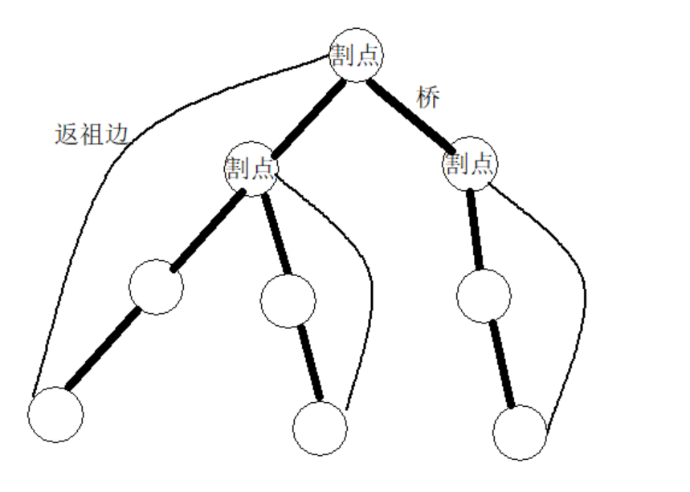

# 桥（割边）

## **定义**

桥（割边）的定义：若删去一条边使得图中连通块数量增加，则称这条边为桥（割边）。


## 例题 #1

给出个点条边的无向图，求图中桥（割边）的数量。



**图中黑色加粗边是树边**

通常，我们用dfn_x表示到达点的时间戳，low_x表示以x为根的子树中，所有点只走一条边能到达的最小时间戳

#### 输入格式

输入文件包含若干组数据。

每组数据的首行有两个数 。

以下  行每行用两个整数  描述无向边 。

输入文件以一行`0 0`为结束。

#### 输出格式

输出文件共有  行，第  行仅有一个数，表示第  组输入数据的桥（割边）数目。

**数据中可能有重边**

---

tarjan模板（部分）。

```C++
void tarjan(int u,int eid) {
	dfn[u]=low[u]=++indx;
	stk[++tp]=u;
	for(int i=head[u]; ~i; i=edge[i].nxt) {
		int v=edge[i].to;
		if(dfn[v]==0) {
			tarjan(v,i);
			low[u]=min(low[u],low[v]);
		}
		if(i!=(eid^1)) low[u]=min(low[u],dfn[v]);
	}
}
```

---

结合tarjan算法流程，我们可以知道，当发现有low[v] > dfn[x]时，我们就可以判定有一个桥。因为low[v] > dfn[x]只有可能是v,x属于两个不同的edcc中，，这恰好符合桥的定义。并且可以简单证明不会重复计算。

```C++

void tarjan(int x, int eid) {
    low[x] = dfn[x] = ++cnt;
    stk[++top] = x;

    instk[x] = 1;

    for (auto v : e[x]) {
        if (!dfn[v.v])
            tarjan(v.v, v.id), low[x] = min(low[x], low[v.v]);
        if (low[v.v] > dfn[x])
            ans++;
        if (v.id != eid)
            low[x] = min(low[x], dfn[v.v]);
    }
}
```

## 例题 #2 炸铁路

题目描述

A 国派出将军 uim，对 B 国进行战略性措施，以解救涂炭的生灵。

B 国有 $n$ 个城市，这些城市以铁路相连。任意两个城市都可以通过铁路直接或者间接到达。

uim 发现有些铁路被毁坏之后，某两个城市无法互相通过铁路到达。这样的铁路就被称为 key road。

uim 为了尽快使该国的物流系统瘫痪，希望炸毁铁路，以达到存在某两个城市无法互相通过铁路到达的效果。

然而，只有一发炮弹（A 国国会不给钱了）。所以，他能轰炸哪一条铁路呢？

输入格式

第一行 $n,m\ (1 \leq n\leq 150$，$1 \leq m \leq 5000)$，分别表示有 $n$ 个城市，总共 $m$ 条铁路。

以下 $m$ 行，每行两个整数 $a, b$，表示城市 $a$ 和城市 $b$ 之间有铁路直接连接。

输出格式

输出有若干行。

每行包含两个数字 $a,b$，其中 $a<b$，表示 $\lang a,b\rang$ 是 key road。

请注意：输出时，所有的数对 $\lang a,b\rang$ 必须按照 $a$ 从小到大排序输出；如果$a$ 相同，则根据 $b$ 从小到大排序。

---

```C++

/*
                      Keyblinds Guide
                                ###################
      @Ntsc 2024

      - Ctrl+Alt+G then P : Enter luogu problem details
      - Ctrl+Alt+B : Run all cases in CPH
      - ctrl+D : choose this and dump to the next
      - ctrl+Shift+L : choose all like this
      - ctrl+K then ctrl+W: close all
      - Alt+la/ra : move mouse to pre/nxt pos'

*/
#include <bits/stdc++.h>
#include <queue>
using namespace std;

#define rep(i, l, r) for (int i = l, END##i = r; i <= END##i; ++i)
#define per(i, r, l) for (int i = r, END##i = l; i >= END##i; --i)
#define pb push_back
#define mp make_pair
#define int long long
#define pii pair<int, int>
#define ps second
#define pf first
#define ull unsigned long long

#define itn int
// #define inr int
// #define mian main
// #define iont int

#define rd read()
int read() {
    int xx = 0, ff = 1;
    char ch = getchar();
    while (ch < '0' || ch > '9') {
        if (ch == '-')
            ff = -1;
        ch = getchar();
    }
    while (ch >= '0' && ch <= '9') xx = xx * 10 + (ch - '0'), ch = getchar();
    return xx * ff;
}
void write(int out) {
    if (out < 0)
        putchar('-'), out = -out;
    if (out > 9)
        write(out / 10);
    putchar(out % 10 + '0');
}

#define ell dbg('\n')
const char el = '\n';
const bool enable_dbg = 1;
template <typename T, typename... Args>
void dbg(T s, Args... args) {
    if constexpr (enable_dbg) {
        cerr << s;
        if (1)
            cerr << ' ';
        if constexpr (sizeof...(Args))
            dbg(args...);
    }
}

#define zerol = 1
#ifdef zerol
#define cdbg(x...)            \
    do {                      \
        cerr << #x << " -> "; \
        err(x);               \
    } while (0)
void err() { cerr << endl; }
template <template <typename...> class T, typename t, typename... A>
void err(T<t> a, A... x) {
    for (auto v : a) cerr << v << ' ';
    err(x...);
}
template <typename T, typename... A>
void err(T a, A... x) {
    cerr << a << ' ';
    err(x...);
}
#else
#define dbg(...)
#endif

const int N = 3e5 + 5;
const int INF = 1e18;
const int M = 1e7;
const int MOD = 1e9 + 7;

struct edge {
    int v, id;
};

vector<edge> e[N];
int dod;

void add(int a, int b) {
    e[a].push_back({ b, ++dod });
    e[b].push_back({ a, dod });
}
int ans;

int low[N], dfn[N];
int cnt;
int stk[N];
int top;
bool instk[N];


struct node{
	int a,b;
}anss[N];


bool cmp(node a,node b){
	if(a.a==b.a)return a.b<b.b;
	return a.a<b.a;
}

void tarjan(int x, int eid) {
    low[x] = dfn[x] = ++cnt;
    stk[++top] = x;

    instk[x] = 1;

    for (auto v : e[x]) {
        if (!dfn[v.v])
            tarjan(v.v, v.id), low[x] = min(low[x], low[v.v]);
        if (low[v.v] > dfn[x]){
        	anss[++ans]={x,v.v};	
        }
        if (v.id != eid)
            low[x] = min(low[x], dfn[v.v]);
    }
}

void solve() {
    int n = rd, m = rd;
    ans = 0;
    if (!n)
        exit(0);

    for (int i = 1; i <= n; i++) {
        dfn[i] = 0;
        int sz = e[i].size();
        while (sz--) e[i].pop_back();
    }

    for (int i = 1; i <= m; i++) {
        int a = rd, b = rd;
        add(a, b);
    }

    for (int i = 1; i <= n; i++) {
        if (!dfn[i])
            tarjan(i, 0);
    }
	sort(anss+1,anss+ans+1,cmp);
    
    for(int i=1;i<=ans;i++){
    	cout<<anss[i].a<<' '<<anss[i].b<<endl;
	}
}

signed main() {
    // freopen(".in","r",stdin);
    // freopen(".in","w",stdout);

    int T = 1;
    while (T--) {
        solve();
    }
    return 0;
}
```

