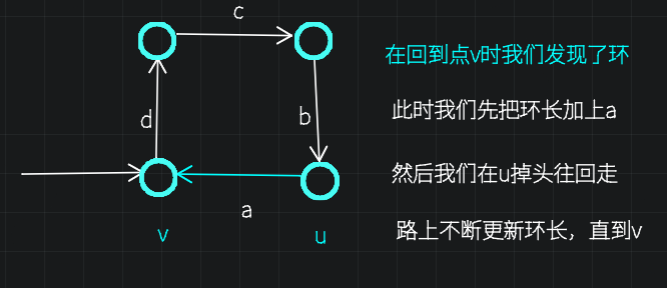

【】专题 | tarjan 算法相关

# 二叉搜索树

二叉查找树（Binary Search Tree），（又：二叉搜索树，二叉排序树）它或者是一棵空树，或者是具有下列性质的二叉树： 若它的左子树不空，则左子树上所有结点的值均小于它的根结点的值； 若它的右子树不空，则右子树上所有结点的值均大于它的根结点的值； 它的左、右子树也分别为二叉排序树。二叉搜索树作为一种经典的数据结构，它既有链表的快速插入与删除操作的特点，又有数组快速查找的优势。

# tarjan 算法

**算法目的:**

> Tarjan 算法是基于***[深度优先搜索](https://link.zhihu.com/?target=https%3A//en.wikipedia.org/wiki/Depth-first_search)***的算法，用于求解图的连通性问题。Tarjan 算法可以在线性时间内求出无向图的割点与桥，进一步地可以求解无向图的双连通分量；同时，也可以求解有向图的强连通分量、必经点与必经边。

> 如果你对上面的一些术语不是很了解，没关系，我们只要知道 **Tarjan 算法是基于深度优先搜索的，用于求解图的连通性问题的算法** 就好了。

[zhuanlan.zhihu.com](https://zhuanlan.zhihu.com/p/101923309)

**算法**


# 割点（割顶）

## 讲解

**割点**

在无向联通图$ G=(V,E)$中: 若对于$x∈V$， 从图中删去节点$x$以及所有与$x$关联的边之后， $G$分裂成两个或两个以上不相连的子图， 则称$x$为$G$的割点。

**扩展:割边**

假设有连通图$G$，$e$是其中一条边，如果$G-e$ (在图$G$中去掉边$e$) 是不连通的，则边$e$是图$G$的一条割边。此情形下，$G-e$必包含两个连通分支。

**推荐资料**

[图的割点与割边（超详细！！！） - endl\n - 博客园](https://www.cnblogs.com/ljy-endl/p/11595161.html)

## 例题 #1

给出一个 $n$ 个点，$m$ 条边的无向图，求图的割点。

对于全部数据，$1\leq n \le 2\times 10^4$，$1\leq m \le 1 \times 10^5$。

点的编号均大于 $0$ 小于等于 $n$。

**tarjan图不一定联通。**


```C++
#include<bits/stdc++.h> 
using namespace std;
#define ll long long
const int N=2e5+5;


int cnt,num,br[N],nxt[N],h[N], n,m,to[N],ans,low[N],dfn[N];
void add(int x,int y){
	to[++cnt]=y,nxt[cnt]=h[x],h[x]=cnt;
}

void tarjan(int x,int e){
	dfn[x]=low[x]=++num;
	int child=0;	//局部变量 
	for(int i=h[x];i;i=nxt[i]){
		int y=to[i];
		if(!dfn[y]){
			tarjan(y,e);
			low[x]=min(low[x],low[y]);
			if(low[y]>=dfn[x]&&x!=e){//>=而不是>  !!! 
				br[x]=1;
			}
			if(x==e)child++;
		}
		low[x]=min(low[x],dfn[y]);
		
	}
	if(child>1&&x==e)br[x]=1;
} 
signed main(){
	memset (dfn,0,sizeof (dfn));
    memset (h,0,sizeof (h));
	cin>>n>>m;
	for(int i=1;i<=m;i++){
		int x,y;
		cin>>x>>y;
		add(x,y);
		add(y,x);
	}
	 for (int i=1;i<=n;i++)
        if (dfn[i]==0)
            tarjan (i,i);
            
            
    for (int i=1;i<=n;i++)
        if (br[i])
            ans++;
    printf ("%d\n",ans);
    for (int i=1;i<=n;i++)
        if (br[i])
            printf ("%d ",i);

	return 0;
}
```

# 点双连通分量

## 例题 #1

对于一个 $n$ 个节点 $m$ 条无向边的图，请输出其点双连通分量的个数，并且输出每个点双连通分量。

### 提示&代码

    注意一个点可能属于多个vdcc，所以不可用`belong[]`存储，而应该直接推入`(vector) vdcc[cnt]`中

完整代码

```C++
/*////////ACACACACACACAC///////////
       . Code  by  Ntsc .
       . Earn knowledge .
/*////////ACACACACACACAC///////////

#include<bits/stdc++.h>
#define int long long
#define db double
#define rtn return
using namespace std;

const int N=5e5+5;
const int M=5e6;
const int Mod=1e5;
const int INF=1e5;

int n,m,p,T;


int dfn[N],low[N],indx;//时间戳，追溯值，给时间戳编号的计数器 
int stk[N],tp;//栈，指针 
bool instk[N]; //是否在栈中
int belong[N],siz[N],vdcc; //记录每个点在那个边双连通分量里, 每个点所在的边双连通分量的大小,边双连通分量的数量 
vector<int> ans[N];

int vis[N];

struct edge{
	int to,nxt;
}e[M];
int h[N],idx=-1;
void add(int a,int b){
	e[++idx]={b,h[a]};
	h[a]=idx;
	e[++idx]={a,h[b]};
	h[b]=idx;
}

void tarjan(int u,int fa) {//当前节点,入边的节点编号
	int son=0;//判孤立点用 
	vis[u]=1;
	dfn[u]=low[u]=++indx;
	stk[++tp]=u;
	for(int i=h[u]; ~i; i=e[i].nxt) {
		
		int v=e[i].to;
		if(dfn[v]==0) {
			son++;
			tarjan(v,u);//not tarjan(v,i);
			low[u]=min(low[u],low[v]);
			///new
			if(low[v]>=dfn[u]){
				vdcc++;
				int x;
				do {
					x=stk[tp--];
					ans[vdcc].push_back(x);//注意！一个点可能属于多个vdcc! 
				} while(x!=v);
				ans[vdcc].push_back(u);
			}
		}
		else if(v!=fa) low[u]=min(low[u],dfn[v]);//判断点是否相同，而边双中是判断边是否和来时的边的反向边相同，都是为了防止回头 
	}
	if(!(fa||son))ans[++vdcc].push_back(u);//特判孤立点 
}
signed main(){
	int m,n;
	cin>>n>>m;
	
	for(int i=1;i<=N;i++)e[i].nxt=-1,h[i]=-1;
	for(int i=1;i<=m;i++){
		int a,b;
		cin>>a>>b;
		add(a,b);
	}
	for(int i=1;i<=n;i++)if(!vis[i])tp=0,tarjan(i,0);//图可能不连通！切勿重复访问！
	
	cout<<vdcc<<endl; 
	for(int i=1;i<=vdcc;i++){
		cout<<ans[i].size()<<' ';
		for(auto v:ans[i])cout<<v<<' ';
		cout<<endl;
	}
	return 0;
}

```

# 边双连通分量

## 题目描述

对于一个 $n$ 个节点 $m$ 条无向边的图，请输出其边双连通分量的个数，并且输出每个边双连通分量。

## 提示&代码

```C++
void tarjan(int u,int eid) {//当前节点,入边编号
	dfn[u]=low[u]=++indx;
	stk[++tp]=u;
	for(int i=head[u]; ~i; i=edge[i].nxt) {
		int v=edge[i].to;
		if(dfn[v]==0) {
			tarjan(v,i);
			low[u]=min(low[u],low[v]);
		}
		if(i!=(eid^1)) low[u]=min(low[u],dfn[v]);
	}
	if(dfn[u]==low[u]) {
		edcc++;
		int x;
		do {
			x=stk[tp--];
			belong[x]=edcc;
		} while(x!=u);
	}
}
```

完整代码

```C++
/*////////ACACACACACACAC///////////
       . Code  by  Ntsc .
       . Earn knowledge .
/*////////ACACACACACACAC///////////

#include<bits/stdc++.h>
#define int long long
#define db double
#define rtn return
using namespace std;

const int N=5e5+5;
const int M=5e6;
const int Mod=1e5;
const int INF=1e5;

int n,m,p,T;


int dfn[N],low[N],indx;//时间戳，追溯值，给时间戳编号的计数器 
int stk[N],tp;//栈，指针 
bool instk[N]; //是否在栈中
int belong[N],siz[N],edcc; //记录每个点在那个边双连通分量里, 每个点所在的边双连通分量的大小,边双连通分量的数量 
vector<int> ans[N];

int vis[N];

struct edge{
	int to,nxt;
}e[M];
int h[N],idx=-1;
void add(int a,int b){
	e[++idx]={b,h[a]};
	h[a]=idx;
	e[++idx]={a,h[b]};
	h[b]=idx;
}

void tarjan(int u,int eid) {//当前节点,入边编号
	vis[u]=1;
	dfn[u]=low[u]=++indx;
	stk[++tp]=u;
	for(int i=h[u]; ~i; i=e[i].nxt) {
		int v=e[i].to;
		if(dfn[v]==0) {
			tarjan(v,i);
			low[u]=min(low[u],low[v]);
		}
		if(i!=(eid^1)) low[u]=min(low[u],dfn[v]);
	}
	if(dfn[u]==low[u]) {
		edcc++;
		int x;
		do {
			x=stk[tp--];
			belong[x]=edcc;
		} while(x!=u);
	}
}
signed main(){
	int m,n;
	cin>>n>>m;
	
	for(int i=1;i<=N;i++)e[i].nxt=-1,h[i]=-1;
	for(int i=1;i<=m;i++){
		int a,b;
		cin>>a>>b;
		add(a,b);
	}
	for(int i=1;i<=n;i++)if(!vis[i])tarjan(i,0);//图可能不连通！切勿重复访问！
	for(int i=1;i<=n;i++)ans[belong[i]].push_back(i);
	
	cout<<edcc<<endl; 
	for(int i=1;i<=edcc;i++){
		cout<<ans[i].size()<<' ';
		for(auto v:ans[i])cout<<v<<' ';
		cout<<endl;
	
	return 0;
}

```

# 缩点（强连通分量）

## 题目描述

给定一个 $n$ 个点 $m$ 条边有向图，每个点有一个权值，求一条路径，使路径经过的点权值之和最大。你只需要求出这个权值和。

允许多次经过一条边或者一个点，但是，重复经过的点，权值只计算一次。

**大意**

子问题1：把同一个强连通分量里的所有点压缩成一个点即可。处理完后图中无环。

子问题2：在新的有向无环图中找最大路径。记忆化dfs搜索即可。


```C++
/*////////ACACACACACACAC///////////
       . Coding by Ntsc .
       . ToFind Chargcy .
       . Prove Yourself .
/*////////ACACACACACACAC///////////

#include<bits/stdc++.h>
#define ll long long
#define db double
#define rtn return
#define i1n int i=1;i<=n;i++
#define in1 int i=n;i>=1;i--
using namespace std;

const int N=5e5+5;
const int M=1e5;
const int Mod=1e5;
const int INF=1e5;

int dfn[N],low[N],stk[N],tot,top,cnt,scc[N],siz[N],sccw[N],w[N],dis[N],vis[N],n,m,way[N][2],instk[N],s,np,p[N],ans;
vector <int> e[N];
int f[N];


vector<int>e2[N];

void add(int a,int b){
	e[a].push_back(b);
}
void add2(int a,int b){
	e2[a].push_back(b);
}

void tarjan(int x){//强连通分量缩点
	//入x时,时间戳追溯值更新,入栈
	dfn[x]=low[x]=++tot;
	stk[++top]=x;instk[x]=1; 
	
	for(int i=0;i<e[x].size();i++){//枚举x的邻点y 
		int y=e[x][i];
		if(!dfn[y]){//如果y还没有访问过 
			tarjan(y);//向下走 
			low[x]=min(low[x],low[y]);//返回时更新 
		}else if(dfn[y]&&instk[y]){//说明 y被访问过 ->要么y是祖先(在x出通过返祖边访问到了),要么是左子树的点(在x通过横插边访问到了) 
			low[x]=min(low[x],dfn[y]); 
		}
	}
	if(dfn[x]==low[x]){//说明x是这个强连通分量的根 
		int y;++cnt;
		int flag=0;
		do{
			flag++;
			y=stk[top--];instk[y]=0;
			scc[y]=cnt;
			++siz[cnt];
			sccw[cnt]+=w[y];//记录缩点后强连通分量点的点权
		} while(y!=x); 
	}
}

void dfs(int x){
	if(f[x])return ;
	f[x]=sccw[x];
	int mx=0;
	for(auto v:e2[x]){
		if(!f[v])dfs(v);//搜过就不用再搜，直接调用 
		mx=max(mx,f[v]);
	}
	f[x]+=mx;
}

signed main(){
	cin>>n>>m;
	for(int i=1;i<=n;i++)cin>>w[i];
	for(int i=1;i<=m;i++){
		cin>>way[i][0]>>way[i][1];
	}
	
	for(int i=1;i<=m;i++){
		add(way[i][0],way[i][1]);
	}

	
	for(int i=1;i<=n;i++)//题目不保证图连续!
	    if(!dfn[i]) tarjan(i);
	
	//建新图 
	for(int i=1;i<=n;i++){
		for(int j=0;j<e[i].size();j++){
			int v=e[i][j];
			if(scc[i]==scc[v])continue;//注意continue
			add2(scc[i],scc[v]);//注意不是scc[j]
		}
	}
	
	//求DAG中最大路径
	for(int i=1;i<=cnt;i++){
		if(f[i])continue;
		dfs(i);
		ans=max(ans,f[i]);
	} 
	
	cout<<ans<<endl;
	return 0;
}

```


# 强连通分量


一个环是强连通分量。一个没有出边的点也是强连通分量。


如果一个子图可以构成多个连通分量，则只有包含节点最多的才是强连通分量。（如下图4，包含3个节点的环不是强连通分量，4个的才是 ）一个图中的强连通分量可以有多个，并且他们所包含的节点数可能不同（如上图1,2,3,4,9和5,6,8和7）


分类之后，就可以通过不同的边寻找环，从而找到强连通分量


## Tarjan算法


### 1.入x

```C++
//入x时,时间戳追溯值更新,入栈
	dfn[x]=low[x]=++tot;
	stk[++top]=x;instk[x]=1; 
	
```

### 2.找x

枚举x的邻点y，可能会有3种情况

```C++
for(int i=0;i<e[x].size();i++){//枚举x的邻点y 
		int y=e[x][i];
		if(!dfn[y]){//如果y还没有访问过 
			tarjan(y);//向下走 
			low[x]=min(low[x],low[y]);//返回时更新 
			
		}
	}
```

**1.没有访问过y**


考察以下走法

1→2→3→1

节点3可以访问到dfn最小的节点为1，dfn为1.并且节点3是从1，2走过来的，说明1，2也可以通过节点3访问到dfn最小的节点为1，因此在返回时要更新low为自己的和邻点的low的最小值

向下继续走

```C++
if(!dfn[y]){//如果y还没有访问过 
			tarjan(y);//向下走 
			low[x]=mid(low[x],low[y]);//返回时更新 
		}
```

**2.y被访问过**

考察点3.它可以走到点1（一个**被访问过的点**）

考察点9.它可以走到点3（一个被访问过的点）也是同理

不用往回走（即不需要`tarjan(y);`）

```C++
else if(dfn[y]&&instk[y]){//说明 y被访问过 ->要么y是祖先(在x出通过返祖边访问到了),要么是左子树的点(在x通过横插边访问到了) 
			low[x]=min(low[x],dfn[y]); 
		}
```

**3.y被访问过并且已经弹出栈**

只有当一个强连通分量全部扫描完，才会将节点弹出。如果y已经被弹出了，说明y所在的强连通分量已经被扫描完了。又因为一个点所在的强连通分量**有且只有一个**，所以y一定不是目前正在扫描的强连通分量里的一个点，直接忽略它

### 离x

```C++
if(dfn[x]==low[x]){//说明x是这个强连通分量的根 
		int y;++cnt;
		do{
			y=stk[top--];instk[y]=0;
			scc[y]=cnt;
			++siz[cnt];
		} while(y!=x);
	}
```

考察以下图


当访问了5→6→8，访问到5（通过返祖边），此时属于**2.y被访问过情况，执行**`low[x]=min(low[x],dfn[y]);`

并且从8不能继续走到5，也没有其他出边（7属于**3.y被访问过并且已经弹出栈情况，忽略**）

开始回溯

将点8，6，5的low更新为`min(low[8],dfn[5])`即`dfn[5]`。当回溯到5时，把`low[5]`也更新为了`dfn[5]`，并且5的所有邻点都访问完了（7忽略，理由同上）。此时节点5的**for循环**结束，运行到判定环节（**离x**）。也恰好满足`(dfn[x]==low[x])`说明x是这个强连通分量的根

此时栈里有...,5,6,8

执行循环，不断出栈，直到把5的scc更新后，发现x=y（y就是目前的栈顶，5），就说明这个强连通分量走完了

### 代码

```C++
/*////////ACACACACACACAC///////////
Code By Ntsc
/*////////ACACACACACACAC///////////
#include<bits/stdc++.h>
using namespace std;
#define ll long long
const int N=1e5;

vector<int> e[N];//邻接矩阵 
int dfn[N],low[N],tot;//时间戳，追溯值，给时间戳编号的计数器 
int stk[N],top;//栈，指针 
bool instk[N]; //是否在栈中
int scc[N],siz[N],cnt; //记录每个点在那个强连通分量里, 每个点所在的强连通分量的大小,强连通分量的数量 
int ans;

void tarjan(int x){//从节点x进入 
	if(scc[x])return;//如果已经是某个强连通分量里的点,停止函数
	//入x时,时间戳追溯值更新,入栈
	dfn[x]=low[x]=++tot;
	stk[++top]=x;instk[x]=1; 
	
	for(int i=0;i<e[x].size();i++){//枚举x的邻点y 
		int y=e[x][i];
		if(!dfn[y]){//如果y还没有访问过 
			tarjan(y);//向下走 
			low[x]=min(low[x],low[y]);//返回时更新 
		}else if(dfn[y]&&instk[y]){//说明 y被访问过 ->要么y是祖先(在x出通过返祖边访问到了),要么是左子树的点(在x通过横插边访问到了) 
			low[x]=min(low[x],dfn[y]); 
		}
	}
	if(dfn[x]==low[x]){//说明x是这个强连通分量的根 
		int y;++cnt;
		int flag=0;//记录当前强连通分量点的个数
		do{
			flag++;
			y=stk[top--];instk[y]=0;
//			ans-=e[y].size();
			scc[y]=cnt;
			++siz[cnt];
		} while(y!=x); 
		if(flag>1)ans++;
	}
}
signed main(){
	int m,n;
	cin>>n>>m;
	for(int i=1;i<=m;i++){
		int a,b;
		cin>>a>>b;
		e[a].push_back(b);
	}
//	ans=m;
	for(int i=1;i<=n;i++)tarjan(i);//图可能不连通！
//	for(int i=1;i<=n;i++)cout<<scc[i]<<' ';
	cout<<ans;
	return 0;
}

```

注意本代码与下面例题代码有一点不同，下面的代码不能计算点数为1的强连通分量，但本代码可以，只需要修改`if(flag>1)ans++;`即可。

## 例题 #1 [USACO06JAN]The Cow Prom S


有一个 $n$ 个点，$m$ 条边的有向图，请求出这个图点数大于 $1$ 的强联通分量个数。

对于全部的测试点，保证 $2\le n \le 10^4$，$2\le m\le 5\times 10^4$，$1 \leq a, b \leq n$。

### 完整代码

```C++
/*////////ACACACACACACAC///////////
Code By Ntsc
/*////////ACACACACACACAC///////////
#include<bits/stdc++.h>
using namespace std;
#define ll long long
const int N=1e5;

vector<int> e[N];//邻接矩阵 
int dfn[N],low[N],tot;//时间戳，追溯值，给时间戳编号的计数器 
int stk[N],top;//栈，指针 
bool instk[N]; //是否在栈中
int scc[N],siz[N],cnt; //记录每个点在那个强连通分量里, 每个点所在的强连通分量的大小,强连通分量的数量 
int ans;

void tarjan(int x){//从节点x进入 
	//入x时,时间戳追溯值更新,入栈
	dfn[x]=low[x]=++tot;
	stk[++top]=x;instk[x]=1; 
	
	for(int i=0;i<e[x].size();i++){//枚举x的邻点y 
		int y=e[x][i];
		if(!dfn[y]){//如果y还没有访问过 
			tarjan(y);//向下走 
			low[x]=min(low[x],low[y]);//返回时更新 
		}else if(dfn[y]&&instk[y]){//说明 y被访问过 ->要么y是祖先(在x出通过返祖边访问到了),要么是左子树的点(在x通过横插边访问到了) 
			low[x]=min(low[x],dfn[y]); 
		}
	}
	if(dfn[x]==low[x]){//说明x是这个强连通分量的根 
		int y;++cnt;
		int flag=0;
		do{
			flag++;
			y=stk[top--];instk[y]=0;
			scc[y]=cnt;
			++siz[cnt];
		} while(y!=x); 
		if(flag>1)ans++;
	}
}
signed main(){
	int m,n;
	cin>>n>>m;
	for(int i=1;i<=m;i++){
		int a,b;
		cin>>a>>b;
		e[a].push_back(b);
	}
	for(int i=1;i<=n;i++)tarjan(i);//图可能不连通！
	cout<<ans;
	return 0;
}

```

我们也可以tarjan完了之后统一统计，去掉flag

在输出答案前统计答案，在输出答案前插入以下代码

```C++
for(int i=1;i<=cnt;i++)
     if(siz[i]>1) ans++;
```

# 融会贯通：dfn与low替换

在边双连通分量和强连通分量中，我们发现下面两种写法是等效的。

```C++
if(i!=(eid^1)) low[u]=min(low[u],dfn[v]);
//等于
if(i!=(eid^1)) low[u]=min(low[u],low[v]);
```

但是在点双连通分量中，这样写是错误的，这是为什么呢？

因为在点双连通分量中，一个点可能在两个点双连通分量中，我们在更新点$u$的$low_v$时，用到的$v$是与$u$属于同一个点双连通分量里的，但可能在前面的某个也包含点v的点双连通分量中已经更新过其$low_v$了，这样的话就可能跨不同的点双连通分量访问$low_v$了，这样的话就错了。

而在边双连通分量中，该边要么不属于任何边双连通分量，要么一定只属于一个边双连通分量（因为如果该边属于若干个边双连通分量，首先保证其为广义双向边，但如果两个边双连通分量有一个公共的广义双向边，那么这两个边双连通分量其实是一个整体（即它们就是一个边双连通分量））

# 圆方树&仙人掌

[www.luogu.com.cn](https://www.luogu.com.cn/training/8174)

## 例题 #1

小L将取下一段永恒之树的树枝。

这里，我们将一段树枝抽象成一张N个点，M条边的无向图，满足每条边都只在**至多一个简单环**中出现。

小L 将对取下的树枝使用分解魔法，此后，树枝的每一个节点都会在一个时辰内随机的一个时刻，连同其连出去的边一起被分解。

在被分解的瞬间，每个节点会释放出等同于当时还与其连通的节点数量的能量，将这些能量求和就是X国的气运。

现在，小L想要知道，X国的气运期望会是多少。请求出X国气运的期望对998244353取模的结果。

## 仙人掌

**定义**

一张N个点，M条边的无向图，满足每条边都只在**至多一个简单环**中出现。


一定要保证环之间没有公共边

## 例题 #2

给你一个有 $n$ 个点和 $m$ 条边的仙人掌图，和 $q$ 组询问
每次询问两个点 $u,v$，求两点之间的最短路。

**数据范围：**
$1\le n,q \le 10000
$$1\le m \le 20000
$$1\le w \le 10^5$

请注意时限为 $300\text{ms}$

**注意：**

本题n很大，不能用普通最短路做法！

由于仙人掌既有树的性质，但由于基环树有区别。如果是基环树的话，我们可以考虑断边，然后通过求出每个点的深度和lca(u,v)来快速求出u,v之间的距离。

但是仙人掌上有不止一个环，所以我们用不了这种方法。所以我们考虑将图用某种方法变成一棵树（我们可以好好利用环与环之间互相独立这个性质！）

## 圆方树

**定义**


割点：图中的点5,3,8是割点。


我们来仔细考虑怎么将环变成菊花图


红色点作为割点，其它边我们省略，只留下一个环。那么其作为圆方树就应该是右边这样。方点到其他点的距离代表着红色割点在环上到其他点的最短距离。如果一个环有不止一个割点，那么我们只选择第一个，即从1号点开始访问时访问到这个环的第一个割点。

注意，仙人掌是无向带环图，转化为圆方树后变成了一幅 DAG。

**构建**

我们可以使用 Tarjan 算法。

**问题解决**


我们重点考虑情况(2)，在上上图中，我们假如要求dis(6,9)，那么在原图上很容易发现是9→8→5→7→6，dis=2+2+2+1=7。但是在圆方图上，5→6,9→8路径都没有问题，但是lca(6,9)在圆方图上变成了一个方点，即其lca在一个环树。感性来想，一个环上所有点的深度可以认为是一样的，所以6,9有2个lca，分别为5,8。所以我们应该求出5→8之间的距离。但是在同一个环内求距离，我们就不能在圆方图上做了，只能在原图上做，否则会出错。


具体做法是，我们发现方点到5,8的距离实际上代表了割点（样例中为3）到两个点的最短距离。那么我们就可以借助环长信息来求出距离了。具体实现请思考。


实际上就是我们从割点开始**有向地**访问每一个环上的点，如同中$s_a=a,s_b=a+b$，那么点a,b之间的距离可能是b或者a+c，我们求出$len1=abs(s_a-s_b)$，$len2=$环长$-len1$，然后取$\min(len1,len2)$ 即可

**代码实现**

注意这里我们需要建2幅图，一幅为原图，用来跑tarjan求出第2幅图，即圆方图。注意tarjan要建反向边，要用邻接表。并且lca应该在圆方图上跑而不是在原图上跑。


建立菊花图



```C++
void build(int u,int v,int w){
	int sum=w;
	for(int k=v;k!=u;k=fa[k]){//遍历环上每一个点更新环的大小
		sum+=fw[k];
	}
	s[u]=sz[u]=sum;
	add2(u,++cnt2,0);//建方点
	for(int k=v;k!=u;k=fa[k]){//遍历环上每一个点更新 点上记录的 环的大小
		sc[k]=sum;
		add2(cnt2,k,min(s[k],sum-s[k]));//建菊花点
	}
}
```

Tarjan部分【难点】

```C++

void tarjan(int u,int ine){//ine为入边编号
	dfn[u]=low[u]=++tim;
	for(int i=h1[u];i;i=e[i].nxt){
		int v=e[i].to,w=e[i].w;
		if(dfs[v]){//访问过
			if(i!=(ine^1))low[u]=min(low[u],dfn[v]);//成环
			continue;
		}
		fa[v]=u;
		fw[v]=w;
		fe[v]=i;
		tarjan(v,i);
		low[u]=min(low[u],low[v]);
		if(dfn[u]<low[v])add2(u,v,w);//非环边
	}
	for(int i=h1[u];i;i=e[i].nxt){
		int v=e[i].to,w=e[i].w;
		if(dfn[u]<dfn[v]&&fe[v]!=i)build(u,v,w);//建菊花图
	}
}

```


Complete Code is here `AC`

```C++
/*////////ACACACACACACAC///////////
       . Coding by Ntsc .
       . FancyKnowledge .
       . Prove Yourself .
/*////////ACACACACACACAC///////////

//头文件
#include<bits/stdc++.h>

//数据类型
#define int long long
#define ull unsigned long long
#define db double
#define endl '\n'
#define pr pair<int,int>
#define pf first
#define ps second
#define pb push_back
//命名空间
using namespace std;
//常量
const int N=2e5+5;
const int M=1e3;
const int MOD=1e9+1;
const int INF=1e9;
const int IINF=1e18;
const db eps=1e-9;
//变量
int n,m,deg[N],b,c,p[N][22];
int fa[N],fw[N],s[N],fe[N];
int dep[N],d[N];
int tot,nt[N];
int dfn[N],low[N],tim;
int cn;


int A,B;//记录环上的两个lca

int sz[N];//记录每个点对应环的大小

int cnt=1,cnt2,h1[N],h2[N];

struct node{
	int nxt,to,w;
}e[N],e2[N];

void add2(int u,int v,int w){
    e2[++cnt2].to=v;
    e2[cnt2].nxt=h2[u];
    e2[cnt2].w=w;
    h2[u]=cnt2;
}       

void add(int u, int v,int w) { 
	e[++cnt].to=v;
	e[cnt].w=w;
    e[cnt].nxt=h1[u];
    h1[u]=cnt;
	
}

void dfs(int u,int fa){
    dep[u]=dep[fa]+1;
    p[u][0]=fa;
    for(int i=1;(1<<i)<=dep[u];i++)//二叉树，点i的深度即i/2
        p[u][i]=p[p[u][i-1]][i-1];//第u个点向上2^i层的祖先就是第u个点的fa的上2^(i-1)层祖先
    for(int i=h2[u];i;i=e2[i].nxt){//扫描出边
        int v=e2[i].to;
        if(v==fa)continue;//排除fa
        d[v]=d[u]+e2[i].w;
        dfs(v,u);
    }
}                              
int lca(int a,int b){
    if(dep[a]>dep[b])//统一切换为b比a深
        swap(a,b);          
    for(int i=20;i>=0;i--)//b向上走到与a同层
        if(dep[a]<=dep[b]-(1<<i))
            b=p[b][i];             
    if(a==b)
        return a;                 
    for(int i=20;i>=0;i--){
        if(p[a][i]==p[b][i])continue;//过头了
        else a=p[a][i],b=p[b][i];          
    }
    A=a,B=b;//假如是环，记录环上两个lca
    return p[a][0];//最后a停在了lca的更深一层       
}

void build(int u,int v,int w){
	int sum=w;
	for(int k=v;k!=u;k=fa[k]){//遍历环上每一个点更新环的大小
		s[k]=sum;
		sum+=fw[k];
	}
//	s[u]=sz[u]=sum;
	add2(u,++cn,0);//建方点,cn初始值为n,故方点的编号>n,后面根据这个来判断lca是否为方点.不要写成cnt2
	for(int k=v;k!=u;k=fa[k]){//遍历环上每一个点更新 点上记录的 环的大小
		sz[k]=sum;
		add2(cn,k,min(s[k],sum-s[k]));//建菊花点
	}
}

void tarjan(int u,int ine){//ine为入边编号
	dfn[u]=low[u]=++tim;
	for(int i=h1[u];i;i=e[i].nxt){
		int v=e[i].to,w=e[i].w;
		if(dfn[v]){//访问过
			if(i!=(ine^1))low[u]=min(low[u],dfn[v]);//成环
			continue;
		}
		fa[v]=u;
		fw[v]=w;
		fe[v]=i;
		tarjan(v,i);
		low[u]=min(low[u],low[v]);
		if(dfn[u]<low[v])add2(u,v,w);//非环边
	}
	for(int i=h1[u];i;i=e[i].nxt){
		int v=e[i].to,w=e[i].w;
		if(dfn[u]<dfn[v]&&fe[v]!=i){
//		cerr<<"build at u="<<u<<endl;
		build(u,v,w);//建菊花图
		}
		
	}
}

int ask(int u,int v){
	int p=lca(u,v);
//	cerr<<"lca("<<u<<','<<v<<") is p="<<p<<endl;
	if(p<=n)return d[u]+d[v]-2*d[p];//是圆点,注意这里d不是深度!
	int l=abs(s[A]-s[B]);//A,B为两个lca
	int dAB=min(l,sz[A]-l);
	return dAB+d[u]+d[v]-d[A]-d[B];
}

signed main(){
	int q;
	cin>>n>>m>>q;
	cn=n;
	for(int i=1;i<=m;i++){
		int u,v,w;
		cin>>u>>v>>w;
		add(u,v,w);
		add(v,u,w);
	}
	
	
	tarjan(1,-1);
	dfs(1,0);
	
	
	while(q--){
		int u,v;
		cin>>u>>v;
		cout<<ask(u,v)<<endl;
	}
	
	return 0;
}
```

# **Kosaraju 算法**

一个不如Tarjan的下位算法。不学。

# 练习

## [USACO03FALL / HAOI2006] 受欢迎的牛 G

每头奶牛都梦想成为牛棚里的明星。被所有奶牛喜欢的奶牛就是一头明星奶牛。所有奶牛都是自恋狂，每头奶牛总是喜欢自己的。奶牛之间的“喜欢”是可以传递的——如果 $A$ 喜欢 $B$，$B$ 喜欢 $C$，那么 $A$ 也喜欢 $C$。牛栏里共有 $N$ 头奶牛，给定一些奶牛之间的爱慕关系，请你算出有多少头奶牛可以当明星。

输入格式

第一行：两个用空格分开的整数：$N$ 和 $M$。

接下来 $M$ 行：每行两个用空格分开的整数：$A$ 和 $B$，表示 $A$ 喜欢 $B$。

---

缩点后会变成一棵树。找到没有出度的那个点u，u中包含是所有奶牛都是明星。如果有多个点没有出度，则答案为0，即奶牛分成了若干个阵营，相互不连通。

```C++
/*////////ACACACACACACAC///////////
       . Coding by Ntsc .
       . Prove Yourself .
/*////////ACACACACACACAC///////////

#include<bits/stdc++.h>
#define ll long long
#define db double
#define rtn return
#define i1n int i=1;i<=n;i++
#define in1 int i=n;i>=1;i--
using namespace std;

const int N=5e5+5;
const int M=1e5;
const int Mod=1e5;
const int INF=1e5;

int dfn[N],low[N],stk[N],tot,top,cnt,scc[N],siz[N],sccw[N],w[N],dis[N],vis[N],n,m,way[N][2],instk[N],s,np,p[N],ans;
vector <int> e[N];
int du[N];
int f[N];


vector<int>e2[N];

void add(int a,int b){
	e[a].push_back(b);
}
void add2(int a,int b){
	e2[a].push_back(b);
	du[a]++;
}

void tarjan(int x){//强连通分量缩点
	//入x时,时间戳追溯值更新,入栈
	dfn[x]=low[x]=++tot;
	stk[++top]=x;instk[x]=1; 
	
	for(int i=0;i<e[x].size();i++){//枚举x的邻点y 
		int y=e[x][i];
		if(!dfn[y]){//如果y还没有访问过 
			tarjan(y);//向下走 
			low[x]=min(low[x],low[y]);//返回时更新 
		}else if(dfn[y]&&instk[y]){//说明 y被访问过 ->要么y是祖先(在x出通过返祖边访问到了),要么是左子树的点(在x通过横插边访问到了) 
			low[x]=min(low[x],dfn[y]); 
		}
	}
	if(dfn[x]==low[x]){//说明x是这个强连通分量的根 
		int y;++cnt;
		int flag=0;
		do{
			flag++;
			y=stk[top--];instk[y]=0;
			scc[y]=cnt;
			++siz[cnt];
			sccw[cnt]+=w[y];//记录缩点后强连通分量点的点权
		} while(y!=x); 
	}
}

void dfs(int x){
	if(f[x])return ;
	f[x]=sccw[x];
	int mx=0;
	for(auto v:e2[x]){
		if(!f[v])dfs(v);//搜过就不用再搜，直接调用 
		mx=max(mx,f[v]);
	}
	f[x]+=mx;
}

signed main(){
	cin>>n>>m;
	for(int i=1;i<=m;i++){
		cin>>way[i][0]>>way[i][1];
	}
	
	for(int i=1;i<=m;i++){
		add(way[i][0],way[i][1]);
	}

	
	for(int i=1;i<=n;i++)//题目不保证图连续!
	    if(!dfn[i]) tarjan(i);
	
	//建新图 
	for(int i=1;i<=n;i++){
		for(int j=0;j<e[i].size();j++){
			int v=e[i][j];
			if(scc[i]==scc[v])continue;//注意continue
			add2(scc[i],scc[v]);//注意不是scc[j]
		}
	}
	int res=0;
	for(int i=1;i<=cnt;i++){
		if(!du[i])res++,ans=siz[i];
		if(res>1){
			ans=0;break;
		}
	} 
	
	cout<<ans<<endl;
	return 0;
}

```

