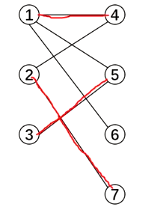

[b23.tv](https://b23.tv/wEJ5Ozv)
匈牙利算法

# 二分图

二分图（二部图）的最大匹配：

设 $G$ 为二分图 ， 若在 $G $ 的子图 $M $ 中 ， 任意两条边都没有公共节点 ， 那么称 $M $ 为二分图 $G $ 的一组**匹配** 。 在二分图中 ，包含边数最多的一组匹配称为**二分图的最大匹配**。

如在下图中，1-4，5-3就是一组匹配。1-4，5-3，2-7就是下图的最大匹配


交替路：从一个未匹配点出发，依次经过非匹配边、匹配边、非匹配边…形成的路径叫交替路。

增广路：从一个未匹配点出发，走交替路，若能到达另一个未匹配点，则这条交替路称为增广路。

例如，3→5→1→4→2→7

观察增广路，我们会发现：非匹配边比匹配边多一条。只要把增广路中的匹配边和非匹配边的身份交换（即倒过来走），交换后，图中的匹配边数目比原来多了1条。

这里的增广路就是指能增加匹配边的一条路。




## 二分图染色

### 例题 #1 封锁阳光大学

题目描述

曹是一只爱刷街的老曹，暑假期间，他每天都欢快地在阳光大学的校园里刷街。河蟹看到欢快的曹，感到不爽。河蟹决定封锁阳光大学，不让曹刷街。

阳光大学的校园是一张由 $n$ 个点构成的无向图，$n$ 个点之间由 $m$ 条道路连接。每只河蟹可以对一个点进行封锁，当某个点被封锁后，与这个点相连的道路就被封锁了，曹就无法在这些道路上刷街了。非常悲剧的一点是，河蟹是一种不和谐的生物，当两只河蟹封锁了相邻的两个点时，他们会发生冲突。

询问：最少需要多少只河蟹，可以封锁所有道路并且不发生冲突。

输入格式

第一行两个正整数，表示节点数和边数。
接下来 $m$ 行，每行两个整数 $u,v$，表示点 $u$ 到点 $v$ 之间有道路相连。

输出格式

仅一行如果河蟹无法封锁所有道路，则输出 `Impossible`，否则输出一个整数，表示最少需要多少只河蟹。

【数据规模】
对于 $100\%$ 的数据，$1\le n \le 10^4$，$1\le m \le 10^5$，保证没有重边。

---

注意图可能不连通。

要对每一个联通块取最优答案。

```C++
/*                                                                                
                      Keyblinds Guide
     				###################
      @Ntsc 2024

      - Ctrl+Alt+G then P : Enter luogu problem details
      - Ctrl+Alt+B : Run all cases in CPH
      - ctrl+D : choose this and dump to the next
      - ctrl+Shift+L : choose all like this
      - ctrl+K then ctrl+W: close all
      - Alt+la/ra : move mouse to pre/nxt pos'
	  
*/
#include <bits/stdc++.h>
#include <queue>
using namespace std;

#define rep(i, l, r) for (int i = l, END##i = r; i <= END##i; ++i)
#define per(i, r, l) for (int i = r, END##i = l; i >= END##i; --i)
#define pb push_back
#define mp make_pair
#define int long long
#define ull unsigned long long
#define pii pair<int, int>
#define ps second
#define pf first

// #define innt int
#define itn int
// #define inr intw
// #define mian main
// #define iont int

#define rd read()
int read(){
    int xx = 0, ff = 1;
    char ch = getchar();
    while (ch < '0' || ch > '9') {
		if (ch == '-')
			ff = -1;
		ch = getchar();
    }
    while (ch >= '0' && ch <= '9')
      xx = xx * 10 + (ch - '0'), ch = getchar();
    return xx * ff;
}
void write(int out) {
	if (out < 0)
		putchar('-'), out = -out;
	if (out > 9)
		write(out / 10);
	putchar(out % 10 + '0');
}

#define ell dbg('\n')
const char el='\n';
const bool enable_dbg = 1;
template <typename T,typename... Args>
void dbg(T s,Args... args) {
	if constexpr (enable_dbg){
    cerr << s;
    if(1)cerr<<' ';
		if constexpr (sizeof...(Args))
			dbg(args...);
	}
}

#define zerol = 1
#ifdef zerol
#define cdbg(x...) do { cerr << #x << " -> "; err(x); } while (0)
void err() { cerr << endl; }
template<template<typename...> class T, typename t, typename... A>
void err(T<t> a, A... x) { for (auto v: a) cerr << v << ' '; err(x...); }
template<typename T, typename... A>
void err(T a, A... x) { cerr << a << ' '; err(x...); }
#else
#define dbg(...)
#endif


const int N = 5e5 + 5;
const int INF = 1e3;
const int M = 1e7;
const int MOD = 1e9 + 7;


vector<int> e[N];

void add(int a,int b){
	e[a].pb(b);
	e[b].pb(a);
}

bitset<N> col,vis;
queue<int> q;

int ans;
int anss;
int cnt;
void bfs(int s){
	q.push(s);
	vis[s]=1;

	while(q.size()){
		itn x=q.front();
		ans+=col[x];
		q.pop();
		cnt++;
		for(auto v:e[x]){
			if(vis[v]){
				if(col[v]==col[x]){
					puts("Impossible");
					exit(0);
				}
				continue;
			}
			col[v]=col[x]^1;
			vis[v]=1;
			q.push(v);
		}
	}
}

void solve(){
	itn n=rd,m=rd;
	for(int i=1;i<=m;i++){
		add(rd,rd);
	}

	for(int i=1;i<=n;i++){
		if(!vis[i]){
			ans=0;cnt=0;
			bfs(i);
			anss+=min(ans,cnt-ans);
		}
	}
	cout<<anss<<endl;


}

signed main() {
//     freopen("P2619_3.in","r",stdin);
    // freopen("center.out","w",stdout);

    int T=1;
    while(T--){
    	solve();
    }
    return 0;
}
```

### 例题 #2 队员分组

题目描述

有 $n$ 个人从 $1$ 至 $n$ 编号，相互之间有一些认识关系，你的任务是把这些人分成两组，使得：

- 每个人都被分到其中一组。

- 每个组都至少有一个人。

- 一组中的每个人都认识其他同组成员。

在满足上述条件的基础上，要求两组成员的人数之差（绝对值）尽可能小。请构造一种可行的方案。

请注意，$x$ 认识 $y$ 不一定说明 $y$ 认识 $x$；$x$ 认识 $y$ 且 $y$ 认识 $z$ 不一定说明 $x$ 认识 $z$。即认识关系是单向且不可传递的。

输入格式

输入的第一行是一个整数，代表总人数 $n$。

第 $2$ 到第 $(n + 1)$ 行，每行有若干个互不相同的整数，以 $0$ 结尾，第 $(i + 1)$ 行的第 $j$ 个整数 $a_{i, j}$（$0$ 除外）代表第 $i$ 个人认识 $a_{i, j}$。

输出格式

**本题存在 Special Judge**。

如果无解，请输出一行一个字符串 `No solution`。

如果有解，请输出两行整数，分别代表两组的成员。每行的第一个整数是该组的人数，后面**以升序**若干个整数代表该组的成员编号，数字间用空格隔开。

#### 数据规模与约定

对于全部的测试点，保证 $2 \leq n \leq 100$，$1 \leq a_{i, j} \leq n$。

#### 说明

由 @zhouyonglong 提供 SPJ。

---

我们首先考虑如何把这图分成一个二分图。我们考虑到如果2个人属于2个团队，那么题目可以认识也可同意不认识。这是很难搞的，我们唯一发现的“硬性指标”就是一个队伍里的两个人不可能不认识。

所以我们考虑建**补图，即**若A,B不认识，那么我们就建边。这样我们就豁然开朗了。现在我们要求没有任何边链接同一个团队内的两个人，这就是一个典型的二分图染色。

现在还有一个问题就是，我们要求最小化人数的差值。我们如果进行二分图染色，我们可以得到**唯一**的一种方案，这是一个很好的性质。所以我们只需要确定黑点和白点的归属即可，考虑dp。

我们这样设计dp

定义$f_{i,k}$为考虑到前i联通块，差值为k是否可行。转移就是很简单的。转移要记录转移前驱。偏移量不要搞错。

```C++
/*                                                                                
                      Keyblinds Guide
     				###################
      @Ntsc 2024

      - Ctrl+Alt+G then P : Enter luogu problem details
      - Ctrl+Alt+B : Run all cases in CPH
      - ctrl+D : choose this and dump to the next
      - ctrl+Shift+L : choose all like this
      - ctrl+K then ctrl+W: close all
      - Alt+la/ra : move mouse to pre/nxt pos'
	  
*/
#include <bits/stdc++.h>
#include <queue>
using namespace std;

#define rep(i, l, r) for (int i = l, END##i = r; i <= END##i; ++i)
#define per(i, r, l) for (int i = r, END##i = l; i >= END##i; --i)
#define pb push_back
#define mp make_pair
#define int long long
#define ull unsigned long long
#define pii pair<int, int>
#define ps second
#define pf first

// #define innt int
#define itn int
// #define inr intw
// #define mian main
// #define iont int

#define rd read()
int read(){
    int xx = 0, ff = 1;
    char ch = getchar();
    while (ch < '0' || ch > '9') {
		if (ch == '-')
			ff = -1;
		ch = getchar();
    }
    while (ch >= '0' && ch <= '9')
      xx = xx * 10 + (ch - '0'), ch = getchar();
    return xx * ff;
}
void write(int out) {
	if (out < 0)
		putchar('-'), out = -out;
	if (out > 9)
		write(out / 10);
	putchar(out % 10 + '0');
}

#define ell dbg('\n')
const char el='\n';
const bool enable_dbg = 1;
template <typename T,typename... Args>
void dbg(T s,Args... args) {
	if constexpr (enable_dbg){
    cerr << s;
    if(1)cerr<<' ';
		if constexpr (sizeof...(Args))
			dbg(args...);
	}
}

#define zerol = 1
#ifdef zerol
#define cdbg(x...) do { cerr << #x << " -> "; err(x); } while (0)
void err() { cerr << endl; }
template<template<typename...> class T, typename t, typename... A>
void err(T<t> a, A... x) { for (auto v: a) cerr << v << ' '; err(x...); }
template<typename T, typename... A>
void err(T a, A... x) { cerr << a << ' '; err(x...); }
#else
#define dbg(...)
#endif


const int N = 5e2 + 5;
const int INF = 1e3;
const int M = 200;
const int MOD = 1e9 + 7;

vector<int> e[N];

void add(int a,int b){
	e[a].pb(b);
	e[b].pb(a);
}

int d[N][N],f[N][N];
int pre[N][N],coll[N][N];
int sum,cnt0;
bitset<N> vis,viss,col;
queue<int> q;


void bfs(int s){
	vis[s]=1;
	q.push(s);
	while(q.size()){
		int x=q.front();
		cnt0+=col[x];
		sum++;
		q.pop();
		for(auto v:e[x]){
			if(vis[v]){
				if(col[v]==col[x]){
					puts("No solution");
					exit(0);
				}
				continue;
			}

			col[v]=col[x]^1;
			vis[v]=1;
			q.push(v);
		}
	}
}


vector<int> t[2];

void bfs2(int s,int op){
	q.push(s);
	while(q.size()){
		itn x=q.front();
		q.pop();
		if(!viss[x])
			t[col[x]^op].pb(x);
		viss[x]=1;
		for(auto v:e[x]){
			if(viss[v])continue;
			q.push(v);
		}
	}
}


int tot=0;
int rt[N];
int stk[N],top;

void solve(){
	int n=rd;
	for(int i=1;i<=n;i++){
		while(1){
			int b=rd;
			if(b==0)break;
			d[i][b]=1;
		}
	}

	for(int i=1;i<=n;i++){
		for(int j=1;j<=n;j++){
			if(i==j)continue;
			if(!d[i][j])add(i,j);
		}
	}
	
	f[0][M]=1;

	for(int i=1;i<=n;i++){
		if(!vis[i]){
			++tot;
			rt[tot]=i;
			sum=cnt0=0;
			bfs(i);
			for(int j=-n;j<=n;j++){
				if(f[tot-1][M+j-(cnt0-(sum-cnt0))]){
					f[tot][M+j]=1;
					pre[tot][M+j]=M+j-(cnt0-(sum-cnt0));
					coll[tot][M+j]=0;
				}


				if(f[tot-1][M+j+(cnt0-(sum-cnt0))]){
					f[tot][M+j]|=1;
					pre[tot][M+j]=M+j+(cnt0-(sum-cnt0));
					coll[tot][M+j]=1;
				}
			}
		}
	}

	int ans=-INF;
	
	
	for(int i=-n;i<=n;i++){
		if(f[tot][i+M]&&abs(i)<abs(ans))ans=i;
	}
	int tans=ans;
	ans+=M;

	while(tot){
		stk[++top]=ans;
		ans=pre[tot--][ans];
	}
	
	for(int i=top;i;i--){
		int ans=stk[i];
		bfs2(rt[top-i+1],coll[top-i+1][ans]);
	}


	sort(t[1].begin(),t[1].end());
	sort(t[0].begin(),t[0].end());
	
//	int s1=t[1].size(),s2=t[0].size();
//	if(abs(s1-s2)!=tans)assert(0);
	
	
	cout<<t[1].size()<<' ';
	for(auto v:t[1])cout<<v<<' ';
	cout<<endl;
	
	cout<<t[0].size()<<' ';
	for(auto v:t[0])cout<<v<<' ';


}

/*
5
1 2 3 4 5 0
1 2 3 4 5 0
1 2 3 4 5 0
1 2 3 4 5 0
1 2 3 4 5 0


*/


signed main() {
//     freopen("P2619_3.in","r",stdin);
    // freopen("center.out","w",stdout);

    int T=1;
    while(T--){
    	solve();
    }
    return 0;
}
```

## 二分图的判定

### 例题 #1 [NOIP2008 提高组] 双栈排序

题目描述

Tom 最近在研究一个有趣的排序问题。如图所示，通过 $2$ 个栈 $S_1$ 和 $S_2$，Tom 希望借助以下 $4$ 种操作实现将输入序列升序排序。


- 操作 $\verb!a!$：将第一个元素压入栈 $S_1$。

- 操作 $\verb!b!$：将 $S_1$ 栈顶元素弹出至输出序列。

- 操作 $\verb!c!$：将第一个元素压入栈 $S_2$。

- 操作 $\verb!d!$：将 $S_2$ 栈顶元素弹出至输出序列。

如果一个 $1\sim n$ 的排列 $P$ 可以通过一系列合法操作使得输出序列为 $(1,2,\cdots,n-1,n)$，Tom 就称 $P$ 是一个“可双栈排序排列”。例如 $(1,3,2,4)$ 就是一个“可双栈排序序列”，而 $(2,3,4,1)$ 不是。下图描述了一个将 $(1,3,2,4)$ 排序的操作序列：$\texttt {a,c,c,b,a,d,d,b}$。


当然，这样的操作序列有可能有几个，对于上例 $(1,3,2,4)$，$\texttt{a,b,a,a,b,b,a,b}$ 是另外一个可行的操作序列。Tom 希望知道其中字典序最小的操作序列是什么。

输入格式

第一行是一个整数 $n$。

第二行有 $n$ 个用空格隔开的正整数，构成一个 $1\sim n$ 的排列。

输出格式

共一行，如果输入的排列不是“可双栈排序排列”，输出 `0`。

否则输出字典序最小的操作序列，每两个操作之间用空格隔开，行尾没有空格。

$100\%$ 的数据满足：$n\le1000$。

---

首先考虑只有一个栈的情况：

我们考虑两个数字a_i,a_j不允许存在的情况是什么。

存在k，使得i<j<k且$a_k<a_i<a_j$。

所以如果一个序列可以被双栈排序，那么它就应该可以划分为两个子序列，使得每个子序列中都不存在上述情况。

所以我们把构成上述情况的 (i,j)连边，然后跑二分图染色。如果染色成功，则说明可以划分。


判断完了是否能正确排序后，我们就可以思考如何取字典序最小的操作序列了。

首先考虑怎么使操作是正确的，即操作后能产生升序序列。 大体思路就是将序列中的每个数依次压入它属于的栈中（属于哪个栈在二分图染色时就可以标记好），在将这个数压入栈前，我们要先判断压入之后栈是否仍然单调，若不单调，则一直弹出栈顶元素，直到单调为止。 **注意**：在弹出栈顶元素时，栈顶的元素可能不是当前应当弹出的数（因为我们要使得输出序列的元素是递增的），所以我们需要一个变量 now，表示当前应当弹出的数，若该栈顶的数不等于 now，就弹出另外一个栈顶的数。

在考虑以上条件之后，我们就可以输出正确的操作序列了，那要怎么才能输出字典序最小的呢？ 同一个栈的压入和弹出的相对顺序似乎改变不了，那么我们就考虑两个栈的操作之间的顺序吧。 既然 S1​ 的操作的字典序更小，那么我们可以想一下什么时候能先进行 S1​ 的操作。由于压栈的顺序是一定的，那么我们就考虑弹出操作，在压入属于 S2​ 的数之前，我们可以先把 S1​ 中能弹出的数都弹出来，这样就可以使得字典序最小了。


```C++
/*                                                                                
                      Keyblinds Guide
     				###################
      @Ntsc 2024

      - Ctrl+Alt+G then P : Enter luogu problem details
      - Ctrl+Alt+B : Run all cases in CPH
      - ctrl+D : choose this and dump to the next
      - ctrl+Shift+L : choose all like this
      - ctrl+K then ctrl+W: close all
      - Alt+la/ra : move mouse to pre/nxt pos'
	  
*/
#include <bits/stdc++.h>
#include <queue>
using namespace std;

#define rep(i, l, r) for (int i = l, END##i = r; i <= END##i; ++i)
#define per(i, r, l) for (int i = r, END##i = l; i >= END##i; --i)
#define pb push_back
#define mp make_pair
#define int long long
#define pii pair<int, int>
#define ps second
#define pf first

// #define innt int
#define itn int
// #define inr intw
// #define mian main
// #define iont int

#define rd read()
int read(){
    int xx = 0, ff = 1;
    char ch = getchar();
    while (ch < '0' || ch > '9') {
		if (ch == '-')
			ff = -1;
		ch = getchar();
    }
    while (ch >= '0' && ch <= '9')
      xx = xx * 10 + (ch - '0'), ch = getchar();
    return xx * ff;
}
void write(int out) {
	if (out < 0)
		putchar('-'), out = -out;
	if (out > 9)
		write(out / 10);
	putchar(out % 10 + '0');
}

#define ell dbg('\n')
const char el='\n';
const bool enable_dbg = 1;
template <typename T,typename... Args>
void dbg(T s,Args... args) {
	if constexpr (enable_dbg){
    cerr << s;
    if(1)cerr<<' ';
		if constexpr (sizeof...(Args))
			dbg(args...);
	}
}

#define zerol = 1
#ifdef zerol
#define cdbg(x...) do { cerr << #x << " -> "; err(x); } while (0)
void err() { cerr << endl; }
template<template<typename...> class T, typename t, typename... A>
void err(T<t> a, A... x) { for (auto v: a) cerr << v << ' '; err(x...); }
template<typename T, typename... A>
void err(T a, A... x) { cerr << a << ' '; err(x...); }
#else
#define dbg(...)
#endif


const int N = 3e3 + 5;
const int INF = 1e18;
const int M = 1e7;
const int MOD = 1e9 + 7;

int n,val[N],minx[N],col[N];
vector<int> p[N];
stack<int> s[3];


int now;
bool judge(int id){
	if(s[id].empty()||s[id].top()!=now+1) return 0;
	return 1;
}


void del(int id){
	now++;
	s[id].pop();
	putchar(id==1 ?'b' :'d');
	putchar(' ');
}


void add(int v,int id){
	if(id==2) while(judge(1)) del(1);
	while(!s[id].empty()&&s[id].top()<v){
		if(!judge(id)) del(3-id);
		else del(id);
	}
	if(id==2) while(judge(1)) del(1);
	s[id].push(v);
	putchar(id==1 ?'a' :'c');
	putchar(' ');
}


void print(){
	for(int i=1;i<=n;i++){
		add(val[i],col[i]);
	}
	while(!s[1].empty()){
		if(!judge(1)) del(2);
		else del(1);
	}
	while(!s[2].empty()) del(2);
}


void solve(){
	n=rd;
	for(int i=1;i<=n;i++)
		val[i]=rd;	minx[n+1]=n+1;
	for(int i=n;i>=1;i--)
		minx[i]=min(minx[i+1],val[i]);
	for(int i=1;i<=n;i++)
		for(int j=i+1;j<=n;j++)
			if(val[i]<val[j]&&minx[j+1]<val[i]) {
                p[i].push_back(j);
                p[j].push_back(i);
            }

    for(int i=1;i<=n;i++)
		if(!col[i]){
			queue<int> q;
			col[i]=1;
			q.push(i);
			while(!q.empty()){
				int u=q.front();
				q.pop();
				for(int j=0;j<p[u].size();j++){
					int v=p[u][j];
					if(col[v]){
						if(col[v]==col[u]){
		                    printf("0");
							return;
						}
						continue;
					}
					col[v]=3-col[u];
					q.push(v);
				}
			}
		}


	print();
}

signed main() {
    // freopen(".in","r",stdin);
    // freopen(".in","w",stdout);

    int T=1;
    while(T--){
    	solve();
    }
    return 0;
}
```

## 二分图的最大匹配：匈牙利算法

匈牙利算法通过不停地找增广路来增加匹配边。找不到增广路时 ， 达到最大匹配 。 可以用 DFS 或 BFS 来实现 。

算法简单，下面结合代码和例题.

### 例题 #1

给定一个二分图，其左部点的个数为 $n$，右部点的个数为 $m$，边数为 $e$，求其最大匹配的边数。

左部点从 $1$ 至 $n$ 编号，右部点从 $1$ 至 $m$ 编号。

输出一行一个整数，代表二分图最大匹配的边数。

对于全部的测试点，保证：

- $1 \leq n, m \leq 500$。

- $1 \leq e \leq 5 \times 10^4$。

- $1 \leq u \leq n$，$1 \leq v \leq m$。

**不保证给出的图没有重边**。

---

```C++
#include<bits/stdc++.h>
using namespace std;
const int N=5e4+5;
int n,m,E,ans;
//int h[N],e[N];
vector <int> e[N];
int vis[N],match[N];
void add(int a,int b){
	e[a].push_back(b);
}
bool dfs(int u){
	for(int i=0;i<e[u].size();i++){//扫描所有可能成为配对的右点（即有连边的点）
		int v=e[u][i];
		if(vis[v])continue;//即（在上一层函数中）已经被访问过
		vis[v]=1;//不是上一层函数中想要的点，那么这一层就可能可以匹配成功
		if(!match[v]||dfs(match[v])){//如果 点v没有任何已有匹配，那么匹配它和u！ 或者它有匹配了(与match[v]),但match[v]可以找到另外一个右点和它匹配,那么就可以把点v让给u (这样可以保证已经有的匹配数不减少,可能会变更,但不减少)(贪心)
			match[v]=u;
			return 1;
		}
	}
	return 0;//扫描全部结束,没有一个匹配成功
}
signed main(){
	cin>>n>>m>>E;
	for(int i=1;i<=E;i++){
		int a,b;
		cin>>a>>b;
		add(a,b);//我们只通过左边找右边，因此只需要单向边
	}
	for(int i=1;i<=n;i++){//遍历每个左边的点给它找配对
		memset(vis,0,sizeof vis);
		if(dfs(i))ans++;//如果找到了配对
	}
	cout<<ans;
	return 0;
}
 
```

详细解释以下片段

```C++
if(vis[v])continue;//即（在上一层函数中）已经被访问过
		vis[v]=1;//不是上一层函数中想要的点，那么这一层就可能可以匹配成功
		if(!match[v]||dfs(match[v])){//如果 点v没有任何已有匹配，那么匹配它和u！ 或者它有匹配了(与match[v]),但match[v]可以找到另外一个右点和它匹配,那么就可以把点v让给u (这样可以保证已经有的匹配数不减少,可能会变更,但不减少)(贪心)
```

先忽略vis[]，当走到判定处，发现match[v]≠0，那么就要去dfs(match[v])，此时从dfs(u)的函数空间走到了dfs(match[v])的函数空间，这时才会出现vis[v]≠0的情况


如果vis[v]≠1了，就说明在dfs(u)函数空间内这个点已经被预定了，match[v]这个点只能另寻他人

**时间复杂度 理论上限O(nm)**

思考：若给你N个点的二分图，求最大匹配。 怎样修改代码？

### 例题 #2

给定一个二分图，其点的个数为 $n$，边数为 $e$，求其最大匹配的边数。

输入 $e$ 条边，保证连成的图为二分图

输出一行一个整数，代表二分图最大匹配的边数。

---

(未验证的)

```C++
#include<bits/stdc++.h>
using namespace std;
const int N=5e4+5;
int pleft[N];//0未发现,1为左点，2为右点 
int n,ln,E,ans;
//int h[N],e[N];
vector <int> e[N];
int vis[N],match[N];
void add(int a,int b){
	e[a].push_back(b);
}
bool dfs(int u){
	for(int i=0;i<e[u].size();i++){
		int v=e[u][i];
		if(vis[v])continue;
		vis[v]=1;
		if(!match[v]||dfs(match[v])){
			match[v]=u;
			return 1;
		}
	}
	return 0;
}
signed main(){
	cin>>n>>E;
	for(int i=1;i<=E;i++){
		int a,b;
		cin>>a>>b;
		
		if(&&!pletf[b])add(a,b),pletf[b]=2,pletf[a]=1,ln++;
		
		if(pletf[a]==1||pletf[b]==2)
		if(!pletf[a])ln++;
		add(a,b),pletf[a]=1,pletf[b]=2;
		
		if(pletf[a]==2||pletf[b]==1)
		if(!pletf[b])ln++;
		add(b,a),pletf[a]=2,pletf[b]=1;
		
	}
//	cout<<"OK"<<endl;
	for(int i=1;i<=ln;i++){
		memset(vis,0,sizeof vis);
		if(dfs(i))ans++;
	}
	cout<<ans;
	return 0;
}
 
```

### 例题 #3 車的放置

题目描述

给定一个 $N$ 行 $M$ 列的棋盘，已知某些格子禁止放置。

问棋盘上最多能放多少个不能互相攻击的車。

車放在格子里，攻击范围与中国象棋的“車”一致。

输入格式

第一行包含三个整数 $N,M,T$，其中 $T$ 表示禁止放置的格子的数量。

接下来 $T$ 行每行包含两个整数 $x$ 和 $y$，表示位于第 $x$ 行第 $y$ 列的格子禁止放置，行列数从 $1$ 开始。

保证禁止放置的格子互不相同。

输出格式

输出一个整数，表示结果。

数据保证，$1 \le N,M \le 200$。

---

我的博客

本文知识点参考于：[oi-beats/二分图](https://ntsc-yrx.github.io/oi-beats/site/%E5%9B%BE%E8%AE%BA/%E4%BA%8C%E5%88%86%E5%9B%BE/)，[个人博客](https://ntsc.flowus.cn/)。

知识点摘录

二分图（二部图）的最大匹配：

设 $G$ 为二分图 ， 若在 $G $ 的子图 $M $ 中 ， 任意两条边都没有公共节点 ， 那么称 $M $ 为二分图 $G $ 的一组**匹配** 。 在二分图中 ，包含边数最多的一组匹配称为**二分图的最大匹配**。

交替路：从一个未匹配点出发，依次经过非匹配边、匹配边、非匹配边……形成的路径叫交替路。

增广路：从一个未匹配点出发，走交替路，若能到达另一个未匹配点，则这条交替路称为增广路。

观察增广路，我们会发现：非匹配边比匹配边多一条。只要把增广路中的匹配边和非匹配边的身份交换（即倒过来走），交换后，图中的匹配边数目比原来多了 $1$ 条。

这里的增广路就是指能增加匹配边的一条路。

匈牙利算法通过不停地找增广路来增加配边找不到增广路时 ， 达到最大匹配 。 可以用 DFS 或 BFS 来实现 。

做法

建立 $n+m$ 个点分别代表行（左部）和列（右部），在棋盘上选择一个点 $(x,y)$ 就相当于建立一条二分图上的边，连接左部的 $x$ 和右部的 $y$。

因此题目的约束可以转化为：二分图上的点最多只能连一条边，问可以连的最大边数。因此就是二分图的最大匹配。

```C++

const int N = 5e2 + 5;
const int INF = 1e3;
const int M = 1e7;
const int MOD = 1e9 + 7;

int idx;
vector<int> e[N];
int vis[N];
bool ban[N][N];
int match[N];


bool dfs(int x){
    for(auto v:e[x]){
        if(vis[v]==idx)continue;
        vis[v]=idx;
        if(match[v]==0||dfs(match[v])){
            match[v]=x;
            return 1;
        }
    }
    return 0;
}

void solve(){
    itn n=rd,m=rd,t=rd;

    //建立n+m个点分别代表行和列，选择一个点就相当于一个二分图上的边
    while(t--){
        int a=rd,b=rd;
        ban[a][b]=1;
    }

    for(int i=1;i<=n;i++){
        for(itn j=1;j<=m;j++){
            if(!ban[i][j])
                e[i].pb(j+n);
        }
    }

    int ans=0;
    for(int i=1;i<=n;i++){
        ++idx;
        if(dfs(i))ans++;
    }
    cout<<ans<<endl;
}

signed main() {
    // freopen("center.in","r",stdin);
    // freopen("center.out","w",stdout);

    int T=1;
    while(T--){
    	solve();
    }
    return 0;
}
```

## 二分图的最小覆盖

定义：假如选了一个点就相当于覆盖了以它为端点的所有边。最小顶点覆盖就是选择最少的点来覆盖所有的边。

定理：最小顶点覆盖等于二分图的最大匹配。

### 例题 #1 Machine Schedule

有两台机器 $A,B$ 分别有 $n,m$ 种模式。

现在有 $k$ 个任务。对于每个任务 $i$ ，给定两个整数 $a_i$ 和 $b_i$ ，表示如果该任务在 $A$ 上执行，需要设置模式为 $a_i$ ；如果该任务在 $B$ 上执行，需要设置模式为 $b_i$ 。

每台机器第一次开机默认处在0模式，且第一次开机不需要消耗时间。任务可以以任意顺序被执行，但每台机器转换一次模式就要重启一次。求怎样分配任务并合理安排顺序，能使机器重启次数最少。

$1 \leq n,m \leq 100$，$1 \leq k \leq 1000$，$0 \leq a_i \lt n$，$0 \leq b_i \lt m$。

可能有多组数据。

---

我们考虑到我们最后每个任务应该黑吧染色，所以我们考虑把应该任务拆分为左右两个点，只需要选择一个就行了。

现在我们还需要处理任何让转换次数最少。我们发现转换次数就是两部中不同的数值的个数的和。所以我们考虑将**两边各自建立m个点，然后一个任务就是一条连边。跑最小覆盖即可**。答案就是所需要的点数。

```C++
/*                                                                                
                      Keyblinds Guide
     				###################
      @Ntsc 2024

      - Ctrl+Alt+G then P : Enter luogu problem details
      - Ctrl+Alt+B : Run all cases in CPH
      - ctrl+D : choose this and dump to the next
      - ctrl+Shift+L : choose all like this
      - ctrl+K then ctrl+W: close all
      - Alt+la/ra : move mouse to pre/nxt pos'
	  
*/
#include <bits/stdc++.h>
#include <queue>
using namespace std;

#define rep(i, l, r) for (int i = l, END##i = r; i <= END##i; ++i)
#define per(i, r, l) for (int i = r, END##i = l; i >= END##i; --i)
#define pb push_back
#define mp make_pair
#define int long long
#define ull unsigned long long
#define pii pair<int, int>
#define ps second
#define pf first

// #define innt int
#define itn int
// #define inr intw
// #define mian main
// #define iont int

#define rd read()
int read(){
    int xx = 0, ff = 1;
    char ch = getchar();
    while (ch < '0' || ch > '9') {
		if (ch == '-')
			ff = -1;
		ch = getchar();
    }
    while (ch >= '0' && ch <= '9')
      xx = xx * 10 + (ch - '0'), ch = getchar();
    return xx * ff;
}
void write(int out) {
	if (out < 0)
		putchar('-'), out = -out;
	if (out > 9)
		write(out / 10);
	putchar(out % 10 + '0');
}

#define ell dbg('\n')
const char el='\n';
const bool enable_dbg = 1;
template <typename T,typename... Args>
void dbg(T s,Args... args) {
	if constexpr (enable_dbg){
    cerr << s;
    if(1)cerr<<' ';
		if constexpr (sizeof...(Args))
			dbg(args...);
	}
}

#define zerol = 1
#ifdef zerol
#define cdbg(x...) do { cerr << #x << " -> "; err(x); } while (0)
void err() { cerr << endl; }
template<template<typename...> class T, typename t, typename... A>
void err(T<t> a, A... x) { for (auto v: a) cerr << v << ' '; err(x...); }
template<typename T, typename... A>
void err(T a, A... x) { cerr << a << ' '; err(x...); }
#else
#define dbg(...)
#endif


const int N = 1e6 + 5;
const int INF = 1e9;
const int M = 200;
const int MOD = 1e9 + 7;
 const double eps=1e-4;

vector<int> e[N];
bitset<N> vis;
int match[N];

 void add(int a,int b){
    e[a].pb(b);
 }


bool dfs(int x){//匈牙利算法匹配二分图
    for(auto v:e[x]){
        if(vis[v])continue;
        vis[v]=1;
        if(!match[v]||dfs(match[v])){
            match[v]=x;
            return 1;
        }
    }
    return 0;
}

void solve(){
    itn n=rd;

    for(int i=1;i<=n;i++){
        while(e[i].size())e[i].pop_back();
    }
    memset(match,0,sizeof match);
    if(!n)exit(0);
    int m=rd;
    int K=rd;


    int ans=0;
    for(int i=1;i<=K;i++){
        int id=rd;
        int a=rd,b=rd;
        if(!a||!b)continue;
        add(a,b+m);
    }
    

    for(int i=1;i<=m;i++){
        vis.reset();
        if(dfs(i))ans++;
    }


    cout<<ans<<endl;


}
signed main() {
//     freopen("P2619_3.in","r",stdin);
    // freopen("center.out","w",stdout);

    int T=1;
    while(T){
    	solve();
    }
    return 0;
}
```

## 二分图的最大独立集

定义：选出一些顶点使得这些顶点两两不相邻，则这些点构成的集合称为独立集。找出一个包含顶点数最多的独立集称为最大独立集。

定理：最大独立集 = 所有顶点数 - 最小顶点覆盖 = 所有顶点数 - 最大匹配


### 例题 #1 骑士放置

给定一个 $N \times M$ 的棋盘，有一些格子禁止放棋子。

问棋盘上最多能放多少个不能互相攻击的骑士（国际象棋的“骑士”，类似于中国象棋的“马”，按照“日”字攻击，但没有中国象棋“别马腿”的规则）。

输入格式

第一行包含三个整数 $N,M,T$，其中 $T$ 表示禁止放置的格子的数量。

接下来 $T$ 行每行包含两个整数 $x$ 和 $y$，表示位于第 $x$ 行第 $y$ 列的格子禁止放置，行列数从 $1$ 开始。

输出格式

输出一个整数表示结果。

$1 \le N,M \le 100$

---

如果没有禁止放的格子，那么我们只需要对于每一个位置向其看哟攻击的格子连边，然后跑最大独立集。

对于不能放的位置，我们干脆直接抛掉这个点即可。


 但是注意，本题并不是二分图！所以在求最大独立集前，我们还需要对图进行黑白染色。

因为我们要求每一条边的两端点翻倍属于不同部，所以我们发现一种很好的染色方法——像国际象棋的棋盘一样染色即可！

```C++
/*                                                                                
                      Keyblinds Guide
     				###################
      @Ntsc 2024

      - Ctrl+Alt+G then P : Enter luogu problem details
      - Ctrl+Alt+B : Run all cases in CPH
      - ctrl+D : choose this and dump to the next
      - ctrl+Shift+L : choose all like this
      - ctrl+K then ctrl+W: close all
      - Alt+la/ra : move mouse to pre/nxt pos'
	  
*/
#include <bits/stdc++.h>
#include <queue>
using namespace std;

#define rep(i, l, r) for (int i = l, END##i = r; i <= END##i; ++i)
#define per(i, r, l) for (int i = r, END##i = l; i >= END##i; --i)
#define pb push_back
#define mp make_pair
#define int long long
#define ull unsigned long long
#define pii pair<int, int>
#define ps second
#define pf first

// #define innt int
#define itn int
// #define inr intw
// #define mian main
// #define iont int

#define rd read()
int read(){
    int xx = 0, ff = 1;
    char ch = getchar();
    while (ch < '0' || ch > '9') {
		if (ch == '-')
			ff = -1;
		ch = getchar();
    }
    while (ch >= '0' && ch <= '9')
      xx = xx * 10 + (ch - '0'), ch = getchar();
    return xx * ff;
}
void write(int out) {
	if (out < 0)
		putchar('-'), out = -out;
	if (out > 9)
		write(out / 10);
	putchar(out % 10 + '0');
}

#define ell dbg('\n')
const char el='\n';
const bool enable_dbg = 1;
template <typename T,typename... Args>
void dbg(T s,Args... args) {
	if constexpr (enable_dbg){
    cerr << s;
    if(1)cerr<<' ';
		if constexpr (sizeof...(Args))
			dbg(args...);
	}
}

#define zerol = 1
#ifdef zerol
#define cdbg(x...) do { cerr << #x << " -> "; err(x); } while (0)
void err() { cerr << endl; }
template<template<typename...> class T, typename t, typename... A>
void err(T<t> a, A... x) { for (auto v: a) cerr << v << ' '; err(x...); }
template<typename T, typename... A>
void err(T a, A... x) { cerr << a << ' '; err(x...); }
#else
#define dbg(...)
#endif


const int N = 1e5 + 5;
const int INF = 1e9;
const int M = 200;
const int MOD = 1e9 + 7;
 const double eps=1e-4;


int n,m,t;
int match[N];
vector<int> e[N];
bitset<N> col;

void add(int a,int b){
    // cdbg(a,b);
    if(col[a])swap(a,b);
    e[a].pb(b);
}

inline int getId(int x,int y){
    return (x-1)*m+y;
}

bitset<N> ban;


int dx[]={-1,-2,-2,-1,1,2,2,1};
int dy[]={-2,-1,1,2,2,1,-1,-2};


bitset<N> vis;

bool dfs(int x){
    for(auto v:e[x]){
        if(vis[v])continue;
        vis[v]=1;
        if(!match[v]||dfs(match[v])){
            match[v]=x;
            return 1;
        }
    }
    return 0;
}

void solve(){
    n=rd,m=rd,t=rd;

    for(int i=1;i<=m;i++){
        col[i]=i&1;
    }
    for(int i=2;i<=n;i++){
        for(int j=1;j<=m;j++){
            col[getId(i,j)]=col[getId(i-1,j)]^1;
        }
    }


    for(int i=1;i<=t;i++){
        int a=rd,b=rd;
        ban[getId(a,b)]=1;
    }


    // cdbg("OK");
    for(int i=1;i<=n;i++){
        for(int j=1;j<=m;j++){
            int cur=getId(i,j);
            if(ban[cur])continue;
            for(int k=0;k<8;k++){
                if(i+dx[k]<1||i+dx[k]>n||j+dy[k]<1||j+dy[k]>m)continue;
                int to=getId(i+dx[k],j+dy[k]);
                if(ban[to])continue;
                add(cur,to);
            }
        }

    }


    int ans=0;

    for(int i=1;i<=n*m;i++){
        if(col[i]||ban[i])continue;
        vis.reset();
        if(dfs(i)){
            ans++;
            // cdbg(i);
        }
    }


    cout<<n*m-t-ans<<endl;

}
signed main() {
//     freopen("P2619_3.in","r",stdin);
    // freopen("center.out","w",stdout);

    int T=1;
    while(T--){
    	solve();
    }
    return 0;
}
```

注意，如果偷懒不染色，而是在匹配过程中划定左右部。是错的。

```C++
/*                                                                                
                      Keyblinds Guide
     				###################
      @Ntsc 2024

      - Ctrl+Alt+G then P : Enter luogu problem details
      - Ctrl+Alt+B : Run all cases in CPH
      - ctrl+D : choose this and dump to the next
      - ctrl+Shift+L : choose all like this
      - ctrl+K then ctrl+W: close all
      - Alt+la/ra : move mouse to pre/nxt pos'
	  
*/
#include <bits/stdc++.h>
#include <queue>
using namespace std;

#define rep(i, l, r) for (int i = l, END##i = r; i <= END##i; ++i)
#define per(i, r, l) for (int i = r, END##i = l; i >= END##i; --i)
#define pb push_back
#define mp make_pair
#define int long long
#define ull unsigned long long
#define pii pair<int, int>
#define ps second
#define pf first

// #define innt int
#define itn int
// #define inr intw
// #define mian main
// #define iont int

#define rd read()
int read(){
    int xx = 0, ff = 1;
    char ch = getchar();
    while (ch < '0' || ch > '9') {
		if (ch == '-')
			ff = -1;
		ch = getchar();
    }
    while (ch >= '0' && ch <= '9')
      xx = xx * 10 + (ch - '0'), ch = getchar();
    return xx * ff;
}
void write(int out) {
	if (out < 0)
		putchar('-'), out = -out;
	if (out > 9)
		write(out / 10);
	putchar(out % 10 + '0');
}

#define ell dbg('\n')
const char el='\n';
const bool enable_dbg = 1;
template <typename T,typename... Args>
void dbg(T s,Args... args) {
	if constexpr (enable_dbg){
    cerr << s;
    if(1)cerr<<' ';
		if constexpr (sizeof...(Args))
			dbg(args...);
	}
}

#define zerol = 1
#ifdef zerol
#define cdbg(x...) do { cerr << #x << " -> "; err(x); } while (0)
void err() { cerr << endl; }
template<template<typename...> class T, typename t, typename... A>
void err(T<t> a, A... x) { for (auto v: a) cerr << v << ' '; err(x...); }
template<typename T, typename... A>
void err(T a, A... x) { cerr << a << ' '; err(x...); }
#else
#define dbg(...)
#endif


const int N = 1e5 + 5;
const int INF = 1e9;
const int M = 200;
const int MOD = 1e9 + 7;
 const double eps=1e-4;


int n,m,t;
int match[N];
vector<int> e[N];
bitset<N> col;

void add(int a,int b){
    // cdbg(a,b);
    e[a].pb(b);
}

inline int getId(int x,int y){
    return (x-1)*m+y;
}

bitset<N> ban;


int dx[]={-1,-2,-2,-1,1,2,2,1};
int dy[]={-2,-1,1,2,2,1,-1,-2};


bitset<N> vis,used;

bool dfs(int x){
    for(auto v:e[x]){
        if(vis[v])continue;
        vis[v]=1;
        if(!match[v]||dfs(match[v])){
            match[v]=x;
            used[v]=1;
            return 1;
        }
    }
    return 0;
}

void solve(){
    n=rd,m=rd,t=rd;

    for(int i=1;i<=t;i++){
        int a=rd,b=rd;
        ban[getId(a,b)]=1;
    }


    // cdbg("OK");
    for(int i=1;i<=n;i++){
        for(int j=1;j<=m;j++){
            int cur=getId(i,j);
            if(ban[cur])continue;
            for(int k=0;k<8;k++){
                if(i+dx[k]<1||i+dx[k]>n||j+dy[k]<1||j+dy[k]>m)continue;
                int to=getId(i+dx[k],j+dy[k]);
                if(ban[to])continue;
                add(cur,to);
            }
        }

    }


    int ans=0;

    for(int i=1;i<=n*m;i++){
        if(used[i]||ban[i])continue;
        vis.reset();
        if(dfs(i)){
            ans++;
            // cdbg(i);
        }
    }


    cout<<n*m-t-ans<<endl;

}
signed main() {
//     freopen("P2619_3.in","r",stdin);
    // freopen("center.out","w",stdout);

    int T=1;
    while(T--){
    	solve();
    }
    return 0;
}
```

## 二分图模型的一些套路

- 如果是棋盘模型，可以考虑将行作为左部，列作为右部，一条边代表一个点

- 如果有（有A无B）的限制，可以考虑连边后跑独立集

- 如果要把一些点分配给两个人，那么可以把点拆成左右两个，跑最小覆盖

- 如果性质相同的点只计算一个代价，那么为什么不把它们合并为一个点呢？

- 如果你被卡常了，可以尝试倒序/乱序枚举左部点

