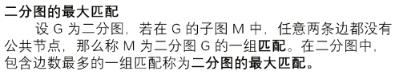
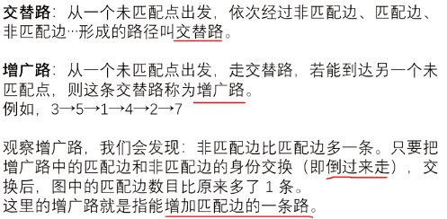
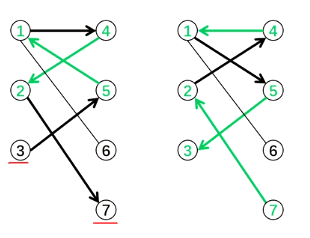

[b23.tv](https://b23.tv/v4GAHA0)
费用流

专题 | 二分图/二部图问题

[b23.tv](https://b23.tv/wEJ5Ozv)
匈牙利算法

# 二分图的最大匹配



二分图（二部图）的最大匹配：

设 $G$ 为二分图 ， 若在 $G $ 的子图 $M $ 中 ， 任意两条边都没有公共节点 ， 那么称 $M $ 为二分图 $G $ 的一组匹配 。 在二分图中 ，包含边数最多的一组匹配称为二分图的最大匹配。

如在下图中，1-4，5-3就是一组匹配。1-4，5-3，2-7就是下图的最大匹配







## 匈牙利算法

匈牙利算法通过不停地找增广路来增加配边找不到增广路时 ， 达到最大匹配 。 可以用 DFS 或 BFS 来实现 。

算法简单，下面结合代码和例题.

### 例题 #1

给定一个二分图，其左部点的个数为 $n$，右部点的个数为 $m$，边数为 $e$，求其最大匹配的边数。

左部点从 $1$ 至 $n$ 编号，右部点从 $1$ 至 $m$ 编号。

输出一行一个整数，代表二分图最大匹配的边数。

对于全部的测试点，保证：

- $1 \leq n, m \leq 500$。

- $1 \leq e \leq 5 \times 10^4$。

- $1 \leq u \leq n$，$1 \leq v \leq m$。

**不保证给出的图没有重边**。

---

```C++
#include<bits/stdc++.h>
using namespace std;
const int N=5e4+5;
int n,m,E,ans;
//int h[N],e[N];
vector <int> e[N];
int vis[N],match[N];
void add(int a,int b){
	e[a].push_back(b);
}
bool dfs(int u){
	for(int i=0;i<e[u].size();i++){//扫描所有可能成为配对的右点（即有连边的点）
		int v=e[u][i];
		if(vis[v])continue;//即（在上一层函数中）已经被访问过
		vis[v]=1;//不是上一层函数中想要的点，那么这一层就可能可以匹配成功
		if(!match[v]||dfs(match[v])){//如果 点v没有任何已有匹配，那么匹配它和u！ 或者它有匹配了(与match[v]),但match[v]可以找到另外一个右点和它匹配,那么就可以把点v让给u (这样可以保证已经有的匹配数不减少,可能会变更,但不减少)(贪心)
			match[v]=u;
			return 1;
		}
	}
	return 0;//扫描全部结束,没有一个匹配成功
}
signed main(){
	cin>>n>>m>>E;
	for(int i=1;i<=E;i++){
		int a,b;
		cin>>a>>b;
		add(a,b);//我们只通过左边找右边，因此只需要单向边
	}
	for(int i=1;i<=n;i++){//遍历每个左边的点给它找配对
		memset(vis,0,sizeof vis);
		if(dfs(i))ans++;//如果找到了配对
	}
	cout<<ans;
	return 0;
}
 
```

详细解释以下片段

```C++
if(vis[v])continue;//即（在上一层函数中）已经被访问过
		vis[v]=1;//不是上一层函数中想要的点，那么这一层就可能可以匹配成功
		if(!match[v]||dfs(match[v])){//如果 点v没有任何已有匹配，那么匹配它和u！ 或者它有匹配了(与match[v]),但match[v]可以找到另外一个右点和它匹配,那么就可以把点v让给u (这样可以保证已经有的匹配数不减少,可能会变更,但不减少)(贪心)
```

先忽略vis[]，当走到判定处，发现match[v]≠0，那么就要去dfs(match[v])，此时从dfs(u)的函数空间走到了dfs(match[v])的函数空间，这时才会出现vis[v]≠0的情况


如果vis[v]≠1了，就说明在dfs(u)函数空间内这个点已经被预定了，match[v]这个点只能另寻他人

**时间复杂度 理论上限O(nm)**


### 例题 #2

给定一个二分图，其点的个数为 $n$，边数为 $e$，求其最大匹配的边数。

输入 $e$ 条边，保证连成的图为二分图

输出一行一个整数，代表二分图最大匹配的边数。

---

(未验证的)

```C++
#include<bits/stdc++.h>
using namespace std;
const int N=5e4+5;
int pleft[N];//0未发现,1为左点，2为右点 
int n,ln,E,ans;
//int h[N],e[N];
vector <int> e[N];
int vis[N],match[N];
void add(int a,int b){
	e[a].push_back(b);
}
bool dfs(int u){
	for(int i=0;i<e[u].size();i++){
		int v=e[u][i];
		if(vis[v])continue;
		vis[v]=1;
		if(!match[v]||dfs(match[v])){
			match[v]=u;
			return 1;
		}
	}
	return 0;
}
signed main(){
	cin>>n>>E;
	for(int i=1;i<=E;i++){
		int a,b;
		cin>>a>>b;
		
		if(&&!pletf[b])add(a,b),pletf[b]=2,pletf[a]=1,ln++;
		
		if(pletf[a]==1||pletf[b]==2)
		if(!pletf[a])ln++;
		add(a,b),pletf[a]=1,pletf[b]=2;
		
		if(pletf[a]==2||pletf[b]==1)
		if(!pletf[b])ln++;
		add(b,a),pletf[a]=2,pletf[b]=1;
		
	}
//	cout<<"OK"<<endl;
	for(int i=1;i<=ln;i++){
		memset(vis,0,sizeof vis);
		if(dfs(i))ans++;
	}
	cout<<ans;
	return 0;
}
 
```

