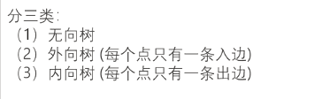
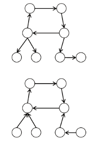
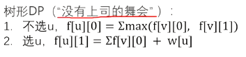

[D28 基环树 P2607 [ZJOI2008] 骑士_哔哩哔哩_bilibili](https://www.bilibili.com/video/BV1Aa411Q7qp/?spm_id_from=333.999.0.0)


# 基环树


### 分类





### 思路


## 例题 #1 [ZJOI2008] 骑士

Z 国的骑士团是一个很有势力的组织，帮会中汇聚了来自各地的精英。他们劫富济贫，惩恶扬善，受到社会各界的赞扬。

最近发生了一件可怕的事情，邪恶的 Y 国发动了一场针对 Z 国的侵略战争。战火绵延五百里，在和平环境中安逸了数百年的 Z 国又怎能抵挡的住 Y 国的军队。于是人们把所有的希望都寄托在了骑士团的身上，就像期待有一个真龙天子的降生，带领正义打败邪恶。

骑士团是肯定具有打败邪恶势力的能力的，但是骑士们互相之间往往有一些矛盾。每个骑士都有且仅有一个自己最厌恶的骑士（当然不是他自己），他是绝对不会与自己最厌恶的人一同出征的。

战火绵延，人民生灵涂炭，组织起一个骑士军团加入战斗刻不容缓！国王交给了你一个艰巨的任务，从所有的骑士中选出一个骑士军团，使得军团内没有矛盾的两人（不存在一个骑士与他最痛恨的人一同被选入骑士军团的情况），并且，使得这支骑士军团最具有战斗力。

为了描述战斗力，我们将骑士按照 $1$ 至 $n$ 编号，给每名骑士一个战斗力的估计，一个军团的战斗力为所有骑士的战斗力总和。

输入格式

第一行包含一个整数 $n$，描述骑士团的人数。

接下来 $n$ 行，每行两个整数，按顺序描述每一名骑士的战斗力和他最痛恨的骑士。

输出格式

应输出一行，包含一个整数，表示你所选出的骑士军团的战斗力。

#### 数据规模与约定

对于 $30\%$ 的测试数据，满足 $n \le 10$；

对于 $60\%$ 的测试数据，满足 $n \le 100$；

对于 $80\%$ 的测试数据，满足 $n \le 10 ^4$。

对于 $100\%$ 的测试数据，满足 $1\le n \le 10^6$，每名骑士的战斗力都是不大于 $10^6$ 的正整数。

### solu

基本环树思想+树形DP

[树形DP](https://flowus.cn/bd161420-d482-42ed-b8cd-59f52c441a9a)

**回顾**



**请思考**

为什么不会形成某个连通块包含多个环的图呢，而仅仅只有可能有连通块是基环树

code

**有向图写法（从u最痛恨的人指向u）**

```C++
/*////////ACACACACACACAC///////////
Code By Ntsc
/*////////ACACACACACACAC///////////
#include<bits/stdc++.h>
using namespace std;
#define int long long
const int N=1e6+5;


int n,m,ver[N],ans,idx,vis[N],r1,r2,zd[N],f[N][2];
struct node{
	int v,nxt;
}e[N];
int h[N];
void add(int a,int b){
	e[++idx]={b,h[a]};
	h[a]=idx;
}
void find(int u,int rt){//找环,原理很简单:从rt不断走,如果走回了rt就说明有环 
	vis[u]=1;
	
	for(int i=h[u];i;i=e[i].nxt){
		int v=e[i].v;
		if(v==rt){
			r1=u,r2=v;return ;//任意找环上2个点即可 
		}
		if(vis[v])continue;//剪枝 
		find(v,rt);
	}
} 
int dfs(int u,int rt){
	f[u][0]=0;f[u][1]=zd[u];
	for(int i=h[u];i;i=e[i].nxt){
		int v=e[i].v;
		if(v==rt)continue;//保证是树不走环(因为原图是基环树,有一个环) .因为构建的是单向边树,因此不用担心往fa走,无需判定和记录 
		dfs(v,rt);//
		f[u][0]+=max(f[v][0],f[v][1]);
		f[u][1]+=f[v][0];
		
	}
	return f[u][0];//因为要在断开的边的2端点u1,u2 各进行一次dfs,因此只返回不选u的最大值,避免 u1,u2同时选 
}
signed main(){
	cin>>n;
	for(int i=1;i<=n;i++){
		int u;
		cin>>zd[i]>>u;
		add(u,i);
	}
	for(int i=1;i<=n;i++){
		if(!vis[i]){//没有被访问，就进去找环 
			r1=r2=0;//记录环的2个端点(即将要断开的边的2端点) 
			find(i,i);//找环	
			if(r1){
				int res1=dfs(r1,r1);//从要断开的边的2端点d其中一个出发 
				int res2=dfs(r2,r2);
				ans+=max(res1,res2);
			}
		}
	}
	cout<<ans<<endl;
	
	return 0;
}

```

**无向图写法**

```C++
/*////////ACACACACACACAC///////////
Code By Ntsc
/*////////ACACACACACACAC///////////
#include<bits/stdc++.h>
using namespace std;
#define int long long
const int N=1e7+5;

int bk_e[N]; 
int n,m,ver[N],ans,idx=1,vis[N],r1,r2,zd[N],f[N][2];//idx=1便于寻找双向边 
struct node{
	int v,nxt;
}e[N];
int h[N];
void add(int a,int b){
	e[++idx]={b,h[a]};
	h[a]=idx;
}
bool find(int u,int in_e){//找环,原理很简单:如果点v在之前已经被访问过,现在又回到了v,说明有环 
	vis[u]=1;
	
	for(int i=h[u];i;i=e[i].nxt){
		int v=e[i].v;
		if(i==(in_e^1))continue;//如果当前u->v的边恰好是fa->u的反向边,则说明走回头路了 
		if(!vis[v]){
			if(find(v,i))return 1;//没访问过,进行往下走 
		}else{//如果点v在之前已经被访问过,现在又回到了v,说明有环 
			r1=u,r2=v;bk_e[i]=bk_e[i^1]=1;return 1; 
			//bk_e标记这一条边(包括其反向边)是要被断开的边 ,后面在dfs时就不能走 
		}
	}
	return 0;
}
int dfs(int u,int in_e){
	vis[u]=1;//
	f[u][0]=0;f[u][1]=zd[u];
	for(int i=h[u];i;i=e[i].nxt){
		int v=e[i].v;
		if(i==(in_e^1)||bk_e[i])continue;//保证是树不走环(因为原图是基环树,有一个环) .因为构建的是无向边树,因此需判定和记录入边in_e 
		dfs(v,i);//
		f[u][0]+=max(f[v][0],f[v][1]);
		f[u][1]+=f[v][0];
		
	}
	return f[u][0];//因为要在断开的边的2端点u1,u2 各进行一次dfs,因此只返回不选u的最大值,避免 u1,u2同时选 
}
signed main(){
	cin>>n;
	for(int i=1;i<=n;i++){
		int u;
		cin>>zd[i]>>u;
		add(u,i);
		add(i,u); 
	}
	for(int i=1;i<=n;i++){
		if(!vis[i]){//没有被访问，就进去找环 
			r1=r2=0;//记录环的2个端点(即将要断开的边的2端点) 
			find(i,0);//找环	
			if(r1){
				int res1=dfs(r1,0);//从要断开的边的2端点d其中一个出发 
				int res2=dfs(r2,0);
				ans+=max(res1,res2);
			}
		}
	}
	cout<<ans<<endl;
	
	return 0;
}

```

很奇怪是是如果这种写法空间开$N=1e6+5$，最后一个点会RE

