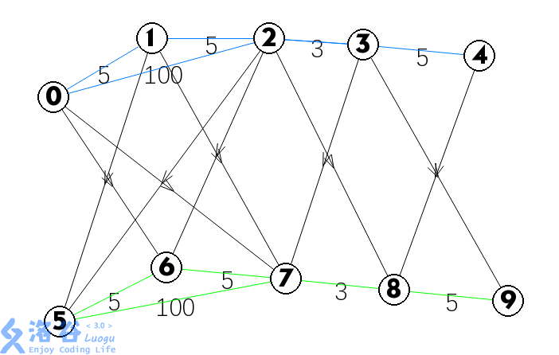
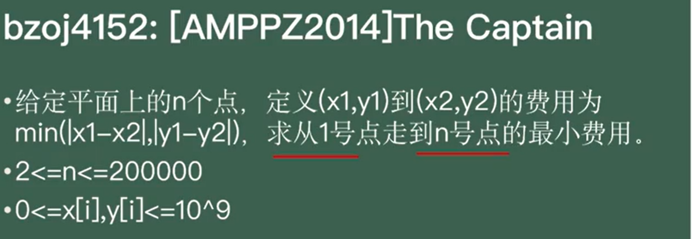

专题 | 存图&最短路&负环

# 目录

- 图的存储方式

- Dijkstra
堆优化Dijkstra

- Bellman-Ford
求总路径条数不多于K条的最短路径

- SPFA
堆优化Dijkstra和SPFA的区别和优缺点

- SPFA判负环

- Floyd弗洛伊德

- Johnson 全源最短路

- 次短路算法/K短路算法

- 其他算法

# 图的存储方式

### 结构体邻接表（链式前向星）

请强记！

```C++
struct edge{
	int v,c,nxt;
}e[N];
int h[N],idx;
void add(int a,int b,int w){
	e[++idx]={b,w,h[a]};
	h[a]=idx;
}
```

### 邻接表（链式前向星）

由以下3个数组组成

```C++
int h[],nxt[],to[]; //头,节点i(i为实际编号)的相邻节点在数组里的编号,节点i的相邻节点的实际编号
int cnt;    //记录节点个数
```

存储

模拟一下（不一定准确）

|插入前|插入9后(连接1,9)|
|-|-|
|h[1]=3|h[1]=4|
|nxt={0,0,2}|nxt={0,0,2,3}|
|cnt=3|cnt=4|

当访问`1`的临边时,让`i=h[1]`,然后不断`v=to[i]` ( `v` 是相邻的点的真实编号), `i=nxt[i]` ,直到`nxt[i]`为空停止.

```C++
void add(int a, int b) {
    to[++cnt] = b;        //新建节点的目标
    nxt[cnt] = h[a];    //头插法
    h[a] = cnt;        //接上
}
```

遍历

当我们要访问一个点的出边时,从`i=h[i]`开始向下`i=nxt[i]`,直到`nxt[i]==0`

```C++
int u=1;    //u是目前节点的编号
for(int i=h[u],i;i=nxt[i]){}
```

### 邻接矩阵

建立矩阵`web[a][b]`,如果`web[a][b]==1`,则表示存在 $ a\to b$ 的路径

可按具体环境改变`web[a][b]`存的内容

### Vector存图

连边（无向图）

```C++
void add(int a,int b){
	e[a].push_back(b);
	e[b].push_back(a);
}

```

访问u的邻点

```C++
for(int i=0;i<e[u].size();i++){
	int v=e[u][i];
}
//或者
for(int v:e[u]){
	
}
```

可以去学习一下`:`的使用方法。同时了解一下`auto`类型的使用方法。

对于有边权的情况，我们要么把vector定义为struct或者pair，要么开第二个vector来同步存其边权。

# 最短路（题面）

## 题目描述

如题，给出一个有向图，请输出从某一点出发到所有点的最短路径长度。

## 输入格式

第一行包含三个整数 $n,m,s$，分别表示点的个数、有向边的个数、出发点的编号。

接下来 $m$ 行每行包含三个整数 $u,v,w$，表示一条 $u \to v$ 的，长度为 $w$ 的边。

## 输出格式

输出一行 $n$ 个整数，第 $i$ 个表示 $s$ 到第 $i$ 个点的最短路径，若不能到达则输出 $2^{31}-1$。

对于 $100\%$ 的数据：$1 \le n \le 10^4$，$1\le m \le 5\times 10^5$，$1\le u,v\le n$，$w\ge 0$，$\sum w< 2^{31}$，保证数据随机。

**两个点之间可能有多条边，敬请注意。**

样例说明：


图片1到3和1到4的文字位置调换

# Dijkstra

·通过已得到最短路径的的点去扩展其他的点，设起点为 s

·设定 `dist[s]=0;dist[v]=inf(v!=s)`

- 找到最小的 `dist [ u ]`（且 u 没有被访问过）此时的 `dist [ u ]`就是起点到该点的最短路（为什么？→之后的dis值一定大于dis_u，不会更新dis_u）

- 更新与 u 相连的点

vector 版本

```C++
#include<bits/stdc++.h>
#define int long long
using namespace std;
const int N=1e6+5;
int vis[N],h[N];
int dis[N],cnt,u,w,n,m,v,s;
struct node {
	int nxt,dis;
};

vector<node> e[N];
priority_queue<pair<int,int>> pq;
void add(int a,int b,int dis) {
	e[a].push_back((node){b,dis});
}

void djstr(int rt) {
	pq.push(make_pair(0,rt));
	int u=rt;	//先从起点开始查
	for(int i=1; i<=n; i++)dis[i]=2147483647;	//初始化边权

	dis[rt]=0;
//	vis[rt]=1;//别写错！！
	
	while(pq.size()) {	//搜完全图
		
		u=pq.top().second;
		
		pq.pop();
		if(vis[u])continue;//记得continue
		vis[u]=1;
		for(int i=0;i<e[u].size();i++){
			int v=e[u][i].nxt,w=e[u][i].dis;
			if(!vis[v]&&dis[u]+w<dis[v]){
				dis[v]=dis[u]+w;	//更新
				pq.push(make_pair(-dis[v],v));
			}
		}
	}
}
signed main() {

	cin>>n>>m>>s;

	for(int i=1; i<=m; i++) {
		cin>>u>>v>>w;
		if(u!=v)add(u,v,w);
	}
	djstr(s);
	for(int i=1; i<=n; i++) {
		cout<<dis[i]<<' ';
	}
	return 0;
}
```

邻接表版本

```C++
#include<bits/stdc++.h>
#define int long long
using namespace std;
const int MAXN=1e6+5;
int vis[MAXN],h[MAXN];
int dis[MAXN],cnt,u,w,n,m,v,s;
struct Edge {
	int next,to,dis;
} edge[MAXN];
priority_queue<pair<int,int>> pq;
void add(int from,int to,int dis) {
	edge[++cnt].next=h[from];
	edge[cnt].to=to;
	edge[cnt].dis=dis;
	h[from]=cnt;
}

void djstr(int rt) {
	pq.push(make_pair(0,rt));
	int u=rt;	//先从起点开始查
	for(int i=1; i<=n; i++)dis[i]=2147483647;	//初始化边权

	dis[rt]=0;
	//for(int i=1; i<=n; i++)
	while(pq.size()) {	//搜完全图
		
		u=pq.top().second;

		pq.pop();
        if(vis[u])continue;
        vis[u]=1;
		for(int j=h[u]; j; j=edge[j].next) {
			if(!vis[edge[j].to]&&dis[u]+edge[j].dis<dis[edge[j].to]){
				dis[edge[j].to]=dis[u]+edge[j].dis;	//更新
				pq.push(make_pair(-dis[edge[j].to],edge[j].to));
			}
				
		}
		
		/*int min=2147483647;
		for(int j=1; j<=n; j++) {	//重新查找到i距离最小的点
			if(!vis[j]&&dis[j]<min) {
				min=dis[j];
				u=j;
			}
		}*/
	}
}
signed main() {

	cin>>n>>m>>s;

	for(int i=1; i<=m; i++) {
		cin>>u>>v>>w;
		if(u!=v)add(u,v,w);
	}
	djstr(s);
	for(int i=1; i<=n; i++) {
		cout<<dis[i]<<' ';
	}
	return 0;
}
```

## 其他问题

> 最短路计数·求 1 号点到其他点的最短路有几条？

每次更新的时候如果dis不变，则该点最短路cnt+1，否则cnt变为1

# Bellman-Ford
求总路径条数不多于K条的最短路径

```C++
#include<bits/stdc++.h>
using namespace std;
int n,m,ans;
int dis[5005],road[5005][5005];

void bellman(){
	
	for(int i=2;i<=n;i++)dis[i]=0x3f3f3f3f;
	dis[1]=0;
	for(int i=1;i<=n;i++){
		int flag=0;
		for(int j=1;j<=m;j++){
			if(dis[j]>dis[i]+road[i][j])dis[j]=dis[i]+road[i][j],flag=1;//如果1->j比1->i->j远，则更新它 
		}
		if(!flag)break;	//如果没有更新则break 
	}
}
int main(){
	memset(road,0x3f3f3f3f,sizeof road);
	cin>>n>>m;
	for(int i=1;i<=m;i++){
		int u,v,w;
		cin>>u>>v>>w;
		road[u][v]=w;
	
	}
	bellman();
	
	for(int i=1;i<=n;i++)cout<<dis[i]<<' ';

    return 0;
}
```

另外一种写法

```C++
#include<bits/stdc++.h>
using namespace std;
int n,m,ans;
int d[5005];
struct node{
	int u,v,w;
}e[5050];
int main(){
	cin>>n>>m;
	for(int i=1;i<=m;i++){
		int c,c2,y;
		cin>>c>>c2>>y;
		e[i].u=c2;e[i].v=c;e[i].w=y;
	
	}
	for(int i=2;i<=n;i++)d[i]=0x3f3f3f3f;
	for(int i=1;i<=n-1;i++){
		for(int j=1;j<=m;j++){
			d[e[j].v]=min(d[e[j].u]+e[j].w,d[e[j].v]);
		}
	}
	for(int i=1;i<=m;i++){
		if(d[e[i].v]>d[e[i].u]+e[i].w){
			printf("NO");return 0;  //有负环
		}
	}
	for(int i=1;i<=n;i++)cout<<d[i]<<' ';

    return 0;
}
```

因为图的最短路径不包含负环或正环，故显然最多只能包含 n−1 条边，于是进行 n−1 次松弛操作。

若经过 n−1 轮松弛操作后仍能松弛，说明图存在负权回路。

# SPFA

```C++
#include<bits/stdc++.h>
#define int long long
using namespace std;
const int MAXN=1e4+5;
int vis[MAXN],h[50*MAXN];
int dis[MAXN],cnt,u,w,n,m,v,s;
struct Edge {
	int next,to,dis;
} edge[MAXN*50];
void add(int from,int to,int dis) {
	edge[++cnt].next=h[from];
	edge[cnt].to=to;
	edge[cnt].dis=dis;
	h[from]=cnt;
}

queue <int> q;

void spfa(int rt) {
	dis[rt]=0;
	vis[rt]=1;
	q.push(rt);
	while(q.size()) {   //类似广搜
		int u=q.front();
		q.pop();
		vis[u]=0;
		for(int i=h[u]; i; i=edge[i].next) {
			int nxt=edge[i].to;
			if(dis[nxt]<=dis[u]+edge[i].dis)continue;
			dis[nxt]=dis[u]+edge[i].dis;
			if(!vis[nxt]) {
				vis[nxt]=1;
				q.push(nxt);
			}
		}
	}

}
signed main() {
//	freopen("P3371_2.in","r",stdin);
//	freopen("test.txt","w",stdout);
	cin>>n>>m>>s;

	for(int i=1; i<=n; i++)dis[i]=2147483647;
//	memset(dis,0x3f,sizeof(dis));
	//cout<<dis[1]<<endl;
	for(int i=1; i<=m; i++) {
		cin>>u>>v>>w;
		add(u,v,w);
	}
	spfa(s);
	for(int i=1; i<=n; i++) {
		cout<<dis[i]<<' ';
	}
	return 0;
}
```


堆优化Dijkstra和SPFA的区别和优缺点：待补充

# SPFA判负环

## 题目描述

给定一个 $n$ 个点的有向图，请求出图中是否存在**从顶点 $1$ 出发能到达**的负环。

负环的定义是：一条边权之和为负数的回路。

## 输入格式

**本题单测试点有多组测试数据**。

输入的第一行是一个整数 $T$，表示测试数据的组数。对于每组数据的格式如下：

第一行有两个整数，分别表示图的点数 $n$ 和接下来给出边信息的条数 $m$。

接下来 $m$ 行，每行三个整数 $u, v, w$。

- 若 $w \geq 0$，则表示存在一条从 $u$ 至 $v$ 边权为 $w$ 的边，还存在一条从 $v$ 至 $u$ 边权为 $w$ 的边。

- 若 $w < 0$，则只表示存在一条从 $u$ 至 $v$ 边权为 $w$ 的边。

## 输出格式

对于每组数据，输出一行一个字符串，若所求负环存在，则输出 `YES`，否则输出 `NO`。

## 样例 #1

### 样例输入 #1

```C++
2
3 4
1 2 2
1 3 4
2 3 1
3 1 -3
3 3
1 2 3
2 3 4
3 1 -8
```

### 样例输出 #1

```C++
NO
YES
```

## 提示

#### 数据规模与约定

对于全部的测试点，保证：

- $1 \leq n \leq 2 \times 10^3$，$1 \leq m \leq 3 \times 10^3$。

- $1 \leq u, v \leq n$，$-10^4 \leq w \leq 10^4$。

- $1 \leq T \leq 10$。

#### 提示

请注意，$m$ **不是**图的边数。

```C++
#include<bits/stdc++.h>
using namespace std;
const int MAXN=2e3+10;

int n,m;
struct Edge{
	int to,w,next;
}edge[MAXN*3];        
int head[MAXN],tot;
inline void Init(){    
	for(int i=0;i<MAXN*3;i++) edge[i].next=0;
	for(int i=0;i<MAXN;i++) head[i]=0;
	tot=0;
}
inline void addedge(int u,int v,int w){
	edge[++tot].to=v;
	edge[tot].w=w;
	edge[tot].next=head[u];
	head[u]=tot;
}

queue<int> Q;
int dis[MAXN],vis[MAXN],cnt[MAXN];
bool spfa(){
	memset(dis,0x3f,sizeof(dis));
	memset(vis,0,sizeof(vis));
	memset(cnt,0,sizeof(cnt));
	dis[1]=0; vis[1]=true;
	Q.push(1);
	while(!Q.empty()){
		int x=Q.front();
		Q.pop();
		vis[x]=false;
		for(int i=head[x];i;i=edge[i].next){
			int y=edge[i].to,z=edge[i].w;
			if(dis[y]>dis[x]+z){
				dis[y]=dis[x]+z; 
				cnt[y]=cnt[x]+1;  
				if(cnt[y]>=n) return true;  
				if(!vis[y]){
					Q.push(y);
					vis[y]=true;
				}
			}
		}
	}
	return false;
}
int main(){
	int T;
	scanf("%d",&T);
	while(T--){
		Init();
		scanf("%d%d",&n,&m);
		for(int i=1;i<=m;i++){
			int u,v,w;
			scanf("%d%d%d",&u,&v,&w);
			addedge(u,v,w);
			if(w>=0) addedge(v,u,w);
		}
		puts(spfa()?"YES":"NO");
	}
	return 0;
}
```

# Floyd

平面上有n个点（n<=100），每个点的坐标均在-10000~10000之间。其中的一些点之间有连线。

若有连线，则表示可从一个点到达另一个点，即两点间有通路，通路的距离为两点间的直线距离。现在的任务是找出从一点到另一点之间的最短路径。

```C++
#include <bits/stdc++.h>
const int inf=1e9;
using namespace std;
int x[105],y[105],n,m,s,t,a,b;
double diss[105][105];
double dis(int i,int j){
	return sqrt((x[i]-x[j])*(x[i]-x[j])+(y[i]-y[j])*(y[i]-y[j]));
}
void flyd(){
	for(int k=1;k<=n;k++)
		for(int i=1;i<=n;i++)
			for(int j=1;j<=n;j++)
				diss[i][j]=min(diss[i][j],diss[i][k]+diss[k][j]);
}
int main() {
	cin>>n;
	for(int k=1;k<=n;k++)
		for(int i=1;i<=n;i++)
			diss[k][i]=inf;
	for(int i=1;i<=n;i++){
		cin>>x[i]>>y[i];
	}
	
	cin>>m;
	for(int i=1;i<=m;i++){
		cin>>a>>b;
		diss[a][b]=diss[b][a]=dis(a,b);
	}
	cin>>s>>t;
	
	
	flyd();
	printf("%.2lf",diss[s][t]);
	return 0;
}
```

luogu 模板

```C++
signed main(){
	
	memset(f,0x3f3f,sizeof f);
	cin>>n>>m;
	for(int i=1;i<=m;i++){
		int u,v,w;
		cin>>u>>v>>w;
		f[u][v]=f[v][u]=w;
	}
	
	for(int k=1;k<=n;k++){
		for(int i=1;i<=n;i++){
			for(int j=1;j<=n;j++){
				if(i==j)f[i][j]=0;
				f[j][i]=f[i][j]=min(f[i][j],f[i][k]+f[k][j]);
			}
		}
	}
	
	for(int i=1;i<=n;i++){
		
		for(int j=1;j<=n;j++)cout<<f[i][j]<<' ';
		cout<<endl;
	}
	return 0;
}
```

## 判最小环

[无向图的最小环问题 - 洛谷](https://www.luogu.com.cn/problem/P6175)


## 传递闭包

给定一张点数为 $n$ 的有向图的邻接矩阵，图中不包含自环，求该有向图的传递闭包。

一张图的邻接矩阵定义为一个 $n\times n$ 的矩阵 $A=(a_{ij})_{n\times n}$，其中

$a_{ij}=\left\{
\begin{aligned}
1,i\ 到\ j\ 存在直接连边\\
0,i\ 到\ j\ 没有直接连边 \\
\end{aligned}
\right.$

一张图的传递闭包定义为一个 $n\times n$ 的矩阵 $B=(b_{ij})_{n\times n}$，其中

$ b_{ij}=\left\{\begin{aligned}1,i\ 可以直接或间接到达\ j\\0,i\ 无法直接或间接到达\ j\\\end{aligned}\right.$

### 大意

判断任意两点之间的连通性

### 代码

```C++
signed main(){
	cin>>n;
	for(int i=1;i<=n;i++){
		
		for(int j=1;j<=n;j++)cin>>f[i][j];
	}
	for(int k=1;k<=n;k++){
		for(int i=1;i<=n;i++){
			for(int j=1;j<=n;j++){
				f[i][j]|=f[i][k]&f[k][j];
              //也可以写f[j][i]=f[i][j]|=f[i][k]&f[k][j];
              //但是不能写f[j][i]|=f[i][k]&f[k][j];
			}
		}
	}
	
	for(int i=1;i<=n;i++){
		
		for(int j=1;j<=n;j++)cout<<f[i][j]<<' ';
		cout<<endl;
	}
	return 0;
}
```

## k路floyd矩阵乘法优化

给定一张 $T$ 条边的无向连通图，求从 $S$ 到 $E$ 经过 $N$ 条边的最短路长度。

**思路**

首先，我们有两个矩阵，如果其中一个矩阵代表恰好经过x条边的最短路，另外一个矩阵代表恰好经过y条边的最短路。那么将这两个矩阵合并就代表恰好经过x+y条边的最短路。怎么合并呢？结合下面这个式子理解一下：

c[i][j]=min(c[i][j],a[i][k]+b[k][j]);

Std

```C++
/*////////ACACACACACACAC///////////
       . Code  by  Ntsc .
       . Earn knowledge .
/*////////ACACACACACACAC///////////

#include <bits/stdc++.h>
#define int long long
#define db double
#define rtn return
using namespace std;

const int N = 5e2 + 5;
const int M = 1e5;
const int MOD = 1e9+7;
const int INF = 1e9+5;

int n, t,s,e,m,vis[M],tot;


#define rd read()
inline int read()
{
	int xx=0,ff=1;
	char ch=getchar();
	while(ch<'0'||ch>'9') {if(ch=='-') ff=-1;ch=getchar();}
	while(ch>='0'&&ch<='9') xx=xx*10+(ch-'0'),ch=getchar();
	return xx*ff;
}
inline void write(int out)
{
	if(out<0) putchar('-'),out=-out;
	if(out>9) write(out/10);
	putchar(out%10+'0');
}


struct node {
	int a[N][N];
	node() {
		memset(a,0x3f3f,sizeof a); //一定要写！
	}
	
	node operator *(const node &x)const{     //重载运算符
	    node z;
		for(int k=1;k<=tot;++k)
	        for(int i=1;i<=tot;++i)
	            for(int j=1;j<=tot;++j)
	                z.a[i][j]=min(z.a[i][j],a[i][k]+x.a[k][j]);
	    return z;
	}
}dis,ans;

signed main() {
//    freopen("tree.in", "r", stdin);
//    freopen("tree.out", "w", stdout);
	cerr<<"OO";
	n=rd;t=rd;s=rd;e=rd;
	
	for(int i=1;i<=t;i++){
		int w=rd,u=rd,v=rd;
		if(!vis[u])vis[u]=++tot;
		if(!vis[v])vis[v]=++tot;
		dis.a[vis[u]][vis[v]]=dis.a[vis[v]][vis[u]]=w;
	}
	
	cerr<<"OK";
	
	n--;
	ans=dis;
	while(n){
		if(n&1)ans=ans*dis;
		dis=dis*dis;
		n>>=1;
	}
	
	cout<<ans.a[vis[s]][vis[e]];
    return 0;
}

```

## 注意伪全源最短路（可用dijkstra跑若干次）

[www.luogu.com.cn](https://www.luogu.com.cn/problem/P5764)


# Johnson 全源最短路

## 题目描述

给定一个包含 $n$ 个结点和 $m$ 条带权边的有向图，求所有点对间的最短路径长度，一条路径的长度定义为这条路径上所有边的权值和。

注意：

1. 边权**可能**为负，且图中**可能**存在重边和自环；

2. 部分数据卡 $n$ 轮 SPFA 算法。

## 输入格式

第 $1$ 行：$2$ 个整数 $n,m$，表示给定有向图的结点数量和有向边数量。

接下来 $m$ 行：每行 $3$ 个整数 $u,v,w$，表示有一条权值为 $w$ 的有向边从编号为 $u$ 的结点连向编号为 $v$ 的结点。

## 输出格式

若图中存在负环，输出仅一行 $-1$。

若图中不存在负环：

输出 $n$ 行：令 $dis_{i,j}$ 为从 $i$ 到 $j$ 的最短路，在第 $i$ 行输出 $\sum\limits_{j=1}^n j\times dis_{i,j}$，注意这个结果可能超过 int 存储范围。

如果不存在从 $i$ 到 $j$ 的路径，则 $dis_{i,j}=10^9$；如果 $i=j$，则 $dis_{i,j}=0$。

## 样例 #1

### 样例输入 #1

```C++
5 7
1 2 4
1 4 10
2 3 7
4 5 3
4 2 -2
3 4 -3
5 3 4
```

### 样例输出 #1

```C++
128
1000000072
999999978
1000000026
1000000014
```

## 样例 #2

### 样例输入 #2

```C++
5 5
1 2 4
3 4 9
3 4 -3
4 5 3
5 3 -2
```

### 样例输出 #2

```C++
-1
```

## 提示

【样例解释】

左图为样例 $1$ 给出的有向图，最短路构成的答案矩阵为：

```C++
0 4 11 8 11 
1000000000 0 7 4 7 
1000000000 -5 0 -3 0 
1000000000 -2 5 0 3 
1000000000 -1 4 1 0 
```

右图为样例 $2$ 给出的有向图，红色标注的边构成了负环，注意给出的图不一定连通。


【数据范围】

对于 $100\%$ 的数据，$1\leq n\leq 3\times 10^3,\ \ 1\leq m\leq 6\times 10^3,\ \ 1\leq u,v\leq n,\ \ -3\times 10^5\leq w\leq 3\times 10^5$。

对于 $20\%$ 的数据，$1\leq n\leq 100$，不存在负环（可用于验证 Floyd 正确性）

对于另外 $20\%$ 的数据，$w\ge 0$（可用于验证 Dijkstra 正确性）

upd. 添加一组 Hack 数据：针对 SPFA 的 SLF 优化

```C++
#include<bits/stdc++.h>
using namespace std;
#define int long long
const int MAXN=3e3+5,INF=1000000000;
//spfa定义部分
int dis[MAXN],cntt[MAXN];
//djstr定义部分
int ddis[MAXN];

int n,vis[MAXN],cnt,u,w,m,v;	//注意：cnt-边的数量；cntt[]-记录现在这条路走过了多少节点
//邻接表定义部分
int h[MAXN];	//head
struct edge {
	int from,next,to,dis;
} edge[MAXN<<2];

void add(int from,int to,int dis) {	//邻接表

	edge[++cnt].next=h[from];
	edge[cnt].from=from;
	edge[cnt].to=to;
	edge[cnt].dis=dis;
	h[from]=cnt;
}


//求距离
void djstr(int rt) {
	priority_queue<pair<int,int>> pq;
	for(int i=1; i<=n; i++)ddis[i]=INF;	//初始化边权
	memset(vis,0,sizeof(vis));	//记得初始化，因为djstl要循环n次
	pq.push(make_pair(0,rt));	//先从起点开始
	ddis[rt]=0;

	while(pq.size()) {	//搜完全图
		u=pq.top().second;	//取点,并且是当前队列里最小的
		pq.pop();	//记得弹出哦!
		if(vis[u])
			continue;
		vis[u]=1;

		for(int j=h[u]; j; j=edge[j].next) {
			if(ddis[u]+edge[j].dis<ddis[edge[j].to]) {
				ddis[edge[j].to]=ddis[u]+edge[j].dis;	//更新
				if(!vis[edge[j].to])
					pq.push(make_pair(-ddis[edge[j].to],edge[j].to));	//默认是大根堆,于是距离要存负数,起到小根堆的作用.距离要存在pair的first
			}
		}
	}
}


//SPFA用来判断负环！！！

bool spfa() {

	queue <int> q;	//队列存点
	for(int i=1; i<=n; i++)dis[i]=INF;	//记得初始化
	q.push(0);	//首先把起点放进去
	dis[0]=0;
	vis[0]=1;

	while(q.size()) {	//循环,一直到没有点可以访问
		int u=q.front();
		q.pop();
		vis[u]=0;
		for(int i=h[u]; i; i=edge[i].next) {	//遍历出边
			int nxt=edge[i].to;
			if(dis[nxt]<=dis[u]+edge[i].dis)continue;	//如果原来的更优,跳过
			dis[nxt]=dis[u]+edge[i].dis;	//更新距离
			if(!vis[nxt]) {		//如果没有访问过
				q.push(nxt);
				vis[nxt]=1;

				if(++cntt[nxt]>n) // n+1结点，随便更新现在这条路走过了多少节点，如果大于总节点数，则有负环
					return 0;
			}
		}
	}
	return 1;
}
signed main() {
	cin>>n>>m;
	for(int i=1; i<=n; i++)dis[i]=INF;
	for(int i=1; i<=m; i++) {	//邻接表建边
		cin>>u>>v>>w;
		add(u,v,w);
	}
	for(int i=1; i<=n; i++)	//不理解？？？
		add(0,i,0);
	if(!spfa()) {	//存在负环
		cout<<-1;
		return 0;
	}
	//不存在负环
	for(int i=1; i<cnt; i++)
		edge[i].dis+=dis[edge[i].from]-dis[edge[i].to];
	for(int i=1; i<=n; i++) {	//每个点开始一遍djstr
		djstr(i);
		int ans=0;
		for(int j=1; j<=n; j++) {
			if(ddis[j]==INF)
				ans+=j*INF;		//i到不了j
			else
				ans+=j*(ddis[j]-(dis[i]-dis[j]));	//按题目要求求和
		}
		cout<<ans<<endl;
	}
	return 0;
}
```

# 次短路算法/K短路算法

每次更新时，优先更新最短路，若能更新最短路，就令次短路等于之前的最短路，再更新最短路

## 次短路 | 集合位置

题目描述

每次有大的活动，大家都要在一起“聚一聚”，不管是去好乐迪，还是避风塘，或者汤姆熊，大家都要玩的痛快。还记得心语和花儿在跳舞机上的激情与释放，还记得草草的投篮技艺是如此的高超，还记得狗狗的枪法永远是'S'……还有不能忘了，胖子的歌声永远是让我们惊叫的！！

今天是野猫的生日，所以想到这些也正常，只是因为是上学日，没法一起去玩了。但回忆一下那时的甜蜜总是一种幸福嘛。。。

但是每次集合的时候都会出现问题！野猫是公认的“路盲”，野猫自己心里也很清楚，每次都提前出门，但还是经常迟到，这点让大家很是无奈。后来，野猫在每次出门前，都会向花儿咨询一下路径，根据已知的路径中，总算能按时到了。

现在提出这样的一个问题：给出 $n$ 个点的坐标，其中第一个为野猫的出发位置，最后一个为大家的集合位置，并给出哪些位置点是相连的。野猫从出发点到达集合点，总会挑一条最近的路走，如果野猫没找到最近的路，他就会走第二近的路。请帮野猫求一下这条第二最短路径长度。

输入格式

第一行是两个整数 $n(1 \le n \le 200)$ 和 $m$，表示一共有 $n$ 个点和 $m$ 条路，以下 $n$ 行每行两个数 $x_i$，$y_i$，$(-500 \le x_i,y_i \le 500),$ 代表第 $i$ 个点的坐标，再往下的 $m$ 行每行两个整数 $p_j$，$q_j,(1 \le p_j,q_j \le n)$，表示两个点相通。

### 正确算法

我们采用删边的思想，先跑一遍最短路，记录路径。

然后依次删去最短路径上每一条边，分别跑一遍最短路，取所有答案中的最小值即可。

```C++
#include<bits/stdc++.h>
#define int long long
using namespace std;
const int N=1e6+5;
const int INF=1e9+5;
int vis[N],h[N],used[N],lst[N];
int cnt,u,w,n,m,v,s;
#define pdi pair<double,int>
using namespace std;
struct node{
	double x,y;
	int head;
	double dis;
	int pre;
}node[205];
struct edge{
	int nxt,to; 
	double dis;
}edge[50005];
double ans=INF<<1;
double calc(double a,double b,double c,double d){
	return (double)sqrt(double(a-c)*double(a-c)+double(b-d)*double(b-d));
}
//距离公式，注意数据类型
void addEdge(int u,int v,double w){
	edge[++cnt].dis=w;
	edge[cnt].to=v;
	edge[cnt].nxt=node[u].head;
	node[u].head=cnt;
}
priority_queue<pdi,vector<pdi>,greater<pdi> >pq;
void djkstr(int x,int y){
	for(int i=1;i<=n;i++){
		node[i].dis=INF;
	}
	node[1].dis=0;
	pq.push({0,1});
	while(pq.size()){
		pdi tmp=pq.top();
		pq.pop();
		double d=tmp.first;
		int u=tmp.second;
		if(node[u].dis!=d)continue;
		for(int e=node[u].head;e;e=edge[e].nxt)	{
			int v=edge[e].to;
			if((u==x&&v==y)||(u==y&&v==x))continue;
			if(node[v].dis<=d+edge[e].dis) continue;
			if(x==-1&&y==-1)node[v].pre=u;
			node[v].dis=d+edge[e].dis;
			pq.push({node[v].dis,v});
		}
	}
}
signed main(){
	scanf("%lld%lld",&n,&m);
	for(int i=1;i<=n;i++){
		scanf("%lf%lf",&node[i].x,&node[i].y);
	}

	for(int i=1,u,v;i<=m;i++){
		scanf("%lld%lld",&u,&v);
		double w=calc(node[u].x,node[u].y,node[v].x,node[v].y);
		addEdge(u,v,w);
		addEdge(v,u,w);
	}

	djkstr(-1,-1);

	for(int i=n;i!=1;i=node[i].pre)	{
		djkstr(i,node[i].pre);
		ans=min(ans,node[n].dis);
	}
	if(ans>=INF)puts("-1");
	else printf("%.2lf\n",ans);
	return 0;
}
```

---

以下是未验证的其他算法

### 写法1

```C++
#include<bits/stdc++.h>
#define int long long
using namespace std;
const int N=1e6+5;
const int INF=1e9+5;
int vis[N],h[N],used[N],lst[N];
int cnt,u,w,n,m,v,s;

double ans=INF,dis[3][N];
struct node {
	int nxt;
	double dis;
};

struct point {
	double x,y;
}p[N];

double getdis(int a,int b){
	return sqrt((p[a].x-p[b].x)*(p[a].x-p[b].x)+(p[a].y-p[b].y)*(p[a].y-p[b].y));
}

vector<node> e[N];
priority_queue<pair<double,int>> pq;
void add(int a,int b,double dis) {
	
//	cerr<<dis<<endl;
	e[a].push_back((node){b,dis});
	e[b].push_back((node){a,dis});
}

void djstr(int rt,int k) {
	pq.push(make_pair(0.00,rt));
	int u=rt;	//先从起点开始查
	for(int i=1; i<=n; i++)dis[k][i]=INF;	//初始化边权

	dis[k][rt]=0.0;
//	vis[rt]=1;//别写错！！
	
	while(pq.size()) {	//搜完全图
		
		u=pq.top().second;
		
		pq.pop();
		if(vis[u])continue;//记得continue
		vis[u]=1;
		for(int i=0;i<e[u].size();i++){
			int v=e[u][i].nxt;
			double w=e[u][i].dis;
			if(!vis[v]&&dis[k][u]+w<dis[k][v]){
				dis[k][v]=dis[k][u]+w;	//更新
//				cerr<<dis[k][v]<<endl;
				pq.push(make_pair(-dis[k][v],v));
				if(k==0)lst[v]=u;
			}
		}
	}
}
signed main() {

	cin>>n>>m;

	for(int i=1;i<=n;i++){
		cin>>p[i].x>>p[i].y;
	}
	for(int i=1;i<=m;i++){
		int a,b;
		cin>>a>>b;
		add(a,b,getdis(a,b));
	}
	djstr(1,0);
//	cerr<<"OK";
	memset(vis,0,sizeof vis);
	
	djstr(n,1);
	
//	for(int i=1;i<=n;i++){
//		cerr<<lst[i]<<' ';
//	}
//	
	for(int i=n;i;i=lst[i]){
		used[i]=1;
	}
//	cerr<<"YES";
	for(int i=1;i<=n;i++){
		if(used[i])continue;
//		cerr<<i<<"has ans="<<dis[0][i]+dis[1][i]<<endl;
		ans=min(ans,dis[0][i]+dis[1][i]);
	}
	double mx=INF;
	if(mx==ans)cout<<-1;
	else printf("%.2lf",ans);
	return 0;
}
```

### 写法2

```C++
#include<bits/stdc++.h>
#define int long long
using namespace std;
const int N=1e6+5;
const int INF=1e9+5;
int vis[N],h[N],used[N],lst[N];
int cnt,u,w,n,m,v,s;

double ans=INF,dis[N],sdis[N];
struct node {
	int nxt;
	double dis;
};

struct point {
	double x,y;
}p[N];

double getdis(int a,int b){
	return sqrt((p[a].x-p[b].x)*(p[a].x-p[b].x)+(p[a].y-p[b].y)*(p[a].y-p[b].y));
}

vector<node> e[N];
priority_queue<pair<double,int>> pq;
void add(int a,int b,double dis) {
	
//	cerr<<dis<<endl;
	e[a].push_back((node){b,dis});
	e[b].push_back((node){a,dis});
}

void merge(int x,double d){
	// cerr<<"mer p:"<<x<<" d="<<d<<endl;
	if(dis[x]>d){
		sdis[x]=min(sdis[x],dis[x]);
		dis[x]=d;
	}else if(sdis[x]>d)sdis[x]=d;
}

void djstr(int rt) {
	pq.push(make_pair(0.00,rt));
	int u=rt;	//先从起点开始查
	for(int i=1; i<=n; i++)dis[i]=INF;	//初始化边权
	for(int i=1; i<=n; i++)sdis[i]=INF;	//初始化边权

	dis[rt]=0.0;
//	vis[rt]=1;//别写错！！
	
	while(pq.size()) {	//搜完全图
		
		u=pq.top().second;
		
		pq.pop();
		if(vis[u])continue;//记得continue
		vis[u]=1;
		for(int i=0;i<e[u].size();i++){
			int v=e[u][i].nxt;
			double w=e[u][i].dis;
			if(!vis[v]&&dis[u]+w<sdis[v]){
				// dis[v]=dis[u]+w;	//更新
				merge(v,dis[u]+w);
//				cerr<<dis[v]<<endl;
				pq.push(make_pair(-dis[v],v));
			}
		}
	}
}
signed main() {

	cin>>n>>m;

	for(int i=1;i<=n;i++){
		cin>>p[i].x>>p[i].y;
	}
	for(int i=1;i<=m;i++){
		int a,b;
		cin>>a>>b;
		add(a,b,getdis(a,b));
	}
	djstr(1);
	double mx=INF;
	ans=sdis[n];
	// cerr<<dis[n]<<' '<<sdis[n]<<endl;
	if(mx==ans)cout<<-1;
	else printf("%.2lf",ans);
	return 0;
}
```

## K短路 | [SCOI2007] k短路

有 $n$ 个城市和 $m$ 条单向道路，城市编号为 $1$ 到 $n$。每条道路连接两个不同的城市，且任意两条道路要么起点不同要么终点不同，因此 $n$ 和 $m$ 满足$m \le n(n-1)$。

给定两个城市 $a$ 和 $b$，可以给 $a$ 到 $b$ 的所有简单路（所有城市最多经过一次，包括起点和终点）排序：先按长度从小到大排序，长度相同时按照字典序从小到大排序。你的任务是求出 $a$ 到 $b$ 的第 $k$ 短路。

输入格式

输入第一行包含五个正整数 $n,m,k,a,b$。

以下 $m$ 行每行三个整数 $u,v,l$，表示从城市 $u$ 到城市 $v$ 有一条长度为 $l$ 的单向道路。

输出格式

如果 $a$ 到 $b$ 的简单路不足 $k$ 条，输出 `No`，否则输出第 $k$ 短路：从城市 $a$ 开始依次输出每个到达的城市，直到城市 $b$，中间用减号 `-` 分割。

- $100\%$ 的数据满足：$2\leq n\leq 50$，$1\leq k\leq 200$，$1\le l\le 10^4$。

# 各种最短路算法的Hack与区别

我们给出以下题目来探讨这个问题。

## [APIO2013] 出题人

题目描述

当今世界上各类程序设计竞赛层出不穷。而设计一场好比赛绝非易事，比如给题目设计测试数据就是一项挑战。一组好的测试数据需要对不同的程序有区分度：满足所有要求的程序自然应该得到满分，而那些貌似正确的程序则会在某些特殊数据上出错。

在本题中，你在比赛中的角色反转啦！作为一名久经百战的程序员，你将帮助 Happy Programmer Contest 的命题委员会设计这次比赛的测试数据。本次比赛命题委员会选择了两个图论问题，分为 $8$ 个子任务。委员会写了一些貌似可以解决这些子任务的代码。在给任务设计数据的时候，命题委员会期望其中的一些源程序能够得到满分，而另外的一些则只能得到 $0$ 分或者少许的部分分。现在你将会获得这些源程序（C, C++, Pascal 版本）。对于每个子任务，你需要去产生一组数据 $X$ 使得它能将该任务给定的 $2$ 种源程序 $A$ 和 $B$ 区分开来。更具体地说，生成的数据必须满足如下两个条件:

输入 $X$ 对于源程序 $A$ 一定不会出现超出时间限制（TLE）的问题。

输入 $X$ 一定会导致源程序 $B$ 产生超出时间限制的问题。

此外,命题委员喜欢较小规模的测试数据，希望测试数据最好能够包含不超过 $T$ 个整数。

本题中只关心源程序 $A$ 和 $B$ 是否超时，不关心是否结果正确。

命题委员会选择了单源最短路（SSSP）以及一个被称之为神秘问题（Mystery）的两个图论问题来作为比赛的题目。我们将命题委员会完成的伪代码列在了附录中，而具体的 C、C++ 和 Pascal 源程序被我们放在了下发的文件当中。

### 子任务

参见下表。表中每一行描述了一个子任务。其中前六个子任务与单源最短路相关，子任务 7,8 与神秘问题相关。每个任务所占分数见下表。


### 思路

我们要让A通过且B出现TLE。

## Dijkstra和Floyd

卡Floyd，最好的方法就是从复杂度入手。这里我们可以构造一个含有101个点的输入，就可以卡掉了

## 干Bellman-ford：

复杂度Θ(QVE)，来个负权，再来一堆自环/重边，人肉二分保证数据不超过T，且让Bellman-ford刚刚超过一丁点，就可以了，

第2个点要Floyd过，V=100即可。

第5个点要Dijkstra过，那么就让0号点到299号点连正权边，其它点搞一堆负环+自环+重边，Bellman-ford轻松干掉。

## 干Dijkstra：

说了Dijkstra看到负权就GG，所以构造一堆0边诱惑他，然后再让他从右边的点进去，举个栗子：

V=0,1,2,3,4  D,E=(0,1,2),(1,2,-4),(2,3,1),(3,4,-2),(0,2,0),(2,4,0)

那么就先把它拐到4，发现路长为0，然后走2~3是最短的，拐到3，开始觉醒后，发现0~1再到2，路长为-2，再走2~3，傻傻地Dijkstra就被坑了，

## 干染色图算法


# 相关算法浅谈

## 差分约束算法

对于$ xj​−xi​≤k$，我们会发现它类似最短路网络中的三角不等式 $dv​−du​≤w_{<u,v>}$​，那是否可以通过最短路的形式解决呢？

显然是可以的，跑一遍最短路，此时最短路的答案 $d_i​$ 也正是原不等式组的一个解 $x_i​$。


**题目描述**

给出一组包含 $m$ 个不等式，有 $n$ 个未知数的形如：

$ \begin{cases} x_{c_1}-x_{c'_1}\leq y_1 \\x_{c_2}-x_{c'_2} \leq y_2 \\ \cdots\\ x_{c_m} - x_{c'_m}\leq y_m\end{cases}$

的不等式组，求任意一组满足这个不等式组的解。

**输入格式**

第一行为两个正整数 $n,m$，代表未知数的数量和不等式的数量。

接下来 $m$ 行，每行包含三个整数 $c,c',y$，代表一个不等式 $x_c-x_{c'}\leq y$。

**输出格式**

一行，$n$ 个数，表示 $x_1 , x_2 \cdots x_n$ 的一组可行解，如果有多组解，请输出任意一组，无解请输出 `NO`。


```C++
#include<bits/stdc++.h>
using namespace std;
int n,m,ans;
int d[5005];
struct node{
	int u,v,w;
}e[5050];
int main(){
	cin>>n>>m;
	for(int i=1;i<=m;i++){
		int c,c2,y;
		cin>>c>>c2>>y;
		e[i].u=c2;e[i].v=c;e[i].w=y;
	
	}
	for(int i=2;i<=n;i++)d[i]=0x3f3f3f3f;
	for(int i=1;i<=n-1;i++){
		for(int j=1;j<=m;j++){
			d[e[j].v]=min(d[e[j].u]+e[j].w,d[e[j].v]);
		}
	}
	for(int i=1;i<=m;i++){
		if(d[e[i].v]>d[e[i].u]+e[i].w){
			printf("NO");return 0;
		}
	}
	for(int i=1;i<=n;i++)cout<<d[i]<<' ';

    return 0;
}
```

**练习**

[www.luogu.com.cn](https://www.luogu.com.cn/problem/P3275)


# 一些题目

## 分层图思想


[www.luogu.com.cn](https://www.luogu.com.cn/problem/P5663)


P5663 [CSP-J2019] 加工零件

**思路**

我们该如何解决问题？

> 问题：a做k阶段的零件b要不要做呢？

其实，实质就是看a到b有没有长度为k的路径。

同时我们会发现，**如果a到b有长度为k的路径，那么a到b一定有长度为k+2的路径，但并不一定有长度为k+1的路径。**（因为我们可以来回走一条边）

所以，我们要对每个点求一遍奇数路径，和偶数路径（这里求最短路就行）。

```C++
/*
CB Ntsc
*/

#include<bits/stdc++.h>
using namespace std;
#define int long long
#define mp make_pair

const int N=2e5+5;
const int INF=1e9+5;
const int MOD=1e9+7;
bool f1;
int dis1[N],dis2[N];
int l[N],r[N];
int q,n,m,ans,T,k;
vector<int>e[N];
bool f2;
#define rd read()
inline int read()
{
	int xx=0,ff=1;
	char ch=getchar();
	while(ch<'0'||ch>'9') {if(ch=='-') ff=-1;ch=getchar();}
	while(ch>='0'&&ch<='9') xx=xx*10+(ch-'0'),ch=getchar();
	return xx*ff;
}
inline void write(int out)
{
	if(out<0) putchar('-'),out=-out;
	if(out>9) write(out/10);
	putchar(out%10+'0');
}

void add(int a,int b){
	e[a].push_back(b);
    e[b].push_back(a);
}
priority_queue<pair<int,int> >pq;
void djstr() {
	for(int i=1; i<=n; i++)dis1[i]=INF;	//初始化边权
	for(int i=1; i<=n; i++)dis2[i]=INF;	//初始化边权
	
	for(auto v:e[1]){
		dis1[v]=1;
		pq.push(make_pair(-1,v));
	}
	while(pq.size()) {	//搜完全图
		
		int u=pq.top().second;
		int w=-pq.top().first;
		
		pq.pop();
		// if(vis[u])continue;//记得continue
		// vis[u]=1;
		for(int i=0;i<e[u].size();i++){
			int v=e[u][i];
			if(w%2){
				if(dis2[v]>1+w){
					dis2[v]=w+1;	//更新
					pq.push(make_pair(-dis2[v],v));
				}
			}else{
				if(dis1[v]>1+w){
                    dis1[v]=w+1;    //更新
                    pq.push(make_pair(-dis1[v],v));
                }
			}
			
		}
	}
}

signed main(){

	n=rd;m=rd;q=rd;
	for(int i=1;i<=m;i++){
		int u=rd,v=rd;
		add(u,v);
	}

	djstr();
	for(int i=1;i<=q;i++){
		int a=rd;l[a]=rd;
		if(l[a]%2){
			if(dis1[a]>l[a])cout<<"No\n";
			else cout<<"Yes\n";
		}else{
			if(dis2[a]>l[a])cout<<"No\n";
            else cout<<"Yes\n";
		}
	}
    
    return 0;
}
```

[www.luogu.com.cn](https://www.luogu.com.cn/problem/P4568)


P4568 [JLOI2011] 飞行路线

**思路**

套路题，分层图。

以样例为例（使用 @EternalAlexander 这位dalao的OI Painter绘制）：



各层内部正常连边，各层之间从上到下连权值为0的边。每向下跑一层，就相当于免费搭一次飞机。跑一遍从$s$到$t+n\times k$的最短路即可。

> 引用自[SuperJvRuo](https://www.luogu.com.cn/user/53374)

我们要考虑枚举每一层的t，因为可能我们用不到k次免费机会。

```C++
/*
CB Ntsc
*/

#include<bits/stdc++.h>
using namespace std;
#define int long long
#define mp make_pair
#define pii pair<int,int> 

const int N=5e3+5;
const int INF=1e9+5;
const int MOD=998244353;
bool f1;
struct node{
	int nxt,dis;
};
vector<node>e[N];
priority_queue<pair<int,int> >pq;
int n,vis[N],dis[N],m,k,s,t;
bool f2;
#define rd read()
inline int read()
{
	int xx=0,ff=1;
	char ch=getchar();
	while(ch<'0'||ch>'9') {if(ch=='-') ff=-1;ch=getchar();}
	while(ch>='0'&&ch<='9') xx=xx*10+(ch-'0'),ch=getchar();
	return xx*ff;
}
inline void write(int out)
{
	if(out<0) putchar('-'),out=-out;
	if(out>9) write(out/10);
	putchar(out%10+'0');
}

void add(int a,int b,int c){
	e[a].push_back({b,c});
}


void djstr(int rt) {
	pq.push(make_pair(0,rt));
	int u=rt;	//先从起点开始查
	memset(dis,0x3f3f,sizeof dis);	//初始化边权

	dis[rt]=0;
	
	while(pq.size()) {	//搜完全图
		
		u=pq.top().second;
		
		pq.pop();
		if(vis[u])continue;//记得continue
		vis[u]=1;
		for(int i=0;i<e[u].size();i++){
			int v=e[u][i].nxt,w=e[u][i].dis;
			if(!vis[v]&&dis[u]+w<dis[v]){
				dis[v]=dis[u]+w;	//更新
				pq.push(make_pair(-dis[v],v));
			}
		}
	}
}

signed main(){

	// freopen("school.in", "r", stdin);
	// freopen("school.out", "w", stdout);

	n=rd;m=rd;k=rd;
	s=rd;t=rd;
	for(int i=1;i<=m;i++){
		int a=rd,b=rd,c=rd;
		add(a,b,c);
		add(b,a,c);

		for(int j=1;j<=k;j++){//建k层图
			add(a+(j-1)*n,b+(j*n),0);
			add(b+(j-1)*n,a+(j)*n,0);
			add(a+j*n,b+j*n,c);
			add(b+j*n,a+j*n,c);
		}
	}
    
	djstr(s);
	int ans=INF;
	for(int i=0;i<=k;i++)ans=min(ans,dis[t+i*n]);

	cout<<ans;//dis[t+k*n];


    return 0;
}

/*
5 3 3
2 3 4 7 6
*/
```

更多例题

[www.luogu.com.cn](https://www.luogu.com.cn/problem/P2939)


[www.luogu.com.cn](https://www.luogu.com.cn/problem/P4822)




## **同余最短路 |** P2371 [国家集训队] 墨墨的等式

[www.luogu.com.cn](https://www.luogu.com.cn/problem/P2371)


**思路**

首先我们应该想到的是完全背包吧……但b过大，我们不能这样做。

[www.luogu.com.cn](https://www.luogu.com.cn/blog/xuxing/solution-p2371)


Std

```C++
/*
CB Ntsc
*/

#include<bits/stdc++.h>
using namespace std;
#define int long long
#define mp make_pair
#define pii pair<int,int> 

const int N=5e5+5;
const int INF=1e9+5;
const int MOD=998244353;
bool f1;
struct node{
	int nxt,dis;
};
vector<node>e[N];
priority_queue<pair<int,int> >pq;
int n,vis[N],dis[N],m,k,s,t;
int mn=INF,l,r,a[N];
bool f2;
#define rd read()
inline int read()
{
	int xx=0,ff=1;
	char ch=getchar();
	while(ch<'0'||ch>'9') {if(ch=='-') ff=-1;ch=getchar();}
	while(ch>='0'&&ch<='9') xx=xx*10+(ch-'0'),ch=getchar();
	return xx*ff;
}
inline void write(int out)
{
	if(out<0) putchar('-'),out=-out;
	if(out>9) write(out/10);
	putchar(out%10+'0');
}

void add(int a,int b,int c){
	e[a].push_back({b,c});
}


void djstr(int rt) {
	pq.push(make_pair(0,rt));
	int u=rt;	//先从起点开始查
	memset(dis,0x3f3f,sizeof dis);	//初始化边权

	dis[rt]=0;
	
	while(pq.size()) {	//搜完全图
		
		u=pq.top().second;
		
		pq.pop();
		if(vis[u])continue;//记得continue
		vis[u]=1;
		for(int i=0;i<e[u].size();i++){
			int v=e[u][i].nxt,w=e[u][i].dis;
			if(!vis[v]&&dis[u]+w<dis[v]){
				dis[v]=dis[u]+w;	//更新
				pq.push(make_pair(-dis[v],v));
			}
		}
	}
}

int query(int x){
	int res=0;
	for(int i=0;i<mn;i++){
		if(dis[i]<=x)res+=(x-dis[i])/mn+1;
	}
	return res;
}
signed main(){

	// freopen("school.in", "r", stdin);
	// freopen("school.out", "w", stdout);

	n=rd;l=rd;r=rd;
	for(int i=1;i<=n;i++){
		int x=rd;
		if(x){//跳过a[i]=0
			a[++m]=x;
			mn=min(mn,x);
		}
	}
	
	
	
	for(int i=0;i<mn;i++){
		for(int j=1;j<=m;j++){
			if(a[j]!=mn)add(i,(i+a[j])%mn,a[j]);
		}
	}
//	cerr<<mn<<endl;
	djstr(0);
//	cerr<<"ok\n";
	cout<<query(r)-query(l-1);


    return 0;
}

/*
5 3 3
2 3 4 7 6
*/
```

### 扩展练习

[www.luogu.com.cn](https://www.luogu.com.cn/problem/P3403)


# 乱七八糟的代码

这是Dijkstra

```

#include<bits/stdc++.h>

 

using namespace std;

 

const int N = 507 , M = 100005;

 

int n , m;

int g[N][N];

int dis[N];

bool st[N];

 

int Dijkstra(){

memset(dis , 0x3f , sizeof(dis));//距离初始化

dis[1] = 0;

for(int i = 0 ; i < n ; i++)

{

int t = -1;//求最小值

for(int j = 1 ; j <= n ; j++)

{

if(!st[j] && (t == -1 || dis[t] > dis[j]))//j点需要保证还没有确定最短路

{//注意，这个t == -1非常的精髓（小特判）

t = j;//更新最小值的点

}

}

st[t] = true;//最小值点确定

for(int j = 1 ; j <= n ; j++)

{//假如两点之间没有边，g[t][j]就是无穷大，一定取不到min所以不必判断t，j之间是否有边

dis[j] = min(dis[j] , dis[t] + g[t][j]);//更新每一个点的值

}

}

if(dis[n] == 0x3f3f3f3f)

{

return -1;

}

else

{

return dis[n];

}

}

 

int main(){

ios::sync_with_stdio(false);cin.tie(0);cout.tie(0);

cin >> n >> m;

memset(g , 0x3f , sizeof(g));//图初始化

int a , b , c;

for(int i = 1 ; i <= m ; i++)

{

cin >> a >> b >> c;

g[a][b] = min(g[a][b] , c);//保留短的边

}

cout << Dijkstra();

 

return 0;

}

 ```

 

 

优化版Dijkstra

#include<bits/stdc++.h>

 

using namespace std;

 

typedef pair<int , int> PII;

 

const int N = 200010;

 

int n , m;

int head[N] , e[N] , ne[N] , w[N] , idx;

int dis[N];

bool st[N];

 

int Dijkstra_plus(){

memset(dis , 0x3f , sizeof(dis));//距离初始化

dis[1] = 0;

 

priority_queue<PII , vector<PII> , greater<PII>> heap;//第一个放距离，第二个放编号

heap.push({0 , 1});//第一个点初始化

while(heap.size())

{

auto t = heap.top();//取出最小值

heap.pop();//去掉最小值

int num = t.second , dist = t.first;

if(st[num])//这个玩意儿已经被遍历过了

{

continue;

}

st[num] = true;//开搜

for(int i = head[num] ; i != -1 ; i = ne[i])

{

int j = e[i];

if(dis[j] > dist + w[i])//距离可以更新，还可以顺便将没有联通的边不进行更新

{

dis[j] = dist + w[i];

heap.push({dis[j] , j});//将更新后的点放进堆

}

}

}

 

if(dis[n] == 0x3f3f3f3f)

{

return -1;

}

else

{

return dis[n];

}

}

 

void add(int x , int y , int z){

e[idx] = y;

ne[idx] = head[x];

head[x] = idx;

w[idx] = z;//存储权重

idx++;

}

 

int main(){

ios::sync_with_stdio(false);cin.tie(0);cout.tie(0);

cin >> n >> m;

memset(head , -1 , sizeof(head));

memset(w , 0x3f , sizeof(w));

int a , b , c;

for(int i = 1 ; i <= m ; i++)

{

cin >> a >> b >> c;

add(a , b , c);//保留短的边

}

cout << Dijkstra_plus();

 

return 0;}~

Bellman-Ford算法

#include<bits/stdc++.h>

 

using namespace std;

 

const int N = 507 , M = 10007;

 

int n , m , k;

int dis[N] , backup[N];

//备份数组的作用在于，在每一次更新中，为保证不会串联（j-1不会影响j）

//我们需要在下一次迭代中只使用上一次迭代的图的状态

struct edge

{

int a , b , w;

}edges[M];//简易对图进行存储

 

int bellman_ford(){

memset(dis , 0x3f , sizeof(dis));

dis[1] = 0;

for(int i = 1 ; i <= k ; i++)

{

memcpy(backup , dis , sizeof(dis));//备份

for(int j = 1 ; j <= m ; j++)//每次深入一条边

{

// cerr << edges[j].a <<" " <<edges[j].b <<" " <<edges[j].w << endl;

dis[edges[j].b] = min(dis[edges[j].b] , backup[edges[j].a] + edges[j].w);//只用上一次更新

// cerr << "the point " <<edges[j].b <<" the new "<<dis[edges[j].b]<<endl;

}

// cerr << "end" << endl;

}

if(dis[n] > 0x3f3f3f3f - 10000000)

{

return -114514;

}

else

{

return dis[n];

}

}

 

int main(){

ios::sync_with_stdio(false);cin.tie(0);cout.tie(0);

cin >> n >> m >> k;

for(int i = 1 ; i <= m ; i++)

{

cin >> edges[i].a >> edges[i].b >> edges[i].w;

//cerr << edges[i].a<< " " << edges[i].b << " " <<edges[i].w << endl;

}

 

int flag = bellman_ford();

 

if(flag == -114514)

{

cout << "impossible" << endl;

}

else

{

cout << flag << endl;

}

return 0;

}

 

 

SPFA算法

#include<bits/stdc++.h>

 

using namespace std;

 

const int N = 100007;

 

int n , m;

int e[N] , ne[N] , w[N] , head[N] , idx;

int dis[N];

bool st[N];

 

void add(int x , int y , int z){

e[idx] = y;

ne[idx] = head[x];

head[x] = idx;

w[idx] = z;

idx ++;

}

 

int SPFA(){

memset(dis , 0x3f , sizeof(dis));//初始化

dis[1] = 0;

 

queue<int> qu;

qu.push(1);

st[1] = true;//不必重复,没有必要重复入队

 

while(qu.size())//经典广搜操作

{

int now = qu.front();

//cerr << "top of queue " << qu.front() << endl;

qu.pop();

st[now] = false;

 

for(int i = head[now] ; i != -1 ; i = ne[i])

{

int j = e[i];//取出某个出点

if(dis[j] > dis[now] + w[i])//具备更新条件

{

//cerr << "now:" << now << endl;

//cerr << "dis[j]" << dis[j] << endl;

//cerr << "update "<< j << endl;

dis[j] = dis[now] + w[i];

//cerr << "already updated " << dis[j] << endl;

if(!st[j])//把这个点加入更新其他点的序列中

{

//cerr << "pushed point " << j << endl;

qu.push(j);

st[j] = true;

}

}

}

}

if(dis[n] == 0x3f3f3f3f)

{

return -114514;

}

else

{

return dis[n];

}

}

 

int main(){

ios::sync_with_stdio(false);cin.tie(0);cout.tie(0);

memset(head , -1 , sizeof(head));

cin >> n >> m;

int a , b , c;

for(int i = 0 ; i < m ; i++)

{

cin >> a >> b >> c;

add(a , b , c);

//cerr << " " << a<< " " << b<< " " << c<<endl;

}

 

int ans = SPFA();//！！！血的教训：一定要这样写，要不然时间就是两倍

 

if(ans == -114514)

{

cout << "impossible" << endl;

}

else

{

cout << ans << endl;

}

return 0;

}

 

