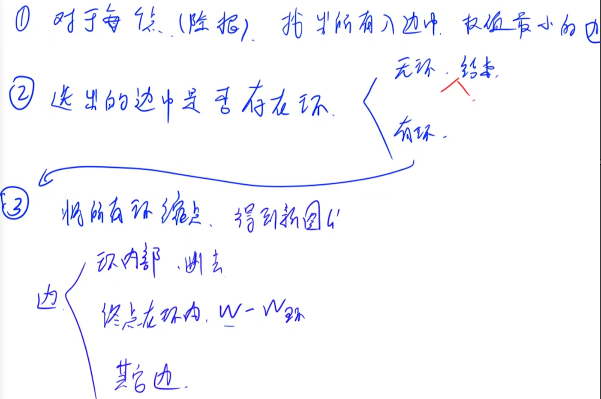

# 朱刘算法（有向图的最小生成树）

[图的基础I最小树形图朱刘算法(上)_哔哩哔哩_bilibili](https://www.bilibili.com/video/BV1AK3aeJEyQ/?spm_id_from=333.337.search-card.all.click)


摘抄[学习笔记 | 最小树形图-朱刘算法（有向图的最小生成树）](https://flowus.cn/05ad6614-7edd-4877-ab5b-caff110cca8e)

---

## 例题 #1

在漫长的骂战过后，利特肯王国和克努斯海洋王国之间爆发了一场武装战争。

克努斯海洋王国部队的猛烈进攻使得利特肯王国的指挥网络**彻底瘫痪**。

临时指挥网络的建立刻不容缓。

利特肯命令史努比负责该项目。

利特肯王国共有 N 个指挥部，位于平面中的 N 个节点上（编号 1∼N）。

其中利特肯所在的指挥总部位于节点 1。

通过对战时情况的详尽研究，史努比认为，当前最关键的一点在于建立一个**单向**通信网络，使得利特肯的命令能够成功传达至平面中的每个节点处。

如果希望利特肯的命令能够直接从节点 A 传递到另一个节点 B，则必须沿着连接两个节点的直线段构建一条**单向传输**电线。

因为战争还未停止，所以并不是所有节点对之间都能建立电线。（甚至能够建立从节点 A 传递消息至节点 B 的电线，也不一定能够建立从节点 B 传递消息至节点 A 的电线）

史努比希望这项工程所需耗费的电线长度尽可能短，以便施工可以尽快完成。

### 思路


第一步，对于每个点v（除根以外），找出所有入边中权值最小的边。将其边权作为w_v

第二步，选出这边判断选出这边中是否存在还，如果无环则算法结束，当前图即最小树形图。如果有环则继续第三步。

第3步，将当前图G进行缩点，得到新图G'。

缩点时对边权进行操作：

- 边在环内部，直接和缩点一样删掉。

- 边指向环内的某个点u。则边权修改为w-w_u

- 其他边正常保留

**正确性证明**

性质1：缩点的正确性



我们考虑上面的环。首先肯定是的，环中至少要需要删一条边。现在我们来证明。必然存在一个最优解，是只去掉一条边的。

假设我们去掉的第一条边是上面的那条边。那我现在我们设最优解删去了两条边，第二条边是下面的那条边，那么由于我们当前的图都是选择了每个点的入边中边权最小的边构建起来的，如果我们去掉了下面的那条边，那么这条边到达的点v，必然需要从另外一条边到达。

那么根据建图规则，这条边的权值是大于我们删去的那条边的。由于一个图的最小树形图的边数是一定的，所以我们可以将虚线边替换为下面那条被删掉的边，这样的答案一定更优。

性质2：缩点前后的图是等价的（即对缩点后的图G'求最小树形图，就是缩点前的图G的最小树形图）

缩点前后的图是一一对应的。


考虑一个环。假如我们缩点后外面的一条入边连接到原环中点v，那么v的环上的边就会断开。即环上断开的边和连入环的边一一对应。而连入环的边可以在G'中体现，即G'中可以体现G中环内断开的情况。

---

比较考察码力

```C++

#include<bits/stdc++.h>
using namespace std;
#define ull unsigned long long
#define pii pair<int, int>
#define pf first
#define ps second
#define rep(i, a, b) for(int i = a; i <= b; ++i)
#define per(i, a, b) for(int i = a; i >= b; --i)

#define rd read()
#define ot write
#define nl putchar('\n')
inline int rd{
	int xx=0,ff=1;
	char ch=getchar();
	while(ch<'0'||ch>'9') {if(ch=='-') ff=-1;ch=getchar();}
	while(ch>='0'&&ch<='9') xx=xx*10+(ch-'0'),ch=getchar();
	return xx*ff;
}
inline void write(int out){
	if(out<0) putchar('-'),out=-out;
	if(out>9) write(out/10);
	putchar(out%10+'0');
}

using namespace std;

typedef pair<double, double> PDD;

const int N = 110;
const double INF = 1e8;

int n, m;
PDD a[N]; //记录所有点的坐标
bool g[N][N]; //邻接矩阵
double d[N][N], bd[N][N]; //记录每两个点之间的距离、备份
int pre[N]; //记录每个点选择的前驱点
int dfn[N], low[N], dfnt; //tarjan 算法的数组
int stk[N], top; //栈
bool instk[N]; //记录每个点是否在栈中
int id[N], cnt; //记录每个点所在的强连通分量编号
bool st[N]; //记录每个点能否从 1 号点搜索到

void dfs(int u){ //从 u 节点往下搜索所有点
    st[u] = true;

    for(int i = 1; i <= n; i++)
        if(g[u][i] && !st[i])
            dfs(i);
}

bool check(){ //判断整个图是否具有连通性
    memset(st, 0, sizeof st); //初始化
    dfs(1); //从 1 号点开始搜索所有点

    for(int i = 1; i <= n; i++)
        if(!st[i])
            return false; //如果某个点搜不到，说明图不连通
    return true; //否则说明连通
}

double getdis(int i, int j){ //计算两个点之间的距离
    double x = a[i].first - a[j].first;
    double y = a[i].second - a[j].second;
    return sqrt(x * x + y * y);
}

void tarjan(int u){ //tarjan 算法缩点
    dfn[u] = low[u] = ++dfnt;
    stk[++top] = u, instk[u] = true;

    //由于每个点只有一条入边，不需要循环
    int j = pre[u];
    if(!dfn[j]){
        tarjan(j);
        low[u] = min(low[u], low[j]);
    }
    else if(instk[j]) low[u] = min(low[u], dfn[j]);

    //找到一个环
    if(dfn[u] == low[u]){
        int y;
        cnt++;
        do{
            y = stk[top--];
            instk[y] = false;
            id[y] = cnt;
        } while(y != u);
    }
}

double work(){ //计算答案
    double res = 0; //记录答案

    //计算每两个点之间的距离
    for(int i = 1; i <= n; i++)
        for(int j = 1; j <= n; j++)
            if(g[i][j]) d[i][j] = getdis(i, j); //存在边，计算距离
            else d[i][j] = INF; //不存在边，距离为 INF

    //朱刘算法
    while(true){
        //对于每个点，选择它所有入边中最小的一条边
        for(int i = 1; i <= n; i++){
            pre[i] = i;
            for(int j = 1; j <= n; j++)
                if(d[pre[i]][i] > d[j][i]) //如果边更小，更换
                    pre[i] = j;
        }

        //初始化
        memset(dfn, 0, sizeof dfn);
        dfnt = top = cnt = 0;

        //tarjan 算法求环
        for(int i = 1; i <= n; i++)
            if(!dfn[i])tarjan(i);

        if(cnt == n){ //如果缩点后还是 n 个点，说明不存在环
            for(int i = 2; i <= n; i++) res += d[pre[i]][i]; //累加所有选中的边的权值
            break;
        }

        //否则说明有环，将环内所有边的权值累加到答案中
        for(int i = 2; i <= n; i++)
            if(id[pre[i]] == id[i]) //如果当前边的起点和终点在一个强连通分量，说明该边在环里
                res += d[pre[i]][i];

        //缩点
        //将备份数组清空
        for(int i = 1; i <= cnt; i++)
            for(int j = 1; j <= cnt; j++)
                bd[i][j] = INF;

        //用备份数组记录缩点后图中每个点直接的边权
        for(int i = 1; i <= n; i++)
            for(int j = 1; j <= n; j++)
                //如果两个点之间有边，且不在一个强连通分量中，说明这是一条缩点后仍存在的边
                if(d[i][j] < INF && id[i] != id[j]){
                    int a = id[i], b = id[j];
                    //如果 j 和 j 的前驱点在同一个强连通分量中，说明该边的终点 j 在环里
                    if(id[pre[j]] == id[j]) bd[a][b] = min(bd[a][b], d[i][j] - d[pre[j]][j]); //更新边权
                    else bd[a][b] = min(bd[a][b], d[i][j]); //否则不需要更新直接照抄
                }

        //将新图代替原图
        n = cnt;
        memcpy(d, bd, sizeof d);
    }

    return res;
}

int main(){
    while(scanf("%d%d", &n, &m) != EOF) {
        for(int i = 1; i <= n; i++) scanf("%lf%lf", &a[i].first, &a[i].second);

        memset(g, 0, sizeof g); //初始化
        while(m--) {
            int a, b;
            scanf("%d%d", &a, &b);
            if(a != b && b != 1) g[a][b] = true; //边不能存在自环，且回到 1 的边不用存
        }

        if(!check()) puts("poor snoopy"); //如果图不连通，说明无解
        else printf("%.2lf\n", work()); //否则说明有解，输出答案
    }
    return 0;
}

```

#### 输入格式

输入包含若干测试数据。

每组数据第一行包含两个整数 N,M，表示节点总数以及可在其间建立电线的节点对数。

接下来 N 行，其中第 i 行包含两个整数 xi,yi，表示节点 i 的位置坐标为 (xi,yi)。

接下来 M 行，每行包含两个整数 a,b，表示可以建立一条**单向**电线使得命令可以从节点 a 传递至节点 b。

处理至文件末尾。

#### 输出格式

对于每个测试数据，输出结果占一行。

如果临时网络可以成功构建，则输出所需耗费电线的最小可能长度，保留两位小数。

如果不能成功构建，则输出 `poor snoopy`。

#### 数据范围

1≤N≤100,
1≤M≤104,
0≤xi,yi≤105,
1≤a,b≤N,a≠b,
每个输入最多包含 10 组测试。

#### 输入样例：

```C++
4 6
0 6
4 6
0 0
7 20
1 2
1 3
2 3
3 4
3 1
3 2
4 3
0 0
1 0
0 1
1 2
1 3
4 1
2 3
```

#### 输出样例：

```C++
31.19
poor snoopy
```

## 例题 #2 Road Repairs

题面翻译

一个名叫 Berland 的国家有 $n$ 个城市，它们被从 $1$ 到 $n$ 的整数编号。编号为 $1$ 的城市是这个国家的首都。一些城市两两之间有一条单向道路。然而，不是所有的路都是完好的。对于每一条路我们都知道是否需要修复。如果一条路需要修复，那么它就禁止被使用。但是，Berland 的政府可以修复道路然后这条路就可以用了。

现在 Berland 正在受到邻国战争的威胁。所以首都的官员决定往每个城市送一支军队。如果他们没有钱或者时间去建一条新路那么这些军队只能够通过完好的道路。然而，为了到达一些城市一些道路可能可以修复好。

当然国家需要很多的资源去战胜敌人，所以你想要小心地计划投入军队的资源。这就是 Berland 的政府想要尽可能地修复好最少的道路让军队能从首都到每一个城市的原因，给你一些路并告诉你这条路是好的还是要修复的。你的任务就是帮助 Berland 政府并找出哪些路需要被修复。

输入格式：

第一行有两个整数 $n,m$（$1 \leq n,m \leq 10^5$）——城市的数量和 Berland 的道路的数量。

接下来 $m$ 行包括 $3$ 个整数 $a_i$，$b_i$，$c_i$（$1 \leq a_i,b_i \leq n$ ，$a_i \neq b_i$，$0 \leq c_i \leq 1$），描述的是一条从 $a_i$ 到 $b_i$ 的道路，如果 $c_i$ 等于 0，那么给的这条路就是好的；如果 $c_i$ 等于 1，那么
给的这条路就是需要修理的。

保证没有重边。

输出格式：

如果修复了所有的道路以后还是不能到达每个城市，输出-1。否则，第一行输出有几条路需要修复，第二行输出需要修复的路的编号，用一个空格隔开。

道路从 1 开始编号，在输入中给出。

如果有多种方案，请输出任意一种。如果所有路都是好的，请只在第一行输出 0。

### 思路

**本题需要文件输入输出！！**

---

你说得对，但是这道看起来是**最小树形图模板还带方案输出**的难题（Div1 E 题）可用用一个简单的 bfs 完成。

考虑以下 bfs：我们在 bfs 中，如果当前点 $u$ 通过全 $0$ 边更新了，那么以后就不需要再访问这个点了。否则以后我们还是要访问这个点。

我们把图拆成两个图，图 $e$ 为全 $0$ 边组成的图，$e2$ 为全 $1$ 边组成的图。为了尽可能让一个可以被全 $0$ 路径访问到的点先被标记为“已经通过全 $0$ 边更新了”，在 bfs 过程中我们优先访问 $e$ 中出边。

我们维护 $vis_u$ 标记点 $u$ 的访问情况。$vis_u=0$ 表示 $u$ 没有被访问，$vis_u=1$ 表示 $u$ 可以通过全 $0$ 路径访问，$vis_u=k,k>1$ 表示 $u$ 被 $v$ 通过编号为 $vis_u-1$ 的边访问了。

一个点是否需要被访问的条件是：

- 枚举 $0$ 边时，如果 $v$ 没有被访问，则访问并标记。如果 $v$ 被访问但 $vis_v>1$，则访问并标记。

- 枚举 $1$ 边时，当且仅当如果 $v$ 没有被访问，则访问并标记。

---

```C++
#include<bits/stdc++.h>
using namespace std;
#define int long long
#define pii pair<int,int>
#define ps second
#define pf first
 
 
#define rd read()
inline int read()
{
	int xx=0,ff=1;
	char c=getchar();
	while(c<'0'||c>'9') {if(c=='-') ff=-1;c=getchar();}
	while(c>='0'&&c<='9') xx=xx*10+(c-'0'),c=getchar();
	return xx*ff;
}
inline void write(int out)
{
	if(out<0) putchar('-'),out=-out;
	if(out>9) write(out/10);
	putchar(out%10+'0');
}
 
 
const int N=2e5+5;
const int M=5e5+5;
const int INF=1e9+5;
const int MOD=1e9+7;
bool f1;
int m,k,n,vis[N];
 
int T,mn=INF,ans[N];
int acnt,r;
vector<int> e[N],e2[N],p[N];
void add(int a,int b,int c,int pth){
	if(c){
		e2[a].push_back(b);
		p[a].push_back(pth);
	}//需要修复的路另外存
	else e[a].push_back(b);
}
queue<int> q;
void bfs(int x){
	q.push(x);
	vis[x]=1;
	while(q.size()){
		int u=q.front();
		q.pop();
		for(auto v:e[u]){
			if(vis[v]!=1){
				vis[v]=1;
				q.push(v);
			}
		}
		for(int i=0;i<e2[u].size();i++){
			int v=e2[u][i];
			if(!vis[v]){
				vis[v]=1+p[u][i];
				q.push(v);
			}
		}
		
	}
}

signed main() {

	freopen("input.txt", "r", stdin);
	freopen("output.txt", "w", stdout);
	n=rd,m=rd;
	for(int i=1;i<=m;i++){
		int a=rd,b=rd,c=rd;
		add(a,b,c,i);
	}
	bfs(1);

	for(int i=1;i<=n;i++){
		if(!vis[i]){
			cout<<-1;
			return 0;
		}
		if(vis[i]>1)ans[++acnt]=vis[i]-1;
	}
	cout<<acnt<<endl;
	for(int i=1;i<=acnt;i++){
		cout<<ans[i]<<' ';
	}

}
/*
2
3 2 3 6
*/
```

