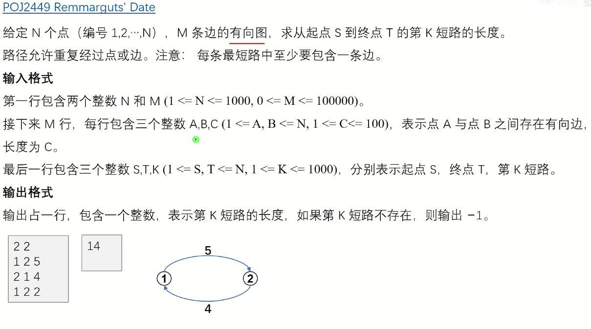
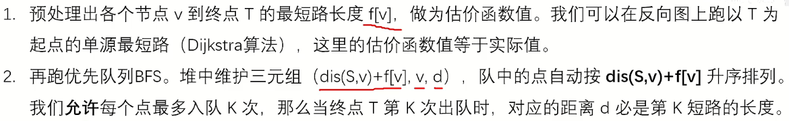
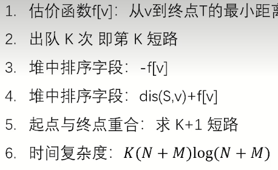

# K短路算法

作为中等阶段的OIer，我们先要学习如何使用A*来解决标准的K短路问题。

### 基本思路

1. **修改启发式函数**：传统的A*算法使用启发式函数来估算从当前点到目标点的成本。为了找到K短路，我们可以修改启发式函数，使其不仅考虑到达目标点的成本，还考虑路径的多样性。

2. **重复搜索**：在找到一条最短路径后，修改图中的权重或启发式函数，然后再次运行A*算法，寻找下一条最短路径。

3. **路径去重**：确保找到的每条路径都是独特的，避免重复相同的路径。

## 例题 #1



做法



注：三元组为（当前代价+估价，当前点编号，当前点到起点的距离）

**那么在这道题目中，估价有什么作用呢？**

传统的最短路，我们只是不断用最小值去更新到达终点T的最短路，但我们不知道当前这条路是点击短的。如果我们用A*算法，我们就能控制bfs先走第一短的，再走第二短的...，这样的话我们就可以找到第K短的了。

注意这些



敲一遍代码

```C++
/*////////ACACACACACACAC///////////
       . Code by Ntsc .
       . Love by Liye .
/*////////ACACACACACACAC///////////

#include<bits/stdc++.h>
#define ll long long
#define db double
#define rtn return
using namespace std;

const int N=1e5;
const int M=1e5;
const int Mod=1e5;
const int INF=1e5;

int h[N],rh[N],to[M],w[M],ne[M],tot;
void add(int h[],int a,int b,int c){
	to[++tot]=b,w[tot]=c,ne[tot]=h[a],h[a]=tot;
}

int n,m,s,t,k;
int f[N],vis[N],cnt[N];
struct node{
	int s,v,d;
	bool operator <(const node &x)const{
		return s>x.s;
	}
};

void djstr(){
	memset(f,0x3f,sizeof f);
	priority_queue<pair<int,int>> q;
	q.push(make_pair(0,t));
	while(q.size()){
		pair<int,int> tmp=q.top();
		q.pop();
		int u=tmp.second;
		if(vis[u])continue;
		vis[u]=1;
		for(int i=rh[u];i;i=ne[i]){
			int v=to[i];
			if(f[v]>f[u]+w[i]){
				f[v]=f[u]/f[v]是点v到t的当前距离(当前的djstr是预处理估价函数的,把t当作起点)，也是其估价函数 
				q.push(make_pair(-f[v],v));
			}
		}
	}
}

int ax(){
	priority_queue<node> pq;
	node a={f[s],s,0};
	pq.push(a);
	while(pq.size()){
		node tmp=pq.top();pq.pop();
		int u=tmp.v,d=tmp.d;
		cnt[u]++;
		if(cnt[t]==k)return d;
		for(int i=h[u];i;i=ne[i]){
			int v=to[i];
			if(cnt[v]<k){
				node a={d+w[i]+f[v],v,d+w[i]};
				pq.push(a);
			}
		}
	}
	return -1;
}
signed main(){
	cin>>n>>m;
	for(int i=1;i<=m;i++){
		int a,b,c;
		cin>>a>>b>>c;
		add(h,a,b,c);add(rh,b,a,c);
	}
	cin>>s>>t>>k;
	if(s==t)k++;//如果s,t重合,那么0是最短的,A*会统计这一条,但题目要求不能算这条路,因此实际上应该要求第K+1条路 
	djstr();
	cout<<ax()<<endl;
	return 0;
}

```

