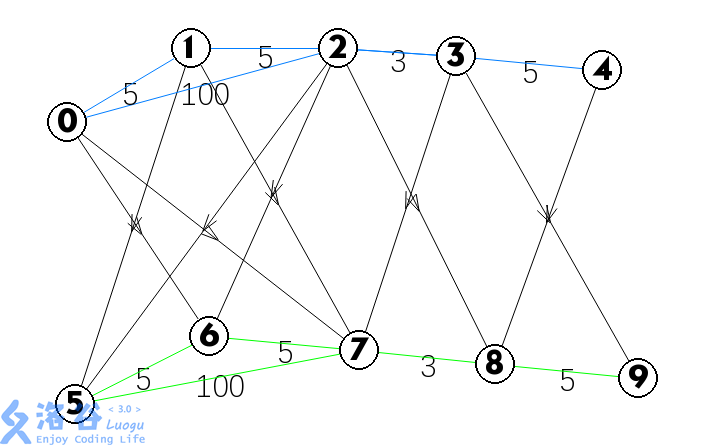
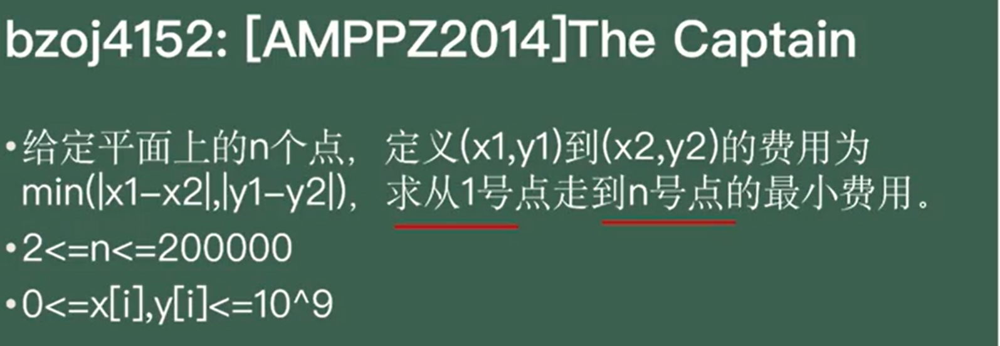

# 分层图思想


[www.luogu.com.cn](https://www.luogu.com.cn/problem/P5663)


## 例题 #1 [CSP-J2019] 加工零件

**思路**

我们该如何解决问题？

> 问题：a做k阶段的零件b要不要做呢？

其实，实质就是看a到b有没有长度为k的路径。

同时我们会发现，**如果a到b有长度为k的路径，那么a到b一定有长度为k+2的路径，但并不一定有长度为k+1的路径。**（因为我们可以来回走一条边）

所以，我们要对每个点求一遍奇数路径，和偶数路径（这里求最短路就行）。

```C++
/*
CB Ntsc
*/

#include<bits/stdc++.h>
using namespace std;
#define int long long
#define mp make_pair

const int N=2e5+5;
const int INF=1e9+5;
const int MOD=1e9+7;
bool f1;
int dis1[N],dis2[N];
int l[N],r[N];
int q,n,m,ans,T,k;
vector<int>e[N];
bool f2;
#define rd read()
inline int read()
{
	int xx=0,ff=1;
	char ch=getchar();
	while(ch<'0'||ch>'9') {if(ch=='-') ff=-1;ch=getchar();}
	while(ch>='0'&&ch<='9') xx=xx*10+(ch-'0'),ch=getchar();
	return xx*ff;
}
inline void write(int out)
{
	if(out<0) putchar('-'),out=-out;
	if(out>9) write(out/10);
	putchar(out%10+'0');
}

void add(int a,int b){
	e[a].push_back(b);
    e[b].push_back(a);
}
priority_queue<pair<int,int> >pq;
void djstr() {
	for(int i=1; i<=n; i++)dis1[i]=INF;	//初始化边权
	for(int i=1; i<=n; i++)dis2[i]=INF;	//初始化边权
	
	for(auto v:e[1]){
		dis1[v]=1;
		pq.push(make_pair(-1,v));
	}
	while(pq.size()) {	//搜完全图
		
		int u=pq.top().second;
		int w=-pq.top().first;
		
		pq.pop();
		// if(vis[u])continue;//记得continue
		// vis[u]=1;
		for(int i=0;i<e[u].size();i++){
			int v=e[u][i];
			if(w%2){
				if(dis2[v]>1+w){
					dis2[v]=w/更新
					pq.push(make_pair(-dis2[v],v));
				}
			}else{
				if(dis1[v]>1+w){
                    dis1[v]=w/更新
                    pq.push(make_pair(-dis1[v],v));
                }
			}
			
		}
	}
}

signed main(){

	n=rd;m=rd;q=rd;
	for(int i=1;i<=m;i++){
		int u=rd,v=rd;
		add(u,v);
	}

	djstr();
	for(int i=1;i<=q;i++){
		int a=rd;l[a]=rd;
		if(l[a]%2){
			if(dis1[a]>l[a])cout<<"No\n";
			else cout<<"Yes\n";
		}else{
			if(dis2[a]>l[a])cout<<"No\n";
            else cout<<"Yes\n";
		}
	}
    
    return 0;
}
```

[www.luogu.com.cn](https://www.luogu.com.cn/problem/P4568)


## 例题 #2 [JLOI2011] 飞行路线

**思路**

套路题，分层图。

以样例为例（使用 @EternalAlexander 这位dalao的OI Painter绘制）：



各层内部正常连边，各层之间从上到下连权值为0的边。每向下跑一层，就相当于免费搭一次飞机。跑一遍从$s$到$t+n\times k$的最短路即可。

> 引用自[SuperJvRuo](https://www.luogu.com.cn/user/53374)

我们要考虑枚举每一层的t，因为可能我们用不到k次免费机会。

```C++
/*
CB Ntsc
*/

#include<bits/stdc++.h>
using namespace std;
#define int long long
#define mp make_pair
#define pii pair<int,int> 

const int N=5e3+5;
const int INF=1e9+5;
const int MOD=998244353;
bool f1;
struct node{
	int nxt,dis;
};
vector<node>e[N];
priority_queue<pair<int,int> >pq;
int n,vis[N],dis[N],m,k,s,t;
bool f2;
#define rd read()
inline int read()
{
	int xx=0,ff=1;
	char ch=getchar();
	while(ch<'0'||ch>'9') {if(ch=='-') ff=-1;ch=getchar();}
	while(ch>='0'&&ch<='9') xx=xx*10+(ch-'0'),ch=getchar();
	return xx*ff;
}
inline void write(int out)
{
	if(out<0) putchar('-'),out=-out;
	if(out>9) write(out/10);
	putchar(out%10+'0');
}

void add(int a,int b,int c){
	e[a].push_back({b,c});
}


void djstr(int rt) {
	pq.push(make_pair(0,rt));
	int u=rt;	//先从起点开始查
	memset(dis,0x3f3f,sizeof dis);	//初始化边权

	dis[rt]=0;
	
	while(pq.size()) {	//搜完全图
		
		u=pq.top().second;
		
		pq.pop();
		if(vis[u])continue;//记得continue
		vis[u]=1;
		for(int i=0;i<e[u].size();i++){
			int v=e[u][i].nxt,w=e[u][i].dis;
			if(!vis[v]&&dis[u]+w<dis[v]){
				dis[v]=dis[u]/更新
				pq.push(make_pair(-dis[v],v));
			}
		}
	}
}

signed main(){

	// freopen("school.in", "r", stdin);
	// freopen("school.out", "w", stdout);

	n=rd;m=rd;k=rd;
	s=rd;t=rd;
	for(int i=1;i<=m;i++){
		int a=rd,b=rd,c=rd;
		add(a,b,c);
		add(b,a,c);

		for(int j=1;j<=k;j++){//建k层图
			add(a+(j-1)*n,b+(j*n),0);
			add(b+(j-1)*n,a+(j)*n,0);
			add(a+j*n,b+j*n,c);
			add(b+j*n,a+j*n,c);
		}
	}
    
	djstr(s);
	int ans=INF;
	for(int i=0;i<=k;i++)ans=min(ans,dis[t+i*n]);

	cout<<ans;//dis[t+k*n];


    return 0;
}

/*
5 3 3
2 3 4 7 6
*/
```

## 练习

[www.luogu.com.cn](https://www.luogu.com.cn/problem/P2939)


[www.luogu.com.cn](https://www.luogu.com.cn/problem/P4822)




