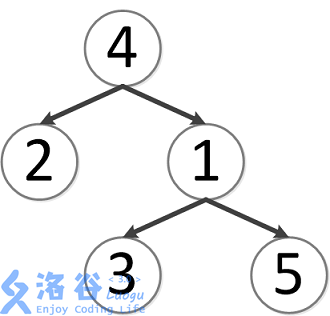
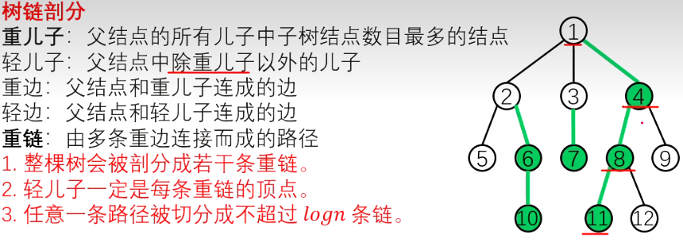

【】专题 | 树上祖先k LCA

# 最近公共祖先（LCA）

方法

- 倍增

- 重链剖分

## 例题 #1

如题，给定一棵有根多叉树，请求出指定两个点直接最近的公共祖先。

对于 $100\%$ 的数据，$1 \leq N,M\leq 500000$，$1 \leq x, y,a ,b \leq N$，**不保证** $a \neq b$。

样例说明：

该树结构如下：



第一次询问：$2, 4$ 的最近公共祖先，故为 $4$。

第二次询问：$3, 2$ 的最近公共祖先，故为 $4$。

第三次询问：$3, 5$ 的最近公共祖先，故为 $1$。

第四次询问：$1, 2$ 的最近公共祖先，故为 $4$。

第五次询问：$4, 5$ 的最近公共祖先，故为 $4$。

故输出依次为 $4, 4, 1, 4, 4$。

2021/10/4 数据更新 @fstqwq：应要求加了两组数据卡掉了暴力跳。


## 倍增求LCA

记录数组:

`dep[]`指每个点的深度

`p[u][i]`记录第 $u$ 个点向上 $2^i$ 层的祖先

偏倍增思想

（vector写法在后面）

```C++
#include<bits/stdc++.h>
using namespace std;
const int MAXN=500000+2;
int n,m,s;
int k=0;
int h[MAXN],dep[MAXN],p[MAXN][21];
struct node{
    int v,next;
}e[MAXN*2];//存树
void add(int u,int v){
    e[k].v=v;
    e[k].next=h[u];
    h[u]=k++;
}               //加边函数
void dfs(int u,int fa){
    dep[u]=dep[fa]+1;
    p[u][0]=fa;
    for(int i=1;(1<<i)<=dep[u];i++)//二叉树，点i的深度即i/2
        p[u][i]=p[p[u][i-1]][i-1];//第u个点向上2^i层的祖先就是第u个点的fa的上2^(i-1)层祖先
    for(int i=h[u];i!=-1;i=e[i].next){//扫描出边
        int v=e[i].v;
        if(v!=fa)//排除fa
            dfs(v,u);
    }
}                              
int lca(int a,int b){
    if(dep[a]>dep[b])//统一切换为b比a深
        swap(a,b);          
    for(int i=20;i>=0;i--)//b向上走到与a同层
        if(dep[a]<=dep[b]-(1<<i))
            b=p[b][i];             
    if(a==b)return a;                 
    for(int i=20;i>=0;i--){
        if(p[a][i]==p[b][i])//过头了
            continue;
        else a=p[a][i],b=p[b][i];          
    }
    return p[a][0];//最后a停在了lca的更深一层       
}
int main()
{	
    memset(h,-1,sizeof(h));
    int a,b;
    scanf("%d%d%d",&n,&m,&rt);
    for(int i=1;i<n;i++)
    {
        scanf("%d%d",&a,&b);
        add(a,b);
        add(b,a);                     
    }
    dfs(rt,0);
    for(int i=1;i<=m;i++)
    {
        scanf("%d%d",&a,&b);
        printf("%d\n",lca(a,b));
    }
    return 0;
}
```

本地写法，能过：vector存图写法

```C++
/*////////ACACACACACACAC///////////
       . Coding by Ntsc .
       . ToFind Chargcy .
       . Prove Yourself .
/*////////ACACACACACACAC///////////

#include <bits/stdc++.h>
#define ll long long
#define db double
#define rtn return
#define i1n    \
    int i = 1; \
    i <= n;    \
    i++
#define in1    \
    int i = n; \
    i >= 1;    \
    i--
using namespace std;

const int N = 2e6 + 5;
const int M = 1e5;
const int Mod = 1e5;
const int INF = 1e5;
vector<int> e[N];
int n, m, sum, ans1, dep[N], fa[N][20], k, tmp, ans2;
void add(int a, int b) { e[a].push_back(b); }
void dfs1(int u, int faa) {  //求深度

    dep[u] = dep[faa] + 1;
    for (int i = 1; i < 19; i++) fa[u][i] = fa[fa[u][i - 1]][i - 1];  // att!
    for (int i = 0; i < e[u].size(); i++) {
        int v = e[u][i];
        if (v == faa)
            continue;
        fa[v][0] = u;

        dfs1(v, u);
    }
}
int lca(int u, int v) {
    if (dep[u] < dep[v])
        swap(u, v);                  //让u更深
    for (int i = 18; i >= 0; i--) {  //倍增往上跳 ，不要暴力跳
        if (dep[u] - (1 << i) >= dep[v])
            u = fa[u][i];
    }
    if (u == v)
        return u;
    for (int i = 18; i >= 0; i--) {  //倍增一起往上跳
        if (fa[u][i] != fa[v][i])
            u = fa[u][i], v = fa[v][i];
    }
    return fa[u][0];  //注意返回值
}
signed main() {
    scanf("%d%d", &n, &m);  // use scanf pls,or u'll TLE
    for (int i = 1; i < n; i++) {
        int a, b;
        scanf("%d%d", &a, &b);
        add(a, b);
        add(b, a);
    }
    dfs1(1, 0);
    for (int i = 1; i <= m; i++) {
        int a, b;
        scanf("%d%d", &a, &b);
        printf("%d\n", lca(a, b));
    }
    return 0;
}
```


本地写法，过不了：链式前向星写法

```C++
#include<bits/stdc++.h>
#define ll long long
using namespace std;
const int N = 1e6 + 5;
ll h[N], cnt, nxt[N], to[N], f[N][22], dep[N], rt, n, m;

void add(ll a, ll b) {
	to[++cnt] = b, nxt[cnt] = h[a], h[a] = cnt;
}

void dfs(ll u, ll fa) {
	dep[u] = dep[fa] + 1;
	f[u][0] = fa;
	for (ll i = 1; i < 17; i++)
		f[u][i] = f[f[u][i - 1]][i - 1];
	for (ll i = h[u]; i; i = nxt[i]) {
		ll v = to[i];
		if (v == fa)
			continue;
		dfs(v, u);
	}
}

ll lca(ll a, ll b) {
	if (dep[b] > dep[a])//统一将a变成更深的
		swap(a, b);
	for (ll i = 20; i >= 0; i--)//先让a,b在统一高度,再同时向上走
		if (dep[f[a][i]] >= dep[b])
			a = f[a][i];
	if (a == b)
		return a;
	for (ll i = 20; i >= 0; i--)
		if (f[a][i] != f[b][i])
			a = f[a][i], b = f[b][i];
	return f[a][0];
}
signed main() {
//	freopen("P3379_1.in","r",stdin); 
	cin >> n >> m >> rt;
	n--;
//	cout<<"OK"<<endl;
	while (n--) {
		ll a, b;
		scanf("%lld%lld", &a, &b);
		add(a, b);
		add(b, a);
	}
	dfs(rt, 0);
	
	while (m--) {
		ll a, b;
		scanf("%lld%lld", &a, &b);
	//	cout<<a<<' '<<b;
		ll l;
		if(a==b) l=a;
		else
		l = lca(a, b);
		
		printf("%lld\n",l);

	}
	return 0;
}
```

## 使用重链剖分解决LCA问题

此外，我们还可以使用重链剖分来求LCA

[动态树（LCT）](https://flowus.cn/4077b622-00bd-4d7d-b2a6-0ca0e0d73b87)

## ST表优化大量的LCA查询

[练习 | 南外230830](https://flowus.cn/0e07dd05-2912-41fb-b8d6-963fa8b69a94)C题

## 例题 #2

[蓝桥杯 2022 国 B] 机房

这天，小明在机房学习。

他发现机房里一共有 $n$ 台电脑，编号为 1 到 $n$，电脑和电脑之间有网线连接，一共有 $n-1$ 根网线将 $n$ 台电脑连接起来使得任意两台电脑都直接或者间接地相连。

小明发现每台电脑转发、发送或者接受信息需要的时间取决于这台电脑和多少台电脑直接相连，而信息在网线中的传播时间可以忽略。比如如果某台电脑用网线直接连接了另外 $d$ 台电脑, 那么任何经过这台电脑的信息都会延迟 $d$ 单位时间 (发送方和接收方也会产生这样的延迟，当然如果发送方和接收方都是 同一台电脑就只会产生一次延迟)。

小明一共产生了 $m$ 个疑问：如果电脑 $u_{i}$ 向电脑 $v_{i}$ 发送信息，那么信息从 $u_{i}$ 传到 $v_{i}$ 的最短时间是多少?

蓝桥杯 2022 国赛 B 组 H 题。

树上前缀和，懂吧？

```C++
/*
Code by Ntsc
*/

#include<bits/stdc++.h>
using namespace std;
#define int long long
#define mp make_pair

#define rd read()
inline int rd
{
    int xx=0,ff=1;
    char ch=getchar();
    while(ch<'0'||ch>'9') {if(ch=='-') ff=-1;ch=getchar();}
    while(ch>='0'&&ch<='9') xx=xx*10+(ch-'0'),ch=getchar();
    return xx*ff;
}
inline void write(int out)
{
    if(out<0) putchar('-'),out=-out;
    if(out>9) write(out/10);
    putchar(out%10+'0');
}

const int N = 1e5+5;
const int M = 505;


    
vector<int> e[N];
int n, m, sum, ans1, dep[N], fa[N][20], k, tmp, ans2;
int qzh[N],in[N];
void add(int a, int b) { 
    e[a].push_back(b); 
    e[b].push_back(a); 
    in[a]++,in[b]++;
}
void dfs1(int u, int faa) {  //求深度

    qzh[u]=qzh[faa]+in[u];

    dep[u] = dep[faa] + 1;
    for (int i = 1; i < 19; i++) fa[u][i] = fa[fa[u][i - 1]][i - 1];  // att!
    for (int i = 0; i < e[u].size(); i++) {
        int v = e[u][i];
        if (v == faa)
            continue;
        fa[v][0] = u;

        dfs1(v, u);
    }
}
int lca(int u, int v) {
    if (dep[u] < dep[v])
        swap(u, v);                  //让u更深
    for (int i = 18; i >= 0; i--) {  //倍增往上跳 ，不要暴力跳
        if (dep[u] - (1 << i) >= dep[v])
            u = fa[u][i];
    }
    if (u == v)
        return u;
    for (int i = 18; i >= 0; i--) {  //倍增一起往上跳
        if (fa[u][i] != fa[v][i])
            u = fa[u][i], v = fa[v][i];
    }
    return fa[u][0];  //注意返回值
}

signed main(){
    n=rd,m=rd;
    for(int i=1;i<n;i++){
        add(rd,rd);
    }
    dfs1(1, 0);
    while(m--){
        int a=rd,b=rd;
        int p=lca(a,b);
        cout<<qzh[a]+qzh[b]-qzh[p]*2+in[p]<<endl;
    }
}

```

# 树上 K 级祖先

## 例题 #1

给定一棵 $n$ 个点的有根树。

有 $q$ 次询问，第 $i$ 次询问给定 $x_i, k_i$，要求点 $x_i$ 的 $k_i$ 级祖先，答案为 $ans_i$。特别地，$ans_0 = 0$。

本题中的询问将在程序内生成。

给定一个随机种子 $s$ 和一个随机函数 $\operatorname{get}(x)$：

```C++
#define ui unsigned int
ui s;

inline ui get(ui x) {
	x ^= x << 13;
	x ^= x >> 17;
	x ^= x << 5;
	return s = x; 
}
```

你需要按顺序依次生成询问。

设 $d_i$ 为点 $i$ 的深度，其中根的深度为 $1$。

对于第 $i$ 次询问，$x_i = ((\operatorname{get}(s) \operatorname{xor} ans_{i-1}) \bmod n) + 1$，$k_i = (\operatorname{get}(s) \operatorname{xor} ans_{i-1}) \bmod d_{x_i}$。

对于 $100\%$ 的数据，$2 \le n \le 5 \times 10^5$，$1 \le q \le 5 \times 10^6$，$1 \le s < 2^{32}$。

## 长链剖分

请先回顾重链剖分[动态树（LCT）](https://flowus.cn/4077b622-00bd-4d7d-b2a6-0ca0e0d73b87)



那么什么是长链剖分呢？
对应地，我们定义：

- 长儿子：父结点的所有儿子中子树最大深度最深的结点（如果有多个则只选择第一个）

- 链顶为这条链深度最大的节点（？

- 链底为这条链深度最小的节点（？

- 其它定义类似或相同。

那么既然我们要求k级祖先，那么首先我们可以想到的较优的算法是倍增法。或者我们牺牲空间复杂度，来做到O(1)查询。

## 长链剖分解决

首先我们知道一个性质：任意一个点的k级祖先所在链的链长一定大于等于k。结合长链的性质易证。

我们先倍增出每个节点的$2^t$级祖先。

然后，我们对于每条链处理。如果链长是$len$，那么在链头处记录链头向上的$len$个祖先，并记录向下的$len$个在链内的节点。

假设我要查询$u$的$k$级祖先$v$，那么我先跳到其$2^{⌊log_2​k⌋}$级祖先$v'$处。那么我们现在还需要往上跳$k'=k-2^{⌊log_2​k⌋}$层。

由性质得，$u$的$2^{⌊log_2​k⌋}$级祖先（即$v'$）所在链的链长$len$一定大于等于$2^{⌊log_2​k⌋}$，那么现在我们已经预处理出了$v'$所在的链的链头$t$上下的$len$个节点。

我们又知道$k'<2^{⌊log_2​k⌋}$，所以我们就已经处理出了$v'$上第$k'$个节点（我们记$l=dep(t)-dep(v')$，如果$l<k'$，那么我们访问$t$向上的$k'-l$个节点，否则我们就访问$t$向下$l-k'$个节点），直接访问即可。

**部分数组解释**

```C++
int dep[N], fa[N][22];//点的深度，父亲
int mxdp[N];//点所在子树的最大深度
int son[N],top[N];//点的长儿子，点所在链的链头
vector<int> up[N],down[N];//每个点向上/下第i点的编号
```

**代码**

```C++
/*////////ACACACACACACAC///////////
       . Coding by Ntsc .
       . Prove Yourself .
/*////////ACACACACACACAC///////////

#include <bits/stdc++.h>
#define ll long long
#define db double
#define rtn return
#define pb push_back
using namespace std;

const int N = 5e5 + 5;
const int M = 1e5;
const int Mod = 1e5;
const int INF = 1e5;
vector<int> e[N];
int n, m, sum, ans1, dep[N], fa[N][22], k, tmp, ans2;

int mxdp[N],son[N],top[N],lg[N],q,lstans;
ll ans;
vector<int> up[N],down[N];

int rt;
#define ui unsigned int
ui s;

inline ui get(ui x) {
	x ^= x << 13;
	x ^= x >> 17;
	x ^= x << 5;
	return s = x; 
}


void add(int a, int b) { e[a].push_back(b); }

void dfs1(int u) {  //求深度
	for (int i = 1;i<20; i++) fa[u][i] = fa[fa[u][i - 1]][i - 1];  // att!
    mxdp[u]=dep[u] = dep[fa[u][0]] + 1;
    
    for (auto v:e[u]) {
        fa[v][0] = u;
		dfs1(v);
		if(mxdp[u]<mxdp[v]){
			son[u]=v;//更新长儿子 
			mxdp[u]=mxdp[v];
		}
        
    }
}
void dfs2(int u, int tfa) {  //求down,up,top


	top[u]=tfa;
	
	if(u==tfa){//链头更新 
		for(int i=0,v=u;i<=mxdp[u]-dep[u];i++){
			up[u].pb(v);v=fa[v][0];
		}for(int i=0,v=u;i<=mxdp[u]-dep[u];i++){
			down[u].pb(v);v=son[v];
		}
	}
	
	if(son[u])dfs2(son[u],tfa);//同链继承 
	
    for (auto v:e[u]) {
        if (v == son[u])
            continue;
        dfs2(v, v);//异链重开 
		
    }
}
int query(int x,int k){
	if(!k)return x;
	 
	x=fa[x][lg[k]];
	k-=1<<lg[k];
	k-=dep[x]-dep[top[x]];x=top[x];
	
	if(k>=0){
		return up[x][k];
	}else{
		return down[x][-k];
	}
}

signed main() {
    scanf("%d%d%d", &n, &q,&s);  
    lg[1]=0;
	for(int i=2;i<=n;i++){
		lg[i]=lg[i>>1]+1;
	}
	
    for(int i=1;i<=n;i++){
    	int f;cin>>f;
    	if(!f)rt=i;//注意根不是1 
    	else add(f,i);
	}
    dfs1(rt);
    
//    cerr<<"OK\n";
    dfs2(rt,rt);
    
    for (int i = 1; i <= q; i++) {
//    	cerr<<"run at="<<i<<endl;
        int x=((get(s)^lstans)%n)+1;
        int k=(get(s)^lstans)%dep[x];
        lstans=query(x,k);
        ans^=1ll*i*lstans;
        
    }
    
    cout<<ans<<endl;
    return 0;
}
```

# 前缀和&LCA的组合

## 例题 #1

[USACO15DEC] Max Flow P

FJ 给他的牛棚的 $N$ 个隔间之间安装了 $N-1$ 根管道，隔间编号从 $1$ 到 $N$。所有隔间都被管道连通了。

FJ 有 $K$ 条运输牛奶的路线，第 $i$ 条路线从隔间 $s_i$ 运输到隔间 $t_i$。一条运输路线会给它的两个端点处的隔间以及中间途径的所有隔间带来一个单位的运输压力，你需要计算压力最大的隔间的压力是多少。

$2 \le N \le 5 \times 10^4,1 \le K \le 10^5$

思路

这里注意利用前缀和快速把一条链加上一个权值

把a,b加上v，lca减去v，注意，在fa(v)减去**一个**v而不是两个！因为我们在lca处已经减去了一个了！

这里注意lca预处理的写法

```C++
void dfs(int x,int f){
    dep[x]=dep[f]+1;
    fa[x][0]=f;
    for (int i = 1; i <= 19; i++) fa[x][i] = fa[fa[x][i - 1]][i - 1];  // att!
    for(auto v:e[x]){
        if(v==f)continue;
        // for(int i=1;i<20;i++){
        //     fa[v][i]=fa[fa[v][i-1]][i-1];
        // }
        // fa[v][0]=x;
        dfs(v,x);
    }
}

```

上面是正确写法。注释是错误写法

或者下面也可以

```C++
void dfs(int x,int f){
    dep[x]=dep[f]+1;
    for(auto v:e[x]){
        if(v==f)continue;
        fa[v][0]=x;
        for(int i=1;i<20;i++){
            fa[v][i]=fa[fa[v][i-1]][i-1];
        }
        dfs(v,x);
    }
}
```

