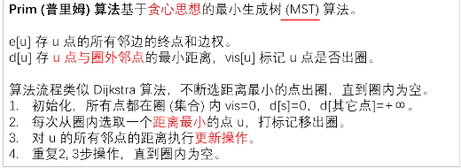
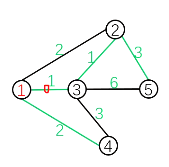
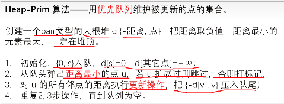
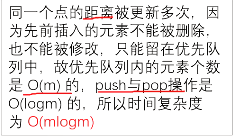
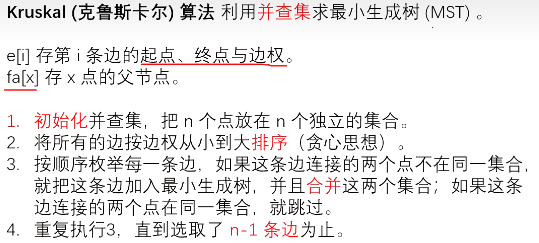
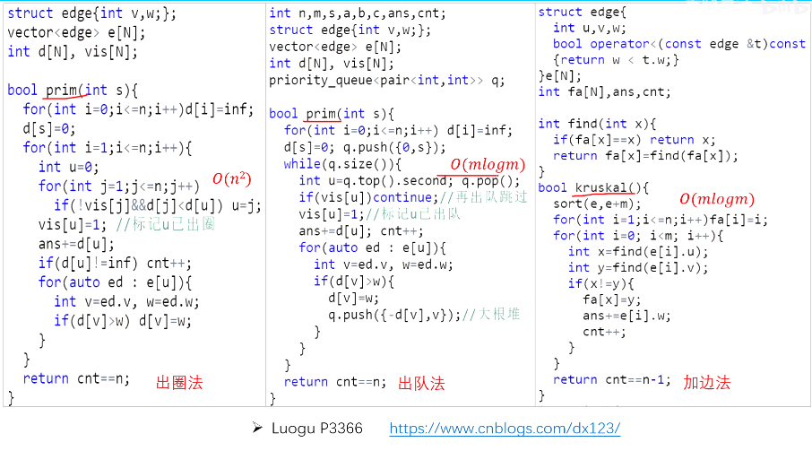

【】专题 | 生成树&基环树

# 目录

- 最小生成树

- 次小生成树

- 最小树形图

# 最小生成树

最小生成树

通俗的定义：用最小的代价构建一颗树。

- 性质 1 ：最大边权值尽量小

- 性质 2 ：对于 u 一 v 的路径，其中经过的最大边价值最小

## 算法1：Prim



AC code

```C++
bool prim(int rt) {  //起点
    for (int i = 0; i <= n; i++) d[i] = INF;//把d[0]赋值为INF！！！
    d[rt] = 0;
    //初始化
    for (int i = 1; i <= n; i++) {
        int u = 0;//以0为基准，即初始d[0]=INF!!不要小聪明把0改成！
        for (int j = 1; j <= n; j++) {
            if (!vis[j] && d[j] < d[u])
                u = j;
        }
      
      /*
      或者写成
       int u = 0;int mx=INF;
        for (int j = 1; j <= n; j++) {
            if (!vis[j] && d[j] < mx)
                u = j,mx = d[j];
        }
      
      */
        // flag1
        vis[u] = 1;
        //		cerr<<u<<' '<<d[u]<<"KO\n";
        ans = max(ans, d[u]);  //边权max
        sum += d[u];//边权sum
        if (d[u] != INF)
            cnt++;  //如果d[u] 在更新后依然为inf,说明不连通
        for (auto ed : e[u]) {
            int v = ed.v, w = ed.w;
            if (d[v] > w)
                d[v] = w;
        }
    }
    return cnt == n;  //判定是否存在最小生成树(图是否连通)
}

```



当走到3时，1已经在最小生成树内。此时枚举所有点发现3里最小生成树（1）最近，因此走到3处，连接1→3放入最小生成树中 [flag1]

此时枚举3的所有邻边，发现3→2最近（1忽略，因为它已经在最小生成树中了）**现在先别急**，不要现在确定2→3是最小生成树的边（因为虽然2是到3的最近的点，但还不知道有没有某个点到1的距离小于2→3的距离，毕竟1也在生成树内）。现在知道3在最小生成树内，于是更新其他点的`d[]`数组（即它们到最小生成树任意一个点的最小距离）为下面一个循环做准备


当到达点3时，会对`d[2] d[5]`进行更新，因为一开始它们与当前生成树无相连，d值为inf

但不会对`d[4]`进行更新，因为它在1时就已经更新了到生成树的距离，并且比到2的更近


总的流程就是找到离当前生成树最近的点v，建边，更新v的邻点到生成树的最小距离，直到生成树建完（扫描完所有点）

## 算法2：堆优化Prim（稀疏图适用）



我们发现，在以下循环在，我们就是为了找到当前**不在已经处理出来的最小生成树中的点**中`d[]`**最小**的那个点。

```C++
int u=0;
for(int j=1;j<=n;j++){
	if(!vis[j]&&d[j]<d[u])u=j;
}
```

不断找最小，对序列进行操作...优先队列可以优化它！这里请注意使用小根堆（存负数）

优先队列默认根据pair类型的第一项(.first)进行排序

```C++

priority_queue <pair<int,int> > pq; 
bool prim(int s){//起点 
	for(int i=1;i<=n;i++)d[i]=INF;
	d[s]=0;pq.push({-0,s});
	//初始化 
	while(pq.size()){
		int u=pq.top().second;pq.pop();
		if(vis[u])continue;
		/*代替了这些
		int u=0;
		for(int j=1;j<=n;j++){
			if(!vis[j]&&d[j]<d[u])u=j;
		}
		*/ 
		vis[u]=1;
		ans+=d[u];//边权和 
		if(d[u]!=inf)cnt++;//如果d[u] 在更新后依然为inf,说明不连通 
		for(auto ed : e[u]){
			int v=ed.v,w=ed.w;
			if(d[v]>w)d[v]=w,pq.push({-d[v],v});//大根堆 
		}
	}
	return cnt==n;//判定是否存在最小生成树(图是否连通) 
}
```

**复杂度计算**



## 算法3：Kruskal

[312 最小生成树 Kruskal 算法_哔哩哔哩_bilibili](https://www.bilibili.com/video/BV1yt4y1H7F9/?spm_id_from=333.999.0.0)




```C++
struct edge{
	int u,v,w;
}e[N];//注意不是链式前向星！！只是单纯存边！！编号从0开始！！
int fa[N],ans,cnt;
int find(int x){
	if(fa[x]==x)return x;
	return fa[x]=find(fa[x]);
}
bool cmp(edge a,edge b){
	return a.w<b.w;//是小于号，因为小的要在前面
}
bool krskl(){
	sort(e,e+m,cmp);//按边权排序 
	for(int i=1;i<=n;i++){
		fa[i]=i;//并查集初始化 
	}
	for(int i=0;i<m;i++){//按 边权从小到大顺序枚举 
		int x=find(e[i].u),y=find(e[i].v);
		if(x!=y){//说明不在同一个集合 
			fa[x]=y;//连边 
			ans+=e[i].w;
			cnt++;
		}
	} 
	return cnt==n-1; //返回是否连了n-1条边，即可以形成树
}
```

扩展：如果只是想连k条边，那么在cnt≥k时return即可。要想把图分成k个联通块使得边权和最小，则到cnt≥n（总点数，即最小生成树的边数）-k即return 可（P1195 口袋的天空）

**总结**



后面的2种适合稀疏图

## 例题 #1

[www.luogu.com.cn](https://www.luogu.com.cn/problem/P2504)


## 例题 #2 动态最小生成树

 n 个点 m 条边的图·每条边连接 u 一 i ， v 一 i ，权值 w 一 i·

两种操作：

- 修改某条边边权·

- 查询某个区间内的边构成的最小生成树

n≤100,m≤10000


**solu**

n 很小，猜测复杂度是 n * m * g。

线段树维护对于每个区间选哪几条边·合并的时候类似归并排序可以省去排序$\log$．时间复杂度 $O(nq\log \times a(n))$

3.异或最小生成树·

给你一张完全图，任意两个点之间的边权是 $a_i \oplus a_j$求最小生成树． n≤1e5

**solu**

trie树，在trie树上存所有数字，可以快速求出两个数字使得他们的异或和最小。

异或最小生成树·建 trie 树·合并两边只能各取一个点（怎么找？ trie 树经典问题）． Boruvka算法来证明

# 次小生成树

## **严格次小生成树算法**

一句话概括：对于原图中非最小生成树的每一条边e:u-v，设其边权为w，查看最小生成树中u-v的路径上的边权最大值mx和次大值smx，如果mx=w，则用e替换smx的边，否则用e替换mx的边。

每一次替换边都是基于原图，所以每一次替换一条边后都会生成一颗新树。记新树的边权和为res，记录所有res中最小的那个就是**严格次小生成树。**

## **非严格次小生成树**

稍微改变一下上面的条件，即无论mx是否对于w，都用e替换mx的边。即不需要记录smx了。

## 实现步骤

暴力算法：枚举最小生成树中哪条边不能选并且标记。每次标记后跑一次kruskal。但是排序只需要一次。$O(m^2)$

换边算法：

## 例题 #1

小 C 最近学了很多最小生成树的算法，Prim 算法、Kruskal 算法、消圈算法等等。正当小 C 洋洋得意之时，小 P 又来泼小 C 冷水了。小 P 说，让小 C 求出一个无向图的次小生成树，而且这个次小生成树还得是严格次小的，也就是说：如果最小生成树选择的边集是 $E_M$，严格次小生成树选择的边集是 $E_S$，那么需要满足：($value(e)$ 表示边 $e$ 的权值) $\sum_{e \in E_M}value(e)<\sum_{e \in E_S}value(e)$。

这下小 C 蒙了，他找到了你，希望你帮他解决这个问题。

对于 $100\%$ 的数据， $N\le 10^5$，$M\le 3\times10^5$，边权  $\in [0,10^9]$，数据保证必定存在严格次小生成树。

### 代码

人生啊，是没有尽头的啊。有些事，看似很好了，实际上为何不继续探查更多的可能性呢？


    - 本题INF=1e12仍然不够，在没有涉及INF运算时，INF放心开1e18！

```C++
/*
Code by Ntsc
*/

#include<bits/stdc++.h>
using namespace std;
#define int long long
#define mp make_pair

#define rd read()
inline int rd
{
	int xx=0,ff=1;
	char ch=getchar();
	while(ch<'0'||ch>'9') {if(ch=='-') ff=-1;ch=getchar();}
	while(ch>='0'&&ch<='9') xx=xx*10+(ch-'0'),ch=getchar();
	return xx*ff;
}
inline void write(int out)
{
	if(out<0) putchar('-'),out=-out;
	if(out>9) write(out/10);
	putchar(out%10+'0');
}

const int N=5e5+5;
const int M=6e5+5;
const int INF=1e18;//开大INF！！！
int n,m,k,top,w1,c;
int used[N],fa[N][20],dep[N],w[N],du[N],stk[N],v[2][N];
int p[N],MSTans,cnt;

struct data{
	int f,s;
}wt[N][20];

struct edge{
	int u,v,w;
}e2[N];//注意不是链式前向星！！只是单纯存边！！编号从0开始！！
struct node{
	int v,w;
};
vector<node> e[N];

data merge(data a,data b){
//	cerr<<"about b:"<<b.f<<':'<<b.s<<endl;
	//合并两个最大值
	data ans=a;
	if(b.f>ans.f){
		ans.s=ans.f;ans.f=b.f;
		if(b.s>ans.s)ans.s=b.s;

	}else if(b.f>ans.s&&b.f!=ans.f)ans.s=b.f;
	return ans;
}

void dfs(int x,int f){
	dep[x]=dep[f]+1;
	for(int i=1;i<=18;i++){
		fa[x][i]=fa[fa[x][i-1]][i-1];
		wt[x][i]=merge(wt[x][i-1],wt[fa[x][i-1]][i-1]);
	}

	for(auto v:e[x]){
		if(v.v==fa[x][0])continue;
		fa[v.v][0]=x;
		wt[v.v][0]={v.w,0};
//		cerr<<"v:"<<v.v<<' '<<wt[v.v][0].f<<endl;
		dfs(v.v,x);
	}
}

data query(int u, int v) {
	data res={0,0};
    if (dep[u] < dep[v])
        swap(u, v);                  //让u更深
        
//    res=merge(res,wt[u][0]);
    for (int i = 18; i >= 0; i--) {  //倍增往上跳 ，不要暴力跳
        if (dep[u] - (1 << i) >= dep[v]){
//        	cerr<<"on merge"<<u<<' '<<i<<" wtth f:"<<wt[u][i].f<<endl;
        	res=merge(res,wt[u][i]),u = fa[u][i];//先跳u再改u！！
		}
            
    }
//    cerr<<"u-v"<<u<<' '<<v<<" with res.f:"<<res.f<<endl;
    if (u == v)
        return res;
    for (int i = 18; i >= 0; i--) {  //倍增一起往上跳
        if (fa[u][i] != fa[v][i]){
            
			res=merge(res,wt[u][i]);
			res=merge(res,wt[v][i]);
			u = fa[u][i], v = fa[v][i];
		}
    }
	res=merge(res,wt[u][0]);
	res=merge(res,wt[v][0]);
    return res;  //注意返回值
}


int solve(){
	int ans=INF;
	for(int i=1;i<=m;i++){
		//枚举非最小生成树边
		if(used[i]){
//			cerr<<"sel:";
//			cerr<<e2[i].u<<" to "<<e2[i].v<<" with the w:"<<e2[i].w<<endl;
			continue;
		}
		if(e2[i].u==e2[i].v)continue;//小心自环
		data res=query(e2[i].u,e2[i].v);
		
		if(e2[i].w!=res.f)ans=min(ans,MSTans-res.f+e2[i].w);
		else if(res.s!=INF)ans=min(ans,MSTans-res.s+e2[i].w);
		
//		cerr<<e2[i].u<<" to "<<e2[i].v<<" with the w:"<<e2[i].w<<"ans="<<ans<<" res.f:"<<res.f<<endl;
	}
	return ans;
}

void add(int a,int b,int c){
	e[a].push_back({b,c});
	e[b].push_back({a,c});
}


int find(int x){
	if(p[x]==x)return x;
	return p[x]=find(p[x]);
}
bool cmp(edge a,edge b){
	return a.w<b.w;//是小于号，因为小的要在前面
}
bool krskl(){
	sort(e2+1,e2+m+1,cmp);//按边权排序 
	for(int i=1;i<=n;i++){
		p[i]=i;//并查集初始化 
	}
	for(int i=1;i<=m;i++){//按 边权从小到大顺序枚举 
		int x=find(e2[i].u),y=find(e2[i].v);
		if(x!=y){//说明不在同一个集合 
			p[x]=y;//连边 
			MSTans+=e2[i].w;
			cnt++;
			used[i]=1;
		}
	} 
	return cnt==n-1; //返回是否连了n-1条边，即可以形成树
}

signed main(){
//	freopen("P4180_11.in","r",stdin);
	n=rd,m=rd;
	for(int i=1;i<=m;i++){
		int a=rd,b=rd,c=rd;
		e2[i]={a,b,c};
	}

	krskl();
	for(int i=1;i<=m;i++){
		if(used[i]){
			add(e2[i].u,e2[i].v,e2[i].w);
		}
	}
//	cerr<<"MSTans="<<MSTans<<endl;
	dfs(1,0);
	cout<<solve()<<endl;
}
/*
2 5
0 1 1 1 1
0 1 1 2 4
0 2 1 2 1
0 2 1 1 4
*/
```

# 最小树形图

[学习笔记 | 最小树形图-朱刘算法（有向图的最小生成树）](https://flowus.cn/05ad6614-7edd-4877-ab5b-caff110cca8e)

# 最小度限制生成树

P5633

给你一个有 $n$ 个节点，$m$ 条边的带权无向图，你需要求得一个生成树，使边权总和最小，且满足编号为 $s$ 的节点正好连了 $k$ 条边（仅一个点有限制）。


# 最小mex生成树

给定 $n$ 个点 $m$ 条边的无向连通图，边有边权。

设一个自然数集合 $S$ 的 $\text{mex}$ 为：最小的、没有出现在 $S$ 中的自然数。

现在你要求出一个这个图的生成树，使得其边权集合的 $\text{mex}$ 尽可能小。求最小值。

输入格式

第一行输入两个正整数 $n,m$。

接下来 $m$ 行，每行 $3$ 个非负整数 $u,v,w$，表示 $u,v$ 之间有一条权值为 $w$ 的边。

# 最小差值生成树

给定一个点标号从 $1$ 到 $n$ 的、有 $m$ 条边的无向图，求边权最大值与最小值的差值最小的生成树。图可能存在自环。

输入格式

第一行有两个整数，表示图的点数 $n$ 和边数 $m$。

接下来 $m$ 行，每行三个整数 $u, v, w$，表示存在一条连接 $u, v$ 长度为 $w$ 的边。

- 对于 $100\%$ 的数据，保证 $1 \leq n \leq 5 \times 10^4$，$1 \leq m \leq 2 \times 10^5$，$1 \leq u, v \leq n$，$1 \leq w \leq 10^4$。

