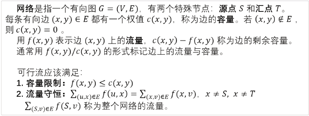
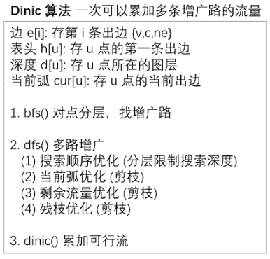
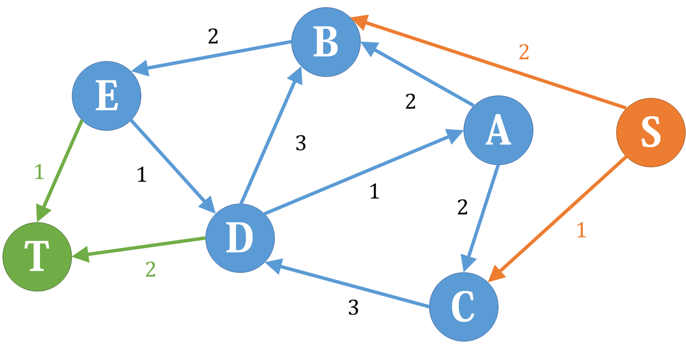

专题 | 网络流

# 目录

- 最大流 EK / Dinic

- 最小割 Dinic

- 费用流 EK


# 参考

[361 网络流 最大流 EK 算法_哔哩哔哩_bilibili](https://www.bilibili.com/video/BV1o94y1271C/?spm_id_from=333.999.0.0&vd_source=f45ea4e1e4b3b73d5f07c57b46c43aba)

# 定义



流量守恒：流入dianS的流量和=流出S的流量和

源点的流出流量和=整个网络的流量


**残留网的可行性解释：**


原来路径1→2→4→6的流量为5，现在1→3→4有一个流量为2的流，到4时发现被堵住了。建立了残留网之后，就可以通过它向上走到2，再通过2→5→6到达汇点

则其实是由以下变化等效而来的：

路径1→2→4→6的流量为5变化为1→2为5，到了2后分为

- 3 从2→4→6

- 2 从2→5→6

这样1→3→4→6就可以有2的流量了


请思考


# EK算法求最大流

过程


更正：bfs2.（1）更新u的流量上限

## 题目描述

如题，给出一个网络图，以及其源点和汇点，求出其网络最大流。

## 输入格式

第一行包含四个正整数 $n,m,s,t$，分别表示点的个数、有向边的个数、源点序号、汇点序号。

接下来 $m$ 行每行包含三个正整数 $u_i,v_i,w_i$，表示第 $i$ 条有向边从 $u_i$ 出发，到达 $v_i$，边权为 $w_i$（即该边最大流量为 $w_i$）。

## 输出格式

一行，包含一个正整数，即为该网络的最大流。

## 样例 #1

### 样例输入 #1

```C++
4 5 4 3
4 2 30
4 3 20
2 3 20
2 1 30
1 3 30
```

### 样例输出 #1

```C++
50
```

## 提示

#### 样例输入输出 1 解释


题目中存在 $3$ 条路径：

- $4\to 2\to 3$，该路线可通过 $20$ 的流量。

- $4\to 3$，可通过 $20$ 的流量。

- $4\to 2\to 1\to 3$，可通过 $10$ 的流量（边 $4\to 2$ 之前已经耗费了 $20$ 的流量）。

故流量总计 $20+20+10=50$。输出 $50$。

---

#### 数据规模与约定

- 对于 $30\%$ 的数据，保证 $n\leq10$，$m\leq25$。

- 对于 $100\%$ 的数据，保证 $1 \leq n\leq200$，$1 \leq m\leq 5000$，$0 \leq w\lt 2^{31}$。

## AC的code

```C++
#include<bits/stdc++.h>
using namespace std;
#define int long long
const int N=1e4+5;
int mf[N];//最大流量maxflow 
int s,t,pre[N],n,m,u,v,w;
struct edge{
	int v,c,nxt;
}e[20*N];
int h[N],idx=1;//边的id从2开始存,因为边与残留边对应,使用i^1可以迅速在n与n+1之间相互转换(n为偶数),不用特判 
void add(int a,int b,int c){
	e[++idx]={b,c,h[a]};
	h[a]=idx;
}
bool bfs(){//找一条可以从s到t的有效路径 
	memset(mf,0,sizeof mf);//将每个点的流量上限变成0
	queue<int> q;
	q.push(s);mf[s]=1e9;//源点的流量上限为无穷大,即源点能为后面提供无限大的流量 
	while(q.size()){
		int u=q.front();q.pop();
		for(int i=h[u];i;i=e[i].nxt){//扫描出边 
			int v=e[i].v;
			if(!mf[v]&&e[i].c){//如果 没有访问过v(在本轮bfs中,即碰到环不走回头路)并且存在这条边/这条边在之前走过但还有空余容量(容量>0) 
				//***重要 
				mf[v]=min(mf[u],e[i].c);//更新流量上限为之前更新过的可以到达u的流量(即点u能提供的最大流量)与u-v见之间的容量的min 
				pre[v]=i; //存目前路径上点v的前驱边
				//***
				q.push(v);
				if(v==t)return 1;//说明找到了一条增广路 
				 //找增光路相当于找到一条新的流量到t,回顾二分图的增光路,之前已经找到的增光路的路径可以调整,但流量不会变化(即不会使之前已经有的流量减小) 
			}
		}
	}
	return 0;
} 
int EK(){
	int nf=0;//当前流量nowflow 
	while(bfs()){//新找到一条增广路,路的流量为mf[t] (流量是从s开始在到达t途中受到限制逐渐减小的,因此到达t的流量才是这条路的流量)
		int v=t;
		while(v!=s){//从t往回在更新残留网 
			int i=pre[v];
			//***重要 
			e[i].c-=mf[t];//主边,空余的容量减少了 
			e[i^1].c+=mf[t];//残留边(反向边) 
			//此消彼长 
			//***
			v=e[i^1].v; 
		}
		nf+=mf[t];//汇入一股新的流量 
	}
	return nf; 
}
signed main(){
	cin>>n>>m>>s>>t;
	for(int i=1;i<=m;i++){
		cin>>u>>v>>w;
		add(u,v,w);add(v,u,0);
		
	}
	cout<<EK()<<endl; 
}
```

# Dinic算法求最大流


## 函数`memcpy`

**用法1**

```C++
memcpy(cur,h,sizeof h);
```

将数组`h`的内容复制到`cur`中(完全覆盖)

**用法2**

以下代码可以一步将b插入到a的后面，当然你手写也行，只不过效率低下

```C++
memcpy(a+len_a, b, len_b);//a,b为数组,len_a,len_b为变量，存的是a,b数组的大小
```

**注意**

对于memcpy与for的时间复杂度，网络上有不同的解说。我们把他们看成复杂度相同即可。

但注意以下信息：

string在使用memcpy进行拷贝时，会崩溃，这与数据类型有关。所以对于长度可变的数据类型，请不要使用memcpy

## Dinic算法



如下图，1为第1层，2，3为第2层……8为第4层

即d[1]=1,d[2]=d[3]=2,...,d[8]=4

以上会在bfs时处理出来


## AC的code

```C++
/*////////ACACACACACACAC///////////
Code By Ntsc
/*////////ACACACACACACAC///////////
#include<bits/stdc++.h>
using namespace std;
#define int long long
const int N=1e5;

struct edge{
	int v,c,nxt;
}e[N];
int n,m,h[N],ans,idx=1,d[N],s,t,cur[N];
void add(int x,int y,int b){
	e[++idx]={y,b,h[x]};
	h[x]=idx;
}
bool bfs(){//对每个点进行分层 ,为dfs找增广路做准备 
	memset(d,0,sizeof d);
	queue<int>q;
	q.push(s);d[s]=1;//源点是第一层 
	while(q.size()){
		int u=q.front();q.pop();
		for(int i=h[u];i;i=e[i].nxt){
			int v=e[i].v;
			if(!d[v]&&e[i].c){//如果没有访问过v并且这条边有剩余容量 
				d[v]=d[u]+1;//v点位于u的下一层 
				q.push(v) ;
				if(v==t)return 1;
			}
		}
	}
	return 0;
} 
int dfs(int u,int mf){//当前点u,(这条路径上)走到u时的剩余流量 
	//入33 下37 回42 离50 
	 if(u==t)return mf;//如果已经到达汇点,直接返回
	 int sum=0;//计算u点可以流出的流量之和 (e.g.当u=2时,最后sum=3+3+4+2+3)
	 
	 for(int i=cur[u];i;i=e[i].nxt){
	 	cur[u]=i;//记录从哪一条边走出去了，当前弧优化
	 	int v=e[i].v;
	 	
	 	if(d[v]==d[u]+1&&e[i].c){//如果v在u的下一层 并且有剩余容量 
	 		int f=dfs(v,min(mf,e[i].c));//正如EK中的'mf[v]=min(mf[u],e[i].c);' 
		 	//回
			e[i].c-=f;
			e[i^1].c+=f;//更新残留网,对照EK 
			sum+=f;
			mf-=f;//类似八皇后,请思考! 
			if(!mf)break;//优化.当在u的前几条分支已经流光了u的可用流量时,就不用考虑剩下的分支了 
		 }
	 } 
	 if(!sum)d[u]=0;//残枝优化.目前这条路没有可行流了 
	 return sum;
}
int dinic(){//累加答案 
	int ans=0;
	while(bfs()){//可以找到增光路 
		memcpy(cur,h,sizeof h);//请思考! 
		ans+=dfs(s,1e9);//还是那句话'//源点的流量上限为无穷大,即源点能为后面提供无限大的流量' 
	}
	return ans;
} 
signed main(){
	cin>>n>>m>>s>>t;
	for(int i=1;i<=m;i++){
		int u,v,w;
		cin>>u>>v>>w;
		add(u,v,w);add(v,u,0);
		
	} 
	cout<<dinic()<<endl;
	return 0;
}

```

# 输出方案

[学习笔记 | 网络流](https://flowus.cn/56bc8561-bb4f-4951-b785-9de97d46b065)T2

实际上只要扫描一遍所有边就行了，对于可能满足条件的边判断一下，如果$e_i.c=0$就说明没有空余流量，即边$i$有流量。

# 网络流 最小割 Dinic 算法

[363 网络流 最小割 Dinic 算法_哔哩哔哩_bilibili](https://www.bilibili.com/video/BV1iG411s7iX/?spm_id_from=333.788.recommend_more_video.0&vd_source=f45ea4e1e4b3b73d5f07c57b46c43aba)


注：容易划分均可


如上图。左边为$S$，右边为$T$，$c(S,T)=7+6$即1→2和1→4的容量和，不包括从$T$到$S$的（即5→1）


如上图。左边为$S$，右边为$T$，$c(S,T)=2+1+2$即2→3和2→5和4→5的容量和，不包括从$T$到$S$的（即5→1）


即：最大流的流量=最小割的容量


请思考证明！


### Q1 求最小割

其实就是求最大流，模板即可

### Q2 

在求完最大流后 对残留网进行dfs

```C++
void mincut(int u){
    vis[u]=1;
    for(int i=h[u];i;i=e[i].nxt){
        int v=e[i].v;
        if(!vis[v])&&e[i].c){mincut(v);}
    }
}
```

扫描后被标记的点就是$S$部分，否则就是$T$部分

### Q3

将正边为1，反向边为0，再次运行一遍dinic

```C++
//a[],b[]记录输入的点对
idx=1;
memset(h,0,sizeof h);
for(int i=1;i<=m;i++){
    add(a[i],b[i],1);
    add(b[i],a[i],0);
}
cout<<dinic()<<endl;
```

# [USACO4.4] 追查坏牛奶 Pollutant Control

## 题目描述

你第一天接手三鹿牛奶公司就发生了一件倒霉的事情：公司不小心发送了一批有三聚氰胺的牛奶。

很不幸，你发现这件事的时候，有三聚氰胺的牛奶已经进入了送货网。这个送货网很大，而且关系复杂。你知道这批牛奶要发给哪个零售商，但是要把这批牛奶送到他手中有许多种途径。

送货网由一些仓库和运输卡车组成，每辆卡车都在各自固定的两个仓库之间单向运输牛奶。在追查这些有三聚氰胺的牛奶的时候，有必要保证它不被送到零售商手里，所以必须使某些运输卡车停止运输，但是停止每辆卡车都会有一定的经济损失。

你的任务是，在保证坏牛奶不送到零售商的前提下，制定出停止卡车运输的方案，使损失最小。

## 输入格式

第 $1$ 行两个整数 $N$、$M$，$N$ 表示仓库的数目，$M$ 表示运输卡车的数量。仓库 $1$ 代表发货工厂，仓库 $N$ 代表有三聚氰胺的牛奶要发往的零售商。

第 $2\sim M+1$ 行，每行 $3$ 个整数 $S_i$、$E_i$ 和 $C_i$。其中 $S_i$、$E_i$ 分别表示这辆卡车的出发仓库和目的仓库。$C_i$ 表示让这辆卡车停止运输的损失。

## 输出格式

两个整数 $C$ 和 $T$，$C$ 表示最小的损失，$T$ 表示在损失最小的前提下，最少要停止的卡车数。

## 样例 #1

### 样例输入 #1

```C++
4 5
1 3 100
3 2 50
2 4 60
1 2 40
2 3 80
```

### 样例输出 #1

```C++
60 1
```

## 提示

对于 $100 \%$ 的数据，满足 $2 \le N \le 32$，$0 \le M \le 10^3$，$1 \le S_i \le N$，$1 \le E_i \le N$，$0 \le C_i \le 2 \times 10^6$。

题目翻译来自 NOCOW。

USACO Training Section 4.4

## code

```C++
....
```

# 费用流

见 [专题 | 二分图 & 二部图问题](https://flowus.cn/d0a592ec-90fb-41ef-b721-a9cdb64d5068)


# 上下界网络流

[算法学习笔记(60): 上下界网络流](https://zhuanlan.zhihu.com/p/324507636)


上下界网络流可以看做普通[网络流](https://zhuanlan.zhihu.com/p/122375531)的升级版，现在对于流量网络，我们不再只关注其流量的**上界**，而是同时关注流量的**上下界**。

以下摘自知乎，仅限看懂了的内容。

## 无源汇有上下界可行流

这是上下界网络流中最简单的一种，给定一个没有源点和汇点、每条边的流量有上下界的流量网络，问是否存在一种可行流使得流量平衡。


做法是，我们把它**拆**成两个结构与原图相同的普通网络，一个每条边的容量为原网络对应边的**流量下界**，另一个为对应边的**流量上界与下界之差**。


我们希望下界网络和差网络的流相加后恰好是原图的一个可行流，这首先要求下界网络是满流的（可行流必须达到每条边的下界）。但是下界网络满流后不一定流量平衡，所以我们要对差网络进行一定的修改以弥补这种不平衡。

我们分别考虑下界网络的每个点。A点，流入量为3，流出量也为3，所以是平衡的，那么在差网络中，也应该是平衡的，所以不做修改。B点，流入量为3，流出量为1，流入比流出多2，所以我们希望在差网络中，B的流出应该比流入多2，于是我们在差网络中新设一个**源点**，然后加入一条容量为2的**附加边**从源点连向B，这样在差网络平衡时，除去附加边，B点的流出恰好比流入多2，C点与B点类似。D点则相反，因为我们希望在差网络中D点流入比流出多2，所以我们新设一个**汇点**，然后从D点连一条容量为2的附加边到汇点，E点又和D类似。

也就是说，如果下界网络中某个点有x的净流入，在差网络中我们就从源点向它连一条容量为x的附加边；相反，如果下界网络中某个点有x的净流出，在差网络中我们就从它向汇点连一条容量为x的附加边。这样，我们把差网络修改如下：



在差网络上跑一遍最大流，把每条非附加边的流，加上下界网络的满流，就是一个可行流。但是，如果跑完最大流发现，*存在附加边未满流*，那说明平衡条件没有得到满足，于是原图不存在可行流。

在实际中，是不需要建立下界网络的，只需要对差网络进行操作即可。另外最后判断的时候并无必要遍历所有附加边，而只需要判断所有从源点出发的边，或者判断所有连向汇点的边即可，因为根据网络流的性质，两者容量和应该相等，于是它们要么都满流，要么都不满流。

## 有源汇有上下界可行流

从汇点到源点连一条下界为 $0$ ，上界为 $\inf$ 的附加边，得到一张和原图等价的无源汇流量网络，于是转化成了无源汇有上下界可行流问题。此时从源点到汇点的可行流流量，即为从汇点到源点的那条附加边的流量（注意下界网络中对应边流量为0）。

## 有源汇有上下界最大流

## 有上下界最小费用可行流

和（无/有源汇）有上下界可行流的原理相同，也是拆成两个网络。所有附加边的费用设为0。最后的费用是下界网络满流的费用，加上在差网络上跑MCMF（最小费用最大流）后得到的费用之和。而前者即所有边的容量与费用乘积的和。注意，这样求出来的是满足最小费用的可行流，而不是满足流最大的前提下费用最小的流。

