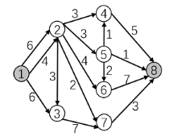

# Dinic算法求最大流


## 函数`memcpy`

**用法1**

```C++
memcpy(cur,h,sizeof h);
```

将数组`h`的内容复制到`cur`中(完全覆盖)

**用法2**

以下代码可以一步将b插入到a的后面，当然你手写也行，只不过效率低下

```C++
memcpy(a+len_a, b, len_b);//a,b为数组,len_a,len_b为变量，存的是a,b数组的大小
```

**注意**

对于memcpy与for的时间复杂度，网络上有不同的解说。我们把他们看成复杂度相同即可。

但注意以下信息：

string在使用memcpy进行拷贝时，会崩溃，这与数据类型有关。所以对于长度可变的数据类型，请不要使用memcpy

## Dinic算法



如下图，1为第1层，2，3为第2层……8为第4层

即d[1]=1,d[2]=d[3]=2,...,d[8]=4

以上会在bfs时处理出来


## AC的code

```C++
/*////////ACACACACACACAC///////////
Code By Ntsc
/*////////ACACACACACACAC///////////
#include<bits/stdc++.h>
using namespace std;
#define int long long
const int N=1e5;

struct edge{
	int v,c,nxt;
}e[N];
int n,m,h[N],ans,idx=1,d[N],s,t,cur[N];
void add(int x,int y,int b){
	e[++idx]={y,b,h[x]};
	h[x]=idx;
}
bool bfs(){//对每个点进行分层 ,为dfs找增广路做准备 
	memset(d,0,sizeof d);
	queue<int>q;
	q.push(s);d[s]=1;//源点是第一层 
	while(q.size()){
		int u=q.front();q.pop();
		for(int i=h[u];i;i=e[i].nxt){
			int v=e[i].v;
			if(!d[v]&&e[i].c){//如果没有访问过v并且这条边有剩余容量 
				d[v]=d[u]+1;//v点位于u的下一层 
				q.push(v) ;
				if(v==t)return 1;
			}
		}
	}
	return 0;
} 
int dfs(int u,int mf){//当前点u,(这条路径上)走到u时的剩余流量 
	//入33 下37 回42 离50 
	 if(u==t)return mf;//如果已经到达汇点,直接返回
	 int sum=0;//计算u点可以流出的流量之和 (e.g.当u=2时,最后sum=3+3+4+2+3)
	 
	 for(int i=cur[u];i;i=e[i].nxt){
	 	cur[u]=i;//记录从哪一条边走出去了，当前弧优化
	 	int v=e[i].v;
	 	
	 	if(d[v]==d[u]+1&&e[i].c){//如果v在u的下一层 并且有剩余容量 
	 		int f=dfs(v,min(mf,e[i].c));//正如EK中的'mf[v]=min(mf[u],e[i].c);' 
		 	//回
			e[i].c-=f;
			e[i^1].c+=f;//更新残留网,对照EK 
			sum+=f;
			mf-=f;//类似八皇后,请思考! 
			if(!mf)break;//优化.当在u的前几条分支已经流光了u的可用流量时,就不用考虑剩下的分支了 
		 }
	 } 
	 if(!sum)d[u]=0;//残枝优化.目前这条路没有可行流了 
	 return sum;
}
int dinic(){//累加答案 
	int ans=0;
	while(bfs()){//可以找到增光路 
		memcpy(cur,h,sizeof h);//请思考! 
		ans+=dfs(s,1e9);//还是那句话'//源点的流量上限为无穷大,即源点能为后面提供无限大的流量' 
	}
	return ans;
} 
signed main(){
	cin>>n>>m>>s>>t;
	for(int i=1;i<=m;i++){
		int u,v,w;
		cin>>u>>v>>w;
		add(u,v,w);add(v,u,0);
		
	} 
	cout<<dinic()<<endl;
	return 0;
}

```

## 输出方案

[学习笔记 | 网络流](https://flowus.cn/56bc8561-bb4f-4951-b785-9de97d46b065)T2

实际上只要扫描一遍所有边就行了，对于可能满足条件的边判断一下，如果$e_i.c=0$就说明没有空余流量，即边$i$有流量。

