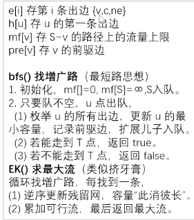

# EK算法求最大流

过程



更正：bfs2.（1）更新u的流量上限

## 题目描述

如题，给出一个网络图，以及其源点和汇点，求出其网络最大流。

## 输入格式

第一行包含四个正整数 $n,m,s,t$，分别表示点的个数、有向边的个数、源点序号、汇点序号。

接下来 $m$ 行每行包含三个正整数 $u_i,v_i,w_i$，表示第 $i$ 条有向边从 $u_i$ 出发，到达 $v_i$，边权为 $w_i$（即该边最大流量为 $w_i$）。

## 输出格式

一行，包含一个正整数，即为该网络的最大流。

## 样例 #1

### 样例输入 #1

```C++
4 5 4 3
4 2 30
4 3 20
2 3 20
2 1 30
1 3 30
```

### 样例输出 #1

```C++
50
```

## 提示

#### 样例输入输出 1 解释


题目中存在 $3$ 条路径：

- $4\to 2\to 3$，该路线可通过 $20$ 的流量。

- $4\to 3$，可通过 $20$ 的流量。

- $4\to 2\to 1\to 3$，可通过 $10$ 的流量（边 $4\to 2$ 之前已经耗费了 $20$ 的流量）。

故流量总计 $20+20+10=50$。输出 $50$。

---

#### 数据规模与约定

- 对于 $30\%$ 的数据，保证 $n\leq10$，$m\leq25$。

- 对于 $100\%$ 的数据，保证 $1 \leq n\leq200$，$1 \leq m\leq 5000$，$0 \leq w\lt 2^{31}$。

## AC的code

```C++
#include<bits/stdc++.h>
using namespace std;
#define int long long
const int N=1e4+5;
int mf[N];//最大流量maxflow 
int s,t,pre[N],n,m,u,v,w;
struct edge{
	int v,c,nxt;
}e[20*N];
int h[N],idx=1;//边的id从2开始存,因为边与残留边对应,使用i^1可以迅速在n与n+1之间相互转换(n为偶数),不用特判 
void add(int a,int b,int c){
	e[++idx]={b,c,h[a]};
	h[a]=idx;
}
bool bfs(){//找一条可以从s到t的有效路径 
	memset(mf,0,sizeof mf);//将每个点的流量上限变成0
	queue<int> q;
	q.push(s);mf[s]=1e9;//源点的流量上限为无穷大,即源点能为后面提供无限大的流量 
	while(q.size()){
		int u=q.front();q.pop();
		for(int i=h[u];i;i=e[i].nxt){//扫描出边 
			int v=e[i].v;
			if(!mf[v]&&e[i].c){//如果 没有访问过v(在本轮bfs中,即碰到环不走回头路)并且存在这条边/这条边在之前走过但还有空余容量(容量>0) 
				//***重要 
				mf[v]=min(mf[u],e[i].c);//更新流量上限为之前更新过的可以到达u的流量(即点u能提供的最大流量)与u-v见之间的容量的min 
				pre[v]=i; //存目前路径上点v的前驱边
				//***
				q.push(v);
				if(v==t)return 1;//说明找到了一条增广路 
				 //找增光路相当于找到一条新的流量到t,回顾二分图的增光路,之前已经找到的增光路的路径可以调整,但流量不会变化(即不会使之前已经有的流量减小) 
			}
		}
	}
	return 0;
} 
int EK(){
	int nf=0;//当前流量nowflow 
	while(bfs()){//新找到一条增广路,路的流量为mf[t] (流量是从s开始在到达t途中受到限制逐渐减小的,因此到达t的流量才是这条路的流量)
		int v=t;
		while(v!=s){//从t往回在更新残留网 
			int i=pre[v];
			//***重要 
			e[i].c-=mf[t];//主边,空余的容量减少了 
			e[i^1].c+=mf[t];//残留边(反向边) 
			//此消彼长 
			//***
			v=e[i^1].v; 
		}
		nf+=mf[t];//汇入一股新的流量 
	}
	return nf; 
}
signed main(){
	cin>>n>>m>>s>>t;
	for(int i=1;i<=m;i++){
		cin>>u>>v>>w;
		add(u,v,w);add(v,u,0);
		
	}
	cout<<EK()<<endl; 
}
```

