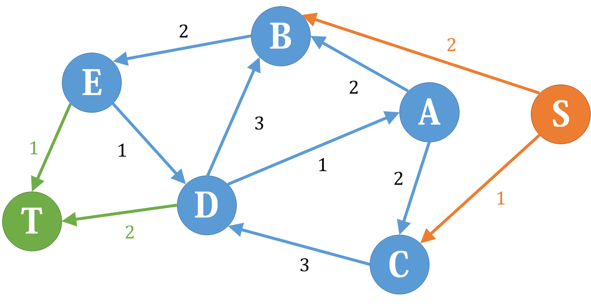

# 上下界网络流

[算法学习笔记(60): 上下界网络流](https://zhuanlan.zhihu.com/p/324507636)

上下界网络流可以看做普通[网络流](https://zhuanlan.zhihu.com/p/122375531)的升级版，现在对于流量网络，我们不再只关注其流量的**上界**，而是同时关注流量的**上下界**。

以下摘自知乎，仅限易懂的内容。

## 无源汇有上下界可行流

这是上下界网络流中最简单的一种，给定一个没有源点和汇点、每条边的流量有上下界的流量网络，问是否存在一种可行流使得流量平衡。

做法是，我们把它**拆**成两个结构与原图相同的普通网络，一个每条边的容量为原网络对应边的**流量下界**，另一个为对应边的**流量上界与下界之差**。

我们希望下界网络和差网络的流相加后恰好是原图的一个可行流，这首先要求下界网络是满流的（可行流必须达到每条边的下界）。但是下界网络满流后不一定流量平衡，所以我们要对差网络进行一定的修改以弥补这种不平衡。

我们分别考虑下界网络的每个点。A点，流入量为3，流出量也为3，所以是平衡的，那么在差网络中，也应该是平衡的，所以不做修改。B点，流入量为3，流出量为1，流入比流出多2，所以我们希望在差网络中，B的流出应该比流入多2，于是我们在差网络中新设一个**源点**，然后加入一条容量为2的**附加边**从源点连向B，这样在差网络平衡时，除去附加边，B点的流出恰好比流入多2，C点与B点类似。D点则相反，因为我们希望在差网络中D点流入比流出多2，所以我们新设一个**汇点**，然后从D点连一条容量为2的附加边到汇点，E点又和D类似。

也就是说，如果下界网络中某个点有x的净流入，在差网络中我们就从源点向它连一条容量为x的附加边；相反，如果下界网络中某个点有x的净流出，在差网络中我们就从它向汇点连一条容量为x的附加边。这样，我们把差网络修改如下：

在差网络上跑一遍最大流，把每条非附加边的流，加上下界网络的满流，就是一个可行流。但是，如果跑完最大流发现，*存在附加边未满流*，那说明平衡条件没有得到满足，于是原图不存在可行流。

在实际中，是不需要建立下界网络的，只需要对差网络进行操作即可。另外最后判断的时候并无必要遍历所有附加边，而只需要判断所有从源点出发的边，或者判断所有连向汇点的边即可，因为根据网络流的性质，两者容量和应该相等，于是它们要么都满流，要么都不满流。

## 有源汇有上下界可行流

从汇点到源点连一条下界为 $0$ ，上界为 $\inf$ 的附加边，得到一张和原图等价的无源汇流量网络，于是转化成了无源汇有上下界可行流问题。此时从源点到汇点的可行流流量，即为从汇点到源点的那条附加边的流量（注意下界网络中对应边流量为0）。

## 有源汇有上下界最大流

## 有上下界最小费用可行流

和（无/有源汇）有上下界可行流的原理相同，也是拆成两个网络。所有附加边的费用设为0。最后的费用是下界网络满流的费用，加上在差网络上跑MCMF（最小费用最大流）后得到的费用之和。而前者即所有边的容量与费用乘积的和。注意，这样求出来的是满足最小费用的可行流，而不是满足流最大的前提下费用最小的流。

