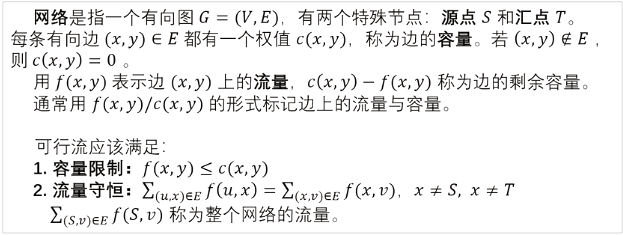
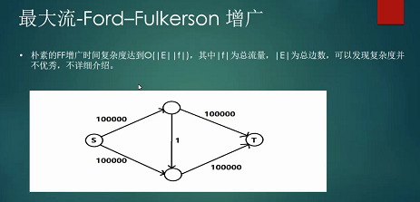

参考

[361 网络流 最大流 EK 算法_哔哩哔哩_bilibili](https://www.bilibili.com/video/BV1o94y1271C/?spm_id_from=333.999.0.0&vd_source=f45ea4e1e4b3b73d5f07c57b46c43aba)

# 网络流的定义

**网络**是指一个有向图$G=(V,E)$，有两个特殊节点：源点S和汇点T。每条有向边$(x,y)\in E$都有一个权值$c(x,y)$，称为边的容量。若$(x,y)\notin E$，则$c(x,y)=0$。
用$f(x,y)$表示边$(x,y)$上的流量，$c(x,y)-f(x,y)$称为边的剩余容量。通常用$f(x,y)/c(x,y)$的形式标记边上的流量与容量。
可行流应该满足：

1. 容量限制：$f(x,y)\leq c(x,y)$

2. 流量守恒：$\sum_{(u,x)\in E}f(u,x)=\sum_{(x,v)\in E}f(x,v),x\not=S,x\not=T
$$\sum_{(S,v)\in E}f(S,v)$称为整个网络的流量。

流量守恒：流入dianS的流量和=流出S的流量和

源点的流出流量和=整个网络的流量

最小流：从源点流向汇点的最大流量。
增广路：一条从源点到汇点的所有边的剩余容量≥0的路经。
残圈网：由网络中所有结点和剩余容量大于0的边构成的子图，这里的边包括有向边和其反向边。
建图时每条有向边(x,y)都构建一条反向边(y,x)，初始容量c(y,x)=0。构建反向边的目的是提供一个“退流管道”，一旦前面的增广路堵死可行流，可以通过“退流管道”退流，提供了“后悔机制”。

**残留网的可行性解释：**

原来路径1→2→4→6的流量为5，现在1→3→4有一个流量为2的流，到4时发现被堵住了。建立了残留网之后，就可以通过它向上走到2，再通过2→5→6到达汇点

则其实是由以下变化等效而来的：

路径1→2→4→6的流量为5变化为1→2为5，到了2后分为

- 3 从2→4→6

- 2 从2→5→6

这样1→3→4→6就可以有2的流量了

请思考

