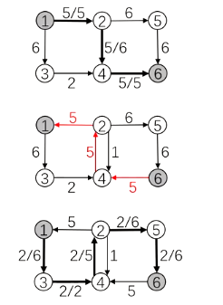

参考

[361 网络流 最大流 EK 算法_哔哩哔哩_bilibili](https://www.bilibili.com/video/BV1o94y1271C/?spm_id_from=333.999.0.0&vd_source=f45ea4e1e4b3b73d5f07c57b46c43aba)

# 定义

流量守恒：流入dianS的流量和=流出S的流量和

源点的流出流量和=整个网络的流量

**残留网的可行性解释：**

原来路径1→2→4→6的流量为5，现在1→3→4有一个流量为2的流，到4时发现被堵住了。建立了残留网之后，就可以通过它向上走到2，再通过2→5→6到达汇点

则其实是由以下变化等效而来的：

路径1→2→4→6的流量为5变化为1→2为5，到了2后分为

- 3 从2→4→6

- 2 从2→5→6

这样1→3→4→6就可以有2的流量了

请思考

