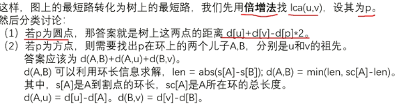

# 网络流的应用建模

这里我们暂时介绍两种题型：

- 拆点，限制流量上限。

- 二分答案，判断最小可行方案所需花费。

## 例题 #1 [USACO07OPEN] Dining G

有 $F$ 种食物和 $D$ 种饮料，每种食物或饮料只能供一头牛享用，且每头牛只享用一种食物和一种饮料。现在有 $n$ 头牛，每头牛都有自己喜欢的食物种类列表和饮料种类列表，问最多能使几头牛同时享用到自己喜欢的食物和饮料。

对于全部数据，$1 \le f \le 100$，$1 \le d \le 100$，$1 \le n \le 100$。

---

我们可以考虑一个有效方案是什么：应该是一条链穿起来一个food,drink和一头牛。

那么为了保证每头牛只享用一种食物和一种饮料，那么我们需要一个建边的技巧：

### 重要技巧：拆点

由这道题我们来学习网络流的重要技巧：拆点

文中有一个要求每种食物或饮料只能供一头牛享用，且每头牛只享用一种食物和一种饮料，怎么解决这个问题呢？这就需要一个网络流中的常用方法：拆点。

就是把一个点拆成两个点（入点和出点），所有指向这个点的边都连向入点，而从这个点连出去的所有边的起点都在这个点的出点。就像下图一样**：**


然后**通过入点和出点间的容量**（如图，为1）**来限制经过这个点的流量**，那么就只能有一种食物和一种饮料被这头牛吃。

---

本题，我们**拆点为边**，令牛i的点为i,i+n，其中通过一条容量为1的边链接，这样就可以保证通过一头牛的流量最多为1了。

为了实现每种食物或饮料只能供一头牛享用，我们只需要让超级源点→食物和饮料→超级汇点的边权都是1即可。牛和食物/饮料之间的边权随意。




## 例题 #2 [USACO05MAR] Ombrophobic Bovines 发抖的牛

FJ 的牛们非常害怕淋雨，那会使他们瑟瑟发抖。他们打算安装一个下雨报警器，并且安排了一个撤退计划。他们需要计算最少的让所有牛进入雨棚的时间。
牛们在农场的 $F$ 个田地上吃草。有 $P$ 条双向路连接着这些田地。路很宽，无限量的牛可以通过。田地上有雨棚，雨棚有一定的容量，牛们可以瞬间从这块田地进入这块田地上的雨棚。
请计算最少的时间，让每只牛都进入雨棚。

第 $1$ 行：两个整数 $F$ 和 $P$；
第 $2$ 到 $F+1$ 行：第 $i+1$ 行有两个整数描述第 $i$ 个田地，第一个表示田地上的牛数，第二个表示田地上的雨棚容量。两个整数都在 $0$ 和 $1000$ 之间。
第 $F+2$ 到 $F+P+1$ 行：每行三个整数描述一条路，分别是起点终点，及通过这条路所需的时间（在 $1$ 和 $10^9$ 之间）。

一个整数，表示最少的时间。如果无法使牛们全部进入雨棚，输出 $-1$。

提示

对于 $100\%$ 的数据：$1\le F\le 200$，$1\le P\le 1500$。

### 大意

一副无向图中有 $n$ 个点，晴天时第 $i$ 个点上有 $p_i$ 个人，在下雨天时第 $i$ 个点上可以容纳 $w_i$ 个人，求开始下雨时如何调配使得所有人走到路的用时和最小。路$i$的用时记为 $t_i$。

### 思路

先分析题目，题目要求最小时间，所以肯定符合二分答案（**二分用时**）的性质。先拆点，把每个点 $i$ 拆成 $u_i,v_i$，代表 $p_i$ 和 $w_i$，对于每次二分到的时间，如果某两点之间可以在这个时间内到达（**最短路**求出），则建起一条无限流量的边。然后建一个超级源点，到每个 $u_i$ 建一条边权为 $p_i$ 的数量的边，最后建一个超级汇点，每个 $v_i$ 连一条边权为 $w_i$ 的边到汇点。

**二分设计**

被二分的值：用时和。

边界：$l$ 为 $0$，$r$ 为所有 $t_i$ 之和（当然取 $INF$ 问题也不大）。

`judge()` 函数：每次跑一下最大流，判定流量是否大于总牛量。

**最短路**

多源最短路（Floyd 全源最短路即可，神仙们写 Johnson 应该也行）。区别于网络流，我们需要建另外一幅图，用来跑最短路。

**最大流**

dinic 算法。重点在建图上：

1. 把每个点 $i$ 拆成 $u_i,v_i$（这样就会有 $2\times n$ 个点了），代表 $p_i$ 和 $w_i$，对于每次二分到的时间，如果某两点之间可以在这个时间内到达（**最短路**求出），则建起一条无限流量的边。

2. 建一个超级源点 $S$，到每个 $u_i$ 连一条边权为 $p_i$ 的边。

3. 建一个超级汇点 $T$，每个 $v_i$ 连一条边权为 $w_i$ 的边到汇点。

为了方便，我们把 $S,T$ 分别设置在点 $2\times n,2\times n+1$ 上。

### 代码详解

**输入**

```C++

signed main(){
	scanf("%d%d",&n,&m);
	S=2*n+1,T=2*n+2;
	for(int i=1;i<=n;++i){
		scanf("%d%d",&cow[i],&house[i]);
		sum+=(ll)cow[i];//记录牛的总数
	}
	
	//弗洛伊德初始化
	for(int i=1;i<=n;++i)
		for(int j=1;j<=n;++j)
			dis[i][j]=INF;
	for(int i=1;i<=n;++i)
		dis[i][i]=0;
		
	//加边
	for(int i=1;i<=m;++i){
		int u,to,w;
		scanf("%d%d%d",&u,&to,&w);
		dis[u][to]=min(dis[u][to],w);//注意两个点之间可能有多条路
		dis[to][u]=min(dis[to][u],w);
	}
}
```

**最短路**

最短路我们只需要求一次即可，就像预处理一样。所以我们先写最短路。

```C++
void flyd(){
	for(int k=1;k<=n;k++)
		for(int i=1;i<=n;i++)
			for(int j=1;j<=n;j++)
				dis[i][j]=min(dis[i][j],dis[i][k]+dis[k][j]);
}
```

**二分**

```C++
	ll l=0,r=INF;
	while(l<=r)	{
		ll mid=(l+r)>>1;
		if(judge(mid)){
			ans=mid;
			r=mid-1;
		}
		else l=mid+1;
	}
```

**判定函数**

```C++

void init(){
	memset(h,0,sizeof h);
  	memset(cur,0,sizeof cur);
	for(int i=1;i<=N-2;i++){
		memset(&e[i],0,sizeof(struct edge));
	}
	idx=1;
}

bool judge(int mid){
	init();//注意这里要多次建网络流跑dinic,所以需要init(清空旧的网络流图)
	for (int i = 1; i <= n; ++i){
		add(S, i, cow[i]);//建网络流图
		add(i, S, 0);//建反向图
		add(i + n, T, house[i]);
		add(T,i + n, 0);
		for (int j = 1; j <= n; ++j){
			if (i == j || dis[i][j] <= mid){//如果某两点之间可以在这个时间内到达（最短路求出），则建起一条无限流量的边
				add(i, j + n, INF);
                add(j + n, i, 0);
            }
		}
	}
	ll ans = dinic();
//	printf("%lld\n", F);
	return (ans >= sum);
} 
```

**dinic**

最大流板子，巴巴多斯（不必多说）。

```C++
struct edge{
	int to,nxt,c;
}e[N];
void add(int x,int y,int b){
	e[++idx]={y,h[x],b};
	h[x]=idx;
}

//...

bool bfs(){//对每个点进行分层 ,为dfs找增广路做准备 
	memset(d,0,sizeof d);
	queue<int>q;
	q.push(s);d[s]=1;//源点是第一层 
	while(q.size()){
		int u=q.front();q.pop();
		for(int i=h[u];i;i=e[i].nxt){
			int v=e[i].to;
			if(!d[v]&&e[i].c){//如果没有访问过v并且这条边有剩余容量 
				d[v]=d[u]+1;//v点位于u的下一层 
				q.push(v) ;
				if(v==t)return 1;
			}
		}
	}
	return 0;
} 
int dfs(int u,int mf){//当前点u,(这条路径上)走到u时的剩余流量 
 
	 if(u==t)return mf;//如果已经到达汇点,直接返回
	 int sum=0;//计算u点可以流出的流量之和 (e.g.当u=2时,最后sum=3+3+4+2+3)
	 
	 for(int i=cur[u];i;i=e[i].nxt){
	 	cur[u]=i;//记录从哪一条边走出去了 ,后面有用 
	 	int v=e[i].to;
	 	
	 	if(d[v]==d[u]+1&&e[i].c){//如果v在u的下一层 并且有剩余容量 
	 		int f=dfs(v,min(mf,e[i].c));//正如EK中的'mf[v]=min(mf[u],e[i].c);' 
		 	//回
			e[i].c-=f;
			e[i^1].c+=f;//更新残留网,对照EK 
			sum+=f;
			mf-=f;//类似八皇后,请思考! 
			if(!mf)break;//优化.当在u的前几条分支已经流光了u的可用流量时,就不用考虑剩下的分支了 
		 }
	 } 
	 if(!sum)d[u]=0;//残枝优化.目前这条路没有可行流了 
	 return sum;
}
int dinic(){//累加答案 
	int ans=0;
	while(bfs()){//可以找到增光路 
		memcpy(cur,h,sizeof h);//请思考! 
		ans+=dfs(s,1e9);//还是那句话'//源点的流量上限为无穷大,即源点能为后面提供无限大的流量' 
	}
	return ans;
} 
```

**总代码**

```C++
/*////////ACACACACACACAC///////////
       . Coding by Ntsc .
       . ToFind Chargcy .
       . Prove Yourself .
/*////////ACACACACACACAC///////////

//头文件
#include<bits/stdc++.h>

//数据类型
#define ll long long
#define int long long
#define ull unsigned long long
#define db double
#define endl '\n'
//命名空间
using namespace std;
//常量
const int N=4e3+5;
const int M=4e6+5;
const int MOD=903250223;
const int INF=1e18;
//变量
int n,a,b,c,x[N],y[N],ans,res,tmp,cnt,dis[N][N];
int idx,h[N],d[N],cur[N],cow[N],S,T,house[N],sum,m;

struct edge{
	int to,nxt,c;
}e[M];

void add(int x,int y,int b){
	e[++idx]={y,h[x],b};
	h[x]=idx;
}

bool bfs(){//对每个点进行分层 ,为dfs找增广路做准备 
	memset(d,0,sizeof d);
	queue<int>q;
	q.push(S);d[S]=1;//源点是第一层 
	while(q.size()){
		int u=q.front();q.pop();
		for(int i=h[u];i;i=e[i].nxt){
			int v=e[i].to;
			if(!d[v]&&e[i].c){//如果没有访问过v并且这条边有剩余容量 
				d[v]=d[u]+1;//v点位于u的下一层 
				q.push(v) ;
				if(v==T)return 1;
			}
		}
	}
	return 0;
} 

int dfs(int u,int mf){//当前点u,(这条路径上)走到u时的剩余流量 
//	memset(d,0,sizeof d);//..
	
	 if(u==T)return mf;//如果已经到达汇点,直接返回
	 int sum=0;//计算u点可以流出的流量之和 (e.g.当u=2时,最后sum=3+3+4+2+3)
	 
	 for(int i=cur[u];i;i=e[i].nxt){
	 	cur[u]=i;//记录从哪一条边走出去了 ,后面有用 
	 	int v=e[i].to;
	 	
	 	if(d[v]==d[u]+1&&e[i].c){//如果v在u的下一层 并且有剩余容量 
	 		int f=dfs(v,min(mf,e[i].c));//正如EK中的'mf[v]=min(mf[u],e[i].c);' 
		 	//回
			e[i].c-=f;
			e[i^1].c+=f;//更新残留网,对照EK 
			sum+=f;
			mf-=f;//类似八皇后,请思考! 
			if(!mf)break;//优化.当在u的前几条分支已经流光了u的可用流量时,就不用考虑剩下的分支了 
		 }
	 } 
	 if(!sum)d[u]=0;//残枝优化.目前这条路没有可行流了 
	 return sum;
}

int dinic(){//累加答案 
	int ans=0;
	while(bfs()){//可以找到增光路 
		memcpy(cur,h,sizeof h);//请思考! 
		ans+=dfs(S,INF);//还是那句话'//源点的流量上限为无穷大,即源点能为后面提供无限大的流量' 
	}
	return ans;
}

void init(){
	memset(h,0,sizeof h);
//	for(int i=1;i<=idx;i++){
//		e[i].to=e[i].nxt=e[i].c=0;
//	}
	memset(cur,0,sizeof cur);
	idx=1;
}

bool judge(int mid){
	init();//注意这里要多次建网络流跑dinic,所以需要init(清空旧的网络流图)
	for (int i = 1; i <= n; ++i){
		add(S, i, cow[i]);//建网络流图
		add(i, S, 0);//建反向图
		add(i + n, T, house[i]);
		add(T,i + n, 0);
		for (int j = 1; j <= n; ++j){
			if (i == j || dis[i][j] <= mid){//如果某两点之间可以在这个时间内到达（最短路求出），则建起一条无限流量的边
				add(i, j + n, INF);
				add(j + n, i, 0);
			}
		}
	}
	ll res = dinic();
//	printf("%lld\n", F);
	return (res >= sum);
} 

void flyd(){
	for(int k=1;k<=n;k++)
		for(int i=1;i<=n;i++)
			for(int j=1;j<=n;j++)
				dis[i][j]=min(dis[i][j],dis[i][k]+dis[k][j]);
}

signed main(){
	scanf("%lld%lld",&n,&m);
	S=2*n+1,T=2*n+2;
	for(int i=1;i<=n;++i){
		scanf("%lld%lld",&cow[i],&house[i]);
		sum+=cow[i];//记录牛的总数
	}
	
	//弗洛伊德初始化
	for(int i=1;i<=n;++i)
		for(int j=1;j<=n;++j)
			dis[i][j]=INF;
	for(int i=1;i<=n;++i)
		dis[i][i]=0;
		
	//加边
	for(int i=1;i<=m;++i){
		int u,to,w;
		scanf("%lld%lld%lld",&u,&to,&w);
		dis[u][to]=min(dis[u][to],w);//注意两个点之间可能有多条路
		dis[to][u]=min(dis[to][u],w);
	}
	flyd();
	ans=INF;
	ll l=0,r=INF;
	while(l<=r)	{
		ll mid=(l+r)>>1;
		if(judge(mid)){
			ans=mid;
			r=mid-1;
		}
		else l=mid+1;
	}
	if (ans == INF || ans == 0) printf("-1\n");
	else printf("%lld", ans);
}
```

### 惨痛教训

向循环中添加代码时间一定要检查括号（当循环中只有一句话时可能不会有括号，但如果要在其中加上其他代码，一定要加上括号）

