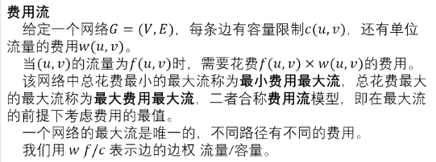
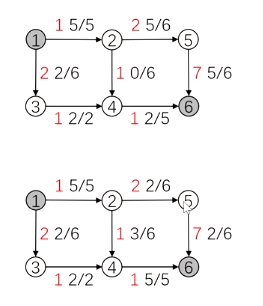
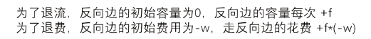

[b23.tv](https://b23.tv/v4GAHA0)
费用流

# 费用流

请先复习**网络流**的内容

## EK算法

[网络流](https://flowus.cn/db56502e-9cbd-4978-a11c-91bfeee6b4b6)

[364 网络流 费用流 EK 算法_哔哩哔哩_bilibili](https://www.bilibili.com/video/BV1SU4y1D77p/?spm_id_from=333.999.0.0&vd_source=f45ea4e1e4b3b73d5f07c57b46c43aba)



其中最大流指的是**总流量**最大，不是单独的一条路径



上图 最大费用最大流

下图 最小费用最大流


**与EK模板的区别**



**关于cost的修改**

```C++
#include<bits/stdc++.h>
using namespace std;
#define int long long
const int N=1e4+5;
int mf[N];//最大流量maxflow 
int s,t,pre[N],n,m;
int cst,dis[N],vis[N];
struct edge{
	int v,c,nxt,w;
}e[20*N];
int h[N],idx=1;//边的id从2开始存,因为边与残留边对应,使用i^1可以迅速在n与n+1之间相互转换(n为偶数),不用特判 
void add(int a,int b,int c,int dd){
	e[++idx]={b,c,h[a],dd};
	h[a]=idx;
}
//***重要 
bool spfa(){//找一条可以从s到t的有效路径 
	memset(dis,0x3f,sizeof dis);//最短路常规操作 
	dis[s]=0,vis[s]=1;//vis标记其是否在队内 
	memset(mf,0,sizeof mf);//将每个点能到达的流量上限变成0
	queue<int> q;
	q.push(s);mf[s]=1e9;//源点的流量上限为无穷大,即源点能为后面提供无限大的流量 
	while(q.size()){
		int u=q.front();q.pop();vis[u]=0;		
		for(int i=h[u];i;i=e[i].nxt){//扫描出边 
			int v=e[i].v,w=e[i].w;
			if(dis[v]>dis[u]+w&&e[i].c){//如果 目前这条路到v比之前到v的路更短 并且存在这条边/这条边在之前走过但还有空余容量(容量>0) 
				dis[v]=dis[u]+w;				
				mf[v]=min(mf[u],e[i].c);//更新流量上限为之前更新过的可以到达u的流量(即点u能提供的最大流量)与u-v见之间的容量的min 
				pre[v]=i; //存目前路径上点v的前驱边				
				if(!vis[v])//防止重复入队 
					q.push(v),vis[v]=1;
				 //找增广路相当于找到一条新的流量到t,回顾二分图的增光路,之前已经找到的增光路的路径可以调整,但流量不会变化(即不会使之前已经有的流量减小) 
			}
		}
	}
	if(mf[t])return 1;//如果有流量到达t,说明找到了一条增广路 
	else return 0;//一定要返回0!没有返回值会当作true处理! 
}
//***
int EK(){
	int nf=0;//当前总流量nowflow 
	while(spfa()){//新找到一条增广路,路的流量为mf[t] (流量是从s开始在到达t途中受到限制逐渐减小的,因此到达t的流量才是这条路的流量)
		//cout<<'K';
		int v=t;
		while(v!=s){//从t往回在更新残留网 
			int i=pre[v];
			e[i].c-=mf[t];//主边,空余的容量减少了 
			e[i^1].c+=mf[t];//残留边(反向边) 
			//此消彼长 			
			v=e[i^1].v; 
		}
		nf+=mf[t];//汇入一股新的流量
		//***重要
		cst+=mf[t]*dis[t]; 
		//***
	}
	return nf; 
}
signed main(){
	cin>>n>>m>>s>>t;
	for(int i=1;i<=m;i++){
		int u,v,w,dd;
		cin>>u>>v>>w>>dd;
		add(u,v,w,dd);add(v,u,0,-dd);
		
	}
	cout<<EK()<<' '<<cst<<endl; 
}
```

仅仅以下更改

- 对于cost的统计与相关代码

- 将bfs找增光路变成spfa求最短路


为什么这个判定不能用了？

```C++
// use this at spfa最后
	if(mf[t])return 1;//如果有流量到达t,说明找到了一条增广路 
	else return 0;//一定要返回0!没有返回值会当作true处理!
//instead of
    if(v==t)return 1;//说明找到了一条增广路 
```

那是因为之前bfs只是要求找到，于是只有一到达汇点就可以判定找到`if(v==t)return 1;`，而现在是要求找到最小的。因此只有完整的运行了一次spfa，才能判定有没有到汇点的新增流量

## Dinic算法

同EK，将bfs改为spfa即可。


未修改的代码

```C++
/*////////ACACACACACACAC///////////
Code By Ntsc
/*////////ACACACACACACAC///////////
#include<bits/stdc++.h>
using namespace std;
#define int long long
const int N=1e5;

struct edge{
	int v,c,nxt;
}e[N];
int n,m,h[N],ans,idx=1,d[N],s,t,cur[N];
void add(int x,int y,int b){
	e[++idx]={y,b,h[x]};
	h[x]=idx;
}
bool bfs(){//对每个点进行分层 ,为dfs找增光路做准备 
	memset(d,0,sizeof d);
	queue<int>q;
	q.push(s);d[s]=1;//源点是第一层 
	while(q.size()){
		int u=q.front();q.pop();
		for(int i=h[u];i;i=e[i].nxt){
			int v=e[i].v;
			if(!d[v]&&e[i].c){//如果没有访问过v并且这条边有剩余容量 
				d[v]=d[u]+1;//v点位于u的下一层 
				q.push(v) ;
				if(v==t)return 1;
			}
		}
	}
	return 0;
} 
int dfs(int u,int mf){//当前点u,(这条路径上)走到u时的剩余流量 
	//入33 下37 回42 离50 
	 if(u==t)return mf;//如果已经到达汇点,直接返回
	 int sum=0;//计算u点可以流出的流量之和 (e.g.当u=2时,最后sum=3+3+4+2+3)
	 
	 for(int i=cur[u];i;i=e[i].nxt){
	 	cur[u]=i;//记录从哪一条边走出去了 ,后面有用 
	 	int v=e[i].v;
	 	
	 	if(d[v]==d[u]+1&&e[i].c){//如果v在u的下一层 并且有剩余容量 
	 		int f=dfs(v,min(mf,e[i].c));//正如EK中的'mf[v]=min(mf[u],e[i].c);' 
		 	//回
			e[i].c-=f;
			e[i^1].c+=f;//更新残留网,对照EK 
			sum+=f;
			mf-=f;//类似八皇后,请思考! 
			if(!mf)break;//优化.当在u的前几条分支已经流光了u的可用流量时,就不用考虑剩下的分支了 
		 }
	 } 
	 if(!sum)d[u]=0;//残枝优化.目前这条路没有可行流了 
	 return sum;
}
int dinic(){//累加答案 
	int ans=0;
	while(bfs()){//可以找到增光路 
		memcpy(cur,h,sizeof h);//请思考! 
		ans+=dfs(s,1e9);//还是那句话'//源点的流量上限为无穷大,即源点能为后面提供无限大的流量' 
	}
	return ans;
} 
signed main(){
	cin>>n>>m>>s>>t;
	for(int i=1;i<=m;i++){
		int u,v,w;
		cin>>u>>v>>w;
		add(u,v,w);add(v,u,0);
		
	} 
	cout<<dinic()<<endl;
	return 0;
}

```

## 最小费用可行流

最小费用可行流指的是在费用流基础上给每条边的流量设置不仅有上限，还有下限。

见[练习 | 这人怎么天天刷题啊'](https://flowus.cn/e6cc57e3-3431-4413-8119-dd11aefcc3c0)支线剧情

[zhuanlan.zhihu.com](https://zhuanlan.zhihu.com/p/324507636)


