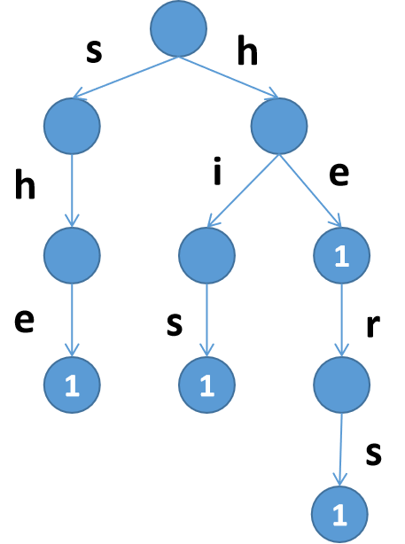

补充资料

[F08【模板】AC自动机——信息学竞赛算法_哔哩哔哩_bilibili](https://www.bilibili.com/video/BV1tF41157Dy/?spm_id_from=333.999.0.0)


[https://www.cnblogs.com/ailanxier/p/13370753.html](https://www.cnblogs.com/ailanxier/p/13370753.html)

# AC自动机

> 单模式串，多询问串

多模式串，多询问串请见字典树

### 补充资料

[https://www.cnblogs.com/hyfhaha/p/10802604.html](https://www.cnblogs.com/hyfhaha/p/10802604.html)

### 百科介绍

一个常见的例子就是给出n个单词，再给出一段包含m个字符的文章，让你找出有多少个单词在文章里出现过。
要搞懂AC自动机，先得有模式树（字典树）Trie和KMP模式匹配算法的基础知识。AC自动机算法分为三步：构造一棵Trie树，构造失败指针和模式匹配过程。
如果你对KMP算法了解的话，应该知道KMP算法中的next函数（shift函数或者fail函数）是干什么用的。KMP中我们用两个指针i和j分别表示，A[i-j+ 1..i]与B[1..j]完全相等。也就是说，i是不断增加的，随着i的增加j相应地变化，且j满足以A[i]结尾的长度为j的字符串正好匹配B串的前 j个字符，当A[i+1]≠B[j+1]，KMP的策略是调整j的位置（减小j值）使得A[i-j+1..i]与B[1..j]保持匹配且新的B[j+1]恰好与A[i+1]匹配，而next函数恰恰记录了这个j应该调整到的位置。同样AC自动机的失败指针具有同样的功能，也就是说当我们的模式串在Trie上进行匹配时，如果与当前节点的关键字不能继续匹配，就应该去当前节点的失败指针所指向的节点继续进行匹配。



## 构建

1 ．构造 Trie 树

我们先用 n 个模式串构造一颗 Trie树

Trie 中的一个节点表示一个从根到当前节点的字符串

根节点表示空串，如果节点是个模式串，则打个标记 cnt_u=1

**建字典树**

```C++
void add(char s[]) {
	int now=1,l=strlen(s);
	for(int i=0; i<l; i++) {
		int ch=s[i]-'a';
		if(!trie[now].nxt[ch]) {
			cnt++;
			trie[now].nxt[ch]=cnt;
		}
		now=trie[now].nxt[ch];
	}
	trie[now].flag++;	//根据需求变化flag所存的信息
}
```

2 ．构造自动机在 Trie 上构建两类边：回跳边和转移边。

**求Fail指针**

注意考虑fail指针的意义

fail[v] 存节点 v 的回跳边的终点。 回跳边指向父节点的回跳边所指节点的儿子0四个点（ v, u, fail[u], ch[][]) 构成四边形回跳边所指节点一定是当前节点的最长后缀。


如图，v=7,u=6。那么我们通过v访问u后沿着u往其fail走到x=fail[u]。此时如果存在x→son(x)和u→v所指代的字符相同，那么就链接fail[v]=son(x)，形成了一个四边形。

ch[u][i]存节点 u 的树边的终点和节点 u 的转移边的终点。 所谓转移边，就是从u连向所有的son(fail[u])。那么它和回调边有什么区别呢？

回跳边是在当前u的下一个字母失配时快速转移的边，而转移边是在当前u已经是一个被匹配的字符串时，要快速转移到下一个以u为前缀的待匹配字符串。

```C++
queue<int> q;
void getFail() { //求出Fail指针
	for(int i=0; i<26; i++)trie[0].nxt[i]=1;
	q.push(1);
	trie[1].fail=0;
	while(q.size()) {
		int u=q.front();
		q.pop();
		for(int i=0; i<26; i++) {
			int v=trie[u].nxt[i],fail=trie[u].fail;
			if(!v) {
				trie[u].nxt[i]=trie[fail].nxt[i];
				continue;
			}
			trie[v].fail=trie[fail].nxt[i];
			q.push(v);
		}
	}
}
```

3 ，扫描主串匹配

**查询**

查找出现了几个单词（多个相同的单词算一个）扫描主串，依次取出字符 s[i] ，

1 ． v 指针走主串对应的节点，沿着树边或转移边走，保证不回退

2 、 k 指针沿着囗跳边搜索模式串每次从当前节点走到根节点，把当前节点中的所有后缀模式串一网打尽，保证不漏解

3 、扫描完主串，返回答案0算法一边走串，一边把当前串的所有后缀串搜出来.

```C++
int query(char s[]) {
	int u=1,ans=0,l=strlen(s);
	for(int i=0; i<l; i++) {
		int v=s[i]-'a',k=trie[u].nxt[v];
		while(k>1&&trie[k].flag!=-1) {
			ans+=trie[k].flag,trie[k].flag=-1;//因为多个相同的单词算一个，所以这里要青空并且标记-1表示改单词已经被统计过了
			k=trie[k].fail;
		}
		u=trie[u].nxt[v];
	}
	return ans;
}

```

### 优化

有些时候，普通的AC自动机可能会TLE，这个时候我们就需要一点点优化

**拓扑建图优化**
让我们把Trie上的fail都想象成一条条有向边，那么我们如果在一个点对那个点进行一些操作，那么沿着这个点连出去的点也会进行操作（就是跳fail），所以我们才要暴力跳fail去更新之后的点。


我们先找到了编号4这个点，编号4的fail连向编号7这个点，编号7的fail连向编号9这个点。那么我们要更新编号4这个点的值，同时也要更新编号7和编号9，这就是暴力跳fail的过程。

我们下一次找到编号7这个点，还要再次更新编号9，所以时间复杂度就在这里被浪费了。

那么我们可不可以在找到的点打一个标记，最后再一次性将标记全部上传 来 更新其他点的ans
。例如我们找到编号4，在编号4这个点打一个ans标记为1，下一次找到了编号7，又在编号7这个点打一个ans标记为1，那么最后，我们直接从编号4开始跳fail，然后将标记ans上传，((点i的fail)的ans)加上(点i的ans)，最后使编号4的ans为1，编号7的ans为2，编号9的ans为2，这样的答案和暴力跳fail是一样的，并且每一个点只经过了一次。

最后我们将有flag标记的ans传到vis数组里，就求出了答案。

请思考！

那么现在问题来了，怎么确定更新顺序呢？明显我们打了标记后肯定是从深度大的点开始更新上去的。

怎么实现呢？拓扑排序！

我们使每一个点向它的fail
指针连一条边，明显，每一个点的出度为1
（fail只有一个），入度可能很多，所以我们就不需要像拓扑排序那样先建个图了，直接往fail
指针跳就可以了。

最后我们根据fail
指针建好图后（想象一下，程序里不用实现），一定是一个DAG，具体原因不解释（很简单的），那么我们就直接在上面跑拓扑排序，然后更新ans就可以了。

代码实现：
首先是getfail
这里，记得将fail的入度in更新。

在`GetFail`函数中

```C++
trie[v].fail=trie[fail].nxt[i];
in[trie[v].fail]++;
```

在`query`函数中

```C++
void query(char s[]){
	int u=1,l=strlen(s);
    for(int i=0;i<l;i++){
    	u=trie[u].nxt[s[i]-'a'],trie[u].ans++;	//直接打标记就可以了
    }
}

//对比下原来的
/*

int query(char s[]) {
	int u=1,ans=0,l=strlen(s);
	for(int i=0; i<l; i++) {
		int v=s[i]-'a',k=trie[u].nxt[v];
		while(k>1&&trie[k].flag!=-1) {
			ans+=trie[k].flag,trie[k].flag=-1;
			k=trie[k].fail;
		}
		u=trie[u].nxt[v];
	}
	return ans;
}

*/
```

然后是拓扑排序

```C++
void topsort(){
	for(int i=1;i<=cnt;i++){if(!in[i])q.push(i);}
    while(!q.empty()){
    	int u=q.front();q,pop();
        vis[trie[u].flag]=trie[u].ans;
        int v=trie[u].fail;in[v]--;
        trie[v].ans+=trie[u].ans;
        if(!in[v])q.push(v);
    }
}
```

注释见大佬的...

```C++
void topu(){
	for(int i=1;i<=cnt;++i)
	if(in[i]==0)q.push(i);				//将入度为0的点全部压入队列里
	while(!q.empty()){
		int u=q.front();q.pop();vis[trie[u].flag]=trie[u].ans;	//如果有flag标记就更新vis数组
		int v=trie[u].fail;in[v]--;		//将唯一连出去的出边fail的入度减去（拓扑排序的操作）
		trie[v].ans+=trie[u].ans;		//更新fail的ans值
		if(in[v]==0)q.push(v);			//拓扑排序常规操作
	}
}

```

### 拓扑排序

**百科**
对一个有向无环图(Directed Acyclic Graph简称DAG)G进行拓扑排序，是将G中所有顶点排成一个线性序列，使得图中任意一对顶点u和v，若边 $<u,v>∈E(G)$ ，则u在线性序列中出现在v之前。通常，这样的线性序列称为满足拓扑次序(Topological Order)的序列，简称拓扑序列。简单的说，由某个集合上的一个偏序得到该集合上的一个全序，这个操作称之为拓扑排序。

拓扑排序常用来确定一个依赖关系集中，事物发生的顺序。例如，在日常工作中，可能会将项目拆分成A、B、C、D四个子部分来完成，但A依赖于B和D，C依赖于D。为了计算这个项目进行的顺序，可对这个关系集进行拓扑排序，得出一个线性的序列，则排在前面的任务就是需要先完成的任务。
注意：这里得到的排序并不是唯一的！就好像你早上穿衣服可以先穿上衣也可以先穿裤子，只要里面的衣服在外面的衣服之前穿就行。

**实现**

在图论中，拓扑排序（Topological Sorting）是一个有向无环图（DAG, Directed Acyclic Graph）的所有顶点的线性序列。且该序列必须满足下面两个条件：

- 每个顶点出现且只出现一次。

- 若存在一条从顶点 A 到顶点 B 的路径，那么在序列中顶点 A 出现在顶点 B 的前面。
**有向无环图（DAG）才有拓扑排序**，非DAG图没有拓扑排序一说。

例如，下面这个图：


它是一个 DAG 图，那么如何写出它的拓扑排序呢？这里说一种比较常用的方法：

从 DAG 图中选择一个 没有前驱（即入度为0）的顶点并输出。
从图中删除该顶点和所有以它为起点的有向边。
重复 1 和 2 直到当前的 DAG 图为空或当前图中不存在无前驱的顶点为止。后一种情况说明有向图中**必然存在环**。

于是，得到拓扑排序后的结果是 { 1, 2, 4, 3, 5 }。

通常，一个有向无环图可以有**一个或多个**拓扑排序序列。

```C++
void topu(){
	for(int i=1;i<=n;i++)if(!in[i])q.push(i);//点的入度
	
	while(q.size()){
		int u=q.front();
      
        cout<<u<<' ';//输出topu序
        
		q.pop();
		if(vis[u])continue;
		vis[u]=1;
		for(auto v:e[u]){
			if(vis[v])continue;
			in[v]--;
			if(!in[v])q.push(v);
		}
	}
}
```

**拓扑排序的应用**

拓扑排序通常用来“排序”具有依赖关系的任务。

比如，如果用一个DAG图来表示一个工程，其中每个顶点表示工程中的一个任务，用有向边 表示在做任务 B 之前必须先完成任务 A。故在这个工程中，任意两个任务要么具有确定的先后关系，要么是没有关系，绝对不存在互相矛盾的关系（即环路）。
————————————————
[https://blog.csdn.net/lisonglisonglisong/article/details/45543451](https://blog.csdn.net/lisonglisonglisong/article/details/45543451)

### 例题

## AC 自动机（二次加强版）

## 配乐

*百战成诗2023*

## 题目描述

给你一个文本串 $S$ 和 $n$ 个模式串 $T_{1 \sim n}$，请你分别求出每个模式串 $T_i$ 在 $S$ 中出现的次数。

## 输入格式

第一行包含一个正整数 $n$ 表示模式串的个数。

接下来 $n$ 行，第 $i$ 行包含一个由小写英文字母构成的非空字符串 $T_i$。

最后一行包含一个由小写英文字母构成的非空字符串 $S$。

**数据不保证任意两个模式串不相同**。

## 输出格式

输出包含 $n$ 行，其中第 $i$ 行包含一个非负整数表示 $T_i$ 在 $S$ 中出现的次数。

## 样例 #1

### 样例输入 #1

```C++
5
a
bb
aa
abaa
abaaa
abaaabaa
```

### 样例输出 #1

```C++
6
0
3
2
1
```

## 提示

对于 $100 \%$ 的数据，$1 \le n \le 2 \times {10}^5$，$T_{1 \sim n}$ 的长度总和不超过 $2 \times {10}^5$，$S$ 的长度不超过 $2 \times {10}^6$。

## Solution

### 补充知识点:`char* s`和`char s[]`的区别

[https://blog.csdn.net/weibo1230123/article/details/80278828](https://blog.csdn.net/weibo1230123/article/details/80278828)

### 注意

- 普通AC自动机时间复杂度过高

- 不保证任意两个模式串不相同,这道题有相同字符串要统计，所以我们用一个`web[]`数组存这个字符串指的是Trie中的那个位置，最后把`vis[web[i]]`输出就OK了。

如果交[【模板】AC 自动机（加强版）](https://www.luogu.com.cn/problem/P3796)的代码只有44分

### 代码

```C++
//AC自动机优化模板
//AC自动机模板

#include<bits/stdc++.h>
using namespace std;

const int N=2e6+5;
int n,x,t,i,cnt,vis[N],ans,web[N],in[N];
char c[N];
struct node {
	int nxt[27];
	int fail,flag,ans;
	void init() {
		fail=flag=0;
		memset(nxt,0,sizeof nxt);
	}
} trie[N];

void add(char s[],int num) {
	int now=1,l=strlen(s);
	for(int i=0; i<l; i++) {
		int ch=s[i]-'a';
		if(!trie[now].nxt[ch]) {
			cnt++;
			trie[now].nxt[ch]=cnt;
		}
		now=trie[now].nxt[ch];
	}
	if(!trie[now].flag)trie[now].flag=num;
	web[num]=trie[now].flag;
}
queue<int> q;
void getFail() { //求出Fail指针
	for(int i=0; i<26; i++)trie[0].nxt[i]=1;
	q.push(1);
	trie[1].fail=0;
	while(q.size()) {
		int u=q.front();
		q.pop();
		for(int i=0; i<26; i++) {
			int v=trie[u].nxt[i],fail=trie[u].fail;
			if(!v) {
				trie[u].nxt[i]=trie[fail].nxt[i];
				continue;
			}
			trie[v].fail=trie[fail].nxt[i];
			in[trie[v].fail]++;
			q.push(v);
		}
	}
}

void query(char s[]) {	//此次query是void类型
	int u=1,l=strlen(s);
	for(int i=0; i<l; i++) {
		u=trie[u].nxt[s[i]-'a'],trie[u].ans++;	//直接打标记就可以了
	}
}
void topsort() {
	for(int i=1; i<=cnt; i++) {
		if(!in[i])q.push(i);
	}
	while(!q.empty()) {
		int u=q.front();
		q.pop();
		vis[trie[u].flag]=trie[u].ans;
		int v=trie[u].fail;
		in[v]--;
		trie[v].ans+=trie[u].ans;
		if(!in[v])q.push(v);
	}
}
void init() {
	cnt=1;
}
signed main() {

	cin>>n;
	init();
	for(int i=1; i<=n; i++)
		scanf("%s",&c),add(c,i);

	getFail();
	char c2[N];
	scanf("%s",&c2);
	query(c2);
	topsort();

	for(int i=1; i<=n; i++)
		cout<<vis[web[i]]<<endl;


	return 0;
}

```

# 后缀平衡树

[其它平衡树](https://flowus.cn/9fdf7962-0706-4e16-9e5e-250e2f144e09)

