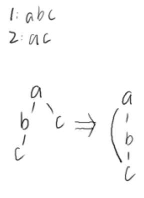

# Trie树题单

## [BJOI2016] IP地址

### 题目描述

路由表中每一项对应了一个形如 1011101????????????????????????? 的规则，会匹配指定的前缀为给定形式的 $\texttt{ip}$。

当有多个规则匹配时，前缀最长的生效。同一时刻不会有多个匹配的规则的前缀一样长。每一个时刻，会有一条规则被加入，或者之前被加入的某条规则会过期。

给一系列 $\texttt{ip}$，问每一个 $\texttt{ip}$ 在一个给定的时间区间内匹配到的生效规则变了几次？

例如，有一系列事件：

Add 110
Add 11
Del 110
Del 11
Add 110

那么，$\texttt{ip}$ 地址 11011101001001010101011101000010 在这五个时刻之后匹配到的生效规则分别是：

$110$ (第一条)，
$110$ (第一条)，
$11$ (第二条)，
空，
$110$ (第三条)。

其中，在第二个事件后到第五个事件后的这段过程中，一共变了 $3$ 次。

### 思路

把ip地址和规则建在同一颗字典树里，然后从前往后模拟每一个事件。

询问一个ip地址在时间[l+1,r]（题目说的是“在第a个事件后”）内变化了多少次，可以转换为[1,r]−[1,l]

首先把ip地址都丢进字典树去，然后考虑操作

- 添加一个规则a。那么会有影响的就是这个规则结尾往下一直到另一个规则b的结尾之前或者该路径结尾。即a是b的前缀，那么对于那些可以匹配b的，对于a的加入不感冒。

- 删除一个规则a。首先题目保证不可能有重复的情况。那么还是和上面的一样，影响的就是这个规则结尾往下一直到另一个规则b的结尾之前或者该路径结尾。

那么怎么样统计出对于每一个ip的受影响次数呢？对于上面的一次影响，我们在a的结尾处tag+1（类比区间修改线段树），然后我们在下次经过这个tag时就下传标记，直到遇到一个end标记停止（end是一个规则的结尾标记，end处不受tag标记修改）。

最后对于每一个ip的答案统计，我们在模拟操作过程中如果当前第i个操作是某个ip的l或者r那么就是暴力统计修改。

这种对于时间复杂度统计有难度，可能会让练习者错误评估复杂度导致不敢写。

### 输入格式

第一行两个正整数 $n,q$，表示事件数有询问数。
接下来 $n$ 行，每行描述一个事件，格式为：

$\texttt{Add}$ $s$ 表示新建一个规则，匹配前缀为 $s$ 的所有 $\texttt{ip}$。
$\texttt{Del}$ $s$ 表示把当前前缀 $s$ 对应的规则删掉(过期)。保证之前有这样的一条规则还没被删。

接下来 $q$ 行，每行一个 $\texttt{ip}$ 与两个正整数 $a,b$，表示查询在第 $a$ 个事件后到第 $b$ 个事件的这段时间里，这个 $\texttt{ip}$ 匹配到的生效规则变化的次数。 $\texttt{ip}$ 用01字符串来表示。

### 输出格式

对于每次查询，输出一行一个整数表示答案。

### 样例 #1

#### 样例输入 #1

```C++
5 1
Add 110
Add 11
Del 110
Del 11
Add 110
11011101001001010101011101000010 2 5
```

#### 样例输出 #1

```C++
3
```

### 提示

【数据范围】

$1\le n,q \le 10^5$

## [USACO08DEC] Secret Message G

### 题目描述

贝茜正在领导奶牛们逃跑．为了联络，奶牛们互相发送秘密信息．

信息是二进制的，共有 $M$（$1 \le M \le 50000$）条，反间谍能力很强的约翰已经部分拦截了这些信息，知道了第  $i$ 条二进制信息的前 $b_i$（$1 \le b_i \le 10000$）位，他同时知道，奶牛使用 $N$（$1 \le N \le 50000$）条暗号．但是，他仅仅知道第 $j$ 条暗号的前 $c_j$（$1 \le c_j \le 10000$）位。

对于每条暗号 $j$，他想知道有多少截得的信息能够和它匹配。也就是说，有多少信息和这条暗号有着相同的前缀。当然，这个前缀长度必须等于暗号和那条信息长度的较小者。

在输入文件中，位的总数（即 $\sum b_i + \sum c_i$）不会超过 $500000$。

### 思路

字典树维护子树和。应该没错。

---

```C++

```

### 输入格式

Line $1$: Two integers: $M$ and $N$.

Lines $2 \ldots M+1$: Line $i+1$ describes intercepted code $i$ with an integer $b_i$ followed by $b_i$ space-separated `0`'s and `1`'s.

Lines $M+2 \ldots M+N+1$: Line $M+j+1$ describes codeword $j$ with an integer $c_j$ followed by $c_j$ space-separated `0`'s and `1`'s.

### 输出格式

Lines $1 \ldots N$: Line $j$: The number of messages that the $j$-th codeword could match.

### 样例 #1

#### 样例输入 #1

```C++
4 5 
3 0 1 0 
1 1 
3 1 0 0 
3 1 1 0 
1 0 
1 1 
2 0 1 
5 0 1 0 0 1 
2 1 1
```

#### 样例输出 #1

```C++
1 
3 
1 
1 
2
```

### 提示

Four messages; five codewords.

The intercepted messages start with 010, 1, 100, and 110.

The possible codewords start with 0, 1, 01, 01001, and 11.

0 matches only 010: 1 match

1 matches 1, 100, and 110: 3 matches

01 matches only 010: 1 match

01001 matches 010: 1 match

11 matches 1 and 110: 2 matches

## [USACO12DEC] First! G

### 题目描述

Bessie一直在研究字符串。她发现，通过改变字母表的顺序，她可以按改变后的字母表来排列字符串（字典序大小排列）。

例如，Bessie发现，对于字符串串“omm”，“moo”，“mom”和“ommnom”，她可以使用标准字母表使“mom”排在第一个（即字典序最小），她也可以使用字母表“abcdefghijklonmpqrstuvwxyz”使得“omm”排在第一个。然而，Bessie想不出任何方法（改变字母表顺序）使得“moo”或“ommnom”排在第一个。

接下来让我们通过重新排列字母表的顺序来计算输入中有哪些字符串可以排在第一个（即字典序最小），从而帮助Bessie。

要计算字符串X和字符串Y按照重新排列过的字母表顺序来排列的顺序，先找到它们第一个不同的字母X[i]与Y[i]，按重排后的字母表顺序比较，若X[i]比Y[i]先，则X的字典序比Y小，即X排在Y前；若没有不同的字母，则比较X与Y长度，若X比Y短，则X的字典序比Y小，即X排在Y前。

### 思路

字典树是dfs。

先画出字典树，建立一个超级根节点，然后在dfs过程中把路径上的字母先看作固定好了先后顺序，然后在遇到分叉时，若分叉的两个（这里假设只有两个）字母为a,b，那么我们先假设a的优先级高于b，然后往a下面走。如果这个假设与之前的假设冲突，则a子树中的单词都不能成为排序后第一个单词。这样即可。

应该是正确的思路。

---

```C++

```

### 输入格式

第1行：一个数字N（1 <= N <= 30,000），Bessie正在研究的字符串的数量。

第2\sim N+1行：每行包含一个非空字符串。所有字符串包含的字符总数不会超过300,000。 输入中的所有字符都是小写字母，即a\sim z。 输入不包含重复的字符串。

### 输出格式

第1行：一个数字K，表示按重排后的字母表顺序排列的字符串有多少可以排在第一个数量。

第2~K+1行：第i+1行包含第i个按重排后的字母表顺序排列后可以排在第一个的字符串。字符串应该按照它们在输入中的顺序来输出。

### 样例 #1

#### 样例输入 #1

```C++
4
omm
moo
mom
ommnom
```

#### 样例输出 #1

```C++
2
omm
mom
```

### 提示

样例即是题目描述中的例子，只有“omm”和“mom”在各自特定的字典序下可以被排列在第一个。

## [JSOI2009] 电子字典

### 题目描述

人们在英文字典中查找某个单词的时候可能不知道该单词的完整拼法，而只知道该单词的一个错误的近似拼法，这时人们可能陷入困境，为了查找一个单词而浪费大量的时间。带有模糊查询功能的电子字典能够从一定程度上解决这一问题：用户只要输入一个字符串，电子字典就返回与该单词编辑距离最小的几个单词供用户选择。

字符串 $a$ 与字符串 $b$ 的编辑距离是指：允许对 $a$ 或 $b$ 串进行下列“编辑”操作，将 $a$ 变为 $b$ 或 $b$ 变为 $a$，最少“编辑”次数即为距离。

1. 删除串中某个位置的字母；

2. 添加一个字母到串中某个位置；

3. 替换串中某一位置的一个字母为另一个字母。

JSOI 团队正在开发一款电子字典，你需要帮助团队实现一个用于模糊查询功能的计数部件：对于一个待查询字符串，如果它是单词，则返回 $-1$；如果它不是单词，则返回字典中有多少个单词与它的编辑距离为 $1$。

### 思路

我觉得这道题要在建树上做修改。但是我们发现并不好处理去重。



看到数据范围，好像可以把所有字符串及其变种都加入字典树。考虑一个字符串最多有几个变种，考虑极限情况，发现是$20+20\times 26+26\times 21=1242$。1e7是可以建下的。

那么这种情况下有没有可能有重复呢？有的，但是我们可以在每一个字符串的结尾打上id为中国字符串是那个字符串的变种。然后用桶去重即可。时间复杂度卡到了O(1e8)。

有点悬。

### 输入格式

第一行包含两个正整数 $N$ 和 $M$。

接下来的 $N$ 行，每行一个字符串，第 $i+1$ 行为单词 $W_i$，单词长度在 $1$ 至 $20$ 之间。

再接下来 $M$ 行，每行一个字符串，第 $i+N+1$ 表示一个待查字符串 $Q_i$。待查字符串长度在 $1$ 至 $20$ 之间。$W_i$ 和 $Q_i$ 均由小写字母构成，文件中不包含多余空格。

### 输出格式

输出应包括 $M$ 行，第 $i$ 行为一个整数 $X_i$：

- $X_i = -1$ 表示 $Q_i$ 为字典中的单词；

- 否则 $X_i$ 表示与 $Q_i$ 编辑距离为 $1$ 的单词的个数。

### 样例 #1

#### 样例输入 #1

```C++
4 3
abcd
abcde
aabc
abced
abcd
abc
abcdd
```

#### 样例输出 #1

```C++
-1
2
3
```

### 提示

#### 样例解释

- `abcd` 在单词表中出现过；

- `abc` 与单词 `abcd`、`aabc` 的编辑距离都是 $1$；

- `abcdd` 与单词 `abcd`、`abcde`、`abced` 的编辑距离都是 $1$。

#### 数据范围与约定

- 所有单词互不相同，但是查询字符串可能有重复；

- 对 $50\%$ 的数据范围，$N,M\le 10^3$；

- 对 $100\%$ 的数据范围，$N,M\le 10^4$。

## [IOI2008] Type Printer

### 题目描述

你需要利用一台可移动的打印机打印出 $n$ 个单词。这种可移动式打印机是一种老式打印机，它需要你将一些小的金属块（每个包含一个字母）放到打印机上以组成单词。然后将这些小金属块压在一张纸上以打印出这个词。这种打印机允许你进行下列操作：

- 在打印机当前词的末端（尾部）添加一个字母；

- 在打印机当前词的尾部删去一个字母（将打印机当前词的最后一个字母删去）。仅当打印机当前至少有一个字母时才允许进行该操作；

- 将打印机上的当前词打印出来。

初始时打印机为空，或者说它不含任何带字母的金属块。打印结束时，允许有部分字母留在打印机内。同时也允许你按照任意的次序打印单词。

由于每一个操作都需要一定时间，所以需要你尽可能减少所需操作的总数目（将操作的总数最小化）。

你需要编写一个程序，给定所要打印的 $n$ 个单词，找出以任意次序打印所有单词所需操作的最小数目，并输出一种这样的操作序列。

### 思路

感觉就是建一颗字典树后按dfs序遍历即可啊。

---

```C++

```

### 输入格式

- 第 $1$ 行包含一个整数 $n$, 表示你需要打印的单词数。

- 随后的 $n$ 行中，每一行都包含一个单词。每个词仅由小写字母组成，而且单词的长度为 $1$ 到 $20$ 个字母（包含 $1$ 和 $20$ 在内）。所有单词都不相同。

### 输出格式

第一行包含一个整数 $m$，表示打印这 $n$ 个单词所需操作的最小数目。

接下来的 $m$ 行，每行一个字符，表示你的操作序列，序列的描述方法如下：

- 添加一个字母，用这个小写字母的自身来表示。

- 删去一个字母，用 `-` 表示。

- 打印单词，用 `P` 表示。

### 样例 #1

#### 样例输入 #1

```C++
3
print
the
poem
```

#### 样例输出 #1

```C++
20
t
h
e
P
-
-
-
p
o
e
m
P
-
-
-
r
i
n
t
P
```

### 提示

对于 $40\%$ 的数据，$n\leq18$；

对于 $100\%$ 的数据，$1\leq n\leq25000$。

