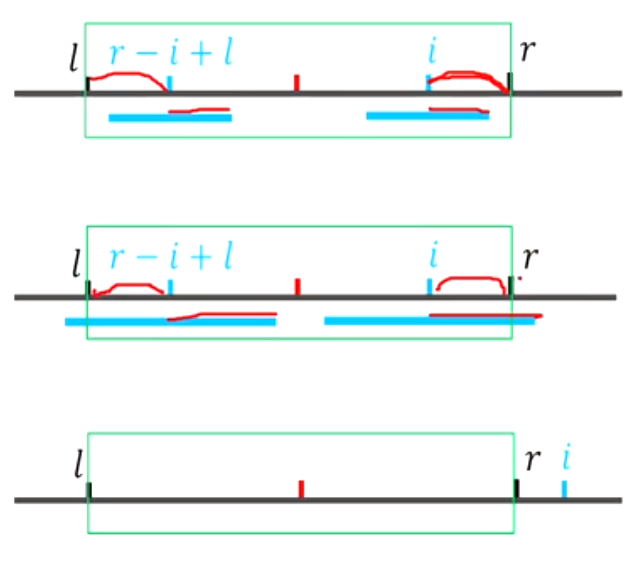

[F05 Manacher(马拉车)_哔哩哔哩_bilibili](https://www.bilibili.com/video/BV173411V7Ai/?spm_id_from=333.999.0.0)


# manacher 马拉车算法

### 算法用途

给定一个字符串，然后输出这个字符串包含的最长回文子串。

普通算法的时间复杂度为$O(n^2)$，如下图


但manacher 算法的复杂度是$O(n)$，惊不惊喜意不意外！

### 算法实现

[184 Manacher(马拉车)_哔哩哔哩_bilibili](https://www.bilibili.com/video/BV173411V7Ai/?spm_id_from=333.999.0.0&vd_source=f45ea4e1e4b3b73d5f07c57b46c43aba)

**初始化**


Code

```C++
void init(){
	scanf("%s",a+1);
//	scanf("%s",b+1);
	int n=strlen(a+1);
	s[0]='$';
	for(int i=1;i<=n;i++){
		s[++ls]='#',s[++ls]=a[i];
	}	
    s[++ls]='#';
}
```

**优化数组**



注释：d[i]记录长度的一半，向上取整（即$(len+1)\div 2$），即类似圆的半径，包含中间的那个字符

在“加速盒子”中，当枚举到点i=6时，加速盒子的区间变成$[i-d_i+1=3,i+d_i-1=9]$，当枚举到点$j(j>i,j<i+d_i-1)$时，d[j]就可以直接从d[2\times i-j]转移过来。但注意，对于边界的点d[i+d_i-1=9]不能直接转移，这个请看下面的分析。盒子外的暴力。


情况


- 情况1：$i+d[r-i+l]≤r$时

我们盒子内的情况已知，所以可以安心地转移$d[i]=d[r-i+l]$

- 情况2：$i+d[r-i+l]>r$时

由于直接转移过来后以i为中心的回文串（图中i下方的蓝色长条）延申出了盒子，但是我们不知道盒子左右两侧的字符串是否也对称（即我们不知道盒子右边的信息），所以对于延申出盒子的部分我们要慢慢枚举。也就是说d[i]=d[r-i+1]是保底的，但r后面的就需要一个个去枚举判定了。

求出d[i] 后，如果i回文串（我们就姑且这么称呼它）的右端点延申到了当前盒子外，那么就应该更新盒子的l,r了。

转移以下两幅图表达方式是等效的，作者可能在不经意间转换表达方式哦。


**Code**

```C++

void getd(){
	d[1]=1;
	int l,r=1;//r只要小于2即可,目的是让下面第一次循环在i<=r不成立
	for(int i=2;i<=ls;i++){
		if(i<=r)d[i]=min(d[r-i+l],r-i+1);//转移d[i]且判定是否超出r
		while(s[i-d[i]]==s[i+d[i]])d[i]++;//如果d[i]没有超出r,那么第一次while判定就不成立,该语句不会执行.如果i本来就在盒子外面,则上面一句话不会执行,直接到本句话开始暴力
		if(i+d[i]-1>r)l=i-d[i]+1,r=i+d[i]-1;//转移盒子
	}
}
```

各部分说明


该算法时间复杂度可以证明为$O(n)$，因为你考虑i+d[i]，如果i+d[i]>r，那么才会执行while，然后又会将r修改为i+d[i]，即每次while运行一次，就会让r向右移动一位，r从1往右移动，到n停止，就n次。也就是说到会执行while时，i+d[i]一定是递增的，所以i+d[i] 只会从1递增到n，一共n次。这里描述不当，请仔细体会。

答案在d[]数组中，经过计算，答案取$\max(d[i]-1)$即可

```C++
/*////////ACACACACACACAC///////////
       . Code  by  Ntsc .
       . Earn knowledge .
/*////////ACACACACACACAC///////////

#include<bits/stdc++.h>
#define int long long
#define db double
#define rtn return
using namespace std;

const int N=2e7+2e6+5;//注意两倍空间 
const int M=1e5;
const int Mod=1e5;
const int INF=1e5;

int n,m,p,q,T;
char s[N];
int ls,ans,d[N];
char a[N];

void init(){
	scanf("%s",a+1);
//	scanf("%s",b+1);
	n=strlen(a+1);
	s[0]='$';
	for(int i=1;i<=n;i++){
		s[++ls]='#',s[++ls]=a[i];
	}	
	s[++ls]='#';
}

void getd(){
	d[1]=1;
	int l,r=1;//r只要小于2即可,目的是让下面第一次循环在i<=r不成立
	for(int i=2;i<=ls;i++){
		if(i<=r)d[i]=min(d[r-i+l],r-i+1);//转移d[i]且判定是否超出r
		while(s[i-d[i]]==s[i+d[i]])d[i]++;//如果d[i]没有超出r,那么第一次while判定就不成立,该语句不会执行.如果i本来就在盒子外面,则上面一句话不会执行,直接到本句话开始暴力
		if(i+d[i]-1>r)l=i-d[i]+1,r=i+d[i]-1;//转移盒子
	}
}

signed main(){
	
	init();
	getd();
	
	for(int i=1;i<=ls;i++)ans=max(ans,d[i]-1); 
	cout<<ans<<endl;
	return 0;
}


```

## 例题

[Codeforces Round 934 (Div. 2) 6/7](https://flowus.cn/e10d71e3-dae9-4472-87df-751db5292af0) E


## 对比算法


