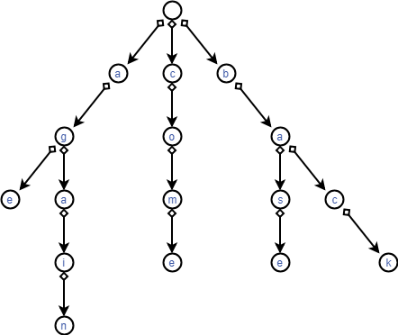
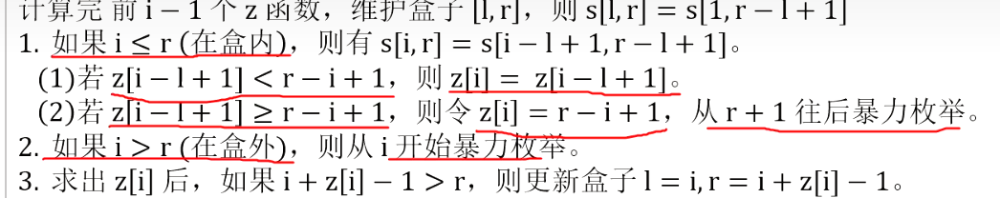
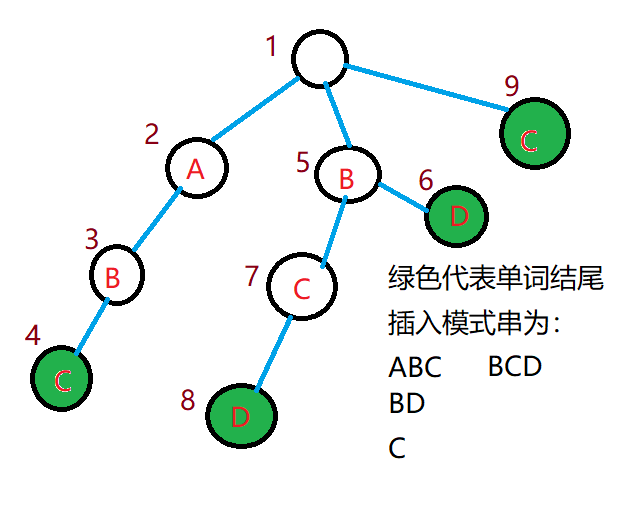

专题 | 哈希&字符串匹配（从字典树到KMP再到AC自动机）

# 目录

- 字典树

    -  01tire

- KMP算法

    - 扩展kmp

- AC自动机算法

- manacher 算法

- 哈希

    - 树哈希

- Sunday 算法

- 子序列自动机

- 有穷自动机

# 补充资料

[https://www.cnblogs.com/ailanxier/p/13370753.html](https://www.cnblogs.com/ailanxier/p/13370753.html)

# 字典树 Trie

> 多模式串，多询问串

## 资料

[https://www.cnblogs.com/fusiwei/p/11972776.html](https://www.cnblogs.com/fusiwei/p/11972776.html)

**百科定义**

Trie树，是一种树形结构，是一种哈希树的变种。典型应用是用于统计，排序和保存大量的字符串（但不仅限于字符串），所以经常被搜索引擎系统用于文本词频统计。它的优点是：利用字符串的公共前缀来减少查询时间，最大限度地减少无谓的字符串比较，查询效率比哈希树高。

**性质**

它有3个基本性质：
根节点不包含字符，除根节点外每一个节点都只包含一个字符； 从根节点到某一节点，路径上经过的字符连接起来，为该节点对应的字符串； 每个节点的所有子节点包含的字符都不相同。

**基本操作**

其基本操作有：查找、插入和删除,当然删除操作比较少见。

**实现方法**

搜索字典项目的方法为：
(1) 从根结点开始一次搜索；
(2) 取得要查找关键词的第一个字母，并根据该字母选择对应的子树并转到该子树继续进行检索；
(3) 在相应的子树上，取得要查找关键词的第二个字母,并进一步选择对应的子树进行检索。
(4) 迭代过程……
(5) 在某个结点处，关键词的所有字母已被取出，则读取附在该结点上的信息，即完成查找。
其他操作类似处理

## 思路




**数据结构**
结构体实现

```C++
struct node {
	int nxt[27];
} trie[N];
```

**建树（插入）**

> 以下仅考虑包含 $a\to z$ 26个单词的 Trie

向Trie中插入一个单词 $s$

```C++
void add(char s[]) {
	int now=1,l=strlen(s);
	for(int i=0; i<l; i++) {
		int ch=s[i]-'a';
		if(!trie[now].nxt[ch]) {
			cnt++;
			trie[now].nxt[ch]=cnt;
		}
		now=trie[now].nxt[ch];
	}
}
```

**查询**
查询是否有单词 $s$ 或**以 $s$ 为前缀的单词**

```C++
int find(char s[]){
	int now=0,l=strlen(s);
	for(int i=0;i<l;i++){
		int ch=getch(s[i]);
		if(!tre[now].nxt[ch]){
			return 0;
		}
		now=tre[now].nxt[ch];
		 
	}
	return 1;
}
```

---

## 例题

给定 $n$ 个模式串 $s_1, s_2, \dots, s_n$ 和 $q$ 次询问，每次询问给定一个文本串 $t_i$，请回答 $s_1 \sim s_n$ 中有多少个字符串 $s_j$ 满足 $t_i$ 是 $s_j$ 的**前缀**。

一个字符串 $t$ 是 $s$ 的前缀当且仅当从 $s$ 的末尾删去若干个（可以为 0 个）连续的字符后与 $t$ 相同。

输入的字符串大小敏感。例如，字符串 `Fusu` 和字符串 `fusu` 不同。

**本题单测试点内有多组测试数据**。

输入的第一行是一个整数，表示数据组数 $T$。

对于每组数据，格式如下：
第一行是两个整数，分别表示模式串的个数 $n$ 和询问的个数 $q$。
接下来 $n$ 行，每行一个字符串，表示一个**模式串**。
接下来 $q$ 行，每行一个字符串，表示一次询问（**询问串**）。

输出格式

按照输入的顺序依次输出各测试数据的答案。
对于每次询问，输出一行一个整数表示答案。

### 数据规模与约定

对于全部的测试点，保证 $1 \leq T, n, q\leq 10^5$，且输入字符串的总长度不超过 $3 \times 10^6$。输入的字符串只含大小写字母和数字，且不含空串。

### 说明

std 的 IO 使用的是关闭同步后的 cin/cout，本题不卡常。

## Solution

```C++
#include<bits/stdc++.h>
using namespace std;
const int MAXN=3e6+5;
int cnt,n,q,T;
char s[MAXN];
struct tree{
	int nxt[63];
}tre[MAXN];
int nend[MAXN],sum[MAXN];
int getch(char c){
	int ch;
		if(c>='a')ch=c-'a'+10;// 10~35,a~z
		else if(c>='A')ch=c-'A'+36;//36~61,A~Z
		else ch=c-'0'; //0~9,0~9
		return ch;
}
void add(char s[]){
	int now=0,l=strlen(s);
	for(int i=0;i<l;i++){
		int ch=getch(s[i]);
		if(!tre[now].nxt[ch]){
			cnt++;
			tre[now].nxt[ch]=cnt;
		}
		now=tre[now].nxt[ch];sum[now]++;
	}
}
int find(char s[]){
	int now=0,l=strlen(s);
	for(int i=0;i<l;i++){
		int ch=getch(s[i]);
		if(!tre[now].nxt[ch]){
			return 0;
		}
		now=tre[now].nxt[ch];
		 
	}
	return sum[now];
}
int main(){
	scanf("%d",&T);
	while(T--){
		
		for(int i=0;i<=cnt;i++){
			sum[i]=0;
			for(int j=0;j<=61;j++)tre[i].nxt[j]=0;
		}
		cnt=0;
		
		cin>>n>>q;
		for(int i=1;i<=n;i++){
			scanf("%s",s);
			add(s);
		}for(int i=1;i<=q;i++){
			scanf("%s",s);
			printf("%d\n",find(s));
		}
	}
	return 0;
} 
```

## **小小的扩展 | 匹配子串**

本题匹配的是前缀，但如果要匹配的是子串呢？那么我们就这样：假设一个模式串为acde，那么我们就把acde,cde,de,e都加入字典树即可。

**对应习题**

[练习 | 南外20230801](https://flowus.cn/dbb757e3-ed6a-49cc-9566-0593b4e65519)

## 01trie

01 trie 是一种特殊的 trie，字符集为 {0,1}，可以维护整数的二进制异或相关信息。

[www.luogu.com.cn](https://www.luogu.com.cn/problem/CF706D)


有q次操作和一个集合A，开始时集合中只有一个数0，下面有三种类型的操作：

- `+ x` 把x插入集合A

- `- x` 把x从集合A中删去，保证x已存在于集合A中

- `? x` 给一个数x在集合A中找一个y使得x^y最大，并求出这个值
数据范围:$1\leq q\leq 200000$ $1\leq x_i\leq10^9$

---

注意我们在建立trie树时应该是高位在上（即二进制的高位靠近树根），否则我们的贪心就失效了！

注意空间，和线段树一样是开死了的。

```C++
/*                                                                                
                      Keyblinds Guide
     				###################
      @Ntsc 2024

      - Ctrl+Alt+G then P : Enter luogu problem details
      - Ctrl+Alt+B : Run all cases in CPH
      - ctrl+D : choose this and dump to the next
      - ctrl+Shift+L : choose all like this
	  
*/
#include <bits/stdc++.h>
#include <queue>
using namespace std;

#define rep(i, l, r) for (int i = l, END##i = r; i <= END##i; ++i)
#define per(i, r, l) for (int i = r, END##i = l; i >= END##i; --i)
#define pb push_back
#define mp make_pair
#define int long long
#define pii pair<int, int>
#define ps second
#define pf first

// #define innt int
// #define inr int
// #define mian main
// #define iont int

#define rd read()
int read(){
    int xx = 0, ff = 1;
    char ch = getchar();
    while (ch < '0' || ch > '9') {
		if (ch == '-')
			ff = -1;
		ch = getchar();
    }
    while (ch >= '0' && ch <= '9')
      xx = xx * 10 + (ch - '0'), ch = getchar();
    return xx * ff;
}
void write(int out) {
	if (out < 0)
		putchar('-'), out = -out;
	if (out > 9)
		write(out / 10);
	putchar(out % 10 + '0');
}

// const char el='\n';
// const bool enable_dbg = 1;
// template <typename T,typename... Args>
// void dbg(T s,Args... args) {
// 	if constexpr (enable_dbg){
//     cerr << s << ' ';
// 		if constexpr (sizeof...(Args))
// 			dbg(args...);
// 	}
// }

const int N = 6e6 + 7;
const int INF = 1e18;
const int M = 1e7;
const int MOD = 1e9 + 7;


namespace trie{
    struct ndoe{
        int s[2];
        int cnt,val;
    }t[N];
    int idx=1;
    void insert(int m){
        int x=1;
        for(int i=63;~i;i--){
            int v=m>>i&1ll;
            if(!t[x].s[v])t[x].s[v]=++idx;
            x=t[x].s[v];
            t[x].cnt++;
        }
        t[x].val=m;

        // while(m){
        //     int cur=m&1;
        //     if(!t[x].s[cur])t[x].s[cur]=++idx;
        //     x=t[x].s[cur];
        //     t[x].cnt++;
        //     m>>=1;
        // }
    }

    void del(int m){
        int x=1;
        for(int i=63;~i;i--){
            int v=m>>i&1ll;
            x=t[x].s[v];
            t[x].cnt--;
        }

        // while(m--){
        //     int cur=m&1;
        //     x=t[x].s[cur];
        //     t[x].cnt--;
        //     m>>=1;
        // }
    }

    int query(int m){
        int x=1;
        // int res=0;
        // while(1){
        //     int cur=m&1;
        //     int f=0;
        //     if(t[x].s[1^cur]&&t[t[x].s[1^cur]].cnt)x=t[x].s[1^cur],f=1^cur;
        //     else x=t[x].s[cur],f=cur;
        //     if(!t[x].cnt)break;
        //     res<<=1;
        //     res|=cur^f;
        //     m>>=1;
        // }
        // return res;
        for(int i=63;~i;i--){
            int v=m>>i&1ll;
            if(t[x].s[v^1]&&t[t[x].s[v^1]].cnt)x=t[x].s[v^1];
            else x=t[x].s[v];
        }
        return m^t[x].val;
    }
}using namespace trie;

void solve(){
    int q=rd;
    insert(0);
    while(q--){
        char op;
        cin>>op;
        if(op=='-'){
            del(rd);
        }if(op=='+'){
            insert(rd);
        }if(op=='?'){
            cout<<query(rd)<<endl;
        }
    }
}

signed main() {
    int T=1;
    while(T--){
    	solve();
    }
    return 0;
}
```

[www.luogu.com.cn](https://www.luogu.com.cn/problem/P4735)


我们看到01trie是对每一个数字把其二进制加入trie树得到的。


当我们要查询所有数字中对x异或的最大值，那么我们就从低位到高位、同时从trie根节点往下按贪心策略（x当前位为1，那么走0，反之走1）走。

## 可持久化01trie

参考[课程 | 树上问题](https://flowus.cn/ef4b3baf-5965-403c-b945-941120260c4a)[TJOI2018] 异或


# KMP算法

### 百科介绍

KMP算法的核心是利用匹配失败后的信息，尽量减少模式串与主串的匹配次数以达到快速匹配的目的。具体实现就是通过一个next()函数实现，函数本身包含了模式串的局部匹配信息。KMP算法的时间复杂度O(m+n)

**字符串的模式匹配**

字符串的模式匹配是一种常用的运算。所谓模式匹配,可以简单地理解为在目标(字符串)中寻找一个给定的模式(也是字符串)，返回目标和模式匹配的第一个子串的首字符位置。通常目标串比较大，而模式串则比较短小

**模式匹配的类型**

(1)精确匹配
如果在目标T中至少一处存在模式P，则称匹配成功，否则即使目标与模式只有一个字符不同也不能称为匹配成功，即匹配失败。给定一个字符或符号组成的字符串目标对象T和一个字符串模式P，模式匹配的目的是在目标T中搜索与模式P完全相同的子串,返回T和P匹配的第一个字符串的首字母位置 。
(2)近似匹配
如果模式P与目标T(或其子串)存在某种程度的相似,则认为匹配成功。常用的衡量字符串相似度的方法是根据一个串转换成另一个串所需的基本操作数目来确定。基本操作由字符串的插入、删除和替换来组成 。

**KMP模式匹配算法**

KMP算法是一种改进的字符串匹配算法,其关键是利用匹配失败后的信息,尽量减少模式串与主串的匹配次数以达到快速匹配的目的 。
求得模式的特征向量之后，基于特征分析的快速模式匹配算法(KMP模式匹配算法)与朴素匹配算法类似，只是在每次匹配过程中发生某次失配时，不再单纯地把模式后移一位，而是根据当前字符的特征数来决定模式右移的位数 。

### 例题

# KMP字符串匹配

## 题目描述

给出两个字符串 $s_1$ 和 $s_2$，若 $s_1$ 的区间 $[l, r]$ 子串与 $s_2$ 完全相同，则称 $s_2$ 在 $s_1$ 中出现了，其出现位置为 $l$。
现在请你求出 $s_2$ 在 $s_1$ 中所有出现的位置。

定义一个字符串 $s$ 的 border 为 $s$ 的一个**非 $s$ 本身**的子串 $t$，满足 $t$ 既是 $s$ 的前缀，又是 $s$ 的后缀。
对于 $s_2$，你还需要求出对于其每个前缀 $s'$ 的最长 border $t'$ 的长度。

## 输入格式

第一行为一个字符串，即为 $s_1$。
第二行为一个字符串，即为 $s_2$。

## 输出格式

首先输出若干行，每行一个整数，**按从小到大的顺序**输出 $s_2$ 在 $s_1$ 中出现的位置。
最后一行输出 $|s_2|$ 个整数，第 $i$ 个整数表示 $s_2$ 的长度为 $i$ 的前缀的最长 border 长度。

## 样例 #1

### 样例输入 #1

```Plain Text
ABABABC
ABA
```

### 样例输出 #1

```Plain Text
1
3
0 0 1
```

## 提示

### 样例 1 解释


对于 $s_2$ 长度为 $3$ 的前缀 `ABA`，字符串 `A` 既是其后缀也是其前缀，且是最长的，因此最长 border 长度为 $1$。

### 数据规模与约定

**本题采用多测试点捆绑测试，共有 3 个子任务**。

- Subtask 1（30 points）：$|s_1| \leq 15$，$|s_2| \leq 5$。

- Subtask 2（40 points）：$|s_1| \leq 10^4$，$|s_2| \leq 10^2$。

- Subtask 3（30 points）：无特殊约定。

对于全部的测试点，保证 $1 \leq |s_1|,|s_2| \leq 10^6$，$s_1, s_2$ 中均只含大写英文字母。

## Solution

```C++
  	#include<bits/stdc++.h>
	using namespace std;
   	char a[1000100],b[1000100];
    int p[1000100],ls1,ls2,j;
    
    void pre(){
    	for(int i=2;i<=ls2;i++){
            while(j>0 && b[i]!=b[j+1]) j=p[j];
            if(b[i]==b[j+1]) j++;
            p[i]=j;
        }
	}
    int main(){
        scanf("%s%s",a+1,b+1);
        ls1=strlen(a+1),ls2=strlen(b+1);
        p[1]=0;
      	pre();

        j=0;
        for(int i=1;i<=ls1;i++){
            while(j>0 && a[i]!=b[j+1]) j=p[j];
            if(a[i]==b[j+1]) j++;
            if(j==ls2) printf("%d\n",i-ls2+1),j=p[j];
        }
        for(int i=1;i<ls2;i++)
        printf("%d ",p[i]);
        printf("%d",p[ls2]);
        return 0;
    }
```

## 练习

对nxt数组的本质探究

[www.luogu.com.cn](https://www.luogu.com.cn/problem/P4391)

# 扩展KMP（exkmp）

[183 扩展 KMP(Z 函数)_哔哩哔哩_bilibili](https://www.bilibili.com/video/BV1Y54y1o7Ca/?spm_id_from=333.999.0.0)

给定两个字符串 $a,b$，你要求出两个数组：

- $b$ 的 $z$ 函数数组 $z$，即 $b$ 与 $b$ 的每一个后缀的 LCP（最长公共前缀）长度。

- $b$ 与 $a$ 的每一个后缀的 LCP 长度数组 $p$。

对于一个长度为 $n$ 的数组 $a$，设其权值为 $\operatorname{xor}_{i=1}^n i \times (a_i + 1)$。

```C++
/*////////ACACACACACACAC///////////
       . Code  by  Ntsc .
       . Earn knowledge .
/*////////ACACACACACACAC///////////

#include<bits/stdc++.h>
#define int long long
#define db double
#define rtn return
using namespace std;

const int N=2e7+5;
const int M=1e5;
const int Mod=1e5;
const int INF=1e5;

int n,m,q,T,z[N],p[N],ans;
char s[N],t[N];

void get_z(char s[],int n){
	z[1]=n;
	int l=0,r=0;
	for(int i=2;i<=n;i++){
		if(i<=r)z[i]=min(z[i-l+1],r-i+1);
		while(s[1+z[i]]==s[i+z[i]])z[i]++;
		
		if(i+z[i]-1>r)l=i,r=i+z[i]-1;//转移box 
	}
}

void get_p(char s[],char t[],int n,int m){
	int l=0,r=0;
	for(int i=1;i<=m;i++){
		if(i<=r)p[i]=min(z[i-l+1],r-i+1);
		while(s[1+p[i]]==t[i+p[i]]&&1+p[i]<=n&&i+p[i]<=m)p[i]++;
		
		if(i+p[i]-1>r)l=i,r=i+p[i]-1;//转移box 
	}
}

signed main(){
	scanf("%s",t+1);
	scanf("%s",s+1);
	n=strlen(s+1);
	m=strlen(t+1);
	get_z(s,n);
	get_p(s,t,n,m);
	
//	for(int i=1;i<=n;i++)cerr<<z[i]<<' ';
//	cerr<<"z[]end\n";
	for(int i=1;i<=n;i++)ans^=i*(z[i]+1);
	cout<<ans<<endl;
	ans=0;
	for(int i=1;i<=m;i++)ans^=i*(p[i]+1);
	cout<<ans<<endl;
	return 0;
}


```

注意求的是b的z函数

## Z函数

z 函数
对于一个长度为 n 的字符串 s 。$ z_i$表示 $s $与其后缀 $s[ i , n ] $的最长公共前缀 （ LCP ） 的长度


暴力计算自然是O(n^2)

## Z-box


手扶着铁窗~~我望~~外边~~~


对于 i, 我们称区间$ [i,i+ z[i]- 1 ]$ 是的匹配段 ， 也可以叫 Z-box
算法过程中我们维护右端点最靠右的匹配段 。 为了方便 ， 记作[l, r ] 。 s [l,r]一定等于 s  的前缀 。
在计算 z[i] 时我们保证l≤i

举个例子，此时我们已经处理了z[1\sim 5]，此时盒子为[5,8]，那么我们在处理z[6\sim 8]时就可以直接从z[2\sim 4]转移过来。

**算法流程**



对比一下？马拉车如下：


我们来解释一下


1. 我们可以保证s[1,r-l+1]=s[l,r]，但是其余部分我们不能保证。如果i在box内
(1) 如z[i-l+1]<r-i+1，说明z[i-l+1]的对应的字符串全部在box内，所以我们可以保证z[i-l+1]可以完美转移到z[i]
(2) 如z[i-l+1]≥r-i+1，说明z[i-l+1]的对应的字符串前部分在box内，所以我们可以不能保证z[i-l+1]可以完美转移到z[i]，故对于伸出box外的部分，我们要逐个枚举

2. 如果i在box外。那么我们只好暴力枚举了。

但是有一个重点就是box的转移了。要不然这个算法就失去了意义。

求出 $z[i]$ 后 ， 如果 $i + z[i] - 1 > r$, 则更新盒子 $l = i , r = i + z [i]-1$。为什么呢？因为i + z[i] - 1 代表当前z[i]的对应串的右端点。如果i + z[i] - 1 > r，就说明对应串的右端点伸出了当前的box


很明显，以左图为例，红色box区间已经没有用处了，而现在我们知道蓝色区间对应相等，那么我们就可以把box转移到[l',r']

## 代码

```C++
void get_z(char s[],int n){
	z[1]=n;
	int l=0,r=0;
	for(int i=2;i<=n;i++){
		if(i<=r)z[i]=min(z[i-l+1],r-i+1);
		while(s[1+z[i]]==s[i+z[i]])z[i]++;
		if(i+z[i]-1>r)l=i;r=i+z[i]-1;//转移box 
	}
}
```

时间复杂度分析

时间复杂度完全取决于while，而我们知道，只有当前z[i]对应字符的右边界伸出了box，伸出多少就跑几遍while。而在伸出后我们又会更新box，所以我们的while次数$=r$从$1\sim n=n$次

## P函数

```C++
void get_p(char s[],char p[],int n,int m){
	int l=0,r=0;
	for(int i=1;i<=n;i++){
		if(i<=r)p[i]=min(z[i-l+1],r-i+1);
		while(s[1+p[i]]==t[i+p[i]]&&1+p[i]<=n&&i+p[i]<=m)p[i]++;
		
		if(i+p[i]-1>r)l=i;r=i+p[i]-1;//转移box 
	}
}
```

# AC自动机

> 单模式串，多询问串

多模式串，多询问串请见字典树

### 补充资料

[https://www.cnblogs.com/hyfhaha/p/10802604.html](https://www.cnblogs.com/hyfhaha/p/10802604.html)

### 百科介绍

一个常见的例子就是给出n个单词，再给出一段包含m个字符的文章，让你找出有多少个单词在文章里出现过。
要搞懂AC自动机，先得有模式树（字典树）Trie和KMP模式匹配算法的基础知识。AC自动机算法分为三步：构造一棵Trie树，构造失败指针和模式匹配过程。
如果你对KMP算法了解的话，应该知道KMP算法中的next函数（shift函数或者fail函数）是干什么用的。KMP中我们用两个指针i和j分别表示，A[i-j+ 1..i]与B[1..j]完全相等。也就是说，i是不断增加的，随着i的增加j相应地变化，且j满足以A[i]结尾的长度为j的字符串正好匹配B串的前 j个字符，当A[i+1]≠B[j+1]，KMP的策略是调整j的位置（减小j值）使得A[i-j+1..i]与B[1..j]保持匹配且新的B[j+1]恰好与A[i+1]匹配，而next函数恰恰记录了这个j应该调整到的位置。同样AC自动机的失败指针具有同样的功能，也就是说当我们的模式串在Trie上进行匹配时，如果与当前节点的关键字不能继续匹配，就应该去当前节点的失败指针所指向的节点继续进行匹配。


## 构建

1 ．构造 Trie 树

我们先用 n 个模式串构造一颗 Trie树

Trie 中的一个节点表示一个从根到当前节点的字符串

根节点表示空串，如果节点是个模式串，则打个标记 cnt_u=1

**建字典树**

```C++
void add(char s[]) {
	int now=1,l=strlen(s);
	for(int i=0; i<l; i++) {
		int ch=s[i]-'a';
		if(!trie[now].nxt[ch]) {
			cnt++;
			trie[now].nxt[ch]=cnt;
		}
		now=trie[now].nxt[ch];
	}
	trie[now].flag++;	//根据需求变化flag所存的信息
}
```

2 ．构造自动机在 Trie 上构建两类边：回跳边和转移边。

**求Fail指针**

注意考虑fail指针的意义

fail[v] 存节点 v 的回跳边的终点。 回跳边指向父节点的回跳边所指节点的儿子0四个点（ v, u, fail[u], ch[][]) 构成四边形回跳边所指节点一定是当前节点的最长后缀。


如图，v=7,u=6。那么我们通过v访问u后沿着u往其fail走到x=fail[u]。此时如果存在x→son(x)和u→v所指代的字符相同，那么就链接fail[v]=son(x)，形成了一个四边形。

ch[u][i]存节点 u 的树边的终点和节点 u 的转移边的终点。 所谓转移边，就是从u连向所有的son(fail[u])。那么它和回调边有什么区别呢？

回跳边是在当前u的下一个字母失配时快速转移的边，而转移边是在当前u已经是一个被匹配的字符串时，要快速转移到下一个以u为前缀的待匹配字符串。

```C++
queue<int> q;
void getFail() { //求出Fail指针
	for(int i=0; i<26; i++)trie[0].nxt[i]=1;
	q.push(1);
	trie[1].fail=0;
	while(q.size()) {
		int u=q.front();
		q.pop();
		for(int i=0; i<26; i++) {
			int v=trie[u].nxt[i],fail=trie[u].fail;
			if(!v) {
				trie[u].nxt[i]=trie[fail].nxt[i];
				continue;
			}
			trie[v].fail=trie[fail].nxt[i];
			q.push(v);
		}
	}
}
```

3 ，扫描主串匹配

**查询**

查找出现了几个单词（多个相同的单词算一个）扫描主串，依次取出字符 s[i] ，

1 ． v 指针走主串对应的节点，沿着树边或转移边走，保证不回退

2 、 k 指针沿着囗跳边搜索模式串每次从当前节点走到根节点，把当前节点中的所有后缀模式串一网打尽，保证不漏解

3 、扫描完主串，返回答案0算法一边走串，一边把当前串的所有后缀串搜出来.

```C++
int query(char s[]) {
	int u=1,ans=0,l=strlen(s);
	for(int i=0; i<l; i++) {
		int v=s[i]-'a',k=trie[u].nxt[v];
		while(k>1&&trie[k].flag!=-1) {
			ans+=trie[k].flag,trie[k].flag=-1;//因为多个相同的单词算一个，所以这里要青空并且标记-1表示改单词已经被统计过了
			k=trie[k].fail;
		}
		u=trie[u].nxt[v];
	}
	return ans;
}

```

### 优化

有些时候，普通的AC自动机可能会TLE，这个时候我们就需要一点点优化

**拓扑建图优化**
让我们把Trie上的fail都想象成一条条有向边，那么我们如果在一个点对那个点进行一些操作，那么沿着这个点连出去的点也会进行操作（就是跳fail），所以我们才要暴力跳fail去更新之后的点。



我们先找到了编号4这个点，编号4的fail连向编号7这个点，编号7的fail连向编号9这个点。那么我们要更新编号4这个点的值，同时也要更新编号7和编号9，这就是暴力跳fail的过程。

我们下一次找到编号7这个点，还要再次更新编号9，所以时间复杂度就在这里被浪费了。

那么我们可不可以在找到的点打一个标记，最后再一次性将标记全部上传 来 更新其他点的ans
。例如我们找到编号4，在编号4这个点打一个ans标记为1，下一次找到了编号7，又在编号7这个点打一个ans标记为1，那么最后，我们直接从编号4开始跳fail，然后将标记ans上传，((点i的fail)的ans)加上(点i的ans)，最后使编号4的ans为1，编号7的ans为2，编号9的ans为2，这样的答案和暴力跳fail是一样的，并且每一个点只经过了一次。

最后我们将有flag标记的ans传到vis数组里，就求出了答案。

请思考！

那么现在问题来了，怎么确定更新顺序呢？明显我们打了标记后肯定是从深度大的点开始更新上去的。

怎么实现呢？拓扑排序！

我们使每一个点向它的fail
指针连一条边，明显，每一个点的出度为1
（fail只有一个），入度可能很多，所以我们就不需要像拓扑排序那样先建个图了，直接往fail
指针跳就可以了。

最后我们根据fail
指针建好图后（想象一下，程序里不用实现），一定是一个DAG，具体原因不解释（很简单的），那么我们就直接在上面跑拓扑排序，然后更新ans就可以了。

代码实现：
首先是getfail
这里，记得将fail的入度in更新。

在`GetFail`函数中

```C++
trie[v].fail=trie[fail].nxt[i];
in[trie[v].fail]++;
```

在`query`函数中

```C++
void query(char s[]){
	int u=1,l=strlen(s);
    for(int i=0;i<l;i++){
    	u=trie[u].nxt[s[i]-'a'],trie[u].ans++;	//直接打标记就可以了
    }
}

//对比下原来的
/*

int query(char s[]) {
	int u=1,ans=0,l=strlen(s);
	for(int i=0; i<l; i++) {
		int v=s[i]-'a',k=trie[u].nxt[v];
		while(k>1&&trie[k].flag!=-1) {
			ans+=trie[k].flag,trie[k].flag=-1;
			k=trie[k].fail;
		}
		u=trie[u].nxt[v];
	}
	return ans;
}

*/
```

然后是拓扑排序

```C++
void topsort(){
	for(int i=1;i<=cnt;i++){if(!in[i])q.push(i);}
    while(!q.empty()){
    	int u=q.front();q,pop();
        vis[trie[u].flag]=trie[u].ans;
        int v=trie[u].fail;in[v]--;
        trie[v].ans+=trie[u].ans;
        if(!in[v])q.push(v);
    }
}
```

注释见大佬的...

```C++
void topu(){
	for(int i=1;i<=cnt;++i)
	if(in[i]==0)q.push(i);				//将入度为0的点全部压入队列里
	while(!q.empty()){
		int u=q.front();q.pop();vis[trie[u].flag]=trie[u].ans;	//如果有flag标记就更新vis数组
		int v=trie[u].fail;in[v]--;		//将唯一连出去的出边fail的入度减去（拓扑排序的操作）
		trie[v].ans+=trie[u].ans;		//更新fail的ans值
		if(in[v]==0)q.push(v);			//拓扑排序常规操作
	}
}

```

### 拓扑排序


    **百科**
对一个有向无环图(Directed Acyclic Graph简称DAG)G进行拓扑排序，是将G中所有顶点排成一个线性序列，使得图中任意一对顶点u和v，若边 $<u,v>∈E(G)$ ，则u在线性序列中出现在v之前。通常，这样的线性序列称为满足拓扑次序(Topological Order)的序列，简称拓扑序列。简单的说，由某个集合上的一个偏序得到该集合上的一个全序，这个操作称之为拓扑排序。

    拓扑排序常用来确定一个依赖关系集中，事物发生的顺序。例如，在日常工作中，可能会将项目拆分成A、B、C、D四个子部分来完成，但A依赖于B和D，C依赖于D。为了计算这个项目进行的顺序，可对这个关系集进行拓扑排序，得出一个线性的序列，则排在前面的任务就是需要先完成的任务。
注意：这里得到的排序并不是唯一的！就好像你早上穿衣服可以先穿上衣也可以先穿裤子，只要里面的衣服在外面的衣服之前穿就行。

    **实现**

    在图论中，拓扑排序（Topological Sorting）是一个有向无环图（DAG, Directed Acyclic Graph）的所有顶点的线性序列。且该序列必须满足下面两个条件：

    - 每个顶点出现且只出现一次。

    - 若存在一条从顶点 A 到顶点 B 的路径，那么在序列中顶点 A 出现在顶点 B 的前面。
**有向无环图（DAG）才有拓扑排序**，非DAG图没有拓扑排序一说。

    例如，下面这个图：

    

    它是一个 DAG 图，那么如何写出它的拓扑排序呢？这里说一种比较常用的方法：

    从 DAG 图中选择一个 没有前驱（即入度为0）的顶点并输出。
从图中删除该顶点和所有以它为起点的有向边。
重复 1 和 2 直到当前的 DAG 图为空或当前图中不存在无前驱的顶点为止。后一种情况说明有向图中**必然存在环**。

    于是，得到拓扑排序后的结果是 { 1, 2, 4, 3, 5 }。

    通常，一个有向无环图可以有**一个或多个**拓扑排序序列。

    ```C++
    void topu(){
    	for(int i=1;i<=n;i++)if(!in[i])q.push(i);//点的入度
    	
    	while(q.size()){
    		int u=q.front();
          
            cout<<u<<' ';//输出topu序
            
    		q.pop();
    		if(vis[u])continue;
    		vis[u]=1;
    		for(auto v:e[u]){
    			if(vis[v])continue;
    			in[v]--;
    			if(!in[v])q.push(v);
    		}
    	}
    }
    ```

    **拓扑排序的应用**

    拓扑排序通常用来“排序”具有依赖关系的任务。

    比如，如果用一个DAG图来表示一个工程，其中每个顶点表示工程中的一个任务，用有向边 表示在做任务 B 之前必须先完成任务 A。故在这个工程中，任意两个任务要么具有确定的先后关系，要么是没有关系，绝对不存在互相矛盾的关系（即环路）。
————————————————
[https://blog.csdn.net/lisonglisonglisong/article/details/45543451](https://blog.csdn.net/lisonglisonglisong/article/details/45543451)

### 例题

## AC 自动机（二次加强版）

## 配乐

*百战成诗2023*

## 题目描述

给你一个文本串 $S$ 和 $n$ 个模式串 $T_{1 \sim n}$，请你分别求出每个模式串 $T_i$ 在 $S$ 中出现的次数。

## 输入格式

第一行包含一个正整数 $n$ 表示模式串的个数。

接下来 $n$ 行，第 $i$ 行包含一个由小写英文字母构成的非空字符串 $T_i$。

最后一行包含一个由小写英文字母构成的非空字符串 $S$。

**数据不保证任意两个模式串不相同**。

## 输出格式

输出包含 $n$ 行，其中第 $i$ 行包含一个非负整数表示 $T_i$ 在 $S$ 中出现的次数。

## 样例 #1

### 样例输入 #1

```Plain Text
5
a
bb
aa
abaa
abaaa
abaaabaa
```

### 样例输出 #1

```Plain Text
6
0
3
2
1
```

## 提示

对于 $100 \%$ 的数据，$1 \le n \le 2 \times {10}^5$，$T_{1 \sim n}$ 的长度总和不超过 $2 \times {10}^5$，$S$ 的长度不超过 $2 \times {10}^6$。

## Solution

### 补充知识点:`char* s`和`char s[]`的区别

[https://blog.csdn.net/weibo1230123/article/details/80278828](https://blog.csdn.net/weibo1230123/article/details/80278828)

### 注意

- 普通AC自动机时间复杂度过高

- 不保证任意两个模式串不相同,这道题有相同字符串要统计，所以我们用一个`web[]`数组存这个字符串指的是Trie中的那个位置，最后把`vis[web[i]]`输出就OK了。

如果交[【模板】AC 自动机（加强版）](https://www.luogu.com.cn/problem/P3796)的代码只有44分

### 代码

```C++
//AC自动机优化模板
//AC自动机模板

#include<bits/stdc++.h>
using namespace std;

const int N=2e6+5;
int n,x,t,i,cnt,vis[N],ans,web[N],in[N];
char c[N];
struct node {
	int nxt[27];
	int fail,flag,ans;
	void init() {
		fail=flag=0;
		memset(nxt,0,sizeof nxt);
	}
} trie[N];

void add(char s[],int num) {
	int now=1,l=strlen(s);
	for(int i=0; i<l; i++) {
		int ch=s[i]-'a';
		if(!trie[now].nxt[ch]) {
			cnt++;
			trie[now].nxt[ch]=cnt;
		}
		now=trie[now].nxt[ch];
	}
	if(!trie[now].flag)trie[now].flag=num;
	web[num]=trie[now].flag;
}
queue<int> q;
void getFail() { //求出Fail指针
	for(int i=0; i<26; i++)trie[0].nxt[i]=1;
	q.push(1);
	trie[1].fail=0;
	while(q.size()) {
		int u=q.front();
		q.pop();
		for(int i=0; i<26; i++) {
			int v=trie[u].nxt[i],fail=trie[u].fail;
			if(!v) {
				trie[u].nxt[i]=trie[fail].nxt[i];
				continue;
			}
			trie[v].fail=trie[fail].nxt[i];
			in[trie[v].fail]++;
			q.push(v);
		}
	}
}

void query(char s[]) {	//此次query是void类型
	int u=1,l=strlen(s);
	for(int i=0; i<l; i++) {
		u=trie[u].nxt[s[i]-'a'],trie[u].ans++;	//直接打标记就可以了
	}
}
void topsort() {
	for(int i=1; i<=cnt; i++) {
		if(!in[i])q.push(i);
	}
	while(!q.empty()) {
		int u=q.front();
		q.pop();
		vis[trie[u].flag]=trie[u].ans;
		int v=trie[u].fail;
		in[v]--;
		trie[v].ans+=trie[u].ans;
		if(!in[v])q.push(v);
	}
}
void init() {
	cnt=1;
}
signed main() {

	cin>>n;
	init();
	for(int i=1; i<=n; i++)
		scanf("%s",&c),add(c,i);

	getFail();
	char c2[N];
	scanf("%s",&c2);
	query(c2);
	topsort();

	for(int i=1; i<=n; i++)
		cout<<vis[web[i]]<<endl;


	return 0;
}

```

# manacher 马拉车算法

### 算法用途

给定一个字符串，然后输出这个字符串包含的最长回文子串。

普通算法的时间复杂度为$O(n^2)$，如下图


但manacher 算法的复杂度是$O(n)$，惊不惊喜意不意外！

### 算法实现

[184 Manacher(马拉车)_哔哩哔哩_bilibili](https://www.bilibili.com/video/BV173411V7Ai/?spm_id_from=333.999.0.0&vd_source=f45ea4e1e4b3b73d5f07c57b46c43aba)

**初始化**


Code

```C++
void init(){
	scanf("%s",a+1);
//	scanf("%s",b+1);
	int n=strlen(a+1);
	s[0]='$';
	for(int i=1;i<=n;i++){
		s[++ls]='#',s[++ls]=a[i];
	}	
    s[++ls]='#';
}
```

**优化数组**


注释：d[i]记录长度的一半，向上取整（即$(len+1)\div 2$），即类似圆的半径，包含中间的那个字符

在“加速盒子”中，当枚举到点i=6时，加速盒子的区间变成$[i-d_i+1=3,i+d_i-1=9]$，当枚举到点$j(j>i,j<i+d_i-1)$时，d[j]就可以直接从d[2\times i-j]转移过来。但注意，对于边界的点d[i+d_i-1=9]不能直接转移，这个请看下面的分析。盒子外的暴力。


情况


- 情况1：$i+d[r-i+l]≤r$时

我们盒子内的情况已知，所以可以安心地转移$d[i]=d[r-i+l]$

- 情况2：$i+d[r-i+l]>r$时

由于直接转移过来后以i为中心的回文串（图中i下方的蓝色长条）延申出了盒子，但是我们不知道盒子左右两侧的字符串是否也对称（即我们不知道盒子右边的信息），所以对于延申出盒子的部分我们要慢慢枚举。也就是说d[i]=d[r-i+1]是保底的，但r后面的就需要一个个去枚举判定了。

求出d[i] 后，如果i回文串（我们就姑且这么称呼它）的右端点延申到了当前盒子外，那么就应该更新盒子的l,r了。

转移以下两幅图表达方式是等效的，作者可能在不经意间转换表达方式哦。


**Code**

```C++

void getd(){
	d[1]=1;
	int l,r=1;//r只要小于2即可,目的是让下面第一次循环在i<=r不成立
	for(int i=2;i<=ls;i++){
		if(i<=r)d[i]=min(d[r-i+l],r-i+1);//转移d[i]且判定是否超出r
		while(s[i-d[i]]==s[i+d[i]])d[i]++;//如果d[i]没有超出r,那么第一次while判定就不成立,该语句不会执行.如果i本来就在盒子外面,则上面一句话不会执行,直接到本句话开始暴力
		if(i+d[i]-1>r)l=i-d[i]+1,r=i+d[i]-1;//转移盒子
	}
}
```

各部分说明


该算法时间复杂度可以证明为$O(n)$，因为你考虑i+d[i]，如果i+d[i]>r，那么才会执行while，然后又会将r修改为i+d[i]，即每次while运行一次，就会让r向右移动一位，r从1往右移动，到n停止，就n次。也就是说到会执行while时，i+d[i]一定是递增的，所以i+d[i] 只会从1递增到n，一共n次。这里描述不当，请仔细体会。

答案在d[]数组中，经过计算，答案取$\max(d[i]-1)$即可

```C++
/*////////ACACACACACACAC///////////
       . Code  by  Ntsc .
       . Earn knowledge .
/*////////ACACACACACACAC///////////

#include<bits/stdc++.h>
#define int long long
#define db double
#define rtn return
using namespace std;

const int N=2e7+2e6+5;//注意两倍空间 
const int M=1e5;
const int Mod=1e5;
const int INF=1e5;

int n,m,p,q,T;
char s[N];
int ls,ans,d[N];
char a[N];

void init(){
	scanf("%s",a+1);
//	scanf("%s",b+1);
	n=strlen(a+1);
	s[0]='$';
	for(int i=1;i<=n;i++){
		s[++ls]='#',s[++ls]=a[i];
	}	
	s[++ls]='#';
}

void getd(){
	d[1]=1;
	int l,r=1;//r只要小于2即可,目的是让下面第一次循环在i<=r不成立
	for(int i=2;i<=ls;i++){
		if(i<=r)d[i]=min(d[r-i+l],r-i+1);//转移d[i]且判定是否超出r
		while(s[i-d[i]]==s[i+d[i]])d[i]++;//如果d[i]没有超出r,那么第一次while判定就不成立,该语句不会执行.如果i本来就在盒子外面,则上面一句话不会执行,直接到本句话开始暴力
		if(i+d[i]-1>r)l=i-d[i]+1,r=i+d[i]-1;//转移盒子
	}
}

signed main(){
	
	init();
	getd();
	
	for(int i=1;i<=ls;i++)ans=max(ans,d[i]-1); 
	cout<<ans<<endl;
	return 0;
}


```

## 例题

[Codeforces Round 934 (Div. 2) 6/7](https://flowus.cn/e10d71e3-dae9-4472-87df-751db5292af0) E


## 对比算法


# 哈希

## 字符串哈希

应用于字符串匹配的哈希算法。


## 双哈希防卡

[练习 | 南外20230712链表、哈希、并查集、分块](https://flowus.cn/6f0fba60-f356-44a6-b89a-8012f66cb0a9) E题

## 树哈希

[练习 | 南外20230712链表、哈希、并查集、分块](https://flowus.cn/6f0fba60-f356-44a6-b89a-8012f66cb0a9) F题

### [NOIP2018 普及组] 对称二叉树

一棵有点权的有根树如果满足以下条件，则被轩轩称为对称二叉树：

1. 二叉树；

2. 将这棵树所有节点的左右子树交换，新树和原树对应位置的结构相同且点权相等。

下图中节点内的数字为权值，节点外的 $id$ 表示节点编号。


现在给出一棵二叉树，希望你找出它的一棵子树，该子树为对称二叉树，且节点数最多。请输出这棵子树的节点数。

注意：只有树根的树也是对称二叉树。本题中约定，以节点 $T$ 为子树根的一棵“子 树”指的是：节点$T$ 和它的全部后代节点构成的二叉树。

第一行一个正整数 $n$，表示给定的树的节点的数目，规定节点编号 $1 \sim n$，其中节点 $1$ 是树根。

第二行 $n$ 个正整数，用一个空格分隔，第 $i$ 个正整数 $v_i$ 代表节点 $i$ 的权值。

接下来 $n$ 行，每行两个正整数 $l_i, r_i$，分别表示节点 $i$ 的左右孩子的编号。如果不存在左 / 右孩子，则以 $-1$ 表示。两个数之间用一个空格隔开。

### 样例 1 解释


### 样例 2 解释


最大的对称二叉子树为以节点 $7$ 为树根的子树，节点数为 $3$。

### 数据规模与约定

共 $25$ 个测试点。

$v_i ≤ 1000$，$n ≤ 10^6$。

本题约定：

层次：节点的层次从根开始定义起，根为第一层，根的孩子为第二层。树中任一节 点的层次等于其父亲节点的层次加 $1$。

树的深度：树中节点的最大层次称为树的深度。

满二叉树：设二叉树的深度为 $h$，且二叉树有 $2^h-1$ 个节点，这就是满二叉树。


完全二叉树：设二叉树的深度为 $h$，除第 $h$ 层外，其它各层的结点数都达到最大 个数，第 $h$ 层所有的结点都连续集中在最左边，这就是完全二叉树。


### Code

分别维护当前子树作为左子树和右子树的哈希值即可。为了防止卡哈希，我们要以不同的方式双哈希has1,has2

```C++
/*
CB Ntsc
*/

#include <bits/stdc++.h>
using namespace std;
#define int long long
#define mp make_pair

#define rd read()
inline int read() {
    int xx = 0, ff = 1;
    char ch = getchar();
    while (ch < '0' || ch > '9') {
        if (ch == '-')
            ff = -1;
        ch = getchar();
    }
    while (ch >= '0' && ch <= '9') xx = xx * 10 + (ch - '0'), ch = getchar();
    return xx * ff;
}
inline void write(int out) {
    if (out < 0)
        putchar('-'), out = -out;
    if (out > 9)
        write(out / 10);
    putchar(out % 10 + '0');
}


const int N = 1e6 + 5;
const int M = 40;
const int INF = 1e9 + 5;
const int MOD = 9982353998244357;
const int MODD = 9982353998244357;
const int v1 = 998294353;
const int v2 = 998254357;
const int v3 = 988234357;


int v[N],has1l[N],has2l[N],has1r[N],has2r[N];
int sum[N],l[N],r[N];

int n,m,ans;

void pushup(int x){
	has1l[x]=(has1l[l[x]]*v1+v[x]*v2+has1l[r[x]]*v3)%MOD;
	has2l[x]=(has2l[l[x]]*v1+v[x]*v2+has2l[r[x]]*v3)%MODD;

	has1r[x]=(has1r[r[x]]*v1+v[x]*v2+has1r[l[x]]*v3)%MOD;
	has2r[x]=(has2r[r[x]]*v1+v[x]*v2+has2r[l[x]]*v3)%MODD;

}


void dfs(int x){
	if(l[x])dfs(l[x]);
	if(r[x])dfs(r[x]);
	sum[x]=sum[l[x]]+sum[r[x]]+1;
	if(sum[l[x]]==sum[r[x]]&&has1l[l[x]]==has1r[r[x]]&&has2l[l[x]]==has2r[r[x]])ans=max(ans,sum[x]);

	pushup(x);
}

signed main(){
	
	n=rd;
	for(int i=1;i<=n;i++){
		v[i]=rd;

	}
	for(int i=1;i<=n;i++){
		l[i]=rd;r[i]=rd;
		if(l[i]==-1)l[i]=0;
		if(r[i]==-1)r[i]=0;
	}
	dfs(1);

	cout<<ans<<endl;
	return 0;
}
/*
1
2 5 1 
0 0 1 
0 0 4 

*/
```

# Sunday 算法

[zhuanlan.zhihu.com](https://zhuanlan.zhihu.com/p/142895983)


# 子序列自动机

和KMP类似，不过KMP处理的是子串，这里是子序列。

---

给定一个长度为 $n$ 的正整数序列 $a$ ，有 $q$ 次询问，第 $i$ 次询问给定一个长度为 $L_i$ 的序列 $b_i$，请你判断 $b_i$ 是不是 $a$ 的子序列。序列 $a$ 和所有 $b_i$ 中的元素都不大于一个给定的正整数 $m$。

对于全部的测试点，保证 $1 \leq n, m, q \leq 10^5$，$1 \leq a_i, b_{i, j} \leq m$，$1 \leq l_i \leq 10^6$，$\sum_{i = 1}^{q} l_i \leq 10^6$。

## 序列自动机

## 子序列自动机

$nxt_{i,j}$ 表示 $i$ 后面（不包括自己）第一个 $j$ 的位置。如果没有，设成 $n+1$。

$O(nm)$ 的方法如下

```C++
FOR(j,1,m) nxt[n+1][j]=n+1;
FOR(i,1,n){
    FOR(j,1,m) nxt[i][j]=nxt[i+1][j];
    if(i!=n) nxt[i][a[i+1]]=i+1;
}
```

用在判断子序列上的话，发现就是从 $0$ 开始跳，每次跳到它后面第一个 $a_i$ 的位置。看看最后是否不在 $n+1$。

这么贪心是因为对于所有相同的数，我们只关心能跳到的数中最前面的那个。肯定不会更劣。

但是这题中，如果开这么个两维数组，复杂度是 $O(nm)$ 的，爆了。

标算使用的可持久化线段树，因为观察到 $nxt_i$ 和 $nxt_{i+1}$ 这两个数组只有一个位置不一样。时间复杂度是 $O((n+\sum l)\log m)$，空间复杂度是 $O(m+n\log m)$。

但是我们不需要真的把数组存下来。

$i$ 后面第一个 $j$ 的位置，只需要在所有是 $j$ 的下标中二分就行了！

开 $m$ 个 vector 存下这些下标，每次二分，时间复杂度是 $O(n+(\sum l)\log m)$，空间复杂度是 $O(n+m)$。

## 模板

```C++
#include <bits/stdc++.h>
#define rep(l, r, i) for (int i = l, END##i = r; i <= END##i; ++i)
#define per(r, l, i) for (int i = r, END##i = l; i >= END##i; --i)
using namespace std;
#define pb push_back
// #define mpy make_pair
#define int long long
#define pii pair<int, int>
#define ps b
#define pf a

#define lc(x) (x << 1)
#define rc(x) (x << 1 | 1)

#define X(j) i[j]
#define Y(j) (dp[j] + (i[j] + L) * (i[j] + L))

#define rd read()
int read() {
    int xx = 0, ff = 1;
    char ch = getchar();
    while (ch < '0' || ch > '9') {
        if (ch == '-')
            ff = -1;
        ch = getchar();
    }
    while (ch >= '0' && ch <= '9')
        xx = xx * 10 + (ch - '0'), ch = getchar();
    return xx * ff;
}
void write(int out) {
    if (out < 0)
        putchar('-'), out = -out;
    if (out > 9)
        write(out / 10);
    putchar(out % 10 + '0');
}

const int N = 1e5 + 15;
const int INF = 1e9 + 5;
const int MOD = 1e9 + 7;
const int M = N * 21;

int n,m,a[N],f[N];
int s[N],q;


vector<int> v[N];
signed main(){
	rd;n=rd;q=rd;rd;
	for(int i=1;i<=n;i++) v[rd].push_back(i);
	while(q--){
		int l=rd,at=0;
		bool f=true;
		while(l--){
			int x=rd;
			if(!f) continue;
			vector<int>::iterator it=lower_bound(v[x].begin(),v[x].end(),at+1);
			if(it==v[x].end()) f=false;
			else at=*it;
		}
		puts(f?"Yes":"No");
	}
}

```

## [FJOI2016] 所有公共子序列问题

一个给定序列的子序列是在该序列中删去若干元素后得到的序列。确切地说，若给定序列 $X=x_1x_2\ldots x_m$，则另一序列 $Z=z_1z_2\ldots z_k$ 是 $X$ 的子序列是指存在一个严格递增下标序列 $i_1,i_2, \ldots ,i_k$ 使得对于所有 $j=1,2,…,k$ 有 $z_j=x_{i_j}$。

例如，序列 $Z=$`GACT` 是序列 $X=$`GCTACT` 的子序列，相应的递增下标序列为 $1,4,5,6$。给定两个序列 $X$ 和 $Y$，当另一序列 $Z$ 既是 $X$ 的子序列又是 $Y$ 的子序列时，称 $Z$ 是序列 $X$ 和 $Y$ 的公共子序列。例如，若 $X=$`GCTACT`， $Y=$`GATCCT`，序列 $T$ 是 $X$ 和 $Y$ 的一个公共子序列，序列 `GACT` 也是 $X$ 和 $Y$ 的一个公共子序列。注意对于任何给定的序列 $X$ 和 $Y$，空序列总是它们的一个公共子序列。

所有公共子序列问题是要求对于给定的 $2$ 个序列 $X=x_1x_2\ldots x_m$ 和 $Y=y_1y_2\ldots y_m$，找出 $X$ 和 $Y$ 的所有不同的公共子序列。

输入格式

文件的第一行有两个正整数 $m$ 和 $n$，分别表示 $2$ 个输入序列 $X$ 和 $Y$ 的长度。

接下来的两行分别给出输入序列 $X=x_1x_2\cdots x_m$ 和 $Y=y_1y_2\cdots y_m$，其中序列中每个元素均为二十六个英文大小写字母。

文件的最后一行给出一个非负整数 $k$。

$k$ 的值为 $1$ 时，表示计算结果要输出 $X$ 和 $Y$ 的所有不同的公共子序列，以及 $X$ 和 $Y$ 有多少个不同的公共子序列。

$k$ 的值为 $0$ 时，表示计算结果只要输出 $X$ 和 $Y$ 有多少个不同的公共子序列。

输出格式

将计算出的 $X$ 和 $Y$ 的所有不同的公共子序列，或 $X$ 和 $Y$ 有多少个不同的公共子序列输出到文件中。当 $k=1$ 时，先输出 $X$ 和 $Y$ 的所有不同的公共子序列，每行输出一个公共子序列，按字典序从小到大输出。最后输出不同的公共子序列的个数。当 $k=0$ 时，只要输出不同的公共子序列的个数。

答案....很大啦（高精度提示）

# 后缀平衡树

[专题 | 二叉查找树与平衡树](https://flowus.cn/9fdf7962-0706-4e16-9e5e-250e2f144e09)

