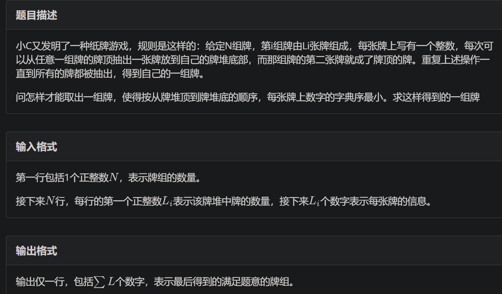
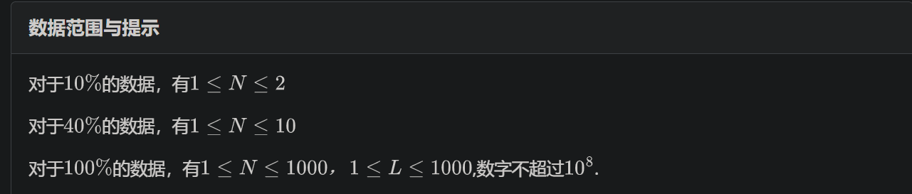

# 序列哈希


## 数值哈希

### 例题 #1 [USACO06DEC] Milk Patterns G

农夫 John 发现他的奶牛产奶的质量一直在变动。经过细致的调查，他发现：虽然他不能预见明天产奶的质量，但连续的若干天的质量有很多重叠。我们称之为一个“模式”。 John 的牛奶按质量可以被赋予一个 $0$ 到 $1000000$ 之间的数。并且 John 记录了 $N$（$1 \le N \le 2 \times 10 ^ 4$）天的牛奶质量值。他想知道最长的出现了至少 $K$（$2 \le K \le N$）次的模式的长度。比如 `1 2 3 2 3 2 3 1` 中 `2 3 2 3` 出现了两次。当 $K = 2$ 时，这个长度为 $4$。

---

二分一下走过最长长度。然后扫一遍，用桶记录以下各个哈希值出现的次数。

```C++
/*                                                                                
                      Keyblinds Guide
     				###################
      @Ntsc 2024

      - Ctrl+Alt+G then P : Enter luogu problem details
      - Ctrl+Alt+B : Run all cases in CPH
      - ctrl+D : choose this and dump to the next
      - ctrl+Shift+L : choose all like this
      - ctrl+K then ctrl+W: close all
	  
*/
#include <bits/stdc++.h>
#include <queue>
using namespace std;

#define rep(i, l, r) for (int i = l, END##i = r; i <= END##i; ++i)
#define per(i, r, l) for (int i = r, END##i = l; i >= END##i; --i)
#define pb push_back
#define mp make_pair
#define ull unsigned long long
#define int long long
#define pii pair<int, int>
#define ps second
#define pf first

// #define innt int
// #define inr int
// #define mian main
// #define iont int

#define rd read()
int read(){
    int xx = 0, ff = 1;
    char ch = getchar();
    while (ch < '0' || ch > '9') {
		if (ch == '-')
			ff = -1;
		ch = getchar();
    }
    while (ch >= '0' && ch <= '9')
      xx = xx * 10 + (ch - '0'), ch = getchar();
    return xx * ff;
}
void write(int out) {
	if (out < 0)
		putchar('-'), out = -out;
	if (out > 9)
		write(out / 10);
	putchar(out % 10 + '0');
}

#define nl dbg('\n')
const char el='\n';
const bool enable_dbg = 1;
template <typename T,typename... Args>
void dbg(T s,Args... args) {
	if constexpr (enable_dbg){
    cerr << s << ' ';
		if constexpr (sizeof...(Args))
			dbg(args...);
	}
}

#define cdbg(x) cerr<<#x<<" : "<<x<<endl;

const int N = 3e6 + 5;
const int INF = 1e18;
const int M = 1e7;
const int MOD = 998244353;

ull hs[N];
ull pw[N];
const ull P=1e7+7;

ull getHs(int l,int r){

	// cerr<<l<<' '<<r<<' '<<hs[r]-hs[l-1]*pw[r-l+1]<<endl;
	return hs[r]-hs[l-1]*pw[r-l+1];
}


map<ull,int > cnt;
int n;
int K;
int a[N];

bool check(int l){

	// cdbg(l);
	cnt.clear();
	for(int i=1;i<=n-l+1;i++){
		cnt[getHs(i,i+l-1)]++;
		if(cnt[getHs(i,i+l-1)]==K){
			return 1;
		}
	}
	return 0;
}

signed main(){
	 n=rd,K=rd;
	for(int i=1;i<=n;i++){
		a[i]=rd;
	}

	pw[0]=1;
	for(int i=1;i<=n;i++){
		pw[i]=pw[i-1]*P;
	}

	hs[0]=0;
	for(int i=1;i<=n;i++){
		hs[i]=hs[i-1]*P+a[i];
	}


	int l=1,r=n;
	int res=0;
	while(l<=r){
		int mid=l+r>>1;
		if(check(mid))res=mid,l=mid+1;
		else r=mid-1;
	}

	cout<<res<<endl;


	return 0;
}
```

## 字符串哈希

应用于字符串匹配的哈希算法。

### 例题 #1 后缀数组

题目描述

后缀数组 (SA) 是一种重要的数据结构，通常使用倍增或者 DC3 算法实现，这超出了我们的讨论范围。

在本题中，我们希望使用快排、Hash 与二分实现一个简单的 $O(n\log^2n)$ 的后缀数组求法。

详细地说，给定一个长度为 $n$ 的字符串 $S$（下标 $0 \sim n-1$），我们可以用整数 $k(0 \le k < n)$ 表示字符串 $S$ 的后缀 $S(k \sim n-1)$。

把字符串 $S$ 的所有后缀按照字典序排列，排名为 $i$ 的后缀记为 SA[i]。

额外地，我们考虑排名为 $i$ 的后缀与排名为 $i-1$ 的后缀，把二者的最长公共前缀的长度记为 Height[i]。

我们的任务就是求出 SA 与 Height 这两个数组。

---

下面给出的代码同时可以作为线性哈希的模板。

```C++
/*                                                                                
                      Keyblinds Guide
     				###################
      @Ntsc 2024

      - Ctrl+Alt+G then P : Enter luogu problem details
      - Ctrl+Alt+B : Run all cases in CPH
      - ctrl+D : choose this and dump to the next
      - ctrl+Shift+L : choose all like this
      - ctrl+K then ctrl+W: close all
      - Alt+la/ra : move mouse to pre/nxt pos'
	  
*/
#include <bits/stdc++.h>
#include <queue>
using namespace std;

#define rep(i, l, r) for (int i = l, END##i = r; i <= END##i; ++i)
#define per(i, r, l) for (int i = r, END##i = l; i >= END##i; --i)
#define pb push_back
#define mp make_pair
#define int long long
#define pii pair<int, int>
#define ps second
#define pf first

// #define innt int
#define itn int
// #define inr intw
// #define mian main
// #define iont int

#define rd read()
int read(){
    int xx = 0, ff = 1;
    char ch = getchar();
    while (ch < '0' || ch > '9') {
		if (ch == '-')
			ff = -1;
		ch = getchar();
    }
    while (ch >= '0' && ch <= '9')
      xx = xx * 10 + (ch - '0'), ch = getchar();
    return xx * ff;
}
void write(int out) {
	if (out < 0)
		putchar('-'), out = -out;
	if (out > 9)
		write(out / 10);
	putchar(out % 10 + '0');
}

#define ell dbg('\n')
const char el='\n';
const bool enable_dbg = 1;
template <typename T,typename... Args>
void dbg(T s,Args... args) {
	if constexpr (enable_dbg){
    cerr << s;
    if(1)cerr<<' ';
		if constexpr (sizeof...(Args))
			dbg(args...);
	}
}

#define zerol = 1
#ifdef zerol
#define cdbg(x...) do { cerr << #x << " -> "; err(x); } while (0)
void err() { cerr << endl; }
template<template<typename...> class T, typename t, typename... A>
void err(T<t> a, A... x) { for (auto v: a) cerr << v << ' '; err(x...); }
template<typename T, typename... A>
void err(T a, A... x) { cerr << a << ' '; err(x...); }
#else
#define dbg(...)
#endif


const int N = 3e5 + 5;
const int INF = 1e18;
const int M = 1e7;
const int MOD = 1e9 + 7;
typedef unsigned long long ull;


ull pw[N],hs[N];
ull base=1e9+7;

string s;
int SA[N];
int n;


ull getHash(int l,int r){
    return hs[r]-hs[l-1]*pw[r-l+1];//自然溢出
}

int findPos(int a,int b){
    int l=-1,r=min(n-a+1,n-b+1)+1;
    while(l+1<r){
        int mid=l+r>>1;
        if(getHash(a,a+mid-1)==getHash(b,b+mid-1))l=mid;
        else r=mid;
    }

    return l;
}

bool cmp(int a,int b){
    int p=findPos(a,b);
    return s[a+p]<s[b+p];
}

void solve(){
    cin>>s;
    n=s.size();
    s=" "+s;
    pw[0]=1;
    for(int i=1;i<=n;i++){
        SA[i]=i;
        pw[i]=pw[i-1]*base;
        hs[i]=hs[i-1]*base+s[i];
    }

    sort(SA+1,SA+n+1,cmp);

    for(itn i=1;i<=n;i++){
        cout<<SA[i]-1<<' ';
    }

    cout<<endl;
    for(itn i=1;i<=n;i++){
        cout<<findPos(SA[i],SA[i-1])<<' ';
    }
}

signed main() {
    // freopen(".in","r",stdin);
    // freopen(".in","w",stdout);

    int T=1;
    while(T--){
    	solve();
    }
    return 0;
}
```

### 例题 #2 纸牌游戏





哈希快速找到两个序列第一个不相同的数字，重载运算符，丢进优先队列。

```C++
#pragma GCC optimize("O3")
#pragma GCC optimize("Ofast")
#pragma GCC optimize("inline")
#pragma GCC optimize("-fgcse")
#pragma GCC optimize("-fgcse-lm")
#pragma GCC optimize("-fipa-sra")
#pragma GCC optimize("-ftree-pre")
#pragma GCC optimize("-ftree-vrp")
#pragma GCC optimize("-fpeephole2")
#pragma GCC optimize("-ffast-math")
#pragma GCC optimize("-fsched-spec")
#pragma GCC optimize("unroll-loops")
#pragma GCC optimize("-falign-jumps")
#pragma GCC optimize("-falign-loops")
#pragma GCC optimize("-falign-labels")
#pragma GCC optimize("-fdevirtualize")
#pragma GCC optimize("-fcaller-saves")
#pragma GCC optimize("-fcrossjumping")
#pragma GCC optimize("-fthread-jumps")
#pragma GCC optimize("-funroll-loops")
#pragma GCC optimize("-fwhole-program")
#pragma GCC optimize("-freorder-blocks")
#pragma GCC optimize("-fschedule-insns")
#pragma GCC optimize("inline-functions")
#pragma GCC optimize("-ftree-tail-merge")
#pragma GCC optimize("-fschedule-insns2")
#pragma GCC optimize("-fstrict-aliasing")
#pragma GCC optimize("-fstrict-overflow")
#pragma GCC optimize("-falign-functions")
#pragma GCC optimize("-fcse-skip-blocks")
#pragma GCC optimize("-fcse-follow-jumps")
#pragma GCC optimize("-fsched-interblock")
#pragma GCC optimize("-fpartial-inlining")
#pragma GCC optimize("no-stack-protector")
#pragma GCC optimize("-freorder-functions")
#pragma GCC optimize("-findirect-inlining")
#pragma GCC optimize("-frerun-cse-after-loop")
#pragma GCC optimize("inline-small-functions")
#pragma GCC optimize("-finline-small-functions")
#pragma GCC optimize("-ftree-switch-conversion")
#pragma GCC optimize("-foptimize-sibling-calls")
#pragma GCC optimize("-fexpensive-optimizations")
#pragma GCC optimize("-funsafe-loop-optimizations")
#pragma GCC optimize("inline-functions-called-once")
#pragma GCC optimize("-fdelete-null-pointer-checks")

/*
                      Keyblinds Guide
                                ###################
      @Ntsc 2024

      - Ctrl+Alt+G then P : Enter luogu problem details
      - Ctrl+Alt+B : Run all cases in CPH
      - ctrl+D : choose this and dump to the next
      - ctrl+Shift+L : choose all like this
      - ctrl+K then ctrl+W: close all
      - Alt+la/ra : move mouse to pre/nxt pos'

*/
#include <bits/stdc++.h>
#include <queue>
using namespace std;

#define rep(i, l, r) for (int i = l, END##i = r; i <= END##i; ++i)
#define per(i, r, l) for (int i = r, END##i = l; i >= END##i; --i)
#define pb push_back
#define mp make_pair
// #define int long long
#define pii pair<int, int>
#define ps second
#define pf first

// #define innt int
#define itn int
// #define inr int
// #define mian main
// #define iont int

#define rd read()
int read() {
    int xx = 0, ff = 1;
    char ch = getchar();
    while (ch < '0' || ch > '9') {
        if (ch == '-')
            ff = -1;
        ch = getchar();
    }
    while (ch >= '0' && ch <= '9') xx = xx * 10 + (ch - '0'), ch = getchar();
    return xx * ff;
}
void write(int out) {
    if (out < 0)
        putchar('-'), out = -out;
    if (out > 9)
        write(out / 10);
    putchar(out % 10 + '0');
}

#define ell dbg('\n')
const char el = '\n';
const bool enable_dbg = 1;
template <typename T, typename... Args>
void dbg(T s, Args... args) {
    if constexpr (enable_dbg) {
        cerr << s;
        if (1)
            cerr << ' ';
        if constexpr (sizeof...(Args))
            dbg(args...);
    }
}

#define zerol = 1
#ifdef zerol
#define cdbg(x...)            \
    do {                      \
        cerr << #x << " -> "; \
        err(x);               \
    } while (0)
void err() { cerr << endl; }
template <template <typename...> class T, typename t, typename... A>
void err(T<t> a, A... x) {
    for (auto v : a) cerr << v << ' ';
    err(x...);
}
template <typename T, typename... A>
void err(T a, A... x) {
    cerr << a << ' ';
    err(x...);
}
#else
#define dbg(...)
#endif

const int N = 3e3 + 5;
const int INF = 1e18;
const int M = 1e7;
const int MOD = 1e9 + 7;

// 贪心？

const int P = 99248247;

itn ksm(int a, itn b) {
    int res = 1;
    while (b) {
        if (b & 1)
            res = (res * a) % MOD;
        b >>= 1;
        a = (a * a) % MOD;
    }
    return res;
}


int pw[N];

struct node {
    int l, cnt, a[1002];
    int hs[1002];
    void input() {
        a[0] = 0;
        l = rd;
        for (int i = 1; i <= l; i++) {
            a[i] = rd;
        }
        cnt = 0;
    }

    void initHash() {
        for (int i = 1; i <= l + 1; i++) {
            hs[i] = ((long long)hs[i - 1] * P%MOD + a[i - 1]) % MOD;
        }
    }

    inline int calHash(int l, int r) const { return (hs[r + 1] - (long long)hs[l] * pw[r-l+1] % MOD + MOD) % MOD; }

    bool operator<(const node &b) const {
        // 加速这找的流程！
        int L = 1, r = min(l - cnt, b.l - b.cnt);  //长度
        int len = min(l - cnt, b.l - b.cnt);

        int res = -1;  //相等？
        while (L <= r) {
            int mid = L + r >> 1;
            if (calHash(1 + cnt, mid + cnt) == b.calHash(1 + b.cnt, mid + b.cnt))
                L = mid + 1, res = L;
            else
                r = mid - 1;
        }
        if (calHash(1 + cnt, len + cnt) == b.calHash(1 + b.cnt, len + b.cnt)) {
            return l - cnt < b.l - b.cnt;
        }
        return a[cnt + L] > b.a[L + b.cnt];
    }
};

priority_queue<node> pq;

void solve() {
    pw[0]=1;
    for(itn i=1;i<=1002;i++)pw[i]=((long long)pw[i-1]*P)%MOD;


    int n = rd;
    for (int i = 1; i <= n; i++) {
        node t;
        t.input();
        t.initHash();
        pq.push(t);
    }
    // cdbg("---");

    while (pq.size()) {
        node cur = pq.top();

        pq.pop();
        write(cur.a[++cur.cnt]);
        putchar(' ');

        if (cur.cnt < cur.l)
            pq.push(cur);
    }
}

int a[N], b[N];

signed main() {
    // freopen(".in","r",stdin);
    // freopen(".in","w",stdout);

    int T = 1;
    while (T--) {
        solve();
    }

    return 0;
}
```

