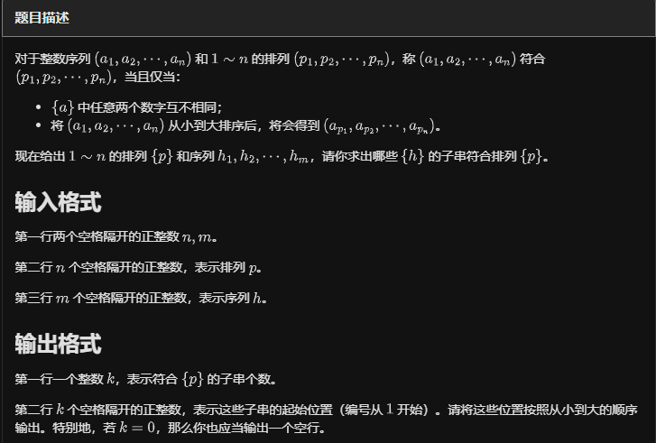
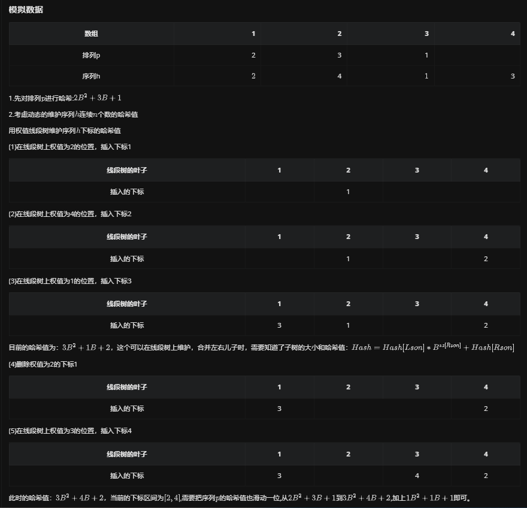

# 数据结构维护哈希


## SGT动态维护区间哈希

### 例题 #1 [JSOI2008] 火星人

题目描述

火星人最近研究了一种操作：求一个字串两个后缀的公共前缀。

比方说，有这样一个字符串：madamimadam，我们将这个字符串的各个字符予以标号：

```Plain Text
序号 1 2 3 4 5 6 7 8 9 10 11 
字符 m a d a m i m a d a m
```

现在，火星人定义了一个函数 $LCQ(x, y)$，表示：该字符串中第 $x$ 个字符开始的字串，与该字符串中第 $y$ 个字符开始的字串，两个字串的公共前缀的长度。比方说，$LCQ(1, 7) = 5, LCQ(2, 10) = 1, LCQ(4, 7) = 0$

在研究 $LCQ$ 函数的过程中，火星人发现了这样的一个关联：如果把该字符串的所有后缀排好序，就可以很快地求出 $LCQ$ 函数的值；同样，如果求出了 $LCQ$ 函数的值，也可以很快地将该字符串的后缀排好序。

尽管火星人聪明地找到了求取 $LCQ$ 函数的快速算法，但不甘心认输的地球人又给火星人出了个难题：在求取 $LCQ$ 函数的同时，还可以改变字符串本身。具体地说，可以更改字符串中某一个字符的值，也可以在字符串中的某一个位置插入一个字符。地球人想考验一下，在如此复杂的问题中，火星人是否还能够做到很快地求取 $LCQ$ 函数的值。

输入格式

第一行给出初始的字符串。第二行是一个非负整数 $M$ ，表示操作的个数。接下来的M行，每行描述一个操作。操作有 $3$ 种，如下所示

1. 询问。语法：$Q$ $x$ $y$ ，$x$ ,$y$ 均为正整数。功能：计算 $LCQ(x,y)$ 限制：$1$ $\leq$ $x$ , $y$ $\leq$ 当前字符串长度 。

2. 修改。语法：$R$ $x$ $d$，$x$ 是正整数，$d$ 是字符。功能：将字符串中第 $x$ 个数修改为字符 $d$ 。限制：$x$ 不超过当前字符串长度。

3. 插入：语法：$I$ $x$ $d$ ，$x$ 是非负整数，$d$ 是字符。功能：在字符串第 $x$ 个字符之后插入字符 $d$ ，如果 $x=0$，则在字符串开头插入。限制：$x$ 不超过当前字符串长度

输出格式

对于输入文件中每一个询问操作，你都应该输出对应的答案。一个答案一行。

1. 所有字符串自始至终都只有小写字母构成。

2. $M\leq150,000$

3. 字符串长度L自始至终都满足$L\leq100,000$

4. 询问操作的个数不超过 $10,000$ 个。

对于第 $1$，$2$ 个数据，字符串长度自始至终都不超过 $1,000$
对于第 $3$，$4$，$5$ 个数据，没有插入操作。

2024/07/40 更新一组 hack。

---

暴力可过。下面代码没有参考价值。请参考 例题 #2

```C++
/*                                                                                
                      Keyblinds Guide
     				###################
      @Ntsc 2024

      - Ctrl+Alt+G then P : Enter luogu problem details
      - Ctrl+Alt+B : Run all cases in CPH
      - ctrl+D : choose this and dump to the next
      - ctrl+Shift+L : choose all like this
      - ctrl+K then ctrl+W: close all
      - Alt+la/ra : move mouse to pre/nxt pos'
	  
*/
#include <bits/stdc++.h>
#include <queue>
using namespace std;

#define rep(i, l, r) for (int i = l, END##i = r; i <= END##i; ++i)
#define per(i, r, l) for (int i = r, END##i = l; i >= END##i; --i)
#define pb push_back
#define mp make_pair
#define int long long
#define ull unsigned long long
#define pii pair<int, int>
#define ps second
#define pf first

// #define innt int
#define itn int
// #define inr intw
// #define mian main
// #define iont int

#define rd read()
int read(){
    int xx = 0, ff = 1;
    char ch = getchar();
    while (ch < '0' || ch > '9') {
		if (ch == '-')
			ff = -1;
		ch = getchar();
    }
    while (ch >= '0' && ch <= '9')
      xx = xx * 10 + (ch - '0'), ch = getchar();
    return xx * ff;
}
void write(int out) {
	if (out < 0)
		putchar('-'), out = -out;
	if (out > 9)
		write(out / 10);
	putchar(out % 10 + '0');
}

#define ell dbg('\n')
const char el='\n';
const bool enable_dbg = 1;
template <typename T,typename... Args>
void dbg(T s,Args... args) {
	if constexpr (enable_dbg){
    cerr << s;
    if(1)cerr<<' ';
		if constexpr (sizeof...(Args))
			dbg(args...);
	}
}

#define zerol = 1
#ifdef zerol
#define cdbg(x...) do { cerr << #x << " -> "; err(x); } while (0)
void err() { cerr << endl; }
template<template<typename...> class T, typename t, typename... A>
void err(T<t> a, A... x) { for (auto v: a) cerr << v << ' '; err(x...); }
template<typename T, typename... A>
void err(T a, A... x) { cerr << a << ' '; err(x...); }
#else
#define dbg(...)
#endif


const int N = 3e5 + 5;
const int INF = 1e18;
const int M = 1e7;
const int MOD = 1e9 + 7;


string s;


void solve(){
    cin>>s;
    int m=rd;
    while(m--){
        char op;
        cin>>op;
        if(op=='Q'){
            itn x=rd-1,y=rd-1;
            int res=0;
            while(s[x]==s[y]&&s[x]&&s[y]){
                res++;
                x++;
                y++;
            }
            cout<<res<<endl;
        }if(op=='R'){
            int x=rd-1;
            char c;
            cin>>c;
            s[x]=c;
        }if(op=='I'){
            int x=rd;
            string c;
            cin>>c;
            s.insert(x,c);
        }
    }
}

signed main() {
    // freopen(".in","r",stdin);
    // freopen(".in","w",stdout);

    int T=1;
    while(T--){
    	solve();
    }
    return 0;
}
```

### 例题 #2



---



```C++

/*
                      Keyblinds Guide
                                ###################
      @Ntsc 2024

      - Ctrl+Alt+G then P : Enter luogu problem details
      - Ctrl+Alt+B : Run all cases in CPH
      - ctrl+D : choose this and dump to the next
      - ctrl+Shift+L : choose all like this
      - ctrl+K then ctrl+W: close all
      - Alt+la/ra : move mouse to pre/nxt pos'

*/
#include <bits/stdc++.h>
#include <queue>
using namespace std;

#define rep(i, l, r) for (int i = l, END##i = r; i <= END##i; ++i)
#define per(i, r, l) for (int i = r, END##i = l; i >= END##i; --i)
#define pb push_back
#define mp make_pair
#define int long long
#define pii pair<int, int>
#define ps second
#define pf first
#define ull unsigned long long

#define itn int
// #define inr int
// #define mian main
// #define iont int

#define rd read()
int read() {
    int xx = 0, ff = 1;
    char ch = getchar();
    while (ch < '0' || ch > '9') {
        if (ch == '-')
            ff = -1;
        ch = getchar();
    }
    while (ch >= '0' && ch <= '9') xx = xx * 10 + (ch - '0'), ch = getchar();
    return xx * ff;
}
void write(int out) {
    if (out < 0)
        putchar('-'), out = -out;
    if (out > 9)
        write(out / 10);
    putchar(out % 10 + '0');
}

#define ell dbg('\n')
const char el = '\n';
const bool enable_dbg = 1;
template <typename T, typename... Args>
void dbg(T s, Args... args) {
    if constexpr (enable_dbg) {
        cerr << s;
        if (1)
            cerr << ' ';
        if constexpr (sizeof...(Args))
            dbg(args...);
    }
}

#define zerol = 1
#ifdef zerol
#define cdbg(x...)            \
    do {                      \
        cerr << #x << " -> "; \
        err(x);               \
    } while (0)
void err() { cerr << endl; }
template <template <typename...> class T, typename t, typename... A>
void err(T<t> a, A... x) {
    for (auto v : a) cerr << v << ' ';
    err(x...);
}
template <typename T, typename... A>
void err(T a, A... x) {
    cerr << a << ' ';
    err(x...);
}
#else
#define dbg(...)
#endif

const int N = 1e6 + 5;
const int INF = 1e18;
const int M = 1e7;
const int MOD = 1e9 + 7;
const int P = 1e2 + 7;

// const int P = 10;

ull pw[N];

namespace SGT {

struct node {
    int sz, hs;
} t[N << 2];

void pushup(int x) {
    t[x].sz = t[x << 1].sz + t[x << 1 | 1].sz;
    t[x].hs = t[x << 1].hs * pw[t[x << 1 | 1].sz] + t[x << 1 | 1].hs;
    //		cdbg(x,t[x<<1|1].sz,t[x<<1].hs,t[x<<1|1].hs);
}

void changry(int x, int l, int r, int p, int v) {
    // change&query
    if (l == r) {
        if (v > 0)
            t[x].sz++;
        else
            t[x].sz--;
        t[x].hs += v;
        //			cdbg(x,v,t[x].hs);
        return;
    }

    int mid = l + r >> 1;

    if (p <= mid)
        changry(x << 1, l, mid, p, v);
    else
        changry(x << 1 | 1, mid + 1, r, p, v);
    pushup(x);
}
}  // namespace SGT
using namespace SGT;

int p[N], a[N];
int ans[N];
int top;

int b[N];

void solve() {
    int n = rd, m = rd;
    for (int i = 1; i <= n; i++) {
        p[i] = rd;
    }

    for (int i = 1; i <= m; i++) {
        b[i] = a[i] = rd;
    }

    sort(b + 1, b + m + 1);
    //	int len=unique(b+1,b+m+1)-b-1;
    for (int i = 1; i <= m; i++) {
        a[i] = lower_bound(b + 1, b + m + 1, a[i]) - b;
    }

    pw[0] = 1;
    for (int i = 1; i <= m; i++) {
        pw[i] = pw[i - 1] * P;
    }

    int hsp = 0, inp = 0;

    for (int i = 0; i < n; i++) {
        inp += pw[i];
    }

    for (int i = 1; i <= n; i++) {
        hsp = hsp * P + p[i];
    }

    for (int i = 1; i <= n; i++) {
        changry(1, 1, m, a[i], i);
    }

    //	cdbg(1,t[1].hs);

    if (t[1].hs == hsp) {
        ans[++top] = 1;
    }

    for (int i = n + 1; i <= m; i++) {
        hsp += inp;
        changry(1, 1, m, a[i - n], -i + n);
        changry(1, 1, m, a[i], i);
        //		cdbg(i-n+1,t[1].hs,hsp);
        if (t[1].hs == hsp) {
            ans[++top] = i - n + 1;
        }
    }

    cout << top << endl;
    for (int i = 1; i <= top; i++) {
        cout << ans[i] << ' ';
    }
}

signed main() {
    // freopen(".in","r",stdin);
    // freopen(".in","w",stdout);

    int T = 1;
    while (T--) {
        solve();
    }
    return 0;
}

/*
3 4
2 3 1
2 4 1 3


*/
```

## 树状数组维护哈希

### 例题 #1 三元组

远方的山总共有 N 个山峰，从左往右第 i 个山峰有一个高度 Hi​。小 F 认为一个三元组 (i,j,k) 可以写成一首诗，当且仅当 1≤i<j<k≤N 且 Hi​−Hj​=Hj​−Hk​。

小 F 和大 F 生活的国家—— Fairy 国地形十分奇特，保证 H1…N​ 一定是一个 1…N 的排列。

Input Format

第一行一个正整数 N ，表示山峰的数量。

第二行 N 个正整数 H1…N​，表示从左往右每座山峰的高度，保证是个 1…N 的排列。

Output Format

一行一个字符串 `YES` 或 `NO` ，表示小 F 能否写出一首诗，即是否存在三元组 (i,j,k) 满足 1≤i<j<k≤N 且 Hi​−Hj​=Hj​−Hk​ 。

$n\in[1,3e5]$

---

首先我们枚举h_j，要存在满足的三元组，就要找到h_i+h_k=2h_j。可以发现h_i,h_k关于h_j对称。

于是我们要找到一组合法的i,k，满足：

- i,k在j的两侧

- h_i,h_k关于h_j对称。

于是我们维护p_i表示值i在当前指针的左侧/右侧。对于枚举的h_j。如果p_{h_j}两侧的内容对称，那么就说明没有任何组(h_i,h_k)满足条件，反之就存在解。

因此我们需要试试维护p数组的哈希，用于判断回文串。

哈希的实质其实是加权的前缀和，因此我们考虑树状数组维护。

于是对于位置1~n，我们分别加权pw_{n-1}~pw_0。求[l,r]的哈希值，就是求$(presum(r)-presum(l-1)\times pw_{r-l+1})\div pw_{n-r}$

倒序哈希类似。

```C++
/*  Erica N  */
#include <bits/stdc++.h>
using namespace std;
#define pb push_back
#define endl '\n'
#define mp make_pair
#define int long long
#define ull unsigned long long
#define pii pair<int, int>
#define ps second
#define pf first
#define itn int
#define rd read()
int read(){
    int xx = 0, ff = 1;char ch = getchar();
    while (ch < '0' || ch > '9') {if (ch == '-')ff = -1; ch = getchar();}
    while (ch >= '0' && ch <= '9')xx = xx * 10 + (ch - '0'), ch = getchar();
    return xx * ff;
}
// void write(int out) {
// 	if (out < 0)
// 		putchar('-'), out = -out;
// 	if (out > 9)
// 		write(out / 10);
// 	putchar(out % 10 + '0');
// }
#define cdbg(x...) do { cerr << #x << " -> "; err(x); } while (0)
void err() { cerr << endl; }
template<template<typename...> class T, typename t, typename... A>
void err(T<t> a, A... x) { for (auto v: a) cerr << v << ' '; err(x...); }
template<typename T, typename... A>
void err(T a, A... x) { cerr << a << ' '; err(x...); }


const int N = 3e5 + 5;
const int INF = 1e18;
const int MOD = 1e9 + 7;
const ull P=3;

int pw[N],pw2[N];
int a[N];
int n;

namespace BIT{
    int lc[N],rc[N];
    
    void change(int x,itn v){
        int loc=x;
        while(x<N){
            (lc[x]+=pw[loc])%=MOD;
            (rc[x]+=pw[N-loc])%=MOD;
            x+=x&-x;
        }
    }

    int PW(int a){
        if(a>0)return pw[a];
        return pw2[-a];
    }

    int query(int x){
        int len=min(x,n-x+1);
        ull h1=0,h2=0,d=x+len-1;
        while(d)
            h1=(h1+1ll*lc[d]*PW(N-2*x))%MOD,d-=d&(-d);
        d=x-len;
        while(d)
            h1=(h1-1ll*lc[d]*PW(N-2*x)%MOD+MOD)%MOD,d-=d&(-d);
        d=x-len;
        while(d)
            h2=(h2-rc[d]+MOD)%MOD,d-=d&(-d);
        d=x+len-1;
        while(d)
            h2=(h2+rc[d]+MOD)%MOD,d-=d&(-d);
        return h1!=h2;
    }


}using namespace BIT;


inline int ksm(int a,int b){
    int res=1;
    while(b){
        if(b&1)res=res*a%MOD;
        b>>=1;
        a=a*a%MOD;
    }
    return res;
}


bool check(int x){
    return query(x);
}

signed main() {
    // freopen("tuple.in","r",stdin);
    // freopen("tuple.out","w",stdout);  
     n=rd;
    for(int i=1;i<=n;i++){
        a[i]=rd;
    }

    int G=ksm(P,MOD-2);
    // cdbg(G);


    pw[0]=pw2[0]=1;
    for(int i=1;i<N;i++){
       pw[i]=pw[i-1]*P%MOD; 
       pw2[i]=pw2[i-1]*G%MOD; 
    }

    for(int i=1;i<=n;i++){
        if(check(a[i])){
            puts("YES");
            exit(0);
        }
        change(a[i],1);
    }

    puts("NO");
    


}
```

