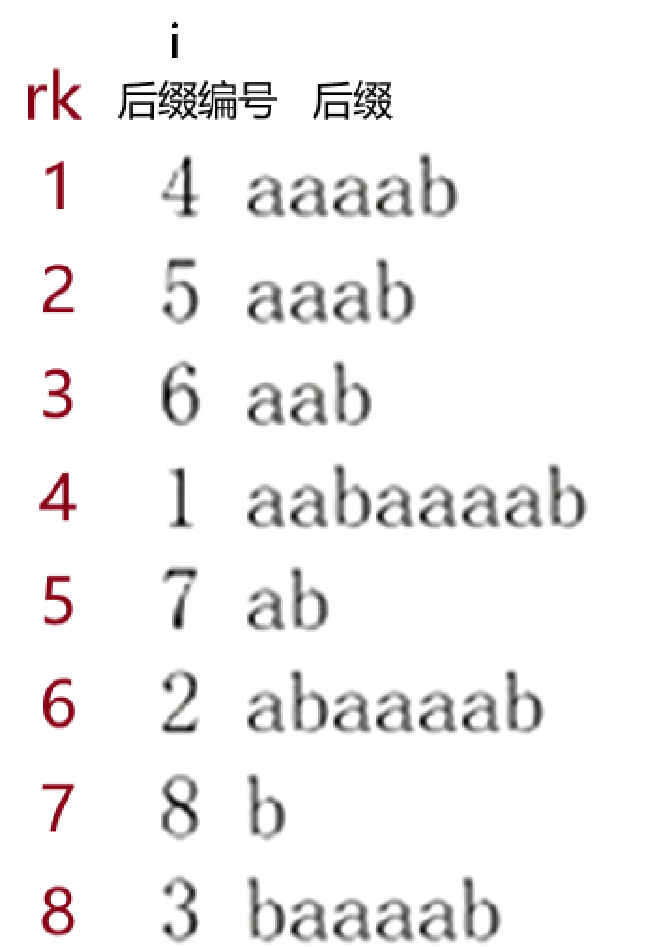

专题 | 高级字符串算法

# 目录

- SA数组（后缀数组）

# 后缀数组

[学习笔记 | SA](https://flowus.cn/cdc2f36a-560c-4abe-aed9-a36439b488d5)

先看

## 概念

后缀数组 (Suffix Array)

**e.g.** 一个长度为 8 的字符串 aabaaaab，一共有 8 个后缀，后缀的编号是后缀在原串中的起始位置。把 8 个后缀按照字典序升序排序。


1 aabaaaab

2 abaaaab

3 baaaab

4 aaaab

5 aaab

6 aab

7 ab

8 b


4 aaaab

5 aaab

6 aab

1 aabaaaab

7 ab

2 abaaaab

8 b

3 baaaab

**后缀数组 `sa[i]`**

表示排序为 i 的后缀编号

`sa[1]=4, sa[2]=5, sa[3]=6, sa[4]=1`

**名次数组 `rk[i]`**

表示后缀 i 的排名

`rk[4]= 1 , rk[5]=2, rk[6] = 3 , rk[1]=4`

关系： `rk[sa[i]] = sa[rk[i]] =i`

**高度数组** 

`height[i] = lcp(sa[i], sa[i-1])`

第 i 名后缀与第 i - 1 名后缀的最长公共前缀的长度。

`height[2] = lcp(5,4) = 3` ，`height[3] = lcp(6,5) = 2` ，`height[4] = lcp(I,6) = 3` ，高度数组表示两个后缀的相似度，排序相邻的两个后缀相似度最高。 

`void getsa()`

利用倍增法和桶排序，计算sa数组 

`void geth()`

利用 `sa[]` 和 `rk[]` ，计算 height 数组

## 求SA数组

**Part.1**

按每个后缀的第一个字符排序。这里是计数排序

```C++
   for(int i=1;i<=n;i++)cnt[x[i]=s[i]]++;
    for(int i=1;i<=m;i++)cnt[i]+=cnt[i-1];//前缀桶计数
    for(int i=n;i;i--)sa[cnt[x[i]]--]=i;//把当前位分配给i

```

**Part.2**

倍增

k的解释：（设当前枚举到k）
即对于当前求出的sa数组，已经是按照某个前缀的前k个字符排好序的。
在当前循环下，我们会以某个前缀的第k+1~2k个字符的顺序（字典序）作为第2关键字，将1~k个字符作为第一关键字。
而无论是前缀的第k+1~2k个字符还是第1~k个字符，其相对顺序我们都已经在上一轮k中求得了
（这里注意我们是对后缀数组继续排序！加上我们要求每个后缀的第k+1~2k个字符的相对顺序，那么第i个后缀的第k+1~2k个字符就相当于第i+k个后缀的第1~k个字符。
~~~~而第i+k个后缀的第1~k个字符我们已经求出其相对顺序记录在sa数组中。可以直接调用！
这就是**倍增**的思想

```C++
for(int k=1;k<=n;k<<=1){
  //...
}
```

循环内：

**Part.2.1**

原理：计数排序/桶排序，如果要按两个关键字排序的话，那么我们要先按第二关键字排序后再按第一关键字排序。
计数排序可以看成一种微扰排序，即在按某个关键字k排序时，之前按另外一个关键字t排序的顺序在k相同时位置相对不变。
可以理解成是稳定排序

```C++

        memset(cnt,0,sizeof cnt);//按第2关键字排序
        for(int i=1;i<=n;i++)sa2[i]=sa[i];
        for(int i=1;i<=n;i++)cnt[x[sa2[i]+k]]++;//如果sa2[i]指代"abcdef",则sa2[i]+2指代"cdef"
        for(int i=1;i<=m;i++)cnt[i]+=cnt[i-1];//前缀桶计数
        for(int i=n;i;i--)sa[cnt[x[sa2[i]+k]]--]=sa2[i];//把当前位分配给i

        memset(cnt,0,sizeof cnt);//按第一关键字排序
        for(int i=1;i<=n;i++)sa2[i]=sa[i];
        for(int i=1;i<=n;i++)cnt[x[sa2[i]]]++;//如果sa2[i]指代"abcdef",则sa2[i]+2指代"cdef"
        for(int i=1;i<=m;i++)cnt[i]+=cnt[i-1];//前缀桶计数
        for(int i=n;i;i--)sa[cnt[x[sa2[i]]]--]=sa2[i];//把当前位分配给i

```

**Part.2.2**

我们把按照当前2k个关键字排序的sa记录下来，在下一个循环中，我们会以第2k+1~4k个字符作为第2关键字，将当前求出的sa数组（即将第1~2k个字符的顺序为关键字）作为第一关键字排序

```C++
        m=0;    
        for(int i=1;i<=n;i++)sa2[i]=x[i];
        for(int i=1;i<=n;i++){
            if(sa2[sa[i]]==sa2[sa[i-1]]&&sa2[sa[i]+k]==sa2[sa[i-1]+k])
                x[sa[i]]=m;
            else x[sa[i]]=++m;
        }
```

**Part.2.3**

提前跳出
当前情况即我们已经把第1~2k个字符分别作为第1~2k关键字桶排序后。
如果桶的数量m<后缀个数n，那么就说明还有≥2个后缀的这2k个关键字相同。
那么对于这几个后缀，其在当前求出的sa数组中的先后顺序还是乱序的，我们要继续排序。
如果m=n，则说明这n个后缀分别取他们的前2k个字符已经两两互不相同了，此时sa数组是准确的，即已经求出了sa数组。

```C++
if(m==n)break;
```

**WholeCode**

不放心可使用以下题目中的代码

[www.luogu.com.cn](https://www.luogu.com.cn/problem/P3809)

```C++

int n,m='z';

void getsa(){
    for(int i=1;i<=n;i++)cnt[x[i]=s[i]]++;
    for(int i=1;i<=m;i++)cnt[i]+=cnt[i-1];//前缀桶计数
    for(int i=n;i;i--)sa[cnt[x[i]]--]=i;//把当前位分配给i

    for(int k=1;k<=n;k<<=1){
        /*
        k的解释：
        设当前枚举到k
        即对于当前求出的sa数组，已经是按照某个前缀的前k个字符排好序的。
        在当前循环下，我们会以某个前缀的第k+1~2k个字符的顺序（字典序）作为第2关键字，将1~k个字符作为第一关键字。
        而无论是前缀的第k+1~2k个字符还是第1~k个字符，其相对顺序我们都已经在上一轮k中求得了
        （这里注意我们是对后缀数组继续排序！加上我们要求每个后缀的第k+1~2k个字符的相对顺序，那么第i个后缀的第k+1~2k个字符就相当于第i+k个后缀的第1~k个字符。
        而第i+k个后缀的第1~k个字符我们已经求出其相对顺序记录在sa数组中。可以直接调用！
        这就是**倍增**的思想
        */

        //Part.1
        /*
        原理：计数排序/桶排序，如果要按两个关键字排序的话，那么我们要先按第二关键字排序后再按第一关键字排序。
        计数排序可以看成一种微扰排序，即在按某个关键字k排序时，之前按另外一个关键字t排序的顺序在k相同时位置相对不变。
        可以理解成是稳定排序
        */
        memset(cnt,0,sizeof cnt);//按第2关键字排序
        for(int i=1;i<=n;i++)sa2[i]=sa[i];
        for(int i=1;i<=n;i++)cnt[x[sa2[i]+k]]++;//如果sa2[i]指代"abcdef",则sa2[i]+2指代"cdef"
        for(int i=1;i<=m;i++)cnt[i]+=cnt[i-1];//前缀桶计数
        for(int i=n;i;i--)sa[cnt[x[sa2[i]+k]]--]=sa2[i];//把当前位分配给i

        memset(cnt,0,sizeof cnt);//按第一关键字排序
        for(int i=1;i<=n;i++)sa2[i]=sa[i];
        for(int i=1;i<=n;i++)cnt[x[sa2[i]]]++;//如果sa2[i]指代"abcdef",则sa2[i]+2指代"cdef"
        for(int i=1;i<=m;i++)cnt[i]+=cnt[i-1];//前缀桶计数
        for(int i=n;i;i--)sa[cnt[x[sa2[i]]]--]=sa2[i];//把当前位分配给i

        //Part.2
        /*
        我们把按照当前2k个关键字排序的sa记录下来，在下一个循环中，我们会以第2k+1~4k个字符作为第2关键字，将当前求出的sa数组（即将第1~2k个字符的顺序为关键字）作为第一关键字排序
        */

        for(int i=1;i<=n;i++)sa2[i]=x[i];
        m=0;
        for(int i=1;i<=n;i++){
            if(sa2[sa[i]]==sa2[sa[i-1]]&&sa2[sa[i]+k]==sa2[sa[i-1]+k])
                x[sa[i]]=m;
            else x[sa[i]]=++m;
        }

        //Part.3
        /*
        提前跳出
        当前情况即我们已经把第1~2k个字符分别作为第1~2k关键字桶排序后。
        如果桶的数量m<后缀个数n，那么就说明还有>=2个后缀的这2k个关键字相同。
        那么对于这几个后缀，其在当前求出的sa数组中的先后顺序还是乱序的，我们要继续排序。
        如果m=n，则说明这n个后缀分别取他们的前2k个字符已经两两互不相同了，此时sa数组是准确的，即已经求出了sa数组。
        */
        if(m==n)break;
    }
}
```

## 求h（height）数组

高度数组 `height[i]= LCP(sa[i], sa[i-1])`

第 i 名后缀与第 i- 1 名后缀的最长公共前缀的长度。

> 后缀 i 的前邻后缀一定是 `sa[rk[i]-1]`，因为 `i = sa[rk[i]]`， i 的排名为 `rk[i]`，排名减 1 取 sa 即得。

定理：`height[rk[i]] ≥ height[rk[i-1]]-1`

`h[i]`定义为$rk_i$的后缀与$rk_{i-1}$的后缀的最大前缀长度。


`rk[i]`定义为按字典序排序后后缀i的排名




```C++
void geth(){
    for(int i=1;i<=n;i++)rk[sa[i]]=i;//先求出rk数组，依据rk[]与sa[]互为反函数
    for(int i=1,k=0;i<=n;i++){
        if(rk[i]==1)continue;//没得比，就是0
        if(k)k--;//定理
        int j=sa[rk[i]-1];
        while(i+k<=n&&j+k<=n&&s[i+k]==s[j+k])k++;//从初始k开始逐位向后比对直到不同
        h[rk[i]]=k;
    }
}
```


