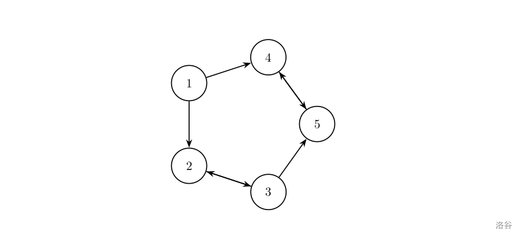
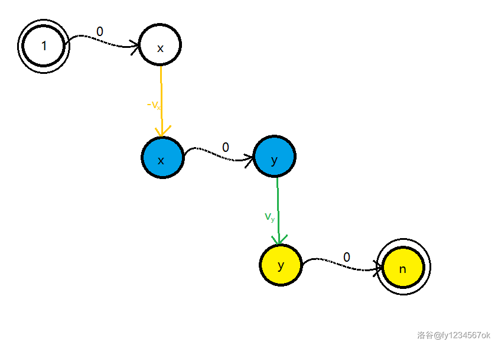
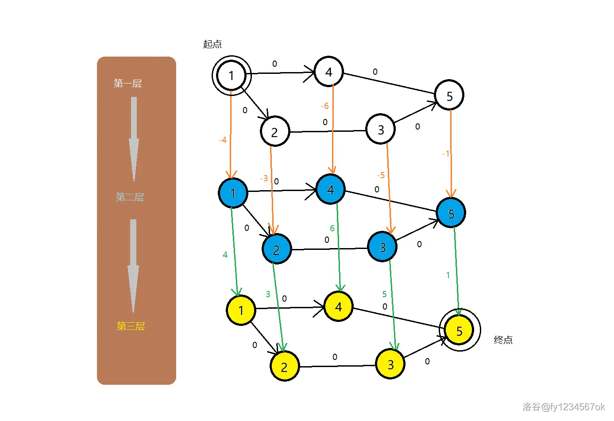
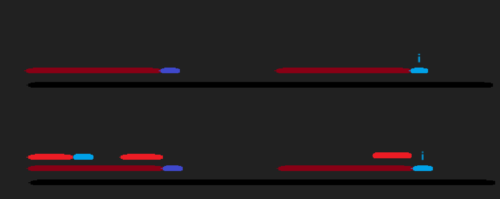
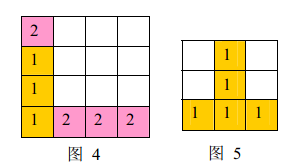
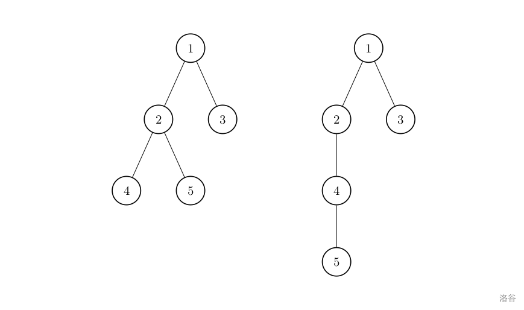
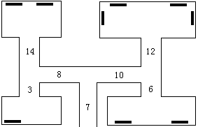
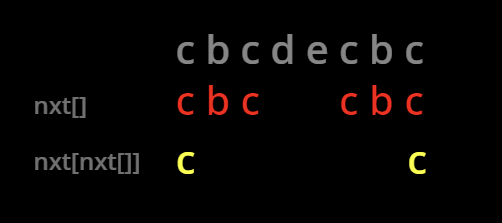
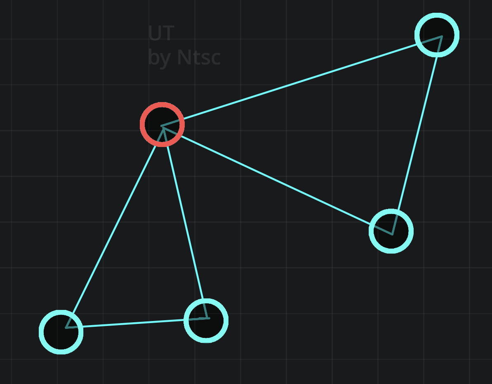
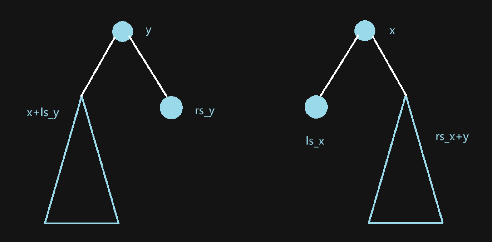

# 算法快闪 快速回顾模板

day1

## 快读快写

```C++
std::ios::sync_with_stdio(false); cin.tie(0); cout.tie(0);
```

最好别用

## 最短路问题

### dijkstra模板 | [USACO09OCT] Heat Wave G

有一个 $n$ 个点 $m$ 条边的无向图，请求出从 $s$ 到 $t$ 的最短路长度。

【数据范围】
对于 $100\%$ 的数据，$1\le n \le 2500$，$1\le m \le 6200$，$1\le w \le 1000$。

【样例说明】
$5 \to 6 \to 1 \to 4$ 为最短路，长度为 $3+1+3 = 7$。

---

dijkstra

错误写法（犯错 这里！）

```C++

void djstr(int s){
	//原集合V，最短路集合S
	priority_queue<pii> pq;
	for(int i=1;i<=n;i++)dis[i]=INF;
	dis[s]=0;
	pq.push(mp(-dis[s],s));
	while(pq.size()){
		int u=pq.top().ps;
		pq.pop();
		
		for(auto [v,w]:e[u]){
			if(vis[v])continue;//已经在S中
			if(dis[v]>dis[u]+w){
				dis[v]=dis[u]+w;
                vis[v]=1;//<-here
				pq.push(mp(-dis[v],v));
			}
		}
	}
}

```

正确

我们要保证从pq中取出的u一定不在S中！即我们对每一个点都放缩一次，vis标记有没有对这个点放缩过！而不是标记是不是在S中！

```C++
/*
CB Ntsc
*/

#include<bits/stdc++.h>
using namespace std;
#define int long long
#define mp make_pair
#define pii pair<int, int>
#define pf first
#define ps second

#define rd read()
inline int rd
{
	int xx=0,ff=1;
	char ch=getchar();
	while(ch<'0'||ch>'9') {if(ch=='-') ff=-1;ch=getchar();}
	while(ch>='0'&&ch<='9') xx=xx*10+(ch-'0'),ch=getchar();
	return xx*ff;
}
inline void write(int out)
{
	if(out<0) putchar('-'),out=-out;
	if(out>9) write(out/10);
	putchar(out%10+'0');
}


// void solve(){

//     cerr<<"\nlong longrr[][]=";
//     for(int i=1;i<=n;i++)cerr<<t[i].lst<<' '<<t[i].r<<endl;
// }


const int N=5e5+5;
 const int M=5e4+5;
const int INF=2e9+5;
const int MOD=2e9+7;
bool f1;

int n,m,k,s,t,cnt,ans,dis[N],vis[N];
struct node{
	int v,w;
};
vector<node> e[N];

void add(int a,int b,int c){
	e[a].push_back({b,c});
	e[b].push_back({a,c});
}

void djstr(int s){
	//原集合V，最短路集合S
	priority_queue<pii> pq;
	for(int i=1;i<=n;i++)dis[i]=INF;
	dis[s]=0;
	pq.push(mp(-dis[s],s));
	while(pq.size()){
		int u=pq.top().ps;
		pq.pop();
		if(vis[u])continue;
		vis[u]=1;
		for(auto [v,w]:e[u]){
			//if(vis[v])continue;//已经在S中//不要判！
			if(dis[v]>dis[u]+w){
				dis[v]=dis[u]+w;
				
				pq.push(mp(-dis[v],v));
			}
		}
	}
}

signed main(){
	
	n=rd,m=rd,s=rd,t=rd;
	for(int i=1;i<=m;i++){
		int a=rd,b=rd,c=rd;
		add(a,b,c);
	}

	djstr(s);

	cout<<dis[t]<<endl;
	return 0;
}
/*
2 5
0 1 1 1 1
0 1 1 2 4
0 2 1 2 1
0 2 1 1 4
*/
```

### Floyd | [NOIP2012 普及组] 文化之旅

有一位使者要游历各国，他每到一个国家，都能学到一种文化，但他不愿意学习任何一种文化超过一次（即如果他学习了某种文化，则他就不能到达其他有这种文化的国家）。不同的国家可能有相同的文化。不同文化的国家对其他文化的看法不同，有些文化会排斥外来文化（即如果他学习了某种文化，则他不能到达排斥这种文化的其他国家）。

现给定各个国家间的地理关系，各个国家的文化，每种文化对其他文化的看法，以及这位使者游历的起点和终点（在起点和终点也会学习当地的文化），国家间的道路距离，试求从起点到终点最少需走多少路。

对于 100%的数据，有$ 2≤N≤100$

$1≤K≤100$

$1≤M≤N^2$

$1≤k_i≤K$

$1≤u, v≤N$

$1≤d≤1000,S≠T,1≤S,T≤N$

NOIP 2012 普及组 第四题

```C++
/*
CB Ntsc
*/

#include<bits/stdc++.h>
using namespace std;
#define int long long
#define mp make_pair
#define pii pair<int, int>
#define pf first
#define ps second

#define rd read()
inline int rd
{
	int xx=0,ff=1;
	char ch=getchar();
	while(ch<'0'||ch>'9') {if(ch=='-') ff=-1;ch=getchar();}
	while(ch>='0'&&ch<='9') xx=xx*10+(ch-'0'),ch=getchar();
	return xx*ff;
}
inline void write(int out)
{
	if(out<0) putchar('-'),out=-out;
	if(out>9) write(out/10);
	putchar(out%10+'0');
}


// void solve(){

//     cerr<<"\nlong longrr[][]=";
//     for(int i=1;i<=n;i++)cerr<<t[i].lst<<' '<<t[i].r<<endl;
// }


const int N=2e2+5;
 const int M=5e4+5;
const int INF=2e9+5;
const int MOD=2e9+7;
bool f1;

int n,m,k,s,t,cnt,ans,dis[N][N],c[N],used[N][N][N],a[N][N];
struct node{
	int v,w;
};
vector<node> e[N];

void add(int u,int v,int w){

	if(!a[c[v]][c[u]]&&c[v]!=c[u])dis[u][v]=min(dis[u][v],w);
	if(!a[c[u]][c[v]]&&c[v]!=c[u])dis[v][u]=min(dis[v][u],w);//带约束的连边
}

void flyd(){
	for(int k=1;k<=n;k++){
		for(int i=1;i<=n;i++){
			for(int j=1;j<=n;j++){
				if(dis[i][j]>dis[i][k]+dis[k][j] && !a[c[k]][c[i]] && !a[c[j]][c[k]] && !used[i][k][c[j]] && !used[k][j][c[i]]){//理解以下最后两个约束条件。还是很好理解的
				///////////////////////////////////注意从i到k要看c[k]是否排除c[i]而不是反过来！
					for(int c=1;c<=n;c++)used[i][j][c]=used[i][k][c]|used[k][j][c];//不能|=
					used[i][j][c[k]]=1;//used[i][j][c[k]]表示i到j的路径（包含端点）上是否经过了颜色为c[k]的点
					
					dis[i][j]=dis[i][k]+dis[k][j];
				}
			}
		}
	}
}


signed main(){
	
	n=rd,k=rd,m=rd,s=rd,t=rd;

	for(int i=1;i<=n;i++){//初始化
		for(int j=1;j<=n;j++)dis[i][j]=INF;
		dis[i][i]=0;
	}
	
	for(int i=1;i<=n;i++)c[i]=rd;
	for(int i=1;i<=k;i++){
		for(int j=1;j<=k;j++){
			a[i][j]=rd;
		}
	}
	
	for(int i=1;i<=m;i++){
		int a=rd,b=rd,c=rd;
		add(a,b,c);
	}


	for(int i=1;i<=n;i++){//初始化约束
		for(int j=1;j<=n;j++)used[i][j][c[i]]=1,used[i][j][c[j]]=1;
	}

	
	
	flyd();
	if(dis[s][t]==INF)cout<<-1;
	else cout<<dis[s][t];

	
	return 0;
}
/*
2 5
0 1 1 1 1
0 1 1 2 4
0 2 1 2 1
0 2 1 1 4
*/
```

！！注意不要把==打成= 

### SPFA分层图 | [NOIP2009 提高组] 最优贸易

$C$ 国有 $n$ 个大城市和 $m$ 条道路，每条道路连接这 $n$ 个城市中的某两个城市。任意两个城市之间最多只有一条道路直接相连。这 $m$ 条道路中有一部分为单向通行的道路，一部分为双向通行的道路，双向通行的道路在统计条数时也计为 $1$ 条。

$C$ 国幅员辽阔，各地的资源分布情况各不相同，这就导致了同一种商品在不同城市的价格不一定相同。但是，同一种商品在同一个城市的买入价和卖出价始终是相同的。

商人阿龙来到 $C$ 国旅游。当他得知同一种商品在不同城市的价格可能会不同这一信息之后，便决定在旅游的同时，利用商品在不同城市中的差价赚回一点旅费。设 $C$ 国 $n$ 个城市的标号从 $1\sim n$，阿龙决定从 $1$ 号城市出发，并最终在 $n$ 号城市结束自己的旅行。在旅游的过程中，任何城市可以重复经过多次，但不要求经过所有 $n$ 个城市。阿龙通过这样的贸易方式赚取旅费：他会选择一个经过的城市买入他最喜欢的商品――水晶球，并在之后经过的另一个城市卖出这个水晶球，用赚取的差价当做旅费。由于阿龙主要是来 $C$ 国旅游，他决定这个贸易只进行最多一次，当然，在赚不到差价的情况下他就无需进行贸易。

假设 $C$ 国有 $5$ 个大城市，城市的编号和道路连接情况如下图，单向箭头表示这条道路为单向通行，双向箭头表示这条道路为双向通行。



假设 $1\sim n$ 号城市的水晶球价格分别为 $4,3,5,6,1$。

阿龙可以选择如下一条线路：$1\to2\to3\to5$，并在 $2$ 号城市以 $3$ 的价格买入水晶球，在 $3$ 号城市以 $5$ 的价格卖出水晶球，赚取的旅费数为 $2$。

阿龙也可以选择如下一条线路：$1\to4\to5\to4\to5$，并在第 $1$ 次到达 $5$ 号城市时以 $1$ 的价格买入水晶球，在第 $2$ 次到达 $4$ 号城市时以 $6$ 的价格卖出水晶球，赚取的旅费数为 $5$。

现在给出 $n$ 个城市的水晶球价格，$m$ 条道路的信息（每条道路所连接的两个城市的编号以及该条道路的通行情况）。请你告诉阿龙，他最多能赚取多少旅费。

对于 $100\%$ 的数据，$1\leq n\leq 100000$，$1\leq m\leq 500000$，$1\leq  x,y\leq  n$，$1\leq  z\leq  2$，$1\leq $ 各城市的编号 $\leq  n$。

水晶球价格 $\leq 100$。

NOIP 2009 提高组 第三题

---

由于可以任意走动，所以我们可以建一张图，令图上的边全都是 0 ，表示我的走动对我最终的结果没有影响。

考虑某个点 i ，它买入或者卖出水晶球的花费是 vi​ 。

那么： **当我们进行买入操作**，我们就建立一条**有向边**转移到一张新图上，边的大小为 −vi​ ，它从第一层的点 i0​ 指向第二层的点 i1​ 。而这张新图就是我们的第二层图。

它表示：假如我选择走了这条边，就是我在这个点买了这个水晶球，我不会反悔，并且我接下来考虑在某个点卖它。

**当我们进行卖出操作**，我们建立一条有向边转移到第三层图上，边的大小为 vi​，它从第二层的点 i1指向第三层的点 i2​ 。

它表示：假如我选择走了这条边，就是我在这个点卖了这个水晶球，我不会反悔，并且我接下来考虑走向终点。

> 注：不能指向 i 下一层到达的点，因为这样意思就变成了：我在这个点买入了水晶球，*并且我一定从这个点走出去*。多了一层意思就不一样了

可以发现，从第一层图走到第二层图走到第三层图走到终点，这就是一个合法的决策。

对于**任何**一种决策都可以抽象为我从 1点 走到点 x 买入，然后走到点 y 卖出, 然后走到点 n。而每一种决策都在图中对应了一条从 10​ 到 x0​ 到 x1​ 到 y1​ 到 y2​ 到 n2​ 的路径。







所以分层图把所有合法的决策都考虑到了。而我们要求的最大收益就正好对应了图上的从 10​ 到 n2​ 最长的路径。

> 注：当然也可以把边权都改成负的求个最短路(因为不存在负环也是可以的)。

注意有负边权，要用spfa

---

spfa类似bfs，从u扩展到v并且能更新v时，更新，如果v不在队中则push，标记入队，否则不push。**访问u时把u的入队标记撤销**。

```C++
/*
CB Ntsc
*/

#include<bits/stdc++.h>
using namespace std;
#define int long long
#define mp make_pair
#define pii pair<int, int>
#define pf first
#define ps second

#define rd read()
inline int rd
{
	int xx=0,ff=1;
	char ch=getchar();
	while(ch<'0'||ch>'9') {if(ch=='-') ff=-1;ch=getchar();}
	while(ch>='0'&&ch<='9') xx=xx*10+(ch-'0'),ch=getchar();
	return xx*ff;
}
inline void write(int out)
{
	if(out<0) putchar('-'),out=-out;
	if(out>9) write(out/10);
	putchar(out%10+'0');
}


const int N=5e5+5;
 const int M=5e4+5;
const int INF=2e9+5;
const int MOD=2e9+7;
bool f1;

int n,m,k,s,t,cnt,ans,dis[N],v[N],vis[N];
struct node{
	int v,w;
};
vector<node> e[N];

void add(int u,int v,int w){
	e[u].push_back({v,w});
}

void spfa(int s){
	queue<int>q;
	q.push(s);
	for(int i=1;i<=3*n;i++)dis[i]=INF;
	dis[s]=0;
	while(q.size()){
		int u=q.front();q.pop();
		vis[u]=0;//!!标记出队
		for(auto v:e[u]){
			if(dis[v.v]>dis[u]+v.w){
				dis[v.v]=dis[u]+v.w;
				if(vis[v.v])continue;
				q.push(v.v);
				vis[v.v]=1;
			}
		}
	}
}


signed main(){
	n=rd,m=rd;
	for(int i=1;i<=n;i++)v[i]=rd;
	for(int i=1;i<=n;i++){
		add(i,i+n,v[i]);
		add(i+n,i+n+n,-v[i]);
	}
	for(int i=1;i<=m;i++){
		int u=rd,v=rd,op=rd;
		add(u,v,0);
		add(u+n,v+n,0);
		add(u+n+n,v+n+n,0);
		if(op==2){
			add(v,u,0);
			add(v+n,u+n,0);
			add(v+n+n,u+n+n,0);
		}
	}

	spfa(1);

	cout<<-dis[3*n];
	
	
	return 0;
}
/*
2 5
0 1 1 1 1
0 1 1 2 4
0 2 1 2 1
0 2 1 1 4
*/
```

## 背包dp

### 完全背包 | [NOIP2014 提高组] 飞扬的小鸟

游戏界面是一个长为 $n$，高为 $m$ 的二维平面，其中有 $k$ 个管道（忽略管道的宽度）。

小鸟始终在游戏界面内移动。小鸟从游戏界面最左边任意整数高度位置出发，到达游戏界面最右边时，游戏完成。

小鸟每个单位时间沿横坐标方向右移的距离为 $1$，竖直移动的距离由玩家控制。如果点击屏幕，小鸟就会上升一定高度 $x$，每个单位时间可以点击多次，效果叠加；如果不点击屏幕，小鸟就会下降一定高度 $y$。小鸟位于横坐标方向不同位置时，上升的高度 $x_i$ 和下降的高度 $y_i$ 可能互不相同。

小鸟高度等于 $0$ 或者小鸟碰到管道时，游戏失败。小鸟高度为 $m$ 时，无法再上升。

现在,请你判断是否可以完成游戏。如果可以，输出最少点击屏幕数；否则，输出小鸟最多可以通过多少个管道缝隙。

对于 $100\%$ 的数据：$5 \leq n \leq 10000$，$5 \leq m \leq 1000$，$0 \leq k < n$，$0 < x,y < m$，$0 < p < n$，$0 \leq l < h \leq m$， $l + 1 < h$。

记录f_{i,j}为飞离位置i,j时最小的点击数。

那么对于一个f_{i,j}我们有两种转移的方式

- 从上往下，$f_{i,j}←f_{i-1,j-y_{i}}$

- 从下往上，f_{i,j}←f_{i-1,j+kx_i},k=1,2,3,\dots

那么我们发现第一种情况很好处理。但是第二章情况的转移的反正对于就过高了。

于是我们考虑一下二：$f_{i,j-x_i}←f_{i-1,j-x_i+kx_i},k=1,2,3,\dots$

那么我们是不是可以看成$f_{i,j}←f_{i,j-x_i},f_{i-1,j-x_i}$呢？可以的。


代码··WA

```C++
/*
CB Ntsc
*/

#include<bits/stdc++.h>
using namespace std;
// #define int long long
#define mp make_pair

#define rd read()
inline int read()
{
	int xx=0,ff=1;
	char ch=getchar();
	while(ch<'0'||ch>'9') {if(ch=='-') ff=-1;ch=getchar();}
	while(ch>='0'&&ch<='9') xx=xx*10+(ch-'0'),ch=getchar();
	return xx*ff;
}
inline void write(int out)
{
	if(out<0) putchar('-'),out=-out;
	if(out>9) write(out/10);
	putchar(out%10+'0');
}


const int N=1e3+5;
 const int M=1e4+5;
const int INF=2e9+5;
const int MOD=2e9+7;
bool f1;
int n,t,m;
int a[N],k;
int ans,mx,tmx,dp[M][N],l[M],h[M],x[M],y[M];
bool f2;

int mxlst,lst;

struct node{
	int p,l,h;
}p[N];


bool cmp(node a,node b){
	return a.p<b.p;
}

signed main(){

    // freopen("woof.in","r",stdin);
    // freopen("woof.out","w",stdout);
	n=rd;
	m=rd;
	k=rd;
	for(int i=1;i<=n;i++){
		x[i]=rd,y[i]=rd;
	}
	for(int i=1;i<=k;i++){
		p[i].p=rd+1,p[i].l=rd,p[i].h=rd;
	}

	sort(p+1,p+k+1,cmp);
	int cnt=1;
	memset(dp,INF,sizeof dp);
	for(int i=1;i<=m;i++)dp[0][i]=0;
	for(int i=1;i<=n;i++){
		if(i>p[cnt].p)cnt++;
		int tmp=INF;
		for(int j=1;j<=m;j++){
			if(j+y[i]<=m)dp[i][j]=min(dp[i][j],dp[i-1][j+y[i]]);
			if(j-x[i]>0)dp[i][j]=min(dp[i][j],1+min(dp[i][j-x[i]],dp[i-1][j-x[i]]));
			if(i==p[cnt].p&&(j>p[cnt].h||j<p[cnt].l))dp[i][j]=INF;
			tmp=min(tmp,dp[i][j]);
		}
		if(tmp==INF){
			cout<<0<<endl;
			if(i==p[cnt].p)cout<<cnt-1;
			else cout<<cnt;
			return 0;
		}
	}
	ans=INF;
	for(int i=1;i<=m;i++)ans=min(ans,dp[n][i]);
	cout<<1<<endl<<ans;

}

/*
2 5
0 1 1 1 1
0 1 1 2 4
0 2 1 2 1
0 2 1 1 4
*/
```

std

```C++
/*
CB Ntsc
*/

#include<bits/stdc++.h>
using namespace std;
// #define int long long
#define mp make_pair

#define rd read()
inline int rd
{
	int xx=0,ff=1;
	char ch=getchar();
	while(ch<'0'||ch>'9') {if(ch=='-') ff=-1;ch=getchar();}
	while(ch>='0'&&ch<='9') xx=xx*10+(ch-'0'),ch=getchar();
	return xx*ff;
}
inline void write(int out)
{
	if(out<0) putchar('-'),out=-out;
	if(out>9) write(out/10);
	putchar(out%10+'0');
}


// void solve(){

//     cerr<<"\nlong longrr[][]=";
//     for(int i=1;i<=n;i++)cerr<<t[i].lst<<' '<<t[i].r<<endl;
// }


const int N=1e4+5;
 const int M=1e4+5;
const int INF=2e9+5;
const int MOD=2e9+7;
bool f1;

struct node{
	int id,h,l;
	bool operator <(const node &a) const
	{
		return id<a.id;
	}
}p[N];

int x[N],y[N],dp[2][N],n,m,k,cnt=1,ans;
signed main(){
	

	n=rd,m=rd,k=rd;
	for(int i=1;i<=n;i++)x[i]=rd,y[i]=rd;
	for(int i=1;i<=k;i++)p[i].id=rd,p[i].l=rd,p[i].h=rd;

	sort(p+1,p+k+1);
	for(int i=1;i<=n;i++)	{
		for(int j=0;j<=m;j++)
		dp[i%2][j]=INF;
		for(int j=x[i]+1;j<=x[i]+m;j++)	dp[i%2][j]=min(dp[i%2^1][j-x[i]]+1,dp[i%2][j-x[i]]+1);
		for(int j=m+1;j<=x[i]+m;j++)dp[i%2][m]=min(dp[i%2][m],dp[i%2][j]);
		for(int j=1;j<=m-y[i];j++)dp[i%2][j]=min(dp[i%2][j],dp[i%2^1][j+y[i]]);
		
		if(i==p[cnt].id){
			ans=INF;
			for(int j=0;j<=p[cnt].l;j++)
			dp[i%2][j]=INF;
			for(int j=p[cnt].h;j<=m;j++)
			dp[i%2][j]=INF;
			for(int j=1;j<=m;j++)
			ans=min(dp[i%2][j],ans);
			if(ans==INF)
			{
				cout<<0<<endl<<cnt-1;return 0;
			}
			cnt++;
		}
	}
	ans=INF;
	for(int j=1;j<=m;j++)
	ans=min(dp[n%2][j],ans);
	cout<<1<<endl<<ans;
	return 0;
}
/*
2 5
0 1 1 1 1
0 1 1 2 4
0 2 1 2 1
0 2 1 1 4
*/
```

### 01背包 | [NOIP2006 普及组] 开心的金明

金明今天很开心，家里购置的新房就要领钥匙了，新房里有一间他自己专用的很宽敞的房间。更让他高兴的是，妈妈昨天对他说：“你的房间需要购买哪些物品，怎么布置，你说了算，只要不超过 $N$ 元钱就行”。今天一早金明就开始做预算，但是他想买的东西太多了，肯定会超过妈妈限定的 $N$ 元。于是，他把每件物品规定了一个重要度，分为 $5$ 等：用整数 $1-5$ 表示，第 $5$ 等最重要。他还从因特网上查到了每件物品的价格（都是整数元）。他希望在不超过 $N$ 元（可以等于 $N$ 元）的前提下，使每件物品的价格与重要度的乘积的总和最大。

设第$j$件物品的价格为 $v_j$，重要度为 $w_j$，共选中了 $k$ 件物品，编号依次为 $j_1,j_2,…,j_k$，则所求的总和为：

$v_{j_1} \times w_{j_1}+v_{j_2} \times w_{j_2} …+v_{j_k} \times w_{j_k}$。

请你帮助金明设计一个满足要求的购物单。

```C++
/*
CB Ntsc
*/

#include<bits/stdc++.h>
using namespace std;
// #define int long long
#define mp make_pair

#define rd read()
inline int rd
{
	int xx=0,ff=1;
	char ch=getchar();
	while(ch<'0'||ch>'9') {if(ch=='-') ff=-1;ch=getchar();}
	while(ch>='0'&&ch<='9') xx=xx*10+(ch-'0'),ch=getchar();
	return xx*ff;
}
inline void write(int out)
{
	if(out<0) putchar('-'),out=-out;
	if(out>9) write(out/10);
	putchar(out%10+'0');
}


const int N=1e5+5;
 const int M=1e4+5;
const int INF=2e9+5;
const int MOD=2e9+7;
bool f1;

int p[N],v[N],f[N],n,m,k,cnt=1,ans;
signed main(){
	
	n=rd,m=rd;
	for(int i=1;i<=m;i++){
		v[i]=rd;p[i]=rd;p[i]*=v[i];
	}
	for(int i=1;i<=m;i++){
		for(int j=n;j>=v[i];j--){
			f[j]=max(f[j],f[j-v[i]]+p[i]);
		}
	}

	cout<<f[n]<<endl;
	return 0;
}
/*
2 5
0 1 1 1 1
0 1 1 2 4
0 2 1 2 1
0 2 1 1 4
*/
```

### 依赖背包 | [NOIP2006 提高组] 金明的预算方案

金明今天很开心，家里购置的新房就要领钥匙了，新房里有一间金明自己专用的很宽敞的房间。更让他高兴的是，妈妈昨天对他说：“你的房间需要购买哪些物品，怎么布置，你说了算，只要不超过 $n$ 元钱就行”。今天一早，金明就开始做预算了，他把想买的物品分为两类：主件与附件，附件是从属于某个主件的。

如果要买归类为附件的物品，必须先买该附件所属的主件。每个主件可以有 $0$ 个、$1$ 个或 $2$ 个附件。每个附件对应一个主件，附件不再有从属于自己的附件。金明想买的东西很多，肯定会超过妈妈限定的 $n$ 元。于是，他把每件物品规定了一个重要度，分为 $5$ 等：用整数 $1 \sim 5$ 表示，第 $5$ 等最重要。他还从因特网上查到了每件物品的价格（都是 $10$ 元的整数倍）。他希望在不超过 $n$ 元的前提下，使每件物品的价格与重要度的乘积的总和最大。

设第 $j$ 件物品的价格为 $v_j$，重要度为$w_j$，共选中了 $k$ 件物品，编号依次为 $j_1,j_2,\dots,j_k$，则所求的总和为：

$v_{j_1} \times w_{j_1}+v_{j_2} \times w_{j_2}+ \dots +v_{j_k} \times w_{j_k}$。

请你帮助金明设计一个满足要求的购物单。

对于全部的测试点，保证 $1 \leq n \leq 3.2 \times 10^4$，$1 \leq m \leq 60$，$0 \leq v_i \leq 10^4$，$1 \leq p_i \leq 5$，$0 \leq q_i \leq m$，答案不超过 $2 \times 10^5$。

```C++

#include<bits/stdc++.h>
using namespace std;
#define int long long
#define mp make_pair

#define rd read()
inline int rd
{
	int xx=0,ff=1;
	char ch=getchar();
	while(ch<'0'||ch>'9') {if(ch=='-') ff=-1;ch=getchar();}
	while(ch>='0'&&ch<='9') xx=xx*10+(ch-'0'),ch=getchar();
	return xx*ff;
}
inline void write(int out)
{
	if(out<0) putchar('-'),out=-out;
	if(out>9) write(out/10);
	putchar(out%10+'0');
}


const int N=1e2+5;
 const int M=5e4+5;
const int INF=2e9+5;
const int MOD=2e9+7;
bool f1;

int p[N],v[N],dp[N][M],n,m,k,cnt,ans,id[N],q[N];
vector<int> e[N];

signed main(){
	
	n=rd,m=rd;
	for(int i=1;i<=m;i++){
		v[i]=rd;p[i]=rd;q[i]=rd;
		if(q[i])e[q[i]].push_back(i);
		else id[++cnt]=i;
	}
	for(int i=1;i<=cnt;i++){
		for(int j=0;j<=n;j++){
			dp[i][j]=dp[i-1][j];//继承
			if(j>=v[id[i]])dp[i][j]=max(dp[i][j],dp[i-1][j-v[id[i]]]+p[id[i]]*v[id[i]]);//转移
			if(e[id[i]].size()>=1){//!!注意不是==
				int vv=v[id[i]]+v[e[id[i]][0]];//主+附件1
				int ww=p[id[i]]*v[id[i]]+p[e[id[i]][0]]*v[e[id[i]][0]];
				if(j>=vv)dp[i][j]=max(dp[i][j],dp[i-1][j-vv]+ww);
			}
			if(e[id[i]].size()==2){
				int vv=v[id[i]]+v[e[id[i]][1]];//主+附件2
				int ww=p[id[i]]*v[id[i]]+p[e[id[i]][1]]*v[e[id[i]][1]];
				if(j>=vv)dp[i][j]=max(dp[i][j],dp[i-1][j-vv]+ww);

				vv+=v[e[id[i]][0]];//主+附件1，2
				ww+=p[e[id[i]][0]]*v[e[id[i]][0]];
				if(j>=vv)dp[i][j]=max(dp[i][j],dp[i-1][j-vv]+ww);
			}
		}

	}
	for(int i=0;i<=n;i++)ans=max(ans,dp[cnt][i]);
	
	cout<<ans<<endl;

	return 0;
}
/*

*/
```

day2

## 字符串

### 字符串hash | [COCI2011-2012#4] KRIPTOGRAM

现有一段明文和一部分密文。明文和密文都由英文单词组成，且密文中的一个单词必然对应着明文中的一个单词。

求给出的密文在明文中可能出现的最早位置。

第一行，若干个英文单词和一个 $，表示明文。

第二行，若干个英文单词和一个 $，表示密文。

每行末尾的 $\texttt \$$ 用于表示该行结束。数据保证没有多个$\texttt \$$ 出现在同一行的情况。

样例输入 #3

```C++
a b c x c z z a b c $
prvi dr prvi tr tr x $
```

样例输出 #3

```C++
3
```

- 对于 $100\%$ 的数据，明文和密文所对应字符串的长度不超过 $10^6$，输入的单词均由小写字母组成。

---

**思路**

让我们先看懂样例的意思。

```C++
a b c x c z z a b c $
prvi dr prvi tr tr x $
```

我们把两个串中相同的子串按等价类来编号，就变成了：

```Plain Text
1 2 3 4 3 5 5 1 2 3
1 2 1 3 3 4
```

然后我们写成差分的形式：

```C++
(1) 1 1 1 -1 2 0 -4 1 1
(1) 1 -1 2 0 0 1
```

好像没什么发现——那我们手动找到明文中的对应密文的那一串单独拎出来呢？

```Plain Text
c x c z z a -> 1 2 1 3 3 4 -> 1 -1 2 0 0 1
prvi dr prvi tr tr x -> 1 2 1 3 3 4 -> 1 -1 2 0 0 1
```

我们惊奇的发现它们转化为等价类及其差分是相同的！这里我们就要想一想为什么之前我们没有发现（或者说为啥之前不相等）呢？

因为我们在明文中匹配密文相当于一个**滑动窗口**，窗口左端点之前的信息我们是不可以记录的！

对于字符串匹配，我们自然想得到字符串哈希。所以现在的问题就是我们如何动态维护窗口内的字符串的哈希，于是我们需要选择一个较好的方法来定义这个字符串哈希来使得我们可以比较方便地维护它。

所以我们记明文中第 $i$ 个单词到（窗口内）上一个相同单词的距离是 $a_i$​，密文中第 $i$ 个单词到上一个相同单词的距离是 $b_i$​。特别地，如果前面没有出现过相同单词，则将距离记作 $-1$。

那么对于一个单词 $v$，当它滑出窗口时，$v$ 后面的与它相同的单词的 $a$ 值就会发生改变。因此我们预处理对于每个单词 $i$（$i$ 为下标），它后面的和它相同的单词的位置 $nxt_i$。当我们的滑动窗口向后滑动时，对滑出窗口的那个字符串 $i$，找到 $nxt_i$，修改 $a_{nxt_i}$ 为 $-1$。

我们用窗口内的 $a_i$ 和 $b_i$ 的哈希值来判定窗口内的字符串和密文是否等价。因为我们的窗口是需要滑动的，故在窗口滑动过程中，$a_i$ 的值会发生改变，我们要快速维护窗口内的字符串的哈希值。

实际上就是区间哈希。

**Code**

```C++
/*
CB Ntsc
*/

#include<bits/stdc++.h>
using namespace std;
#define int long long
#define ull unsigned long long
#define pii pair<int, int>
#define pf first
#define ps second

#define rd read()
inline int rd
{
	int xx=0,ff=1;
	char ch=getchar();
	while(ch<'0'||ch>'9') {if(ch=='-') ff=-1;ch=getchar();}
	while(ch>='0'&&ch<='9') xx=xx*10+(ch-'0'),ch=getchar();
	return xx*ff;
}
inline void write(int out)
{
	if(out<0) putchar('-'),out=-out;
	if(out>9) write(out/10);
	putchar(out%10+'0');
}

const int N=5e5+5;
const int M=5e4+5;
const int INF=2e9+5;
const int MOD=2e9+7;
const int BASE=17737;
bool f1;
int n,m;
int prea[N], nxta[N], preb[N], nxtb[N];
int a[N], b[N];
string s;
ull has[N], hass[N];
map <string, int> mp,mp2;
bool f2;

void init(){
	while(cin >> s){
		if(s[0] == '$')break;
        nxta[mp[s]] = ++ n, prea[n] = mp[s], mp[s] = n;
    }
    while(cin >> s){
		if(s[0] == '$')break;
        nxtb[mp2[s]] = ++ m, preb[m] = mp2[s], mp2[s] = m;
    }

	for(int i = 1;i <= n;++ i) if(!nxta[i]) nxta[i] = INF;
    for(int i = 1;i <= m;++ i) if(!nxtb[i]) nxtb[i] = INF;

	for(int i=1;i<=n;i++)a[i]=b[i]=-1;
    for(int i=1;i<=n;i++)if(prea[i])a[i]=i-prea[i];
	for(int i=1;i<=m;i++)if(preb[i])b[i]=i-preb[i];

}
signed main(){

	init();
    
    ull h0 = 0, h = 0; 
	
	hass[0] = 1;
    for(int i = 1;i <= m;++ i) hass[i] = hass[i - 1] * BASE;


    for(int i = 1;i <= m;++ i)
        h0 = h0 * BASE + b[i], h  = h  * BASE + a[i];
    if(h == h0){//特判第一个位置
		cout<<1<<endl;
		return 0;
	}
    for(int i = m + 1;i <= n;++ i){
        h = h * BASE + a[i], h = h - a[i - m] * hass[m];

        if(nxta[i - m] <= i){
            h = h - a[nxta[i - m]] * hass[i - nxta[i - m]];
            a[nxta[i - m]] = -1;
            h = h + a[nxta[i - m]] * hass[i - nxta[i - m]];
        } else if(nxta[i - m] <= n) a[nxta[i - m]] = -1;

        if(h == h0){
			cout<<i - m + 1;
			return 0;
		}
    }
    return 0;
}
/*
2 5
0 1 1 1 1
0 1 1 2 4
0 2 1 2 1
0 2 1 1 4
*/
```

### 😔回文串 | [国家集训队] 拉拉队排练

。$n$ 个女生从左到右排成一行，每个人手中都举了一个写有 $26$ 个小写字母中的某一个的牌子。

如果连续的一段女生，有奇数个，并且他们手中的牌子所写的字母，从左到右和从右到左读起来一样，那么这一段女生就被称作和谐小群体。

现在雨荨想找出所有和谐小群体，并且按照女生的个数降序排序之后，前 $K$ 个和谐小群体的女生个数的乘积是多少。由于答案可能很大，雨荨只要你告诉她，答案除以 $19930726$ 的余数是多少就行了。

|测试点|n|K|
|-|-|-|
|20|1,000,000|1,000,000,000,000|

---

马拉车+桶排序+快速幂，统计答案用的尺取法

```C++
/*
CB Ntsc
*/

#include<bits/stdc++.h>
using namespace std;
#define int long long
#define ull unsigned long long
#define pii pair<int, int>
#define pf first
#define ps second

#define rd read()
inline int rd
{
	int xx=0,ff=1;
	char ch=getchar();
	while(ch<'0'||ch>'9') {if(ch=='-') ff=-1;ch=getchar();}
	while(ch>='0'&&ch<='9') xx=xx*10+(ch-'0'),ch=getchar();
	return xx*ff;
}
inline void write(int out)
{
	if(out<0) putchar('-'),out=-out;
	if(out>9) write(out/10);
	putchar(out%10+'0');
}

const int N=1e6+5;
const int M=5e4+5;
const int INF=2e9+5;
const int MOD=19930726;
const int BASE=17737;
bool f1;
int n,m;

char s[N],str[N*2];
int d[N*2],cnt[N];
int len;
int ans=1,k;
int ksm(int x,int y) {
    int res=1;
    while(y) {
        if(y&1) res=(res*x)%MOD;
        x=(x*x)%MOD;
        y>>=1;
    }
    return res;
}
void getd() {
    for(int i=1; i<=len; i++) str[i*2-1]='#',str[i*2]=s[i];
    str[len=len*2+1]='#';
    int id=0,r=0;
    for(int i=1; i<=len; i++) {
        if(i<r) d[i]=min(d[id*2-i],r-i);
        else d[i]=1;
        while(d[i]+i<=len && i-d[i]>=1 && str[i+d[i]]==str[i-d[i]]) d[i]++;
        if(d[i]+i>r) id=i,r=i+d[i];
        if((d[i]-1)%2) cnt[d[i]-1]++;
    }
}


signed main() {
    int sum=0;
    cin>>n>>k>>s+1;
    len=n;
    getd();
    for(int i=n; i>=1; i--) {
        if(i%2==0) continue;
        sum+=cnt[i];
        if(k>=sum) {
            ans=(ans*ksm(i,sum))%MOD;
            k-=sum;
        } else {
            ans=(ans*ksm(i,k))%MOD;
            k-=sum;
            break;
        }
    }
    if(k>0)cout<<-1<<endl;
	else cout<<ans;
    return 0;
}
/*
2 5
0 1 1 1 1
0 1 1 2 4
0 2 1 2 1
0 2 1 1 4
*/
```

### 😔KMP及其含义 | [NOI2014] 动物园

某天，园长给动物们讲解 KMP 算法。对于一个字符串 $S$，它的长度为 $L$。我们可以在 $O(L)$ 的时间内，求出 $\mathrm{next}$ 的数组。 $\mathrm{next}$ 数组的含义：对于字符串 $S$ 的前 $i$ 个字符构成的子串，既是它的后缀又是它的前缀的字符串中（它本身除外），最长的长度记作 $\mathrm{next}[i]$。”

例 $S$ 为 $\verb!abcababc!$，则 $\mathrm{next}[5]=2$。因为$S$的前$5$个字符为 $\verb!abcab!$，$\verb!ab!$ 既是它的后缀又是它的前缀，并且找不到一个更长的字符串满足这个性质。

他详细讲解了如何在 $O(L)$ 的时间内求出 $\mathrm{next}$ 数组。

个问题：“KMP 算法只能求出 $\mathrm{next}$ 数组。我现在希望求出一个更强大 $\mathrm{num}$ 数组一一对于字符串 $S$ 的前 $i$ 个字符构成的子串，既是它的后缀同时又是它的前缀，并且该后缀与该前缀不重叠，将这种字符串的数量记作 $\mathrm{num}[i]$。例如 $S$ 为 $\verb!aaaaa!$，则 $\mathrm{num}[4] = 2$。这是因为$S$的前 $4$ 个字符为 $\verb!aaaa!$，其中 $\verb!a!$ 和 $\verb!aa!$ 都满足性质‘既是后缀又是前缀’，同时保证这个后缀与这个前缀不重叠。而 $\verb!aaa!$ 虽然满足性质‘既是后缀又是前缀’，但遗憾的是这个后缀与这个前缀重叠了，所以不能计算在内。同理，$\mathrm{num}[1] = 0,\mathrm{num}[2] = \mathrm{num}[3] = 1,\mathrm{num}[5] = 2$。”

特别地，为了避免大量的输出，你不需要输出 $\mathrm{num}[i]$ 分别是多少，你只需要输出所有 $(\mathrm{num}[i]+1)$ 的乘积，对 $10^9 + 7$ 取模的结果即可。

$n \le 5, L \le 1,000,000$

---

即求出kmp的next数组除去前缀与后缀重合的情况。即对于$nxt_i,num_i=min(\lfloor\frac{i}{2}\rfloor,nxt_i)$，对吗？

明显不对！

nxt_i记录的是**前缀i中最长的s满足s是前缀i的前缀也是其后缀**。即nxt_i记录的是长度！但是num记录的是个数！

我们先不考虑不重叠这个条件，求出弱化版的num'。

那么num'怎么求呢？很明显对于前缀i，其所有满足Q(nxt)-Q(最长)（这里的Q代表性质间的运算）的s长度的集合即$\{nxt_i,nxt_{nxt_i},\dots\}$。为什么？如图所示。



所以一种可行的方法是我们从nxt_i一直往下递推。

考虑限制，我们就是一直往下递推，这个过程中递推到的都是有重叠的。直到nxt_{x}≤\frac{i}{2}，此时开始没有重叠了，则继续往下可以递推几层，答案就是几。

但假如我们拿到的串是一堆`a`，那么上面那个算法就会被卡成O(n^2)

故我们要放在求解nxt的方法来求解num

```C++
/*
CB Ntsc
*/

#include<bits/stdc++.h>
using namespace std;
#define int long long
#define ull unsigned long long
#define pii pair<int, int>
#define pf first
#define ps second

#define rd read()
inline int rd
{
	int xx=0,ff=1;
	char ch=getchar();
	while(ch<'0'||ch>'9') {if(ch=='-') ff=-1;ch=getchar();}
	while(ch>='0'&&ch<='9') xx=xx*10+(ch-'0'),ch=getchar();
	return xx*ff;
}
inline void write(int out)
{
	if(out<0) putchar('-'),out=-out;
	if(out>9) write(out/10);
	putchar(out%10+'0');
}

const int N=1e6+5;
const int M=5e4+5;
const int INF=2e9+5;
const int MOD=1e9+7;
const int BASE=17737;
bool f1;
int n,m;

int nxt[N],nxt_[N];
int ans;
string s;


signed main(){
	int T=rd;
	while(T--){
		cin>>s;
		n=s.size();
		memset(nxt,0,sizeof nxt);

		nxt_[0]=0;nxt_[1]=1;
		for(int i=1,j=0;i<=n;i++){
			while(j&&s[i]!=s[j]) j=nxt[j];
			if(s[i]==s[j]) j++;
			nxt[i+1]=j;
			nxt_[i+1]=nxt_[j]+1;
		
		}
		ans=1;

		for(int i=1,j=0;i<=n;i++){
			while(j&&s[i]!=s[j]) j=nxt[j];
			j+=s[i]==s[j];
			while(j*2>1+i) j=nxt[j];
			ans=(ans*(nxt_[j]+1))%MOD;
		}
		cout<<ans<<endl;
	}
}
/*
2 5
0 1 1 1 1
0 1 1 2 4
0 2 1 2 1
0 2 1 1 4
*/
```

### 😔AC自动机

## 倍增 LCA RMQ

### LCA | [AHOI2008] 紧急集合 / 聚会

欢乐岛上有个非常好玩的游戏，叫做“紧急集合”。在岛上分散有 $n$ 个等待点，有 $n-1$ 条道路连接着它们，每一条道路都连接某两个等待点，且通过这些道路可以走遍所有的等待点，通过道路从一个点到另一个点要花费一个游戏币。

参加游戏的人三人一组，开始的时候，所有人员均任意分散在各个等待点上（每个点同时允许多个人等待），每个人均带有足够多的游戏币（用于支付使用道路的花费）、地图（标明等待点之间道路连接的情况）以及对话机（用于和同组的成员联系）。当集合号吹响后，每组成员之间迅速联系，了解到自己组所有成员所在的等待点后，迅速在 $n$ 个等待点中确定一个集结点，组内所有成员将在该集合点集合，集合所用花费最少的组将是游戏的赢家。

小可可和他的朋友邀请你一起参加这个游戏，由你来选择集合点，聪明的你能够完成这个任务，帮助小可可赢得游戏吗？

对于 $100\%$ 的数据，$1\leq x,y,z\leq n\leq 5\times10^5$，$1\leq m\leq 5\times 10^5$。

---

结论：集结点应该在三个点的三个最近公共祖先中深度最深的那个点上。

```C++
/*////////ACACACACACACAC///////////
       . Earn knowledge .
/*////////ACACACACACACAC///////////

#include <bits/stdc++.h>
#define int long long
#define db double
#define rtn return
#define i1n    \
    int i = 1; \
    i <= n;    \
    i++
#define in1    \
    int i = n; \
    i >= 1;    \
    i--
using namespace std;

const int N = 5e5 + 5;
const int M = 1e5;
const int Mod = 1e5;
const int INF = 1e5;
vector<int> e[N];
int n, m, sum, ans1, dep[N], fa[N][22], k, tmp, ans2;
void add(int a, int b) { e[a].push_back(b); }
void dfs1(int u, int faa) {  //求深度

    dep[u] = dep[faa] + 1;
    for (int i = 1; i < 21; i++) fa[u][i] = fa[fa[u][i - 1]][i - 1];  // att!
    for (int i = 0; i < e[u].size(); i++) {
        int v = e[u][i];
        if (v == faa)
            continue;
        fa[v][0] = u;

        dfs1(v, u);
    }
}
int lca(int u, int v) {
    if (dep[u] < dep[v])
        swap(u, v);                  //让u更深
    for (int i = 20; i >= 0; i--) {  //倍增往上跳 ，不要暴力跳
        if (dep[u] - (1 << i) >= dep[v])
            u = fa[u][i];
    }
    if (u == v)
        return u;
    for (int i = 20; i >= 0; i--) {  //倍增一起往上跳
        if (fa[u][i] != fa[v][i])
            u = fa[u][i], v = fa[v][i];
    }
    return fa[u][0];  //注意返回值
}
signed main() {
    scanf("%lld%lld", &n, &m);  // use scanf pls,or u'll TLE
//	cin>>n>>m;
    for (int i = 1; i < n; i++) {
        int a, b;
        scanf("%lld%lld", &a, &b);
//		cin>>a>>b;
        add(a, b);
        add(b, a);
    }
    dfs1(1, 0);
    int l[4],ans;
    for (int i = 1; i <= m; i++) {
        int x,y,z;
        scanf("%lld%lld%lld", &x, &y,&z);
//		cin>>x>>y>>z;
        l[1]=lca(x,y),l[2]=lca(x,z),l[3]=lca(y,z);
        int id=1;
		for(int k=2;k<=3;k++){
        	if(dep[l[k]]>dep[l[id]])id=k;
		}
// 		cout<<l[id]<<' ';
		ans=dep[x]+dep[y]-2*dep[l[id]]+dep[z]+dep[l[id]];
		if(id==1)ans-=2*dep[lca(x,z)];
		if(id==2)ans-=2*dep[lca(x,y)];
		if(id==3)ans-=2*dep[lca(x,z)];
		printf("%lld %lld\n",l[id],ans);
		
		
    }
	
    return 0;
}
```

printf优化还是有用的！！

### RMQ 单调队列 | [HAOI2007] 理想的正方形

有一个 $a \times b$ 的整数组成的矩阵，现请你从中找出一个 $n \times n$ 的正方形区域，使得该区域所有数中的最大值和最小值的差最小。

矩阵中的所有数都不超过 $1,000,000,000$。

$20\%$ 的数据 $2 \le a,b \le 100,n \le a,n \le b,n \le 10$。

$100\%$ 的数据 $2 \le a,b \le 1000,n \le a,n \le b,n \le 100$。

---

本题也可以用二维ST表通过。见下方博客

[www.luogu.com.cn](https://www.luogu.com.cn/blog/user22127/solution-p2216)


---

我们用两次单调队列来维护答案。

以最大值为例。我们先对原数组的第i行区间[j,j+n-1]计算出区间$\max$为$mx_{i,j}$。然后对$mx$数组的第j列[i,i+n-1]行计算出区间$\max$为$qmx_{i,j}$。那么$qmx_{i,j}$实际上就是矩形$[(i,j)(i+n-1,j+n-1)]$中的$\max$

```C++

```

二维ST表std

```C++
/*
CB Ntsc
*/

#include<bits/stdc++.h>
using namespace std;
#define int long long
#define ull unsigned long long
#define pii pair<int, int>
#define pf first
#define ps second

#define rd read()
// #define nl putc('\n')
#define ot write
#define nl putchar('\n')
inline int rd
{
	int xx=0,ff=1;
	char ch=getchar();
	while(ch<'0'||ch>'9') {if(ch=='-') ff=-1;ch=getchar();}
	while(ch>='0'&&ch<='9') xx=xx*10+(ch-'0'),ch=getchar();
	return xx*ff;
}
inline void write(int out)
{
	if(out<0) putchar('-'),out=-out;
	if(out>9) write(out/10);
	putchar(out%10+'0');
}

const int N=1e3+5;
const int M=5e4+5;
const int INF=2e9+5;
const int MOD=1e9+7;
const int BASE=17737;
bool f1;
int n,m;

int mx[N][N],mn[N][N],qmx[N][N],qmn[N][N];
int b;


const int maxlog = 10;

int a, s;
int lg;
int c[N][N],mxx[N][N], mnn[N][N];;
int ans = INF;

int query (int x, int y){
    int mx = 0, mn = 0;
    mx = max(mxx[x][y], max(mxx[x+n-(1<<lg)][y+n-(1<<lg)], max(mxx[x+n-(1<<lg)][y], mxx[x][y+n-(1<<lg)])));
    mn = min(mnn[x][y], min(mnn[x+n-(1<<lg)][y+n-(1<<lg)], min(mnn[x+n-(1<<lg)][y], mnn[x][y+n-(1<<lg)])));
    return mx - mn;
}

signed main (){
    a=rd,b=rd,n=rd;
    for (int i = 0; i < a; i++)
        for (int j = 0; j < b; j++) {
            scanf("%d", &c[i][j]);
            mxx[i][j] = mnn[i][j] = c[i][j];
        }
    
    for (lg = 0; ((1<<(lg+1)) <= n); lg++);
    for (int k = 0; k < lg; k++)
        for (int i = 0; i+(1<<k) < a; i++)
            for (int j = 0; j+(1<<k) < b; j++) {
                mxx[i][j] = max(mxx[i][j], max(mxx[i+(1<<k)][j+(1<<k)], max(mxx[i+(1<<k)][j], mxx[i][j+(1<<k)])));
                mnn[i][j] = min(mnn[i][j], min(mnn[i+(1<<k)][j+(1<<k)], min(mnn[i+(1<<k)][j], mnn[i][j+(1<<k)])));
            }
    
    for (int i = 0; i <= a-n; i++)
        for (int j = 0; j <= b-n; j++)
            ans = min(ans, query(i, j));
    
    cout << ans;
    fclose(stdin);
    return 0;
}
/*
2 5
0 1 1 1 1
0 1 1 2 4
0 2 1 2 1
0 2 1 1 4
*/
```

### ST表 | [JRKSJ R2] 01 序列

ST表就是我们要找到两个区间，可以覆盖容易区间[l,r]。那么发现就是[l,l+upbit(len)和[r-upbit(len),r]了。对于每个l，我们可以预处理出st_{l,i}表示[l,l+2^i]的区间信息。倍增处理，时间复杂度为$O(2n\log n)$

upbit(x)是x的最高位1代表的十进制数。

---

给你一个长度为 $n$ 的 $01$ 序列 $a$，$m$ 次询问，支持 $2$ 种询问：

- `1 l r` 表示询问 $l$ 到 $r$ 区间的最长不下降子序列的长度。

- `2 l r` 表示询问 $l$ 到 $r$ 区间的最长上升子序列的长度。

对于 $100\%$ 的数据，$1\le n\le 10^6$，$1\le m\le 5\times10^6$，$0\le a_i\le 1$。

---

本题输入输出量极大，这里给出出题人使用的快读快写。（当然，使用您自己编写的大概率也能通过）

```C++
namespace IO{//by cyffff
	int len=0;
	char ibuf[(1<<20)+1],*iS,*iT,out[(1<<26)+1];
	#define gh() (iS==iT?iT=(iS=ibuf)+fread(ibuf,1,(1<<20)+1,stdin),(iS==iT?EOF:*iS++):*iS++)
	#define reg register
	inline int read(){
		reg char ch=gh();
		reg int x=0;
		reg char t=0;
		while(ch<'0'||ch>'9')   t|=ch=='-',ch=gh();
		while(ch>='0'&&ch<='9') x=x*10+(ch^48),ch=gh();
		return t?-x:x;
	}
	inline void putc(char ch){
		out[len++]=ch;
	}
	template<class T>
	inline void write(T x){
		if(x<0)putc('-'),x=-x;
		if(x>9)write(x/10);
		out[len++]=x%10+48;
	}
	inline void flush(){
		fwrite(out,1,len,stdout);
		len=0;
	}
}
using IO::read;
using IO::write;
using IO::flush;
using IO::putc;
```

使用这种快读快写读入一个数 $x$ 时请使用语句 `x=read();`，输出时使用语句 `write(x);`。注意，换行时需使用语句 `putc('\n');`，程序执行结束时使用语句 `flush();`。

在使用此快读时请加上 `#include<bits/stdc++.h>`。

如果本地无法输入，可以尝试使用 [这里的快读快写](https://www.luogu.com.cn/paste/6za5gs1z)。

若仍看不懂，请在赛时答疑帖回复/私信出题人。

由于出题人只会 `C++`，本处无法给出其他语言的快读快写，深感歉意。

---

设 $pre_{x,i}=\sum_{j=1}^i[a_i=x]$，（$0\le x\le1$，$1\le i\le n$）。

第一问：

其实本质是求 $\max_{i=l}^r( pre_{0,i}-pre_{0,l-1}+pre_{1,r}-pre_{1,i})$。

怎么理解这个柿子呢？显然 $pre$ 是前缀和的形式，所以 $pre_{0,i}-pre_{0,l-1}$ 即 $\sum_{j=l}^i[a_i=0]$，$pre_{1,r}-pre_{1,i}$ 即 $\sum_{j=i+1}^r[a_i=1]$。我们可以理解 $i$ 为分界线，分界线前选 $0$，分界线后选 $1$，枚举所有 $l\le i\le r$，显然可以取到最大值，时间复杂度 $O(mn)$。

还需要特判只选 $1$ 的情况，当然你也可以看为求 $\displaystyle\max_{i=l-1}^rpre_{0,i}-pre_{0,l-1}+pre_{1,r}-pre_{1,i}$。

上面那个东西可以套路ST表处理，时间复杂度 $O(n\log n+m)$，期望得分 $100\text{pts}$。

当然开 $2$ 个ST表常数较大。

用 `+1-1RMQ` 可以做到严格 $O(n+m)$，常数较大，不做为本题最优做法。

一个减小常数方法：

发现第二问只有 $1$ 和 $2$ 两种答案，要有 $2$ 则区间中必须出现连续的 $0-1$，于是我们维护 $0-1$ 出现次数的前缀和，如果左端点前缀和等于右端点前缀和，则答案为 $1$，否则为 $2$。可以大大减小常数，如果实现优秀，则可以所有点进 1s。

---

不写fread会TLE1点，用快读也不行。

```C++
/*
CB Ntsc
*/

#include<bits/stdc++.h>
using namespace std;
#define int long long
#define ull unsigned long long
#define pii pair<int, int>
#define pf first
#define ps second

#define rd read()
#define nl putc('\n')
#define ot write
// #define nl putchar('\n')
// inline int rd
// {
// 	int xx=0,ff=1;
// 	char ch=getchar();
// 	while(ch<'0'||ch>'9') {if(ch=='-') ff=-1;ch=getchar();}
// 	while(ch>='0'&&ch<='9') xx=xx*10+(ch-'0'),ch=getchar();
// 	return xx*ff;
// }
// inline void write(int out)
// {
// 	if(out<0) putchar('-'),out=-out;
// 	if(out>9) write(out/10);
// 	putchar(out%10+'0');
// }

namespace IO{//by cyffff
	int len=0;
	char ibuf[(1<<20)+1],*iS,*iT,out[(1<<26)+1];
	#define gh() (iS==iT?iT=(iS=ibuf)+fread(ibuf,1,(1<<20)+1,stdin),(iS==iT?EOF:*iS++):*iS++)
	#define reg register
	inline int read(){
		reg char ch=gh();
		reg int x=0;
		reg char t=0;
		while(ch<'0'||ch>'9')   t|=ch=='-',ch=gh();
		while(ch>='0'&&ch<='9') x=x*10+(ch^48),ch=gh();
		return t?-x:x;
	}
	inline void putc(char ch){
		out[len++]=ch;
	}
	template<class T>
	inline void write(T x){
		if(x<0)putc('-'),x=-x;
		if(x>9)write(x/10);
		out[len++]=x%10+48;
	}
	inline void flush(){
		fwrite(out,1,len,stdout);
		len=0;
	}
}
using IO::read;
using IO::write;
using IO::flush;
using IO::putc;

const int N=1e6+5;
const int M=5e4+5;
const int INF=2e9+5;
const int MOD=1e9+7;
const int BASE=17737;
bool f1;
int n,m;

int pre0[N],pre1[N],qz[N];
int lg[N],st[N][20];
int a[N],b[N];
int ans;
string s;

void init(){
	for(int i=2;i<=n;i++){
		lg[i]=lg[i>>1]+1;
		st[i][0]=b[i];
	}
	for(int i=1;i<=19;i++){
		for(int j=1;j+(1<<i)-1<=n;j++){
			st[j][i]=max(st[j][i-1],st[j+(1<<(i-1))][i-1]);
		}
	}

}


signed main(){
	n=rd;m=rd;
	
	for(int i=1;i<=n;i++)a[i]=rd;
	for(int i=1;i<=n;i++)pre0[i]=pre0[i-1]+(a[i]==0);
	for(int i=1;i<=n;i++)pre1[i]=pre1[i-1]+(a[i]==1);
	for(int i=1;i<=n;i++)b[i]=pre0[i]-pre1[i];
	for(int i=2;i<=n;i++){
		qz[i]=qz[i-1];
		if(a[i]==1&&a[i-1]==0)qz[i]++;
	}

	init();

	while(m--){
		int op=rd,l=rd,r=rd;
		if(op==1){
			int k=lg[r-l+1];
			ot(max(pre1[r]-pre1[l-1],max(st[l][k],st[r-(1<<k)+1][k])-pre0[l-1]+pre1[r]));
          //记得还有只选1的情况！！
			nl;
		}else{
			if(qz[r]-qz[l])ot(2);
			else ot(1);
			nl;
		}

	}
	flush();
}
/*
2 5
0 1 1 1 1
0 1 1 2 4
0 2 1 2 1
0 2 1 1 4
*/
```

day3

## 搜索

### 暴力搜索&码力巨搜 | [NOIP2011 提高组] Mayan 游戏

Mayan puzzle 是最近流行起来的一个游戏。游戏界面是一个$7$ 行 $\times5$ 列的棋盘，上面堆放着一些方块，方块不能悬空堆放，即方块必须放在最下面一行，或者放在其他方块之上。游戏通关是指在规定的步数内消除所有的方块，消除方块的规则如下：

1. 每步移动可以且仅可以沿横向（即向左或向右）拖动某一方块一格：当拖动这一方块时，如果拖动后到达的位置（以下称目标位置）也有方块，那么这两个方块将交换位置（参见输入输出样例说明中的图 $6$ 到图 $7$）；如果目标位置上没有方块，那么被拖动的方块将从原来的竖列中抽出，并从目标位置上掉落（直到不悬空，参见下面图 $1$ 和图 $2$）；


1. 任一时刻，如果在一横行或者竖列上有连续三个或者三个以上相同颜色的方块，则它们将立即被消除（参见图1 到图3）。



注意：

a) 如果同时有多组方块满足消除条件，几组方块会同时被消除（例如下面图 $4$，三个颜色为 $1$ 的方块和三个颜色为 $2$ 的方块会同时被消除，最后剩下一个颜色为 $2$ 的方块）。

b) 当出现行和列都满足消除条件且行列共享某个方块时，行和列上满足消除条件的所有方块会被同时消除（例如下面图5 所示的情形，$5$ 个方块会同时被消除）。

1. 方块消除之后，消除位置之上的方块将掉落，掉落后可能会引起新的方块消除。注意：掉落的过程中将不会有方块的消除。

上面图 $1$ 到图 $3$ 给出了在棋盘上移动一块方块之后棋盘的变化。棋盘的左下角方块的坐标为 $(0,0)$，将位于 $(3,3)$ 的方块向左移动之后，游戏界面从图 $1$ 变成图 $2$ 所示的状态，此时在一竖列上有连续三块颜色为 $4$ 的方块，满足消除条件，消除连续 $3$ 块颜色为 $4$ 的方块后，上方的颜色为 $3$ 的方块掉落，形成图 $3$ 所示的局面。

对于 $100\%$ 的数据，$0<n \le 5$。

### 遍历树 | [POI2008] STA-Station

给定一个 $n$ 个点的树，请求出一个结点，使得以这个结点为根时，所有结点的深度之和最大。

一个结点的深度之定义为该节点到根的简单路径上边的数量。

对于全部的测试点，保证 $1 \leq n \leq 10^6$，$1 \leq u, v \leq n$，给出的是一棵树。

### BFS | [USACO07OCT] Obstacle Course S

$N\times N\ (1\le N\le 100)$ 方格中，$\verb!x!$ 表示不能行走的格子，$\verb!.!$ 表示可以行走的格子。卡门很胖，故而不好转弯。现在要从 $A$ 点走到 $B$ 点，请问最少要转 $90$ 度弯多少次？

```C++
. . B x . 
. x x A . 
. . . x . 
. x . . . 
. . x . . 
```

对于全部数据，保证 $2\le N\le 100$。

### BFS与DFS性质探究 | [NOI2013] 树的计数

我们知道一棵有根树可以进行深度优先遍历（DFS）以及广度优先遍历（BFS）来生成这棵树的 DFS 序以及 BFS 序。两棵不同的树的 DFS 序有可能相同，并且它们的 BFS 序也有可能相同，例如下面两棵树的 DFS 序都是 `1 2 4 5 3`，BFS 序都是 `1 2 3 4 5`。



现给定一个 DFS 序和 BFS 序，我们想要知道，符合条件的有根树中，树的高度的平均值。即，假如共有 $K$ 棵不同的有根树具有这组 DFS 序和 BFS 序，且他们的高度分别是 $h_1, h_2, \ldots, h_K$，那么请你输出：

$\frac{h_1+h_2+\ldots+h_K}K$

- 对于 $100\%$ 的测试数据，满足：$2 \le n \le 2 \times 10^5$。

```C++
/*////////ACACACACACACAC///////////
       . Code  by  Ntsc .
       . Earn knowledge .
/*////////ACACACACACACAC///////////

#include <bits/stdc++.h>
#define int long long
#define db double
#define rtn return
using namespace std;


#define rd read()
inline int read() {
    int xx = 0, ff = 1;
    char ch = getchar();
    while (ch < '0' || ch > '9') {
        if (ch == '-')
            ff = -1;
        ch = getchar();
    }
    while (ch >= '0' && ch <= '9') xx = xx * 10 + (ch - '0'), ch = getchar();
    return xx * ff;
}
inline void write(int out) {
    if (out < 0)
        putchar('-'), out = -out;
    if (out > 9)
        write(out / 10);
    putchar(out % 10 + '0');
}


const int N = 2e5+5;
const int M = 1e5;
const int MOD = 1e9+7;
const int INF = 1e9+5;

int n, m, t;
int cf[N],dfn[N],bfn[N],res,  cnt;
db ans;

void vis(int l,int r){
	cf[l]++,cf[r+1]--;
}

signed main() {
	n=rd;
	for(int i=1;i<=n;i++)dfn[rd]=i;
	for(int i=1;i<=n;i++)bfn[dfn[rd]]=i;
	
	for(int i=1;i<=n;i++)dfn[bfn[i]]=i;
	
	ans=1;vis(1,1);
	
	for(int i=1;i<n;i++){
		if(dfn[i]>dfn[i+1])ans+=1,vis(i,i);
		if(bfn[i]<bfn[i+1]-1)vis(bfn[i],bfn[i+1]-1);
	}
	for(int i=1;i<n;i++){
		res+=cf[i];	
		if(!res)ans+=0.5;
	}
	
	printf("%.3lf",ans+1);
	
}

```

day4

## 分治

> 分治分类泛泛而谈，只要求完成逆序对的练习即可。

### 😔CDQ分治 | [CQOI2011] 动态逆序对

对于序列 $a$，它的逆序对数定义为集合
$\{(i,j)| i<j \wedge a_i > a_j \}$
中的元素个数。

现在给出 $1\sim n$ 的一个排列，按照某种顺序依次删除 $m$ 个元素，你的任务是在每次删除一个元素**之前**统计整个序列的逆序对数。

【数据范围】
对于 $100\%$ 的数据，$1\le n \le 10^5$，$1\le m \le 50000$。

### 经典分治-归并排序 | 求逆序对

```C++
#include <bits/stdc++.h>
using namespace std;
long long a[10000001],n,b[10000001],ans;
void msort(int l,int r){
	if(l==r)return;
	int mid=(l+r)/2,i=l,j=mid+1,k=l;
	msort(l,mid);msort(mid+1,r);
	while(i<=mid&&j<=r){
		if(a[i]<=a[j])b[k++]=a[i++];
		else {b[k++]=a[j++];ans+=mid-i+1;}
	}
	while(i<=mid)b[k++]=a[i++];
	while(j<=r)b[k++]=a[j++];
	for(int i=l;i<=r;i++)a[i]=b[i];
}
int main() {
	cin>>n;
	for(int i=1;i<=n;i++)scanf("%lld",&a[i]);
	msort(1,n);
	printf("%lld",ans);
	return 0;
}

```

### 分治应用 | 电阻网络

什么是电阻?这个大家应该都知道。什么是电路?大家也应该知道。但是本题当中，电路的定义或许有点不同：

电路都带有正、负极接点，正极在左，负极在右。具体地：电路分为以下几类：

单独的一个1Ω电阻(及其两端的接点)是电路(虽然导线也可以被视为0Ω的电阻，但是单独的导线不是电路)

如果A和B都是电路，设1,2,3是从左到右的三个接点，那么将A的正负极分别接在1与2上，将B的正负极分别接在2与3上，那么1到3的部分是电路，其中1为正极，3为负极。

如果A和B都是电路,设1,2,3,2',3',1’是六个接点，其中1在2和3的左侧，2在2’的左侧，3在3’的左侧，2,和3,在1’的左侧，并且1与2，1与3，2’与1’，3’与1’间均连有导线, 那么将A的正负极分别接在2与2’上，将B的正负极分别接在3与3’上，那么1到1'的部分是电路，其中1为正极，1’为负极。

现在给出一个电路，求它正负极之间的电阻。

题目描述

Cjwssb最近在物理学科上遇到了难题，他不会计算一个电路中的总电阻，现在他找到了你，希望你能帮助他。

这个电路有如下限定

1、    电路只由导线以及电阻为一欧的电阻组成

2、    保证电路从左到右连接，即每个电阻或导线的两个连接点xy保证x<y

3、    保证接线柱1为电源正极，接线柱n为电源负极

4、    保证每个接线柱只会被串联或者并联两个分支电路或者不接任何电线或电阻

输入格式

第一行为两个正整数n,m,分别代表接点数和电阻数。保证编号小的接点在编号大的接点的左侧。

接下来m行，每行三个整数ai,bi,ci，代表这个电阻连接了ai与bi接点，其阻值为ci ，其中ci只可能是0或1，且对于任意的i，保证ai<bi。

输出格式

输出一个实数，表示总的电阻值，保留三位小数输出。

对于100%的数据n≤100,000,m≤120000

数据是在人工指定的n下随机生成的，保证答案不会超过10.000。

By：saffah

## 其他dp

### 状态压缩dp | [蓝桥杯 2020 国 C] 补给

小蓝是一个直升飞机驾驶员，他负责给山区的 $n$ 个村庄运送物资。

每个月，他都要到每个村庄至少一次，可以多于一次，将村庄需要的物资运送过去。

每个村庄都正好有一个直升机场，每两个村庄之间的路程都正好是村庄之间的直线距离。

由于直升机的油箱大小有限，小蓝单次飞行的距离不能超过 $D$。每个直升机场都有加油站，可以给直升机加满油。

每个月，小蓝都是从总部出发，给各个村庄运送完物资后回到总部。如果方便，小蓝中途也可以经过总部来加油。

总部位于编号为 $1$ 的村庄。

请问，要完成一个月的任务，小蓝至少要飞行多长距离？

输入的第一行包含两个整数 $n$，$D$，分别表示村庄的数量和单次飞行的距离。

接下来 $n$ 行描述村庄的位置，其中第 $i$ 行两个整数 $x_i$，$y_i$ 分别表示编号为 $i$ 的村庄的坐标。村庄 $i$ 和村庄 $j$ 之间的距离为 $\sqrt{(x_i-x_j)^2+(y_i-y_j)^2}$。

对于所有数据，保证，$1\le n\le20,1\le x_i,y_i\le10^4,1\le D\le10^5$。

蓝桥杯 2020 年国赛 C 组 I 题。

---

首先两个村庄之间的距离不是$\sqrt{(x_i-x_j)^2+(y_i-y_j)^2}$，因为我们有D限制，所以我们是想要经过若干个村庄中转的。

所以我们先一边floyd求各个村庄之间的最短路，然后跑状态压缩dp。

然后 f[s][i] 表示经过村庄状态为 s，当前点为 i 时的最短距离，答案为：$\min_{i=1}^n ​(f[2n−1][i]+dis[i][0])$。

注意善于计算空间，本题卡空间死死的，也要注意点编号从0开始，因为二进制（被压缩的状态）从0位开始。

dp分析

待续

```C++
/*////////ACACACACACACAC///////////
       . Code  by  Ntsc .
       . Earn knowledge .
/*////////ACACACACACACAC///////////

#include <bits/stdc++.h>
#define int long long
#define db double
#define rtn return
using namespace std;


#define rd read()
inline int read() {
    int xx = 0, ff = 1;
    char ch = getchar();
    while (ch < '0' || ch > '9') {
        if (ch == '-')
            ff = -1;
        ch = getchar();
    }
    while (ch >= '0' && ch <= '9') xx = xx * 10 + (ch - '0'), ch = getchar();
    return xx * ff;
}
inline void write(int out) {
    if (out < 0)
        putchar('-'), out = -out;
    if (out > 9)
        write(out / 10);
    putchar(out % 10 + '0');
}


const int N = 20;
const int M = 1e5;
const int MOD = 1e9+7;
const int INF = 1e9+5;

int n, m,D;
db x[N],y[N];
double dis[N][N], f[1<<N][N], ans=INF;


db cal(db a,db b,db x,db y){
	return sqrt(1.00*(a-x)*(a-x)+1.00*(b-y)*(b-y));
}

signed main() {
//    freopen("tree.in", "r", stdin);
//    freopen("tree.out", "w", stdout);
	n=rd,D=rd;
	for(int i=0;i<n;i++){
		cin>>x[i]>>y[i];
	}
	for(int i=0;i<n;i++){
		for(int j=0;j<n;j++){
			dis[i][j]=cal(x[i],y[i],x[j],y[j]);
//			cerr<<dis[i][j]<<endl;
			if(dis[i][j]>D)dis[i][j]=INF;
		}
	}
	for(int k=0;k<n;k++){
		for(int i=0;i<n;i++){
			for(int j=0;j<n;j++){
				dis[i][j]=min(dis[i][j],dis[i][k]+dis[k][j]);
			}
		}
	}
	
	memset(f,0x7f,sizeof f);
//	cerr<<f[1][0]<<endl;
	f[1][0]=0;
	for(int i=1;i<1<<n;i++){
		for(int j=0;j<n;j++){
			if(!(i>>j&1))continue;
			for(int k=0;k<n;k++){
				if((i^1<<j)>>k&1)f[i][j]=min(f[i][j],f[i^1<<j][k]+dis[k][j]);
			}
		}
	}
	for(int i=0;i<n;i++)ans=min(ans,f[(1<<n)-1][i]+dis[i][0]);
//	cout<<ans<<endl;
	printf("%.2lf",ans);
    return 0;
}

```

### 换根dp |『XYGOI round1』一棵树

于是 MX 有一棵 $n$ 个节点的树，每个点上有一个数字 $a_i$。

定义一条路径 $(x,y)$ 的权值 $w(x,y)$ 为，从 $x$ 走到 $y$ 的最短路径上，所有节点上的数字顺次写下后得到的数。如，顺次经过写有数字 $3,21,0,5$ 的四个节点，那么这个路径的权值为 $32105$。

MX 想知道这棵树所有路径的权值之和，即 $\sum\limits_{x=1}^n\sum\limits_{y=1}^nw(x,y)$ 为多少。

答案可能很大，对 $998244353$ 取模。

对于 $100\%$ 的数据，$1\le n\le 10^6$，$0\le a_i<10^9$。

### 树形dp |“访问”美术馆

经过数月的精心准备，Peer Brelstet，一个出了名的盗画者，准备开始他的下一个行动。艺术馆的结构，每条走廊要么分叉为两条走廊，要么通向一个展览室。Peer知道每个展室里藏画的数量，并且他精确测量了通过每条走廊的时间。由于经验老到，他拿下一幅画需要5秒的时间。你的任务是编一个程序，计算在警察赶来之前，他最多能偷到多少幅画。



```C++
/*////////ACACACACACACAC///////////
       . Code  by  Ntsc .
       . Earn knowledge .
/*////////ACACACACACACAC///////////

#include <bits/stdc++.h>
#define int long long
#define db double
#define rtn return
using namespace std;


#define rd read()
inline int read() {
    int xx = 0, ff = 1;
    char ch = getchar();
    while (ch < '0' || ch > '9') {
        if (ch == '-')
            ff = -1;
        ch = getchar();
    }
    while (ch >= '0' && ch <= '9') xx = xx * 10 + (ch - '0'), ch = getchar();
    return xx * ff;
}
inline void write(int out) {
    if (out < 0)
        putchar('-'), out = -out;
    if (out > 9)
        write(out / 10);
    putchar(out % 10 + '0');
}


const int N = 6e3+5;
const int M = 1e5;
const int MOD = 1e9+7;
const int INF = 1e9+5;

int n, m, t;
int dp[N][N], ans, cnt;

struct nopde{
	int t,p,l,r;
}e[N];


void dfs(int x){//以dfs形式读入
	e[x].t=rd*2;//注意走廊进出一共两次
	e[x].p=rd;
	if(!e[x].p){
		e[x].l=++cnt;
		e[x].r=++cnt;
		dfs(e[x].l);
		dfs(e[x].r);	
	}
}

void dfs2(int x,int t){
	if(t<=0||dp[x][t])return ;//记忆化
	if(e[x].p){
		dp[x][t]=min(e[x].p,(t-e[x].t)/5);
		return ;
	}
	for(int i=0;i<=t-e[x].t;i++){
		dfs2(e[x].l,i);dfs2(e[x].r,t-e[x].t-i);
		dp[x][t]=max(dp[x][t],dp[e[x].l][i]+dp[e[x].r][t-e[x].t-i]);
	}
}

signed main() {
	t=rd-1;
	cnt=1;
	dfs(1);
	dfs2(1,t);
	cout<<dp[1][t]<<endl;
}

```


---

## 数论

### GCD | Unusual Sequences

输入x,y，求有多少个**数列**满足其gcd为x，和为y。

---

```C++
/*
CB Ntsc
*/

#include<bits/stdc++.h>
using namespace std;
#define int long long


#define rd read()
inline int read()
{
	int xx=0,ff=1;
	char ch=getchar();
	while(ch<'0'||ch>'9') {if(ch=='-') ff=-1;ch=getchar();}
	while(ch>='0'&&ch<='9') xx=xx*10+(ch-'0'),ch=getchar();
	return xx*ff;
}
inline void write(int out)
{
	if(out<0) putchar('-'),out=-out;
	if(out>9) write(out/10);
	putchar(out%10+'0');
}


const int N=5e5+5;
const int INF=1e9+5;
const int MOD=1e9+7;
bool f1;
int m,k,n,qzh;

int q;
int ans,cnt;
int x,y;
map<int,int> f;
int l,r;


bool f2;


int ksm(int a,int b){
    int res=1;
    while(b){
        if(b&1)res=(res*a)%MOD;
        b>>=1;
        a=(a*a)%MOD;
    }
    return res;
}

int dfs(int s){
    if(s==1)return 1;
    if(f.count(s))return f[s];
    int res=ksm(2,s-1);
    for(int i=2;i*i<=s;i++){
        if(s%i)continue;
        if(i*i==s)res=((res-dfs(i))+MOD)%MOD;
        else res=((res-dfs(s/i)-dfs(i))%MOD+MOD)%MOD;
    }
    f[s]=((res-1)+MOD)%MOD;//-1???
    return f[s];

}

signed main(){
	x=rd,y=rd;
    if(y%x){
        cout<<0<<endl;
        return 0;
    }
    dfs(y/x);
    cout<<f[y/x]<<endl;
}

/*
2
3 2 3 6
*/

```

## 其他

### 拓扑排序（板子）

→一种遍历保证祖先比后继先访问。不保证只有一个点没有祖先。

不断删除入度为1的点，并且更新邻点！（注意拓扑排序不是用只能一条链，而可能是多条链！）

```C++
void topo(){
    for(int i=1;i<=n;i++)if(!in[i])q.push(i);//找到没有入度的
    while(q.size()){
        int x=q.front();
        q.pop();//md记得弹出！！
        cout<<x<<endl;
        vis[x]=1;//标记已经被删除！！
        for(auto v:e[x]){
            if(vis[x])continue;
            in[v]--;
            if(!in[v])q.push(v);
        }
    }
}
```

### 😔高精度（乘，加）

[高精度](https://flowus.cn/d643f2f7-b3ce-4f69-820e-bbc627bd97f2)

## 😔数学（gcd，质数筛，组合数）

### exgcd

- 筛任意极性函数

- bsgs

- 高斯同余

- 解同余方程

### 质数筛法

- 试除法：
对于 $l,r\in 10^{18},r-l<10^6 $的题目
先筛$\sqrt{10^6}$之内的质数，然后试除逐个质数

- 唉式筛$n\log\log n$

- 调和级数：$\sum \frac{1}{i}=O(\log n)$

- 欧拉筛

### 组合数

卡特兰数
容斥

### 概率，期望

待补充

### 博弈论

待补充

### 整除分块

$|{\lfloor \frac{n}{x}\rfloor,x\in [1,n]}|=O(\sqrt{n})$

### 数学定理

- $1\sim n$中与n互质的个数$\phi(n)=n\prod(1-\frac{1}{p_i})$，是极性函数

- 费马小定理：$a^{p-1}==1 \pmod p$

- 逆元：$a^{p-2}$，对应快速幂写法O(\log p)。线性求法1\sim n→O(n+\log n)。线性求阶乘逆元（大推小）

- 感性理解$\log( _2)$

- 欧拉定理：$a^{\phi(p)}==1\pmod p$

- $beizu定理：ax+by=d←bx_0+(a \mod b)y_0=d$

把$mod$变成$a-\lfloor x\rfloor$即可。

求解$ax==b\pmod m$（m为质数/非质数）

- BSGS：$a^x==b\pmod p$

- CRT：把n个同余方程合并为一个

### 矩阵快速幂

- 高斯消元

## Tarjan

### scc

因为是有向图，所以边会复杂一些。我们还是按照搜索树去考虑。



我们还是按照和edcc一样的搜索树规则，当我们到达一个点x时，考虑其每个子节点v

- v没有被访问，这走这条树边，更新low。low的定义在tarjan中是一致的。

- v被访问过，但是还在栈中：非树边，用dfn_v更新low_x。

我们先不考虑上述有什么用，我们只需要知道上面只是为了计算出每个节点的low和dfn。没有别的。

我们再来看判定。

我们发现，如果low_x=dfn_x，那么就意味着搜索树上，x为根的子树为一个scc。这个scc不可能会有其它部分，因为low_x=dfn_x。

所以此时又因为栈中记录了递归下去的子树的节点，所以我们一直弹栈，直到x（x也要弹），标记为一个scc。

```C++
void tarjan(int x){
    dfs[x]=low[x]=++cnt;//第一次访问到改节点的次序记为dfn，该节点通过子树中的边和非树边可以访问到的最小dfn记为low。low初始值为自己的dfn即访问自己
    stk[++top]=x;instk[s]=1;//入栈，表示在同一个分量中
    for(auto v:e[x]){
        if(!dfn){//没有访问过！为了以树的形式访问此图，所以访问过的点不能再通过另外的边访问了。
            tarjan(v);//先往下走为了处理low
            low[x]=min(low[x],low[v]);
        }else if(dfn[v]&&instk[v]){
            low[x]=min(low[x],dfn[v]);//访问过了，但是还在栈中，说明是反向边(非树边，回溯边，向上访问)，更新low
        }
    }
    if(dfn[x]==low[x]){
        //说明是分量的根，已经回溯完了，该分量中的点都在栈中
        ++scc;int v;
        do{
            v=stk[top--];
            instk[v]=0;//标记出栈
            bel[v]=scc;//标记分量从属关系
            sz[scc]++;
            val[scc]+=w[v];//缩点后的点权和
        }while(v!=x);
    }
}
```

### edcc

无向图中有两者边，树边和非树边。其中树边是我们搜索树上经过的边。

我们定义low_x为当前点的子树中的点通过**一条**任意边到达的最小的dfn值，实际上就是通过**一条非树**边到达的最小的dfn值，。如果恰好等于自己，那么就说明有环。

要在最后判low和dfn，而不能递归一个判一个，因为可能出现多个环的情况，下图只有一个edcc。


这里有一个对edcc和vdcc通用的搜索树流程：


- 如果v没有被经过，那么递归下去，当前边视为树边，low_x对low_v取min。

- 如果v被经过，当前边视为非树边，low_x对dfn_v取min。


桥的计数：

当递归到v返回后发现low_v>dfn_x时，就说明x，v在两个不同的edcc上，出现桥。

因为如果x，v在一个edcc中，那么low_v一定≤dfn_x。考虑这里的low的含义。

```C++
void tarjan(int u,int eid) {//当前节点,入边编号
	vis[u]=1;
	dfn[u]=low[u]=++indx;
	stk[++tp]=u;
	for(int i=h[u]; ~i; i=e[i].nxt) {
		int v=e[i].to;
		if(dfn[v]==0) {
			tarjan(v,i);
			low[u]=min(low[u],low[v]);
		}
		if(i!=(eid^1)) low[u]=min(low[u],dfn[v]);
	}
	if(dfn[u]==low[u]) {
		edcc++;
		int x;
		do {
			x=stk[tp--];
			belong[x]=edcc;
		} while(x!=u);
	}
}
```

### 圆方树

和edcc不同，vdcc的多个环不属于同一个vdcc，下图中就有2个vdcc



为了描述方便，我们不把割点划分为任何一个vdcc。因此，和edcc不同的是，vdcc当遍历到点x时，对于每一个v都需要判断其low_v和dfn_x的关系。如果相等，则把栈内的所有点的划分在一个vdcc中，直到遇到v为止（v包括在内，但x不包含，且x不弹出栈）。新建一个标号>n的点p来代表这个vdcc，然后把p和栈内所有的点连边。

在清空一个vdcc后，将x向p连边。如果没有一个v满足low_v=dfn_x，那么x自然不会和其它p建边。如果有符合条件的v，那么x就是一个割点，保证不会被其它vdcc包含。


```C++
void tarjan(int x) {  //建圆方树
    low[x] = dfn[x] = ++dfn_cnt;
    stk[++top] = x;
    for (int i = 0; i < e[x].size(); ++i) {
        int v = e[x][i];
        if (!dfn[v]) {
            tarjan(v);
            low[x] = min(low[x], low[v]);
            if (low[v] == dfn[x]) {
                scc_cnt++;
                int a;
                do {
                    a = stk[top--];
                    g[a].push_back(scc_cnt);
                    g[scc_cnt].push_back(a);
                    //                    cdbg(scc_cnt,a);
                    belong[a] = scc_cnt;
                } while (a != v);
                g[x].push_back(scc_cnt);
                //                cdbg(scc_cnt,x);
                g[scc_cnt].push_back(x);
            }
        } else
            low[x] = min(low[x], dfn[v]);
    }
}

```

## 树论

### 最小生成树（板子）

[生成树](https://flowus.cn/68abd59b-0fc9-4021-baf6-5630bd496733)

prim：不断找离已选点集最近的点加入！

```C++
bool prim(){
    for(int i=1;i<=n;i++)dis[i]=INF;//初始化
    dis[1]=0;//初值
    for(int i=1;i=n;i++){
        int mx=INF,u=1;
        if(!vis[j]&&dis[j]<mx)u=j,mx=dis[j];//找离当前生成树最近的点
        vis[u]=1;
        ans=max(ans,dis[u]);
        if(dis[u]!=INF)cnt++;//注意判是否联通
        for(auto v:e[u]){
            if(dis[v.v]>v.w){//注意不是dis[u]+v.w，不是最短路！
                dis[v.v]=v.w;
            }
        }
    }
    return cnt==n;//判是否可以构成生成树，注意不是cnt==n-1！！这里记录的是点！！
}
```

kruskal：排序边，判uv是否联通（并查集（记得初始化！）），不联通就贪心地连上！

```C++
struct node{
    int u,v,w;
};

void add(int a,int b,int w){
    e[++idx]={a,b,w};
}

bool cmp(node a,node b){
    return a.w<b.w;
}

int find(int x){
    if(fa[x]==x)return x;
    return fa[x]=find(fa[x]);
}

bool krskl(){
    sort(e+1,e+idx+1,cmp);
    for(int i=1;i<=n;i++)fa[i]=i;//初始化并查集！！牢记！！
    for(int i=1;i<=idx;i++){
        int u=e[i].u,v=e[i].v;
        int a=find(u),b=find(v);
        if(a==b)continue;
        fa[a]=b;//不是a=b
        ans=max(ans,e[i].w);
        cnt++;

    }
    return cnt==n-1;
}
```


### 树链剖分

下面我们来讲解重链剖分。

我们先把每一条重链都处理出来，那么我们要维护什么信息呢？

- top_x

- fa_x

- son_x

现在我们可以快速在树上定位一条链，但是我们还要使用线段树维护树链，应该怎么做？

我们还是在dfn上做手脚：我们在dfs2（即标记dfn的那次dfs）时优先走son_x，这样我们可以保证每一条链的dfn是连续的（强连续，即链上任意子串的dfn都是连续的），那么我们知道了x和top_x，就知道了dfn的区间，就可以用线段树维护了。

## 平衡树（动态平衡的二叉搜索树）

为了深入了解平衡树，我们首先要知道平衡树的作用是什么。

1. 插入一个数 $x$。

2. 删除一个数 $x$（若有多个相同的数，应只删除一个）。

3. 定义**排名**为比当前数小的数的个数 $+1$。查询 $x$ 的排名。

4. 查询数据结构中排名为 $x$ 的数。

5. 求 $x$ 的前驱（前驱定义为小于 $x$，且最大的数）。

6. 求 $x$ 的后继（后继定义为大于 $x$，且最小的数）。

其实可以考虑为一个升级版的有序可重set

那么为了手写一个实现上述功能的数据结构，我们可以先考虑二叉搜索树。

二叉搜索树的定义：对于每一个节点x，其左儿子**子树的所有点的权值**小于它，右儿子**子树的所有点的权值**大于它。每个节点自身记录属性val,cnt,sz，分别表示权值，该权值的数的个数，子树大小。

于是我们在dfs插入/定位一个权值v时，判断节点x的权值和v的关系，若val_x>v 往左边走。

---

使用二叉搜索树的确可以实现平衡树的所有功能，期望时间复杂度为O(\log n)，但是二叉搜索树可能会因为构造而退化为O(n)，所以我们平衡树做的事就是不断**重构**这棵树，使其保证时间复杂度的优越性。

### FHQ Treap

此处 手模


按值分裂：根据给定的值v把一棵树分裂成两棵树，一棵树的值val≤v，另一棵树的值val>v。

合并：将两颗treap合并为一颗树

插入数值v：我们新建一个节点z，把原树按v分裂。现在z是一个1个节点的树,把它先和x合并(因为x的val均≤v,保证了它的大小顺序,至于它会被放在x的根或者其他地方,凭借key来确定),再和y合并

查询：

- 查询排名为k的节点的值：我们直接按照二叉搜索树的逻辑去查找即可。

- 找到v的前驱：我们可以把树按v劈开为[-INF,v),[v,INF]，根节点分别为x,y，然后在x中查询排名为sz_x的节点的值。后继也是一样

- 查询val=v的点的排名(从小到大)：劈开后直接使用x的sz即可。

删除：我们把树拆成x,y,z，分别是[-INF,v),[v,v],(v,INF]，然后舍去y，合并x,z即可。


经过上面的讨论，我们发现fhq treap最重要的两个函数就是分裂和合并。于是下面我们来加深对这两个函数的记忆。

**分裂**

目的：将树按值v分裂为[-INF,v),[v,INF]。

split(cur,v,&x,&y)

当我们到达节点cur时，考虑其两个子树。

- 如果左子树L的最大权值≤v，那么左子树应该全部划归x，递归右子树。因此是：ls_x=L,split(R,v,rs_x,y)

- 如果左子树L的最大权值>v，那么右子树应该全部划归y，递归左子树。因此是：rs_y=R,split(L,v,x,ls_y)

但是我们发现一个问题，就是我们走过的这一条路径并没有被划分到任意一个子树中！所以我们需要修改上述过程。

- 如果cur的权值≤v，那么左子树和cur应该全部划归x，递归右子树。因此是：x=cur,split(R,v,rs_x,y)。这里因为我们递归了R，所以当前已经敲定的其实只有cur和L属于x。

- 如果cur的权值>v，那么右子树和cur应该全部划归y，递归左子树。因此是：y=cur,split(L,v,x,ls_y)


```C++
void split(int i,int v,int &x,int &y){//i当前节点，v划分数值， 返回时x会指向左treap的根，y指向右treap的根
 	if(!i){//到达树叶 
 		x=y=0;return ;
	 }
	 if(tr[i].val<=v){ 
	 	x=i;
	 	split(tr[i].r,v,tr[x].r,y);
	 }else{
	 	y=i;
	 	split(tr[i].l,v,x,tr[y].l);
	 }
	pushup(i);
}
```

**合并**

目的：将两棵树合并，并且保证树高的优越性。

merge(x,y) →int

这里我们要保证x,y为合法平衡树，并且x中所有节点的权值<y中所有节点的权值。我们在split时保证了这种性质。

我们考虑有树x,y，满足x的所有权值小于y的所有权值，那么现在我们有两种方法来合并：



这两种方法都可以把问题递归成一个子问题。那么现在的问题就是我们怎么样去选择，可以维护树高的优越性呢?我们想必是需要比较x,y的某个信息，然后进行选择。。

我们考虑有什么信息可以选择，x,y的值必然是不可以用来比较的，那么如果是x,y的子树深度最大值呢？我们发现是不行的，下面我们做一个假设：

假设mxdep_x>mxdep_y，那么我们应该选择右边的合并方法。但是假如x最大深度链在rs_x呢？那么这个贪心就假了。于是我们修改一下算法，改为`tr[tr[x].l].mxdep>=max(tr[y].mxdep,tr[tr[x].r].mxdep)`，发现就可以通过了。

但是有一个在时间上更优的写法，就是**维护堆的性质**。

我们为了维护堆的性质，一个比较好的方法就是随机合并。我们发现如果是用rand()，时间复杂度很劣，但是我们使用key值就不会了。因为rand的本质还是随机合并，而key值可以让我们的合并向着一个确定的方向进行，而这个方向就是构造一个堆的方向。并且我们又知道，堆的高度是很优的，所以这样我们就可以尽可能保证高度了。

```C++
int merge(int x,int y){// x,y分别是左右treap的根 
	if(!x||!y){
		return x+y;
	} 
	if(tr[tr[x].l].mxdp>=max(tr[y].mxdp,tr[tr[x].r].mxdp)){
		tr[x].r=merge(tr[x].r,y);
		pushup(x);return x;
	}else{
		tr[y].l=merge(x,tr[y].l);
		pushup(y);return y;
	}
}
```

