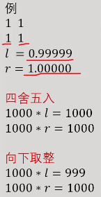

[A07 分数规划 二分法_哔哩哔哩_bilibili](https://www.bilibili.com/video/BV1N14y1w7us/?spm_id_from=333.999.0.0)


# 分数规划

## 分数规划


用途：求分数的最值。
问题：每种物品有两个权值$a_{i}$和$b_{i} $
选出若干个物品使得$\frac{\sum a{i}}{\sum b_{i}}$最大/最小。
等价：给出$a_{i}$ 和 $b_{i},$ 求一组$w_{i}\in\{0,1\}$,
最大化或最小化$\frac{\sum w_{i}\cdot a_{i}}{\sum w_{i}\cdot b_{i}}$。
若干个物品:满足给定约束条件的物品。

## 二分法


最大化：二分一个答案x，
$\frac{\sum w_i \cdot a_i}{\sum w_i \cdot b_i} \geq x$
$\sum w_i \cdot a_i - x \sum w_i \cdot b_i \geq 0$
$\sum w_i \cdot (a_i - xb_i) \geq 0$
如果和式≥0，说明x是可行的，否则不可行。


最小化：二分一个答案x，
$\frac{\sum w_i \cdot a_i}{\sum w_i \cdot b_i} \leq x$
$\sum w_i \cdot (a_i - xb_i) \leq 0$
如果和式≤0，说明x是可行的，否则不可行。


解题思路

1. 明确ai, bi是什么，把$ai − xb_i$作为新权值求和

2. 明确约束条件是什么，选择合适的算法求和


分数规划多和其他知识点结合考察。以下选举例题讲解

## 例题 #1 [USACO18OPEN] Talent Show G

Farmer John 要带着他的 $n$ 头奶牛，方便起见编号为 $1\ldots n$，到农业展览会上去，参加每年的达牛秀！他的第 $i$ 头奶牛重量为 $w_i$，才艺水平为 $t_i$，两者都是整数。

在到达时，Farmer John 就被今年达牛秀的新规则吓到了：

（一）参加比赛的一组奶牛必须总重量至少为 $W$（这是为了确保是强大的队伍在比赛，而不仅是强大的某头奶牛），并且。

（二）总才艺值与总重量的比值最大的一组获得胜利。

FJ 注意到他的所有奶牛的总重量不小于 $W$，所以他能够派出符合规则（一）的队伍。帮助他确定这样的队伍中能够达到的最佳的才艺与重量的比值。

输入格式

第一行是两个整数，分别表示牛的个数 $n$ 和总重量限制 $W$。

第 $2$ 到 $(n+1)$ 行，每行两个整数，第 $(i + 1)$ 行的整数表示第 $i$ 头奶牛的重量 $w_i$ 和才艺水平 $t_i$。

输出格式

请求出 Farmer 用一组总重量最少为 $W$ 的奶牛最大可能达到的总才艺值与总重量的比值。

如果你的答案是 $A$，输出 $1000A$ 向下取整的值，以使得输出是整数（当问题中的数不是一个整数的时候，向下取整操作在向下舍入到整数的时候去除所有小数部分）。

对于全部的测试点，保证 $1 \leq n \leq 250$，$1 \leq W \leq 1000$，$1 \leq w_i \leq 10^6$，$1 \leq t_i \leq 10^3$。

### Solu

本题多了分母至少为$W$的限制，无法使用上一题的贪心算法。可以考虑01背包。
二分一个答案$x$，把$w_i$作为第$i$个物品的重量，$t_i-xw_i$作为第$i$个物品的价值，那么$f[n][W]$就是最大值。
注意：$\sum w_i$可能超过$W$，此时直接视为$W$即可。
若$f[n][W]\ge 0$，就继续最大化$x$。

### 注意1:二分上下界

因为$1 \leq w_i \leq 10^6$，$1 \leq t_i \leq 10^3$,故 $t_i$ 最大取$1000$ ,$w_i$ 最小取$1$ ,得到二分上界$r=1000/1=1000$

### 注意2:r-l的精度

因为本题要求结果乘以1000向下取整,因此至少要精确到$10^{-4}$

### 注意3:sum函数返回r而不是l

这与题目要求有关.如果题目要求答案四舍五入,那么两个均可.但本题要求*1000后向下取整,就会出问题



因此统一返回 r 即可.精度越高越好,但考虑复杂度.乘以1000后取整,精度可以取$10^{-5}$

### Code

```C++
/*////////ACACACACACACAC///////////
Code By Ntsc
/*////////ACACACACACACAC///////////
#include<bits/stdc++.h>
using namespace std;
#define ll long long
const int N=1e3;

int n,k,W;
int m,f[N],ans;
double tt[N];
int t[N],w[N];
double sum(double x){
	for(int i=1;i<=W;i++)tt[i]=-1e9;
	for(int i=1;i<=n;i++){
		for(int j=W;j>=0;j--){//倒序枚举第2位，可以优化掉第2维（滚动数组）
			int k=min(W,j+w[i]);//若w[i]+j(即原有总重量+目前要加上的重量)超过W，我们也把它看作W
			tt[k]=max(tt[k],tt[j]+t[i]-x*w[i]);
		}
	}
	return tt[W];
}
signed main(){
	cin>>n>>W;
	for(int i=1;i<=n;i++)cin>>w[i]>>t[i];
	
	double l=0,r=1000,mid;
	while(r-l>=0.00001){
		mid=(l+r)/2;
		if(sum(mid)>=0)l=mid;
		else r=mid;
	}
	printf("%d",int(r*1000));
	return 0;
}

```

## 例题 #2 Dropping tests

给n组数据 $a_i$ ,$b_i$，定义累计平均值为：


现给出一个整数 $k$，要求从这 $n$ 个数中去掉 $k$ 个数后，最大累计平均值能有多大？(四舍五入到整数)

### Code

```C++
/*////////ACACACACACACAC///////////
Code By Ntsc
/*////////ACACACACACACAC///////////
#include<bits/stdc++.h>
using namespace std;
#define ll long long
const int N=1e5;

int n,k;
double m,b[N],ans,a[N],w[N];
double sum(double x){
	for(int i=1;i<=n;i++)w[i]=1.0*a[i]-x*b[i];
	sort(w+1,w+n+1);
	double tmp=0;
	for(int i=n;i>=k+1;i--){
		tmp+=w[i];
	}
//	for(int i=k+1;i<=n;i++){
//		tmp+=w[i];
//	}
	return tmp;
}
signed main(){
	while(1){
		cin>>n>>k;
		if(!n&&!k)return 0;
		for(int i=1;i<=n;i++)cin>>a[i];
		for(int i=1;i<=n;i++)cin>>b[i];
	
	
		double l=0,r=1,mid;
		while(r-l>0.0001){
			mid=(l+r)/2;
			if(sum(mid)>=0)l=mid;
			else r=mid;
		}
		printf("%.0lf\n",100*l);
	}
	return 0;
}

```

**注意**

1.循环别写错了

```C++
//	for(int i=n;i>=n-k;i--){
//		tmp+=w[i];
//	}
	for(int i=k+1;i<=n;i++){
		tmp+=w[i];
	}
```

2.由取值范围决定二分上下界

$0 ≤ ai ≤ bi ≤ 1, 000, 000, 000$，因为*$ a_i ≤ b_i$，*故和的最大值为*1*

## 例题 #3 Desert King


题意：给n个 (n≤10000) 位置的二维坐标(x,y)  和海拔 h ，定义两点通道长度为二维坐标的欧几里得距离，两点修通道的花费是两点的海拔之差，要求修n-1条水管形成一个**生成树**，使得通道总花费与通道总长度的比率最小。

这道题是经典的最优比率生成树问题

### solution

图中的文字是：
每条边有两个权值$aij（高度差）$和 $b_{ij} （距离）
$求一棵生成树T使得$\frac{\sum_{e \in T} a_e}{\sum_{e \in T} b_e}$最小
二分一个答案x，把$a_{ij}-xb_{ij}$作为每条边的权值，那么 最小生成树就是最小值。

### 补充知识：最小生成树

算法prim


### code


错误的代码`WA`

```C++
/*////////ACACACACACACAC///////////
       . Code by Ntsc .
       . Love by Liye .
/*////////ACACACACACACAC///////////

#include<bits/stdc++.h>
#define ll long long
#define db double
#define rtn return
using namespace std;

const int N=1e4+5;
const int M=1e5;
const int Mod=1e5;
const int INF=1e9;

int n,m,ans;
double a[N][N],b[N][N];//存高度差和水平距离 
int z[N],x[N],y[N],vis[N],d[N];

db getb(int u,int v){//计算距离(水平距离) 
	return sqrt(1.0*(x[u]-x[v])*(x[u]-x[v])+(y[u]-y[v])*(y[u]-y[v]));
}
int geta(int u,int v){
	return abs(z[u]-z[v]);
}
bool prim(db x){
	memset(vis ,0,sizeof vis);
	for(int i=0;i<=n;i++){
		d[i]=INF;
	}
	d[1]=0;
	db sum=0;
	for(int i=1;i<=n;i++){
		int t=0;
		for(int j=1;j<=n;j++){
			if(!vis[j]&&d[j]<d[t])t=j;	
		}
		sum+=d[t];vis[t]=1;
		for(int j=1;j<=n;j++)if(!vis[j]&&a[t][j]-x*b[t][j]<d[j])d[j]=a[t][j]-x*b[t][j];
	}
	return sum<=0;
}
db find(){
	db l=0,r=1e7,mid;
	while(l-r>1e-6){
		mid=(l+r)/2;
		if(prim(mid))r=mid;//可以更小 
		else l=mid;//不可以更小 
	}
	return r;
}
signed main(){
	while(1){
		cin>>n;
		if(!n)return 0;
		for(int i=1;i<=n;i++)cin>>x[i]>>y[i]>>z[i];
		for(int i=1;i<=n;i++){
			for(int j=1;j<=n;j++)a[i][j]=geta(i,j),b[i][j]=getb(i,j);
		}
		printf("%.3lf\n",find());
	}
	return 0;
}

```

## 例题 #4 [HNOI2009]最小圈

考虑带权的有向图$G=(V,E)$以及$w:E\rightarrow R$,每条边$e=(i,j)(i\neq j,i\in V,j\in V)$的权值定义为$w_{i,j}$，令$n=|V|$。$c=(c_1,c_2,\cdots,c_k)(c_i\in V)$是$G$中的一个圈当且仅当$(c_i,c_{i+1})(1\le i<k)$和$(c_k,c_1)$都在$E$中，这时称$k$为圈$c$的长度同时令$c_{k+1}=c_1$，并定义圈$c=(c_1,c_2,\cdots,c_k)$的平均值为$\mu(c)=\sum\limits_{i=1}^{k} w_{c_i,c_{i+1}}/k$，即$c$上所有边的权值的平均值。令$\mu'(c)=Min(\mu(c))$为$G$中所有圈$c$的平均值的最小值。现在的目标是：在给定了一个图$G=(V,E)$以及$w:E\rightarrow R$之后，请求出$G$中所有圈$c$的平均值的最小值$\mu'(c)=Min(\mu(c))$输入格式

第一行2个正整数，分别为$n$和$m$，并用一个空格隔开，只用$n=|V|,m=|E|$分别表示图中有$n$个点$m$条边。
接下来m行，每行3个数$i,j,w_{i,j}$，表示有一条边$(i,j)$且该边的权值为$w_{i,j}$。输入数据保证图$G=(V,E)$连通，存在圈且有一个点能到达其他所有点。

输出格式

请输出一个实数$\mu'(c)=Min(\mu(c))$，要求输出到小数点后8位。

对于100%的数据，$n\le 3000,m\le 10000,|w_{i,j}| \le 10^7$

### 题意

有向图中找圈。定义c为改圈的边权和/边数，在所有c中求出最小的那个c


每条边的的边权为$w_i$，求一个环 $C$ 使得$\frac{\sum_{i\in C}^{}w_i}{\sum_{i\in C}^{}1}$最小。
二分一个答案 $x$，把$w_i-x$ 作为边权，那么最小环就是最小值。判断最小值是否≤0，等同于判断图中是否存在负环。


### code `AC`

请注意边权请使用double存，包括 邻接表中 和`d[]`数组

```C++
/*////////ACACACACACACAC///////////
       . Code by Ntsc .
       . Love by Liye .
/*////////ACACACACACACAC///////////

#include<bits/stdc++.h>
#define ll long long
#define db double
#define rtn return
using namespace std;

const int N=1e4+5;
const int M=1e5;
const int Mod=1e5;
const int INF=1e9;

int n,m,ans;
double a[N][N],b[N][N];//存高度差和水平距离 
int x[N],y[N],vis[N];
db d[N];
int u,v;


struct edge{
	int v;
	db c;
	int nxt;
}e[N];
int h[N],idx;
void add(int a,int b,db w){
	e[++idx]={b,w,h[a]};
	h[a]=idx;
}
bool spfa(int u,db x){
	vis[u]=1;
	for(int i=h[u];i;i=e[i].nxt){
		int v=e[i].v;
		if(d[v]>d[u]+e[i].c-x){
			d[v]=d[u]+e[i].c-x;
			if(vis[v]||spfa(v,x))return 1;//vis[]为true表示走到了之前走过的点,说明有负环 spfa表示继续往下走 
		}
	}
	vis[u]=0;
	return 0;
}
bool check(db x){
	memset(d,0x3f,sizeof d);
	memset (vis,0,sizeof vis);
	for(int i=1;i<=n;i++){//不保证每个点都能到达其他所有点(原句"存在圈且有一个点能到达其他所有点",所以需要每个点都找一遍spfa 
		if(spfa(i,x))return 1;
	}
	return 0;
}
db find(){
	db l=-1e7,r=1e7,mid;
	while(r-l>1e-9){
		mid=(l+r)/2;
		if(check(mid))r=mid;
		else l=mid;
	}
	return r;
}
signed main(){
	cin>>n>>m;
	int u,v;
	db w;
	for(int i=1;i<=m;i++){
		cin>>u>>v>>w;
		add(u,v,w);
	}
	printf("%.8lf",find());
	return 0;
}

```

**复杂度分析**

> 你已经长大了，啥时候才能自己计算复杂度呀？

$O(nm\times log(1e16))$

nm就是一次check的复杂度，其中m是一次spfa的复杂度

log(1e17)是二分答案的复杂度（算法：对上下界的差除以精度所得的商进行log）

## 练习 #1 [USACO01OPEN] Earthquake

题目描述

一场地震把约翰家的牧场摧毁了， 坚强的约翰决心重建家园。 约翰已经重建了 $n$ 个牧场，现在他希望能修建一些道路把它们连接起来。研究地形之后，约翰发现可供修建的道路有 $m$ 条。碰巧的是，奶牛们最近也成立一个工程队，专门从事修复道路。而然，奶牛们很有经济头脑，如果无利可图，它们是不会干的。

奶牛们关注的是挣钱速度，即总利润和总施工时间的比值。约翰和奶牛达成了协议，奶牛负责修建道路，将所有牧场连通，而约翰需要支付 $f$ 元。每条道路都有自己的施工时间和建造成本。连接两个相同的牧场的道路可能有多条。保证所有的牧场必定是可连通的，不过也有可能一些道路的建造成本之和会超过 $f$。

请帮助奶牛们选择修复哪些道路，才能使单位时间的利润最大？

输入格式

第一行三个整数 $n,m,f$。

第二行到第 $m+1$ 行，第 $i+1$ 行表示第 $i$ 条道路的信息。每行有四个整数 $u_i,v_i,c_i,t_i$， $u_i$ 和 $v_i$ 表示这条道路连接的牧场编号，$c_i$ 表示修建道路的成本，$t_i$ 表示道路修建所需要的时间。

输出格式

第一行，一个保留四位小数的浮点数，表示奶牛们能挣到的最大单位时间利润，如果奶牛们无钱可赚，则输出`0.0000`。

对于 $100\%$ 的数据，保证

- $1 \leq n \leq 400$，$1 \leq m \leq 10000$，$1 \leq f \leq 2 \times 10^9$。

- $1 \leq u_i,v_i \leq n$，$1 \leq c_i,t_i \leq 2 \times 10^9$。

---

求最大生成树，不过要使得$\frac{f-\sum c_i}{\sum t_i}$最大。

我们二分一个答案x，得到$\frac{f-\sum c_i}{\sum t_i}\ge x$

${f-\sum c_i}\ge x\times \sum t_i$

${f-\sum c_i}- x\times \sum t_i\ge0$

那么我们将$c_i+x\times t_i$作为新的边权，求最小生成树即可判断上式是否可以成立了。

```C++
/*                                                                                
                      Keyblinds Guide
     				###################
      @Ntsc 2024

      - Ctrl+Alt+G then P : Enter luogu problem details
      - Ctrl+Alt+B : Run all cases in CPH
      - ctrl+D : choose this and dump to the next
      - ctrl+Shift+L : choose all like this
      - ctrl+K then ctrl+W: close all
      - Alt+la/ra : move mouse to pre/nxt pos'
	  
*/
#include <bits/stdc++.h>
#include <queue>
using namespace std;

#define rep(i, l, r) for (int i = l, END##i = r; i <= END##i; ++i)
#define per(i, r, l) for (int i = r, END##i = l; i >= END##i; --i)
#define pb push_back
#define mp make_pair
#define int long long
#define ull unsigned long long
#define pii pair<int, int>
#define ps second
#define pf first

// #define innt int
#define itn int
// #define inr intw
// #define mian main
// #define iont int

#define rd read()
int read(){
    int xx = 0, ff = 1;
    char ch = getchar();
    while (ch < '0' || ch > '9') {
		if (ch == '-')
			ff = -1;
		ch = getchar();
    }
    while (ch >= '0' && ch <= '9')
      xx = xx * 10 + (ch - '0'), ch = getchar();
    return xx * ff;
}
void write(int out) {
	if (out < 0)
		putchar('-'), out = -out;
	if (out > 9)
		write(out / 10);
	putchar(out % 10 + '0');
}

#define ell dbg('\n')
const char el='\n';
const bool enable_dbg = 1;
template <typename T,typename... Args>
void dbg(T s,Args... args) {
	if constexpr (enable_dbg){
    cerr << s;
    if(1)cerr<<' ';
		if constexpr (sizeof...(Args))
			dbg(args...);
	}
}

#define zerol = 1
#ifdef zerol
#define cdbg(x...) do { cerr << #x << " -> "; err(x); } while (0)
void err() { cerr << endl; }
template<template<typename...> class T, typename t, typename... A>
void err(T<t> a, A... x) { for (auto v: a) cerr << v << ' '; err(x...); }
template<typename T, typename... A>
void err(T a, A... x) { cerr << a << ' '; err(x...); }
#else
#define dbg(...)
#endif


const int N = 5e4 + 5;
const int INF = 1e9;
const int M = 200;
const int MOD = 1e9 + 7;
 const double eps=1e-6;


struct node{
    int a,b;
    double c,t;
}e[N];


double x;
int n,m;

int fa[N];

int find(int x){
    if(fa[x]==x)return x;
    return fa[x]=find(fa[x]);
}


bool cmp(node a,node b){
    return a.c+x*a.t<b.c+x*b.t;
}


double kruskal(){
    double ans=0;
    for(int i=1;i<=n;i++)fa[i]=i;
    sort(e+1,e+m+1,cmp);

    for(int i=1;i<=m;i++){
        int a=e[i].a,b=e[i].b;
        int faa=find(a),fbb=find(b);
        if(faa==fbb)continue;

        fa[faa]=fbb;
        ans+=e[i].c+x*e[i].t;
    }

    return ans;
}

void solve(){
     n=rd,m=rd;
    int f=rd;

    for(int i=1;i<=m;i++){
        e[i]={rd,rd,rd,rd};
    }

    double l=0,r=INF;double res=0;
    while(l<=r){
        double mid=(l+r)/2;
        x=mid;

        // cdbg(x,kruskal());
        if(1.*f-kruskal()>=0)res=mid,l=mid+eps;
        else r=mid-eps;
    }


    printf("%.4lf",res);
};


signed main() {
//     freopen("P2619_3.in","r",stdin);
    // freopen("center.out","w",stdout);

    int T=1;
    while(T--){
    	solve();
    }
    return 0;
}
```

## 练习 #2 [USACO07DEC] Sightseeing Cows G

给你一张 $n$ 点 $m$ 边的有向图，第 $i$ 个点点权为 $F_i$，第 $i$ 条边边权为 $T_i$。

找一个环，设环上的点组成的集合为 $S$，环的边组成的集合为 $E$，最大化 $\dfrac{\sum_{u\in S}F_u}{\sum_{e\in E}T_e}$。

数据范围：$1\leq n,F_i,T_i\leq 10^3$，$1\leq m\leq 5\times10^3$。

---

看到分数形式，我们就想到了分数规划。所以我们二分一个x，考虑判定

$\dfrac{\sum_{u\in S}F_u}{\sum_{e\in E}T_e}≥x$

$\sum_{u\in S}F_u≥x\times \sum_{e\in E}T_e$

$0≥x\times \sum_{e\in E}T_e-\sum_{u\in S}F_u$

于是我们就是要在这个有点权又有边权的图上找到一个负环。

拿spfa跑即可。

注意是有向图。

```C++
/*                                                                                
                      Keyblinds Guide
     				###################
      @Ntsc 2024

      - Ctrl+Alt+G then P : Enter luogu problem details
      - Ctrl+Alt+B : Run all cases in CPH
      - ctrl+D : choose this and dump to the next
      - ctrl+Shift+L : choose all like this
      - ctrl+K then ctrl+W: close all
      - Alt+la/ra : move mouse to pre/nxt pos'
	  
*/
#include <bits/stdc++.h>
#include <queue>
using namespace std;

#define rep(i, l, r) for (int i = l, END##i = r; i <= END##i; ++i)
#define per(i, r, l) for (int i = r, END##i = l; i >= END##i; --i)
#define pb push_back
#define mp make_pair
#define int long long
#define ull unsigned long long
#define pii pair<int, int>
#define ps second
#define pf first

// #define innt int
#define itn int
// #define inr intw
// #define mian main
// #define iont int

#define rd read()
int read(){
    int xx = 0, ff = 1;
    char ch = getchar();
    while (ch < '0' || ch > '9') {
		if (ch == '-')
			ff = -1;
		ch = getchar();
    }
    while (ch >= '0' && ch <= '9')
      xx = xx * 10 + (ch - '0'), ch = getchar();
    return xx * ff;
}
void write(int out) {
	if (out < 0)
		putchar('-'), out = -out;
	if (out > 9)
		write(out / 10);
	putchar(out % 10 + '0');
}

#define ell dbg('\n')
const char el='\n';
const bool enable_dbg = 1;
template <typename T,typename... Args>
void dbg(T s,Args... args) {
	if constexpr (enable_dbg){
    cerr << s;
    if(1)cerr<<' ';
		if constexpr (sizeof...(Args))
			dbg(args...);
	}
}

#define zerol = 1
#ifdef zerol
#define cdbg(x...) do { cerr << #x << " -> "; err(x); } while (0)
void err() { cerr << endl; }
template<template<typename...> class T, typename t, typename... A>
void err(T<t> a, A... x) { for (auto v: a) cerr << v << ' '; err(x...); }
template<typename T, typename... A>
void err(T a, A... x) { cerr << a << ' '; err(x...); }
#else
#define dbg(...)
#endif


const int N = 1e6 + 5;
const int INF = 1e9;
const int M = 200;
const int MOD = 1e9 + 7;
 const double eps=1e-4;

double X;
struct node{
    int v;
    double w;
};
itn n,m;
double d[N];
double f[N];
int cnt[N];
vector<node> e[N];
bitset <N> vis;

queue<int> q;

bool spfa(){
    for(int i=1;i<=n;i++){
        cnt[i]=0;
        d[i]=INF;
    }
    vis.reset();

    q.push(1);
    d[1]=-f[1];
    while(q.size()){
        int x=q.front();
        q.pop();

        vis[x]=0;
        for(auto v:e[x]){
            if(d[v.v]>d[x]+v.w*X-f[v.v]){
                d[v.v]=d[x]+v.w*X-f[v.v];
                cnt[v.v]++;
                if(cnt[v.v]>=n)return 1;
                if(!vis[v.v]){
                    vis[v.v]=1;
                    q.push(v.v);
                }
            }          
        }
    }
    return 0;
}


void add(itn a,int b,int c){
    e[a].pb({b,c});
    // e[b].pb({a,c});
}

void solve(){
     n=rd,m=rd;
    for(int i=1;i<=n;i++)f[i]=rd;
    for(int i=1;i<=m;i++){
        int a=rd,b=rd,c=rd;
        add(a,b,c);
    }

    double l=0,r=INF;
    double  res=0;
    while(l<=r){cdbg(l,r,spfa());
        double mid=(l+r)/2;
        X=mid;
        if(spfa())res=mid,l=mid+eps;
        else r=mid-eps;
    }


    printf("%.2lf",res);
}

signed main() {
//     freopen("P2619_3.in","r",stdin);
    // freopen("center.out","w",stdout);

    int T=1;
    while(T--){
    	solve();
    }
    return 0;
}
```

## 分数规划&依赖背包

参考[练习 | 这人怎么天天刷题啊（old）](https://flowus.cn/e6cc57e3-3431-4413-8119-dd11aefcc3c0)[JSOI2016] 最佳团体

[www.luogu.com.cn](https://www.luogu.com.cn/problem/P4322)


