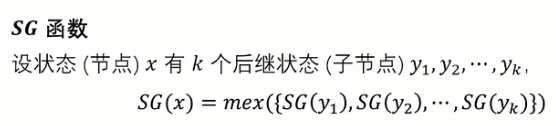

专题 | 博弈论&SG函数

# 目录

- 威佐夫博弈

- Nim游戏

- SG函数

- 摩尔投票法

# 威佐夫博弈

[www.luogu.com.cn](https://www.luogu.com.cn/problem/P2252)

## 题目描述

有两堆石子，数量任意，可以不同。游戏开始由两个人轮流取石子。游戏规定，每次有两种不同的取法

- 一是可以在任意的一堆中取走任意多的石子；

- 二是可以在两堆中同时取走相同数量的石子。

最后把石子全部取完者为胜者。现在给出初始的两堆石子的数目，你先取，假设双方都采取最好的策略，问最后你是胜者还是败者。


首先我们规定: 后手必胜态被称为奇异局势，结论是，如果这是一个奇异局势，那么第一个数是两数差值乘大黄金比（$\frac{\sqrt5 +1}{2}$）下取整。

**证明**

未知

```C++
signed main(){
	cin>>a>>b;
	if(a>b)swap(a,b);
	double f= 1.00*(sqrt(5)+1)/2;
	int c=b-a;
	if(a==(int)(1.00*f*c))cout<<0<<endl;
	else cout<<1<<endl;
	
	return 0;
}
```

# Nim游戏


### 定理1

一定可以从一个必胜态制造处一个必败态留给对手


很显然，如果第k位为1的数有偶数个，那么异或和为0

将7或者5或者11或者12进行^$s$，即可

因为原来$a_1$^$a_2$^...^$a_n$$=$$s$, 异或满足交换律，将任意一个^s后，原式变为$a_1$^$a_2$^...^$a_n$^$s=s^s=0$

**合法性验证**

因为异或后$a_i$**最高位的1变成了0**，最高位前的不会变（还是0），后面的无论怎么变都不会大于原数，故 $a_i$^$s<a_i$，因此是合法的（但是对11进行此操作是不合法的，但因为满足交换律，所以判定时无所谓，但在要求输出方案时要注意不可取（如下扩展））

### 定理2

解释：即必败态无论怎么取留给对手的都是必胜态，仅在当前一轮

## code

```C++
/*////////ACACACACACACAC///////////
Code By Ntsc
/*////////ACACACACACACAC///////////
#include<bits/stdc++.h>
using namespace std;
#define ll long long
const int N=1e5;

signed main(){
	int t,n,x;
	cin>>t;
	while(t--){
		int s=0;
		cin>>n;
		for(int i=1;i<=n;i++){
			cin>>x;s^=x;
		}
		if(s)cout<<"Yes"<<endl;
		else cout<<"No"<<endl;
	} 
	return 0;
}
```

## 扩展  要求输出方案

[www.luogu.com.cn](https://www.luogu.com.cn/problem/P1247)

```C++
/*////////ACACACACACACAC///////////
Code By Ntsc
/*////////ACACACACACACAC///////////
#include<bits/stdc++.h>
using namespace std;
#define int long long
const int N=5e5+5;
int t,n,x[N],s=0;
signed main(){

	cin>>n;
	for(int i=1;i<=n;i++){
		cin>>x[i];s^=x[i];
	}
	if(!s){
		cout<<"lose"<<endl;return 0;
	}
	else {
		for(int i=1;i<=n;i++){//按题目要求字典序查找
			if((x[i]^s)<x[i]){//如果异或后比原来小，就可行
				printf("%d %d\n",x[i]-(x[i]^s),i);
				x[i]=x[i]^s;break;//修改这一堆，break
			}
		}
	
	}
	for(int i=1;i<=n;i++)cout<<x[i]<<' ';//输出取第一次后所有堆的情况
	return 0;
}

```

# 台阶 Nim

# SG函数


[b23.tv](https://b23.tv/1EhMtYO)

### 适用范围


### 运算定义


### 函数定义



对于某个节点,若其SG为0,则该点的玩家必败.反正必胜

### 练习

我们来进行以下对SG函数的求解练习


图中绿色数字即该点的SG值，请注意，图2的根节点1的SG值为0.请结合定义思考。

### 状态


让我们结合图2进行具体分析：

先手为A，对方为B

当A将棋子从1→2/7/6时，SG(1)=0,说明其为必败.到达2/6/7后,我们会发现其因为对1的所有出点进行mex操作后得到SG(1)=0,说明1的所有出点中没有0,即A留给B的都是必胜态.

因为A,B均会采取最优走法,所以在先手确定时,胜负就已经定了,每次A→B或者B→A都是一次必胜态和必败态之间的转化.

根据SG函数性质,可以发现一个必胜态后一定有一个必败态,这样必胜态的玩家就可以选择走让对手必败的那条路径.必胜态的玩家必胜.反之,一个必败态后面均是必胜态,那么必败态的玩家无法让对手必败.必败态的玩家必败

因此在起点,就可以知道先手的胜败


对于多个有向图组成的组合游戏,如图,根据定理得先手必胜.因为先手一定可以找到一个走法,让场上3颗棋子的所在位置的SG异或和=0,给对手一个必败态.接下来无论对手怎么走,都会留下一个必胜态给先手


### 整理总结


### 实现方法 STL_Set

定义的代码如下：

```C++
set<int> a; // 定义一个int类型的集合a
// set<int> a(10); // error，未定义这种构造函数
// set<int> a(10, 1); // error，未定义这种构造函数
set<int> b(a); // 定义并用集合a初始化集合b
set<int> b(a.begin(), a.end()); // 将集合a中的所有元素作为集合b的初始值
```


除此之外，还可以直接使用数组来初始化向量：

```C++
int n[] = { 1, 2, 3, 4, 5 };
list<int> a(n, n + 5); // 将数组n的前5个元素作为集合a的初值
```

- 容器大小：`st.size();`

- 容器最大容量：`st.max_size();`

- 容器判空：`st.empty();`

- 查找键 key 的元素个数：`st.count(key);`

[[C++ STL] set使用详解 - fengMisaka - 博客园](https://www.cnblogs.com/linuxAndMcu/p/10261014.html)

### 例题


例题简单,直接快照


注:每个节点的子节点都是这个节点取了 $a_i$ 个石子后剩下的石子数量


回顾下普通Nim游戏


### 例题2


算法


$mex$的第一个部分即按行剪的结果,第2部分即按列剪的结果

因为$SG$定理要求最终(叶子节点)是必败态,因此要注意边界

因为最终的叶子节点的剩余纸片长宽 $≥2$ ,因此$mex$中 $2≤i$ 


有2个$2,4$?

因为每个节点存的是当前剩余纸片的长宽,因此当在第$2,3$行之间裁开和在第$3,4$行之间裁开都会各有一个$2,4$,同理也各有一个$3,4$

每进行一次操作,都会分裂出2个子节点(小纸片),对于一个纸片,可以有0个或n个操作方法

# 摩尔投票法

O(n)时间复杂度，O(常数)空间复杂度求出序列中个数超过序列长度一半的数的个数

# 总结


