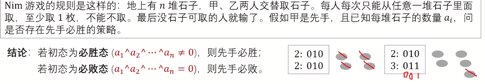
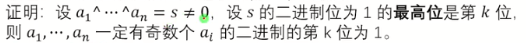

# Nim游戏




### 定理1

一定可以从一个必胜态制造处一个必败态留给对手




很显然，如果第k位为1的数有偶数个，那么异或和为0

将7或者5或者11或者12进行^$s$，即可

因为原来$a_1$^$a_2$^...^$a_n$$=$$s$, 异或满足交换律，将任意一个^s后，原式变为$a_1$^$a_2$^...^$a_n$^$s=s^s=0$

**合法性验证**

因为异或后$a_i$**最高位的1变成了0**，最高位前的不会变（还是0），后面的无论怎么变都不会大于原数，故 $a_i$^$s<a_i$，因此是合法的（但是对11进行此操作是不合法的，但因为满足交换律，所以判定时无所谓，但在要求输出方案时要注意不可取（如下扩展））

### 定理2

解释：即必败态无论怎么取留给对手的都是必胜态，仅在当前一轮

## code

```C++
/*////////ACACACACACACAC///////////
Code By Ntsc
/*////////ACACACACACACAC///////////
#include<bits/stdc++.h>
using namespace std;
#define ll long long
const int N=1e5;

signed main(){
	int t,n,x;
	cin>>t;
	while(t--){
		int s=0;
		cin>>n;
		for(int i=1;i<=n;i++){
			cin>>x;s^=x;
		}
		if(s)cout<<"Yes"<<endl;
		else cout<<"No"<<endl;
	} 
	return 0;
}
```

## 扩展  要求输出方案

[www.luogu.com.cn](https://www.luogu.com.cn/problem/P1247)

```C++
/*////////ACACACACACACAC///////////
Code By Ntsc
/*////////ACACACACACACAC///////////
#include<bits/stdc++.h>
using namespace std;
#define int long long
const int N=5e5+5;
int t,n,x[N],s=0;
signed main(){

	cin>>n;
	for(int i=1;i<=n;i++){
		cin>>x[i];s^=x[i];
	}
	if(!s){
		cout<<"lose"<<endl;return 0;
	}
	else {
		for(int i=1;i<=n;i++){//按题目要求字典序查找
			if((x[i]^s)<x[i]){//如果异或后比原来小，就可行
				printf("%d %d\n",x[i]-(x[i]^s),i);
				x[i]=x[i]^s;break;//修改这一堆，break
			}
		}
	
	}
	for(int i=1;i<=n;i++)cout<<x[i]<<' ';//输出取第一次后所有堆的情况
	return 0;
}

```

# 台阶 Nim

