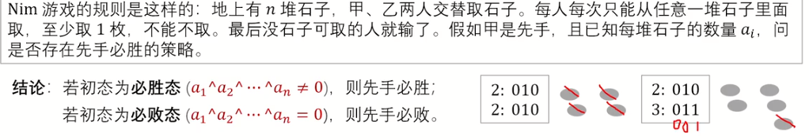

# SG函数

## SG函数


[b23.tv](https://b23.tv/1EhMtYO)

### 适用范围


**有向图游戏**
给定一个有向无环图，图中只有一个起点，在起点上放一个棋子，两个玩家轮流沿着有向边推动棋子，每次走一步，不能走的玩家失败。


### 运算定义


mex运算（minimum exlusion）
$mex(S)$为不属于集合$S$中的最小非负整数， $mex(S)=min\{x|x\in N,x\notin S\}$ 例如，$mex(\{0,1,2\})=3，mex(\{1,2\})=0$


### 函数定义


SG函数
设状态（节点）x有k个后继状态（子节点）$y_1,y_2,...,y_k,\\$
$SG(x)=mex(\{SG(y_1),SG(y_2),...,SG(y_k)\})$

对于某个节点,若其SG为0,则该点的玩家必败.反正必胜

### 练习

我们来进行以下对SG函数的求解练习


图中绿色数字即该点的SG值，请注意，图2的根节点1的SG值为0.请结合定义思考。

### 状态

SG定理：
由n个有向图游戏组成的组合游戏，设起点分别为$s_{1}$，$s_{2}$，…… ，$s_{n}$。
当$SG(s_{1})\oplus SG(s_{2})\oplus … \oplus SG(s_{n})\neq 0$时，先手必胜；反之，先手必败。


让我们结合图2进行具体分析：

先手为A，对方为B

当A将棋子从1→2/7/6时，SG(1)=0,说明其为必败.到达2/6/7后,我们会发现其因为对1的所有出点进行mex操作后得到SG(1)=0,说明1的所有出点中没有0,即A留给B的都是必胜态.

因为A,B均会采取最优走法,所以在先手确定时,胜负就已经定了,每次A→B或者B→A都是一次必胜态和必败态之间的转化.

根据SG函数性质,可以发现一个必胜态后一定有一个必败态,这样必胜态的玩家就可以选择走让对手必败的那条路径.必胜态的玩家必胜.反之,一个必败态后面均是必胜态,那么必败态的玩家无法让对手必败.必败态的玩家必败

因此在起点,就可以知道先手的胜败


对于多个有向图组成的组合游戏,如图,根据定理得先手必胜.因为先手一定可以找到一个走法,让场上3颗棋子的所在位置的SG异或和=0,给对手一个必败态.接下来无论对手怎么走,都会留下一个必胜态给先手


### 整理总结

1. 必胜态的后继状态至少存在一个必败态

2. 必败态的后继状态均为必胜态

3. 终态$0\oplus0...\oplus0=0$


### 实现方法 STL_Set

定义的代码如下：

```C++
set<int> a; // 定义一个int类型的集合a
// set<int> a(10); // error，未定义这种构造函数
// set<int> a(10, 1); // error，未定义这种构造函数
set<int> b(a); // 定义并用集合a初始化集合b
set<int> b(a.begin(), a.end()); // 将集合a中的所有元素作为集合b的初始值
```


除此之外，还可以直接使用数组来初始化向量：

```C++
int n[] = { 1, 2, 3, 4, 5 };
list<int> a(n, n + 5); // 将数组n的前5个元素作为集合a的初值
```

- 容器大小：`st.size();`

- 容器最大容量：`st.max_size();`

- 容器判空：`st.empty();`

- 查找键 key 的元素个数：`st.count(key);`

[[C++ STL] set使用详解 - fengMisaka - 博客园](https://www.cnblogs.com/linuxAndMcu/p/10261014.html)

## 例题 #1


例题简单,直接快照


注:每个节点的子节点都是这个节点取了 $a_i$ 个石子后剩下的石子数量


回顾下普通Nim游戏



## 例题 #2 Cutting Game

**【题目描述】**

Urej 喜欢玩各种类型的沉闷游戏。他通常会邀请其他人和他一起玩。他说，玩这些游戏可以展现他的非凡智慧。最近，Urej 对一个新游戏产生了极大兴趣，而 Erif Nezorf 成为了牺牲品。为了摆脱玩这样一个沉闷游戏的痛苦，Erif Nezorf 请求你的帮助。这个游戏使用一个由 $W \times H$ 格网组成的矩形纸张。两名玩家轮流将纸张切割成两个矩形部分。在每个回合中，玩家可以横向或纵向切割，保持每个格网完整。经过 $N$ 轮后，纸张将被切割成 $N+1$ 片，然后在后续的回合中，玩家可以选择任意一片进行切割。如果一名玩家切割出一个只有一个格网的纸片，他就赢得了游戏。如果这两个人都非常清楚，你应该写一个问题来告诉是否先手的玩家能赢得游戏。

**【输入格式】**

输入包含多个测试用例。每个测试用例在一行中只包含两个整数 $W$ 和 $H (2 \le W , H \le 200)$，分别表示原始纸张的宽度和高度。

**【输出格式】**

对于每个测试用例，应该只输出一行。如果先手的玩家能赢得游戏，则输出 "WIN"，否则输出 "LOSE"。

翻译来自于：[ChatGPT](https://chatgpt.com/)

---

算法


$mex$的第一个部分即按行剪的结果,第2部分即按列剪的结果

因为$SG$定理要求最终(叶子节点)是必败态,因此要注意边界

因为最终的叶子节点的剩余纸片长宽 $≥2$ ,因此$mex$中 $2≤i$ 


有2个$2,4$?

因为每个节点存的是当前剩余纸片的长宽,因此当在第$2,3$行之间裁开和在第$3,4$行之间裁开都会各有一个$2,4$,同理也各有一个$3,4$

每进行一次操作,都会分裂出2个子节点(小纸片),对于一个纸片,可以有0个或n个操作方法

```C++
/*                                                                                
                      Keyblinds Guide
     				###################
      @Ntsc 2024

      - Ctrl+Alt+G then P : Enter luogu problem details
      - Ctrl+Alt+B : Run all cases in CPH
      - ctrl+D : choose this and dump to the next
      - ctrl+Shift+L : choose all like this
      - ctrl+K then ctrl+W: close all
      - Alt+la/ra : move mouse to pre/nxt pos'
	  
*/
#include <bits/stdc++.h>
#include <queue>
using namespace std;

#define rep(i, l, r) for (int i = l, END##i = r; i <= END##i; ++i)
#define per(i, r, l) for (int i = r, END##i = l; i >= END##i; --i)
#define pb push_back
#define mp make_pair
#define int long long
#define ull unsigned long long
#define pii pair<int, int>
#define ps second
#define pf first

// #define innt int
#define itn int
// #define inr intw
// #define mian main
// #define iont int

#define rd read()
int read(){
    int xx = 0, ff = 1;
    char ch = getchar();
    while (ch < '0' || ch > '9') {
		if (ch == '-')
			ff = -1;
		ch = getchar();
    }
    while (ch >= '0' && ch <= '9')
      xx = xx * 10 + (ch - '0'), ch = getchar();
    return xx * ff;
}
void write(int out) {
	if (out < 0)
		putchar('-'), out = -out;
	if (out > 9)
		write(out / 10);
	putchar(out % 10 + '0');
}

#define ell dbg('\n')
const char el='\n';
const bool enable_dbg = 1;
template <typename T,typename... Args>
void dbg(T s,Args... args) {
	if constexpr (enable_dbg){
    cerr << s;
    if(1)cerr<<' ';
		if constexpr (sizeof...(Args))
			dbg(args...);
	}
}

#define zerol = 1
#ifdef zerol
#define cdbg(x...) do { cerr << #x << " -> "; err(x); } while (0)
void err() { cerr << endl; }
template<template<typename...> class T, typename t, typename... A>
void err(T<t> a, A... x) { for (auto v: a) cerr << v << ' '; err(x...); }
template<typename T, typename... A>
void err(T a, A... x) { cerr << a << ' '; err(x...); }
#else
#define dbg(...)
#endif


const int N = 3e5 + 5;
const int INF = 1e18;
const int M = 1e7;
const int MOD = 1e9 + 7;

itn sg[222][222];

// int f[222];

int SG(int n,int m){
    if(sg[n][m]!=-1)return sg[n][m];

    itn f[222]={};
    for(int i=2;i<n-1;i++){
        f[SG(i,m)^SG(n-i,m)]=1;
    }

    for(int i=2;i<m-1;i++){
        f[SG(n,i)^SG(n,m-i)]=1;
    }


    for(itn i=0;i<=200;i++){
        if(!f[i]){
            memset(f,0,sizeof f);
            return sg[n][m]=i;
        }
    }
}

void solve(){
    memset(sg,-1,sizeof sg);
    itn n,m;
    while(scanf("%lld%lld",&n,&m)!=EOF){
        itn res=SG(n,m);
        if(res)puts("WIN");
        else puts("LOSE");
    }
    
}

signed main() {
    // freopen(".in","r",stdin);
    // freopen(".in","w",stdout);

    int T=1;
    while(T--){
    	solve();
    }
    return 0;
}
```

## 例题 #3 Not a Nim Problem

有 $n$ 堆石子，每堆有 $a_i$ 个。

Alice 和 Bob 轮流取石子。Alice 先手。每个人在当前回合下可以随意选择一堆石子取任意数量个，要求：

- 设选择的这堆石子有 $x$，取走 $y$ 个，则必须使 $x$ 与 $y$ **不**互质。

第一个不能操作的人输掉这场游戏。在两人都使用最优策略的前提下，求获胜者。

输入格式

第一行一个正整数 $t(1 \leq t \leq 10^4)$ 表示测试数据组数。

每一组测试数据中：

- 第一行输入一个正整数 $n(1 \leq n \leq 3 \times 10^5)$。

- 第二行输入 $n$ 个正整数 $a_i(1 \leq a_i \leq 10^7)$。

保证单测试点内所有测试数据下 $n$ 的总和不超过 $3 \times 10^5$。

输出格式

对于每一组测试数据，输出一行一个字符串 $\texttt{Alice}$ 或 $\texttt{Bob}$ 表示获胜者。

$\scriptsize \text{Written by McIron233.}$

---

构造SG函数。

```C++
#include<bits/stdc++.h>
using namespace std;


#define itn int

#define rd read()

inline int read(){
    int x;
    cin>>x;
    return x;
}

const int N=1e7+5;
const int INF=1e9;
/*
取石子
要求取的数量与 这堆石子数 互质
问alice先手 谁胜

即 谁先面对局面：石子全被取完
- 1:1
- 2:2
- 3:3 or 2
- 4:2 or 4 3
- 5:2 5 3 4 
.. 
in a word :
- 1:1
- i:[2,i]
*/

int ispri[N];
int pri[N];
int tot;
int a[N];

void init(){
    for(int i=2;i<N;i++){
        if(!ispri[i]){
            ispri[i]=i;
            pri[++tot]=i;
        }
        for(int j=1;j<=tot;j++){
            if(pri[j]*i>=N)break;
            ispri[i*pri[j]]=pri[j];
            if(i%pri[j]==0)break;
        }
    }
}


void solve(){
    int n=rd;
    for(int i=1;i<=n;i++){
        a[i]=rd;
    }

    int cnt=0;
    int res=0;

    for(int i=1;i<=n;i++){
        if(a[i]==0)continue;
        else if(a[i]==1){
            cnt^=1;            
        }else{
            res++;
        }
    }


    /*
    现在有a个合数，b个质数
    求谁胜
    */
    if(res&1);else cnt^=1;

    if(cnt){
        puts("Alice");
    }else{
        puts("Bob");
    }
    
    
}

signed main(){

    ios::sync_with_stdio(0);
    cin.tie(0);
    cout.tie(0);


    // init();
    int T=rd;
    while(T--){
        solve();
    }
    return 0;
}
```

