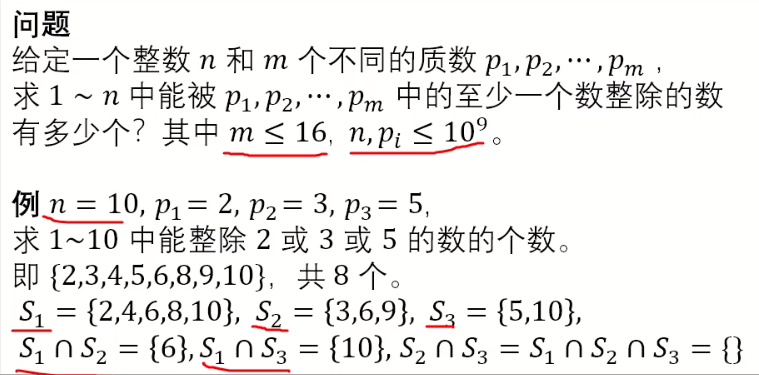

# 容斥原理


## 集合的并


将三个集合内容相加，去重



**注意1**


我们可以注意到以上特点，而不需要使用试除法

**注意2**


**代码**

```C++
hole
```


**重点**

重点理解

- `sign`的含义

- `if((LL)t*prim[j]>n)`的含义

- 位运算

复杂度 $ O(m\times 2^m)$

## 集合的交


**e.g.**


交集为{2,5}

注：绿框不是集合

**例题**

[547 容斥原理 集合的交_哔哩哔哩_bilibili](https://www.bilibili.com/video/BV1ZK41127tu/?spm_id_from=autoNext&vd_source=f45ea4e1e4b3b73d5f07c57b46c43aba)

[https://luogu.com.cn/problem/P1450](https://luogu.com.cn/problem/P1450)

