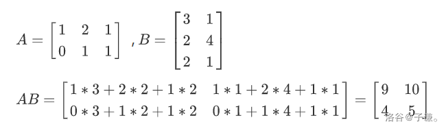
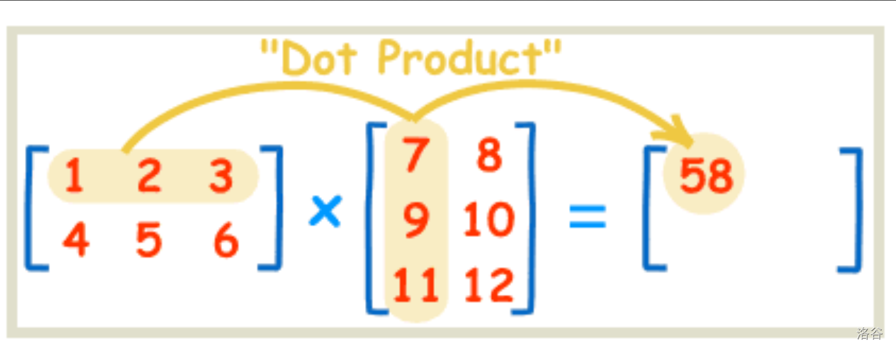
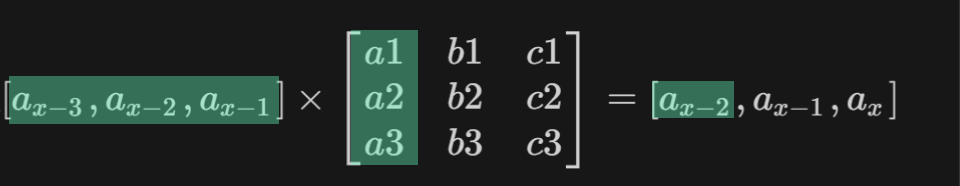

# 矩阵

## 矩阵的相关定义

矩阵运算是线性代数中的一个重要概念，涉及到矩阵的加法、减法、数乘、乘法、转置、逆矩阵等基本操作。以下是一些基本的矩阵运算法则：

1. **矩阵加法和减法**：

    - 两个相同大小的矩阵A和B相加，结果矩阵C的每个元素是A和B对应元素的和的矩阵。

    - 两个相同大小的矩阵A和B相减，结果矩阵C的每个元素是A和B对应元素的差的矩阵。

1. **矩阵数乘**：

    - 一个标量与一个矩阵相乘，结果矩阵的每个元素都是标量与矩阵对应元素的乘积。

1. **矩阵乘法**：

    - 矩阵A乘以矩阵B，要求A的列数等于B的行数。结果矩阵C的每个元素是A的列向量与B的行向量的标量积的和。

1. **矩阵转置**：

    - 矩阵A的转置矩阵记为A^T，是将A的行向量转换为列向量的矩阵。

1. **逆矩阵**：

    - 如果矩阵A是可逆的，那么存在一个矩阵A^-1，使得A乘以A^-1等于A^-1乘以A等于单位矩阵I。

1. **矩阵的幂**：

    - 矩阵A的幂是指A连乘自身多次，例如A^n，其中n是正整数。

1. **分块矩阵**：

    - 分块矩阵是将矩阵分成若干个子矩阵，每个子矩阵保持原来的次序和位置。

1. **列向量与矩阵的乘法**：

    - 列向量与矩阵相乘，结果是一个行向量，每个元素是列向量与矩阵对应列向量的标量积。

1. **行向量与矩阵的乘法**：

    - 行向量与矩阵相乘，结果是一个列向量，每个元素是行向量与矩阵对应行向量的标量积。

1. **矩阵的迹**：

    - 矩阵A的迹是指矩阵主对角线上的元素之和，记为tr(A)。

## 矩阵的加法与减法

矩阵的加法规则如下：

1. 只有当两个矩阵的行数和列数相同时，它们才能进行加法。

2. 相同位置的元素逐个相加。

3. 结果仍然是一个矩阵，其行数和列数与原始矩阵相同。

4. 加法满足交换律，即$A + B = B + A $。

5. 存在一个零矩阵$0$，使得对于任何矩阵A，都有$A + 0 = A $。

减法类似。

## 矩阵乘法



图片是引用的

## 矩阵快速幂

### 应用

通常我们会遇到一些“大模拟”题，这里的大指的是要模拟的步数很多，但是每一步并不复杂。并且通常情况下，模拟的操作都是一个数组上的值的变化。

我们可以把矩阵看作是“过程”，并且其满足乘法的性质（即连续进行两次“过程”的变化就相当于将因此变化的矩阵平方后的矩阵）。那么我们就可以将通过矩阵快速幂来快手求出很多次操作之后的“变化”，然后对原始数组应用变化即可。

### 实现

**原理**

因为矩阵满足交换律和结合律(自行搜索),所以矩阵快速幂和快速幂一样，只不过快速幂中的数乘（res*=a，a*=a变成了两个矩阵相乘）

**存矩阵**

我们使用结构体存,这样在传参时方便许多

```C++
struct node {
	int a[N][N];
	node() {
		memset(a,0,sizeof a); //一定要写！
	}
}c;
```

在清空结构体时可以使用

```C++
memset(c.a,0,sizeof c.a);
```

或者再结构体中手动写入

```C++
node() {
		memset(a,0,sizeof a); //一定要写！
	}
```

这样可以在创建结构体时自动清空.

**与快速幂的区别**

在快速幂中,我们有一个初始值,即`res=1`
在`ksm`函数中,我们不断`res=res*c%p;`更新`res`,得到结果

在矩阵快速幂中,我们的操作对象是一个矩阵,所以我们需要这么一个初始矩阵.

其实就是

```C++
for(int i=1; i<=n; i++)res.a[i][i]=1;
```

即

```C++
n=5时
1 0 0 0 0  
0 1 0 0 0  
0 0 1 0 0  
0 0 0 1 0  
0 0 0 0 1  
```

在快速幂中,我们的函数是

```C++
int ksm(int c,int k,int p) {	//c^k %p
	int res=1;
	...
	return res;
}
```

我们把`c`替换为需要被快速幂的矩阵,`res`初始化为初始矩阵,重载一下`*`运算符,就完工啦!(`c`,`res`请使用结构体类型)
或者写一个矩阵乘的函数(如代码2)

重定义运算符,顺便将取模放进去

```C++
struct node{
    int a[N][N];
}node c;

node operator *(const node &x,const node &y){     //重载运算符
    for(int k=1;k<=n;++k)
        for(int i=1;i<=n;++i)
            for(int j=1;j<=n;++j)
                z.a[i][j]=(z.a[i][j]+x.a[i][k]*y.a[k][j]%mod)%mod;
    return z;
}
```

代码:

```C++
#include<bits/stdc++.h>
using namespace std;
#define int long long
const int N=105,Mod=1e9+7;
int n,k;
struct node {
	int a[N][N];
	node(){
		memset(a,0,sizeof a); //一定要写！
	}
}c,res;


void ksm() {

	while(k) {
		if(k&1) {
			node x;
			for(int k=1; k<=n; k++)
				for(int i=1; i<=n; i++) {
					for(int j=1; j<=n; j++)x.a[i][j]=(x.a[i][j]+res.a[i][k]*c.a[k][j]%Mod)%Mod;
				}
			res=x;
		}
		{
			node x;
			for(int k=1; k<=n; k++)
				for(int i=1; i<=n; i++) {
					for(int j=1; j<=n; j++)x.a[i][j]=(x.a[i][j]+c.a[i][k]*c.a[k][j]%Mod)%Mod;
				}
			c=x;
		}
		k>>=1;
	}

}

signed main() {
	cin>>n>>k;
	for(int i=1; i<=n; i++)for(int j=1; j<=n; j++) {
			cin>>c.a[i][j];
		}

	for(int i=1; i<=n; i++)res.a[i][i]=1;
	ksm();

	for(int i=1; i<=n; i++) {
		for(int j=1; j<=n; j++)cout<<res.a[i][j]<<' ';
		cout<<'\n';
	}
	return 0;
}
```

写法2

```C++
#include<bits/stdc++.h>
using namespace std;
#define int long long
const int N=105,Mod=1e9+7;
int n,k;
struct node {
	int a[N][N];
	node() {
		memset(a,0,sizeof a); //一定要写！
	}
}c;

node f(node a,node b) {	//矩阵乘矩阵,返回矩阵.这个只能暴力,没有其他办法
	node x;
	for(int k=1; k<=n; k++)
		for(int i=1; i<=n; i++) {
			for(int j=1; j<=n; j++)x.a[i][j]=(x.a[i][j]+a.a[i][k]*b.a[k][j]%Mod)%Mod;
		}
	return x;
}
node ksm() {
	node res;
	for(int i=1; i<=n; i++)res.a[i][i]=1;
	while(k) {
		if(k&1) {
			res=f(res,c);
		}
		c=f(c,c);
		k>>=1;
	}
	return res;
}


signed main() {
	cin>>n>>k;
	for(int i=1; i<=n; i++)for(int j=1; j<=n; j++) {
			cin>>c.a[i][j];
		}

	
	node res=ksm();

	for(int i=1; i<=n; i++) {
		for(int j=1; j<=n; j++)cout<<res.a[i][j]<<' ';
		cout<<'\n';
	}
	return 0;
}

```

### 例题 #1 矩阵加速（数列）

题目描述

已知一个数列 $a$，它满足：

$a_x=
\begin{cases}
 1 & x \in\{1,2,3\}\\ 
 a_{x-1}+a_{x-3} & x \geq 4
\end{cases}$

求 $a$ 数列的第 $n$ 项对 $10^9+7$ 取余的值。

- 对于 $100\%$ 的数据 $1 \leq T \leq 100$，$1 \leq n \leq 2 \times 10^9$。

---

**步骤**

- 总结递推矩阵

这一步是最难的地方也是最不容易理解的地方。那么现在我们就来推导一下这个地方。

对于$a_x=a_{x-1}+a_{x-3}$

$[a_{x-3},a_{x-2},a_{x-1}]\times [?]=[a_{x-2},a_{x-1},a_{x}]$

现在我们要求出[?]就万事大吉了。那么结合矩阵的定义，我们先设$[?]=\begin{bmatrix}a1 & b1& c1 \\a2 & b2&c2 \\a3&b3&c3\end{bmatrix}$

那么$[a_{x-3},a_{x-2},a_{x-1}]\times \begin{bmatrix}a1 & b1& c1 \\a2 & b2&c2 \\a3&b3&c3\end{bmatrix}= [a_{x-2},a_{x-1},a_{x}]$

记住口诀：行同A，列同B




所以

$a_{x-2}=a_{x-3}a1+a_{x-2}a2+a_{x-1}a3$

$a_{x-1}=a_{x-3}b1+a_{x-2}b2+a_{x-1}b3$

$a_{x}=a_{x-3}c1+a_{x-2}c2+a_{x-1}c3$

那么现在结合题目，就很容易推出$[?]$是什么了。

$a_{x-2}=a_{x-3}(a1=0)+a_{x-2}(a2=1)+a_{x-1}(a3=0)$

$a_{x-1}=a_{x-3}(b1=0)+a_{x-2}(b2=0)+a_{x-1}(b3=1)$

$a_{x}=a_{x-3}(c1=1)+a_{x-2}(c2=0)+a_{x-1}(c3=1)$

所以！！$[?]=\begin{bmatrix}0 & 0& 1 \\1 & 0&0 \\0&1&1\end{bmatrix}$

注意这里与数组中的下标对应为$[?]=\begin{bmatrix}3,3 & 2,3& 1,3 \\3,2 & 2,2&1,2 \\3,1&2,1&1,1\end{bmatrix}$

为什么会这样呢？因为数组的第一维是行！所以我们应该写成

$\begin{bmatrix}a_{x-3}\\a_{x-2}\\a_{x-1}\end{bmatrix}\times \begin{bmatrix}0 & 1& 0 \\1 & 0&0 \\1&0&1\end{bmatrix}=\begin{bmatrix}a_{x-2}\\a_{x-1}\\a_{x}\end{bmatrix}$

这样就没问题了吧？嘿嘿。

- 应用矩阵结合律,将 $S\times A\times A\times ...$ 转化为 $S\times A^n$

- 使用矩阵快速幂

- 在运行得到的最后矩阵中找到需要的值,(特判),输出

代码

```C++
#include<bits/stdc++.h>
using namespace std;
#define int long long
const int N=105,Mod=1e9+7;
int n,k;
struct node {
	int a[5][5];
	node() {
		memset(a,0,sizeof a); //一定要写！
	}
};

node f(node a,node b) {
	node x;
	for(int k=1; k<=3; k++)
		for(int i=1; i<=3; i++) {
			for(int j=1; j<=3; j++)x.a[i][j]=(x.a[i][j]+a.a[i][k]*b.a[k][j]%Mod)%Mod;
		}
	return x;
}
node ksm() {
	node res,c;
	for(int i=1; i<=3; i++)res.a[i][i]=1;
	c.a[1][1]=c.a[1][3]=c.a[2][1]=c.a[3][2]=1;
	while(k) {
		if(k&1) {
			res=f(res,c);
		}
		c=f(c,c);
		k>>=1;
	}
	return res;
}

signed main() {
	int T;
	cin>>T;
	while(T--) {
		cin>>k;
		if(k<=3){
			cout<<1<<endl;
			continue;
		}
		node res;
		res=ksm();

		cout<<res.a[2][1]<<endl;
	}


	return 0;
}

```

注意:

从矩阵快速幂模板copy时,记得修改矩阵大小n,总结出递推矩阵

如本题的递推矩阵为

```C++
c.a[1][1]=c.a[1][3]=c.a[2][1]=c.a[3][2]=1;其余为0;
```

### 例题 #2 斐波那契数列

题目描述

大家都知道，斐波那契数列是满足如下性质的一个数列：

$F_n = \left\{\begin{aligned} 1 \space (n \le 2) \\ F_{n-1}+F_{n-2} \space (n\ge 3) \end{aligned}\right.$

请你求出 $F_n \bmod 10^9 + 7$ 的值。

输入格式

一行一个正整数 $n$

输出格式

输出一行一个整数表示答案。

【数据范围】
对于 $60\%$ 的数据，$1\le n \le 92$；
对于 $100\%$ 的数据，$1\le n < 2^{63}$。

思路

有了上面一道题的经历,这道题是不是步骤~~一模一样~~?

复制一份水一水字数捏~

- 总结递推矩阵

这一步是最难的地方也是最不容易理解的地方。那么现在我们就来推导一下这个地方。

对于$a_x=a_{x-1}+a_{x-2}$

$[a_{x-2},a_{x-1}]\times [?]=[a_{x-1},a_{x}]$

现在我们要求出[?]就万事大吉了。那么结合矩阵的定义，我们先设$[?]=\begin{bmatrix}a1 & b1 \\a2 & b2\end{bmatrix}$

那么$[a_{x-2},a_{x-1}]\times \begin{bmatrix}a1 & b1 \\a2 & b2\end{bmatrix}= [a_{x-1},a_{x}]$

记住口诀：行同A，列同B



所以

$a_{x-1}=a_{x-2}a1+a_{x-1}a2$

$a_{x}=a_{x-2}b1+a_{x-1}b2$

那么现在结合题目，就很容易推出$[?]$是什么了。

$a_{x-1}=a_{x-2}(a1=0)+a_{x-1}(a2=1)$

$a_{x}=a_{x-2}(b1=1)+a_{x-1}(b2=1)$

所以！！$[?]=\begin{bmatrix}0 & 1 \\1 & 1\end{bmatrix}$

注意这里与数组中的下标对应为$[?]=\begin{bmatrix}3,3 & 2,3& 1,3 \\3,2 & 2,2&1,2 \\3,1&2,1&1,1\end{bmatrix}$

为什么会这样呢？因为数组的第一维是行！所以我们应该写成

$\begin{bmatrix}a_{x-2}\\a_{x-1}\end{bmatrix}\times \begin{bmatrix}1& 0 \\1 & 1\end{bmatrix}=\begin{bmatrix}a_{x-1}\\a_{x}\end{bmatrix}$

这样就没问题了吧？嘿嘿。

代码

```C++
#include<bits/stdc++.h>
using namespace std;
#define int long long
const int N=105,MOD=1e9+7;
int n,k;
struct node {
	int a[5][5];
	node() {
		memset(a,0,sizeof a); //一定要写！
	}
};

node f(node a,node b) {
	node x;
	for(int k=1; k<=2; k++)
		for(int i=1; i<=2; i++) {
			for(int j=1; j<=2; j++)x.a[i][j]=(x.a[i][j]+a.a[i][k]*b.a[k][j]%MOD)%MOD;
		}
	return x;
}
node ksm() {
	node res,c;
	for(int i=1; i<=2; i++)res.a[i][i]=1;
	c.a[1][1]=c.a[1][2]=c.a[2][1]=1;
	while(k) {
		if(k&1) {
			res=f(res,c);
		}
		c=f(c,c);
		k>>=1;
	}
	return res;
}

signed main() {
	
	cin>>k;
	if(k<=2){
		cout<<1<<endl;
		return 0;
	}
	node res;
	res=ksm();
	cout<<res.a[2][1]<<endl;
	return 0;
}

```

### 练习 #1 斐波那契公约数

题目描述

对于 Fibonacci 数列：
$f_i = \begin{cases}
[i = 1]               & i \leq 1 \\
f_{i - 1} + f_{i - 2} & i \gt 1
\end{cases}$

请求出 $f_n$ 与 $f_m$ 的最大公约数，即 $\gcd(f_n, f_m)$。

- 对于 $100\%$ 的数据，保证 $1 \leq n, m \leq 10^9$。

---

重要结论：gcd(F[n],F[m])=F[gcd(n,m)]

推导：

[www.luogu.com.cn](https://www.luogu.com.cn/article/5hbyocxx)


代码

```C++
#include<bits/stdc++.h>
using namespace std;
#define int long long
const int N=105,MOD=1e8;
int n,K;
struct node {
	int a[5][5];
	node() {
		memset(a,0,sizeof a); //一定要写！
	}
};

node f(node a,node b) {
	node x;
	for(int K=1; K<=2; K++)
		for(int i=1; i<=2; i++) {
			for(int j=1; j<=2; j++)x.a[i][j]=(x.a[i][j]+a.a[i][K]*b.a[K][j]%MOD)%MOD;
		}
	return x;
}
node ksm() {
	node res,c;
	for(int i=1; i<=2; i++)res.a[i][i]=1;
	c.a[1][1]=c.a[1][2]=c.a[2][1]=1;
	while(K) {
		if(K&1) {
			res=f(res,c);
		}
		c=f(c,c);
		K>>=1;
	}
	return res;
}

signed main() {
	
	int n,m;
    cin>>n>>m;

    K=__gcd(n,m);
	if(K<=2){
		cout<<1<<endl;
		return 0;
	}
	node res;
	res=ksm();
	cout<<res.a[2][1]<<endl;
	return 0;
}

```

### 练习 #2 广义斐波那契（矩阵快速幂的通用递推式推导|对于有初始值及类斐波那契数列的变种）

[www.luogu.com.cn](https://www.luogu.com.cn/problem/P1349)


P1349 广义斐波那契数列

广义的斐波那契数列是指形如 $a_n=p\times a_{n-1}+q\times a_{n-2}$ 的数列。

今给定数列的两系数 $p$ 和 $q$，以及数列的最前两项 $a_1$ 和 $ a_2$，另给出两个整数 $n$ 和 $m$，试求数列的第 $n$ 项 $a_n$ 对 $m$ 取模后的结果。

输入包含一行六个整数，$p,q,a_1,a_2,n,m$。

输出包含一行一个整数表示答案。

【数据范围】
对于 $100\%$ 的数据，$p,q,a_1,a_2 \in [0,2^{31}-1]$，$1\le n,m \le 2^{31}-1$。

---

```C++
/*
Code by Ntsc_Hodaka
*/

#include <bits/stdc++.h>
using namespace std;
#define int long long
#define mp make_pair
#define pii pair<int, int>

///----///
#define rd read()
inline int read() {
  int xx = 0, ff = 1;
  char ch = getchar();
  while (ch < '0' || ch > '9') {
    if (ch == '-')
      ff = -1;
    ch = getchar();
  }
  while (ch >= '0' && ch <= '9')
    xx = xx * 10 + (ch - '0'), ch = getchar();
  return xx * ff;
}
inline void write(int out) {
  if (out < 0)
    putchar('-'), out = -out;
  if (out > 9)
    write(out / 10);
  putchar(out % 10 + '0');
}

///----///
const int N = 2e2 + 5;
const int M = 1e7 + 5;
const int INF = 1e12 + 5;
int MOD = 998244353;
const double eps = 1e-7;

int n, p, q, a1, a2;
struct node {
  int m[10][10];
} ans, base;
inline void init() {
  ans.m[1][1] = a2, ans.m[1][2] = a1;
  base.m[1][1] = p, base.m[2][1] = q, base.m[1][2] = 1;
}
inline node mul(node a, node b) {
  node res;
  memset(res.m, 0, sizeof(res.m));
  for (int i = 1; i <= 2; i++) {
    for (int j = 1; j <= 2; j++) {
      for (int k = 1; k <= 2; k++) {
        res.m[i][j] += (a.m[i][k] % MOD) * (b.m[k][j] % MOD);
        res.m[i][j] %= MOD;
      }
    }
  }
  return res;
}
inline void ksm(int p) {
  while (p) {
    if (p & 1)
      ans = mul(ans, base);
    base = mul(base, base);
    p >>= 1;
  }
}

signed main() {
  p = rd, q = rd, a1 = rd, a2 = rd, n = rd, MOD = rd;
  if (n == 1) {
    cout << a1;
    return 0;
  }
  if (n == 2) {
    cout << a2;
    return 0;
  }
  init();
  ksm(n - 2);
  // cerr<<"OK";
  printf("%lld", ans.m[1][1] % MOD);
}
```

### 例题 #3 石头游戏

石头游戏在一个 $n$ 行 $m$ 列的网格上进行，每个格子对应一种操作序列，操作序列至多有 $10$ 种，分别用 $0 \sim 9$ 这 $10$ 个数字指明。

操作序列是一个长度不超过 $6$ 且循环执行、每秒执行一个字符的字符串。

每秒钟，所有格子同时执行各自操作序列里的下一个字符。

序列中的每个字符是以下格式之一：

1. 数字 $0 \sim 9$：表示拿 $0 \sim 9$ 个石头到该格子。

2. `NWSE`：表示把这个格子内所有的石头推到相邻的格子，`N` 表示上方，`W` 表示左方，`S` 表示下方，`E` 表示右方。

3. `D`：表示拿走这个格子的所有石头。

给定每种操作序列对应的字符串，以及网格中每个格子对应的操作序列，求石头游戏进行了 $t$ 秒之后，石头最多的格子里有多少个石头。

在游戏开始时，网格是空的。

输入格式

第一行 $4$ 个整数 $n, m, t, act$。

接下来 $n$ 行，每行 $m$ 个字符，表示每个格子对应的操作序列。

最后 $act$ 行，每行一个字符串，表示从 $0$ 开始的每个操作序列。

输出格式

一个整数：游戏进行了 $t$ 秒之后，所有方格中石头最多的格子有多少个石头。

对于所有的测试数据， 满足 $1 \le m,n \le 8$，$1 \le t \le 10^8$，$1 \le act \le 10$。

---

同样是使用矩阵来加速模拟过程的题目。

注意到我们的矩阵之所以是二维的，是表示从要给位置向另外一个位置的注意，所以他们在的矩阵事实上我们应该把它重新编号为一维，要不然我们就在做立方体乘法了。

那么我们定义id(x,y)为(x,y)的重编号，我们怎么样来用矩阵表示出操作过程呢？

1. 拿石子操作：`[0][id(i, j)]` 赋值为石子数量，`[id(i, j)][id(i, j)]=1`。

2. `NESW` 操作：`[sw(i, j)][id(移动终位置)]=1`。比如 `N` 为 `[id(i, j)][id(i - 1, j)]`。

3. `D` 操作：无需赋值，因为矩阵默认值为零。

```C++
/*                                                                                
                      Keyblinds Guide
     				###################
      @Ntsc 2024

      - Ctrl+Alt+G then P : Enter luogu problem details
      - Ctrl+Alt+B : Run all cases in CPH
      - ctrl+D : choose this and dump to the next
      - ctrl+Shift+L : choose all like this
      - ctrl+K then ctrl+W: close all
      - Alt+la/ra : move mouse to pre/nxt pos'
	  
*/
#include <bits/stdc++.h>
#include <queue>
using namespace std;

#define rep(i, l, r) for (int i = l, END##i = r; i <= END##i; ++i)
#define per(i, r, l) for (int i = r, END##i = l; i >= END##i; --i)
#define pb push_back
#define mp make_pair
//#define int long long
#define ull unsigned long long
#define pii pair<int, int>
#define ps second
#define pf first

// #define innt int
#define itn int
// #define inr intw
// #define mian main
// #define iont int

#define rd read()
int read(){
    int xx = 0, ff = 1;
    char ch = getchar();
    while (ch < '0' || ch > '9') {
		if (ch == '-')
			ff = -1;
		ch = getchar();
    }
    while (ch >= '0' && ch <= '9')
      xx = xx * 10 + (ch - '0'), ch = getchar();
    return xx * ff;
}
void write(int out) {
	if (out < 0)
		putchar('-'), out = -out;
	if (out > 9)
		write(out / 10);
	putchar(out % 10 + '0');
}

#define ell dbg('\n')
const char el='\n';
const bool enable_dbg = 1;
template <typename T,typename... Args>
void dbg(T s,Args... args) {
	if constexpr (enable_dbg){
    cerr << s;
    if(1)cerr<<' ';
		if constexpr (sizeof...(Args))
			dbg(args...);
	}
}

#define zerol = 1
#ifdef zerol
#define cdbg(x...) do { cerr << #x << " -> "; err(x); } while (0)
void err() { cerr << endl; }
template<template<typename...> class T, typename t, typename... A>
void err(T<t> a, A... x) { for (auto v: a) cerr << v << ' '; err(x...); }
template<typename T, typename... A>
void err(T a, A... x) { cerr << a << ' '; err(x...); }
#else
#define dbg(...)
#endif


const int N = 5e2 + 5;
const int INF = 111;
const int M = 1e7;
const int MOD = 1e9 + 7;

int n,m,K,t;
struct math{
	int a[110][110];
	
	math operator *(const math b)const{
		math res;
		for(itn i=0;i<=n*m;i++){
			for(int j=0;j<=n*m;j++){
				res.a[i][j]=0;
				for(int k=0;k<=n*m;k++){
					res.a[i][j]+=a[i][k]*b.a[k][j];
				}
			}
		}
		return res;
	}
}a[110],cur;

int f[110];


void mul(int f[],math a){
	int c[110]={0};
	for(int j=0;j<=n*m;j++)
		for(int k=0;k<=n*m;k++)
			c[j]+=f[k]*a.a[k][j];
	memcpy(f,c,sizeof c);
}


void ksm(int f[],math b,int k){
	while(k){
		if(k&1)mul(f,b);
		b=b*b;
		k>>=1;
	}
}


inline int getId(int x,int y){
	return (x-1)*m+y;
}

string s[N],op[N];

void solve(){
	 n=rd,m=rd,t=rd,K=rd;
	for(int i=1;i<=n;i++){
		cin>>s[i];
		s[i]=" "+s[i];
		
	}


	for(int i=0;i<K;i++){
		cin>>op[i];
		string t=op[i];
		while(op[i].size()<60)op[i]=op[i]+t;
		op[i]=" "+op[i];
	}
	// cdbg("OK");

	for(int k=1;k<=60;k++){
		for(int i=1;i<=n;i++){
			for(int j=1;j<=m;j++){
				char c=op[s[i][j]-'0'][k];
				// cdbg(c);
				if(c=='D')continue;
				int cur=getId(i,j);
				if(c=='N'){
					if(i>1)a[k].a[cur][getId(i-1,j)]=1;
				}else if(c=='W'){
					if(j>1)a[k].a[cur][getId(i,j-1)]=1;

				}else if(c=='S'){
					if(i<n)a[k].a[cur][getId(i+1,j)]=1;

				}else if(c=='E'){
					if(j<m)a[k].a[cur][getId(i,j+1)]=1;

				}else{
					a[k].a[0][cur]=c-'0';
					a[k].a[cur][cur]=1;
				}
				
			}
		}
		
		a[k].a[0][0]=1;

	}


	for(int i=0;i<=n;i++){
		for(itn j=0;j<=m;j++){
			cur.a[i][j]=a[1].a[i][j];
		}
	}


	for(int k=2;k<=60;k++){
		cur=cur*a[k];
	}


	// for(int i=0;i<=n;i++){
	// 	for(int j=0;j<=m;j++){
	// 	dbg(cur.a[i][j]);
	// 	}ell;
	// }


	f[0]=1;
	int u=t/60;
	ksm(f,cur,u);

	u=t%60;//剩余残缺周期
	// cdbg(u,n,m);
	for(int i=1;i<=u;i++){
		mul(f,a[i]);
		// cdbg(i,m,n);
		// for(int j=1;j<=m*n;j++)cdbg(f[j]);
	}

	
	itn ans=0;

	for(int i=1;i<=n*m;i++){
		ans=max(ans,f[i]);
	}


	cout<<ans<<endl;

	
}
signed main() {
    //  freopen("P2619_3.in","r",stdin);
    // freopen("center.out","w",stdout);

    int T=1;
    while(T--){
    	solve();
    }
    return 0;
}
```

## 矩阵求逆

矩阵求逆是线性代数中的一个概念，指的是对于一个给定的方阵（即行数和列数相等的矩阵），寻找另一个方阵，使得这两个方阵相乘的结果是单位矩阵。
具体来说，假设有一个 $n \times n$ 的方阵 $A$，如果存在另一个 $n \times n$ 的方阵 $B$，使得 $A \times B = B \times A = I$，其中 $I$ 是 $n \times n$ 的单位矩阵（单位矩阵的主对角线上的元素都是1，其余元素都是0），那么矩阵 $B$ 就被称为矩阵 $A$ 的逆矩阵，记作 $A^{-1}$。
不是所有的方阵都有逆矩阵。一个方阵 $A$ 存在逆矩阵的充分必要条件是它的行列式（determinant）不为零，即 $\text{det}(A) \neq 0$。如果行列式为零，则矩阵 $A$ 是奇异的，它没有逆矩阵。
矩阵求逆的方法有很多，以下是一些常见的方法：

1. **高斯-约当消元法**：通过行变换将矩阵 $A$ 转换成单位矩阵，同时对单位矩阵进行相同的行变换，最终得到的矩阵就是 $A$ 的逆矩阵。

2. **伴随矩阵法**：首先计算 $A$ 的伴随矩阵（adjugate matrix），然后利用公式 $A^{-1} = \frac{1}{\text{det}(A)} \text{adj}(A)$ 来计算 $A$ 的逆矩阵。

3. **直接公式法**：对于2x2或3x3的矩阵，可以直接使用特定的公式来计算逆矩阵。
矩阵求逆在多个领域都有应用，比如在解决线性方程组、在物理学中的变换、在计算机图形学中的坐标变换等。它是线性代数中的一个重要概念，也是许多数学和工程问题的基础。

## 矩阵乘法解决实际问题

### 在图论中

设现在有一个邻接矩阵$A$。

那么$A^k$的意义是什么？（两个点之间若有边则$A[u][v]=1$）

从$floyd$算法的角度考虑，不难发现$A^k$的第$i$行第$j$列的数字含义是从$i$到$j$经过$k$步的路径方案总数。

> [TJOI2017] 可乐（数据加强版）

加里敦星球的人们特别喜欢喝可乐。因而，他们的敌对星球研发出了一个可乐机器人，并且放在了加里敦星球的 $1$ 号城市上。这个可乐机器人有三种行为： 停在原地，去下一个相邻的城市，自爆。它每一秒都会随机触发一种行为。现在给加里敦星球城市图，在第 $0$ 秒时可乐机器人在 $1$ 号城市，问经过了 $t$ 秒，可乐机器人的行为方案数是多少？

输出可乐机器人的行为方案数，答案可能很大，请输出对 $2017$ 取模后的结果。

对于 $100\%$ 的数据， $n,m\leq 100$ ， $ t\leq 10^9$ .

---

这道题我们可以从**邻接矩阵**的**幂**的意义考虑。

设现在有一个邻接矩阵$A$。

那么$A^k$的意义是什么？（两个点之间若有边则$A[u][v]=1$）

从$floyd$算法的角度考虑，不难发现$A^k$的第$i$行第$j$列的数字含义是从$i$到$j$经过$k$步的路径方案总数。

从这个角度考虑，这个点就有了一种做法。

首先将这个图的邻接矩阵建出来，然后直接算这个矩阵的$k$次方。

最后统计$\sum\limits_{i=1}^{n}A[1][i]$就是答案。

**停留**

在原地停留很简单，我们只要认为每个点都有一个从自己到自己的自环即可。

**自爆**

我们可以将自爆这个**状态**也看成一个**城市**，就设它为编号$0$。

我们在邻接矩阵上从每个点都向这个点连一条边，这个点除了自己外不连其他出边。

这样就满足了任何一个点随时可以自爆，且无法恢复到其他状态。

最后，统计答案。$Ans=\sum\limits_{i=0}^{n}A[1][i]$

```C++
/*
CB Ntsc
*/

#include <bits/stdc++.h>
using namespace std;
#define int long long
#define mp make_pair

#define rd read()
inline int read() {
    int xx = 0, ff = 1;
    char ch = getchar();
    while (ch < '0' || ch > '9') {
        if (ch == '-')
            ff = -1;
        ch = getchar();
    }
    while (ch >= '0' && ch <= '9') xx = xx * 10 + (ch - '0'), ch = getchar();
    return xx * ff;
}
inline void write(int out) {
    if (out < 0)
        putchar('-'), out = -out;
    if (out > 9)
        write(out / 10);
    putchar(out % 10 + '0');
}


const int N = 100 + 5;
const int M = 40;
const int INF = 1e16 + 5;
const int MOD = 2010 + 7;

int t,m,n;

struct node {
	int a[N][N];
	node() {
		memset(a,0,sizeof a); //一定要写！
	}
}c;

void add(int u,int v){
	c.a[u][v]=c.a[v][u]=1;	
	
}

node f(node a,node b) {
	node x;
	for(int k=0; k<=n; k++)
		for(int i=0; i<=n; i++) {
			for(int j=0; j<=n; j++)x.a[i][j]=(x.a[i][j]+a.a[i][k]*b.a[k][j]%MOD)%MOD;
		}
	return x;
}
node ksm(node c,int k) {
	node res;
	for(int i=0; i<=n; i++)res.a[i][i]=1;
	
	while(k) {
		if(k&1) {
			res=f(res,c);
		}
		c=f(c,c);
		k>>=1;
	}
	return res;
}

int ans;
signed main(){
	n=rd;m=rd;
	for(int i=1;i<=m;i++){
		int u=rd,v=rd;
		add(u,v);
	}
	t=rd;

	for(int i=0;i<=n;i++){
		c.a[i][i]=1;//建立自环，即不动的情况
	}
	for(int i=1;i<=n;i++)c.a[i][0]=1;//建立单向边到0节点表示自爆

	node res=ksm(c,t);//快速幂求矩阵乘法
	for(int i=0;i<=n;i++){
		(ans+=res.a[1][i])%=MOD;//统计答案
	}
	write(ans),putchar('\n');//输出答案
	return 0;
}
/*
1
2 5 1 
0 0 1 
0 0 4 

*/
```

### 在递推与变换中 | 矩阵的结合律应用

> P5550 Chino的数列

没有背景，我写不出来了qwq

Chino可可爱爱涅！

题目描述

Chino给定了$n$个数$a_1...a_n$，给定常数$s,m$，她会轮流对这$n$个数做$k$组操作，每组操作包含以下两步：

$1.swap(a_s,a_m)$(交换$a_s$,$a_m$)

$2.$将$n$个数都向前平移一位(第$1$个移动到第$n$个位置上)

Chino想知道，$k$组操作后，这$n$个数分别是多少？

对于$100\%$的数据，$1 \leq n \leq 80$，$1 \leq s < m\leq n$，$1 \leq k \leq 10^{18}$

所有数字均在$long~ long$以内

---

我们要构建矩阵来快速转移。

那么我们怎么样构建矩阵呢？对于操作一，我们可以构建矩阵$a_{i,i}=1$，但是$a_{s,m}=a_{m,s}=1,a_{s,s}=a_{m,m}=0$，然后矩阵快速幂转移就行了。

对于操作2，我们也可以构建矩阵$b_{i,i+1}=1$,对于$i=n,b_{n,1}=1$然后矩阵快速幂转移。

那么我们分开的情况可以处理了，我们怎么样把这两个操作一起转移呢？很简单，**矩阵是满足结合律的**，所以我们让快速幂中转移的$base=a\times b$就可以啦！

```C++
#include<bits/stdc++.h>
using namespace std;
#define int long long
const int N=105,MOD=1e9+7;
int n,k,s,m;
struct node {
	int a[88][88];
	node() {
		memset(a,0,sizeof a); //一定要写！
	}
}a,b,c;

node f(node a,node b) {
	node x;
	for(int k=1; k<=n; k++)
		for(int i=1; i<=n; i++) {
			for(int j=1; j<=n; j++)x.a[k][i]=(x.a[k][i]+a.a[j][i]*b.a[k][j]%MOD)%MOD;
		}
	return x;
}
node ksm(node base) {
	node res,c=base;
	for(int i=1; i<=n; i++)res.a[i][i]=1;
	
	while(k) {
		if(k&1) {
			res=f(res,c);
		}
		c=f(c,c);
		k>>=1;
	}
	return res;
}

signed main() {
	cin>>n>>s>>m>>k;
	for(int i=1;i<=n;i++)cin>>c.a[i][1];
	for(int i=1;i<=n;i++)if(i!=s&&i!=m)a.a[i][i]=1;
	a.a[s][m]=1;a.a[m][s]=1;
	for(int i=1;i<=n-1;i++)b.a[i][i+1]=1;
	b.a[n][1]=1;

	node base=f(a,b);
	node res;
	res=ksm(base);
	c=f(c,res);
	for(int i=1;i<=n;i++)cout<<c.a[i][1]<<' ';
	return 0;
}

```

### 在递推与变换中 | 广义矩阵乘法应用

> [GZOI2017] 河神

给出数列 $\{a_n\}$ 和 $\{b_n\}$ 以及 $\{A_n\}$ 的递推关系, 试求出数列 $\{A_n\}$ 第 $N$ 项.

递推关系为:

$A_n=\begin{cases}a_n  &  0 \le n < K \\ \bigoplus (A_{n-K+t} \otimes b_t) & n \ge K \end{cases}$

其中，$\otimes$ 表示与操作，$\oplus$ 表示或操作。

---

现在我们要解决的问题就是 $[a_1,a_2,\dots,a_{K-1}]→[\dots,A_n]$的问题，忽略0≤n<K的情况，这个只不过是表示数组的初始值。

考虑用矩阵快速幂来解决，此处我们更改矩阵乘法的定义：将原本的乘法改为按位与，原本的加法改为按位或。那么因为是位运算，所以在快速幂中的基[a_{i,i}=1]就应该变成$[a_{i,i}=\text{Bbase}=(111\dots111)_2]$

$\begin{bmatrix} a_{n-1} & a_{n-2} &\dots &a_{n-k}\end{bmatrix} \times \begin{bmatrix} b_1 &\text{Bbase} &0 & \dots & 0 \\ b_{2} & 0 & \text{Bbase} & \dots & 0 \\b_3 & 0 & 0 & \dots & 0 \\ \dots & \dots & \dots & \dots & \dots \\ b_{k-1} & 0 & 0 & \dots & \text{Bbase}\\ b_k & 0 & 0 & \dots & 0\end{bmatrix}=\begin{bmatrix} a_n & a_{n-1} &\dots &a_{n-k+1}\end{bmatrix}$

```C++
#include<bits/stdc++.h>
using namespace std;
#define ull unsigned long long
#define inf 0xffffffffffffffffull
const int N=205;
int n,K,s,m;
struct node {
	ull a[N][N];
	node() {
		memset(a,0,sizeof a); //一定要写！
	}
}c;


node f(node a,node b) {
	node x;
	for(int i=1; i<=K; i++)
		for(int j=1; j<=K; j++) 
			for(int k=1; k<=K; k++)
				x.a[i][j]|=a.a[i][k]&b.a[k][j];
		
	return x;
}
node ksm(node base,int k) {
	node res,c=base;
	for(int i=1; i<=K; i++)res.a[i][i]=inf;
	
	while(k) {
		if(k&1) {
			res=f(res,c);
		}
		c=f(c,c);
		k>>=1;
	}
	return res;
}

ull a[N],b[N];
ull ans;
signed main() {
	cin>>n>>K;
	for(int i=1;i<=K;i++)cin>>a[i];
	for(int i=1;i<=K;i++)cin>>b[i];
	
	if(n<=K){cout<<a[n]<<endl;return 0;}
	for(int i=1;i<=K;i++)c.a[i][1]=b[K-i+1];
	for(int i=1;i<=K;i++)c.a[i][i+1]=inf;

	c=ksm(c,n-K+1);
	for(int i=1;i<=K;i++){
		ans|=a[K-i+1]&c.a[i][1];
	}

	cout<<ans<<endl;
	return 0;
}

```

## 特别注意

在“斐波那契数列”中我们推导出来的矩阵和存储在数组中的矩阵存在映射关系。这种关系不是一定的！而是根据你写的矩阵乘法（即重定义`*`）的写法相关！

在Chino的数列这一题的代码中，我就使用了不同的矩阵乘法，并且这种方法貌似更优秀，因为其恰好让我们推导出来的矩阵和存储在数组中的矩阵一一对应。请理解和对比不同乘法的写法的本质和区别！

以下的矩阵转移方法更加常用，对于网络平台等。

```C++
node f(node a,node b) {
	node x;
	for(int i=1; i<=n; i++)
		for(int j=1; j<=n; j++) 
			for(int k=1; k<=n; k++)
				x.a[i][j]=(x.a[i][j]+a.a[i][k]*b.a[k][j]%MOD)%MOD;
		
	return x;
}
```

